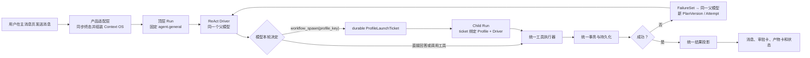
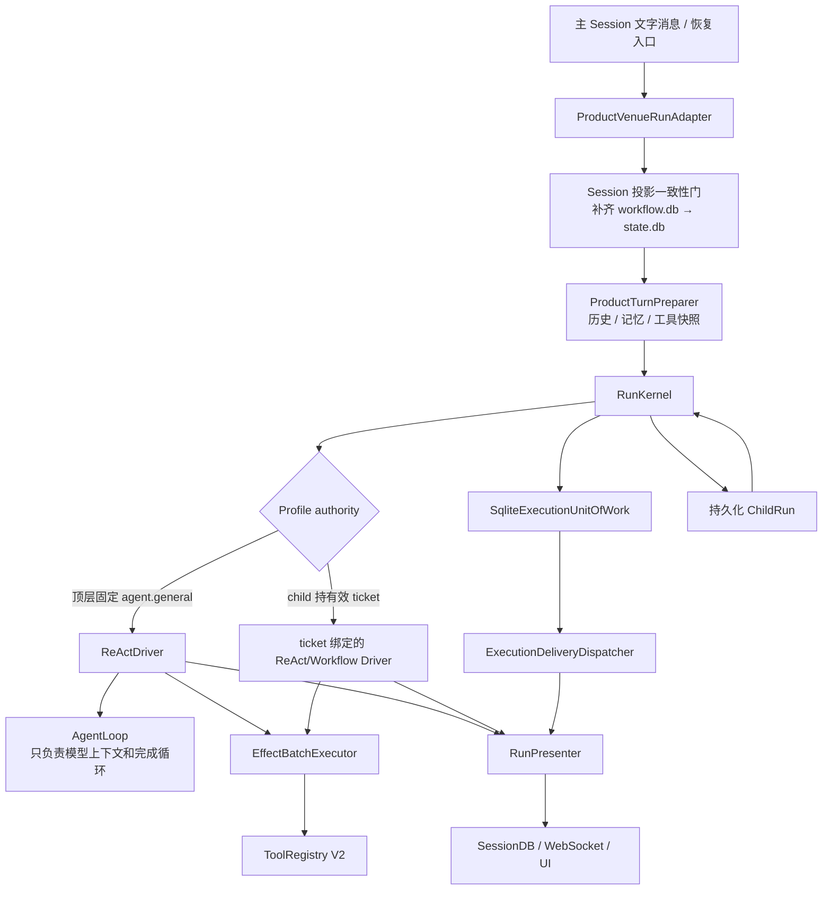
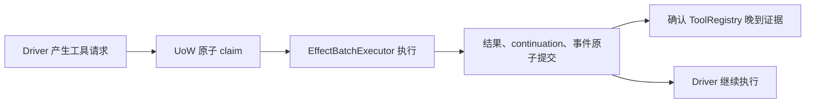

# simple_harness Agent Harness 架构

## 2026-09-05 Terminal audit and privacy combined source verification

Last updated: 2026-09-05. Reviewed terminal consumer is integrated into the
main-owned candidate.55 combined audit/runtime/preparation/privacy tests pass with
frozen Harness fd4a audit source and installed Memory0610. No audit exception
triggers business resend. Actual native043c regression predates this integration;
installed Harness successor audit and other producer coverage remain incomplete.
See [handoff](../plans/2026-09-05-agent-operation-audit/host-terminal-leaf/HANDOFF.md).


> 最后更新：2026-09-05
> 范围：多 conversation Sessions 与单一当前选择、请求生命周期、模型驱动 Profile 选择、运行状态、能力执行、
> 失败重规划、服务装配与子任务。

## 一句话说明

### Terminal Run audit candidate（2026-09-05）

隔离 Host candidate `eaccab33 + 3e911c14` 在真实 foreground terminal 提交后唤醒默认开启的审计 lane；
独立 Host `operation-audit.db` 保存读取 started/settled、固定 SDK snapshot/cursor、页与
按实际 operation/rule 去重的 finding/source 关联。无首个持久页的 unknown 可用新 generation
恢复；已有 snapshot 禁止 live fallback。审计库初始化失败明确降级，不阻断 foreground。
当前仅 terminal foreground 来源，不做 calls/usage/cost 总计，DTO 条数不代表物理调用。
旧 Harness0.7.2 明确 capability unavailable；新能力验证使用固定 fd4a Harness source overlay。
Memory carrier、其他生产者、完整历史 coverage 与 installed successor/native 验收均未完成。
[接口与验证边界](../plans/2026-09-05-agent-operation-audit/host-terminal-leaf/HANDOFF.md)。

### S5b episode 首次观察时间（2026-09-05）

分析专用 evidence 读取从同一 Host SQLite 行获得签名 envelope/receipt 与首次 `committed_at`。
初次分析和 durable response 恢复均把该时间交给 episode 编译，排队与重启不改变它；合法 0.0
不再回退到分析时钟。该值表示 Host 首次持久化观察时间，不声称是外部事件实际发生时刻。
既有 `read_admitted` 二元接口、receipt/envelope hash、schema 与历史结果不变，已附着结果不重写。
新增真实持久化/重复入库/延迟/重开/零时间五例先红后绿，相关 26 条通过，主执行者复审接受；
见 `backend/tests/memory/test_analysis_episode_time.py` 和本机
`.local-test-evidence/2026-09-05/human-memory-resume/independent-review/a14-q1-fix/`。
修复默认生效；当前受影响集合 150 passed。新真实入口遭第七次 Provider handoff 后的传输 unknown，未到 analysis；该试次 FAIL 并保留，无重发。不能用确定性测试代替 A14。

### 当前 route 恢复链（2026-09-05）

Harness 0.7.2 的 v0 checkpoint anchor 与 current checkpoint 分别核验；合法 route 后授权/重启继续同 Run。
Host exact wheel 已接入，两个独立真实生产 root 已完成 effect/closure/outbox/analysis；
详见 [当前验证与边界](PROJECT_STATUS.md#2026-09-05-harness-072-接入与当前验证)。
episode 时间 P2 源码与确定性回归已闭合，真实生产复验和 machine gate 尚未通过。

### S5b SDK route 恢复 P1（2026-09-05，旧候选复现）

Host `26b50ee8` / Harness 0.7.1 / Memory 0.6.3 的真实 A14 Run，start snapshot 的 initial route
为 host_initial/resume_existing；合法 context_route 后 checkpoint v4–v49 的 current 为 continue_active，
Run、TaskScope、binding revision 未变。后续 task_scope_update 已收到 exact public allow，恢复时报
`ReAct checkpoint initial Context route differs from start snapshot`，SDK/Host terminal FAILED。
README 已写 1.2.0，closure pending、accepted/head=0；不能把文件效果当收口成功。
用户已批准限定修复 initial/current 校验及必需 port/回归/新候选接入（Memory acceptance A17），
其余 SDK 功能冻结，保留 immutable initial、current 合法来源及权限/重放不变量；SDK 源码修复已提交
`2b8428465cbd41032ba024a0b7199183161f5ecd` / 0.7.2 并经 review，Host 安装与真实生产复验尚未闭合。
原始记录与 SHA-256：`.local-test-evidence/2026-09-05/human-memory-resume/tools/HANDOFF-SDK-ROUTE-FAILURE.md`；
r5 已 metadata attach，S1 FAIL/S8 FLAKY 保留。新 Memory wheel 的 UI 成功仅覆盖 chat_v2 通道。

### S5b post-turn attempt 恢复竞态（2026-09-05）

恢复者观察到 `reserved` 后，必须用限定旧状态的原子更新将该 attempt 标为
`failed/reserved_abandoned`，成功才可预留新 attempt。若原 sender 已推进为
`handed_off`，恢复者返回 blocked，不能覆盖发送状态再发起第二次 Provider 调用。
adapter 创建失败同样仅结算 `reserved`；传输与 Provider 失败仅结算 `handed_off`。

决定性回归 `test_reclaim_cannot_mark_concurrent_handoff_not_sent` 使用真实 store 和事件屏障
复现过期 lease 与交接交错：旧实现出现两次调用，修复后仅一次且无第二条 attempt。
相关 35 条自动化通过，独立复审接受 IR-01；原始日志保存在
`.local-test-evidence/2026-09-05/human-memory-resume/`。此结论仅覆盖该竞态，
不替代 S5b 真实运行栈、冷启动、UI 与完整机器门验收。

### Project-scoped Skill 安装与验证 Run（2026-08-29，当前）

`skill_install` 是 SDK catalog 中唯一 model-visible 安装 Tool，但执行 owner 位于 Host 的
`ProjectSkillInstallService`。SDK prepared authorization 先冻结 exact source/member/Project 摘要，再由真实
UI 决定；durable SDK decision、Product saga handoff 与 Host receipt 全等后才进入 handler。恢复路径从持久
artifact/grant/saga 重建，不依赖进程内 `_facts`，也不重跑 branch HEAD。

Manager commit 后 service 创建零 Provider、零 Effect 的 canonical `skill.install.verify` Run。该 Run 和普通
Run 使用相同 trusted workspace admission、Capability Hub snapshot、owner-aware Store query、catalog lease
及 frozen instruction resolver；只有全部成员按 exact manifest/content/scope hash page-in 并持久化 attestation
后，install intent 才能从 `published_pending_runtime_verification` 进入 `succeeded`。启动恢复只 supersede/release
失败或未知 verification attempt，并复用原 Manager receipt 续验，因此不会重复授权或发布。

2026-08-29 macOS 隔离 debug App 已用真实 UI 完成 `plan-test-skill@4d8c803ba03b…` 安装；第四次
verification attempt attested，Capability Center 从当前 Project Session 显示三个 Project Skill 均健康。前三次
失败 attempt 被 durable 保留并 supersede，分别对应本轮已修复的 start fingerprint、resolver composition 与
owner propagation 缺陷。slash help/schema/dispatch 现复用当前 Session 的同一 Project catalog 投影，selection
仍产出 exact `PreparedSkillInvocationScopeV1` 并交给 frozen resolver，不按 live name 重新选版本。真 UI 输入
`/plan-` 已显示 `plan-bs`、`plan-task`、`plan-test`；projectless 对照不含三项。

### SDK-first 统一能力目录（2026-08-25，当前）

前台 ReAct Run 使用 Harness `0.6.4` candidate 的公共 `RuntimeToolCatalog` 与 per-Run
`CatalogRunToolExposure`。Host 将 built-in、健康 MCP、Skill metadata 和 Workflow profile 映射到单一冻结
目录；fresh Run 只直出 compact kernel，其余 executable Tool 经
`tool_search -> tool_describe -> tool_activate` 在同一 Run 渐进披露。Provider ready attempt 每轮重新读取
exposure，reserved attempt、restart 与 terminal-effect replay 使用 durable v6 catalog/checkpoint。

目录只拥有发现和可见性。真实执行继续走 EffectExecutor、prepared authorization/HITL、TaskGrant、
workspace/origin scope 和 physical handler identity。动态 MCP admission 精确绑定 Run/session/request/scope
以及 MCP incarnation/execution identity，不把 activation receipt 当作 grant。测试阶段该能力默认开启。
模型可见的 `tool_describe` 结果只保留一个顶层 `schema_hash`，它就是 `tool_activate` 要求的 capability
hash；投影内部 input-schema hash 不再以同名字段重复暴露，避免模型复制错误值。严格 hash、一次性 nonce、
授权和 workspace 校验均保持不变。真实 `deepseek-v4-flash` 已分别在逐项手动授权与 Agent 全开模式完成
`search → describe → activate → write_file`，两次写入都只落在同一 immutable Project root。

2026-09-03（S5b 真实桌面 UI 验收 UI-B 抓到的缺陷 S5B-UI-F1）：**「本 Run 内不可激活」必须在披露侧说清楚，
拒绝侧必须给稳定码而不是不透明失败**。project-bound Run 会把进程级 `mcp:filesystem` 判为
`workspace_unscoped`（它的根是应用 userdata，不能重绑到 Session 的冻结 workspace，见
`PROJECT_BOUND_UNSCOPED_MCP_SOURCES`）。此前这类 capability 与普通 deferred 工具在 `tool_search` 里毫无区别、
`tool_describe` 照常返回 `activation_required=true`，而 `tool_activate` 抛出的
`tool_unavailable:workspace_unscoped` 在 `deskpet/sdk_adapters/tools.py::_result` 被压成
`tool_failed` / “Tool execution failed.” 且 Host 无任何日志——真实模型据此原样重试三次，直到
`react_repeated_tool_exceeded` 整 Run 失败。现在的契约：

- `tool_search` 结果对这类 capability 标 `activatable=false` + `availability_reason` + `next_action`，
  并在 Host 侧把可激活项稳定排在描述符项之前（SDK 按 token 命中排序，长 MCP 描述会盖过内建文件工具）；
  分页在重排后的列表上进行，cursor 语义不变。
- `tool_describe` 对这类 capability 返回 `activatable=false` / `activation_required=false` 与
  “不要调用 tool_activate”的 `next_action`，不再诱导模型浪费一轮。
- `tool_activate` 的拒绝返回**稳定 error_code**（`tool_unavailable`、`activation_schema_hash_stale`、
  `catalog_describe_nonce_invalid`、`catalog_capability_not_found`、`activation_scope_stale` 等，
  白名单字母表 `^[a-z][a-z0-9_]{0,63}$`）+ 一条可执行的 `next_action`，绝不泄露路径、堆栈或私密内容；
  Host 记 `tool_activate.rejected` 结构化日志（只含稳定码与 capability id）。
- 产品 Tool handler 可以通过返回 `error_code`/`public_message` 让稳定码穿过 `_result` 映射；
  任何不合白名单的取值仍退回不透明默认值。每个失败的产品 Tool 调用都会记一条 `product_tool.failed`
  （只含工具名与稳定码）。

决定性测试：`backend/tests/sdk_adapters/test_tool_activate_unavailable_disclosure.py`（用生产投影、
真实 registry 与真实 handler 复现 UI-B 的 Run 形态）。

同一轮 UI 重跑抓到 **S5B-UI-F2：模型漏填必填参数会打掉整个 Run**。冻结 SDK 0.7.1 的
`ToolRegistry.validate` 按 schema `required` 校验参数，缺项抛 `MalformedToolArgumentsError`，
kernel 据此记 `sdk_run_driver_failed` 并把 Run 判 `driver_failed`——发生在进入处理器之前，
模型没有任何自纠机会。真实 `gpt-5.6-luna` 用一次 `tool_search {}` 打掉过一整个 Run。
同一模型随后又用 `context_route {}` 打掉另一个 Run，再用 `agent_parallel {"subagents":[{…}]}`
（顶层字段在场、**数组元素**缺字段）打掉第三个——说明「把顶层 `required` 搬走」这条路根本不够：
冻结 SDK 的 `validate` 对**整张** schema 求值（顶层/嵌套 required、类型、枚举、范围、多余属性），
任何一条不符都是驱动级失败。

**定稿形态**：收口点放在 Host 自己拥有的 registry 子类 `ProductToolsAdapter.validate`——接住
`MalformedToolArgumentsError`、把失败按 call_id 记进一张模块级有界表并照常返回 Tool；`_sdk_tool`
包装层在**调用真实处理器之前**消费该标记：缺必填时返回 `missing_required_argument`（指名缺了哪些
参数），其余 schema 违规返回 `invalid_tool_arguments`（提示重读 schema、补齐含嵌套在内的字段、
去掉多余属性）。**处理器永远拿不到非法参数**，语义没有放宽——不合规照样被拒绝，只是拒绝从
「杀 Run」变成「模型可见且可重试」。该收口覆盖经 `ProductToolsAdapter` 注册的全部产品 Tool，
含动态 MCP 工具。

`required` **保留在发布给模型的 schema 里**。一度把它摘掉，使 66/77 个工具对模型呈现为「全可选」，
反而放大漏填概率，且属于已批准的模型可见契约缩水（独立审查 F-1）；校验失败既已被接住，摘除不再必要。
Host 侧另存一份同样的清单，只为在拒绝时能指名道姓。空串是合法的必填取值（`write_file(content="")`
是合法的写空文件），只有缺失与显式 `None` 算缺参。

三个 capability bridge 工具（`tool_search` / `tool_describe` / `tool_activate`）走另一条注册路径，
在各自处理器里做同样的校验并额外给出 `next_action`。

新增日志（`tool_arguments.missing` / `tool_arguments.invalid` / `tool_activate.rejected` /
`product_tool.failed`）的字段**拼进 message** 而不用 `extra=`：本项目 structlog 的 `foreign_pre_chain`
没有 `ExtraAdder`，`extra=` 的字段在渲染阶段会被整体丢弃（独立审查 F-5 实测），断言也必须落在
渲染后的消息上，否则是假绿（F-6）。


仍登记一条**上游 SDK 义务**：`MalformedToolArgumentsError` 本身宜由 SDK 直接作为模型可见的 rejected
ToolResult 返回，而不是驱动级失败，待 SDK 0.8。

2026-09-03（同轮 UI 验收抓到的 **S5B-UI-F3**）：**委派类工具在前台 Run 里恒不可用，拒绝必须让模型看得懂**。
`agent` / `agent_parallel` / `spawn_team` / `spawn_subagents` 属 `SDK_DIRECT_TOOL_KERNEL`，每个前台 Run
都直出可见；但它们在产品目录里绑定的是 `product_delegation_tool_catalog()` 的占位处理器，而真正的执行
入口 `build_subagent_batch_delegate` **全仓零调用者**——SDK 前台路径上这四个工具必然落到占位符。

冻结 SDK 对 handler 抛出的**任何**异常一律回成 `tool_handler_failed` / “Tool execution failed.”
（异常原文只进 Host 日志，且因含空格被收敛为 `unclassified`），所以"抛异常"无法把原因传给模型。
真实 `gpt-5.6-luna` 因此判断不出"这条路在本 Run 走不通"，反复重试委派直到 `react_max_turns_exceeded`
打光整轮，实测两次（`20260903T1200-uiB` / `20260903T1230-uiB`），并因此拿不到 README 里程碑。

占位处理器改为**返回**稳定错误载荷而不是抛：稳定码 `delegation_unavailable` + “不要重试这四个工具、
请用已暴露给你的工具（file_read / file_grep / edit_file / write_file 等）自己完成”。
**fail-closed 语义不变**——什么都没有被执行，只是拒绝从不透明变成可行动。委派本身的接线属委派子系统，
不在本增量范围。

2026-08-29，user-global Skill 安装进入同一 SDK-first 目录：每个前台 Run 在 publish lock 内冻结 exact
user-global Hub snapshot，并把 body-free Skill records 合并进 Run catalog。`skill` namespace 由统一的
`product-skill-catalog` authority 管理，具体 pack owner 与版本/hash 留在 metadata；因此 builtin 与不同用户
owner 可以共存而不会发生 namespace owner collision。真实 `deepseek-v4-flash` 已在冷重启后的旧 Session
和新建默认 Session 中分别完成 `tool_search -> skill_invoke`，两次加载相同的 `plan-test` content hash。
slash help/list/schema/dispatch 现从同一 user-global frozen snapshot 构造 collision-checked catalog；输入新的 `/`
会重新拉取候选，slash frame 固定客户端 request/turn identity。Session owner 也改为在创建事务时动态冻结，
避免启动装配早于 identity ready 时生成 ownerless Session；历史空 Session 仅可在 ingress 幂等绑定当前 owner。
当前 macOS UI 已在显式选择目录的新 Session `21030143…` 中显示三项 `plan-*` Skill，并完成真实
`/plan-test` Run `ea0488e47…`，日志确认 `sdk_skill_instruction_loaded` 与 `deepseek-v4-flash` HTTP 200。

2026-08-30 冷启动校准：`BindableSkillInstallRuntimeVerifier` 在 Capability runtime 初始化阶段保持未绑定，
只在 `ProductSdkRuntimeStack.start()` 完成且正式 `SkillInstallVerificationRunService` 已接到同一 ingress 后绑定
一次。不得用 Manager-only manifest verifier 抢占该 holder，否则随后正式 fresh-Run verifier 会因重复绑定让
backend 启动失败，且即便允许覆盖也会模糊 runtime page-in proof 的唯一 owner。当前 0.6.4 debug `.app` 已在
隔离 userdata 中完成真实冷启动，日志确认 SDK ingress open、权限 `auto`、Provider catalog HTTP 200，窗口显示
`deepseek-v4-flash` 与“已连接”。

2026-08-30 安装验证补充：user-global batch 在 fresh-Run proof 前仍是 `pending_invisible`，因此 verifier
不能只冻结当前已激活 Hub catalog。Host 现在为该 verifier Run 构造 exact Manager-published version/hash 的
verification-only immutable overlay lease；overlay 使用同一个 `user:v2:*` owner，但不会发布到前台 Run。
page-in、SDK terminal、lease release 与 durable attestation 全部成功后，Manager 才原子写入 active user
bindings。空白消息页创建 Session 时也不再把 transport 占位 ID 当成 source Session。真实
`deepseek-v4-flash` UI 安装 `plan-test-skill@3a094db…` 已得到 intent `succeeded`、attempt `attested`，第二个
新 Session 的 slash catalog 同时看到 `plan-bs/plan-task/plan-test`。

2026-08-30 真实多 Skill 仓库校准补齐了运行时资源与恢复协议。canonical pack 现在保留
`skills/<skill>/...` 的仓库内相对布局，`skill_invoke(resource_path=...)` 只从当前 Run 冻结的 exact
manifest/version/content snapshot 读取文本资源，并做 pack 边界、256 KiB 与 content hash 校验；packager
build identity 升为 `simpleharness.pkg2`，避免新 canonical bytes 与旧不可变版本冲突。SDK FrozenJson 在授权、
交付与 legacy handler 边界统一递归 thaw，legacy 同步 handler 移到 worker thread，避免嵌套 `mappingproxy`
序列化失败和事件循环自锁。安装恢复使用持久化的完整 Manager receipt（含 members），将 SDK admission
终态失败作为零副作用可审计失败释放 lease、supersede 后续验；attestation 与全局 binding activation 之间的
崩溃窗口也会在冷启动幂等收口。Skill 验证 Run 绑定 SDK 实际持久化 Tool Catalog 的 generation/fingerprint，
不再混用产品 runtime generation。

同日 macOS 真 UI 在 TokenSeller 新 Session `ec89714c…` 重放 `/plan-bs`：slash 固定到
`plan-bs@0.0.0+git.3a094db39db5.simpleharness.pkg2`，先后读取 `../plan-test/config.md`，创建六步 Todo，
并按 `tool_search → tool_describe → tool_activate` 激活 workspace 文件工具，最后只提出两个头脑风暴澄清
问题并回到 idle。延迟 Tool 提示现在明确要求 describe 后必须 activate，防止 DeepSeek 直接调用尚未披露
的目标 Tool 而触发 `capability_denied`；nonce/hash/授权与 workspace fence 均未放宽。

Realtime voice 当前临时关闭：UI 不暴露开始通话入口，Host 不构造 Service SDK Realtime service；保留的
WebSocket 路由在 disabled 状态 fail closed。重新开放前必须显式翻转前后端产品开关并重新做真实 Provider
验收。

Provider 调查日志由 Host `ProductProviderAdapter` 在真实 SDK invocation seam 统一生成：匿名
`request_ref` 串联 attempt start、HTTP response shape、parse failure 与 terminal outcome；阶段码明确区分
`transport_timeout`、`http_timeout`、`http_status`、`response_protocol`、`response_contract` 和 `adapter`。
允许记录 model、状态码、耗时、消息/Tool 数量、schema bytes、Tool 名称集合摘要和响应结构计数；禁止记录
API key、endpoint URL、prompt/response 正文、Tool 参数及上游 request ID 原文。

当前产品 exact bytes：Service `0.3.12` / source `47f372a…` / wheel `710ae66b…`；Harness `0.6.4` /
source `21f3c7a…` / wheel `ecb6e85c…`；Memory `0.5.2` / source `46624b…` / wheel `deff2fa8…`。Service
release manifest 记录的构建时 Harness 成员仍是 `0.6.2`；产品消费端依据 Service 的 `>=0.4,<0.7`
约束独立准入 `0.6.4` candidate。`0.6.4` 未 tag/release，不把这个混合消费组合写成官方 release unit。
自动化与分片基线已绿。2026-08-25 CAP-1 真 UI 修复先让 SDK
authority 与 legacy ToolRegistry 共用启动期 scope Store，再把物理 registry 的真实 policy fingerprint 冻结进
RunStart authority；严格 stale 校验仍保留。最终 Run 在同一 root 中完成 search/describe/activate，Provider
工具数 13→14→15，真实 `mcp_filesystem_search_files` 与 `mcp_filesystem_read_text_file` 均成功，并基于
README 正文返回正确摘要。CAP-1 已通过；其余 gate 状态见下文，完整 UI acceptance 和发布仍未关闭。
2026-08-25 随后完成 CAP-2：Host 把经校验的 loopback `DESKPET_LOCAL_PAGE_URL` 冻结为项目/任务事实，
Playwright MCP 启动前将其精确 origin 合并进 allowlist（参数与 execution build identity 同源）；默认配置仅允许
`localhost/127.0.0.1` 的开发端口，不开放公网。真实 UI Session
`7b03b54a-17da-4345-b8ef-95ee0200a008` 经 search/describe/activate 后实际导航固定 15193 fixture，读取并返回
`Simple Harness Capability Catalog Fixture`。CAP-1/CAP-2 已通过。
2026-08-25 CAP-3 随后关闭：SDK Run 的 `skill_invoke` 改用 Run authority 生成的完整
`ToolExecutionContext`，不再由 Host 重建并遗漏 `capability_snapshot_ref`；冻结 Skill resolver 先查 SDK
Run catalog，仅在没有 SDK Run 时回退 legacy catalog。候选 SDK catalog 搜索对保守英文词形前缀做匹配，
而 capability ID 与可调用 locator 分离。真实 UI Session
`19d3bc29-78b0-4897-a1df-b7fa28be9476` 搜索并调用 `translate-doc`，日志确认正文只加载一次，最终 H1/H2/H3
及三条列表完整翻译。CAP-4 真实 UI Run 又验证公网导航在 Playwright 客户端以
`ERR_BLOCKED_BY_CLIENT` 安全失败，页面未打开且没有表单提交副作用。CAP-5 的完整 app/backend 重启对
验证新 root 从 13 个基础工具重新发现和激活；过期 nonce 被拒绝后重新 describe/activate 自愈，最终到 16 个
工具并读取 README。Host 随后从 vendored exact 0.6.2 wheel 同步，在无 `PYTHONPATH` 的 packaged macOS app
中再次完成 13→14 与真实 README 读取。source `67f5769…` 的最终 reproducible wheel `ffb7c061…` 与完整
真测 wheel 的运行时包逐文件相同；Host 重锁、重装后又完成无 `PYTHONPATH` 冷启动与可操作 UI 冒烟。
CAP-1～CAP-5、exact-wheel consumer 与 packaged UI 均通过；候选仍未 tag/release，因为本次只授权代码提交
到远程主分支，没有授权 SDK tag、release 上传和 download-back promotion。

### Harness 0.3 / Memory 0.4 官方一等组合（2026-08-22，历史）

前台 root 与 continuation 已从 0.2 consumer-prepared 过渡到 Harness 0.3 官方 Agent Memory
production composition：产品只提供可信 `AgentIdentity`、一个 borrowed `MemoryManager` 与 read-only
非 Memory Context provider；SDK 每个 Turn 自动完成一次 recall、冻结 stage、terminal-only committed-turn
outbox、重试和恢复。root 与每个 continuation 使用各自 immutable source snapshot ref，普通 foreground
catalog 不再暴露第二次 live recall，非 Harness product outbox 按 provenance 保留。

当前 exact bytes 为 Harness `fbb156f` / `v0.3.0` / wheel `cf629cee…` 与 Memory `3d4247b` /
`v0.4.0` / wheel `bfcd2506…`；候选 source、主分支与 tags 已推送，冻结 wheel/sdist 已正式发布到
对应 GitHub Release，并通过公开稳定 URL 下载回验。simple_harness
自动化与真实 macOS Computer Use + DeepSeek 的 SH-M1～SH-M6、SH-SURFACE 已通过。下方 0.2.0
composition 章节保留为历史切换记录，不再代表当前生产入口。

### SDK 生产 composition 启动修复（2026-08-21）

生产 `ProductSdkRuntimeStack` 的 `runtime_factory` 分支现在由
`ProductionRuntimeBuild.workflow_registrations` 显式返回 ready publication 所需的 workflow
事实，不再读取仅由 fallback builder 创建的局部 `workflow`。动态回归会真实启动该分支、确认
`phase=ready`、registrations 发布与正常关闭；SDK adapters `171 passed`，SDK/Memory/outbox/reset
聚焦组合 `90 passed`。

### SDK 0.2.0 consumer-prepared Context 与 Memory 双 outbox（2026-08-21）

前台 root 与 continuation 已切到 SDK `consumer_prepared`：Host 用稳定 request/continuation
identity claim `ContextStagingRepository` lease，只有 owner 执行 Persona、历史、Skill、附件和一次
bounded Memory recall；完整私有 provider messages 以 projection-v2 stage/hash 为权威，随后才写公开
snapshot 并 start/signal。召回 Memory 是 `USER` 角色的 `untrusted_data` segment，不再伪装成
SYSTEM 指令；winner stage 可由并发 caller 或崩溃恢复复用，避免二次 recall。

Harness root/continuation、Presenter 和 SDK 派生 SessionDB projection 明确标为
`memory_authority=harness`，由 SDK execution memory outbox 唯一写入 Memory。非 Harness 的普通产品
conversation message 则在 `state.db` 同事务写 `product_memory_outbox`；dispatcher 使用 frozen
`state_db_instance_id + user_id + session_id + source_event_id/hash` 做 CAS claim、lease reclaim、重试、
dead-letter、ack 和有界 cleanup。tool/workflow/companion/excluded projection 不进入该 outbox，旧的
事务后 best-effort `MemoryBackend.append_message` 已删除。

每个 Session 的 Memory user 由 `memory_user_bindings` 一次绑定且不可变；Memory recall/facts/twin 与
owner-scoped tool 都显式携带或从该绑定解析 `user_id`，跨 user/session mismatch fail closed。开发期
schema 变更使用 `reset_agent_data.py` 在服务停止且显式确认后精确删除并空库初始化 state/execution/
memory 三库及 sidecar，不提供面向最终用户的运行时“全面抹除”。能力默认 ON。

精确候选为 Harness `0.2.0`（source `869c76f2050b5f492b4edee68f4ce2400030b832`，wheel
SHA-256 `e1f7d4b10f6d02c071b8fabfddeaf52b48f60431cba0fefca1aa349c7be3d233`）与 Memory
`0.3.0`（source `87820fe2c4cdde21c3a9356ca461b93fe00aadcb`，wheel SHA-256
`6f0682fdcd958a666e52a294ba5c6e4e721bed53f1669f1f7af63cd33027f014`）。D1 58、D2/exact
17、Rust diagnostics 4、D3 615 项与 build 已通过。simple_harness macOS 真人消费者回归已补齐：
CTX-1～CTX-5、Provider/Session/Context/附件/历史重启与停止恢复 critical surface smoke 全部 PASS；原始证据
只保存在 ignored `.local-test-evidence/2026-08-21/sdk-context-consumer-regression/`。

### 文本附件与取消回执恢复边界（2026-08-21 真人回归修复）

消息页现在提供可见的文本附件入口，支持 `.txt/.md/.csv/.json/.yaml/.yml/.log`，单块上限
8 MiB、单轮合计上限 16 MiB。Host 在 consumer-prepared private stage 中保留结构化
`input_text` block，并将正文纳入附件预算；公开 Context snapshot 只投影附件种类、数量和估算
token，不投影文件正文。只有到 OpenAI-compatible Provider wire boundary 时，`input_text` 才降低为
Provider 支持的 `text` block，因此 SDK 对 consumer-prepared message/hash 的一致性检查不会被破坏。

Provider terminal outbox 允许取消/超时回执只携带 `budget` 元数据而没有 token measurement。
Projection pump 现在只把嵌套 `usage` 或含 token measurement key 的旧直出对象当作真实 usage；
budget-only `unknown` 仍会记录 attempt 并推进有序 cursor，但不会伪造 Context usage。真人停止后现场
cursor 从 sequence 24 重放到 27，下一真实 DeepSeek Run 完成、Context usage 更新且 UI 回到空闲。
对应自动化为后端聚焦 `102 passed`、InputBar `20 passed`、TypeScript PASS。

### SDK Context authority cutover 缺口（2026-08-21 代码校准）

> 本节是切换前校准记录；上节 0.2.0 consumer-prepared 链路已关闭其中 Context/Memory 缺口。

当前前台文字生产链不是本文历史章节所描述的
`ProductVenueRunAdapter.open → ProductTurnPreparer`。真实可达链路为：

```text
chat/chat_v2
  -> _run_product_harness_chat (构造 TurnInput，但没有下游消费)
  -> _execute_sdk_run
  -> _assemble_sdk_messages
  -> SdkRuntimeIngress.start
  -> ProductProviderAdapter.invoke
```

`_assemble_sdk_messages` 当前只发送公开工作叙述 system prompt、最多 20 条
`context_visibility=conversation` 且 projection/role allowlist 通过的历史，以及当前用户文本；
SDK Provider 另接收当前产品 Tool catalog。Persona、召回 Memory、Skill 指令、附件、项目/任务
快照、Context OS budget/compaction、会话 thinking/fast/effort 尚未被这条链路冻结。保留的
`ProductTurnPreparationService`、`ProductVenueRunAdapter.open` 与 `ProductContextAdapter` 对普通文字
入口不可达，下文关于它们的描述是目标边界或 cutover 前历史，不能当作当前生产事实。

同一 SDK Run 内，assistant tool call、tool result 与 DeepSeek 私有 reasoning metadata 仍按 Provider
协议回送；私有 reasoning 不落 SessionDB，新 Run 历史只读取普通 conversation 投影。这个正确边界
不能替代缺失的完整首轮 Context 准备。

已确认的相邻生产缺口还包括：Session `model_params` 未传到 `ProductProviderAdapter`；全局 SDK
stack 通过 provider/model refresh 切换并串行化前台 Run，后台入口可能与切换竞态；RunStart 的
catalog generation 被固定为 `1`；若工具 handler 查询 execution context，会得到静态
`sdk-session/sdk-request/sdk-scope`，而非本次 Run 身份；SDK usage 未桥接到 Session context usage 与
现有 BillingLedger。修复前，Context Inspector 的 legacy 独立估算也不能作为真实请求证据。

### SDK Run 停止身份与取消收束（2026-08-21）

消息页停止操作始终携带产品层 canonical `root_run_id`；Host 在 SDK Run 存活期维护
`root_run_id -> product-sdk-*` 的有界映射，只把 SDK 内部 id 传给 Runtime Client。映射在
SDK start 前注册，覆盖最早 Provider/tool 活动窗口，并在所有成功、失败和取消出口清理。这样
UI 不再把 canonical id 误传给只认识内部 id 的 SDK，也不会因 `KeyError` 击穿 control WebSocket
后让任务继续运行。

Provider 请求已经物理 handoff 后，SDK invocation ledger 仍可按副作用安全规则结算为
`unknown`；这与用户要求停止整个 Run 是两个不同事实。产品 Provider coordinator 只在取消 token
已确认时，把这条 invocation-level unknown 重新传播为 Run-level cancellation，使 Kernel 收束为
durable `cancelled`，同时保留 provider invocation 的 unknown 账本供对账。Host 对已确认的用户取消
不会再把瞬时 `running/waiting` 查询结果投影成 `run_failed`；`chat_v2_interrupted` 负责唯一的 UI
取消投影和输入区复位。

永久回归覆盖 canonical/internal id 翻译、start 前注册与 finally 清理、缺失 id 幂等、Provider
handoff 后取消和瞬时 waiting 不漂成失败。2026-08-21 Computer Use 真机 Run
`131d90558c0759679743fd636d8169f7` 在点击“停止”后约 0.7 秒收束为 `cancelled`，没有继续回复、
`run_failed` 或 WebSocket 重连。

### 执行时间线与模型上下文边界（2026-08-20 校准）

Inspector 的“Agent 执行过程”是 canonical Run ledger 的只读公开投影。阶段、工具动作、状态、
耗时、脱敏输入/结果预览和技术记录可以显示并持久化为 observability，但都标记
`context_visibility=exclude`，不会作为普通消息、system fragment、memory recall 或 follow-up
历史再次送入模型。当前执行轮中模型协议要求的 `tool_result` 仍然属于模型上下文，这是执行协议
而不是 UI 时间线的回灌。实现细节见 `ARCHITECTURE.md` 的 timeline boundary 小节。

### SDK 工具执行与终态收束（2026-08-20）

SDK Runtime 的内部 `product-sdk-*` execution id 只用于 SDK checkpoint、effect ledger
和 delivery registry；产品 UI、SessionDB 与 `chat_v2_final/error` 始终使用 Host 预留的
canonical `root_run_id`。这样 run-start 与终态投影落在同一条前端 Run projection，回答完成后
输入区会回到 `发送/空闲`，不会残留“停止/工具执行中”。

SDK 产品授权适配器同时接受旧测试 fixture 的 callable policy 和正式 Host
`policy.decide(prepared, request=...)` 端口。正式 SDK 桌面装配走后者，工具 effect 才能完成
prepare → handoff → invoke → settle；授权异常不会再被误报成无上下文的 driver failure。

完整 77 项 SDK 工具目录在组合时会把 `memory_recall` 动态绑定到
`deskpet.memory.recall_adapter` 的 owner-scoped 真实适配器，不再依赖已退休的 legacy registry
authority。清单中为历史会话兼容而保留的 `memory_forget/read/search/write` 由 import-safe
兼容处理器明确返回 `memory_sdk_unavailable`；它们不会重新引入已删除的旧内存存储栈，也不会再
因处理器模块缺失导致整个 Agent 工具目录构建或运行时调用崩溃。

simple_harness 当前可持久保存多个 UUID conversation Sessions，产品窗口同一时刻只选择其中一个作为
当前主会话。每条普通新消息都在所选 Session 中创建一个独立顶层 Run，顶层 Profile 固定为
`agent.general`；当前 SDK 生产文字入口的后续普通消息同样创建 fresh root，历史 durable continuation
FIFO 只保留在下文的旧链路记录中。

`RunKernel` 不读取用户原文来猜领域，也不靠正则选择 Driver。通用父 Agent 在真实模型轮次中
直接回答、调用工具，或调用 `workflow_spawn` 选择一个 child Profile。Host 校验 Profile
Catalog 后签发一次性 durable launch ticket；child 的 Profile 和 Driver 只由这张 ticket
绑定。所有 root/child 共用同一套运行身份、状态、工具执行、持久化、恢复、取消和结果投影。

Companion 成长语义也不再拥有前置执行 authority。每条 committed 用户消息仍进入
Companion ingress outbox；生产 Text 入口不再为了 `growth_signal_kind` 运行
IntentTriage。当前直接路径以 `none` 结算语义优先级，后续 reflection 仍可读取原始消息，
但不能借成长分类抢先回答、澄清、计划或阻止主 Run。

旧 Voice（VAD → ASR → Harness → TTS）入口已于 2026-07-28 关闭：
`[voice].enabled=false` 是后端单一开关，默认启动不会导入、创建或加载
Silero VAD、faster-whisper、EdgeTTS/CosyVoice；两个前端窗口都不建立
`/ws/audio` 连接，也不申请麦克风。`/ws/audio` 对已鉴权的误连返回稳定
`voice_temporarily_disabled`。2026-08-30 当前候选另行接入 `/ws/realtime-voice`：Service SDK `0.3.12`
拥有本地 loopback protocol、provider transport 与 Realtime lifecycle，前端只在显式开始通话后连接和申请
麦克风。它目前只承载 provider-native voice，不创建 Agent Run；真实 Provider 连续多轮 E2E 尚未重新验收。
如果后续语音请求需要 Tool、Workflow 或产品 Context，则必须进入 `ProductTurnPreparer`/RunKernel，不能让
transport 成为第二套 Agent authority。

## 用户看到的流程



一个主 Session 可以同时拥有多个彼此隔离的顶层 Run。任务窗口只是这些 Run 的 UI 投影；
打开、切换或关闭窗口不改变 Driver、Profile、工具集、授权或运行状态。当前没有 Code 模式
与普通模式之分。

### 当前 Session 到 workspace 的真实边界（2026-08-25）

项目 Session 现在由 state.db v33 的 immutable `session_project_bindings` 唯一决定 workspace；新建时
`SessionCreationService` 在同一事务中持久化 Session、Project binding、Provider snapshot、request receipt
和 catalog revision。重复 request replay 返回同一个 Session，冲突 intent 被拒绝。无 binding row 的普通
Session 是显式 projectless，本地开发能力 fail closed；“在项目中继续”只能创建带 bounded handoff 和
`source_session_id` 的新项目 Session，不能原地改绑。

每个 fresh root Run 先由 `ProjectBindingService` 返回 tagged `WorkspaceResolutionV1`，再冻结为
`TaskWorkContext.workspace_root`、Host `workspace/write_scope_root` 以及 SDK Run tool authority v3。
terminal/file/project-rules 等所有物理消费者只按 `run_id` 读取该 app-private authority；project-bound Run
不暴露使用进程级固定根的动态 `mcp:filesystem`，浏览器与非文件 MCP 不受影响；前端临时路径、
模型文本、latest-Run workspace 和 retired `code_sessions` 均不能覆盖它。projectless、目录缺失、identity
漂移或缺 authority 时在 dispatch 前 fail closed，不使用全局默认 workspace。

普通 Project Session 的 `execution_kind=project_root`，有效执行根随 Project 的受控同身份 relocation 更新；
`explicit` binding 可保存与 `project_root` 不同的 execution root，供测试 fixture/未来 worktree 使用。
relocation 以 project revision CAS 并在 active root Run 存在时拒绝，Session binding 不变。v33 不再把
legacy Code mapping backfill 为新 binding：从任意旧 schema 升级时，startup 在所有 Session/Memory/Workflow/
SDK ingress 前一次性清空旧 Project、Session、消息、Run、上下文和会话派生投影；全局 Provider、默认模型、
应用设置、Keychain、账单、Skills/Plugins 以及真实项目/产物文件不在清理范围。清理使用可恢复 phase ledger，
完成后才开放新数据写入。`facts` 作为历史可选表按存在性清空；workflow 与 SDK product-state 精确清除
Run catalog/runtime/snapshot lease；companion 精确清除 Run binding、job/wait、growth event、偏好/证据、
消息决策回执、owner Memory scope、notification/outbox 与 run-growth snapshot/dependency，同时保留 candidate
package、capability activation/version、growth authority、profiles 与 reminders。workflow 的
`execution_runtime_state` 及 candidate draft receipt/material 也是全局运行/安装 authority，重置必须保留；
清空带 immutable delete trigger 的 Run 表时只在同一事务内临时移除并原样恢复 trigger。

验证边界：authority/迁移/恢复自动化与 macOS 当前构建的注册、分组、projectless、Inspector、重启恢复核心
路径已通过。真实 `deepseek-v4-flash` Session 进一步证明 `builtin:run_shell` 的 cwd、`builtin:read_file` 和
`builtin:write_file` 都落在 immutable binding 指向的 Project root；对 `../unrelated` 的读写均返回
`tool_failed`，物理检查确认越界文件未创建且其他 canary hash 不变。修复重复 hash 后，手动授权 Run
`0c16b1f9…` 与全自动 Run `494ecb93…` 都完成真实激活和项目内写入，持久化 describe 响应各只有一个顶层
`schema_hash`。2026-08-26 的 missing-root 真实故障链进一步确认：dispatch preflight 会在不创建 Provider
invocation 或 Tool effect 的前提下提交 durable failed SDK root，并向 UI 投影稳定的 workspace-unavailable
提示；同身份 relocation 使用 revision CAS，选择无关目录失败，活跃 Run 不允许切根。重启 recovery 会把
目录已移走的在途 SDK Run 收敛到 failed terminal 并释放本项目 admission；恢复后两个 Session 的
binding、历史与 Inspector 保持。TC-PS-04 又以五个真实 root Run 对账终端 cwd、物理写入和 Project Rules：
前端、retired Code Session、latest-Run 与模型文本冲突路径均未覆盖 binding，三个冲突目录 canary hash
不变且无新增文件；目录缺失时 Provider/Tool 计数均为零，完整重启后 fresh Run 仍写回同一绑定根。聚焦
authority/Rules/preflight/Session 自动化为 `75 passed`。缺失根错误 turn 的跨重启消息历史显示仍作为独立
持久化观察项保留，不影响已证明的物理 fail-closed 边界。TC-PS-06 再用 explicit binding 证明归属与执行
可以安全分离：三个真实 root Run 的 Project ID/revision 保持，左侧与 Inspector 继续显示 Project root，
终端 cwd、相对读取和两次写入只落在不同的 execution root；Project-only 文件不可见，完整重启后第三个
Run 仍保持同一边界。聚焦 backend `109 passed`、frontend `3 passed`，没有自动 worktree 生命周期副作用。
Windows 已按用户 2026-08-25 的范围决定移为后续非阻断工作。2026-08-27 最终 gate 已完成冻结 testcase
S-PS-01～S-PS-08 的全部 macOS required lane：25 个 machine root Run、当前 debug `.app` 与真实 Provider
共同覆盖注册、重启/幂等、projectless handoff、单一 authority、侧栏/Inspector、root split、relocation 和
v33 reset。真实模型路径发现并修复自动 Tool effect 的 TaskGrant identity 冲突，以及 project-bound catalog
错误暴露 process-wide `mcp:filesystem` 的问题；最终 Run 的 terminal/read/write 只使用绑定执行根。
独立审计补测还确认外部非 Git Project、删除目录错误态、新建同项目 Session、复制/Finder 与窄屏 Inspector；
目录注册现在显式拒绝不可读/不可搜索路径，Session rename 会推进 catalog revision，旧分页游标不会跨
新增、删除或重命名静默混合快照。

2026-08-26 TC-PS-08 已在 macOS 当前 debug `.app` 验证 v32 旧数据升级到 v33 空状态、全局配置/凭据可继续
调用真实 Provider、磁盘项目文件保留，以及升级后新 Project/Session/消息/Run 跨完整重启保持。真实 root
Run `201db422…` 的无 `cd` 相对命令返回绑定目录为 cwd，读取和写入也只落在该目录。自动化覆盖 fresh v33、
v9/v17/v23/v31/v32 升级与十个 crash boundary 的 fail-closed/retry；Windows 不在本轮范围。
真实 schema 聚焦回归追加为 `59 passed`，并以 runtime state、candidate draft/package、billing、Skills/Plugins
文件与 growth authority 哨兵锁定全局保留边界；专项 v33 重置为 `19 passed`，含 trigger 异常回滚验证。
2026-08-27 当前 HEAD `8631ddcc` 又以完整 v32 隔离 user-data 通过真实启动：首次进入为空，SDK Runtime/
ingress 正常开放，真实 `deepseek-v4-flash` root Run `be702419…` 成功返回；完整重启后新 Session 与两条消息
仍在，证明 reset completed 后不会再次删除升级后数据。
companion 残留修复后的实现 `9424da77` 又从完整 v32 fixture 首次启动，旧 message/session/run payload 哨兵
归零；真实 Provider root Run `8f55d96b…`、`2dc7cebb…` 完成，正式新建 Session `15410cb4…` 的标题与两条消息
跨完整重启保持，且升级后新的 growth event/outbox 可继续写入。

### 当前 SDK 多轮消息与继续输入（2026-08-20）

生产文字入口现在统一通过 SDK ingress 启动 fresh run；后续用户消息不再进入已退休的
product-harness continuation launcher。Host 在启动每个 fresh run 前从 `SessionDB` 读取当前
Session 最近 20 条 conversation 消息，保持时间正序，只注入非空 `user/assistant` 内容；当前
`root_run_id` 已经持久化的用户行会被排除，再把本次输入追加一次，避免当前消息重复。历史读取
失败只记录 `chat_history_assembly_failed`，不会阻断本轮运行。记忆 SDK recall 仍是独立的语义
记忆补充，不再承担普通多轮对话历史的唯一来源。

下文描述的 durable continuation FIFO 是旧 product-harness 链路的历史设计记录，不是当前 SDK
文字入口的生产行为；对应 launcher/coordinator 辅助函数尚待独立死代码清理。

### 历史 product-harness 运行中继续输入

消息页输入区只有一个文本框和一个动态主按钮：

- 未输入文字且当前 Run 正在执行时，主按钮是“停止”。
- 输入了文字时，主按钮是“发送”。若当前选中 Run 为 `running/waiting` 且存在可信
  conversation boundary，该消息精确绑定 `root_run_id + task_scope_id + boundary_version`，
  不创建新的顶层 Run。
- 输入区会显示“发送到当前任务 · 将在安全边界读取”；新话题位于标题栏，
  语音图标明确显示暂不可用，不与发送/停止形成多个并列主操作。

模型绑定以 `state.db/code_session_provider` 为事实源。用户新建话题时，后端先在同一个
SQLite 写事务中复制来源 Session 的 `provider_id / preferred_model / model_params`，再发布
`session_switched` 和启动新 Run；复制失败则拒绝启动，避免界面显示 Kimi、实际 Run 却使用
默认 GLM。历史切换和应用重启会发送 `session_provider_get`，用后端回传的完整绑定恢复前端
状态。Provider 网络边界还统一执行模型级参数契约：`kimi-k3` 的 temperature 固定规范化为
`1`，覆盖全局默认值，流式、非流式和工具调用路径保持一致。新建 root 的 Host Context
同时冻结有序的 `provider_id + model_id` 精确绑定，`workflow_spawn` child 直接继承该绑定，
不再从运行中的可变 Provider Registry 默认模型二次解析；只保存 provider id 的历史 Run
继续走兼容解析，保证旧 checkpoint 可恢复。

Provider 的可选模型目录以成功的 `GET <base_url>/models` 实时响应为主事实源。每次模型选择器
取得非空 live 目录后，Registry 会在重新核对 provider incarnation、config revision 与
base URL 后，把去重目录原子写回 `config.toml` 的 `models`，作为重启或后续网络失败时的缓存；
相同目录不重复写盘，缓存刷新不递增 config revision，因而不会仅为目录同步使 Session binding
stale。若 live 目录缺少用户明确设置的 `default_model`，只展示本次 live 结果而不落盘，也绝不
静默改用其它默认模型。默认模型仍是独立的用户选择，不由目录刷新决定。

Persona 的平台片段继续使用稳定的 model/base URL 占位符，避免动态 Provider 身份破坏
Context OS 的跨请求缓存；真实 Provider 身份则由 `TurnPreparer` 已解析的 Session Provider
生成独立、受保护的 task-scoped fragment。该片段对模型明确给出精确 model id 与 endpoint，
不会回退读取全局 `local_llm`，也不会把 `runtime-model` 占位符当成真实身份回答用户。

Session/root 模型 authority 现在覆盖主调用与全部已登记附属 LLM callsite。调用点必须提交
`ProviderWorkloadContext(workload_class, callsite_id, purpose, session_id, root_run_id,
request_id, detached)`；`session-auxiliary` 从冻结 Root 或 Session binding 解析，缺身份、显式绑定
stale/disabled/model-missing 时稳定 fail closed，不再回退全局 chain。跨 Session 工作明确标为
`system-maintenance` 并使用 `BackgroundModelPolicy`。ContextVar 只把已解析身份送到 provider
底层，不拥有选择模型的 authority。Provider Registry entry 使用 durable incarnation/config
revision，Session binding 使用 epoch CAS，删除后同 ID 重建不能形成 ABA；路由 migration、registry
加载和 binding reconcile 完成前，产品入口与后台 router 都返回 initializing，不猜全局模型。

附属 provider 失败使用 workload breaker 按真实失效域隔离：credential、account、model、
provider+model+workload 或 endpoint。401/402/429/5xx 的后台结算不会改写已成功或仍可继续的根
Run；每次 attempt 只写低敏 provider/model/workload/callsite/root provenance。仅 DEV 可加载的
`ProviderFaultScriptV1` 支持按 Session/workload/callsite/purpose/occurrence consume-once 注入，
生产发现注入环境变量会直接拒载。注入位于 durable provider claim 后、物理 transport 前；
Session auxiliary 绑定 Root，child main 绑定 child-run correlation，detached maintenance 绑定
request correlation 且 session/root 保持 NULL，audit 只保存低敏 correlation hash。

运行中消息先由 execution UoW 在同一事务中预留 boundary version 并写入 durable FIFO。
`UserContinuationCoordinator` 等当前 Driver owner 释放后按 FIFO 调用原 Driver 的
`signal()`；绑定完成后通过只读 observer 投影
`chat_v2_continuation_status(bound)`，消息气泡从“等待 Agent 读取…”更新为
“Agent 已读取”。绑定失败或 Run 在绑定前取消时投影 `failed`。observer 失败只影响 UI
确认，不改变 durable continuation 结果；continuation ingress 自身被拒绝也不会把仍在
运行的目标 Run 误标为 failed。

### Run 预留、前台选择与公开执行摘要

新顶层消息的 `session_id + request_id + turn_id` 在产品入口即可确定 root Run 与
`task_scope_id`。入口在 Provider、Host 或 Context 准备前发送 `chat_v2_run_reserved`；
这只是客户端可见的确定性身份预留，不伪造 durable start。前端把对应本地气泡立即绑定到
该 Run，并把 projection 标为 `starting`。如果用户在 `chat_v2_run_started` 给出可信
conversation boundary 前继续输入，消息保留原 `request_id/turn_id` 进入本地延迟队列；
边界到达后才作为带 `target_root_run_id + task_scope_id + boundary_version` 的 continuation
发出。因此“首条还在准备、第二条已经发送”的窗口不会创建两个顶层 Run，也不会让第二条
气泡消失。

本地发起的预留 Run 优先成为当前选择；旧选择终止后，前端选择最新仍在执行的 Run。其他
真正独立的 Run 继续作为后台 projection 存在。Harness Inspector 在选中 projection 仍为
`starting` 时等待 durable row，不发送 snapshot 请求，也不把“尚未落盘”解释成
“run does not belong to the requested session”。

Workflow stage、summary progress 与 artifact 投影沿后端 SessionDB 到前端消息模型完整保留
canonical `root_run_id`。消息区的 user、assistant 与工具记录始终按 Session 展示完整历史，
即使它们带有来源 Run 身份；只有 workflow progress/stage 跟随当前选中 Run。旧版本中缺少
Run 身份的 workflow progress/stage 会 fail closed，不再泄漏到后续 Run。这样切换任务不会
让普通对话历史消失，用户停止一个父 Run 后再发送新消息时，旧 child 的“进行中”或部分进度
也不会被误认为新任务仍在执行。

初始 Context snapshot 的 fallback scope 同样使用上述确定性 `task_scope_id`。只有真的存在
authority entity 时才改用 `authority:entity_id`；普通新 root 不再共同落到
`session:<sid>`，从而避免同 Session 并发 root 在 Context CAS 上互相覆盖。

`workflow_spawn` 创建的原生 Workflow child 在首次领取原生 lease 时，会在同一个
`workflow.db` 事务中把通用 `execution_runs` 状态同步为 `running`，并只写一次
`started_at`；恢复接管走同样的原子同步，重复领取不会重复推进通用 Run 版本。因此
Harness、消息页和恢复器读取到的通用 Run 状态不会再长期停在 `queued`，而原生
`workflow_runs` 已经实际运行。Kernel 预创建的 child 在原生 attach 后会立即唤醒
Workflow dispatcher；周期扫描只保留为安全兜底，不再制造最长约 30 秒的 `created`
空窗。`durable_task@v1` 同时投影“理解任务、确认需求、制定执行
计划、等待计划确认、规划下一步、执行操作、验证结果、完成质量检查、准备交付”九个公开
阶段；循环节点的事件 identity 包含当前 task identity 的 SHA-256 短摘要，既不会因节点名
重复而误去重，也不会暴露原始内部 task id 或 provider reasoning。公开进度事件写入后会
事件驱动唤醒 Harness delivery reconciler，消息页使用 `workflow_label` 展示“多步骤任务”。

启动兼容边界只接受历史版本的精确 pre-runtime-authority capability fingerprint，并在
CAS 下迁移到当前 fingerprint；未知漂移仍 fail closed。Harness 恢复扫描遇到已有
cancel/continuation intent 拥有的 Run 时跳过该项，不再把合法的 `cancel_requested`
当成整套产品 Harness 启动失败。

模型隐藏 reasoning token 不属于产品 Context 或用户可见记录。`RunPresenter` 对原始
reasoning delta 只发送不含文本的 activity 信号；消息页只把模型已经主动公开的 narration
显示为普通 assistant 消息，并会移除任何 `<think>` 块。工具调用和工具结果继续使用独立的
工具轨迹 UI，不再为每个工具阶段额外编造重复的“思考过程”卡。每条公开进度有稳定
`reasoning-summary:<run>:<iteration>:<phase>` identity，以
`projection_kind=workflow_progress`、`context_visibility=exclude` 写入所属 Run 的
SessionDB。前端可在当前窗口全局隐藏；历史重载按该 identity 恢复。这里沿用
`reasoning-summary` 线协议名称仅为兼容已有记录，它不代表隐藏思维链。旧版本已经持久化的
“准备使用某工具”与“某工具已完成”固定模板会在显示层精确过滤，不删除 durable 历史。
同一轮公开 narration 若先以流式普通文本到达，再以 durable 进度事件到达，前端会用后者替换
本轮同文案的临时气泡，避免一条公开说明显示两遍。

原生 Workflow child 的中间模型轮次和工具效果不会复制写入 SessionDB。消息页通过所选
Root 的只读 Harness snapshot 读取同一 `workflow.db` 事实源：Provider
`execution_provider_invocation_outcomes` 提供模型明确公开且伴随工具决策的 `content`，
`workflow_effects.prepared_json/outcome_json` 提供 child 实际执行的工具输入和结果，
child head checkpoint 提供 `todos / active_step_id / proposal_state.messages`。snapshot 只投影
步骤标题、状态、公开 assistant 文本、稳定 tool call 关联和工具效果，不返回 checkpoint
原文、system/tool message 或隐藏 reasoning。

`workflow.durable_task` 的消息区按实际计划显示“总步骤 / 当前步骤”；每一步独立折叠，收纳
该步的公开 Agent 说明和实际工具效果。工具压缩为单行“状态 + 工具名 + 主要目标”，继续向下
展开才显示“输入 / 结果”。新 `workflow_spawn` 调用可携带 2～8 个简短
`plan_steps`，每步对应一个连贯工具批次；旧 Run 若只保存了整段 objective 作为一个步骤，
显示层会用 checkpoint 中已持久化的公开 assistant/tool call 序列恢复可读操作步骤，不虚构
隐藏思维。未来 Provider outcome 通过 `model_dump(mode="json")` 结构化持久化；已有 `repr`
历史只在显示层兼容读取。该投影不展示 `reasoning_content`，也不把可视化 trace 写回模型
Context。

这些摘要和工具明细不会自动进入后续模型 Context。需要排查旧 Run 时，Agent 必须显式调用
只读 `run_details_inspect(run_id)`；工具只允许读取当前 Session，返回公开摘要、经过 public
projection 脱敏的工具输入/结果和最终回答，不返回原始 provider reasoning。这样保留了
Run 级可审计性，同时避免普通对话不断膨胀或把隐藏思维链重新注入模型。

## 前台任务执行链（human-memory 前台队列，2026-09-03 首次在生产上跑通）

普通聊天走 `chat_v2`；**human-memory 的任务执行链是另一条路**，由控制通道的
`human_memory_request` / `operation:"queue.enqueue"`（`memory/human_memory_api.py:207`）
驱动：`HumanMemoryHostService.enqueue_turn` → 前台队列准入 →
`ForegroundRuntimeExecutionAuthority._drive_claimed`（provider/tools/context 三 freeze →
Host 自签 HOST_INITIAL 路由回执 → `ingress.start`）→ SDK ReActLoop（工具三跳披露 →
EffectGate → 语义收口）→ 终态观察 → 终态提交（同事务写 Memory ingestion outbox）→
analysis → 认知记忆物化。

**这条链在 2026-09-03 之前从未在生产上跑通过。** 原因是整个 `_drive_claimed` 流程在 pytest 里
零覆盖——测试基座手工按序调 `prepare_candidate/claim_next/record_*/bind_sdk_run` 把任务推着走，
真正的驱动器一步没跑，于是每处生产装配缺口都被基座恰好补上。逐处修复如下，**均为既有缺陷**：

| # | 缺陷 | 现在的契约 |
|---|---|---|
| 1 | 首次 workspace binding 死锁：`_append_auto` 要已存在前台 Run，而 `ProductForegroundToolPort.freeze` 要 `binding_set_revision>=1` 才能起 Run | AUTO 模式下 `_append_auto` 支持 pre-admission bootstrap（合成确定性 `CurrentRunBindingAuthority` 登记在 `_pre_admission`，store 仍逐字段核对身份血缘，用完即清）；`append_binding` 入口按任务在**既定 workspace root 的真实后代**位置建目录。非 AUTO 模式不变，仍走弹窗确认 |
| 2 | `ingress.start` 不传 `conversation`，冻结 SDK 抛 `conversation_entrypoint_required` | `ForegroundRuntimeExecutionAuthority` 新增 `conversation_entrypoint`，用与 chat 路径同一套身份权威与 context source 仓库构造 |
| 3 | 派生 `foreground-execution-<sha256>` 无 `sessions` 行 → Memory 身份绑定外键失败 | 会话入口为该派生 id 建一条普通 `sessions` 行。**不用主对话 id**（`assert_not_primary_authority` 是有意闸门），**不放宽外键** |
| 4 | context source 载荷缺 `provider_messages` → `_product_messages` 抛 TypeError | 载荷带上 `FrozenContextAuthority.provider_messages` |
| 5 | Host 自签的 HOST_INITIAL 路由回执只校验、不落账 → 首轮 `latest_task_route_decision()` 恒 None，模型的 `continue_active` 必然失败 | `TaskScopeForegroundContextPort` 校验通过后记一条 `origin=host_initial` 的路由决策（与模型自选的 `context_tool` 区分） |
| 6 | `edit_file` 相对路径按**进程 cwd** 解析，且拒绝被压成通用 `tool_failed` | 相对路径按 `write_scope_root`（越界校验用的同一个根）解析；拒绝给稳定码 `edit_file_rejected` + 含原因的 `public_message` |
| 7 | 驱动在 `BOUND_WAITING` 后 return，而唤醒它的 `after_control` **生产零调用者** → 用户批准后无人叫醒，回合永停 CLAIMED、终态提交不执行、Memory outbox 永不产生 | `_signal_product_harness_decision` 在决策落地后调 `after_control`；唤醒失败只记 warning |
| 8 | `file_read` / `file_write` 的 `_resolve_within_workspace` 不展开 `~`：`Path("~/x")` 不是绝对路径，被拼成 `<root>/~/x`——既通过 `relative_to(root)` 后代校验，又指向不存在的文件，模型只收到 "file not found" 而无从改正 | `~` 在后代校验**之前**展开；展开后成为绝对路径，`relative_to(root)` 仍是唯一边界权威（`~/.ssh/id_rsa`、`~/../../etc/passwd` 照拒） |
| 9 | `read_file` / `list_directory` 相对路径按**进程 cwd** 解析（同 #6，但当时只修了 `edit_file`）；`write_file`/`edit_file` 的 `~` 在**越界校验之后**才展开 | 四个 os_tool 统一走 `os_tools/_scope_paths.normalize_model_path`：`~` 展开 → 相对路径按 `write_scope_root` 解析。**次序是安全要求**：先校验后展开时 `~/x` 会被判成 scope 内而实际写向 `$HOME/x` |
| 10 | `main.py` 给前台 driver 设了 `max_turns=25` / `max_tool_calls=50`，唯独漏设 `max_consecutive_same_tool` → 取 SDK 默认值 **3**。「总共允许 50 次、同一工具连续 3 次即掐断 Run」是漏配：连读 4 个文件即触发；工具返回可纠正错误后模型改对重试，也在第 4 次被杀 | 显式设为 **10**：覆盖连读 5~10 个文件与 2~3 次纠错重试；只占 50 次预算的五分之一，真死循环仍在烧掉五分之一预算前被终止 |
| 11 | 三跳披露的 `tool_search` / `tool_describe` / `tool_activate`：处理器强制校验必填字段，**schema 却不声明 `required`**——模型看到的契约说「可选」，运行时以 `missing_required_argument` 拒绝，要求只写在描述文字里 | 三处 schema 如实声明 `required`，处理器校验保留。**省略原本有正当理由**（缺项会被冻结 SDK 判 `driver_failed` 打死整个 Run），但**该前提已被本表 #F2 修掉**——缺参现由 `ProductToolsAdapter.validate` 接住成可恢复拒绝。前提消失后省略只剩坏处 |

| 12 | **驱动唤醒丢失** → 回合永停 `CLAIMED`、终态永不提交、Memory 摄入永不发生。`_run_driver` 「无进展即 return」；而 `after_control` 唤醒时若驱动**仍在运行**，`after_enqueue` 只看 `driver.done()`，判假就什么都不做——它设的 `_control_wake` 由 `_pump_controls` 消费，与「重新进入驱动」无关。决策在本轮 `_drive_once` 期间落地即丢失唤醒。#7 只接上了唤醒，没处理唤醒被吞 | ① `after_enqueue` 发现驱动在跑时置 `_rewake_pending` 留痕；② `_run_driver` 退出前在 `_driver_lock` 内复查该标记，并把 `_driver` 置空以消除「标记设上但 `done()` 尚为假」的残余窗口。`close()` 随之区分「从未起过驱动」（照旧早返回）与「跑完置空」（必须清租约） |

**#12 的诊断依据**：通过的轮次 `foreground.runtime.bound` 出现 **2 次**（驱动被重新进入），
挂住的只有 **1 次**；两者 SDK 事件序列**完全相同**（created → activated → decision.open →
decision.allowed → completed）——同样的顺序既能通过也能挂住，据此判定是竞态而非顺序问题。
故障轮的业务侧全部做对：README 真被改、收口 `outcome=mutate`、10 个 effect 全结算、
SDK Run `completed`，唯独宿主侧没提交终态。

**#10 / #11 的发现方式值得记**：二者都由**更换 provider** 暴露。此前 `gpt-5.6-luna` 能跑通，
只是它碰巧不重复调用、也碰巧照着描述文字填参；换成其他模型后两处立刻致命。
**「当前模型能过」不等于「契约正确」**——工具契约的正确性不应依赖某个模型的习惯。

**闭环实证**（`.local-test-evidence/real-ui-channel/` 下多次独立 root run，真实 provider
`gpt-5.6-luna`，自然用户语言）：README `1.1.3→1.2.0` 真实写入 → 客观事件 34~48 行 →
语义收口回执 1 行 `outcome=mutate` → 前台回合 `SETTLED` → `memory_ingestion_outbox` +
`memory_ingestion_evidence_links` 各 1 行 → `cognitive_memory_heads` 1 行（episode）。

**终态语义（判读实证时必须分清）**：`foreground_turn_heads.current_state = SETTLED` 只表示
"回合已终止"，**不表示成功**。业务结果由 `foreground_terminal_receipts.terminal_state`
（`COMPLETED` / `FAILED`）与 `task_scope_closure_receipts` 承载。上游 provider 502 或
60s transport timeout 会得到 `SETTLED` + `terminal_state=FAILED` + 零收口回执——这是正确行为，
不要据 `SETTLED` 判成通过，也不要把上游故障记成业务失败。

**缺陷 #8 的性质**：它让决定性验收项的通过与否取决于模型当次随机选了哪种路径写法——
绝对路径通过、`~` 路径必挂。同一条指令连续跑会时绿时红，极易被误判成"模型抖动"而放过。

**留给 S6 的义务**：该链目前**没有任何桌面 UI 入口**——前端零调用 `queue.enqueue`，
`binding.manual.decide` 同样仅控制通道可达。在 S6 建出入口之前，这条链的用户可见价值为零。

## 当前生产链路



## 各层只负责什么

| 层 | 负责 | 不负责 |
|---|---|---|
| 产品入口 | 将主 Session 新消息、运行中续聊和恢复命令转换为可信产品请求；旧 Voice 暂停 | 按关键词选择领域 Profile 或 Driver |
| `ProductTurnPreparer` | 先通过统一投影一致性门，再组装 Session 历史、记忆、权限、冻结工具快照、能力目录和 Profile Catalog | 吞掉投影失败后继续使用已知过期视图，或运行 IntentTriage、抢先回答/澄清、建立第二份计划、替模型选择 Profile |
| `RunKernel` | `start / observe / signal / cancel / recover / close` 六个公开操作；按固定 root Profile 或 durable ticket 取得 Driver | 读取用户原文猜领域、改写模型选择、工具业务逻辑、UI 格式 |
| Driver | 推进一种执行算法 | 建立第二套状态库或任务 owner |
| `EffectBatchExecutor` | 工具 claim、执行、回填和晚到结果处理 | 绕开 UoW 直接推进任务 |
| UoW | 唯一持久化事务和 DML authority | UI 展示 |
| `RunPresenter` | 把统一事件转换为产品消息 | 决定任务状态 |
| `HarnessReconciler` | 启动时清空 durable 积压；有新事件时短暂处理 child、恢复、晚到 effect 与 delivery | 常驻轮询或建立第二个 Run owner |

三个体积较大的 owner 现在把内聚职责下沉到无独立状态、无独立持久化 authority 的 leaf mixin：
`RunKernel` 的终态结算/清理由 `KernelTerminalLifecycle` 承载，`AgentLoop` 的 attempt/activation
上下文落盘由 `ToolContextPersistenceMixin` 承载，`ReActDriver` 的失败事实持久化与 Host 能力修复
重试由 `ReactFailureRecoveryMixin` 承载。它们只通过宿主已有的 UoW、registry 和 live boundary
工作，不创建第二个 Run owner、事务入口或执行通道；六个 Kernel 公开操作和外部导入路径不变。

产品入口的 `open()` 现在只是协调者，不再把所有准备工作堆在一个函数里：

1. `ProductTurnIdentityResolver` 校验 Session/request/turn，固定 root Run、task scope 和 workspace。
2. `ProductTurnPreparationService` 按固定顺序执行
   `prepare_context → prepare_direct_run → request payload/trace`。
3. `ProductVenueRunAdapter` 负责恢复短路、能力目录租约、启动 Kernel 和连接 Presenter。

执行存储仍然只有一个 `SqliteExecutionUnitOfWork`、一个 SQLite 数据库和一个写通道。
区别只是 Kernel、Runtime、ReAct、Workflow、工具执行、child、continuation、Reconciler 和
admission 各自只依赖自己会调用的小接口。小接口的参数名、位置/关键字种类和默认值直接与
真实 `SqliteExecutionUnitOfWork` 比较，不再拿历史聚合接口当事实源；58 个唯一方法的调用
形状差异为 0。CAS 版本和 recovery lease 也保留精确类型，AST 与运行时实现签名测试会阻止
调用面静默漂移。旧 `ExecutionUnitOfWork` 只供 Workflow 旧调用和外部迁移，不再被任何
Harness 生产模块 import。

`workflow.db` 是 Harness 终态的事实源，`state.db` 是产品消息视图。两库无法组成一个
SQLite 事务，因此不再把“后台 dispatcher 最终会送到”当成用户读取正确性的保证。
`SessionTerminalProjectionConsistencyGate` 在三类产品读取前统一建立屏障：

- 下一轮 `ProductTurnPreparer` 组装 Context 前；
- `session_messages_load` 返回历史前；
- `sessions_list` 返回预览前。

门禁先读取当前 Session epoch，再从 workflow UoW 的同一个读快照取出该 epoch 的全部根
Run 失败/取消终态，使用 `workflow_event_id` 幂等写入 SessionDB，最后复核 epoch 未变化。
它不再有旧的 8 条修复上限；同一进程内按 Session 串行，dispatcher 与门禁并发时也共用
相同幂等 sink。删除/重建导致 epoch 变化时会重新同步；无法确认当前视图时 fail closed：
Context 不继续组装，历史和列表不返回伪装成最新的旧数据，前端保留最后已知视图并提示重试。
后台 `ExecutionDeliveryDispatcher` 仍负责 durable 异步交付和重启修复，但不再是产品读取
正确性的唯一依赖。

Execution 包现在只依赖自身 contracts、`deskpet.types` 的稳定持久化契约和
`deskpet.security` 的叶子脱敏工具，不再 import Agent、Permissions、Workflows、
Capabilities、Companion 或 Memory。具体边界为：

- root/task/workspace/conversation 数据契约位于 `deskpet.types.task_work_context`；
- TaskGrant/PreparedAuthorizationCommit 位于 `deskpet.types.task_grants`；
- trace 与敏感文本脱敏位于 `deskpet.security`。

旧 `agent.task_work_context`、`permissions.task_grants` 和
`workflows.trace.redaction` 仅保留同一对象的兼容导出；生产代码（包括 `main.py`）
直接使用 leaf 路径。AST 门禁会解析绝对和相对 import，禁止 Execution 或其他生产
消费者重新走反向依赖。旧/新路径对象 identity、`__all__`、pickle、JSON/SQLite
持久化和 malformed redaction rules 的 fail-closed 行为都有直接测试。

内部退役名称统一隔离在 `deskpet.compat`：当前 Presenter builder 为
`build_product_run_presenter`，当前产品投影门为
`SessionTerminalProjectionConsistencyGate`；旧名称只通过 compat alias 和旧模块的
lazy import shim 解析，不出现在当前模块的 `__all__`。compat 包只允许 import、alias 和
`__all__`，不能包含状态、策略、分支、循环或持久化。生产 Harness 对 compat、旧
task/grant/redaction 路径和历史 UoW 聚合的导入数均为 0；产品 turn trace 也不再输出已经
退出生产链的 `legacy_intent_triage/legacy_plan_decision` 字段。

原先 6411 行的 `drivers/react.py` 也已按变化原因拆开：

- `react.py`：只保留 `ReActDriver` 的持久化、权限、工具进度、signal、恢复与取消编排。
- `react_loop.py`：只负责把 AgentLoop/provider 事件变成 typed ReAct emission，不执行工具。
- `react_boundary.py`：只负责 durable `ReactCommandBoundary` 与 JSON 往返。

依赖方向是 `react.py → react_loop.py → react_boundary.py`，没有反向 import。生产 composition
直接装配 `react_loop.AgentLoopCollaborator`，子代理等待工具直接读取
`react_boundary.ReactCommandBoundary`；旧的 `drivers.react` 导出保持对象身份兼容。
当前文件约为 `5057 / 1085 / 465` 行，并有 AST、对象身份、依赖禁区和 LOC 上限测试防止
三种职责重新塞回一个文件。`ReActDriver` 本身仍约 5k 行，后续可继续把 provider admission
和 capability lifecycle 提炼为公开服务，但它不再与 boundary codec、AgentLoop 适配混居。

最终回答的偏好完整性由独立的 model-backed response-quality collaborator 复核；它读取
冻结的 preference brief，返回 typed pass/revise 决定，并由 host 校验后交回原 AgentLoop。
这不是第二个 Driver，也不持有执行状态。评测失败则把 frozen report、FailureSet、候选失效、
reservation 释放和下一轮 reflection job 原子提交；下一次仍由同一模型吸收失败原因并生成
新的 PlanVersion/Attempt，最多两轮，迟到评测不能复活已遗忘候选。

## 核心运行契约

运行时契约由真实装配生成，而不是手写一份容易漂移的静态清单：

- `backend/deskpet/harness/bootstrap.py::HarnessManifest` 从 Kernel 操作、已注册 Driver 和不可变 `ProfileRegistry` 生成。
- 旧的 `backend/deskpet/agent/harness_manifest.py` 已删除。
- 测试读取真实运行时装配，避免“文档说支持、生产没接线”。

Kernel 只有六个公开操作：

1. `start`：创建并启动任务。
2. `observe`：订阅或重新观察现有任务。
3. `signal`：提交审批、工具结果或子任务信号。
4. `cancel`：取消任务。
5. `recover`：按持久状态恢复任务。
6. `close`：有界关闭运行时。

### Durable start、Provider dispatch 与 terminal projection seam

2026-07-25 起，每个 durable Run 在 `execution_runs` 同一事务内创建一条
`execution_run_start_snapshots`。`PreparedRunContextV1` 由 Host 传入，冻结工具/能力引用、
产品 snapshot、provider launch policy 与 terminal delivery；用户 JSON 不能构造 host-only
extension 或 callback。恢复没有 ReAct boundary 时从该快照重建 `DriverStart`，不会读取当前
UI/profile 状态重新猜测。

Kernel 在通用边界调用 `StartCommitExtensionV1`、`AfterStartCommitHandshakeV1`、
`TerminalCommitExtensionV1` 和 `AfterTerminalCommitCleanupV1`。它只校验内容寻址和调用
时序，不 import Companion 或 Capability 业务。

Host 可以为 background venue 冻结零工具 `PreparedRunContext`，并在 terminal 后通过
typed postprocessor 消费 canonical result；这仍是同一 RunKernel/Driver 生命周期，不是
第二套后台 AgentLoop。postprocessor 失败只影响对应 durable job，不会把内部结果投影成
普通聊天或递归创建新成长事件。

每次真实模型 transport dispatch 由 `ProviderInvocationCoordinator` 先 durable claim。
claim 未确定提交时物理请求数为零；handoff 后 cancel/读响应超时/断连仍落 unknown，禁止
AgentLoop、Registry 或 SDK 盲重试。`httpx.ConnectTimeout` 是明确的“连接尚未建立”，
因此记为 `transport_not_sent` 并只允许 coordinated dispatch 安全重试一次；第二次仍连接
超时则把原始异常交回上层，不进入 unknown。已经收到的 `408 / 425 / 429 / 5xx` 是确定的
Provider 临时 HTTP 响应，不属于 unknown：coordinator 把首个 invocation 结算为
`provider_retryable_response`，等待一秒后使用递增的 `retry_ordinal` 和新的 invocation identity
重试一次；第二次仍失败才把原始 HTTP 异常交回上层。`402`、认证错误等非临时响应不会自动重试。
流式 delta 在 outcome commit 前都是带 invocation/epoch
的 provisional envelope，失败、取消和重连会 retract；只有 canonical outcome 可进入最终
消息投影。

OpenAI-compatible SSE 不再使用固定的 180 秒“整次响应总时限”。当前边界是滑动的
“模型事件间隔时限”：content、reasoning、tool call、usage 或 final 任一已解析事件都会重置
180 秒计时，因此 `sf-glm-5.2` 等重推理模型只要持续输出有效进展，就可以运行超过 180 秒；
Relay 的 SSE heartbeat 注释不会被当作模型进展。真实网络字节静默仍由 `httpx` 的 120 秒
read timeout 约束，root Run 另有默认 15 分钟的“有效执行预算”收口，避免无界工作。

产品层不再使用 presentation/WebSocket 外层的整轮墙钟 `asyncio.wait_for` 取消 Run。
`workflow.db/execution_run_active_budgets` 为每个 root 持久化 `limit_seconds / consumed_seconds /
active_since / budget_state / configured / budget_version`。Root 处于 `created/queued/running`
时累计；进入 durable `waiting`（目录选择、授权、补充信息、外部操作或等待 child）时原子暂停，
恢复 `running` 后从剩余预算继续。等待几小时、WebSocket 断线或应用重启都不会重新获得预算，
也不会把用户思考时间算成 Agent 工作时间。

到期由事件驱动 `HarnessReconciler` 领取可重放的 `expired` claim，再调用
`RunKernel.cancel(reason=active_execution_budget_exhausted)`；若进程在 claim 和 cancel 之间
退出，启动恢复会继续结算。Reconciler 只保留一个下一 deadline 的 one-shot timer，不常驻轮询。
设置项 `chat_turn_timeout_minutes` 为兼容旧配置名，产品文案显示“Agent 有效执行预算”。Provider
consumer 被取消或流式迭代器被关闭时，coordinator 仍把 `claimed` invocation 结算为
`failed`（尚未进入 transport）或 `unknown`（已 handoff），不留下永久 claimed 孤儿记录。

Windows 真机验收使用 1 分钟预算触发 Godot 项目目录选择：等待超过 2 分钟后 Run 仍为
`waiting`，预算账本为 `paused`，累计有效执行 `0.084s`；重启恢复后测试 Run 按耐久取消意图
收敛为 `cancelled`。这同时证明目录卡片等待不会被 presentation 墙钟误杀，重启也不会丢失预算状态。

Provider 工具批次在进入 durable admission 前有明确协议边界：单个模型回合最多接收
32 个工具调用。超过上限会生成可重规划的 `provider_tool_batch_too_large` 结构化失败；
工具名为空会生成 `tool_call_name_missing` raw failure，并用
`<missing-tool-name>` 作为审计占位符。两种异常都不会再以
`ContractValidationError` 击穿整个 Driver。

这里的 `provider_dispatch_unknown_after_handoff` 不是“provider 明确返回失败”，而是：
本地 transport 已确认接管这次唯一物理请求，但客户端在拿到可证明的响应前断连、读取超时或被
取消，因此云端是否已经执行无法确定。此时自动重发可能造成重复模型轮次或重复工具副作用，
所以 Harness 选择 fail closed。进入 coordinated dispatch 后，
`OpenAICompatibleProvider` 不再做内部重试；连接建立前的 `ConnectTimeout` 由 coordinator
以新 invocation identity 最多重试一次；已经收到的临时 HTTP 响应按上述确定响应路径重试；
只有连接建立后仍未拿到可证明响应的传输失败才记录 unknown 并交 durable recovery/人工审计处理。

`ProviderDispatchUnknownError`、`provider_invocation_conflict` 与稳定 handoff-unknown
文本统一归类为 `provider_dispatch_unknown`，不会被普通 RuntimeError 分支重新抛回无界
恢复循环。恢复异常记录 run/driver 与 traceback，但正常取消不误记为 recovery failure。

workflow schema 从 v17 起让所有 execution writer 共用一个 `ExecutionWriteLane`，当前
schema 为 v28。v23 新增不可变 `execution_provider_invocation_audits`，在 failed/unknown
结算事务中保存稳定 reason、异常类型和有界错误文本。v23 以前的 unknown 只能显示
`legacy_unknown_reason_not_recorded`，不能事后把推测伪装成确定事实。WriteLane 复用
`WAL + synchronous=FULL` writer connection，但不合并既有 crash boundary；commit 结果
不确定会 poison lane 并交稳定 identity/recovery 对账。

Context OS capability scope 的 300 秒 TTL 只负责清理无人持有的 orphan，不是模型思考
时限。`AgentLoopCollaborator` 现在从 provider dispatch 前一直 pin 到该轮全部 emission
结束；若恢复时内存 scope 已过期，则只用同一 Run 的 durable Context OS snapshot 重建，
随后仍由 AgentLoop 校验 eligibility、registry revision 与 schema。工具真正执行期间仍由
`EffectBatchExecutor` 持有自己的 pin，两段租约覆盖的是不同物理边界。`tool_describe`
签发的 nonce 仍是一次性并精确绑定 scope/revision/capability，但不再另设与模型思考竞速的
60 秒墙钟期限。

运行时能力身份与当前工作目录分开管理：tool catalog 和 capability fingerprint 始终来自 Run
启动时冻结的 snapshot，不能因用户确认项目目录而变化；`SqliteCurrentExecutionScopeAuthority`
只从同一 `execution_runs.workspace_json` 读取可变 workspace。这样目录换根立即作用于后续工具，
又不会把本地 Godot ToolSpec 的内容哈希改掉并触发 `tool_catalog_stale`。应用启动时若 Reconciler
早于 Companion identity bind 扫描，仍按 `execution_scope_identity_not_ready` fail closed；bind
成功后 Host 会显式再次触发恢复，不依赖下一次偶然事件。

AgentLoop 错误进入 Driver terminal 时会同时持久化结构化
`failure_layer/failure_code`。新事件因此能区分 AgentLoop、Driver 与 provider dispatch；
旧事件没有该字段时，UI 明确显示“旧事件未记录子层”，不会用错误文本正则反推并冒充事实。

### 单一认知入口、失败写回与精确授权（2026-07-27）

Text 生产入口现在只有：

```text
Session terminal read-through
  -> ProductTurnPreparer.prepare_context()
  -> ProductTurnPreparer.prepare_direct_run()
  -> RunKernel.start()
  -> 主 ReAct Agent
```

`route_intent()` 与 `plan_decision()` 只作为隔离的历史兼容实现保留，不再被
`ProductVenueRunAdapter` 调用。旧问题流水线因此不能再 short-circuit、单独澄清或在
主 Agent 前生成另一份 plan；澄清和规划由拿到完整 canonical messages 的主 Agent 完成，
写操作授权则由每次 prepared tool call 的精确资源策略完成。

根 Run 的 failed/cancelled canonical terminal event 通过
`session_terminal/session-transcript-v1` durable delivery 幂等写入所属 Session。
投影只接受 root，绑定 Session epoch，并以 terminal `event_id` 去重。下一轮 Context、
历史刷新和会话预览读取前都经过统一一致性门；修复前没有该 delivery 的旧 Run 仅在其
`auth_epoch` 等于当前 Session epoch 时兼容补齐，删除/重建后的旧错误不会复活。

所有需要授权的动态工具现在都必须产生非空 `resource_selectors`。`workflow_spawn` 的
system selector 精确绑定 `root_run_id + catalog_generation + profile_key`；可用 workspace
只能来自可信 `ToolExecutionContext`，模型参数不能扩大范围。缺少 selector 会被归一为
可重规划的 `authorization_scope_missing` 工具失败，不再直接击穿为 `driver_failed`。
注册表审计覆盖所有 `authorization_required=True` 的工具。Deferred capability 接受
完整 `source:name`；裸名称仅在当前 deferred 集合唯一匹配时规范化，歧义继续 fail closed。
`run_shell` 的授权 selector 与 subprocess 现在共用同一个 cwd resolver：模型未指定 cwd
时使用可信 `ToolExecutionContext.workspace`，相对 cwd 也从该 workspace 解析；启用写范围
时 cwd 不能逃逸。Shell 的 `HOME` 同步绑定 effective cwd，`~/...` 不会再在 backend
进程目录下生成字面量 `~` 文件夹。

现有文件的交付不再要求模型伪造 `artifact-card.json` 或 receipt。只读
`register_artifacts(paths)` 只接受当前可信 workspace 内真实存在的文件，准备阶段与执行阶段
都会拒绝目录、越界路径和 symlink escape；成功后返回包含绝对路径、大小与 SHA-256 的标准
`artifacts[]` 信封。`ToolRegistry` 即使未装配 ReceiptStore，也会把 artifact refs 保留到
prepared execution metadata，供 durable effect / Session ArtifactCard 投影使用；该工具不会
复制、移动、创建或改写文件。Windows 路径的标题提取使用跨平台 basename，不会在 macOS/Linux
卡片上显示完整 `C:\\...` 路径。

2026-08-12 的当前源码 macOS 真机 Run `04a477a3fbbb5e3eb2045e6b11006b55` 已覆盖完整链路：
`kimi-k3` 先调用 `write_file` 创建 14 B 文件，用户只确认一次写权限，随后只读
`register_artifacts` 登记同一文件；两个 effect 均成功并投影 ArtifactCard，TextEdit 打开与
Finder 定位均通过，SHA-256 为
`c96a2f4aec81c7e0d4ddaceb068ecaf030477e1c273bd4ab70ca1fe9197c4706`。运行时模型身份修复后，
独立 Run `97f01117fd50506fbe10da0444577fbd` 的界面回复与后台出站均为 `kimi-k3`，HTTP 200。

复杂任务的核心执行链已由 macOS 真机 root `cb74467c06f35eaebdf7bfe316b9fff8`、child
`child-4dad77bbfafec0b8428852dde382d9eb` 验证：Kimi K3 能选择 `workflow.durable_task`、分块写入
分析器与 9 项 unittest、运行测试和 CLI、核对 Decimal 汇总并完成 child。独立复跑仍为
`9/9 OK`，输出为 `valid_count=10`、`invalid_count=3`、`grand_total=400.00`、
`top_category=Travel`。该次真测暴露的 child artifact bridge 已在当前源码修复：工具执行器把
prepared metadata 中的 receipt/artifact refs 与 effect completion 在同一事务提交，完成后才
ack metadata；durable task 终结事务重新核对 outcome、真实 refs 与 SHA-256，生成
`workflow.artifact_card` delivery event，并把同一 artifacts/refs 带入 parent terminal signal。
只有 input/dependency refs、只有 refs 没有标准 artifact envelope，都会 fail closed，避免把输入
误报成交付物。2026-08-13 fresh-profile 真机首轮进一步抓出：`write_file` 的 provisional UI
envelope 可有 `sha256=null`，digest 仅由 prepared metadata 持有；旧聚合错误地把这些分块中间
产物当最终登记产物，导致真正 5 文件 `register_artifacts` 成功后 terminal 仍报
`workflow_engine:frontier_failure`。当前聚合只接受具备非空 SHA 且与 refs 对齐的标准 artifact；
非 `register_artifacts` 的 provisional envelope 被排除，`register_artifacts` 本身仍要求 refs 与
digest 精确相等并 fail closed。历史根 Run `1bf5014d7ee55573ba2a797c391032ef` 的补偿登记仍只作为
旧缺口证据，不再是当前源码的预期路径。

同次真测还确认目录前置失败不能击穿控制通道：首次 root
`4acdb330974b5a9f806fe6675597abe1` 未先完成 `project_directory_select` 就调用
`workflow_spawn`，旧实现让 `project_workspace_selection_required` 以未捕获 `ValueError` 击穿
ASGI/control WebSocket。当前 ReAct Driver 只捕获这一明确前置错误，把它持久化为 retryable tool
outcome 并恢复模型执行，供模型调用 `project_directory_select`；其它 `ValueError` 不被吞掉。
RunPresenter 同时把 live socket 与 peer broadcast 分开尽力投影，final/error 的 durable SessionDB
写入先于实时发送，关闭的旧 WebSocket 不再反向污染任务终态。Agent trace 在 final 后收到生成器
关闭时记录 OK；只在尚未产出终态时记录 CANCELLED。fresh-profile 首轮已真机确认目录选择后
control WebSocket 保持“已连接”，Run 能自动继续并启动 child；同时再次复现 child 后台持续
`run_shell/write_file` 时进度停在 5/9→6/9、底部长期误显“等待授权”，说明现有 reducer 自动化
没有覆盖实际跨 root/child 状态源。当前权限 hook 在提交 live decision 后会把仍处于
`awaiting_permission` 的 root projection/session 乐观推进为 `running` 并清除 stale decision；若
durable projection 已进入终态则不覆盖。hook 与 WebSocket 相邻回归 `37 passed`，TypeScript
检查通过。第二个 fresh profile 真机点击“允许一次”后约 1.2 秒即恢复“工具执行中”，证明
root/child 授权状态条修复生效。该 Run 还揭示同一 attempt 内每个私有工具回合会重复持久化
5/9→6/9；当前 durable-task 公开事件身份已改为 node/attempt/transition，同一 attempt 内不再按
私有 task id 重复投影，原始路由异常日志也不会读取未赋值 frontier；相邻回归 `76 passed`。
目录确认文案在 macOS 仍把最后一段显示为反斜杠，属于非阻断展示问题。

2026-08-12 当前修复的自动化证据：相关 workflow/effect/ReAct/RunPresenter/trace/observability
聚焦重跑 `231 passed`；terminal provisional-artifact 回归及相邻模块追加 `102 passed`；授权
状态 hook 与 WebSocket 相邻回归 `37 passed`；前端 `540 passed`、TypeScript 与
Vite build PASS；Rust `79 passed` 与 `cargo check` PASS。Python 全量仍为
`7473 passed / 48 skipped / 4 xfailed / 79 failed`，失败包含 macOS 上的 Windows-only 用例、
路径/fixture/authority 基线漂移等，不能把聚焦绿色等同于全量绿色。

2026-08-13 第二轮 fresh-profile Kimi K3 复杂任务的 **child 执行/产物交付 PASS，但 root 收敛 FAIL**：root
`caf7d550a7705da89cba6b731b9d1c4c`、child `child-2ec4cceeec4df4bb19531561ab0e1e31`
在隔离目录创建 5 个文件，真实运行 7 项 unittest 与 CLI，终态 `completed/error=null`；界面显示
9/9、五张 ArtifactCard 与“空闲”。该执行 child 只有一个 `register_artifacts` effect，artifact
event 与其已投递 parent terminal signal 均携带同一 5 个 refs；独立重跑 `7/7 PASS`、
`count=10/sum=55`，本地 SHA 与登记 refs 精确相等。先前 provisional envelope 导致的
`frontier_failure` 未再出现。但 root 在 child 返回后因 `workflow_spawn` 自身没有 parent
`execution_effects` 行，把 child 内已提交 receipt 错判为 UNKNOWN，触发 verify-gate nudge，随后又派出
`child-33b7…`、`child-3913…` 两个验证 child（均 provider failure）。因此该 root 实际共有三个
child，第一个执行 child 的产物链成功不能作为整个 root 的收敛结论。

当前 `ExecutionUnitOfWork.lookup_completion_evidence()` 仅在 spawn call id、ticket、acked child
command、已投递 terminal signal、terminal event id、child completed 与 `audit.passed=true` 全部精确
对齐时，才把该 child 的 committed workflow effects 投影回 parent scoped evidence；任一关联不符仍
UNKNOWN，不使用同会话全局 receipt。第三个 fresh profile 真机 Run
`f0a514f061cb56cebaa498a4a1447b24` 只生成 child
`child-0abd7fb98c3faf61504a7f96085c493f`：child 真实执行三次 `run_shell`，暴力枚举与容斥公式均得
`count=467/sum=234168`，显式交叉核验 `MATCH: True`；root/child 均 completed，日志无
`verify_gate_nudge_injected`、无第二次 `workflow_spawn`。由此单 child 执行、receipt 回传与 root
一次收敛主链才完整 PASS。相关后端聚焦回归 `239 passed`。

同一真测还发现 terminal root 的语义 phase 可保留历史 `running`，导致观察面同时显示
“completed”与“正在委派/4/5”。前端现以 aggregate terminal 为最高优先级，将未结的 phase/substep/tool
收束为 completed/failed/cancelled，终态不再标“当前”；权限请求投影时后端新增
`harness_blocking_ui_event_emitted` 生命周期日志（只记关联 ID/类型/工具名，不记 params）。相关前端
回归 `69 passed`、TypeScript/Vite build PASS。

权限拒绝按 fail-closed 语义贯穿 Kernel 与 ReAct control delegate。`decision=deny/denied` 与
`reject/rejected/cancel/cancelled` 均归一为不允许；显式 `allow/approved` 布尔值优先。更关键的是，
`workflow_spawn` 的 permission outcome 一旦以 `authorization_denied` 结算，Driver 不得再次调用
`prepare_control`，也不得发出 delegate command。真机旧 Run `074bf4d51e545627ae188d623cafde89`
曾记录 `decision_status=denied` 却在同秒生成 `child-a27a142c676cd2096debb6b484f5444d`，暴露了这一
调度旁路；当前源码复验 root `996390c79f1b5c03967f7f42dc408f29` 在 UI 点击“拒绝”后决策为
`denied`，延迟复查仍为 `child_count=0`、`ticket_count=0`，事件仅有 waiting/resumed/final，界面
明确回复 `authorization_denied` 且未创建 durable child。相关后端扩大回归 `328 passed`。

### 一次性授权、确认 ACK 与纯文本 child 收敛（2026-08-13）

Manual 模式的“允许一次”现在严格只覆盖当前 prepared call：只有显式
`allow_session` 才把 TaskGrant 带入 continuation；每次人工决策又以 durable `decision_id`
形成独立 grant instance，连续两次同 selector 的 `allow` 不会复用上一次授权，也不会再因
确定性 TaskGrant ID 碰撞报 `proposed TaskGrant identity belongs to another grant`。Auto 模式
仍保持无人工 decision 的确定性幂等身份。

权限前端不再点击后立即假定成功。`permission_response` 只有在以下可审计事实之一出现后才清除
弹窗：backend 返回精确 decision 的 `permission_response_applied`；同一 Run 打开下一条 durable
decision；或同一 `run_id + call_id` 的 `tool_result` 已经结算。工具结果的 public frame 明确携带
stable `call_id`，前端同时兼容 decision prompt 中的 `params.call_id`；因此工具已经完成时不会继续
用禁用的“提交中…”弹窗遮住模型续答，也不会用 timeout 或仅凭 Run 身份误关其他调用。过期、冲突
或策略拒绝仍返回显式失败 ACK，弹窗保留并展示原因。ControlChannel 每次重新连接都会重新查询 durable pending decisions，
因此应用重启或短暂断线不会永久丢失仍有效的审批请求。“停止当前任务”现在只发送
`chat_v2_interrupt`，不再额外伪造一次 deny；收到 cancelled ACK 后按 root Run 清除当前及排队中的
decision，失败时保留弹窗和错误，消除了 Run 已停止但旧权限弹窗仍留在界面的状态分裂。

`workflow.durable_task` 对显式“禁止调用工具、只返回文本”且没有写入/测试义务的 objective，
现在允许一次 `end_turn` 作为完成证据；存在任何正向写入、执行或测试要求时仍要求 receipt/effect，
继续 fail closed。macOS fresh-profile 真机 `kimi-k3` root
`4a976f0aa972525a899753cd7c630fec` 先后两次弹出“允许一次”，两个 decision
`84a44b…`、`d31609…` 均记录 `permission_response_applied/duplicate=false`，child
`child-a0a1262669335fafdcf779b61001c5ff` 与
`child-feea8f055f616ffa1920c22d85968034` 均在一次无工具 `end_turn` 后 completed，root 最终
completed 并在 UI 显示 `A_OK / B_OK`、回到“空闲”。独立重复授权 root
`84e99cc1d7c75f50b8421e37096d4107` 与 child
`child-c12007c76d8ed42c91a317bee8336c90` 也 completed。

同日的恢复/授权复测补齐了两个边界。`confirm-only` 在未来 decision identity 尚未生成时保持
`wait`，只有已确认且 nonce/snapshot fence 完整时才校验 `decision_id`，不再把“尚待用户确认”
误判为 deny。child terminal signal 的后台 owner 无论成功还是异常都会唤醒 reconciler；异常使用
结构化 traceback 记录，避免 task callback 静默吞错。macOS `kimi-k3` root
`88efdacaeb5a585794aa18231647b717` 经 `run_shell → workflow_spawn → child terminal → run_shell`
自动继续，child `child-09c8eb64c4334860aa7df03b470da714` 返回 `CHILD_DONE` 后无需用户追问，
root 最终输出 `ROOT_AUTO_CONTINUATION_PASS`。最终单工具 Run
`35459a155afc57b49e7158c7dbea635d` 的 `run_shell_9` 在批准后约 58 ms 写入 durable
`tool.outcome=succeeded`；0.5 秒 UI 快照已显示 `✓ ok` 且权限卡消失，此时模型仍在续答，约 7.2 秒
后才提交 `PERMISSION_CARD_SETTLED_PASS`，证明弹窗由精确工具结算而非迟到 final/ACK 收束。

普通 `workflow.durable_task` 现在必须在 `workflow_spawn` 时声明精确文件 `output_refs` 与可选目录
`scratch_refs`。Host 在 child 创建前冻结 `task-output-contract-v1`（workspace、声明引用、非可变文件
基线摘要），并把它绑定进 launch ticket、child start snapshot 与恢复状态；模型不能在 child 内拓宽。
`file_write/edit_file/register_artifacts` 等带 prepared target 的调用在执行前拒绝越界路径，产物注册又
只能引用声明 output；`run_shell` 属于不透明命令，不能可靠预判其内部所有副作用，因此允许在声明
scratch/output 内工作，并在 final test gate 对整个非可变工作区做内容摘要复核。终审同时要求所有
output 为非符号链接普通文件、scratch 全清、基线未变，否则以 `task_output_contract_failed` 阻断交付。
新建 Run 严格必需契约；升级前的历史 Run 只读兼容恢复并记录
`durable_task_legacy_output_contract_missing`，避免安全升级造成历史任务数据丢失。契约冻结、路径拒绝、
Artifact 拒绝和终审均有带 `contract_id` 的结构化日志。

首次真机复验暴露 profile adapter 丢弃已冻结契约：root `ed83c92abd3b53a5b3a9cd8396651029` / child
`child-379851aaa4a3cd40bcb0ad48310f1485` 被立即停止并保留 FAIL 记录；修复 adapter 跨层传递后，
`kimi-k3` root `1be3666915615161b1a9fac699aaf3e8` / child
`child-f16d23bf03ac0c5f152609abc12f12df` 真机 completed。child 在声明 scratch 内生成并运行 Python，
产出 `summary.json`、`REPORT.md`，校验总额 `422.00`，删除 scratch 并仅注册两项 Artifact；持久化
审计为 `passed=true / baseline_matches=true / missing_outputs=[] / retained_scratch=[]`，UI 显示两张
可打开 ArtifactCard，根任务独立只读复核后 completed。新会话同时验证从当前可见历史会话继承
`kimi-k3`，不再因 transport 默认 Session 回退到 `sf-glm-5.2`。

当前新增聚焦回归后端 `65 passed`、前端权限弹窗/Hook `11 passed`；前端全量
`556 passed`。扩展 Harness 目录为 `892 passed / 4 xfailed / 17 failed`，失败仍属于既有
架构预算、旧 commit/fixture 可达性、依赖方向和 parity 漂移，未触及本轮修复文件，因此不宣称
Python Harness 全量绿色。TypeScript、Python
编译、execution build manifest、diff check 与 Tauri debug bundle build PASS。边界仍明确：直接工具
调用可以在执行前阻断；任意 shell 在同一进程内“创建后删除”的瞬时文件若最终无残留，只有接入
OS 级文件事件审计才能完整观测，当前契约不把 shell 文本解析伪装成可靠安全边界。

同轮扩大回归还修复了 `state.db` 旧 marker 修复路径的版本回退：v27
`019_provider_fault_correlation_v27.sql` 已持久化时，补跑较早 v15/v16 migration 后会从 durable
marker 恢复到 27，不再错误停在 26。

历史消息的 workflow 卡以 parent `root_run_id` 查找 terminal Session projection；若 child summary
仍缓存为 running，父 root 的 completed/failed/cancelled 会覆盖显示，并与同源 public task trace
合并为一张卡。没有可信开始/结束时间时显示“耗时未记录”，不再把缺失计时伪装为“0 秒”。真机在
重启后重开 Session `5ec83cb7-51d8-46a8-a7ed-c13de60fcf59`，只见一张
“已取消 / 6/9 / 67% / 耗时未记录”卡；相关前端回归 `57 passed`，TypeScript 与 debug bundle
build PASS。

Session 的 task projection 只持久化 Root Run，因此父终态只能收束仍为 running/waiting 的旧 child
卡；child 消息自身的 completed/failed/cancelled 是该卡的权威终态，不能被父 root 的 aggregate
终态覆盖。真实 Session `782f283d-0ac0-4016-b979-e6f79e7582f6` 中，父 root completed、首个 child
completed、第二个 child 因 `workflow_node:llm_proposal:provider_failure` failed；修复前第二张卡被
错误显示为绿色“已完成”，修复后重启恢复为“失败 / 5/9”，第一张卡仍为“已完成”。

跨 provider 回合的重复失败委派也有独立 convergence guard：只在 durable child terminal signal
明确为 failed 时记录有界、不可逆还原的 objective 签名（Profile + 归一化 token/CJK bigram hash，
不记录原 objective）；后续语义相近的 `workflow_spawn` 在签发 launch ticket 前被拒绝。第一次拒绝
作为结构化反馈回灌模型，第二次同类拒绝以 `delegate_convergence_exhausted` 诚实终止；Profile 不同
或目标实质不同的合法 child 不受影响。该分支由 ReAct Driver 聚焦与扩大回归覆盖；真机 Run 中首个
child 的业务回答写“失败”但 durable terminal 实为 completed，因此不会被错误当作失败样本。

日志 JSON 出口现在对 stdlib 与 structlog 共用同一个最终脱敏处理器：按字段递归隐藏
authorization/API key/token/password/secret/cookie/device key，并对消息内的 credential、JWT、
邮箱、手机号和卡号形态做文本脱敏；`request_id/run_id/node_id/elapsed_ms` 等关联字段原样保留。
脱敏与现有 observability 回归 `12 passed`，诊断包原有 Provider 元数据脱敏继续保留。

长文本写入使用 `write_file(mode="write" | "append")` 的有界分块合同：每次最多 3000 字符，
首块创建/显式覆盖，后续块按字节追加并返回累计大小。`run_shell.command` schema 限制为 2000
字符并明确禁止用 heredoc 携带整份文件正文，避免 provider streaming 中的超长 JSON 参数被截断。
这属于调用可靠性边界，不改变 Shell 的执行权限模型。

用户停止 Run 的控制路径不依赖一个仍然可用的 Provider 或 workspace。取消 Host 只使用已经
持久化的 Session/principal/auth epoch 对目标 Run 做授权，因此 `_cancel_product_harness_run`
会显式允许 provider/workspace unavailable；否则一个因模型绑定缺失而失败的 Run 会在点击
“停止”时再次触发同一 preflight，并把 control WebSocket 击穿。终态 Run 的 cancel 仍走 Kernel
幂等回执，不会把 failed 伪装成 cancelled，也不会重新启动 provider。

GUI 游戏验证使用同一工具注册表中的 `window_list / window_focus / window_capture /
window_key`。先由 `window_list` 返回 `pid + creation_time + hwnd`，后续操作必须带回这组
精确身份，PID 复用或窗口变化时 fail closed。`window_key.hold_ms` 支持 `0..10000ms` 的
真实按住事件；实现按顺序 `keyDown`，到时后在 `finally` 逆序 `keyUp`，即使按键过程报错
也会尽力释放，避免方向键或修饰键卡住。`window_key.steps` 把最多 12 个按键、组合键和
纯暂停步骤收进同一个最长 12 秒的键盘事务；整个序列只占用一次输入锁、失败即停止，旧的
单次 `keys` 合同继续兼容。所有 screen/window 桌面工具均声明为不并发，并共享
`desktop-input:primary` 资源 lane；`EffectBatchExecutor` 的引用计数资源协调器会跨批次、跨 Run
按精确目标串行 control/input/write 类效果，结束后释放锁条目。因此 provider 同轮或并发 Run
都不能再同时争抢全局桌面输入。截图只取该窗口矩形并写入当前可信 workspace。

`screen_capture / window_capture` 的 ReAct 反馈不会把 base64 当普通 JSON 文本重复塞回 Context。
Harness 校验 MIME、base64 与 10 MiB 上限后，从工具信封移除原始字段，在文本结果中只保留
bytes/MIME/SHA-256 元数据，并追加 `image_url` 多模态块；图片按独立 attachment budget 计费。
非截图工具即使返回类似字段也不会被隐式提升为媒体。

新顶层 Run 默认继续保持 root/task 隔离，不会吞入其他任务的工具轨迹。用户明确使用
“这个、刚才、之前、已有、继续、the game、existing”等指代表达时，Memory Component
只打开一个 typed `TaskReference` 候选目录。每个候选必须带稳定 `root_run_id` 或旧数据的
`task_scope_id`，并得到 `run:<id>` / `scope:<id>` 引用；无身份行、tool 行、空 assistant
tool-call 外壳、当前 root 和非 conversation 记录都不能成为候选。

解析结果只有 `resolved / ambiguous / missing / not_requested` 四态。纯“刚才那个”可以按
时间语义选择最近的 typed Run；带名称的引用必须真实命中该候选的全 Run 关键词，未知名称
不能因“只剩一个候选”而误选。多个候选无法唯一判定时不注入任何原始跨 Run 历史，而是给
主 Agent 一份有界候选摘要并要求向用户确认。只有 `resolved` 才按精确 root 载入它的末
`12 rows / 16,000 chars`；有 root 时绝不因相同 task scope 混入另一 Run，截断提示本身也
计入字符预算。普通新任务不启用 cross-Run page-in，L3 继续保持 root 隔离。

历史任务工作区不接受模型提供的任意路径。Assembler 只从当前 Host 可信 workspace 的父目录
与历史 `task_scope_id` 推导候选，校验目录真实存在且未越界后，才把精确 Windows drive-colon
路径和 `project.godot/package.json/pyproject.toml` 标记注入系统消息。提示明确要求“打开/继续/
运行”优先复用已有内容，不得改写成重新创建。GUI 启动优先使用 `process_start/app_launch`；
兼容模型在 POSIX shell 语法中使用尾随 `&` 时，`run_shell` 会把子进程 stdin/stdout/stderr
全部脱离，超时清理也不会再被继承管道无限阻塞。

新建本地多文件项目的保存位置不常驻输入框。`agent.general` 在确实准备创建游戏、应用、
网站或仓库时，必须先调用
`project_directory_select(project_name, folder_name, project_kind, directory_mode)`；即使用户在
聊天中写了绝对路径，该文本也只是建议，仍要通过原生目录卡片确认。模型只提供项目语义、
安全的子文件夹建议，以及 `create_new` / `use_existing` 模式，不能提交绝对父目录。ReAct Driver
把该 host-intercepted tool 转成
`project_directory_request` durable decision，暂停同一个 Attempt。消息流显示轻量位置选择
卡片，用户用 Tauri 原生选择器选择父目录、可修改子文件夹名，并在预览最终路径后确认。
前端按 `session_id` 分区保存 pending request；只有当前 Session、当前选中 Run 且该 Run 的
projection 为 `waiting` 时才渲染操作卡片。切换 Session/Run，或任务恢复、完成、失败、取消后，
卡片从消息流移除；历史只保留普通的 Agent 说明和 `project_directory_select` 工具记录。

后端对两种模式使用不同且直观的路径合同：`create_new` 接受“已存在绝对父目录 + 单层安全
子目录名”，并拒绝非空目标；`use_existing` 的原生选择器直接选择项目根目录本身，模型建议的
`folder_name` 只作展示元数据，不再被重复拼到路径末尾。前端在 `use_existing` 模式隐藏文件夹名
输入框，确认和重放都返回同一个已选根目录；保留名、路径穿越和非法字符全部 fail closed。
确认后，`execution_task_work_contexts` 仅允许一次
`task_default | existing → user_path`、`binding_version 1 → 2` 的 CAS 迁移；只要已经出现 child Run 或
非只读 effect 就拒绝换根。迁移同时更新 Root 的 `workspace_json`，ReAct continuation 的
`RunContext` 与后续 ToolExecutionContext，因此 `workspace_prepare`、文件工具及之后创建的
durable child 都使用用户选择的项目目录。原 decision/Attempt 随后恢复，不创建第二个 Run，
工具 outcome 会明确返回 `project_root`。该 `user_path` 同时成为该 Session 的当前项目上下文：
后续新建顶层 Run 会从 `execution_task_work_contexts` 读取最近一次用户选择的目录，并注入
`TurnInput.workspace_ref`、Host、Agent `[当前工作区]` 与工具上下文；同 Session 后来的无目录
Run 不会把它覆盖，其他 Session 也不会继承。若用户明确要求创建另一个新项目，模型仍必须
重新调用 `project_directory_select`，不能因为聊天里写了路径或 Session 已有项目就静默沿用。
Host 在 `workflow.durable_task` 发 child ticket 前还会按可信的当前用户消息、objective 与
`plan_steps` 做新项目前置检查；工作区尚非 `user_path` 时拒绝 spawn 并要求根 Agent 先展示卡片。
`project_directory_select`、`external_action_wait` 这类需要根 ReAct durable decision 的挂起工具
不会进入 native durable child 的 capability snapshot，避免 child 把它们当普通 handler 执行。

### 主消息页 Harness 运行观察

主消息页默认显示工具调用轨迹，并默认展开左侧 `Harness 运行观察`。顶部按钮只控制当前
窗口的显隐，不改变 Run 或持久化事实。一个 Session 可包含多个顶层 Run；任务标签和面板
选择的是 Run，不会创建第二个 Session。点击“新话题”才会立即创建并切换新的 Session。
切换历史 Session 时，前端会把消息、durable Run projection 与 context usage 三个独立
read model 一起恢复，避免“消息和工具卡已经显示，左栏却说没有 Run”的假空状态。

当前生产观察链路只有一条（V3）；旧 V2 endpoint 仅保留兼容历史客户端，不是新的功能或
时间线 authority：

```text
HarnessInspectorPanel
  -> WebSocket harness_inspector_snapshot_request(session_id, root_run_id)
  -> HarnessPublicReadService.create_manifest()
  -> semantic_projection.reduce_public_manifest()
  -> PublicRunSnapshotV3
  -> 现有 execution ledger 的只读公开投影
```

面板不维护第二套状态机。Inspector schema v2 从 start snapshot、provider outcome、effect
和 canonical event 读取可追踪详情；详情默认折叠。Provider 输入是例外：workflow schema
v24 的 `execution_provider_invocation_inputs` 在 durable provider claim 后保存不可变的
脱敏投影，先经过 Trace 与 memory sensitive redactor，再按 64 KiB 上限保存完整投影或
有界摘要。投影写入属于 observability，失败只记录 warning，不改变任务结果。它按用户能
顺着读下去的六层展示同一份 durable ledger：

1. `ProductTurnPreparer`：`prepare_context / direct_run` 的输入、输出、开始时间、
   结束时间和耗时，以及最终 canonical messages、能力快照与启动输入；
2. `RunKernel`：Run 身份、生命周期、等待与恢复；
3. `Driver / Profile`：路由结果、TaskGoal、Plan/Attempt 与失败后重规划；
4. `AgentLoop / Provider`：模型轮次、provider 输出、策略、耗时和 dispatch 结果；
5. `Tool Executor`：准入、prepared/effect/outcome 详情、工具终态与失败证据；
6. `Canonical 投影`：事件 payload/correlation、唯一终态、消息页可继续状态与错误归属。

左侧默认入口叫“Agent 执行过程”，不再把六层审计结构直接铺给普通用户。首屏把同一
`activityFeed` 投影成可点击运行图：真实发生的步骤按箭头串联，当前节点高亮，完成、等待、
失败/取消使用不同状态色，工具调用向右缩进为行动分支。运行图有独立的有界滚动区并自动让
当前节点可见；Inspector 外层不再随着账本轮询自动滚到底，因此图标题和当前状态不会被顶出
首屏。相邻的准备事实在图上合并为一个“理解你的需求”阶段，但下方详情仍保留每条
真实记录。步骤名称和图上状态固定翻译成“理解你的需求、选择项目保存位置、已发出、
已确认、等待已结束”等用户语言；当后续记录已存在时，历史等待节点不再误显为当前卡住。
默认图不显示 Run ID、Provider、Canonical、原始工具名、tool_call_id 或原始事实表名。Run 建立
节点表示“已建立任务”，不会因后来取消而反向标成失败。

Inspector schema v3 现在通过 `HarnessPublicReadService` 对 workflow.db 与 state.db 分别建立一致
read cut，使用 keyset 分页完整读取并返回 totals、签名 cursor、projection completeness 与稳定
diagnostics；缓存只是有 TTL/容量上限的 manifest 加速层，不是 authority。所有事实先进入纯函数
`semantic_projection`，按稳定 DAG 和 source sequence 归约到“理解需求、准备与规划、委派、执行、
验证与修复、等待用户、交付”中实际出现的少量阶段，同一 Root 每类最多一个。旧 Godot recovery
Root 的 366 个完整 public facts 归约为 6 个阶段、29 个唯一逻辑工具（23 个 shell），不会把
provider-call/effect 显示两次。

Durable workflow 的 `ProposalPort` 也必须经过同一 `ProviderInvocationCoordinator`：生产适配器
显式转交可信的 `session_id/root_run_id/parent_run_id/profile_key`，并使用规范 purpose
`agent_response`。因此 child provider 调用不会再丢失父子身份或绕过统一故障/审计边界；正式
S-SRV-3 的 Root `573cf15ecffb561493b2590bcb785368` 下，child
`child-b5d46585b00301f30c2761e3eb23c53e` 在 transport 前按规则失败，原始 child 保持 failed，
Root 随后接管并以 `completed_with_recovery` 完成。

`RootOutcomeView` 保留 child 原始 failed/cancelled，只在 child terminal、FailureReport、failure
set、replacement Attempt 与后续 root terminal 完整时显示 `completed_with_recovery`。blocked 只由
四类结构化 `RunBlockSignalV1` 产生；provider/workspace/capability preflight 使用
`start_blocked_root()` 原子写最小 start snapshot、failed terminal 和 block signal，不由错误文案
猜状态。tool/provider 公共详情均 default-deny、有界、二次脱敏；raw prepared/outcome/input/output
只留在 durable ledger，schema v3 和前端生产 consumer 均不读取。

运行图下方只有一套“步骤详情”。图头显示合并后的阶段数，详情标题明确显示原始“执行记录”
条数，避免两个数字被误解为丢步骤。点击图中节点会选中并展开对应步骤，显示 Agent 收到的输入、
执行结果和可观察决策；每个详情项也可独立收起。工具输入优先取 Provider 已公开的
`tool_calls.arguments`，工具结果若只有 effect/receipt 技术信封则只说明“结果已经交给
Agent”，不会把内部引用伪装成用户结果。取消态明确提示任务不会继续执行，避免终态与用户提示
互相矛盾。

六层账本、真实生产链、ReAct 循环、完整输入输出、错误码和原始 JSON 全部保留在默认关闭的
“技术记录”内，供排查时展开。这里的“决策”只来自已持久化的路由、策略、工具参数、错误和
终态，不展示或伪造模型隐藏思维链。新 Provider 记录可查看脱敏后的实际 messages、模型、
工具目录和请求策略；v24 之前的历史记录没有输入投影时明确提示“旧账本只保留 request
hash”，不会把缺失数据伪装成完整上下文。

右侧消息流不会复制这份审计时间线。即使用户收起左侧 Harness Inspector，前端仍继续
只读轮询当前 Run。root Agent 的公开工具说明按普通助手消息显示；durable child 的公开说明、
工具调用和结果绑定进同一个可折叠步骤列表，不再散成互不相关的消息框。RunKernel、
Canonical、耗时、状态和原始 JSON 只留在左侧 Inspector。没有工具调用的最终模型文本继续
走原有 assistant 消息，避免重复。历史 provider `repr` 外壳会先提取 content，
`<think>`/reasoning 字段不会进入公开消息流。
Workflow 进度卡若仍保存旧的 `running/waiting` 投影，会以同一 Harness
snapshot 中匹配的 native child Run 终态覆盖显示并停止计时，避免已取消任务继续显示
“进行中”。这条覆盖只纠正 UI read model，不改写 durable ledger；终态匹配严格限定在
当前选中 root 的 child lineage，不会借用其他任务的终态。

2026-07-28 的两种审计投影仍保留在“技术记录”中。
“当前真实生产链路”逐段列出当前代码路径：
`ProductVenueRunAdapter.open → ProductTurnPreparer.prepare_context →
ProductTurnPreparer.prepare_direct_run → RunKernel(agent.general/react) →
ReActDriver/AgentLoopCollaborator → EffectBatchExecutor/Driver.signal →
Canonical projection`。其中 `prepare_direct_run` 是兼容直通方法：它不运行旧
`IntentTriage`/旧 plan gate，而是把已经组装的 Context 直接交给固定 Root Profile；
它不是独立 Harness 层，也不是模型思考步骤。UI 同时显示友好名称和原始类/方法名，避免把
六层阅读分组误当成七个真实运行组件。

“ReAct 循环视图”按 provider outcome 中的稳定 `tool_calls[].id` 与
`execution_provider_action_calls.provider_call_id` / `execution_effects.call_id`
精确关联每轮“判断 → 行动 → 观察 → 下一轮”。判断只展示 Provider 的真实输入投影和
可观察输出；行动展示工具名、prepared 输入、终态与稳定 call id；观察展示工具结果是否已由
`Driver.signal` 回灌。同一信息下方仍保留原有按时序六层账本。每条时间线还新增
“原始事实表/事件名”和“界面解释”来源标记，明确哪些是账本事实、哪些是前端帮助理解的语义
分组。handoff 后断连会在原始错误之外追加用户可读解释，不覆盖错误码、异常类型或消息。

六层原始账本之上还有一个只读 `activity` 派生视图。UoW 根据最新 provider、effect、
child Run、decision 和 terminal 状态生成“现在在做什么”、等待原因、最近进展、停滞秒数、
最近错误与产物数量。超过 60 秒没有 durable 进展的非终态 Run 会明确显示
“已 N 秒没有新进展”；这只是观测结论，不会建立第二个 owner 或擅自推进 Run。

“技术记录”及其中所有层和记录默认收起；面板使用固定高度内部滚动，不随消息数量撑高页面。
只有用户位于底部附近时才自动跟随新进展；用户向上阅读后停止抢滚动，并显示“有新的执行进展”
返回入口。左栏任何时刻只投影一个 Run；顶部选择器对用户只显示“任务 N · 状态”，不暴露 ID。
当前选择不存在时自动选择该 Session 最新 Run，用户也可切换任意历史任务。“全屏查看详情”
使用同一 Inspector snapshot 打开近全屏弹层，不复制或重建执行状态；技术记录仍由用户按需
打开。
消息内容区原有的独立 Run/任务标签栏不再渲染，Run 选择只有 Harness 下拉框这一个入口。

左栏底部固定提供 `100%～170%` 横向字体滑杆，首次默认 `125%`。同一个 CSS 缩放变量覆盖
标题、状态、正文、错误、原始账本和完整 JSON；普通左栏与全屏 Inspector 共用设置。用户选择
写入本机 `localStorage`，切换 Session、Run 或重新打开窗口后保持，不进入执行账本，也不影响
右侧消息区。2026-07-28 当前源码真机验证从 `140%` 调到 `160%` 时全栏文字同步放大，再恢复
`140%` 成功。

失败终态采用“保留证据、释放当前交互”的统一语义。产品入口的 `_send_chat_error()` 会把
`chat_v2_error` 同时投递给发起 WebSocket 和同 Session 的其他主消息 peer；消息面板发起的
Run 因而不会只让消息窗口知道失败、却让 Live2D 主窗口永久停在“努力工作中”。主窗口还会
消费 canonical `run_event` 的 `completed / failed / cancelled` 终态，并根据该 Session 是否
仍有其他 inflight Run 决定是否继续显示工作气泡。输入栏把已终止的 `failed / cancelled`
投影为当前“空闲”，历史错误、错误码和失败层仍完整保留在消息与 Harness Inspector 中，
不会用常驻红色状态误导用户认为任务仍在执行。2026-07-28 当前源码真机验证 Run
`dbcfdc43cc4c583a97c629892e237fc9` 已为 `failed`：Live2D 工作气泡消失，消息面板显示
`✓ 空闲`，同时 Inspector 仍保留 `tool_context_persist_failed` 失败事实。

消息页右上角沿用圆形 Context 状态入口。展开后显示当前项目名/根目录、Context 组成和
按时间变化的 token 折线图。state.db schema v22 的
`session_context_usage_history` 持久化 provider 实际输入 token 与 compaction 前/后 token；
历史 Session 可重启恢复，压缩点在同一时间轴上明确区分“压缩前/压缩后”。Context 详情预览
同样在展开后直接显示完整原文。

生产压缩触发线统一限制为模型窗口的 70%：模型配置若更早则尊重更早值，若为 75%/80%
则统一在 70% 启动。AgentLoop 与 durable workflow child 共用同一个
`ContextCompressor`；child 把压缩后的 proposal messages 和 compaction ref 一起写入
checkpoint，恢复时直接续用。压缩器或摘要模型失败采用 non-fatal 降级：保留原消息并继续
执行，不以压缩失败中断 Run。Context 圆环的实时值、历史恢复值和首次占位值使用同一条
70% 上限，避免 UI 显示线晚于真实触发线。

每个 AgentLoop 都从该 Run 冻结的 `model_info` 派生压缩窗口和阈值，不能继承进程启动时默认
模型的窗口。Provider-chain 预检若在 lossless replan 后仍超预算，普通交互 Run 会在首次出站前
强制执行一次既有的目标保真 snapshot/compaction，再重新规划请求；无压缩器或 coverage job
仍 fail closed。该 rescue 标记只消费一次，不会形成无界压缩重试。

Context Usage 现在由 v24 durable sample/state authority 统一归约。每条 sample 带不可变 source、
sample_id、version、session/root/provider/model/window/token/time lineage；恢复只选择一个完整权威
sample，不再拼接不同事件字段。没有 measured/compacted sample 时读取 Session binding 生成
`binding-only / 尚无用量`，不会用全局默认模型伪造零用量。前端圆环、详情和标题栏消费同一
`context_usage_state`，旧 schema 缺字段时诚实显示 unknown。

ReAct 生产链中的压缩事件不再停在旧 `AgentLoop` 迭代器边界：
`ContextCompactedEvent → ContextCompactedCandidate → DriverRuntime context_compacted → canonical
RunEvent → CanonicalRunEventPresentationAdapter` 保留同一个 `source_event_id`、before/after token、
model 与 sample lineage，随后由产品 presenter 写入 v24 usage authority。压缩模型记录使用本次
实际解析出的 Session 模型，而不是压缩器的可变默认模型。新 Run 在入口读取一次 Context
authority，并把确切 measured `sample_id` 冻结进 durable request；AgentLoop 直接把该 ID 写入
`ContextCompactedEvent.based_on_sample_id`，Presenter 只按 Session + sample ID 精确查询，不按
时间或“最近一条”推断，因此并发 Root 无法串用 lineage。每次压缩的确定性结果 sample ID
同时写入后续 React request payload；工具 boundary/checkpoint 会持久化它，重启后的 AgentLoop
从最新 sample 继续，而不是退回 Run 入口样本。S-SRV-2 的真实 Kimi Session
`30d57304-0c60-452e-8ebf-de9a3eb6a258` 已记录 sample
`e60a98997476de277d818950b4a5ef7ea33719f0bf948270a08d4209d43bbcda`（3453 → 108 token）；
同一 Session 后续 Root `04999765753a5342aa9f7b4619b0fd38` 选择已有 scratch 根目录后以
5 个语义阶段、2 个工具操作完成修复，Root 与 child 全程为 `kimi-k3`。

2026-07-28 最终真实 Godot E2E 使用 root
`7e292f4a88b05ef999ec0e9de2b13c6b`。simple_harness 在同一 Root 内通过
`tool_search("run shell command execute")` 找到并描述 `builtin:run_shell`，自行创建
`workspace/task-1455b19de08db0a680401ec9d4928c32/GemCollector`，执行 Godot import 与
headless runtime，根据真实输出修复项目配置、autoload 和绘制 warning，最终 durable
状态为 `completed`。独立 GUI 验收确认 `Gem Collector (DEBUG)` 能启动、渲染玩家与
10 个宝石、持续倒计时并进入 `TIME UP`；Computer Use 只能发送瞬时按键，未能对需要
物理按住轮询的移动和 `R` 重开形成可见证据，因此不把这两项误记为通过。

2026-07-28 同一 Session 的后续指代 E2E 使用 root
`6959c1e036b35182a07f6f631321bf8d`，原始输入为“请你打开这个游戏，然后尝试自己去运行吃掉
所有的黄色点”。Context 输入包含 Host 验证的既有目录
`workspace/task-1455b19de08db0a680401ec9d4928c32/GemCollector` 与
`project.godot` 标记；Agent 没有调用 `workflow_spawn`，直接以该精确路径启动
`Gem Collector (DEBUG)`，随后继续执行 `screen_capture` 和 `screen_key`。真实窗口已显示
游戏运行与 `Score: 100`；本项只将“定位并打开已有项目、启动后循环可继续”记为通过，
不把“吃完所有黄色点”记为已完成。Provider chain 仅包含 `sf-glm-5.2`，未出现 HTTP 402、
Ollama fallback 或 `provider_dispatch_unknown_after_handoff`。

较早的 root `bb12960856bb5353a1ee1efc0654fcf6` 的 child
`child-6e8cbb73daab69f07350d38b2018150c` 虽已自行完成另一份项目，但父 Run 在验收端误关应用后
于 final provider handoff 记为 unknown，只作为 child durability 证据，不作为完整成功 Root。
能力桥现以多词 OR 命中比例排序搜索结果；非法 capability id 返回结构化候选，连续两次
`tool_describe` 失败触发 loop guard，强制模型重新短检索，不再无限猜测裸工具名。

复杂只读审计真机 Run `535ada60c2f1567fbc1c81b2e2a0020b` 验证了循环投影。simple_harness 使用
唯一 `relay-cloud/sf-glm-5.2` 连续完成四轮工具判断：
`tool_search → tool_describe → tool_activate → run_shell`；每轮稳定 call id 都能与
Action Call 账本对应，`run_shell` 结果成功回灌后进入第 5 轮。第 5 轮云端在完整响应前断连，
exact exception 为 `RemoteProtocolError: Server disconnected without sending a response.`，
最终按 `provider_dispatch_unknown_after_handoff` fail closed；这不是 HTTP 402，也没有调用
Ollama。Inspector 真机显示 7 段生产链路、5 轮判断/行动/观察、原有 15 步时间线和用户可读
断连解释。

重启当前源码后日志确认
`context_window=1000000 threshold=0.70 trigger_tokens=700000`。所有真实调用均为
`relay-cloud/sf-glm-5.2`，没有调用 Ollama，也没有出现 HTTP 402/余额不足。本轮聚焦回归为
后端 `159 passed`、Harness/Context 前端 `4 passed`、TypeScript project build PASS。

2026-07-27 当前源码 Tauri 真人点击验收使用 Session
`b558c5e5-01a7-4c01-9ab3-09f5406cf460` / Run
`977690de63995aae93403723577516f1`：真实 Relay 回答完成后，圆环从 0% 更新到 1%，
展开面板显示实际项目根目录、`4,985 / 950,000 tokens`、Context 组成与持久化历史点；
ProductTurnPreparer 的 `prepare_context / direct_run` 显示实际输入/输出入口、起止时间与
耗时，详情展开后显示完整原文。
state.db schema 为 v22，存在该 Session 的 `provider_attempt` 样本。compaction before/after
写入与图表契约由聚焦自动化覆盖；本轮为遵循快速交付要求，没有人为灌入超长对话强制触发
一次真实压缩。

工具的
`admission_state=prepared` 只表示“已准入并准备好”，最终结果优先取 effect 或 continuation
的 `outcome_status`；Attempt 同时显示原始账本行和 continuation 终态，二者不一致时明确
标注，避免把“账本行仍 running”误读成整个 Run 仍在执行。

## 唯一 owner 规则

当前生产态为 `open/generation=1`，新请求不再回退到 `legacy/0`。

- 活动运行索引：只有一个 `BoundedLiveIndex`。
- 常驻协调任务：`0`。`HarnessReconciler` 只在 durable 事件到达时创建一个可合并的短任务；
  同时最多一个，处理到当前积压为空就退出。未来到期的 delivery 重试只保留一个一次性计时器。
- 执行表写入：只有一个 execution-table DML authority：
  `SqliteExecutionUnitOfWork`。`WorkflowRunStore` 领取原生 lease 时只负责
  `workflow_runs`，通过无 SQL、无事务生命周期的 `SqliteCheckpointExecutionAdapter`
  在同一个 caller-owned SQLite 事务中同步 `execution_runs`；适配器缺失、身份不匹配或
  中途异常都会回滚两个 ledger，禁止恢复旧的第二写入者。
- 产品结果转换：只有一个 `RunPresenter` 转换 authority。
- 工具批次：只有一个 `EffectBatchExecutor`。
- 子任务：统一表示为持久化 `ChildRun`，再回到 Kernel 生命周期。
- 每个活动 Run：只有一个 `LiveRun.task` 和一个 Driver 临界区；取消会先中断并等待该
  owner，再调用 `driver.cancel()`，恢复不能与 retiring/cancelling owner 并行换主。

关闭时先停止新触发，再等待或取消唯一短任务并确认它已经退出，之后才关闭 Driver。
这些约束由 authority gate 和结构测试锁定，不依赖人工约定。

Execution UoW 当前有 57 个可发现的事务入口。新增的四个入口已经逐项审核：阻断 root 的
原子创建/终结、root 有效执行预算冻结、崩溃恢复时过期预算认领、首次写入或 child 启动前的
项目 workspace 重绑定。它们是不同的强类型业务事务，不合并为通用 opcode，仍由同一个
UoW/DML authority 实现。authority audit 对局部变量承载的 SQL 只接受静态可证明的
`SELECT/PRAGMA/EXPLAIN`；动态 DML、可写 CTE 或无法解析的 SQL 继续 fail closed。

## ReAct 与 Workflow 的关系

### 顶层 ReAct Driver

所有新顶层 Run 都固定进入 `agent.general` 对应的 ReAct Driver。`AgentLoop` 只保留：

- 模型和 Provider 调用
- 上下文构造
- completion 循环

工具批次、任务状态、恢复、取消、子任务和最终结果都由 Harness 公共层负责。

### 模型选择的 Child Profile 与 Driver

`ProductTurnPreparer` 把当前可用 Profile 的职责、合法 key 和 catalog generation 放进
父 Agent 上下文，同时暴露真实 `workflow_spawn` schema。模型若认为任务需要专门长流程，
会在本轮发出 `workflow_spawn(profile_key, catalog_generation, ...)`：

1. `ProfileRegistry` 校验 key、generation、父 run、task scope、Attempt 和模型快照；
2. UoW 签发绑定 parent/root/task/Attempt/provider turn/call/profile/driver/generation/
   snapshot/grant/fingerprint 的一次性 `ProfileLaunchTicket`；
3. ticket claim、child command 和 parent-child link 在同一个 CAS 边界提交；
4. `RunKernel` 只解引用 ticket 中已经绑定的 Driver，未知、过期或 payload 不同的 ticket
   关闭失败并把结构化错误交还父模型重选。

DeepResearch、PPT、能力构建等可恢复流程仍可使用 Workflow Driver；短 child 也可以绑定
ReAct Driver。领域关键词、`task_type`、旧 Code persona 都不能覆盖模型的选择。

## 工具与一次性副作用

工具调用遵循一条统一链路：



关键保证：

- 外部副作用前先持久化 claim。
- 安全并行和不安全串行工具保持原始顺序。
- 带排他 access 的相同资源跨 batch/Run 串行；桌面输入额外共享全局 input lane，锁按引用计数
  在最后一个 waiter/owner 离开后删除。
- Driver 的 `signal()` 是 effect、continuation 和事件的唯一原子结算入口。
- 结算失败时不确认晚到证据。
- 已结算结果在恢复时复用，不重复执行。
- 不确定的外部结果记为 `unknown`，由恢复流程对账，不盲目重试。
- `StartedAck` 返回前即建立可 detach 的 completion observation；停止发生在启动回执落库窗口时，
  执行器重读最新 durable version 后收敛为 `unknown/started_may_complete`。
- terminal Run 的晚到结果只结算为
  `late_reconciled/reconciled/reconciled_completed_suppressed`，绝不恢复 Driver；ready evidence 在
  durable terminal 决策前不移除，running 窗口与 CAS loser 会再次对账。

## 审批与决策

审批不再保存在内存 waiter 中。Admission 使用现有 continuation 行内的 `_admission` 类型状态：

```text
pending -> accepted_start_pending -> launch_claimed -> launched
       \-> rejected | cancelled | expired | launch_unknown
```

决策、一次性授权、continuation、恢复事件和下一决策边界在同一个 UoW 转换中提交。相同信号可幂等重放；响应内容改变、版本过期或身份不匹配时关闭失败。

通用行动另外使用同一 durable decision/UoW authority 表达 TaskGrant：

- Manual：首次副作用前投影简短计划、目标目录和动作类别；同 task/目录/类别只确认一次，
  新目录、安装或新增高影响类别会创建新的 decision。
- Auto：由 `AuthorizationPolicy` 以 `policy:auto` actor 立即处理授权，不生成等待用户的
  simple_harness 弹窗；仍保留 decision/grant、Receipt、取消、错误和审计记录。
- `require_user_content`、外部登录、Windows UAC 等不是可伪造的“同意”。Auto 不绕过
  Secure Desktop 或第三方安全确认，而是把原 call/checkpoint 持久化为
  `waiting_external`，条件满足后原地恢复。

## 失败回到同一模型

顶层父 Agent 的目标不是一轮 provider call。UoW 为每个 root 持久化
`TaskGoalRecord`、不可变 `PlanVersionRecord`、`AttemptRecord`、完整
`AttemptFailureSet` 和逐项 `TaskFailureReport`。

- parse、unknown tool、preflight、prepare、authorization、executor、child launch 或
  child terminal 失败都绑定真实 call/effect/child/evidence；
- Workflow provider 的余额不足、Relay key 缺失/无效会落为稳定 message ref，前端翻译成可行动的
  用户说明，原始 HTTP/异常细节只留在技术记录；只读任务中的“禁止修改 / without editing”先按
  否定动作处理，不会被完成门禁误判成必须取得写入和测试回执。
- 同一 action batch 的多项失败不会被最后一个错误覆盖；
- 下一模型轮仍是同一 root、同一 `agent.general` 父模型，并看到原目标、checkpoint、
  已完成产物、完整 failure set 和历史策略；
- 模型生成新的 PlanVersion/Attempt，可换参数、工具、能力或 child Profile；
- 相同动作与相同错误无变化重复会被 loop guard 拒绝；同因达到上限后诚实停止并保留
  恢复入口；
- 已结算 effect、已创建 child 和 canonical provider backfill 均按稳定身份复用，
  不因重规划或重启重复。

## 恢复和断线

- WebSocket 断线只解除展示订阅，不取消持久任务。
- 客户端使用相同稳定 `client_request_id/client_turn_id` 重连时，观察原 Run，不重复追加用户消息。
- Workflow 启动前冻结 Provider、模型、会话和产品配置。
- Context OS 持久化请求级 `PreparedToolSet` 与资格信息；恢复时重新校验策略、可见性、schema 和指纹。
- 恢复前的 `prepare_recovery` 和恢复流内部使用同一套永久故障分类。冻结工具快照与当前
  catalog 出现确定性 `tool_catalog_stale` 时，Kernel 释放 recovery lease、把原 Run
  一次性结算为带原错误码的 `failed`，并失败尚未绑定的 continuation；Supervisor 后续扫描
  不再重启该 Run。新的用户消息因此以当前 catalog 创建新 root，而不是被旧 waiting root
  持续吞入。
- 启动恢复完成前不开放新入口。
- 恢复写入必须带 `run_id / owner / epoch / expires_at` 租约并在事务内校验。
- 原 plan snapshot 如果显式保存 `trigger_failure_set_id=null`，恢复时保持这个原值；
  只有旧 snapshot 缺少该字段时才从 boundary 的 latest failure set 兼容补齐，避免把后来
  的失败错误归因给旧 plan。
- running-root 继续消息先预约 conversation version，再按
  `execution_user_continuations` durable FIFO 入队；入队 version 与稍后 React boundary
  version 分开记录。
- owner 在当前动作边界结束后按 FIFO 绑定消息，并把 `pending_resume_signal` 与 React
  boundary 一起持久化；进程在 bind 后、provider 恢复前退出也能继续。
- terminal 与入队并发时以 Run CAS 重仲裁；队列非空不能提交过期 terminal。
- 取消持有 `start_lock` 收敛 `CANCEL_REQUESTED`，中断/等待唯一 owner 后再失败未绑定
  FIFO；恢复看到取消请求只完成取消，绝不重新启动 provider。
- precreated Workflow 的通用 Run 已是 `cancel_requested` 时，恢复直接幂等收敛原生
  Workflow 到 `cancelled`，再由 Kernel 写唯一通用终态。取消中或已取消的父 Run 会确认并
  丢弃迟到的 attached child signal，不再用该回执唤醒 Driver；正常完成/失败父 Run 的
  attached signal 仍保留为一致性错误，不能静默吞掉。
- durable child 每个终态事件都会立即唤醒 child signal reconciler，包括 native checkpoint
  仍存在或 active execution 已释放的边界；attached terminal signal 投递后立即恢复父 Run。
  child-signal 后台 task 无论成功或异常都会触发 reconciler；异常记录结构化 traceback，不再由
  `asyncio` callback 静默丢失。终态之后迟到的公开 progress 幂等忽略，不再尝试向 terminal
  execution 追加事件。
- loop guard 已为控制工具预填 `replan_required/attempt_budget_exhausted` outcome 时，Driver
  直接把该失败回填给同一父模型，不再调用 `prepare_control` 或创建 child。兼容历史上已经
  错误创建的 child：若 terminal signal 到达时该 call 已有不同的权威 outcome，事务保留首个
  outcome、记录受限的 ignored-terminal 审计、清除 pending delegate 并确认 signal；启动恢复
  不会再因 `outcome already recorded with different value` 阻止整个产品入口开放。
- reconciler 遇到已有 live owner 的 recoverable Run（包括 effect-ready 定向恢复）时只注册
  owner 完成后的再唤醒并跳过本轮，不再同步等待或用 5 秒 item budget 取消正在进行的 provider
  调用；真正的 child inbox、恢复准备和持久化错误仍保持 fail-closed。
- event-triggered reconciler 的任一 lane 暂时失败时，不再消费掉唯一唤醒后静默闲置；错误会记录
  `lane / run_id / root_run_id / signal_id / child_run_id / driver_kind / error_type` 等适用关联字段，
  并安排默认 1 秒后的一次性重试。未捕获的 worker 异常走同一重试边界；`close()` 会取消尚未
  到期的 retry timer，保持“事件触发 + 有界 one-shot”，不恢复常驻轮询 supervisor。
- Supervisor 重启 backend 后，`session_messages_load` 会先把当前消息 peer 重新映射到用户实际
  选择的 Session，再运行终态一致性门。恢复器不仅补齐缺失的 root assistant 终态投影，还通过
  live notifier 向仍连接的 Workbench 发送唯一 `chat_v2_final/error/interrupted`；前端以重连后的
  pending-decision snapshot 为权威清理死进程遗留权限卡，并在任一 Run 终态再次兜底清理。
- 已开始但进程退出的外部 effect 继续诚实收敛为 `unknown / started_may_complete`，不盲目重试；
  同一恢复事务同时终结 effect 与对应 execution attempt，避免 Run 已完成但 attempt 永久显示
  `running`。若恢复终态 CAS 已由另一 owner 赢得，Runtime 记录
  `driver_recovery_converged` 而不是误报 `driver_recovery_failed`；真正的暂时异常仍保留类型、
  错误码并进入有界重试。
- Session 记忆 fanout 和 `VectorWorker` 只接受 `user/assistant` 的普通文本；单条正文上限
  32,768 字符，tool、data-URI/base64 和超长内容不会进入实时 embedding 或启动 backfill。
  backfill 同时清理旧版本错误写入的无效向量，避免截图工具结果造成数百个 embedding chunk
  和长时间后台占用。

## 可执行能力目录

父 Agent 的 PreparedToolSet 同时接入统一能力目录。模型可以：

1. 搜索已注册工具或能力包，并读取精确 schema/manifest；
2. 安装、健康检查、激活带本地 JSON 子进程工具或受管 MCP runtime 的能力包；
3. 没有匹配能力时调用 `capability_build`，由
   `workflow.capability_build` child 在 staging 生成 manifest、closed schema、入口、
   依赖、权限/effect、healthcheck 和测试；
4. happy path、错误输入、健康检查和副作用路径全部通过后，原子发布新 revision/binding；
5. 当前 root 在 catalog refresh 边界重新冻结 PreparedToolSet，不需用户重发消息，
   随即调用新工具继续原任务。

生成代码不直接改 `backend/deskpet/tools/*.py`，也不在 backend 内动态 `exec`。失败升级
产生带 parent revision 的派生版本，验证后原子切换；旧版本保留回滚，失败不留下
“已安装但不可用”的半状态。Godot `1.0.2` 是首个 builtin 完整样板，通用文件、Shell、
下载、应用和桌面原语只实现一套，不复制到每个应用包。

## 已退出生产新请求路径的旧机制

R6 激活后已删除或退出新请求路径：

- AgentLoop 内部工具和 Subagent 执行运行时
- 全局 Subagent registry / waiter
- DeepResearch、PPT 的直接启动器
- Voice 私有 AgentLoop bridge
- AutoResume 重新分发 `_run_chat` 的旁路
- 多套活动运行 map
- 多个常驻 recovery / child scheduler
- `ProductVenueOpenResult` 冗余包装层
- `UnifiedToolExecutor` 转发外壳
- `KernelChildLauncher` / `ChildLauncher` 转发层
- `route_task` / `DeskPetRouteClassifier` 对新 root、child、replan 或 restart 的路由权
- `CodeModeManager`、Code persona、code-only tool exposure 和 `task_type="code"` 的
  生产行为
- Code/普通模式切换；多任务只表示同一主 Session 下多个独立 root

历史数据仍可通过兼容读取器访问，但不能成为新请求 owner。

## 真实产品能力保持

简化没有移除 simple_harness 的产品能力：

- Tauri / WebSocket 实时事件
- 权限弹窗和一次性授权
- PPT 审批卡与 ArtifactCard
- 基于 receipt 的完成验证
- SessionDB 历史和记忆
- 旧 Voice / TTS 兼容实现仍可由显式配置用于开发测试，但出厂关闭且不是生产入口
- DeepResearch、PPT 与其他模型选择的 child Workflow
- Subagent 和 Team-child
- 取消、重启恢复与晚到工具结果对账

产品能力映射为 `141/141`，未映射调用点为 `0`。

## Prepared Tool JSON 边界

`PreparedToolCall` 继续在进程内把 JSON array 冻结为 tuple、把 object 冻结为只读
mapping，以保证 prepared 参数不可变。所有 Host 边界统一通过
`PreparedToolCall.arguments_json()` 递归投影为全新的标准 JSON dict/list；事件、
持久化、Code Workflow handler、subagent 请求、capability failure receipt/retry 和
fingerprint 不再对 `final_params` 做浅拷贝。

`DriverRuntime` 在发布 `tool_requested` 前完成该投影和严格 JSON 校验；发布成功后才进入
`EffectBatchExecutor`。若投影或事件 JSON 校验异常，Runtime 在物理工具调用前生成
`tool_argument_projection_invalid` 的失败 outcome，并通过现有 `Driver.signal` 回灌给模型
重规划，不再把合法数组冻结产生的 tuple 泄漏解释为通用 `driver_failed`。外部直接提交
tuple、set、非字符串 key 或非有限浮点仍由严格 validator 拒绝，修复没有放宽 JSON 契约。

## 验证状态

### 2026-08-13 Harness 历史基线与结构预算收口

历史 R0/R4.5/R5.5/R6 fixture 不再依赖“这些 commit 必须仍是当前 HEAD 的祖先”这一错误假设。
四个精确 source commit 已恢复为可 fetch 的耐久标签：`harness-r0-rollback`、
`harness-r45-base`、`harness-r55-source`、`harness-r6-source`；账本先校验标签必须精确指向冻结
commit，再允许跨历史迁移做 tree-to-tree 比较。R6 cutover fixture 与历史 source-backed 测试
重新可执行。产品 turn parity mapping 由当前源码重算后仍为 `141/141`、unmapped `0`；变化只来自
调用点行号/派生 identity，冻结 source hash 与 capability 对应关系没有变化。

结构拆分保持单一执行 authority：`RunKernel` 为 1,291 行，`AgentLoop` class AST 为 3,727 行，
`react.py` 为 5,132 行，分别满足当前 `<=1,300 / <=3,800 / <=5,200` 边界。当前 Harness
construction 账本为 raw `167,852`、migration-adjusted `167,345`、core `28,496`、Kernel
`1,291`，六个公开操作、unknown classification `0`、deletion budget `255`，全部通过当前
`harness_boundary_construction` 门。R4.5/R5.5 的旧 final 数值仍作为历史里程碑保留，不冒充
适用于后来扩展产品能力的当前预算。

当前验证结果：历史/预算/parity 聚焦 `80 passed`，ReAct 失败恢复与模块边界 `114 passed`，
Kernel 聚焦 `118 passed`，AgentLoop 持久化聚焦 `31 passed`；authority enforce-target 仍为
execution DML `1`、UoW transaction starter `57`、live run map `1`、supervisor task `0`、
presenter `1`、legacy survivor `0`。完整 `backend/tests/harness_simplification` 为
`921 passed / 4 xfailed / 0 failed`，此前 14 个意外失败全部关闭。4 个 xfail 是明确登记的
预期红用例。本轮按用户决定不执行冷启动性能对照；Realtime 继续关闭。

历史 catalog 恢复也已收口：durable snapshot 引用当前进程不存在的 ToolSpec 时，registry 返回
typed `tool_catalog_stale`。precreated child 在进入 Driver/Provider/工具执行前，经同一
`DriverRuntime` 永久恢复不兼容通道提交一次 failed 终态并通知父 Run；后续 reconciliation 直接
观察该终态，不再反复重建 process pin 或刷异常。这里没有把当前同名 ToolSpec 冒充历史 handler，
也没有放宽 fingerprint/lease 校验。相邻组合 `122 passed`，reliability gate 后端 `58 passed`、
前端 `14 passed`，最终 `HARNESS_RELIABILITY: PASS`。

### 2026-08-13 Execution 单一写入 authority 收口

`WorkflowRunStore.claim()` 不再直接更新 `execution_runs`，通用 Run 的 running 同步改由
`ExecutionTx.mark_workflow_running_on_claim()` 加入原生 lease 的同一事务。新增测试覆盖正常领取、
未配置 adapter 和 adapter 写后抛错三条路径；后两条均验证 `workflow_runs` lease/version 与
`execution_runs` status/version 同时保持原值。authority 审计同时修正局部只读 SELECT 的误报，
并支持 macOS/Linux 与 Windows 的 bundled Git 布局。

该阶段验证结果：Workflow/authority 聚焦 `48 passed`；
`harness_authority_audit.py --check --enforce-target` 为 PASS，机器事实为 execution DML
authority `1`、UoW transaction starter `57`、live run map `1`、supervisor task `0`、presenter
`1`、legacy survivor `0`；可靠性门禁后端 `58 passed`、前端 `14 passed`，最终
`HARNESS_RELIABILITY: PASS`。当时扩大套件仍为
`905 passed / 14 failed / 4 xfailed`；这些历史/结构阻断已由上方最新里程碑关闭，不能继续把该
旧结果当成当前状态。本轮按用户决定不执行冷启动性能对照；Realtime 继续关闭。

### 2026-08-13 崩溃恢复可靠性门禁

新增单命令门禁：

```bash
backend/.venv/bin/python scripts/acceptance/harness_reliability_gate.py
```

门禁以生产恢复不变量为准，覆盖 39 个 UoW/Team 原子故障窗口及上层授权后启动、已开始但
结果未知的 effect、effect 已提交但模型尚未恢复、child 终态已提交但 parent 尚未消费、root
终态已提交但 Session 尚未投影，以及前端断线重连去重/旧 epoch 丢弃。另有五个独立解释器
在精确 UoW hook 上接受真实 `SIGKILL`：permission resolve、effect claim、外部效果完成但 settle
未提交、child terminal enqueue、root terminal outbox；新进程接管后逐库验证
`PRAGMA integrity_check=ok`，且外部写、terminal signal、event/delivery 均保持唯一。当前结果为
后端 `58 passed`、前端 `14 passed`，最终 `HARNESS_RELIABILITY: PASS`。

同日又用真实 macOS Tauri Workbench 做了 supervisor 终测：在 UI 点击一次“允许一次”后，
`run_shell` 写入 START 并等待 45 秒期间对 backend 发送真实 `SIGKILL`，Tauri 主进程保持存活并在
约 2 秒内拉起新 backend。原 Run `efb4a75a2d5759b99b492ed77748278c` 没有重建或重复执行，外部
marker 只有一组 START/END；Workbench 无需刷新/切换即显示恢复终态、回到“空闲”且权限卡消失。
账本最终为 Run `completed`、effect 与 attempt 均为 `unknown / started_may_complete`、终态 delivery
各一次，符合“不确定外部效果不重试”的 fail-closed 语义。原始截图和数据库检查保存在 gitignored
`.local-test-evidence/2026-08-13/tauri-supervisor-e2e-r1/`，不进入 Git。

本轮同时移除 `execution/harness_public_read_service.py` 对 `memory.SessionDB` 的生产依赖；
state.db 公共消息 keyset reader 归还 Inspector 自己的只读边界，Execution 包依赖方向门重新
通过。该轮加入五项硬退出测试后的扩大结果是
`895 passed / 4 xfailed / 16 failed`；当前最新扩大结果已由上方“Execution 单一写入 authority
收口”更新，不能用本门禁替代完整仓库绿灯。

### 2026-07-29 Harness 全量门禁收口

此前完整 Harness 集合暴露的 5 个失败已全部关闭：

- parity census 将 `chat_v2_run_reserved` 归入文字入口能力，将
  `chat_v2_reasoning_activity` / `chat_v2_reasoning_summary` 归入助手展示能力；
  `_emit_reasoning_summary` 的 SessionDB 投影和双 WebSocket 发送均进入 current census，
  141 条 legacy 映射保持冻结。
- R4.5 历史 Companion 门禁保持不变；合法新增文件仅刷新
  `cutover.py` / `session_terminal_delivery.py` 的当前哈希。新的 Harness boundary
  门禁锁定 raw/adjusted/core/Kernel=`151338/150829/42375/1285`，上限分别为
  `151500/151000/42500/1300`，unknown=0、public operations=6。
- `AgentLoop` 的冻结 Skill scope 解析与重挂准备移入 `agent/skill_remount.py`；
  兼容入口 identity 与 fail-closed 语义保持不变，AST 范围从 3909 降至 3761，
  重新满足 `<=3800`。

三类修复均经独立子 Agent 对抗复测 `VERDICT: PASS`。完整
`backend/tests/harness_simplification` 在 20 分钟外层等待上限下完成：
`711 passed, 4 xfailed, 0 failed`，耗时 6 分 15 秒；4 个 xfail 仍是明确登记的
WI-0 预期红用例，不属于本次 5 个意外失败。

### 2026-07-28 Harness 架构缺陷收口增量

七个 slice 均由独立子 Agent 严格复测到 `VERDICT: PASS`。最终兼容/UoW 聚焦为
`24 passed`，核心相邻组合为 `88 passed`，Main/启动相邻为 `48 passed, 2 skipped`；
七个 slice 的最终合并回归为 `151 passed, 2 skipped`，authority 审计为
`12 passed`，owner 和 execution build manifest 均通过。前端全量为
`98 files / 879 tests`，TypeScript/Vite build 通过。

源码 Tauri 使用隔离 userdata 真人点击验收：日志确认
`[backend_launch] Dev python=... backend_dir=F:\projects\deskpet\backend`；
语音按钮为 disabled，真实点击没有权限弹窗，日志 `/ws/audio` 命中数为 0，
`/health.voice={enabled:false, mode:"disabled", realtime:"pending"}`。文字输入创建 Run
`76102aa70dae5ac2a083b115854a61b4`，UI 返回“Harness文字链路正常”并回到空闲；
provider scope pin/unpin 成对出现。隔离 E2E 进程树已精确清理，临时 userdata 已移入回收站。

### 2026-07-28 Prepared Tool JSON 边界增量

聚焦自动化共 `125 passed`，覆盖递归投影与副本隔离、空/非空/256 项 `argv`、嵌套数组、
严格外部 tuple 拒绝、投影故障零物理调用、Runtime/ToolExecutor/ReAct、Code Workflow、
workflow_spawn 与 process tools。

当前源码 Tauri 在同一 `default` Session 真人输入原始复现请求，创建新顶层 Run
`5735337ea3a254c1acd739a5aad5070d` 并以 `completed` 终结；旧失败 Run
`88b2305bce215a13a6fbecc205b3dcf3` 保持 `failed`。Provider 真实生成
`process_start.argv` JSON list，ledger 的 `prepared_json.final_params.argv` 仍为 list，
进程仅启动一次。由于 `process_start` 沿用 `opaque_manual` 策略，effect 按既有语义结算为
`unknown/malformed_tool_outcome`，随后模型通过 `process_list` 验证真实 Godot 进程并正常完成
Run；Windows UI 显示 `Main.tscn - Gem Collector - Godot Engine`。本轮日志中
`ContractValidationError`、`unsupported JSON value`、`tool_argument_projection_invalid`
和 `driver_runtime_failed` 均为 0。

### R7 历史基线

| 门禁 | 结果 |
|---|---:|
| Harness 套件 | `512 passed, 4 xfailed` |
| Workflow 套件 | `703 passed` |
| 后端全量 | `5736 passed, 19 skipped, 9 deselected, 4 xfailed` |
| 产品能力映射 | `141/141`, unmapped `0` |
| 原始 / 调整后 / 核心 / Kernel LOC | `33,633 / 33,124 / 5,948 / 896` |
| Kernel 公开操作 | `6` |
| 未分类 LOC | `0` |
| Last-mile | `DECISION: SHIP` |
| 主消息页真人验收 | S-1～S-7 全部通过 |

TypeScript、Vite、Vitest、Cargo 和 Rust 测试均通过。

详细步骤、截图、自动化门和进程清理记录见：

- [R7 主消息线程验收结果](../plans/2026-07-20-agent-harness-simplification/evidence/r7-main-thread/results.md)
- [R7 真人测试用例](../testcase/2026-07-22-harness-main-thread-r7/manual-test.md)
- [目标架构图](../plans/2026-07-20-agent-harness-simplification/target-architecture.md)

### 2026-07-24 通用行动增量

当前代码门禁：

| 门禁 | 结果 |
|---|---:|
| 取消/恢复/续聊/Profile/能力聚焦 | `206 passed` |
| 后端全量 | `5961 passed, 16 skipped, 9 deselected, 4 xfailed` |
| Frontend | `85 files / 820 tests`，`tsc -b` PASS |
| Rust | `73 passed`，build/check PASS |
| Godot pack | `13 passed, 1 skipped`；platform smoke PASS |
| 原始 / 调整后 / Kernel LOC | `69,600 / 69,091 / 1,050` |
| authority | DML `1`、run map `1`、supervisor task `1`、presenter `1`、legacy `0` |

严格 last-mile 首轮因验收进程没有继承 bundled Node 路径而把 Vitest 记为 `skip`；显式
设置 `DESKPET_NODE` 后复跑为 7/7 PASS、0 fail、0 skip，`DECISION: SHIP`。
Manual/Auto、能力中心、三 root 并行取消、Profile ticket、Godot、
Blender、Web、损坏包、自建能力和失败重规划的 Windows Computer Use full-audit 也仍是
必过门，证据目录为
[`manual-results-2026-07-24`](../plans/2026-07-23-universal-action-and-capability-packs/manual-results-2026-07-24/)。

### 2026-07-27 Harness 可观测性增量

| 门禁 | 结果 |
|---|---:|
| Backend provider/inspector 聚焦 | `34 passed` |
| 本轮 capability/provider/inspector 相邻组合 | `150 passed` |
| Harness pre-shard | `152 passed, 4 xfailed` |
| Frontend Harness/历史恢复聚焦 | `4 passed` |
| Frontend 全量 | `95 files / 863 tests passed` |
| TypeScript | `tsc --noEmit` PASS |
| 新增/重写前端模块 scoped ESLint | PASS |
| authority / schema manifest | PASS |
| 主消息页真人 E2E | 历史失败审计、新 Session、新 Run、实时状态、默认工具卡、六层终态全部 PASS |

历史 Session `cec00990-d308-4179-b30f-3dfaa6f83aef` / Run
`d6f571d1df735c25be774351b3e59221` 的六层审计确认：6 次 provider invocation 全部
completed，第 6 次耗时 422.8 秒；工具为 9 succeeded / 2 failed。最终
`driver_failed: Context OS capability scope is missing or expired` 来自旧实现的
provider 思考超过 300 秒 orphan TTL，不是 provider dispatch unknown，也不是 Driver
选错。较早的 `tool_describe(run_shell)` 是模型给错 capability id 后形成的独立失败，
Harness 已吸收该 FailureSet 并从 Plan v1 重规划到 v2。

修复后的真人 E2E 使用 Session `db2369a4-a450-4285-980c-008f967bffff` / Run
`c439af02fa015b21b5b701ee6b97901a`：真实点击“新话题”后发送
`workspace_prepare` 请求，UI 立即从空闲进入思考中，随后自动创建并选中 Run；工具调用与
成功结果默认可见，六层观察最终全部完成，回答为“Harness分层真人测试完成。”，状态回到
空闲。源码日志同时出现两组精确
`harness_provider_scope_pinned → harness_provider_scope_unpinned`，且
`[backend_launch] Dev ... backend_dir=F:\projects\deskpet\backend`，证明运行的是当前
源码而非 frozen backend。

## 历史阶段索引

| 阶段 | 目的 | 结果文档 |
|---|---|---|
| R0 | 冻结行为与测量基线 | [R0 parity](../plans/2026-07-20-agent-harness-simplification/r0-parity-results.md) |
| R1 | 单一 UoW 和原子边界 | [R1 结果](../plans/2026-07-20-agent-harness-simplification/r1-results.md) |
| R2 | 抽取产品准备与结果投影 | [R2 结果](../plans/2026-07-20-agent-harness-simplification/r2-results.md) |
| R3 | Kernel、Driver 和恢复 fence | [R3 恢复结果](../plans/2026-07-20-agent-harness-simplification/r3-recovery-results.md) |
| R4 / R4.5 | Workflow、Child、Delivery 与结构收敛 | [R4 结果](../plans/2026-07-20-agent-harness-simplification/r4-results.md) |
| R5.5 | 持久 Admission 和切换准备 | [R5.5 结果](../plans/2026-07-20-agent-harness-simplification/r55-results.md) |
| R6 | 统一生产运行时激活 | [R6 结果](../plans/2026-07-20-agent-harness-simplification/r6-results.md) |
| R7 | 全量门禁和主消息页真人验收 | [R7 证据](../plans/2026-07-20-agent-harness-simplification/evidence/r7-main-thread/results.md) |
