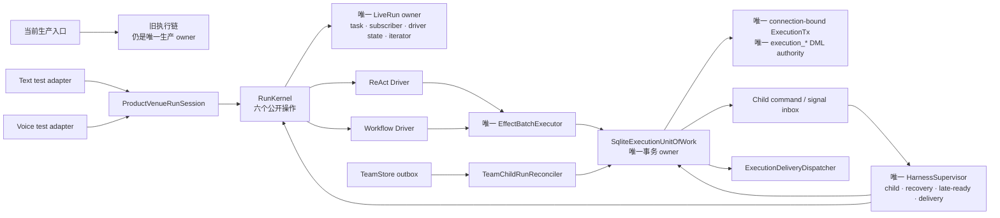

# DeskPet Agent Harness Architecture

> Last updated: 2026-07-21. Scope: request lifecycle, harness state, service wiring, subagent sidecars, and harness simplification evidence.

## Summary

DeskPet uses a product-specific agent harness rather than a generic agent framework. The main runtime is a single parent ReAct loop with strong local-product affordances: Tauri/WebSocket event bridging, permission popups, artifact cards, receipt-backed verification, session memory, and optional subagent/team sidecars.

The executable runtime contract is generated by
`backend/deskpet/harness/bootstrap.py::HarnessManifest` from the actual Kernel
operations, registered Drivers, and immutable `ProfileRegistry`. The former
hand-maintained `backend/deskpet/agent/harness_manifest.py` was deleted in R4;
tests must inspect the runtime composition rather than a duplicate static list.

## Harness simplification program status

R5 Text/Voice test-only convergence is complete; **production ownership is
still `legacy/0` until the atomic R6 activation**. The approved R4.5 boundary
correction now simplifies the isolated runtime before cutover:

`ProfileRegistry` now generates both Router profiles and the WorkflowDriver
catalog, and bootstrap fails closed on missing or mismatched registrations.
Workflow, Team, and Subagent children converge on durable child commands,
stable operation ids, one scheduler, and atomic boundary/event/inbox
acknowledgement. New durable deliveries are claimed and completed only through
the execution UoW by `ExecutionDeliveryDispatcher`; historical runs remain on
the compatibility reader. Root terminal Goal projection uses a frozen goal id
and a retryable delivery, so a replacement Goal cannot steal an older Run's
terminal update.

ReAct decision resolution now commits the decision, one-shot grant,
continuation, resumed event, and next decision boundary in one UoW transition.
Workflow cancel/retry/fork and generic IPC controls select the owner from the
execution row and fail closed before any legacy mutation. Shutdown stops new
recovery work, waits late physical effects, reconciles while Drivers are still
open, waits the actual recovery task and durable settlement, and only then
closes Drivers. A separate short-timeout test proves unresolved evidence stays
`unknown` and is recovered after restart rather than blindly retried.

R5 verification: the shared Text/Voice chain runs
`ProductTurnPreparer -> RunKernel/Driver -> CanonicalRunEventPresentationAdapter -> RunPresenter`
against a real isolated `open/generation=1` activation. Full harness verification
is `363 passed, 8 xfailed`; parity census is `141/141, unmapped=0`; terminal
close clears Kernel active references. Production Text and Voice still use the
legacy owner, so this is `R5_READY` evidence rather than final production PASS.
The R4.5 venue boundary now returns
`ProductVenueRunSession | ProductVenueRunResult` directly: Voice consumes the
session and Text's `execute()` consumes the same union. The redundant
`ProductVenueOpenResult` two-slot wrapper is deleted, while the run result is
retained because it carries explicit pre-Kernel short-circuit/cancel status and
the post-run `run_id/status/final_text` contract.

The R5.5 cutover-readiness slice now provides two named dormant composition
roots: `build_product_harness_composition()` composes the existing preparer,
venue adapter, shared runtime, and presenter; `build_harness_subagent_registry()`
binds the existing batch delegate to typed durable submit/await callbacks and
rejects missing, ephemeral, or wrong-session parents before delegation. Static
import reachability proves neither factory is imported or reachable from
`backend/main.py`; the schema still seeds runtime ownership as `legacy/0`.
`legacy_cutover_audit.py` generates a source-commit-locked span manifest only
when complete dynamic-stack evidence is supplied, audits the exact 15 legacy
owners plus static/dynamic coverage in readiness mode, and provides the R6
exact/similarity/reference/reachability/live-stack cutover gate. The final
`legacy_cutover_spans.json` is intentionally generated only after all R5.5
source slices form the single A commit, then committed with tests/docs as B.
Focused readiness/LOC tests are `28 passed`; the isolated slice construction
gate is raw/adjusted/core/Kernel `34,045/33,536/5,618/767`, unknown `0`. This is
pre-activation evidence, not an R5.5 or production-activation completion claim.

The R4.5 approved baseline is counted orchestration `33,618`, audited core
`5,725`, Kernel `820`, public transaction starters `33`, execution-table DML
authorities `2`, and existing fault windows `34` (`UoW=29 + Team=5`). The
single-DML, first core deletion, typed-transaction-surface, venue-wrapper, and
single-LiveRun, venue-deletion, single-Supervisor, EffectBatchExecutor, and final
Kernel/child slices are now integrated: current raw total is `33,925`,
migration-cohort-adjusted total is `33,416`, core is `5,498`, Kernel `767`, execution DML
authority `1`, public transaction starters `21`, and the fault matrix has all
`39` windows. The former split starters are replaced by nine typed composite
boundaries: `activate_runtime`, `settle_delivery`, `persist_react_boundary`,
`commit_decision`, `claim_tool_call`, `settle_effect`, `commit_run_outcome`,
`ack_child_signal`, and `recovery_scope`. Their production callers are migrated
and the old entrypoints are deleted; this is a real API reduction rather than
an audit exclusion. The venue wrapper slice removes 20 counted core LOC
(`venues.py` `406 -> 386`) against its locked 14-LOC budget. The LiveRun slice deletes `RunKernel._active`,
`ReActDriver._volatile`, and `LegacyAgentLoopCollaborator._active`; Kernel now
injects the sole `BoundedLiveIndex._runs` through generic `bind_live_index`
wiring. `LiveRun` separately owns boundary and iterator references, durable
continuation reads precede live fallback, stale finalizers clear by identity,
and iterator `aclose()` executes outside the live lock. Expanded focused
verification is `158 passed`; the full harness is rerun after slice integration.

R5.5 now has a dormant durable admission storage boundary without changing the
production owner (`legacy/0`). Admission is a typed `_admission` discriminator
inside the existing continuation row, so the execution tables still have one
DML authority and no parallel state table. Its exact durable phases are
`pending -> accepted_start_pending -> launch_claimed -> launched`, with
`rejected`, `cancelled`, `expired`, and `launch_unknown` terminal paths.
`start_admission`, `resolve_admission`, and `claim_admission_launch` are typed,
idempotent transaction starters; ReAct persistence and workflow creation consume
the claim under the same recovery fence. Workflow start returns the exact
five-field `WorkflowStartResult` and schedules only when `start_claimed` is true.
The public starter count is exactly `23`, execution-table DML authority remains
`1`, and the exact `39` fault hooks now declare their covered operation cases.
Focused restart/replay/authority verification is `104 passed`; the R5.5 storage
slice construction gate is green at raw/adjusted/core/Kernel
`34,406/33,897/5,729/767`.

A machine-checked construction ceiling of total `<=34,300` and core `<=5,725`
bounds the temporary migration peak; it is green. The total calculation keeps
the raw `34,020` observable, then replaces only the source-hash-locked
`execution_uow.py + checkpoint_execution.py` cohort's raw-effective delta with
its physical delta. The cohort moved from physical/raw-effective
`5,236/4,651` to `5,251/5,175`, so the mechanically derived overcount is `509`
and the adjusted total is `33,511`; no target was raised. Additions, copies,
moves to new production files, tracked deletion, fixture drift, and physical
line compression are fail-closed tests. The typed-starter, DML, fault-window,
Kernel, adjusted-total, single-LiveRun, and single-Supervisor gates are green.
The run-map, HarnessSupervisor, and Presenter-conversion authorities are each
`1`; the final core `<=5,500`, Kernel `<=850`, adjusted-total, six-public-op,
and unknown-classification gates are green. `HarnessSupervisor`
is the sole resident reconciliation task and owns bounded child-command,
child-signal, recovery, late-ready, and delivery lanes. Each lane has an
explicit batch/time budget; the loop uses a monotonic deadline plus child
wakeup and records timeouts without starving later lanes. Startup performs
one ordered initial pass before starting that task; shutdown stops it before
bounded effect close/final ready reconcile/Kernel drain/Driver close/LiveRun
sweep. `EffectBatchExecutor` now owns the high-level claim/reuse/reconcile,
ordered safe/unsafe execution, metadata/status, and durable-after-signal ack
flow. `Driver.signal()` remains the sole transaction that settles an effect
together with its continuation and event; a failed signal never acknowledges
the registry's late evidence. All-late batches do not emit an empty signal,
mixed ready/late results preserve their original indexes, and shutdown drains
the registry before final recovery while Drivers remain open. The Effect slice
deletes the forwarding `UnifiedToolExecutor` boundary and 38 counted core LOC.
The final slice deletes `KernelChildLauncher` and `ChildLauncher`; the sole
Supervisor invokes Kernel's trusted child boundary directly. Public root
start, atomic precreated child start, and continuation recovery share one
live-launch primitive. Recovery and child-signal streams share one fenced
consumer with renewal during long `anext` and candidate processing, prompt
heartbeat failure propagation, iterator close, and owned/borrowed lease
cleanup that cannot mask the primary error. `RunContext.actor()` is the one
persisted-context mapping while `HostContextFactory` and `ActorContext` remain
the trusted host types. Final verification is `424 passed, 8 xfailed`; parity
and main-callsite contracts add `12 passed`, and the authority audit reports
DML `1`, starters `21`, run map/Supervisor/Presenter `1/1/1`, legacy survivors
`15`, and no unclassified owner. Production remains `legacy/0` until R6. The
spike's `+14` LiveRun estimate omitted the
production-only single-index injection, separate iterator lifecycle,
identity-safe cleanup, and fail-closed binding; the formal slice is `+67` and
the final core target remains unchanged. The old combined
core/UoW `<=2,800` target was disproved by two disposable code spikes and is no
longer a production acceptance metric. Evidence and approved target:
[`baseline.md`](../plans/2026-07-20-agent-harness-simplification/baseline.md) and
[`target-architecture.md`](../plans/2026-07-20-agent-harness-simplification/target-architecture.md).

The R3 recovery-fence hardening slice is complete. `RunKernel` claims one
short-lived execution recovery lease and `DriverRuntime` renews it before
constructing the recovery iterator, again before its first `anext`, and by
heartbeat during long work. The lease is passed explicitly through ReAct,
tool, child, event, continuation, and terminal writes; every persisted write
validates owner, epoch, expiry, and run id inside its own `BEGIN IMMEDIATE`
transaction. Child boundary/event/inbox acknowledgement is one transaction.
Workflow recovery atomically validates the execution lease and claims the
existing native `RunFence`; a preclaimed `ActiveLease` prevents a second
native claim. Effect claim happens before external execution, while an owner
takeover makes the old settlement fail rather than advance the run.

Resume now rebuilds `DriverStart` from one canonical boundary conversion, so
the frozen capability snapshot and tool allow-list survive recovery. Durable
child accepted/terminal responses are host system messages committed with the
child boundary, event, and inbox acknowledgement; `signal_id` is their
exactly-once identity, and root-terminal intent remains recoverable after ack
until the parent terminal is materialized. Durable resume retains the trusted
run context/spec, continuation version, and current recovery lease, allowing a
second prepared tool batch while rejecting a stale owner. New ReAct starts
carry scoped `UNKNOWN` completion
evidence, and successful tool completion is resolved from exact
run/turn/call/effect/artifact identity through the UoW before either legacy
VerifyGate or pipeline SelfCheck can release a completion claim; multi-tool
batches conservatively remain `UNKNOWN` as a whole. Legacy
AgentLoop callers that supply no scoped evidence keep their prior behavior.

Recovery fault verification covers first-yield ordering, same-owner concurrent
claims, stale continuation/effect/child/event/terminal writes, workflow
handoff rollback/idempotency, and takeover during an external tool call. Final
gates: harness `275 passed, 9 xfailed`, expanded AgentLoop verification
adjacency `59 passed`, Kernel `631` physical lines, adjusted LOC
`33,223 <= 33,228`, zero unknown LOC
classifications. Production ownership remains `legacy/0`; this slice does not
perform the R6 cutover. Evidence: [`r3-recovery-results.md`](../plans/2026-07-20-agent-harness-simplification/r3-recovery-results.md).

R2 of the approved simplification plan is complete, but **execution ownership is unchanged**: text still enters through `main.py::_run_chat`, Voice keeps its legacy adapter, AgentLoop remains the short-task driver, and durable workflows keep their current owners.

- The production parity census freezes 141 legacy event/sink/control callsites with `unmapped_count=0`, plus direct behavior fixtures for canonical messages, capability-filtered toolsets, read-only/Code/DeepResearch/PPT routing, Voice tags/TTS-facing text, SessionDB delivery, AutoResume, permission restoration and codify.
- Locked Git-object LOC manifests reproduce phase-0 `21,563` and rollback `33,228` lines. Rename/copy, dirty/untracked, Unicode paths, excluded-directory moves and rewritten moves outside `backend/` are fail-closed.
- The canonical schema-2 benchmark completed 10,000 real `RunKernel.start → UoW.finalize → RunKernel.close` lifecycles with 10,000 terminal rows/events, zero completed-run strong references and about 1.40 MiB RSS growth.
- Integrated verification: `176 passed, 9 xfailed`; parity census `141/141` mapped; current LOC `33,228` with zero unknown classifications.

The approved target is documented in [`plans/2026-07-20-agent-harness-simplification/target-architecture.md`](../plans/2026-07-20-agent-harness-simplification/target-architecture.md). R1.2 keeps production at `legacy/0` while adding the production-shaped activation control plane to the existing `SqliteExecutionUnitOfWork`. It durably scans/registers the legacy drain manifest and advances only through CAS transitions `legacy → draining → activated(generation=1) → open`. Starts are fail-closed during `draining/activated`; rows created before activation remain immutable `legacy/0`, while rows created after `open` are immutably fenced as `kernel/current-generation`. The production bootstrap still does not call activation before the R6 cutover.

The same UoW now owns product-neutral continuation JSON through strict `save/load/delete` continuation-version CAS. `promote_and_persist_batch_boundary` atomically promotes a bounded ephemeral ReAct run, persists the complete continuation, optional `DecisionOpen`, waiting event, and its deliveries; an existing durable run is not promoted twice. A new durable row advances the ephemeral version once, and a newly appended waiting event advances it once more; the returned record is the authoritative post-commit version. Activation verification covers concurrent/repeated CAS, illegal owner writes, non-empty drain refusal, four crash/restart windows, and restart recovery. Continuation verification covers complete JSON recovery, stale save/delete rejection, wrong-run decision rejection, idempotent replay, and four whole-transaction promotion crash windows. Focused harness/workflow schema regression: `231 passed, 9 xfailed`.

R1.2 removes the reverse dependency from `ToolRegistry` to the test-only
`harness.tool_executor`: the registry no longer exposes
`prepare_execution_call`/`execute_call` and depends directly on the existing
`PreparedToolCall`/`NormalizedToolOutcome` workflow primitives. The canonical
`prepare_call`/`execute_prepared` path now accepts a separate trusted
`ToolExecutionContext`, rejects model-owned host fields, avoids the legacy
session-context merge, revalidates call/effect/grant bindings, and invokes
`context_handler` without putting host identity into model JSON. A temporary
harness-side bridge preserves dormant pre-cutover tests; it is not a new
production owner and is deleted by the Driver/UoW owner-collapse slice.
Verification: full harness `199 passed, 9 xfailed`; adjacent workflow effect
and production wiring `33 passed`; canonical registry-focused tests `45 passed`.

R1 owner-collapse now has one durable state owner: `SqliteExecutionUnitOfWork`.
The former `ExecutionLedger`, decision store, effect store, and continuation
store modules have been deleted instead of retained as facades. Short ReAct
runs stay only in Kernel's bounded live index and create zero execution rows;
the first tool, decision, or delegate boundary atomically promotes the run and
persists its complete continuation through the UoW. After promotion Kernel
drops its ephemeral record and reads the UoW-owned version. The execution port
surface is one `ExecutionUnitOfWork` protocol, and the duplicate execution
`ToolOutcome` contract and unused codecs are gone. Production remains fenced at
`legacy/0`; this slice does not activate the Kernel owner.

R1 now exports eight stable atomic-operation contracts and 33 enumerated crash
windows. The existing UoW bodies were split into same-connection primitives;
there is no second ledger or nested connection. Decision resolution advances
its continuation/event with any one-shot grant; grant consumption claims a
fenced execution effect/attempt; settlement commits attempt, effect link,
continuation, event and delivery; child apply advances the parent and acks the
inbox; child finalization commits the terminal event and parent signal. The
durable-command-first child saga intentionally commits the immutable command
intent before scheduling atomically creates child+link and marks it scheduled.
TeamStore now atomically claims a task with a stable cross-DB child-command
outbox, which a reconciler can replay and acknowledge. Goal projection remains
a separate domain store and is therefore represented as a durable finalization
delivery, not a fake cross-database SQL link.

The machine-readable matrix fixes each window's durable before/after state,
restart actor, idempotency key and run/boundary/decision/effect/attempt/child/
link/inbox/event/delivery/external-write counts. Every hook is killed before
commit, reopened through a fresh store, replayed, and compared under
`required == tested == exported`; focused matrix verification is `33 passed`,
adjacent UoW/Decision/Child/Ledger/Team regression is `148 passed`, and the
integrated harness-simplification suite is `217 passed, 9 xfailed`. Production
ownership remains `legacy/0` until the R6 activation commit.

This atomicity slice grows `execution_uow.py` from 3,854 to 4,467 physical
lines (`+613` net after extracting the old decision/grant/child-signal bodies)
and TeamStore by `+176` net lines. It is correct for crash safety, but the old
plan incorrectly treated that shared persistence engine as if it were only
harness glue. R4.5 instead keeps it in the global count while measuring its
real complexity boundary: one execution DML writer, at most 23 typed public
transaction starters, and a complete fault matrix. Harness/execution core has
its own `<=5,500` structural budget.

R2 turns the old text ingress into a smaller composition shell without a
Kernel/Driver/Workflow/Voice cutover. `ProductTurnPreparer` now owns the typed
`prepare_context -> route_intent -> plan_decision` stages. It returns
venue-neutral `ProductDomainCommand` values instead of writing WebSocket,
SessionDB, activity, or plan-waiter state. `RunPresenter` consumes the existing
legacy `AgentEvent` stream through explicit live/durable/domain handler
registries and owns terminal feedback/billing. Product commands are projected
through the narrow `ProductDomainSink`; only `LegacyProductDomainSink` knows
the current WebSocket, peer broadcast, SessionDB, plan waiter, and read-only
compatibility APIs. A separate `RunEventPresentationAdapter` protocol reserves
the future typed RunEvent boundary; R2 does not claim that cutover.

The frozen R0 census remains byte-for-byte unchanged at 141 callsites. A new
141-entry old-to-current mapping records both source hashes and callsites; the
current scan has the same capability/kind distribution, including 57 WS sends.
Both dual-send helpers are AST-validated, so deleting either origin send or
peer broadcast fails closed. Integrated verification: harness `232 passed,
9 xfailed`, census `141/141` with zero unmapped items, adjusted LOC
`32,490 <= 33,228` with zero unknown classifications; adjacent R2 branch
agent/context/problem/main suites are `335 passed`, and the three R2 production
modules total 611 physical lines (below the 1,000-line budget).

R3 recovery fencing foundation is now on schema v8. Each durable run has a
short-lived recovery owner/epoch/expiry separate from the deployment-level
`owner_generation`. `claim_recovery`, `renew_recovery`, and `release_recovery`
support exclusive claims and expired takeover; stale epochs fail closed. A
recovery-fenced `append_event` validates the lease and writes the event in the
same `BEGIN IMMEDIATE` transaction, closing the check-then-write race. Existing
v7 rows migrate with unchanged product fields and an unclaimed lease. Focused
verification is `26 passed`; the integrated harness is `235 passed, 9 xfailed`
and adjusted LOC is `32,809 <= 33,228`. Production ownership remains
`legacy/0`; Kernel recovery is not activated yet.

R3 also splits the in-process driver runtime without creating another durable
owner. `RunKernel` is 647 physical lines and keeps only the six public
operations, routing, lifecycle choice, recovery lease coordination, and
terminal authority. Product-neutral contracts, the single `BoundedLiveIndex`,
and stateless `DriverRuntime` are separate modules; none imports SQLite or
creates persistence. Per-run live history is bounded at 256 events and each
subscriber queue at 128 items; stale cursors and slow subscribers fail closed
with `LiveStreamOverflow`. Durable observe hydrates UoW events in a fresh
Kernel process, while terminal/close remove subscriber, task, and run refs.
Verification: focused `18 passed`, full harness `237 passed, 9 xfailed`, and
adjusted LOC `32,935 <= 33,228` with zero unknown classifications.

R3 ReAct boundaries now persist and restore the full capability snapshot.
Initial and resumed legacy AgentLoop calls receive the snapshot as the real
`tool_names_filter`, so the provider sees only allowed schemas. A second
fail-closed allow-list check rejects a provider-forged out-of-snapshot tool
call before `prepare_call`; an explicit empty snapshot therefore means
deny-all, while historical boundaries without the field keep their documented
compatibility behavior. Focused verification is `17 passed`; full harness is
`239 passed, 9 xfailed`, and adjusted LOC is `32,965 <= 33,228` with zero
unknown classifications. This is still test-path preparation under
production `legacy/0`, not an owner cutover.

R3 driver ports now use exactly two tagged value types: `DriverEvent` and
`DriverSignal`. The former 13 candidate/signal classes and `DriverCandidate`
union are deleted; their semantic names survive only as constructors returning
the tagged values. Kernel, DriverRuntime, ReAct, Workflow, and ChildRun consume
`kind` directly, and AST tests prevent the old taxonomy from returning. The
ports module is 147 physical lines. Verification: focused consumers `52
passed`, full harness `240 passed, 9 xfailed`, and adjusted LOC `32,817 <=
33,228` with zero unknown classifications. Production remains `legacy/0`.

R3 completion verification now accepts an explicit `EvidenceContext` scoped by
run, turn, call, effect, target, and artifact. The only resolver is the existing
`SqliteExecutionUnitOfWork`, which joins canonical run/effect rows and returns
matched or unknown; callers cannot provide an alternate receipt collection.
Run/turn/call/effect/artifact must match exactly. Because the current schema
does not store a distinct target digest, any request containing one returns
unknown rather than reinterpreting the effect fingerprint. Legacy session-wide
verification remains only when no scoped context is supplied and is retained
until R6. Verification: focused `57 passed`, full harness `249 passed, 9
xfailed`, adjusted LOC `32,986 <= 33,228`, unknown classifications zero.

## Request Lifecycle

The outer text-chat order is `ws_ingress -> ProductTurnPreparer.prepare_context
-> ProductTurnPreparer.route_intent -> ProductTurnPreparer.plan_decision ->
agent_loop -> RunPresenter`. Tool dispatch, completion gates,
subagent activity, and WS egress are nested/re-entrant inside the AgentLoop
event stream; the table order is vocabulary order, not a once-only sequence.

| Stage | Owner | Role | Persistence | Recovery boundary |
|---|---|---|---|---|
| `ws_ingress` | `backend/main.py::_run_chat` | Receive chat, persist user message, resolve session/provider context. | Session | Conversation record survives; coroutine does not. |
| `context_assembly` | `deskpet.agent.turn_preparer.ProductTurnPreparer.prepare_context` | Compose ContextAssembler, attachments, sentinel, supervisor hints and summary reinjection. | Ephemeral | Falls back to a user-only message list. |
| `pre_loop_problem_pipeline` | `ProductTurnPreparer.route_intent` | Compose intent/contradiction analysis and return venue-neutral domain commands. | Ephemeral | Safe-fail returns an empty routed result. |
| `agent_loop` | `backend/agent/agent_loop.py::AgentLoop.run` | ReAct loop, provider fallback, tool calls, final/error events. | Ephemeral | Auto-resume can start a new run; no exact graph-node checkpoint. |
| `tool_dispatch` | `deskpet.tools.registry.ToolRegistry.execute_tool` | Permission gate, timeout, envelope, artifact, receipt, breaker accounting. | Session | Receipts/artifacts survive; in-flight handlers do not resume. |
| `completion_gates` | `AgentLoop` end-turn gates | completion_probe, VerifyGate, goal_checker, external evaluator, self-check. | Session | Receipt ledger and goal store survive; nudges are per run. |
| `subagent_sidecar` | `subagent_scheduler`, `subagent_registry`, `team/spawn_team` | Optional bounded sidecar subagent/team execution. | Session (mixed internals) | Subagent coroutines are process-local; TeamStore data survives, but workers are not automatically reclaimed. |
| `ws_egress` | `deskpet.agent.run_presenter.RunPresenter` + `LegacyProductDomainSink` | Translate legacy AgentEvents/product commands, persist assistant/tool state, and dual-send live frames. | Session | Persisted messages reload; streamed deltas are best-effort. |

## Current Weaknesses And Fix Direction

| Weakness | Current evidence | Hardening direction |
|---|---|---|
| Control flow is dispersed | Production requests still cross `main.py`, `ProblemHandlingPipeline`, `ContextAssembler`, `AgentLoop`, and `ToolRegistry` until R6. | Keep the production lifecycle table current and derive the new runtime manifest from actual Kernel/Driver/Profile registrations. |
| Parent ReAct is not a durable state machine | Short/general chat still cannot restart from a precise node after process death. DeepResearch, PPT Pro, and Complex Code now use explicit checkpointed graphs. | Keep short chat in ReAct; move only additional long, bounded workflows behind the durable graph contracts. |
| `main.py` still owns the production shell | Provider resolution, workflow routing and AgentLoop construction remain in `_run_chat`, although preparation and presentation policy moved in R2. | Keep the R2 typed seams stable; cut execution ownership only in the later Driver/Kernel milestone. |
| Flag/service wiring is complex | Feature flags and `service_context` placeholders have repeatedly drifted. | Test every declared harness service against `ServiceContext.register/get`. |
| Multi-agent is sidecar, not core | `spawn_team` and nonblocking subagents run around the parent loop. | Keep sidecar semantics explicit; do not present it as a CrewAI-style primary runtime. |
| ReAct observability remains partly grep-heavy | Durable workflows have structured Trace/Evaluation records and Session progress, while legacy ReAct still relies on mixed logs/events. | Continue converging legacy events on the trace vocabulary without coupling product UI to raw logs. |
| Testing is expensive | True UI E2E is required for UI/desktop behavior but too costly for pure wiring drift. | Route manifest/logic changes to pytest; reserve windows-mcp for UI or real desktop behavior changes. |
| Low framework reuse | Harness is tightly coupled to DeskPet, Tauri, permissions, artifacts, receipts, and local tools. | Preserve product runtime; borrow LangGraph/CrewAI patterns selectively. |

## Framework Comparison

LangGraph is a low-level orchestration runtime for long-running stateful agents. Its best-fit lesson for DeskPet is explicit graph state, durable execution, human-in-the-loop checkpoints, and state transition traces. DeskPet should borrow this for future long-running workflows such as PPT Pro, DeepResearch orchestration, or multi-stage code tasks.

CrewAI provides crews and flows: role/task/process-centered multi-agent collaboration plus event-driven flow control and shared state. Its best-fit lesson for DeskPet is a clearer DSL for teammate roles, task ownership, and flow-level state, but DeskPet should keep its local ToolRegistry, permission gate, artifact, and VerifyGate stack.

The current recommendation is not a wholesale migration. DeskPet's product-specific local execution layer is valuable. The hardening path is to formalize the existing lifecycle, then incrementally extract long-running or team-oriented workflows behind explicit state/flow interfaces.

## Durable Long-Task Layer

As of 2026-07-11, DeepResearch, PPT Pro, and Complex Code are explicit v1 graphs with shared state, checkpoint recovery, durable decisions, structured Trace/Evaluation records, and Outbox-backed progress projection. The UI consumes a small public stage vocabulary rather than raw trace/log payloads. Stable workflow event ids make Session history and live WebSocket delivery converge without duplicate progress messages.

PPT Pro additionally treats a complete raster page as the rendering unit: the image provider creates a text-free background, DeskPet deterministically flattens approved copy into the final 16:9 page image, and the PPTX assembler inserts exactly one picture per slide. Legacy templates and direct `ppt_create` remain compatible paths.

## Follow-up

保留 DeskPet 现有 Harness，把复杂长任务逐渐改造成 LangGraph 式流程，再补上 LangSmith 式观测能力。

## Test Routing

- Runtime manifest/bootstrap: `python -m pytest backend/tests/harness_simplification/test_harness_bootstrap.py -q`
- R4 Harness + adjacent contract gate: `python -m pytest backend/tests/harness_simplification backend/tests/test_team_store.py backend/tests/test_workflow_store_schema.py backend/tests/test_agent_harness_contract_parity.py backend/tests/test_context.py -q`
- UI-visible event or permission changes: use the project windows-mcp discipline and store results under `plans/manual-results-*`.
