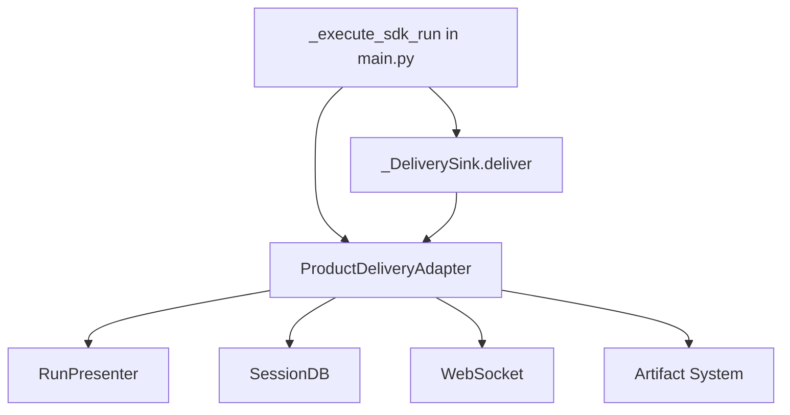

# SDK Runtime v0.1.1 Migration Status

> Last updated: 2026-08-18
> Baseline commit: 153338794ea0bc6617d36d77f95e91b6a0cebf2b

## Executive Summary

SDK Runtime v0.1.1 已安装并初始化，但 **Agent 执行链尚未接通**。Commit `71f3a6e2` 删除了旧 harness 代码（62,349 行），但替换集成未完成。当前 Agent 执行会抛出 `NotImplementedError`。

## Migration Progress

### ✅ Completed Components

1. **SDK Runtime Installation & Initialization**
   - Location: `backend/main.py:_activate_product_sdk_runtime()`
   - Status: ✅ COMPLETE
   - Evidence: `_sdk_ingress` 全局变量成功创建

2. **Product Context Adapter**
   - Location: `backend/deskpet/sdk_adapters/context.py`
   - Status: ✅ COMPLETE
   - Provides: history, persona, memory, skills, attachments to SDK ports

3. **Product Tools Adapter**
   - Location: `backend/deskpet/sdk_adapters/tools.py`
   - Status: ✅ COMPLETE
   - Bridges 79 product tools to SDK tool registry

4. **SDK Runtime Ingress Facade**
   - Location: `backend/deskpet/sdk_adapters/ingress.py`
   - Status: ✅ COMPLETE
   - Methods: `start()`, `wait_idle()`, `query()` all implemented

5. **Runtime Composition**
   - Location: `backend/deskpet/sdk_adapters/composition.py`
   - Status: ✅ COMPLETE
   - Creates SDK Runtime with product adapters

### ⚠️ Incomplete Components (Blocking Agent Execution)

#### 1. Core Coordinator: `_execute_sdk_run()` ❌

**Location**: `backend/main.py:9301-9312`

**Current State**:
```python
raise NotImplementedError(
    "Agent execution path not yet migrated to SDK Runtime v0.1.x. "
    "The old Harness architecture was removed but the SDK integration "
    "was not completed. See commit 71f3a6e2."
)
```

**Old Implementation (RETAINED AS DEAD CODE)**:
```python
# 注意：以下代码文件仍存在于 backend/deskpet/harness/adapters/venues.py
# 但不再被任何 ingress 调用（死代码）。Commit 71f3a6e2 保留了 25 个 harness
# 文件，因为 companion/run_adapter.py 仍有依赖链。

from deskpet.harness.adapters.venues import ProductVenueRunAdapter

adapter = ProductVenueRunAdapter(...)
session = await adapter.open(...)
async for event in session.events:
    # Process event
```

**Required New Implementation**:
```python
async def _execute_sdk_run(
    session_id: str,
    request_id: str,
    turn_id: int,
    payload: dict,
    websocket: WebSocket,
    ...
) -> None:
    """Core coordinator: SDK Runtime execution → WebSocket delivery.
    
    Replaces the old ProductVenueRunAdapter.open() flow.
    """
    # 1. Call SdkRuntimeIngress.start()
    receipt = await _sdk_ingress.start(...)
    
    # 2. Stream events via DeliveryDispatcher
    # (Events automatically pushed through _DeliverySink → ProductDeliveryAdapter)
    
    # 3. Wait for completion
    await _sdk_ingress.wait_idle(receipt.run_id)
    
    # 4. Query final state
    final_state = _sdk_ingress.query(receipt.run_id)
```

**Responsibilities**:
- Call `SdkRuntimeIngress.start()` with session/request/turn context
- Coordinate event delivery to WebSocket (via delivery adapters)
- Handle errors and completion
- Replace lines 9314-9338 (old event loop with `session.events`)

**Acceptance Criteria**:
- Agent execution completes without `NotImplementedError`
- Events stream to frontend WebSocket
- SessionDB updated with messages
- Run state queryable via `_sdk_ingress.query()`

---

#### 2. Delivery Sink: `_DeliverySink.deliver()` ⚠️

**Location**: `backend/deskpet/sdk_adapters/desktop_runtime.py:133-135`

**Current State**:
```python
class _DeliverySink:
    async def deliver(self, payload, *, idempotency_key):
        del payload, idempotency_key  # Empty - just discards parameters
```

**SDK Contract**:
```python
# From simple_harness.execution.DeliverySinkPort
async def deliver(
    self,
    payload: DeliveryPayload,
    *,
    idempotency_key: str,
) -> None:
    """Deliver one execution event to the product layer."""
```

**Required Implementation**:
```python
class _DeliverySink:
    def __init__(self, delivery_adapter: ProductDeliveryAdapter):
        self._adapter = delivery_adapter
    
    async def deliver(self, payload, *, idempotency_key):
        """Push SDK event to ProductDeliveryAdapter."""
        await self._adapter.handle_event(
            payload=payload,
            idempotency_key=idempotency_key,
        )
```

**Event Flow**:
```
SDK DeliveryDispatcher (background task)
  → _DeliverySink.deliver(payload, idempotency_key)
  → ProductDeliveryAdapter.handle_event()
  → RunPresenter / SessionDB / WebSocket
```

**Responsibilities**:
- Receive events from SDK `DeliveryDispatcher` background task
- Forward to `ProductDeliveryAdapter`
- Implement idempotency (same key → same delivery, no duplicates)

**Acceptance Criteria**:
- SDK events successfully pushed to `ProductDeliveryAdapter`
- No event loss during execution
- Idempotency respected (same key → exactly-once semantics)

---

#### 3. Product Delivery Adapter: `ProductDeliveryAdapter` ❌

**Location**: `backend/deskpet/sdk_adapters/delivery.py:14-31`

**Current State**:
```python
class ProductDeliveryAdapter:
    def __init__(self):
        # TODO T6.1: Initialize with product delivery system
        pass
```

**Required Implementation**:
```python
class ProductDeliveryAdapter:
    """Adapter between SDK execution events and product UI delivery."""
    
    def __init__(
        self,
        presenter: RunPresenter,
        session_db: SessionDB,
        websocket: WebSocket,
        broadcast: Callable,
    ):
        self._presenter = presenter
        self._session_db = session_db
        self._websocket = websocket
        self._broadcast = broadcast
    
    async def handle_event(
        self,
        payload: DeliveryPayload,
        idempotency_key: str,
    ) -> None:
        """Convert SDK event → product UI updates."""
        
        # 1. Format event via RunPresenter
        formatted = self._presenter.format_event(payload)
        
        # 2. Persist to SessionDB
        await self._session_db.append_message(...)
        
        # 3. Send to WebSocket
        await self._websocket.send_json(formatted)
        
        # 4. Broadcast to peers
        await self._broadcast(self._websocket, formatted)
        
        # 5. Generate artifact cards if needed
        if payload.type == "artifact_ready":
            await self._generate_artifact_card(payload)
```

**Responsibilities**:
- **RunPresenter**: Format SDK events for UI consumption
- **SessionDB**: Persist messages and state
- **WebSocket**: Real-time event delivery to frontend
- **Artifact system**: Generate cards for UI display
- **Broadcast**: Notify peer connections (multi-tab support)

**Event Types to Handle**:
- `run_started`: Initialize UI state
- `token_chunk`: Stream text to frontend
- `tool_call`: Display tool invocation
- `tool_result`: Display tool output
- `run_completed`: Finalize UI state
- `run_failed`: Display error to user

**Acceptance Criteria**:
- All SDK events visible in frontend UI
- Messages persisted to SessionDB
- WebSocket events match old format (frontend compatibility)
- Artifact cards generated correctly

---

## Old vs New Architecture

### Old (Pre-71f3a6e2, DELETED)

```text
main.py
  → ProductVenueRunAdapter.open()
       → TurnPreparer.prepare()
       → KernelRunClient.start()
       → observe() AsyncIterator[RunEvent]  # Pull model
  → async for event in session.events:  # Manual loop
       → RunPresenter.format_event()
       → SessionDB.append_message()
       → websocket.send_json()
```

**Key characteristics**:
- **Pull model**: Caller owns event loop
- **Synchronous delivery**: Events pulled one-by-one
- **Tight coupling**: ProductVenueRunAdapter contained all coordination logic

### New (Target, SDK v0.1.1)

```text
main.py
  → _execute_sdk_run()
       → SdkRuntimeIngress.start()  # Fire and forget
            → DeliveryDispatcher (background task)  # Push model
                 → _DeliverySink.deliver()
                      → ProductDeliveryAdapter.handle_event()
                           → RunPresenter / SessionDB / WebSocket
  → await _sdk_ingress.wait_idle()  # Wait for completion
  → _sdk_ingress.query()  # Get final state
```

**Key characteristics**:
- **Push model**: SDK owns event loop
- **Asynchronous delivery**: Background task pushes events
- **Loose coupling**: SDK Runtime independent, adapters bridge to product

---

## Deleted Code Inventory (Commit 71f3a6e2)

| File | Lines Deleted | Role |
|------|---------------|------|
| `backend/deskpet/harness/bootstrap.py` | 214 | Old harness initialization |
| `backend/deskpet/harness/drivers/react.py` | 5,132 | Old ReAct driver implementation |
| `backend/deskpet/harness/drivers/react_loop.py` | 1,190 | Old ReAct loop logic |
| `backend/deskpet/harness/drivers/workflow.py` | 294 | Old Workflow driver |
| `backend/deskpet/harness/adapters/product_composition.py` | 205 | Old product composition |
| `backend/deskpet/harness/adapters/product_profiles.py` | 252 | Old profile selection |
| `backend/deskpet/harness/adapters/subagent_registry.py` | 815 | Old subagent coordination |
| Test files | ~55,000 | Old harness tests |
| **TOTAL** | **62,589** | Old harness system |

**Retained files (25 harness modules)**: `venues.py`, `kernel.py`, `contracts.py`, `ports.py`, `projector.py`, `context.py`, `profiles.py` 等保留为死代码，因 `companion/run_adapter.py` 依赖链尚未解耦。这些文件不再被任何 ingress 调用。

---

## Implementation Dependencies



**Critical path**:
1. Implement `ProductDeliveryAdapter` first (foundation)
2. Implement `_DeliverySink` to bridge SDK → adapter
3. Implement `_execute_sdk_run()` to complete the execution chain

---

## Testing Strategy

### Unit Tests Required

1. **ProductDeliveryAdapter**
   - Event formatting via RunPresenter
   - SessionDB persistence
   - WebSocket message structure
   - Artifact card generation

2. **_DeliverySink**
   - Event forwarding to adapter
   - Idempotency key handling
   - Error propagation

3. **_execute_sdk_run()**
   - SdkRuntimeIngress.start() call
   - Event streaming
   - Completion detection
   - Error handling

### Integration Tests Required

1. **End-to-End Agent Execution**
   - Send user message via WebSocket
   - Verify execution reaches SDK Runtime
   - Verify events stream back to frontend
   - Verify SessionDB persistence

2. **ReAct Loop**
   - Multi-turn reasoning
   - Tool calls and results
   - Final answer delivery

3. **Error Recovery**
   - SDK Runtime errors propagate correctly
   - Frontend displays error state
   - SessionDB records failure

---

## Acceptance Gate

**Definition of Done**:
- [ ] `NotImplementedError` removed from `main.py:9308`
- [ ] `_DeliverySink.deliver()` implemented
- [ ] `ProductDeliveryAdapter` fully implemented
- [ ] Unit tests pass for all three components
- [ ] Integration test: User message → Agent response → Frontend display
- [ ] Manual E2E test: Complex task with multiple tool calls
- [ ] SessionDB verification: Messages persisted correctly
- [ ] ARCHITECTURE.md updated to reflect completed migration

**Blocked by**: None (all dependencies already satisfied by ✅ components)

**Blocks**: All Agent execution features (current `NotImplementedError` prevents any Agent use)
