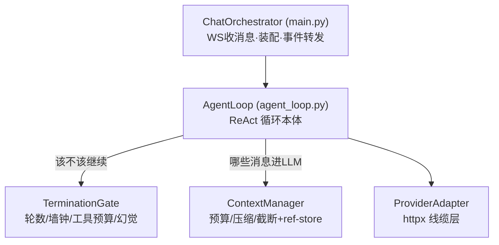
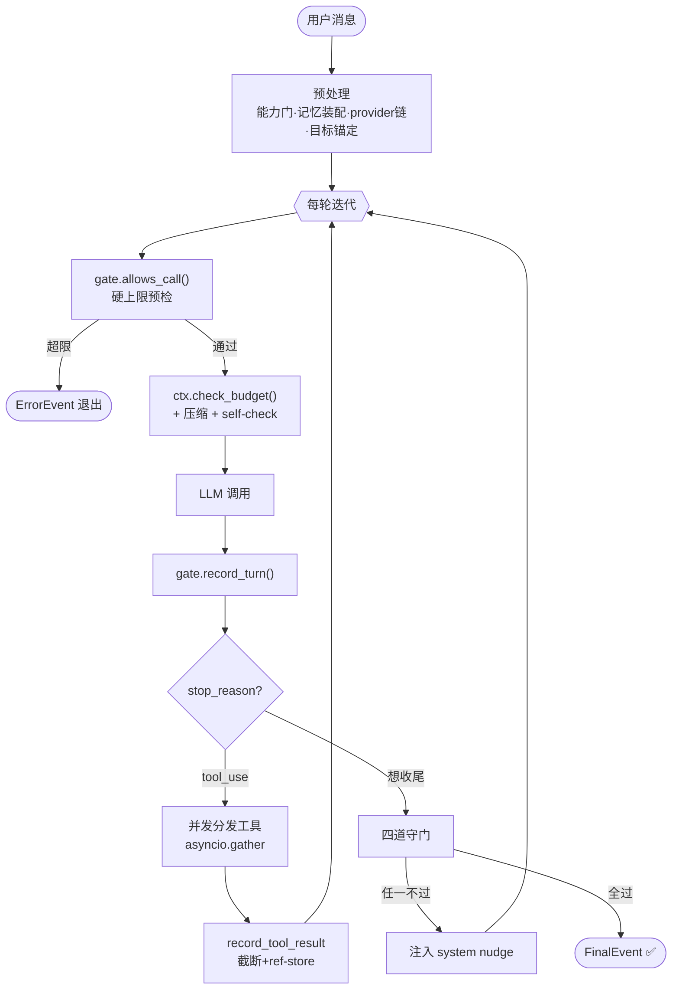
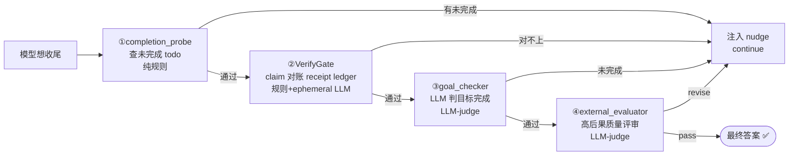
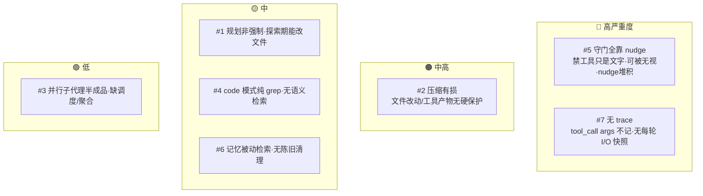
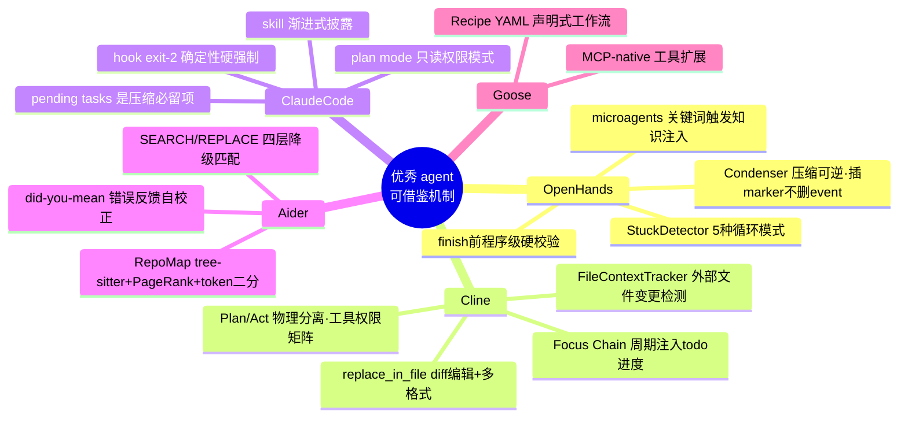
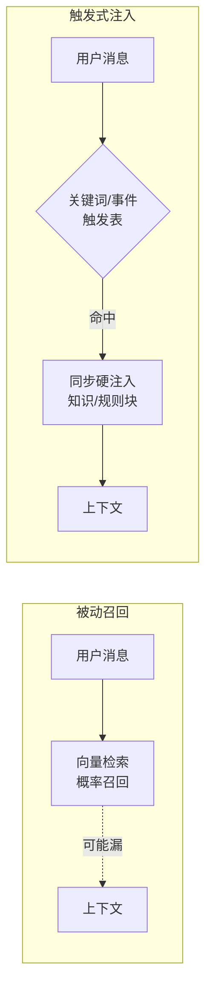
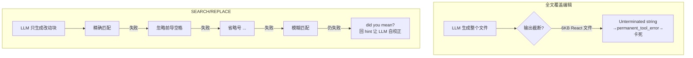
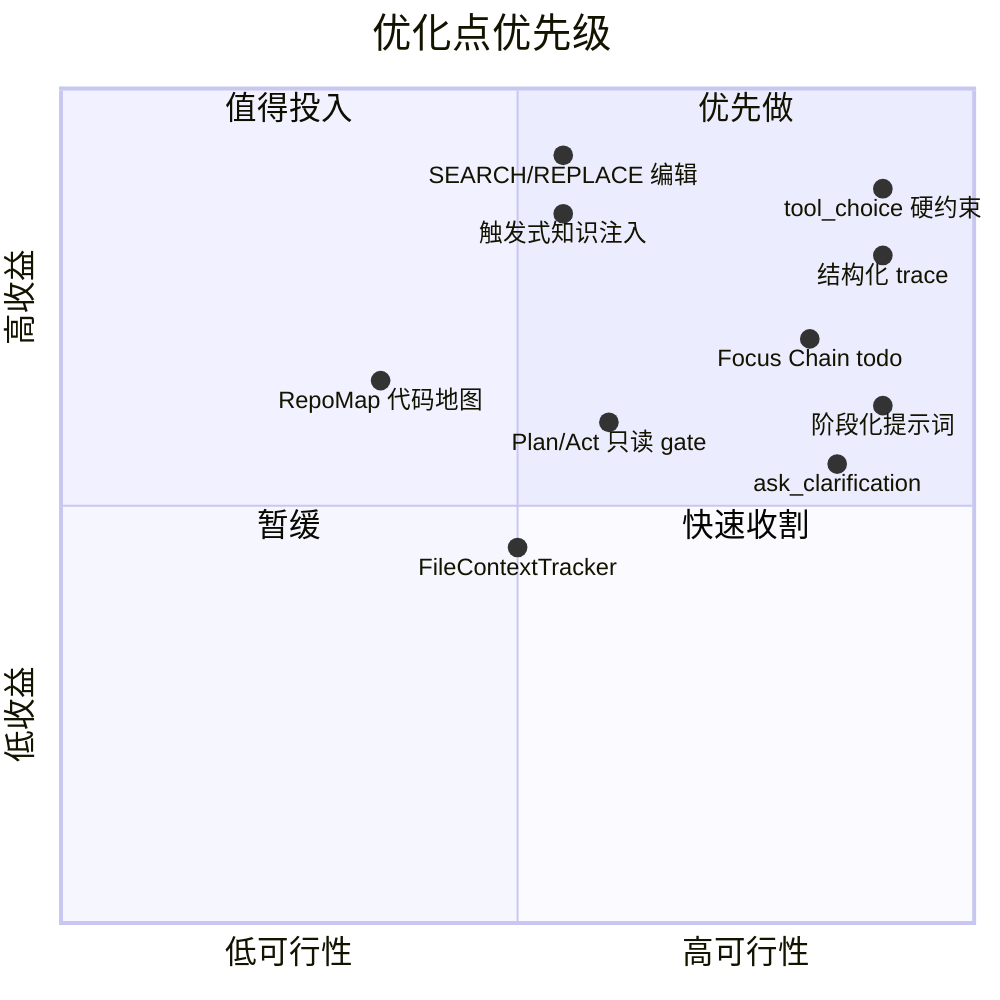

# STATUS — 桌宠 Agent 优化方案（现状 · 缺陷 · 对标 · 落地）

> 一份文档看清：桌宠 agent **现在怎么跑** → **哪里弱** → **业界优秀 agent 怎么做** → **我们怎么改、先改什么**。
> 配套架构细节见 [`AgentLoop.md`](./AgentLoop.md)（执行引擎源码级骨架）。
>
> 最后更新：2026-06-20 ｜ 基线：读码核实 + 业界源码级调研（master）
>
> ⚠️ **信源说明**：业界部分原计划用 deepwiki MCP，调研期间该 server 掉线，改用 **WebFetch 抓 deepwiki.com 页面 + GitHub raw 源码 + WebSearch** 替代。对标报告里的**具体行号/文件名未逐一核实**（经网页抓取，细节可能有偏差），**方向可信，落地前请对照官方仓库**。

---

## 0. 一图看懂（TL;DR）

**最该先做的两件**：① **SEARCH/REPLACE diff 编辑**（修掉真实卡死 bug）② **触发式知识注入**（记忆从"碰运气召回"→"确定性注入"）。两者都不与现有架构冲突。

---

## 1. 桌宠 Agent 现状

### 1.1 三层架构

| 层 | 文件 | 职责 |
|---|---|---|
| ChatOrchestrator | `backend/main.py` | WS 收消息、构建初始 messages、provider 链解析、装配并调用、事件→WS |
| AgentLoop | [`agent_loop.py`](../backend/agent/agent_loop.py) | LLM 调用 → 工具分发 → 重复，流式 yield 事件 |
| TerminationGate | [`termination.py`](../backend/agent/termination.py) | 所有「该不该继续」的硬上限裁决 |
| ContextManager | [`context_manager.py`](../backend/agent/context_manager.py) | 所有「哪些消息进 LLM」的决策 |

### 1.2 ReAct 主循环 + 四道守门

**四道守门**（模型说"我做完了"时不直接信）：

> 这四道是桌宠区别于裸 ReAct 的核心 —— 把"压制 LLM 短路径偏置"工程化。**但它们全靠注入 system 文字提醒 + `continue`，是后面缺陷 #5 的根源。**

---

## 2. 缺陷审计（读码核实，按严重度）

| # | 缺陷 | 真实性 | 严重度 | 证据 |
|---|---|---|---|---|
| 5 | 四道守门靠注入 system nudge + `continue`；"禁止 tool_call"只是文字、可被无视；三套 nudge 计数器堆积污染 context | 有 | 🔴 高 | [agent_loop.py:1120-1311](../backend/agent/agent_loop.py)、tier3 :118-128 |
| 7 | 日志零散，**tool_call 的 args 完全不记**，`str(exc)[:200]` 截断，无"每轮 LLM I/O 快照" | 有 | 🔴 高 | metrics 是白名单事件非 trace |
| 2 | 压缩把中段历史压成 ≤600 字摘要，**文件改动/工具参数无硬保护**会被压没 | 部分 | 🟠 中高 | [history_compactor.py](../backend/agent/history_compactor.py)、`skip_truncation` 白名单只保 fetch_tool_result |
| 1 | 规划非强制：`maybe_extract_plan` 可选前置、失败静默降级；探索期权限没切只读 | 部分 | 🟡 中 | [plan.py:96-182](../backend/agent/plan.py) |
| 4 | code 模式纯靠 read/grep/glob，向量库只嵌对话记忆、**不索引代码** | 部分 | 🟡 中 | [vector_worker.py](../backend/deskpet/memory/vector_worker.py) |
| 6 | 记忆检索被动触发（谁调谁查），无陈旧记忆清理/去重 | 部分 | 🟡 中 | retriever 被动读 |
| 3 | 并行子代理框架在、但缺调度/结果聚合/协作，半成品 | 部分 | 🟢 低 | agent_parallel 队列其实给 embedding worker |

---

## 3. 业界对标（5 个母版各抽精华）

| 母版 | 最值钱的机制 | 解决桌宠什么 |
|---|---|---|
| **OpenHands** | **Condenser**：压缩只在视图层插 `CondensationAction` marker（记 start/end/summary），**原始 event 永不删** → 可 replay/审计 | #2 有损压缩 + #7 无 trace |
| **Cline** | **Plan/Act 物理分离** + **Focus Chain**（每 6 条注入 todo 进度）+ **FileContextTracker** | #1 规划 + #6 记忆漂移 |
| **Claude Code** | **"软指令塑意图，硬机制保边界"**：hook `exit 2` 客户端确定性阻断，优先于模型意愿 | #5 守门靠文字 |
| **Aider** | **RepoMap**（代码地图）+ **SEARCH/REPLACE 四层降级编辑** + did-you-mean 反馈 | #4 无语义检索 + 编辑可靠性 |
| **Goose** | MCP-native 扩展 + Recipe 声明式工作流 | 长期工具生态（次要） |

---

## 4. 优化方案（按你关注的三维度）

### 4.1 记忆 / 知识注入

| 方案 | 借鉴 | 维度 | 可行性 | 说明 |
|---|---|---|---|---|
| **触发式知识注入** | OpenHands microagent / Cline `.clinerules` | 记忆 | 中 | 在 SkillMatcher 上加"关键词/事件 → 知识片段"触发表，命中**同步注入**（不靠向量概率召回）。已有 skill_loader/matcher 做底 |
| **Focus Chain：todo 进度周期回灌** | Cline / Claude Code | 记忆 | 高 | 把现有 `[目标锚定]`（注入目标文本）升级为**注入带 ✓/✗ 的 todo 进度快照**，每 N 轮回灌。复用现有 todo + goal_store |

### 4.2 工具（新增 / 增强）

| 方案 | 借鉴 | 维度 | 可行性 | 说明 |
|---|---|---|---|---|
| **SEARCH/REPLACE diff 编辑 + 多层降级 + 错误反馈** | Aider editblock / Cline | 工具 | 中 | `edit_file` 从全文覆盖 → 改动块。**只改局部 → 直接绕开输出截断卡死**（见 [agent_loop.py:901-910](../backend/agent/agent_loop.py) 那段 max_tokens 注释）。Aider `editblock_coder.py` 有可移植实现 |
| **`ask_clarification` 澄清工具** | Cline ask_followup_question | 工具 | 高 | 模型遇歧义主动反问而非猜。桌宠语音/Live2D 场景天然契合 |
| **RepoMap 代码地图** | Aider repomap.py | 工具 | 中·重 | tree-sitter 抽符号 + PageRank 排序 + token 二分裁剪。**工作量大、code 模式次要** → 想认真做 code 能力时再上 |

### 4.3 提示词优化

| 方案 | 借鉴 | 维度 | 可行性 | 说明 |
|---|---|---|---|---|
| **阶段化工作流提示词 + 收尾自查清单** | Cline 四阶段 / OpenHands 五步 | 提示词 | 高 | prompt 从"平铺工具"→ explore→implement→verify 阶段化，结尾加"收尾前逐项对照需求打勾"。**⚠️ 别照搬 Cline"一次一工具串行"——桌宠并发分发是特性不是 bug** |
| **`tool_choice="none"` 协议级硬约束** | Claude Code hook / OpenHands finish 前校验 | 提示词/控制 | 高 | selfcheck tier3 / verify_exhausted 这种"必须收尾"硬点，下一轮 LLM 调用传 `tool_choice="none"`，协议层禁工具。Provider 已透传 max_tokens 等参数，加一个字段即可。**直击最高严重度缺陷 #5** |
| **每轮结构化 trace** | OpenHands event log | 可观测 | 高 | 每 iteration 落 jsonl：`{iter, 输入摘要, LLM输出, tool_calls+完整args, gate决策, 守门结论}`。**当前 args 根本没记**，是复现 bug 最大盲点 |

---

## 5. 落地路线图

### 5.1 优先级象限（可行性 × 收益）

### 5.2 分阶段计划

```mermaid
flowchart LR
    subgraph P1["🥇 第一批 (周级·零架构风险)"]
        direction TB
        A["tool_choice=none 硬约束"]
        B["结构化 trace"]
        C["阶段化提示词+收尾自查"]
    end
    subgraph P2["🥈 第二批 (中等工作量)"]
        direction TB
        D["SEARCH/REPLACE 编辑"]
        E["触发式知识注入"]
        F["Focus Chain todo 回灌"]
        G["ask_clarification 工具"]
    end
    subgraph P3["🥉 第三批 (想认真做 code 再上)"]
        direction TB
        H["Plan/Act 只读 gate"]
        I["RepoMap 代码地图"]
        J["FileContextTracker"]
    end
    P1 --> P2 --> P3
```

### 5.3 如果只做两件

> **SEARCH/REPLACE 编辑（修真实卡死 bug）+ 触发式知识注入（记忆从碰运气→确定性）**。
> 想再加一件零风险的：**`tool_choice="none"` 硬约束**——改动 < 30 行，直击最高严重度缺陷。

---

## 6. 不要重复造的轮子（去重清单）

业界子代理"不了解桌宠现状"，建议了一批**桌宠早已实现**的东西，**别重做**：

| 子代理建议"新增" | 桌宠现状 | 证据 |
|---|---|---|
| ref_store 存截断全文 | ✅ 已有全局单例 + 磁盘 spill | [`tool_result_truncator.py`](../backend/agent/tool_result_truncator.py) |
| tool 结果 head+tail 截断 | ✅ 已有（2500/800） | `ContextManager.record_tool_result` |
| 历史摘要压缩 | ✅ 已有（≤600字中文摘要） | [`history_compactor.py`](../backend/agent/history_compactor.py) |
| per-model token 预算 | ✅ 已有（窗口×比例动态算） | [`token_budget.py`](../backend/agent/token_budget.py) |
| StuckDetector 循环检测 | ✅ 部分有（args-aware 幻觉 + signature 重复 + difflib stagnation） | [`termination.py`](../backend/agent/termination.py) |
| Skill 渐进式披露 | ✅ 已有 SkillLoader + 14 builtin | — |
| 熔断器 | ✅ 已有三态机 | [`circuit_breaker.py`](../backend/agent/circuit_breaker.py) |

> 桌宠的**记忆/压缩/截断/熔断/幻觉检测基础扎实**，真正缺口集中在：**控制层硬度（#5/#7）+ 编辑可靠性 + 知识注入的确定性 + code 语义检索**。

---

## 7. 关键引用

**桌宠源码**：[`agent_loop.py`](../backend/agent/agent_loop.py) · [`termination.py`](../backend/agent/termination.py) · [`context_manager.py`](../backend/agent/context_manager.py) · [`AgentLoop.md`](./AgentLoop.md)

**业界母版**（落地前对照官方仓库核实）：
- OpenHands — [Context Condenser 文档](https://docs.openhands.dev/sdk/guides/context-condenser) · [SDK 论文](https://arxiv.org/html/2511.03690v1) · [StuckDetector](https://docs.openhands.dev/sdk/guides/agent-stuck-detector) · [microagents](https://docs.openhands.dev/openhands/usage/microagents/microagents-overview)
- Cline — [Plan & Act](https://cline.bot/blog/plan-smarter-code-faster-clines-plan-act-is-the-paradigm-for-agentic-coding) · [Context Management (DeepWiki)](https://deepwiki.com/cline/cline/3.5-context-management) · [Improving Diff Edits](https://cline.bot/blog/improving-diff-edits-by-10) · [new_task 持久记忆](https://cline.bot/blog/unlocking-persistent-memory-how-clines-new_task-tool-eliminates-context-window-limitations)
- Aider — [RepoMap with tree-sitter](https://aider.chat/2023/10/22/repomap.html) · [Repository Mapping (DeepWiki)](https://deepwiki.com/Aider-AI/aider/4.1-repository-mapping)
- Claude Code — 仓库内 [research/claude-code](../research/claude-code/README.md)
- Goose — [the open-source agent that shaped MCP](https://www.arcade.dev/blog/goose-the-open-source-agent-that-shaped-mcp/)
