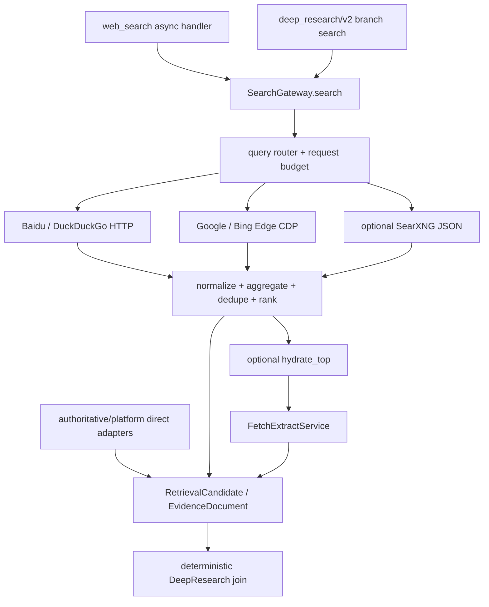

# DeskPet Search Gateway 与 DeepResearch 可视化升级实施计划

<!-- plan-status: finalized -->
<!-- finalized-by: plan-bs; user-approved: 2026-07-14 -->

> 日期：2026-07-14
> 状态：已执行完成；自动化、真实网络 DeepResearch 与 Windows W01～W05 全部通过
> 验收基线：[acceptance.md](acceptance.md)
> 架构基线：[../../ARCHITECTURE/SEARCH_GATEWAY_DEEPRESEARCH.md](../../ARCHITECTURE/SEARCH_GATEWAY_DEEPRESEARCH.md)
> 执行边界：本文只规划，不在 plan-bs 阶段实现代码。

## 1. 交付结果

本计划完成后，DeskPet 将具备：

1. 内置、默认开启的 SearXNG-like Search Gateway。它是 Python backend 内的异步检索编排层，不要求安装 Docker、SearXNG 或付费 API。
2. `web_search` 与 DeepResearch 共用同一通用搜索 contract；真正的 SearXNG 仍是可选 HTTP provider。
3. Scrapling、httpx、Edge CDP、Jina（显式开启）和 Trafilatura/Selectolax 收敛到共享 FetchExtractService。
4. 新启动的 DeepResearch 默认进入 immutable `deep_research/v2`：最多 6 个 checkpoint 分支、有界真并发、静态 join、确定性合并与部分失败交付；v1 保留用于旧 run 恢复。
5. 聊天中始终可见一条总体进度；每个用户可理解阶段完成后追加一条持久化阶段消息，默认折叠隐藏，展开后按序审计。
6. 快速搜索、引用质量、进度恢复和 Windows 桌面 E2E 有可复核的自动化及真机证据。

## 2. 不做的事

- 不打包或启动完整 SearXNG/Valkey/Docker/第二套 backend。
- 不接入付费搜索 API 作为默认依赖。
- 不自动破解 CAPTCHA，不引入代理池或绕过上游限制。
- 不引入 Crawl4AI/Playwright 浏览器包替代现有 Scrapling + Edge CDP。
- 不重写 AgentLoop、ToolRegistry、SessionDB 或整个 workflow engine；只补齐本需求依赖的异步 handler、静态 frontier 有界并发和进度投影能力。
- 不原地修改 `deep_research/v1` definition、handler 或 manifest；不破坏旧 checkpoint。

## 3. 已定架构决策

### D1 — 内置 Gateway，不内置 SearXNG 服务

新建 `backend/deskpet/retrieval/`，由一个进程内 `SearchGateway` 统一 provider、路由、聚合、去重、排序、缓存、冷却和诊断。`SearXNGProvider` 只在配置 URL 后注册。

放弃方案：把 SearXNG 源码或 Docker 镜像打进安装包。原因是桌面生命周期、端口、升级、AGPL 分发和额外运行时复杂度都与本需求不匹配。

### D2 — 异步入口是唯一生产主路

`web_search` 改为 async handler；ToolRegistry 已能 await coroutine handler，不改注册/执行协议。旧 `search_provider.search()` 只保留兼容 facade，生产 quick search 不再调用它。

### D3 — 通用 SERP 与权威 direct sources 分层

Gateway 管 Google/Bing CDP、Baidu、DuckDuckGo、兼容 Bing HTTP 和可选 SearXNG。Agent-Reach、Wikipedia/arXiv、CNInfo/EDGAR 等 direct adapters 保持专用路由，但在进入研究候选池时转换为相同 `RetrievalCandidate/EvidenceDocument` contract。

### D4 — 新增 v2，不变更 v1

`deep_research/v2` 使用固定 6 个 branch slot。实际子问题不足时，多余 slot 写 no-op 结果并参加静态 join；无需 dynamic-map。`deep_research/v1` 继续注册 definition 和 launcher adapter，只服务旧 run 恢复/历史。

### D5 — 补齐 NodeDispatch.PARALLEL 的保守语义

原生 executor 只并发执行同一 frontier 中明确标记 `NodeDispatch.PARALLEL`、非 barrier、无 interrupt 的任务，并受 `NativeExecutionPolicy.max_parallel_tasks` 限制。SINGLE 节点仍按原顺序执行。并发 worker 只允许执行 handler，并把成功结果提交为 `succeeded_pending`；worker 不得调用 `commit_retry()`、`commit_failure()` 或推进 interrupt。frontier coordinator 等全部 worker 收束后，按稳定 `task_id` 选择唯一错误并只提交一次 retry/failure/interrupt 决策，避免多个失败竞争同一 checkpoint head。恢复时复用已提交 pending results。

### D6 — 进度复用现有 outbox 双投影

继续使用 `workflow.progress` event type：

- v1 payload 原样兼容；
- v2 payload 增加 `schema_version=2`、`kind=stage`、内部 `workflow_name/workflow_version`、用户安全 `workflow_label`、`stage_id`、`stage_instance_id`、`status`、用户安全的 `summary/text`、`completed_count`、白名单 metrics、`duration_ms`、`degraded` 和 `next_stage`；
- 每个事件同时走 session_message 持久化和 websocket live delivery；历史仍通过 `workflow_event_id` hydrate；
- 前端对同一事件同时更新 summary，并在 `status=completed && kind=stage` 时 append 阶段 message。

传输允许 at-least-once；稳定 event key、SessionDB `workflow_event_id` 和前端 event/seq reducer 提供幂等结果。

### D7 — 阶段完成绑定 durable task identity

`completed` event key 使用 `workflow_version + node_id + task_id + completed`，不使用 retry attempt。`stage_instance_id` 是上述内部身份的单向摘要，不暴露 task/checkpoint。循环产生不同 task_id，因此 `gap` 多轮不会互相折叠；同一 task 重试只产生一个完成气泡。

`succeeded_pending` 不等于用户可见的“完成”。coordinator 只有在 reducer、route、join 和下一 frontier 全部构造成功后，才为本轮成功的 public task 构造 completion intents，并与 state/frontier/head/pending→succeeded 提升一起交给 `commit_frontier(..., intents=...)`。Checkpointer 在同一数据库事务中 materialize `workflow.progress` event 及其 deliveries；事务提交后由既有 launcher dispatcher 投递 websocket/SessionDB。恢复只重试 durable outbox 中未投递 delivery，绝不根据 pending result 补造完成事件。reducer/route/frontier 构造失败时不得出现 completed。

completed policy 按 `(workflow_name, workflow_version)` 路由，第一期仅 `deep_research/v2` 开启；`deep_research/v1`、PPT 和 Code workflow 保持原行为。

## 4. 目标调用链




## 5. 核心契约（实现时不得临场改形状）

### 5.1 Retrieval contracts

在 `backend/deskpet/retrieval/contracts.py` 定义 frozen/slots dataclass 与 JSON serializer：

- `SearchRequest`：`query`、`max_results`、`region`、`mode(quick|research)`、`hydrate_top`、`total_timeout_s`、`request_id/run_id`。
- `SearchBudget`：总 deadline、provider 并发、per-provider timeout、CDP 次数、hydrate 次数；每个 request 独立。
- `ProviderAttempt`：provider、status（hit/empty/timeout/blocked/captcha/error/cooldown/cache_hit）、elapsed_ms、result_count、public_error_code。
- `RetrievalCandidate`：stable_id、url、canonical_url、title、snippet、published_at、provider、providers、provider_rank、score、searched_at、source_kind。
- `SearchResponse`：query、results、count、engines_tried/hit、errors、elapsed_ms、cache_hit、degraded。
- `FetchRequest`：url、timeout、extract、render_policy、include_html、max_chars、request budget。
- `EvidenceDocument`：candidate fields + text、content_hash、fetcher、extractor、fetched_at、quality_flags。

所有 error/detail 字段使用枚举或短白名单文本；Cookie、headers、token、完整带 query secret 的 URL 不进入 metrics/progress。

### 5.2 DeepResearch v2 state channels

- `values`：单 writer 的全局 research state、config、public_progress。
- `branch_expand`、`branch_search`、`branch_direct`、`branch_fetch`、`branch_score`：`DICT_DISJOINT`，key 为固定 `b0..b5`，对应阶段 branch node 是唯一 writer。
- `branch_events`：`STABLE_LIST`，item id 为 `branch_id:stage:error_code`，只存结构化局部失败/降级。
- `blob_refs`：`STABLE_LIST`，item id 为 sha256；沿用 content-addressed blob，大正文不复制进多个 branch channel，branch payload 只存已注册 blob ref 和 metadata。blob owner 固定三段转换：`RegisteredBlobStore.put(data, execution_identity)` 先写 immutable 文件，再在一个 DB transaction 中幂等注册 `workflow_blobs` 并添加 `run_staging(run_id)` owner；`commit_task_result(..., blob_refs=...)` 在提交 pending patch 的同一事务添加 `pending_task(run_id:checkpoint_id:task_id)` owner并删除对应 staging owner；`commit_frontier` 在提升 pending 的同一事务添加 checkpoint owner并删除对应 pending_task owner。retry 保留健康 pending owner；terminal/cancel/stale-pending 由 lifecycle-aware retention 释放。file-write 后/DB-register 前的 filesystem orphan，以及未进入 pending 的终态 staging ref，均在 grace period 后清理。

`values.public_progress` 固定为 `{completed_stage_ids, stage_projection, run_started_at, warning_count}`；其中 `stage_projection={stage_id,metrics,degraded,next_stage,started_at,finished_at,duration_ms}`。public node handler 只返回 stage_id/metrics，Native worker 在 `commit_task_result` 前用 durable `NativeExecutionInfo.first_attempt_time` 和单次捕获的 `finished_at` 补齐时间（`duration_ms=max(0, round((finished_at-started_at)*1000))`），并把完整 projection 冻结进 pending patch。reducer 以固定 13-stage allowlist 做 set-union 并稳定排序；coordinator 只从 pending patch/merge 后 state 构造 payload，恢复不得重新计时，因此 `completed_count=len(completed_stage_ids)` 与 frontier commit 原子一致。branch internal node 不得写该对象。

join 按 `branch_id -> canonical_url -> content_hash` 排序；引用编号只在全局 join/rerank 后分配，绝不沿用 branch 内完成顺序。

固定 branch contract：

- `BranchWorkItem`：`branch_id`、`active`、`mode`（`fanout|flat`）、按稳定顺序排列的 `questions`。
- `BranchBudgetState`：`query_remaining`、`url_remaining`、`fetch_remaining`、`llm_remaining`、`engine_retry_limit`、`deadline_at`（Unix epoch seconds）。恢复期间经过的墙钟时间计入 deadline；每个外部调用先检查预算，成功或已被归一化为业务降级结果时由该 node 的唯一 patch 扣减。`retries_remaining` 不是独立持久化计数，而是 `max(0, min(node_policy.max_attempts, engine_retry_limit) - task.retry_attempt)` 的只读投影；`task.retry_attempt` 由 `commit_retry` durable 增加，重启不得归零。
- fanout OFF 或子问题少于阈值时 `active_branch_count=1`：`b0.questions` 包含全部子问题、`mode=flat`，仍逐阶段执行 expand/search/direct/fetch/score，禁止调用整段 `run_research_core()`；`b1..b5` 每阶段写确定性 no-op patch。
- fanout ON 时，每个 active slot 最多承载一个子问题，最多 6 个；每阶段输入只读 `BranchWorkItem + 上一阶段该 branch patch + BranchBudgetState`，输出固定为该阶段结果、更新后的 budget 和结构化 `branch_events`。no-op patch 固定包含 `active=false`、stage、空结果、原 budget，不执行外部调用。

### 5.3 Public progress payload v2

```json
{
  "schema_version": 2,
  "kind": "stage",
  "workflow_name": "deep_research",
  "workflow_version": "v2",
  "workflow_label": "深度调研",
  "stage_id": "search",
  "stage_instance_id": "opaque-stable-id",
  "stage": "搜索资料",
  "ordinal": 4,
  "total": 13,
  "status": "completed",
  "summary": "已从 3 个来源获得 18 条候选，去重后保留 11 条",
  "text": "已从 3 个来源获得 18 条候选，去重后保留 11 条",
  "completed_count": 4,
  "metrics": {"providers": 3, "candidates": 18, "kept": 11},
  "duration_ms": 1240,
  "degraded": false,
  "next_stage": "direct"
}
```

`summary` 只能由本地模板和白名单计数生成，`text` 必须与 `summary` 完全相同；`completed_count` 是该 run 已 durable commit 的不同 `stage_id` 数量（0..13），不用 ordinal 冒充；循环中的 gap/search 等每次产生独立 child bubble，但同一 stage_id 后续 activation 不重复增加总体计数。`metrics` 每个 stage 有固定 schema：normalize=`mode`；plan=`question_count/active_branch_count`；expand=`query_count`；search=`providers/candidates/kept`；direct=`direct_sources/candidates`；fetch=`attempted/succeeded/dropped`；score=`passages/kept`；gap=`iteration/followup_count/new_evidence`；rerank=`passages/domains`；synth=`sections/claim_count`；cite=`citations/supported/unsupported/support_rate`；persist=`artifact_count/report_bytes`；finalize=`citations/status`。不能把任意 dict、prompt、query、URL、异常栈或内部路径透传给前端。

## 6. 工作项

### WI-0 — 锁定绿色基线与失败复现

**修改文件**

- `backend/tests/test_p4s22_web_search.py`
- `backend/tests/test_search_provider.py`
- 新增 `plans/2026-07-14-search-gateway-deepresearch/baseline.md`（执行阶段记录，不在 plan-bs 创建结果）

**实现步骤**

1. 跑现有 search、research graph、native engine、workflow progress、sessionsStore 和 MessageStreamPanel 测试，记录 commit、命令、通过数和已知 flaky；基线非绿先修/隔离，不能把旧失败算到本计划。
2. 先用独立 baseline probe 保存“默认队列只有 `google-cdp` 时，现有 `web_search()` 调同步 `search()` 会跳过 provider 并返回 empty”的 pre-fix 输出到 `baseline.md`；同一回归测试先以 `xfail(strict=True, reason="production web_search still skips async CDP provider")` 纳入 G0，WI-4 删除 xfail 并让原测试在 async production wiring 下转绿。禁止用宽松 xfail 掩盖其他异常。
3. 固化当前 `deep_research/v1` manifest/implementation hash golden fixture，并从 normalize、search、fetch、synth/cite 等多个阶段保存真实序列化 checkpoint fixture；恢复后比较完整 state、report 和 artifact payload。测试固定使用现有依赖锁，计划实施期间不得修改 `backend/uv.lock`，因为 dependency lock 参与 definition hash。

**Gate G0**

```powershell
backend\.venv\Scripts\python.exe -m pytest backend/tests/test_search_provider.py backend/tests/test_p4s22_web_search.py backend/tests/test_workflow_native_engine.py backend/tests/test_workflow_deep_research_graph.py backend/tests/test_workflow_progress.py -q
Set-Location tauri-app
npm test -- --run src/stores/sessionsStore.test.ts src/components/MessageStreamPanel.workflow.test.tsx
```

**AC**：AC-TEST-01，兼容边界。

### WI-1 — Retrieval contract、配置与生命周期

**新增文件**

- `backend/deskpet/retrieval/__init__.py`
- `backend/deskpet/retrieval/contracts.py`
- `backend/deskpet/retrieval/runtime.py`
- `backend/deskpet/retrieval/cache.py`
- `backend/tests/test_retrieval_contracts.py`
- `backend/tests/test_search_gateway_config.py`

**修改文件**

- `backend/config.py`
- `config.toml`
- `backend/main.py`

**实现步骤**

1. 在 `config.py` 增加 `SearchGatewayConfig` 并由 `AppConfig` typed load/validate：`enabled=true`、`route=auto`、默认 providers=`["baidu","duckduckgo","google-cdp","bing-cdp"]`、quick 总 deadline=`5s`、per-provider timeout=`2s`、`quick_min_results=5`、`quick_min_domains=2`、`research_target_results=20`、`research_target_domains=5`、research 总 deadline、最大并发、request CDP/hydrate budget、cache size/TTL、cooldown threshold/TTL、空 `searxng_url`。只有 URL 非空时才把 `searxng` 插入可用 providers；legacy `bing` HTTP adapter 可显式配置但不在默认集合。
2. 默认配置测试阶段全开；`[research].search_engines/searxng_url/serp_hardening` 作为兼容 alias，新 `[search_gateway]` 显式值优先。旧 `[research].search_engines` 只有配置文件中确实存在该 key 时才覆盖 providers，旧 loader 的 `google-cdp` 默认值不得被误判为用户显式配置。非法 URL、负 timeout、并发 >6 启动时报稳定 ConfigError。
3. `runtime.py` 提供 `build_search_gateway(config)`、`set_default_gateway()`、`get_default_gateway()` 和 shutdown；main lifespan 构造一次并注册 service_context，退出时关闭 AsyncClient/CDP pending tasks。
4. cache/health 是进程共享、带 `asyncio.Lock` 的有界 LRU/TTL；SearchBudget、attempts、diagnostics 是 request-local，禁止复用 `_last_*` 全局观测。

**测试**：配置默认/alias/非法值、LRU 上限、TTL、并发 request 诊断隔离、shutdown 无 pending task。

**AC**：AC-SG-01、03、06、09、10。

### WI-2 — Provider adapters、路由、聚合去重与排序

**新增文件**

- `backend/deskpet/retrieval/providers/base.py`
- `backend/deskpet/retrieval/providers/google_cdp.py`
- `backend/deskpet/retrieval/providers/bing_cdp.py`
- `backend/deskpet/retrieval/providers/baidu.py`
- `backend/deskpet/retrieval/providers/duckduckgo.py`
- `backend/deskpet/retrieval/providers/bing_http.py`
- `backend/deskpet/retrieval/providers/searxng.py`
- `backend/deskpet/retrieval/routing.py`
- `backend/deskpet/retrieval/ranking.py`
- `backend/deskpet/retrieval/search_gateway.py`
- `backend/tests/test_search_gateway_providers.py`
- `backend/tests/test_search_gateway_routing.py`
- `backend/tests/test_search_gateway_ranking.py`

**修改文件**

- `backend/deskpet/tools/search_provider.py`
- `backend/deskpet/tools/research_cdp_edge.py`

**实现步骤**

1. 每个 provider 实现 `name/capabilities/is_available/search(request,budget,client)`，返回 candidates 或 typed failure；把现有纯 parser 和 CAPTCHA detector 搬到 adapter，`search_provider.py` re-export 兼容函数供旧测试/调用。
2. `routing.py` 按 query language、provider capability、health/cooldown、SearXNG 是否配置生成稳定 batch，quick 并发 cap=2。中文 batch-1=`[searxng(若配置), baidu]`；非中文若配置 SearXNG，batch-1=`[searxng, duckduckgo]`，否则 batch-1=`[duckduckgo, google-cdp(仅已有 reachability cache=true)]`。Google reachability unknown 时，与 batch-1 HTTP 请求并行做最多 500ms probe；probe 转 true 后 Google 才进入下一 batch。每批完成后先 canonicalize/dedupe，再计算结果数与独立 normalized host 数（lowercase、去端口和尾点、仅剥离单个 `www.`，不新增 PSL 依赖）；quick 仅当两者同时达到 `5/2` 才停止，否则中文下一批=`[尚未执行的 google-cdp(若 reachable), bing-cdp]`，非中文同样按 `[尚未执行的 google-cdp(若 reachable), bing-cdp]`，列表按书写顺序以 2 个一组。cooldown/unavailable/已执行项过滤后不补入未配置 provider。所有 batch 共享 `deadline=started_at+5s`、2s provider timeout、CDP budget 与剩余时间；预算耗尽时返回已去重 partial results + degraded diagnostics。research 使用同一稳定 provider 顺序，但每批后仅在结果数和独立 normalized host 数同时达到 `20/5` 时停止，否则继续到 research deadline。该保证是“无配置至少真实尝试一个 provider”，不是保证一定有结果。
3. 单 provider 的 403/429/CAPTCHA/timeout/empty 只写 attempt 并触发下一个 provider；不把失败伪装为结果。达到阈值才进入 cooldown，成功 half-open 清零。
4. `ranking.py` 去 tracking params、规范 host/path、处理 redirect URL；先 canonical URL 去重，再 title/snippet/content fingerprint 去重；合并 providers 和原始 rank。
5. 最终 score 固定由 query relevance、provider rank、freshness（有日期才算）、domain quality、source diversity 组成；稳定 tie-breaker 为 canonical_url，保证并发完成顺序不影响结果。
6. Gateway 取消 deadline 后的 provider tasks，释放 CDP/request semaphore；缓存只写成功的标准结果，不缓存凭据/原始 HTML/不可重试错误。
7. SearXNG URL 规范为显式 `/search` endpoint，请求 `format=json`；JSON 被禁、响应 HTML 或不可达时返回 typed failure 后继续路由。

**测试**：每个 parser fixture、CAPTCHA/429/timeout、wave fallback、并发重排稳定、canonical dedupe、cache/cooldown、request cancellation、SearXNG JSON/HTML/missing URL。

**AC**：AC-SG-02、04、05、06、07、09，AC-OBS-01。

### WI-3 — 共享 FetchExtractService 与 hydrate_top

**新增文件**

- `backend/deskpet/retrieval/fetch_extract.py`
- `backend/deskpet/retrieval/content_quality.py`
- `backend/deskpet/retrieval/transports/__init__.py`
- `backend/deskpet/retrieval/transports/scrapling.py`
- `backend/tests/test_fetch_extract_service.py`

**修改文件**

- `backend/deskpet/tools/web_tools.py`
- `backend/deskpet/tools/research_tools.py`
- `backend/deskpet/tools/scrapling_tools.py`
- `backend/deskpet/retrieval/search_gateway.py`

**实现步骤**

1. 冻结三层依赖方向：raw transport（`retrieval/transports/scrapling.py`，只封装 Scrapling，绝不 import service）→ `FetchExtractService`（依赖 raw Scrapling transport、async httpx、extractor/CDP/Jina ports）→ web/research tools async thin adapters。抽出 URL 规范化、domain policy、robots、host throttle、cache 和 content-type/size guard，形成唯一 FetchExtractService，禁止 service→tool→service 循环。
2. 本地链路：raw Scrapling → async httpx → Trafilatura/Selectolax quality probe；正文短且 HTML 足够像 app shell 时，在 request CDP budget 内用 Edge 重渲染再抽取；仍弱且用户显式开启才调 Jina。删除不可用 `research_crawl4ai` 分支。
3. 返回统一 EvidenceDocument：实际 fetcher/extractor、canonical URL、title/text/published/fetched、hash 和固定 quality flags（empty/mojibake/duplicate/ai_disclosure/captcha/unsupported_content_type）。
4. 迁移 `_fetch_one()` 的全部生产调用点：`_handle_web_fetch`、`_handle_web_extract_article`、`_handle_web_crawl`、`_handle_web_read_sitemap`，连同 `_handle_scrapling_fetch`、`research_tools.default_extract` 全部改为 async thin adapter，并逐一更新 registry 注册测试。`web_crawl`/sitemap 在 service 提供的 host/request cap 下 await，不用 `asyncio.to_thread` 包住第二套同步策略。保留工具名/主要返回字段；旧 `_fetch_one()`、`_scrapling_fetch_html()` 如测试仍引用，只允许转调 raw transport/service 的兼容 facade，不得包含 fallback 策略。
5. Gateway 在最终排名后执行 `hydrate_top`，默认 0、hard cap 3；逐条失败只记录该 result 的 hydration_error，不丢其他结果。

**测试**：三层 import-cycle guard、fallback 次序、robots/throttle、动态壳双闸、Jina opt-in、乱码/AI 声明/content-type、并发 cache、六个上层 adapter 的 async registry invocation 与旧输出兼容、`_fetch_one()` 零生产引用、hydrate 部分失败。

**AC**：AC-SG-08，AC-FE-01/02/03。

### WI-4 — 接通 async web_search 与 DeepResearch SearchPort

**修改文件**

- `backend/deskpet/tools/code_tools/web_search_tool.py`
- `backend/deskpet/tools/code_tools/registration.py`
- `backend/deskpet/tools/search_provider.py`
- `backend/deskpet/tools/research_tools.py`
- `backend/deskpet/workflows/definitions/deep_research_v2_search.py`
- `backend/deskpet/workflows/definitions/research_core.py`
- `backend/main.py`
- `backend/tests/test_p4s22_web_search.py`
- `backend/tests/test_deskpet_research_tools.py`
- `backend/tests/test_search_gateway_production_wiring.py`

**实现步骤**

1. `web_search()` 改为 async，构造 quick SearchRequest，await default gateway，JSON 输出保留 query/count/results/error 并追加 engines_tried/hit/errors/elapsed_ms/degraded；schema 新增 `hydrate_top`，修正文案不再写死 DDG。
2. 证明不需要改 ToolRegistry：新增 production registry test，async handler 真被 await，默认 `google-cdp` 不再经过同步 skip 分支。
3. `search_provider.search_async()` 变为 Gateway compatibility facade；同步 `search()` 标注 legacy，仅给显式 HTTP engines，不能被生产 wiring 引用。
4. 为 research 增加返回 `SearchResponse` 的 adapter；v2 stage 通过 `deep_research_v2_search.py` 直接消费 request-local diagnostics。`ResearchSearchPort.search()` 的旧 list contract 与其 v1 调用路径保持不变；若必须接触 `research_core.py`，只允许纯新增 protocol/default adapter，不能改变 v1 会调用的函数语义，也不能依赖 `_last_engines_hit/_last_search_errors`。
5. direct source 结果转为 RetrievalCandidate/EvidenceDocument 后进入同一 dedupe/score；保留 Agent-Reach/权威 API 的 route/trace 字段。

**Gate G1**：WI-1～4 聚焦测试 + search/research/web tools 相关回归全绿；运行 async production wiring smoke，确认默认 quick search 至少尝试一个 provider且无全局 observation 串线。

**AC**：AC-SG-01、03、07、08、10，AC-DR-01，AC-TEST-01。

### WI-5 — Native frontier 有界并发与 pending-result 恢复

**新增/修改文件**

- `backend/deskpet/workflows/contracts.py`
- `backend/deskpet/workflows/native.py`
- `backend/deskpet/workflows/store/checkpointer.py`
- `backend/deskpet/workflows/store/registered_blob_store.py`
- `backend/deskpet/workflows/retention.py`
- `backend/deskpet/workflows/definition.py`（只读 dispatch，不改变 v1 definition payload/hash）
- `backend/tests/test_workflow_native_engine.py`
- `backend/tests/test_workflow_recovery.py`
- `backend/tests/test_workflow_blob_durability.py`
- `backend/tests/fixtures/workflow_manifests/deep_research_v1.json`

**实现步骤**

1. 增加 `NativeExecutionPolicy(max_parallel_tasks)` context port；默认 1，v2 context 设 2～6，v1 无 parallel node 因而行为不变。
2. 把 `_drive()` 的 frontier task loop 抽成 `_run_frontier_tasks()`：SINGLE/barrier 维持串行；纯 PARALLEL frontier 按 semaphore 并发，结果仍按 task_id 排序后 `merge_patches()`。
3. 把当前 `_run_task()` 拆成无终态副作用的 worker 与唯一 coordinator：worker 返回 `NodeTaskOutcome(task, patch_or_none, consumed, error_or_none, identity)`；成功时从 patch 收集、校验、排序唯一 blob refs，并经 `commit_task_result(..., blob_refs=...)` 的同一事务提交 `succeeded_pending` + pending_task owners；但捕获 retryable/permanent/interrupt 异常时只填 outcome，不调用 `commit_retry()`、`commit_failure()` 或 interrupt commit。
4. coordinator 使用 `gather(return_exceptions=True)` 等待全部已开始 worker 收束，保留已成功 pending 的健康 branch，并按固定优先级只提交一个决策：外部 cancellation → SINGLE task 的合法 `WorkflowSuspended` interrupt → permanent/已耗尽 retry 的错误 → eligible retryable 错误；同一类别再按稳定 `task_id`。PARALLEL task 出现 suspend 视为 engine invariant failure；unexpected exception 归一化为 permanent engine error。这样 retryable 不能遮蔽同批 permanent error。若 checkpoint head 已因外部取消/终态改变，CAS 失败后 reload 并停止，不让健康 branch 在 terminal head 后继续推进。
5. `CancelledError` 时取消并 await 全部 child，coordinator 统一提交取消语义；interrupt-capable/barrier 绝不允许 parallel。
6. recovery test 模拟部分 branch 已 pending、进程重启、失败 branch 重试，断言成功 branch invocation count 不增加、join 只 firing 一次、最终 state 与串行基准相同。
7. retry eligibility 只用 durable `task.retry_attempt` 与 branch 初始 `engine_retry_limit` 推导；`commit_retry` 是唯一增加 attempt 的写点，恢复从 checkpoint/node-attempt row 投影相同值。observer/reporter 的 retry/failed/waiting 只在 coordinator 决策后发一次，worker 不提前发终态。
8. 补齐 blob durability：`RegisteredBlobStore.put(data, execution_identity)` 完成 filesystem put + registry row + run_staging owner；Native store protocol、InMemory store 的 `commit_task_result/commit_frontier` 与 `_drive()` 均增加 `blob_refs`。task-result commit 原子转换 staging→pending_task；frontier commit 从 merge 后 state 的 STABLE_LIST 收集、校验、排序去重，验证 registry row/metadata，原子转换 pending_task→checkpoint owner。恢复读取时 `RegisteredBlobStore.get()` 校验文件存在、size/hash。retention 只清理终态/取消/过期 run 的 staging/pending_task、无 owner registry blob 和 filesystem orphan，绝不删除 active/retryable run 的 provisional owner 或 checkpoint owner 文件。
9. golden test 断言 v1 manifest/hash 与多个阶段序列化 checkpoint 恢复行为未改变；实施只用 stdlib/现有依赖，不修改 `backend/uv.lock`。若必须触碰会改变 v1 callable 或传递依赖语义的文件，停止实施并另开兼容设计，不得更新 golden 掩盖问题。

**测试**：真实 overlap 时间、并发 cap、mixed frontier 拒绝/串行、稳定 merge、双 retryable、retryable+permanent（permanent 胜出）、健康 pending+失败竞争、取消期间失败、attempt 到上限后重启仍 terminal、cancel cleanup、restart pending reuse；blob 在 file/register/task-result/frontier 四个 crash 点、staging→pending→checkpoint owner 转换、missing registry、missing file/integrity error、filesystem orphan，以及“健康 pending 等待失败 branch，时钟推进超过 orphan_grace 后运行 retention，blob 仍存在且恢复成功”；v1 hash 与真实 checkpoint resume fixtures。

**AC**：AC-DR-02/03/04，兼容边界。

### WI-6 — 新增 deep_research/v2 静态 fan-out 图

**新增文件**

- `backend/deskpet/workflows/definitions/v2/__init__.py`
- `backend/deskpet/workflows/definitions/v2/deep_research.py`
- `backend/deskpet/workflows/definitions/deep_research_v2_contracts.py`
- `backend/deskpet/workflows/definitions/deep_research_v2_nodes.py`
- `backend/tests/test_workflow_deep_research_v2.py`
- `backend/tests/test_workflow_deep_research_v2_recovery.py`

**修改文件**

- `backend/deskpet/workflows/bootstrap.py`
- `backend/main.py`
- `backend/config.py`
- `config.toml`

**实现步骤**

1. 注册 v1 + v2；main 为两个版本都注册 state/context adapter，新 launch 固定 `deep_research/v2`，recovery 按 row version 找原 adapter。
2. v2 plan 后创建固定 `BranchWorkItem[b0..b5]`。fanout OFF 或低于阈值：`active_branch_count=1`，b0 以 `mode=flat` 持有全部稳定排序子问题，并仍按五个 branch stage 逐步运行，禁止调用 `run_research_core()` 整段入口；b1..b5 每阶段都产出标准 no-op patch。fanout ON：最多 6 个 active slot，每 slot 一个子问题。
3. 每个阶段是 6 个 PARALLEL branch node + 一个 public join node：expand、search、direct、fetch、score。固定 I/O：expand=`work_item -> query_specs+budget`；search=`query_specs -> RetrievalCandidate+ProviderAttempt+budget`；direct=`questions -> direct candidates+source traces+budget`；fetch=`deduped candidates -> EvidenceDocument/blob_refs+budget`；score=`evidence -> scored passages+coverage+budget`。每个 patch 都带 `branch_id/stage/active/result/errors/budget_after`；no-op 固定为 `active=false/result=[]/errors=[]/budget_after=budget_before`。branch 写对应 DICT_DISJOINT channel；join 必须收齐 6 个 key、校验 schema/branch_id/stage、按 branch_id 和内容稳定键归并后才准备下一阶段 state。
4. `BranchBudgetState` 持久化 query/url/fetch/llm remaining、初始 `engine_retry_limit` 与 Unix `deadline_at`。node 在每个外部调用前检查 remaining/deadline；node 内部 provider/fetch fallback 在同一最终 patch 中扣实际调用次数，timeout/blocked/empty 转为结构化 branch event 与降级结果。engine 只重试 checkpoint/基础设施异常，coordinator 用 durable `task.retry_attempt` 推导只读 retries_remaining，不能重置 wall-clock deadline；这类异常未产生业务 patch，不重复扣业务调用预算，但 durable attempt 上限阻止无限重放。
5. score join 全局按 canonical URL/content hash 去重，聚合 passages/errors/coverage；gap/rerank/synth/cite/persist/finalize 继续单 writer。gap 只在剩余总预算内补证。
6. checkpoint 大正文写 blob，branch channel 只持 metadata/ref；恢复时 blob missing 返回稳定 failure，不静默生成引用。
7. coverage 增加 native_fanout（active/completed/failed/waves/branch budgets/per-question coverage），但不暴露内部 prompt/query 到普通聊天。

**测试**：1/2/6 子问题、fanout OFF 的 b0 全问题逐阶段且整段入口零调用、每阶段 6-key/no-op schema、不同完成顺序同输出、单/全 branch 失败、每类预算扣减与 deadline 继承、checkpoint 在五个 branch stage 和 join 后逐点恢复、pending patch 恢复不重复扣预算、blob missing、v1 run 恢复 + v2 新 run 默认。

**AC**：AC-DR-02/03/04，AC-UI-02 的阶段基础，AC-TEST-01。

### WI-7 — 证据质量、claim-support 与报告交付

**新增文件**

- `backend/deskpet/workflows/definitions/deep_research_v2_quality.py`
- `backend/deskpet/workflows/definitions/deep_research_v2_report.py`
- `backend/tests/test_deepresearch_claim_support.py`
- `backend/deskpet/workflows/evaluation/fixtures/deep_research_claim_support.json`

**修改文件**

- `backend/deskpet/workflows/definitions/deep_research_v2_nodes.py`
- `backend/deskpet/workflows/definitions/v2/deep_research.py`

**实现步骤**

1. query expansion、source packs、direct sources、层级 score、gap、global rerank、来源多样性、claim-support 和报告渲染全部实现于 v2-only modules；WI-7 禁止修改 `research_core.py` 及 v1 handlers 调用的阶段函数语义。只用 stdlib/现有依赖，不修改 `backend/uv.lock`。
2. 冻结 `ClaimRecord={claim_id,text_hash,paragraph_index,citation_ids,kind:factual|analysis|opinion}` 与 `SupportDecision={claim_id,status:supported|unsupported|inference,evidence_ids,lexical_score,semantic_score|null,reason_code}`。解析时跳过 heading/code/reference appendix，正文按 Markdown paragraph 后再按 `。！？.!?` 切句；含数值/日期/百分比/货币/比较级/归因词/明确断言或 citation 的句子判为 factual，含“可能/意味着/推测/likely/may”等推断标记为 analysis，规范性偏好为 opinion，歧义默认 factual（fail closed）。
3. citation binding：句内 citation 只绑定该句；段尾连续 citation cluster 可绑定同段尚无句内 citation 的事实句；citation id 必须解析到最终 EvidenceDocument 且正文非空。支持条件为有效 evidence 且 token/Jaccard lexical score `>=0.15` 或现有 semantic scorer `>=0.72`；包含数值/日期的 claim 还必须在 evidence 中精确匹配全部关键数值/日期 token，semantic 不得覆盖该规则。semantic scorer 不可用时仅走 deterministic lexical+exact-token 判定。
4. LLM repair 最多一次，严格 JSON schema 为 `{replacements:[{claim_id,replacement,citation_ids}],removals:[claim_id]}`；只接受已存在 claim_id/evidence citation id，不允许新增 claim、来源或事实，并限制 replacement 长度。应用后完整重跑 parser 和 deterministic support。最终 unsupported factual claim 删除；analysis/opinion 只有绑定有效 evidence 才可保留并显式标为“推断”，否则删除。无来源时交付 no-results/failure，不用预训练知识补引用。
5. report 固定包含：直接回答、证据化发现、分析/推断、局限/反证条件、引用 appendix、coverage、degraded/error summary；Artifact 和 final assistant 使用同一 immutable report payload。coverage 增加 claim_count、supported_claim_count、support_rate、unsupported_count；普通 progress 只显示数量，不显示 claim 原文。

**Gate G2**：WI-5～7 的 native/v1/v2/recovery/quality 测试全绿；fixtures 覆盖句内/段尾 citation、错误 citation id、数字日期冲突、semantic 有/无、非法 repair/二次 repair；同一 fixture 重跑 10 次 citation numbering/report hash 稳定；多个 v1 checkpoint resume 的 state/report 与 baseline 完全一致。

**AC**：AC-DR-05/06，AC-OBS-02。

### WI-8 — 后端阶段完成事件与 durable 恢复

**修改文件**

- `backend/deskpet/workflows/progress.py`
- `backend/deskpet/workflows/native.py`
- `backend/deskpet/workflows/launcher.py`
- `backend/deskpet/workflows/store/checkpointer.py`
- `backend/main.py`
- `backend/deskpet/workflows/definitions/v2/deep_research.py`
- `backend/tests/test_workflow_progress.py`
- `backend/tests/test_workflow_launcher.py`

**新增文件**

- `backend/tests/test_workflow_outbox.py`

**实现步骤**

1. `ProgressTransition` 增加 completed，但 policy key 从仅 `workflow_name` 改为 `(workflow_name, workflow_version)`/manifest capability；只有 `deep_research/v2` 映射 normalize、plan、expand/search/direct/fetch/score 的 public join、gap、rerank、synth、cite、persist、finalize 共 13 类 stage，branch internal nodes 不投影。v1/PPT/Code 的映射和事件数量保持不变。
2. v2 public handler 的 `values.public_progress.stage_projection` 只写 stage 专属 allowlist metrics；Native worker 在提交 pending 前以 durable first-attempt time + 单次 finished time 冻结 `started_at/finished_at/duration_ms`。`WorkflowProgressReporter.build_completion_intent(identity, frozen_projection)` 是无数据库副作用的 pure builder，使用 reporter 启动时冻结的 targets，按本地模板生成内部 `workflow_name/version`、用户可读 `workflow_label`、相同的 `summary/text`、`completed_count`、稳定 event key 和标准 deliveries，未知 key 丢弃并记结构化日志。注意 checkpointer 会用 run row 覆盖内部 name/version，不能把展示标签放在 `workflow_name`。
3. Native worker 提交 `succeeded_pending` 时不报告 completed。coordinator 成功完成 `merge_patches()`、reducers、route/join 与 next-frontier 构造后，从本轮将被 promoted 的 public task 生成 completion intents，与 `_terminal_intents` 合并传给 `commit_frontier(..., intents=...)`。checkpointer 在同一事务内完成 pending→succeeded、state/frontier/head 和 outbox event/deliveries materialize；任一 reducer/route/schema/frontier 构造失败则整批没有 completed。同步更新 `InMemoryNativeCheckpointStore.commit_frontier()` 以捕获并按 event_key 幂等 materialize intents，避免 unit test 与生产 store 语义分叉。
4. completed event key 按 durable task identity 去重；gap 每次 activation 有不同 `task_id/stage_instance_id`，retry 不增加完成气泡。started/retry/waiting/failed 沿用现有 reporter 路径；恢复只 dispatch 已 materialize 的 due delivery，不从 pending result 推断或补造 completed。
5. `_workflow_session_delivery()` 显式 allowlist `schema_version=2 && kind=stage && status=completed`，只取已验证的 `text==summary` 写普通 assistant row，并保存同一 `workflow_event_id`；websocket 投递同一 frozen payload。不新增数据库表和第二条临时 channel。若 payload 缺 text、text/summary 不同或含未知 stage，session delivery 拒绝并记录稳定 error code。
6. `WorkflowProgressReporter` 接收 launcher 的 `notify_dispatcher` callback；Native 仅在 `commit_frontier` 成功返回且本批含 completion intents 后 best-effort 唤醒 dispatcher，使每步近实时投递。通知失败不回滚 checkpoint，后台周期扫描兜底；绝不在事务前直接 deliver。
7. crash/recovery 测试固定三个边界：task-result commit 后/frontier commit 前崩溃（恢复后只使用 frozen pending projection，frontier commit 才产生一次 completed）；frontier DB commit 后/dispatcher 前崩溃（恢复投递既有 outbox，不新建 event）；SessionDB delivery 后/websocket delivery 前崩溃（各 delivery 可重试、投影最终幂等）。另测 reducer/route 失败零 completed、同 task retry 一条、gap 两轮两条、SessionDB row 的 workflow_event_id 与 history hydration 一致、wakeup 失败由周期 dispatcher 补投，以及 pending public task 重启前后 completion intent 的 payload/request hash 与 duration_ms 完全相同。
8. 增加负向版本回归：运行 `deep_research/v1`、PPT Pro、Code Complex 的 started/retry/final flow，断言不出现 `kind=stage/status=completed`，原 payload snapshot 不变。

**AC**：AC-UI-01/02/03/04/05/06，AC-TEST-01。

### WI-9 — 聊天总体进度 + 默认隐藏阶段气泡

**新增文件**

- `tauri-app/src/components/workflow/WorkflowProgressGroup.tsx`
- `tauri-app/src/components/workflow/WorkflowProgressGroup.test.tsx`

**修改文件**

- `tauri-app/src/stores/sessionsStore.ts`
- `tauri-app/src/stores/sessionsStore.test.ts`
- `tauri-app/src/message-panel/MessagePanelRoot.tsx`
- `tauri-app/src/components/MessageStreamPanel.tsx`
- `tauri-app/src/components/MessageStreamPanel.workflow.test.tsx`
- `tauri-app/src/code-panel/ws.ts`

**实现步骤**

1. 新增 `workflow_stage` MessageRole 和字段：parent run、workflow version、event/seq、stage instance、stage id、summary/metrics/duration/degraded/completed_count；summary 仍是 `workflow_progress`，每 run 一条。`MessagePanelRoot.tsx` 的 store→`ChatStreamMessage` 映射必须同时识别两种 role，不能在进 MessageStreamPanel 前丢失 stage 元数据。
2. `applyWorkflowEvent()` 对所有 progress 更新 summary；仅 `deep_research/v2` completed stage 以 `workflow-stage:{event_id}` append child。event_id/seq 双层去重；terminal 锁只阻止 summary 状态/当前阶段回退，任何已存在或之后才到的 completed child 都可合入，不能因 terminal summary 丢失。
3. 历史 merge 继续 consume 带 workflow_event 的普通 assistant row，按 run/seq/event_id replay；live 先到、history 后到或重复 websocket 均得到同一 messages。历史返回 stage 早于 summary 时保留 stage，不能在 reducer 中丢弃孤儿 child。
4. `MessageStreamPanel.buildRows()` 两遍构造：先按 `run_id` 索引 summary 和所有 stage，stage 按 `(seq,event_id)` 稳定排序；再把每组成员消费为唯一 `workflow_group:{run_id}` row，anchor 取该组最早原始 message index，summary/stage 不再各占独立 row。若只有 stage，渲染用户安全的 fallback summary group；summary 后到时以同一 row key 原地升级。不同 run 永不合组，普通 assistant/user rows 顺序不变。
5. `WorkflowProgressGroup` 始终显示 summary card（状态、当前阶段、`max(summary.completed_count, distinct child stage_id count)/13`、elapsed、warning count）；child 默认折叠且不占独立 row，展开后每条 completed event 渲染一个真实 stage bubble。gap 多轮可有多个 child，但总体计数最多 13。
6. waiting、不可恢复 failure、cancelled、final completion 在主流可见；自动降级只在 summary warning 和展开 child 显示。阶段详情只渲染 allowlist，不用 `dangerouslySetInnerHTML`。
7. button 使用 `aria-expanded/aria-controls`，progressbar 有 value text；键盘 Enter/Space；同会话多 run 独立。新增 child/replay 时，用户未在底部则不触发强制滚动。
8. v1 payload 继续只更新旧 summary card，不生成虚假阶段 child。

**Gate G3**

```powershell
Set-Location tauri-app
npm test -- --run src/stores/sessionsStore.test.ts src/components/MessageStreamPanel.workflow.test.tsx src/components/workflow/WorkflowProgressGroup.test.tsx
npm run build
```

前端测试必须覆盖：history stage 先到/summary 后到、terminal summary 后晚到 child、孤儿 fallback→原地升级、跨 run 隔离、event/seq 重复、gap 多 child 但 count≤13、折叠默认值和滚动行为。

**AC**：AC-UI-01～07。

### WI-10 — 可观测性、质量基准、真实网络与桌面验收

**新增文件**

- `scripts/acceptance/search_gateway_smoke.py`
- `scripts/benchmarks/search_gateway_benchmark.py`
- `backend/tests/fixtures/search_gateway_queries.json`
- `testcase/2026-07-14-search-gateway-deepresearch/testcase.md`
- `plans/2026-07-14-search-gateway-deepresearch/results.md`（执行阶段生成）
- `docs/search-and-deepresearch.md`

**修改文件**

- `backend/observability/metrics_sink.py`
- `backend/tests/test_metrics_sink.py`
- `config.toml`
- `ARCHITECTURE/SEARCH_GATEWAY_DEEPRESEARCH.md`
- `STATUS/status.md`

**实现步骤**

1. 新增固定 schema metrics：gateway request/attempt/cache/cooldown/dedupe/hydrate、fetch fallback/quality、v2 branch/stage duration/claim support；detail 只允许 provider/error-code/count/duration/cache bool。
2. benchmark query set 覆盖中英事实、最新信息、官方文档、学术、政策/财报、JS 页面、转载重复与冲突来源；记录 success/empty/Recall@5/P95、引用覆盖/支持率/独立域名/完成率/P95。期望域名与关键词版本化，网络日期写入结果。
3. smoke 走真实 Gateway/DeepResearch production wiring，不直接调用 parser 假装 E2E；分别记录实际 provider、fallback、耗时、错误和最终引用。
4. 编写用户文档：默认无需安装；可选 SearXNG 的 URL/JSON 前提、配置示例、连接诊断、停用方式；说明 CAPTCHA 只降级不破解。
5. 按项目纪律用 Windows Computer Use/Windows MCP 做真机：
   - 中文与英文 quick search；
   - 首选 provider 失败后真实 fallback；
   - DeepResearch 开始后 summary 可见、正常 stage 默认隐藏、展开可见 13 阶段；
   - 运行中关闭并重启应用，原 session 恢复 summary/children 且后台继续；
   - 两个并发 run 分组独立；
   - 最终 report、citations、Artifact 一致。
6. 每 case 按“截图/快照 → 声明坐标动作 → 真输入点击 → 截图 → backend log”留证；不得用 WS 直注、pytest 或脚本回放替代 UI。
7. 自动化、真实网络和真机全部通过后，同次交付更新 STATUS 顶部日期、模块完成度和里程碑；未过不得标完成。

**Gate G4 / DoD**：所有聚焦 + 相关全量测试、benchmark、真实网络 smoke、Windows E2E 全部有结果；所有完成能力默认 ON；无 P0/P1。

**AC**：AC-OBS-01/02、AC-TEST-01/02/03，以及全部 DoD。

## 7. 执行依赖与并行拆分

```text
WI-0 -> WI-1 -> WI-2 -> WI-4 --------┐
                 └-> WI-3 -> WI-4    |
WI-0 -> WI-5 -> WI-6 -> WI-7 --------+-> WI-10
                       └-> WI-8 -> WI-9
```

- Lane A（检索）：WI-1 → WI-2；WI-3 可在 contracts 稳定后并行，最后 WI-4 接线。
- Lane B（workflow）：WI-5 → WI-6 → WI-7，必须顺序通过 native/recovery gate。
- Lane C（进度 UI）：WI-8 后端 payload schema 固定后，WI-9 前端可并行于 WI-7 收尾。
- Lane D（验证）：从 WI-0 建 baseline，持续维护 testcase；WI-10 只能在 A/B/C 都完成后做真机收口。

禁止并行修改热点：`backend/main.py`、`research_core.py`、`native.py`、`sessionsStore.ts` 各自同时只允许一个 owner；合并后立即跑跨层 contract test。

## 8. AC 追踪矩阵

| AC | 工作项 | 主要证据 |
|---|---|---|
| AC-SG-01, AC-SG-10 | WI-1, WI-4 | async production wiring + backward-compatible tool JSON |
| AC-SG-02, AC-SG-04, AC-SG-09 | WI-2 | provider contract/fallback/SearXNG tests |
| AC-SG-03, AC-SG-06 | WI-1, WI-2, WI-4 | default config、deadline/cancel/cooldown tests |
| AC-SG-05, AC-SG-07 | WI-2 | deterministic dedupe/ranking/diagnostics tests |
| AC-SG-08 | WI-3, WI-4 | hydrate_top partial-failure tests |
| AC-FE-01, AC-FE-02, AC-FE-03 | WI-3 | shared service + old tool adapter tests |
| AC-DR-01 | WI-4, WI-6 | gateway/direct normalized candidate tests |
| AC-DR-02, AC-DR-03, AC-DR-04 | WI-5, WI-6 | overlap/cap/checkpoint/join/partial-failure tests |
| AC-DR-05, AC-DR-06 | WI-7 | claim-support fixtures + report/artifact parity |
| AC-UI-01, AC-UI-02, AC-UI-03, AC-UI-04, AC-UI-05, AC-UI-06 | WI-8, WI-9 | crash recovery/outbox/reducer/history/UI tests |
| AC-UI-07 | WI-9 | concurrent groups、ARIA、scroll tests |
| AC-OBS-01, AC-OBS-02 | WI-2, WI-7, WI-10 | metrics schema + benchmark output |
| AC-TEST-01 | WI-0～09 | unit/integration/cross-layer gates |
| AC-TEST-02, AC-TEST-03 | WI-10 | real-network results + Windows evidence |

## 9. 挑战审查修订记录

| 轮次 | 结论 | 已闭合问题 |
|---|---|---|
| Round 1 | 已修订，待下一轮复核 | coordinator 单点失败提交；frontier 事务内 completed intents；v1 传递依赖与真实 checkpoint fixtures；FetchExtract 三层依赖及全部调用点；branch schema/budget；版本隔离；SessionDB text；前端 grouped rows；默认 provider waves；claim-support 阈值与 strict xfail 红绿流程 |
| Round 2 | 已修订，待下一轮复核 | registered blob + checkpoint owner/GC contract；durable task attempt 推导 retry budget；cancellation/permanent/retryable 决策优先级；provider batch 顺序与结果/独立域名双停止条件 |
| Round 3 | 已修订，待收口复核 | blob owner 明确为 run_staging→pending_task→checkpoint 三段原子转换；public stage duration 冻结进 pending patch，恢复不重新计时 |
| Round 4 | PASS | 无剩余 P0/P1；blob 生命周期、pending duration、retry/provider/progress/UI/v1 兼容契约全部闭合 |
| 执行审计 Round 1 | PARTIAL | 22 COMPLETE / 8 PARTIAL / 1 MISSING；据此补 recency/gap score/deep rounds/semantic diversity/metrics/request-local diagnostics/size gates/live elapsed/no-results |
| 执行审计 Round 2 | NO-SHIP | 初审 26 COMPLETE / 5 PARTIAL；随后补齐生产 store task-result→frontier crash、route/reducer 零 completed 三测试，最终技术审计 27 COMPLETE / 4 PARTIAL；剩余均为 relay 401 导致的真实 N03/W02～W05 与对应指标证据 |
| 执行审计 Round 3 | SHIP | 登录态恢复后完成 W01～W05；真实 run 覆盖 13 阶段、重启 reclaim、completed/no-results 多 run 隔离、历史 Artifact 操作和无需重载的实时 Artifact 广播；补齐固定三类别 benchmark 与 `final_assistant` 投递 P1；后端全量无新增失败，最终文档与 STATUS 同步收口 |

## 10. 完成审计清单

- [x] 当前同步 quick-search bug 有红→绿回归证据。
- [x] 默认未配置 SearXNG/Key/Docker 时 quick search 真尝试 provider。
- [x] 每个 provider 独立可测，Gateway 有固定 batch 顺序、结果+独立域名停止条件、deadline/cancel/cache/cooldown/dedupe/rank。
- [x] request diagnostics 与 budget 并发不串线。
- [x] FetchExtractService 是唯一抓取/抽取策略实现，raw Scrapling 单向依赖，全部 `_fetch_one()` 生产调用已迁移为 async adapter。
- [x] `deep_research/v2` 是新 run 默认；`backend/uv.lock` 未变；v1 hash 与多个真实 checkpoint 恢复 state/report 均未变。
- [x] PARALLEL frontier 真重叠且有 cap；多个并发错误只有 coordinator 提交一次决策；部分 pending 恢复不重跑健康 branch。
- [x] branch work item、五阶段 I/O、no-op patch、预算扣减和 deadline 恢复符合冻结 schema。
- [x] blob 必须按 run_staging→pending_task→checkpoint 转换 owner；超过 GC grace 的健康 pending 仍可恢复，crash/restart/missing-file/registry/retention/GC 用例全绿。
- [x] join 与 citation 编号不受并发完成顺序影响。
- [x] claim-support 符合 claim/decision schema、数值日期 exact rule、0.15/0.72 阈值与一次严格 repair；无来源不伪造答案。
- [x] 13 个 public stage 都有完成事件；循环 child 不漏、retry 不重复、总体 distinct stage count 不超过 13。
- [x] completed 只在 `commit_frontier` 事务内 materialize；task-result 后、frontier DB 后、分 delivery 三个 crash 边界恢复后仍一阶段一气泡，reducer/route 失败零 completed。
- [x] public stage 时间冻结于 pending patch；task-result 后重启不会改变 duration、payload 或 intent request hash。
- [x] v1/PPT/Code 不产生 v2 stage completed；SessionDB `text/workflow_event_id` 与 live frozen payload 一致。
- [x] summary 始终可见，stage child 默认隐藏、可展开、可访问；stage-first、terminal-late-child、orphan、重复和多 run 均正确合组。
- [x] restart/reconnect/history/concurrent run 的自动化恢复与幂等测试不重不丢不回退；真实 cite 阶段运行中重启后同一 run 恢复到 13/13。
- [x] Search 与固定多类别 DeepResearch benchmark、真实网络 smoke、Windows W01～W05 真机证据齐全；失败样本诚实保留在分母中。
- [x] 完成能力默认 ON；文档、testcase、results、ARCHITECTURE 与 STATUS 在最终门禁后同步。
