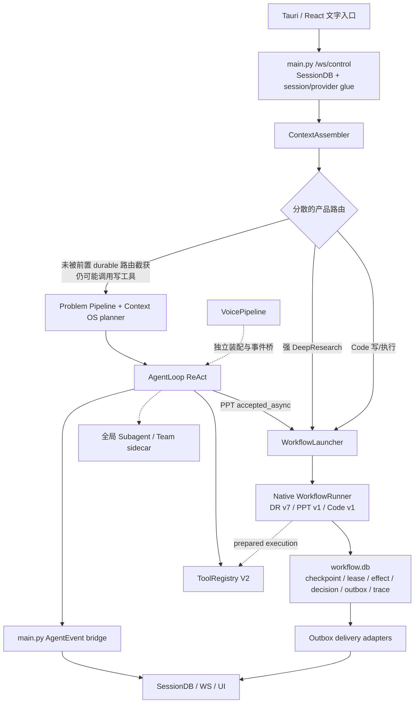

# DeskPet Agent Harness 提炼与简化：实施前架构基线

> 校准日期：2026-07-20
>
> Commit anchor：`2e71e9a1cf9ede2d894477e0c7e8dd25bd19605e`
>
> 校准范围：当前本地工作树，包括尚未提交的 DeepResearch v7、进度与文件交付改动。
> 本文记录“现在实际怎么运行”；目标结构见 [`target-architecture.md`](./target-architecture.md)。

## 1. 校准方法与范围

- `ARCHITECTURE/ARCHITECTURE.md` 的 `last-calibrated` 已指向当前 HEAD，因此 `2e71e9a1..HEAD` 无 committed diff。
- 当前工作树包含尚未提交的 DeepResearch v7、测试、计划与 UI 证据；改动数量会随本轮文档校准变化，因此不能仅凭 commit anchor 或一个易漂移的文件计数判定文档已最新。
- 与本计划直接相关的增量抽查范围：`backend/main.py`、`backend/agent/agent_loop.py`、`backend/deskpet/agent/*`、`backend/deskpet/tools/registry.py`、`backend/deskpet/workflows/*`、`backend/pipeline/voice_pipeline.py`、前端 WS projection，以及 `ARCHITECTURE/AGENT_HARNESS.md`、`AgentLoop.md`、全局 `ARCHITECTURE.md`。
- 解剖麻雀选择“一个文字请求从 `/ws/control` 到工具/长任务交付”的完整链路；Voice、Team 与历史兼容路径按同一 ownership 模型抽查。

## 2. 主要矛盾

当前并非一个统一 Harness，而是 ReAct 对话、Native Workflow 和多代理 sidecar 三个控制面，经由 `main.py`、全局 map、工具 Registry 与多套事件投影拼接。决定本次成败的核心不是再增加一个 Facade，而是：

> **让身份、可信上下文、粗生命周期、父子所有权、Effect 和 Event 各只有一个权威 owner，同时保留 ReAct 与 durable graph 不可同质化的执行语义。**

## 3. 当前真实生产结构

### 3.1 解剖麻雀：文字请求链路

1. `/ws/control` 位于 `backend/main.py:6993`；每个 chat turn 进入后台 `_run_chat`（`:8771`），以便 WS recv loop 继续接收 permission/decision 回包。
2. 用户消息写入 SessionDB，随后 `ContextAssembler.assemble()`（`backend/deskpet/agent/assembler/assembler.py:125-140`）组装 persona、memory、skills、tool intent 与历史。
3. Code mode 在 `backend/main.py:9240-9604` 先调用 `workflows.routing.route_task()`；命中 `CODE_COMPLEX` 后尝试启动 `code_complex/v1` 并返回 accepted frame，绕过 Problem Pipeline 和 AgentLoop。若 launcher 缺失，或在 accepted 前启动异常，当前实现会记录 warning 并继续落入 ReAct（`:9270-9275, 9605-9618`）。
4. 非 Code 的强 DeepResearch 意图在 `backend/main.py:9624-9692` 直接启动 durable v7 并返回 handoff，使用另一处 intent 判定。
5. 其余“未被前置 durable 路由截获”的请求才进入 ProblemHandlingPipeline（`backend/deskpet/agent/problem_pipeline.py:45-106`），再由 Context OS planner 生成 `PreparedContext`（`backend/main.py:10374-10447`）。该分支不是只读分支，仍可调用文件、Office、Shell 等写工具。
6. `AgentLoop.run()`（`backend/agent/agent_loop.py:1590`）负责动态 LLM/tool 循环和完成门禁；`main.py:10478-10490` 消费其 async event stream。
7. ReAct 工具走 `ToolRegistry.execute_tool()`（`backend/deskpet/tools/registry.py:1298`）；durable 写 Effect 可走 `prepare_call()`/`execute_prepared()`（`:1708`、`:1863`）。
8. PPT 通常作为 `accepted_async` 工具从 AgentLoop handoff；DeepResearch/Code 还存在 AgentLoop 前确定性入口，所以“context → problem pipeline → AgentLoop”不是所有请求的固定主链。
9. WorkflowLauncher/Runner 分别拥有后台 drive/outbox 和 lease/checkpoint/terminal convergence；`workflow.db` 由 `NativeCheckpointStore` 构造（`backend/deskpet/workflows/bootstrap.py:39-51`）。

## 4. 三个现存控制面

| 控制面 | 当前 owner | 有价值的能力 | 当前边界问题 |
|---|---|---|---|
| ReAct 对话 | `AgentLoop` + `main.py` | token streaming、provider fallback、动态工具循环、Context OS、完成门禁 | coroutine 不精确恢复；路由、事件、决策和 WS ownership 外溢到 `main.py` |
| Durable workflow | `WorkflowLauncher` + `WorkflowRunner` + `WorkflowService` | native checkpoint、lease/fence、HITL、effect journal、outbox、trace、历史版本恢复 | 与 ReAct 的 run identity、cancel、goal、provider/capability 恢复没有统一契约 |
| Multi-agent sidecar | `SubagentRegistry`、scheduler、TeamStore | 并行子任务、进度、Team 任务/消息持久化 | nonblocking registry 全局且进程内；Team claim 与执行 lease、父子 ownership 不统一 |

Voice 是 venue-specific 第四条装配路径：`VoicePipeline` 可自行创建 AgentLoop、临时修改全局 permission source，并保留无工具的 legacy `chat_stream` fallback（`backend/pipeline/voice_pipeline.py:478-512, 638-856`）。

## 5. 可直接复用的成熟底座

- **Context OS**：`ContextAssembler` + `ContextRequestPlanner` 已能生成 scoped `PreparedContext` 和 `PreparedToolSet`；默认 `context_os_v1=true`（`backend/config.py:541`、`config.toml:105`）。
- **ToolRegistry V2**：已拥有 capability recheck、permission、breaker、timeout、artifact/receipt，以及 durable `PreparedToolCall`/authorization 执行接口。
- **Native Workflow Engine**：当前 bootstrap 直接构造 `NativeCheckpointStore` 和 `WorkflowRunner`，注册 v1-v7；生产依赖中没有 LangGraph/LangChain，schema 中仅保留 `langgraph-legacy` 历史类型标记。
- **Durable Effect/Outbox/Trace**：workflow path 已有执行前冻结、fencing、late reconcile、stable event id、delivery CAS 和 structured trace，不应重写。
- **产品 Driver**：DeepResearch v7 是 `normalize → plan → search → synth → persist → finalize` 六节点图（`definitions/v7/deep_research.py:343-370`）；PPT/Code v1 的 interrupt/checkpoint 语义应保持。

## 6. 已确认的架构缺陷

| 缺陷 | 当前证据 | 影响 | 追溯 AC |
|---|---|---|---|
| 生命周期与路由分散 | `main.py:9240-9692` 有两个 AgentLoop 前入口；PPT 再经 AgentLoop tool handoff；manifest 只声明 ReAct stage | 同一请求在 venue/mode 间获得不同能力、恢复和事件语义 | AC-1～AC-3、AC-11 |
| `main.py`/AgentLoop 过厚 | 当前行数 `main.py=11533`、`agent_loop.py=5635`，`build_agent()` 和 event bridge 继续集中 DI/策略/transport | 修改爆炸半径大，owner 难以测试 | AC-1、AC-2、AC-16 |
| unsafe 并发契约未接生产 | AgentLoop 在 `:4452-4610` 对全部 tool coroutine `asyncio.gather()`；现有 `partition_dispatch()`（`registry.py:2086, 2151-2173`）又会先跑完全部 safe、再跑全部 unsafe，改变 mixed batch 的源顺序 | 文件、Shell、Office 写调用可竞态；直接接 helper 也会重排调用 | AC-7 |
| 可信上下文仍混入模型参数 | `execute_tool()`（`registry.py:1444-1456`）和 durable `prepare_call()`（`:1731-1734`）都先 merge session context，再让模型 params 覆盖；多个 handler 继续读取 `_write_scope_root/_session_id` | session/workspace/capability control plane 可漂移 | AC-4 |
| timeout/Stop 不是 Effect 取消 | sync handler 在 executor 内执行（`registry.py:1495-1523`）；timeout 立即返回 failure（`:1524-1534`）但线程可继续提交 | 重试后重复写或 UI/文件状态冲突 | AC-6、AC-8 |
| Tool outcome 跨层失真 | AgentLoop 把 v2 envelope 序列化成普通 `ToolResultEvent`（`agent_loop.py:5591-5610`）；`main.py:10685-10694` 固定 `ok=True` | UI、SessionActivity 与 LLM 对同一次失败结论不一致 | AC-9 |
| Subagent 全局串会话 | `SubagentRun` 无 session/parent 字段；Registry 只有全局 `_runs/completion_queue/cancel_all`（`subagent_registry.py:26-107`）；任一 AgentLoop drain 全队列（`agent_loop.py:2217-2266`） | 跨 session 结果注入、await、取消和内存泄漏 | AC-5、AC-6 |
| 取消/决策 owner 分裂 | `/stop` 只取消 chat task、全局 subagent 和 legacy PPT task（`main.py:7984-8024`），未调用 workflow run cancel；Plan card 持久但 waiter 是 `_PLAN_CONFIRM_WAITERS`（`:8030-8060, 10152-10185`） | 用户看到停止/可恢复，后台事实却不同 | AC-6、AC-13、AC-14 |
| Voice 不是相同 Harness | Voice 自建 AgentLoop/event bridge并临时改 `PermissionGate.current_source`，保留 legacy chat path；其 ToolResult 投影也固定 `ok=True`（`voice_pipeline.py:803-820`） | tool failure、handoff、provider/permission 与文字行为不一致 | AC-12 |
| capability init 可静默降级 | Harness/Tool/Workflow 多处 broad exception 后继续启动或 fall through | flag ON 不等于 capability ready，恢复保证可无声消失 | AC-3、AC-15 |
| Code mode 的 Research/PPT 路由存在 sink | `route_task()` 可返回 DeepResearch/PPT（`routing.py:62-65`），但 Code ingress 只消费 `CODE_COMPLEX`，强 DeepResearch 前置入口又显式排除 code mode | Code venue 下相同意图可能静默落入 Code ReAct，而非目标 durable Driver | AC-3、AC-11 |
| manifest 不是运行真相 | 本轮已校准 `AGENT_HARNESS.md` 与 `ARCHITECTURE.md` 的过期描述；但 296 行 manifest 仍主要是声明数据，不能证明运行时路由、owner 与事件路径遵循声明 | 测试可绿但运行结构继续漂移 | AC-17 |

## 7. 当前简化度基线

为避免“只是搬家”，phase-1/执行阶段用固定文件集比较净变化：

| 文件 | 当前行数 |
|---|---:|
| `backend/main.py` | 11,533 |
| `backend/agent/agent_loop.py` | 5,635 |
| `backend/agent/auto_resume.py` | 349 |
| `backend/pipeline/voice_pipeline.py` | 902 |
| `backend/deskpet/agent/harness_manifest.py` | 296 |
| `backend/deskpet/agent/subagent_registry.py` | 110 |
| `backend/deskpet/tools/registry.py` | 2,272 |
| `backend/deskpet/workflows/routing.py` | 89 |
| `spawn_subagents_tool.py` + `spawn_team_tool.py` | 377 |
| **合计** | **21,563** |

生命周期相关的进程内 owner 基线固定为以下 **15 个 mutable execution/decision containers**：

1. `_permission_pending`
2. `_clarify_pending`
3. `_PLAN_CONFIRM_WAITERS`
4. `_SKILL_CANDIDATE_WAITERS`
5. `_PPT_OUTLINE_WAITERS`
6. `_chat_inflight`
7. `_auto_resume_redispatchers`
8. `_pipelines`
9. `_PPT_PRO_CTX`
10. `_PPT_PRO_TASKS`
11. `_PPT_PRO_RUNNING`
12. `_PPT_PRO_RUNNING_TOPIC`
13. `SubagentRegistry._runs`
14. `SubagentRegistry.completion_queue`
15. `PermissionGate._pending`

AC-16 的“减少至少 50%”按这 15 个基线容器计算：目标最多保留 **7 个**仍拥有执行/决策事实的进程内容器。`_control_connections`、peer-group 等连接表属于 transport adapter，ToolRegistry `_tools` 属于能力目录，均不计入；仅换名、搬文件或把 owner 包进新 Facade 仍按一个 owner 计数。实施计划必须提供 AST/显式符号清单脚本复测此集合及新增等价容器。

这些数字只是可复现的实施前测量集合；后续 challenger 可以调整指标定义，但不得通过把代码移出集合或换名规避净减少要求。

## 8. 规划红线

1. 不把所有普通聊天变成 durable graph；token/PCM 热路径不进入 durable outbox。
2. 不让新 Kernel 同时拥有 Driver 的 graph scheduling、LLM iteration、retry 或 checkpoint 细节。
3. 先解决 Effect safety，再增加任何 ReAct/ChildRun 恢复能力，避免恢复机制重放写调用。
4. `accepted_async` 仍是二阶段语义；父 controller 结束不代表根请求 completed。
5. 历史 v1-v7 checkpoint/manifest 只读兼容；新运行只进入新默认控制面，不做长期双 owner。
6. Goal、Plan、TeamTask、WorkflowRun 用 typed links 关联，不合并成万能状态表。
7. Kernel 必须产品无关；DeepResearch/PPT/Code/Voice 名称只出现在 Router/Profile/Adapter/Driver 注册处。

## 9. Phase-0 文档校准

本轮只校准当前生产事实，不把目标方案写成已实现：

- `ARCHITECTURE/ARCHITECTURE.md`：补真实分叉入口、原生 workflow 现状、Context OS 适用边界。
- `ARCHITECTURE/AGENT_HARNESS.md`：由“单一父 ReAct”改为当前三控制面事实与已证实缺陷。
- `ARCHITECTURE/AgentLoop.md`：标记历史章节，修正 unsafe dispatch、默认 flags 与 workflow 前置路由。
- `ARCHITECTURE/index.md`：同步上述当前事实描述。
- 根 `README.md` 已引用 `ARCHITECTURE/index.md`，无需修改。

## 10. Phase-0 最终判定

目标架构与现有底座技术上兼容，不需要替换 Native Workflow、Context OS 或 ToolRegistry V2。主要风险是迁移顺序和双 owner，而不是核心技术不可行。

首轮架构挑战提出 10 项事实与可测性修正；全部回写后，第二轮独立复审确认没有阻断 Phase-1 的遗漏。

**最终 VERDICT：PASS。可进入实施 plan 编写与挑战。**
