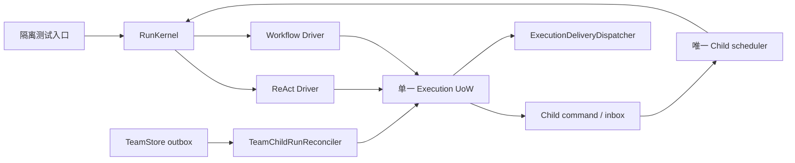

# R4 结果：Workflow / Child / Delivery adapters 收敛

> 状态：完成（2026-07-21）
>
> 集成 HEAD：`ec99b02e`
>
> 生产 owner：仍为 `legacy/0`；本阶段没有执行 R6 activation。

## 结果概览

R4 把隔离测试路径上的 Workflow、ChildRun、Delivery 与 Goal 终态接到同一套
Kernel/UoW 契约上，没有再建立第二套 router、effect journal、delivery worker
或恢复 owner。

## 已完成的边界

| 范围 | 当前事实 |
|---|---|
| Route/Profile | Router 与 WorkflowDriver 由同一个 immutable `ProfileRegistry` 生成；缺失或错配在 bootstrap 直接失败。 |
| Workflow owner | execution-owned cancel/retry/fork/control 在任何 legacy 写入前 fail closed；无 execution row 的历史 run 保持兼容。 |
| ChildRun | command-first saga、stable operation id、schedule/ack、terminal signal/inbox ack 与 parent boundary 原子推进；Team outbox 可重放。 |
| Delivery | 新 durable delivery 只有 `ExecutionDeliveryDispatcher`，只经 UoW claim/complete 并校验 generation；RunPresenter 只是 sink adapter。 |
| Goal terminal | 根 Run 冻结 `goal_id` 后通过 durable delivery 投影；Goal 替换不会把旧 Run 终态写给新 Goal，存储失败可重试。 |
| Decision | ReAct response、grant、continuation、resumed event 与下一 decision boundary 同事务提交；duplicate 幂等，冲突失败。 |
| Late effect / close | shutdown 在 Driver 仍开放时等待物理结果与 durable settlement；readiness 先消失也会等待 recovery task。短超时保持 `unknown`，重启后恢复，不盲重试。 |
| Manifest | 删除 296 行静态 `agent/harness_manifest.py`；`bootstrap.HarnessManifest` 从实际 Kernel operations、Drivers、Profiles 导出。 |

## 门禁证据

- 组合回归：`405 passed, 9 xfailed`。
- Shutdown 两种先后顺序 + short-timeout restart：连续 20 轮，`60/60` 实例通过。
- Auditor 聚焦 Harness：`351 passed, 9 xfailed`；contract `21 passed`；owner/Goal/decision/manifest 聚焦 `6 passed`。
- LOC：`33,184 <= 33,228`，`unknown_classifications=[]`。
- Owner audit：`survivor_count=15`，`new_equivalent_count=8`。这 8 项被如实保留为 R6 删除债务，未用 allow-list 隐藏。
- `compileall` 与 `git diff --check` 通过。
- 两份独立最终审计均为 `VERDICT: PASS`。

已知非阻断告警：`memory/eval/qaset.py` 的旧 invalid-escape
DeprecationWarning，以及测试 teardown 偶发 aiosqlite event-loop-close warning。

## R5 入口条件

R5 从 test-only 产品全链开始：
`Venue decode → ProductTurnPreparer → Kernel → Driver → RunPresenter`。
旧 `_run_chat` 与 Voice legacy bridge 继续是唯一生产 owner，直到 R5 parity 全绿且
R6 用一个原子 activation commit 切换；禁止提前双跑、双写或把隔离路径写成生产事实。
