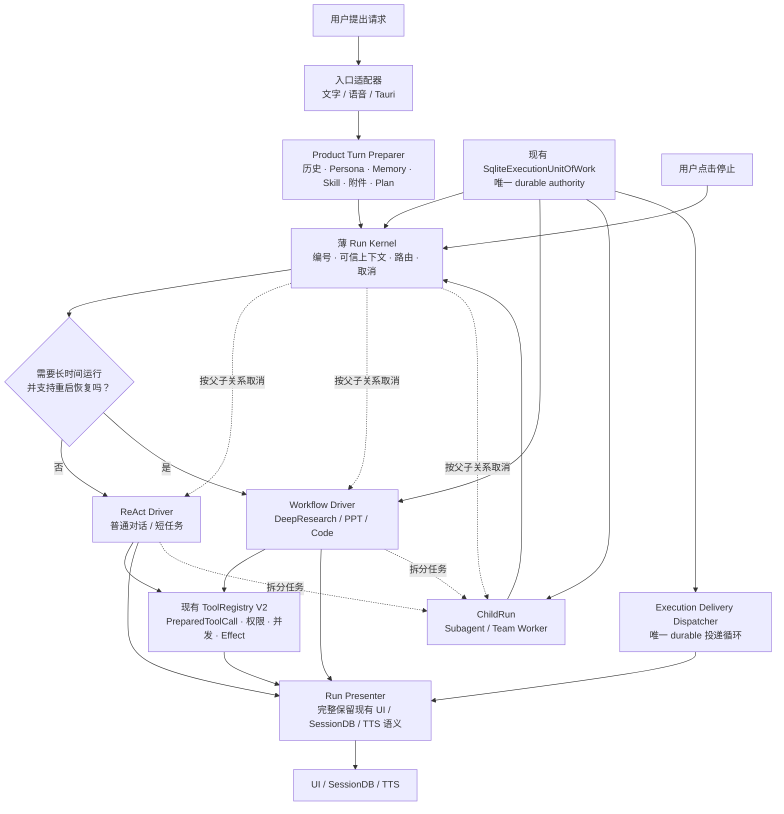

# DeskPet Agent Harness 目标架构

> 状态：2026-07-20 用户已批准，R0～R2 已完成并通过单一 UoW/owner、33 窗故障矩阵、141/141 parity mapping 与 LOC 门禁。首次生产切换因功能不等价整体回退；本图是 R3～R7 的已定稿目标，当前生产事实仍是 legacy owner，尚未执行 R6 切换。
>
> 本文记录本次计划的目标结构，不代表当前生产事实；当前事实仍以
> [`ARCHITECTURE/index.md`](../../ARCHITECTURE/index.md) 为准。实施并完成验收后，
> 再把最终生产结构同步到 `ARCHITECTURE/`。

## 一句话心智模型

**一个产品准备入口、一个薄调度台、两个执行 Driver、一套既有执行底座。**

- 用户发起的事情是 `Run`。
- 脱离当前调用栈继续工作的事情是 `ChildRun`。
- 对文件、Shell、Office、网络或外部系统的动作是 `Effect`。
- 用户或系统可见的状态变化是 `Event`。
- ReAct 与 durable workflow 是两种不同的 `Driver`。

## 目标流程图

## 各层只负责什么

| 层 | 负责 | 不负责 |
|---|---|---|
| Venue Adapter | WS/文字解码、ASR、TTS、VAD、barge-in、Tauri control payload | 创建 AgentLoop、选择工作流、解释工具成功失败 |
| Product Turn Preparer | 复用并保存现有 ContextAssembler、历史、Persona、Memory、Skill/MCP、附件、Problem Pipeline、Plan/Preference、Supervisor hint 的产品语义 | Run identity、Driver 调度、Effect 执行、WS transport |
| Run Kernel | Run 身份、可信上下文、唯一路由入口、粗生命周期、父子关系、signal/cancel、统一事件协议 | LLM 循环、graph node 调度、产品名称特判、token 持久化 |
| ReAct Driver | 动态 LLM 循环、provider fallback、token streaming、短任务工具循环、driver 内完成判断 | WS/SessionDB 投影、durable checkpoint、全局子代理状态 |
| Workflow Driver | graph、checkpoint、lease/fence、HITL、retry、effect/outbox 算法与恢复 | 普通聊天 token 热路径、重新实现 ToolRegistry、自行给新 run 开第二条事务连接 |
| ChildRun Coordinator | Subagent/Team 的分解、认领、join policy、父子关联 | 自建全局 completion queue、自建另一套执行语义 |
| ToolRegistry V2 | capability/permission、参数冻结、并发 barrier、effect id、receipt/artifact、late reconcile；继续使用现有 `PreparedToolCall`/outcome primitive | 新增第二套 PreparedCall、Outcome 或 late-effect supervisor |
| Run Presenter | 把 Driver event 投影为现有 WS、SessionDB、UI 卡片或 TTS，并保留 reasoning、context usage、pipeline 与 codify 收尾 | 改写成功/失败含义、把 accepted 当 completed、新建第二套 durable outbox |
| SqliteExecutionUnitOfWork | `execution_*` 新 run 表的唯一事务 authority；调用接收同一 connection 的 effect/outbox `*_tx` 原语 | 再由 Ledger/DecisionStore/EffectJournal/Outbox 各自打开同库连接并竞争 owner |

## 必须保留的边界

1. ReAct 与 Workflow 只共享控制面和执行底座，不合并为一个万能状态机。
2. 普通聊天的 token delta 不进入 durable outbox，也不为每个 token 写数据库。
3. `accepted` 仅表示后台任务已可靠接单，不能表示任务已经完成。
4. Goal、Plan、TeamTask 和 WorkflowRun 保持为不同领域对象，只通过 typed link 关联。
5. 所有可能被恢复或自动重试的写 Effect 必须先由 UoW 创建稳定 effect/attempt 记录；不会重放的短只读调用可以走轻量路径。
6. 所有非阻塞后台工作必须拥有 `session_id/root_run_id/parent_run_id` 和持久化 capability 子集。
7. 生产切换前必须对旧 `_run_chat`/Voice 的每项可见能力建立 parity inventory；没有等价测试的旧分支不得删除。
8. `SqliteExecutionUnitOfWork` 是唯一 durable authority；不能并存第二套 active Ledger、Decision SQLite、Effect SQLite 或 Delivery worker。
9. Router 与 Workflow Driver 的 profile 必须来自同一个 immutable registry；启动时集合不一致就显式 degraded。
10. 外部写 Effect 是“事务内 claim → 事务外执行 → 事务内 settle”；崩溃后不确定的动作只做 reconcile，绝不盲重试。
11. 切换顺序固定为“关入口 → 排空旧 owner → 写 activation generation → 切 start/recovery/delivery → 开入口”；首条新 run 产生后只允许 fail-closed/roll-forward。
12. ReAct 首次变成 durable 时，Run promotion、continuation boundary 和 waiting decision/effect/child command 必须同事务创建。
13. R1 先以默认 `legacy` 的 additive v7 schema 建立 `execution_runtime_state` 与持久 drain manifest；R6 只切 phase/wiring。新 run 固定 owner generation，重启不能靠内存 flag 退回旧 owner。
14. 新 run 的 durable delivery 只由 `ExecutionDeliveryDispatcher` claim/retry；RunPresenter 是 sink adapter，不是第二个队列 owner。

## 目标态删除或退出新请求路径的机制

- 旧三工具 Registry、`ToolUsingAgent` 和 AgentLoop 的 legacy `dispatch()` 分支。
- 全局 Subagent completion queue 和无 session ownership 的 `cancel_all()`。
- Voice 自己创建 AgentLoop、ContextAssembler 和 ToolResult bridge 的路径。
- `_PLAN_CONFIRM_WAITERS` 等仅存在于进程内的等待器所有权。
- AutoResume 对 `_run_chat` 的旁路重新派发。
- `main.py` 中分散的 Code、DeepResearch、PPT 产品路由与成功/失败投影。
- 手工维护且不能由真实可执行阶段导出的 Harness lifecycle manifest。

历史 workflow/checkpoint 兼容读取可以保留在只读 compatibility registry 中；新请求不得继续进入 legacy 执行路径。
