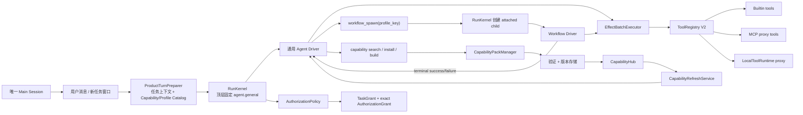
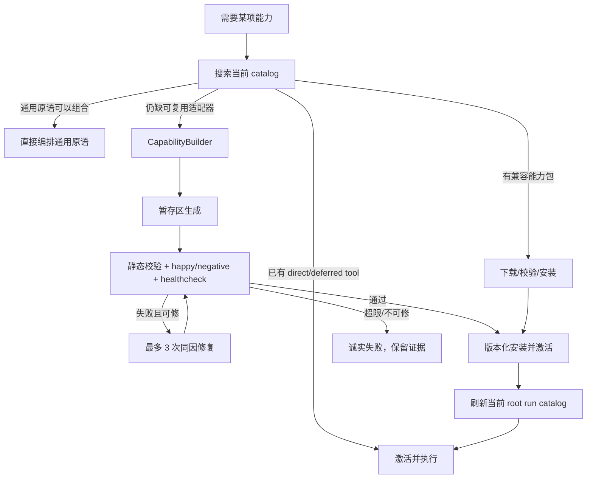
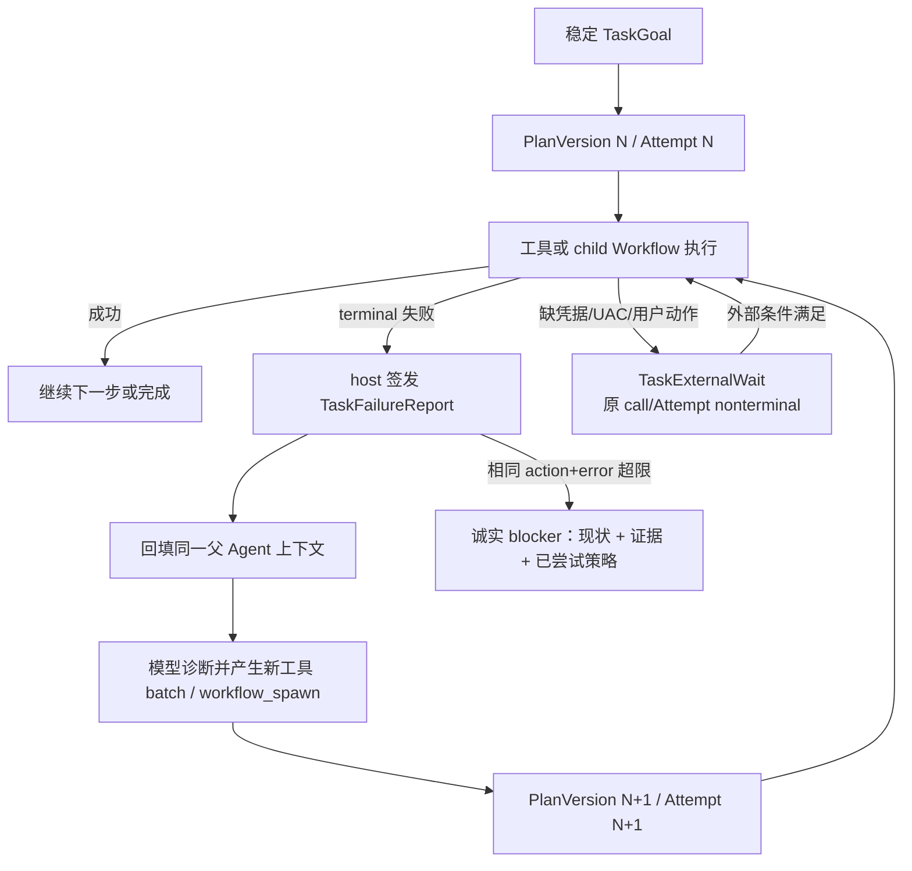

# DeskPet 通用电脑行动与可执行能力包实施计划

<!-- plan-status: finalized (plan-bs) -->

> 状态：FINALIZED v0.4 — 用户授权定稿后直接进入 plan-task  
> 日期：2026-07-24  
> 对应验收：[acceptance.md](./acceptance.md)  
> 目标分支：`master`（按项目约定直接开发；每个 slice 只提交自身文件）

## 0. 一句话方案

保留现有 `ProductVenue → ProductTurnPreparer → RunKernel → Driver → EffectBatchExecutor → ToolRegistry V2` 作为唯一生产执行链，但删除正则/模式驱动的语义路由：同一个主 Session 下，每个顶层任务 Run 都固定进入通用 Agent root；模型在正常工具循环中直接使用能力，或从自描述的 Profile Catalog 选择并调用 `workflow_spawn` 启动专用 child Workflow。模型缺能力时，由受控的 `CapabilityBuilder` 在暂存区生成、验证、版本化安装一个进程外工具，然后刷新当前 root run 的不可变 `PreparedToolSet`，继续原任务。任何工具或 child Workflow 失败都必须形成结构化 FailureReport 回到父 Agent；目标不变、计划和 Attempt 可版本化重建，直到完成或形成诚实 blocker。

整个产品对用户仍只有：

1. 一个普通聊天入口；
2. 一个能力中心；
3. 一套任务执行与 Receipt 链路；
4. 一个全局授权模式开关：`manual` 或 `auto`。

实现上也只保留六个容易解释的角色：

| 角色 | 一句话职责 |
|---|---|
| 通用 Agent root | 每个顶层任务的唯一模型负责人；理解目标、使用能力、启动 Workflow/Builder child，并在失败后重新规划 |
| `RunKernel + ProfileRegistry` | 不理解自然语言；把根 Run 固定绑定到 `agent.general`，把模型显式选择的 child profile 绑定到已注册 Driver |
| `CapabilityHub` | 只做“当前能发现什么”的 stamped 目录投影 |
| `CapabilityPackManager` | 安装、校验、版本、binding、回滚与恢复 |
| `ToolRegistry + MCP/Local runtime` | 唯一实际可调用工具入口 |
| `AuthorizationPolicy + Execution UoW` | manual/auto 决策、精确授权、事务、Receipt 与崩溃恢复 |

`CapabilityBuilder` 不是另一套常驻内核，只是现有 durable Workflow 的一个 profile；
能力中心 UI 也只是上述状态的投影。

## 1. 已锁定的设计决定

### D-1：不创建第二套执行器

- 所有 builtin、MCP、能力包和模型自建工具最终都注册为 `ToolSpec`。
- 所有调用都必须经过 `PreparedToolCall`、Harness、Effect/UoW、Receipt、Artifact、错误分类和取消链。
- 能力包自己的进程不是旁路执行器，只是 `ToolSpec.handler` 背后的受管代理。
- `workflow_spawn/capability_build/capability_repair` 是唯一一组
  `dispatch_kind=delegate_control` 的 core ToolSpec。它们同样先 prepare、做
  resource-scope 校验并取得 exact grant；之后不运行普通 handler，而由 ReActDriver
  产生 `PreparedControlDelegate`，以一个 UoW 原子操作 claim outer effect、冻结父
  continuation、创建 capability operation（如适用）和 attached child command。
- child 的真实副作用仍逐项走自己的 PreparedToolCall；child terminal 用受信
  operation Receipt 推进 boundary，mutation 在父 refresh commit 后才结算 outer
  effect。第三方 ToolSpec 不能声明 `delegate_control`。

### D-2：Skill 与可执行能力分开建模

- `SKILL.md` 是“教模型如何做”的说明，目录中标记为 `kind=instruction`、`executable=false`。
- function tool、MCP tool、本地进程工具才是 `executable=true`。
- 一个能力包可以同时包含 Skill、function tool 和 MCP server；缺少可执行入口的 Skill 不得被回答成“能操作系统”。

### D-3：能力目录是唯一发现投影，但不制造第二个执行权威

权威矩阵固定如下：

- ToolRegistry：唯一的 **executable truth**；只有当前 registry snapshot 中存在可验证 `ToolSpec` fingerprint 时，投影才能标记 `executable=true`。
- CapabilityStore：版本、来源、安装 operation 和 scope binding 的权威。
- MCPManager：server 连接、lease 和 MCP tool provenance 的权威。
- SkillLoader：instruction 是否已加载的权威。
- `CapabilityHub`：将以上权威在一个 `CatalogStamp` 下生成不可变发现投影；它不自行宣布某个工具可执行。

Agent prompt、`capability_search`、能力中心 UI 和“我能做什么”回答都读取同一个 stamped projection。对行动请求作出“没有能力”结论前，必须存在本 root run、当前 `CatalogStamp` 的搜索 Receipt。

### D-4：Auto 跳过用户等待，不跳过验证与账本

- `manual`：首次副作用任务显示计划、工作目录和动作类别；确认后生成 root-run 级任务授权。
- `auto`：同样创建可审计的 decision/grant，但由 `AuthorizationPolicy` 使用 `policy:auto` 身份立即处理，不投影等待用户的弹窗。
- manifest、哈希、schema、测试、healthcheck、Effect、Receipt、取消和错误守门在两种模式完全一致。
- Windows UAC 是外部系统边界；Auto 不点击、不绕过 Secure Desktop。

### D-5：任务授权派生精确调用授权

- 新增 `TaskGrant`，绑定 `root_run_id + filesystem/network/executable/package/app/
  desktop/capability resource selectors + permission/effect categories + policy generation
  + expiry`。
- 每次真实工具调用仍获得现有 ToolRegistry 可验证的精确 `AuthorizationGrant`，绑定 run/call/effect/tool/args/capability/scope。
- 在 TaskGrant 范围内由策略自动派生精确 grant，不重复弹窗；越界则创建扩展 decision。
- 因此不放宽 ToolRegistry 当前的 exact-binding 校验。

### D-6：能力包文件不可变，激活指针在 SQLite 中原子切换

- 每个版本落入独立不可变目录，绝不原地覆盖。
- capability 版本、binding、operation、runtime lease 和验证结果作为现有 `ExecutionUnitOfWork` 的新表存入同一个生产 SQLite；不再新建第二个独立状态数据库。
- `CapabilityStore` 只是 UoW 上的领域 repository；这样 active binding、continuation refresh 和 one-shot receipt consumption 可以在一个 SQLite CAS 中提交。
- 激活/回滚是单个 SQLite 事务更新 binding；旧版本保留。
- 安装失败不写 active binding；卸载先解绑和停进程，再延迟回收无引用文件。

### D-7：project scope 不污染用户项目

- run/project/user 三种 scope 的包代码都存放在 DeskPet user data 下。
- project scope 用规范化项目根目录及其 hash 作为 binding key，不向项目写 `.deskpet`。
- 只有用户任务本身明确要求创建的项目文件写入工作目录。

### D-8：模型生成代码默认进程外执行

- 不修改 `backend/deskpet/tools/*.py` 来“现场加工具”。
- 不 `exec` 或动态 import 未验证的生成代码进入 backend。
- 默认 runtime 为一次调用一个受管 Python 子进程的 `deskpet-json-tool-v1` 协议；长驻/多工具协议使用 MCP。
- 进程隔离用于崩溃、超时、取消和热更新，不新增通用沙箱。
- 进程隔离不是权限隔离，不能用“跑后比较目录”声称证明任意 Python 没有越界。
- V1 的 **自动生成** 工具默认使用 `brokered-effect-v1`：worker 只计算结构化 `EffectPlan`，文件改名/写入、进程、下载和网络等副作用由宿主现有 generic tools 再执行；直接产生 OS 副作用的 `native-adapter` 仅用于仓库内第一方或明确安装的来源包，不由 CapabilityBuilder 自动产出。
- brokered worker 的当前 tool batch 只做计算并产出 typed plan；必须等该 batch
  完全 settle 后，ReActDriver 才把已验证 plan 展开成下一批
  `PreparedToolCall`。禁止在 `ToolSpec.handler` 内递归调用
  ToolRegistry/EffectBatchExecutor，也禁止让模型复述 plan 后自行拼接副作用参数。

### D-9：同一 root run 的刷新是显式受控边界

- `PreparedToolSet` 本身保持不可变。
- 只有保留名的 builtin lifecycle tool 或受管 Builder child 可产生
  `CapabilityOperationReceipt`；它只陈述 published operation 事实，不预知父
  continuation version 或新 snapshot ref。
- 普通 tool effect settlement 或 child-terminal ack 必须在同一 UoW 原子操作中创建
  `CapabilityRefreshIntent` 并把父 continuation 标为 `refresh_pending`。恢复时先处理
  pending refresh，禁止 provider 抢先 resume。
- `CapabilityRefreshService` 基于 parent exposure intent 与最新 stamped projection
  生成 `revision+1` 的新 tool set，并通过 `CapabilityRefreshCommit` 在单个 UoW CAS
  中更新 durable continuation、canonical `request_payload/context_os`、snapshot ref
  和 one-shot intent 状态。
- CAS 成功后显式销毁当前 cached AgentLoop runtime，再从已提交 snapshot 重建；不能只替换内存 tuple。
- 未完成调用仍绑定旧 spec fingerprint；新调用只能使用新 snapshot；不得静默复用旧 schema 或权限指纹。
- Native Workflow child 的 capability snapshot 在启动时冻结，V1 **不在 workflow checkpoint 内热刷新**。若 durable-task/Builder workflow 返回 `capability_missing`，父 Agent root 安装/构建、刷新后，以新 generation 启动一个新的 attached workflow child；仍保持同一 `root_run_id`。

### D-10：只有一个主 Session，模式不参与任务执行

- 产品只有一个当前主 `session_id`；多任务窗口只是该 Session 下不同 `run_id/task_scope_id` 的并行 UI 投影，不存在 Code/普通模式，也不允许 `venue/mode/code_mode` 决定能力、workspace 或 Driver。
- 每个顶层任务 Run 都固定使用 `profile_key=agent.general`，由 RunKernel 从 ProfileRegistry 绑定到通用 Agent Driver。RunKernel 不再对用户原文调用 `route_task()`、正则 classifier 或第二个 LLM Router。
- ProductTurnPreparer 只准备本轮事实：主 Session 必要历史、当前任务 scope、已有 workspace、Capability Catalog、可启动的 Execution Profile Catalog、权限模式和附件；它不预先替模型选择 Profile。
- 领域识别只允许给检索候选排序，例如优先召回 Godot 项目事实；它不能切换 persona、
  system policy、模型、迭代预算、workspace、工具集或 Profile Catalog。生产上下文不再
  产生或消费 `task_type="code"`；`capability_search/workflow_spawn/workspace_prepare`
  与当前 scope 合法的 discoverable catalog 对所有顶层 Run 一致可用。
- Profile 只描述“如何执行”（通用循环、可恢复长任务、深度调研、演示文稿、能力构建），能力包描述“能做什么”（Godot、文件、浏览器等）。禁止为 Godot/Blender 等领域创建模式或用领域关键词映射 Driver。
- 通用 Agent 需要专用执行链时，显式调用 core `workflow_spawn(profile_key, objective, input_refs)`。`profile_key` 必须来自当前 Profile Catalog；`ProfileResolver` 只校验 catalog、能力和 schema，再由 RunKernel 使用静态 `profile_key → driver_kind` 绑定创建 attached child Run，不做二次语义判断。
- 工作目录是任务事实，不是模式。`TaskWorkContextResolver` 以 `task_scope_id` 持久化可选 workspace；父 Agent 可通过 `workspace_prepare` 创建/选择目录，child factory 只从父 UoW 的已提交事实构造 payload。
- 旧 `code_mode/Code venue/code_complex` 只允许在启动迁移器读取冻结的历史 Run；迁移完成
  后的新 root、新 child、恢复、上下文准备和 UI ingress 都不得再引用它们。兼容旧记录
  不能变成一条长期存在的隐藏执行模式。

### D-11：自建与自修复共用一个 Builder workflow

- `build` 从缺失能力 spec 创建首版；`repair` 从 active immutable version 和真实失败
  Receipt 创建派生版本，两者只在输入不同，不另建一套修复执行器。
- repair 不能原地改 active pack。父 Agent 以受信 failure Receipt 引用启动 attached
  Builder child；child 在新 staging revision 中修改，必须重跑原验证并加入本次失败
  的 regression。
- 新版本 published 并 refresh 后，父用 canonical 原始 args 重新 prepare 一次调用，
  产生新 tool/schema fingerprint 和 `retry_of_effect_id`；不得复用旧
  `PreparedToolCall` 或旧 exact grant。
- 同一 root run、同一 failure fingerprint 最多 3 个 repair attempt；超限时保持或
  回滚旧 binding，并按诚实失败结束。

### D-12：失败的是 Attempt，不是整个任务

- `TaskGoal` 在 root run 生命周期内保持稳定；模型可以产生多个 `PlanVersion` 和 `AttemptRecord`。一次工具调用、验证步骤或 child Workflow 失败，默认只终止当前 Attempt，不直接终止父 root run。
- 普通工具失败通过绑定原 provider call id 的 canonical `role=tool` 结果回到同一 AgentLoop；child Workflow 失败通过 `workflow_spawn` 的唯一 terminal tool outcome 回到父 Agent。两者都引用 host 签发的结构化 `TaskFailureReport`。
- 下一次 provider turn 必须同时看到原目标、当前计划/已完成步骤、checkpoint、失败分类与证据、历史 strategy fingerprints 和仍可用能力；模型新的工具 batch 或新的 `workflow_spawn` 即为恢复决策，不再新增正则恢复器或另一个常驻 Planner。
- 瞬时基础设施错误可由 runtime 按 policy 原样重试至多 2 次；业务/环境/能力错误必须回到模型重新规划。相同 action fingerprint + error fingerprint 不得无变化重复；同因最多 3 个模型 Attempt，之后形成包含现状、证据和已尝试策略的诚实 blocker。
- 模型切换 Profile 时不修改失败 child 的 `driver_kind`；保留失败 Run，创建带
  `supersedes_run_id/trigger_failure_set_id/focused_failure_ref` 的新 child Attempt。
  重启从 durable checkpoint 和 pending failure backfill 恢复，不能重复副作用或重复回填。
- Auto 模式下，恢复计划在既有 TaskGrant 范围内直接继续；需要新的资源范围时由 Auto
  policy 自动扩展并记账。缺少凭据、用户内容或外部 UAC 不是失败也不是授权确认：
  原 provider call/Attempt 保持 nonterminal 等待，外部条件满足后原地续跑，不提前把
  tool result 回给模型。

## 2. 当前生产基线与已确认缺口

实施开始时先重新核对下列事实；若代码已变化，以 `ARCHITECTURE/index.md` 和实时调用链为准更新本计划，不凭旧快照覆盖。

| 领域 | 当前事实 | 本计划修复点 |
|---|---|---|
| 生产执行 | `ProductVenue → ProductTurnPreparer → RunKernel → ReAct/Workflow Driver → EffectBatchExecutor → ToolRegistry V2` | 保留并扩展，不另建旁路 |
| Tool catalog | `ToolRegistry.catalog()` 有 revision；`PreparedToolSet` 不可变 | 引入统一 CapabilityHub 与受控 refresh |
| 动态激活 | `tool_activate` 返回控制 JSON，但当前 Harness 生产链未消费它 | 以 typed receipt + refresh service 补齐同 run 激活 |
| Skill | `SkillLoader` 的 Claude v1 Skill 是 prompt-only | 明确 instruction/executable 边界 |
| Skill 安装 | installer 目标是 `skills/<name>`，loader 扫描 `skills/user/<name>` | 迁移到一致 canonical root |
| Plugin | 可 discover/enable/disable，`collect_skill_paths()` / `collect_mcp_servers()` 未接入生产 loader/manager | 作为 legacy adapter 接进 CapabilityHub |
| MCP | 启动时从 config 创建，能注册/注销 ToolRegistry | 增加按包动态 add/start/stop/refcount |
| Auto | `PermissionGate` 持久化 Auto；Harness permission/admission 不读取它 | 建立唯一 AuthorizationPolicy |
| Session/窗口 | 当前生产仍残留 `venue/mode/code_mode` 分支；多窗口实际只承担并行任务展示 | 收敛为一个主 Session + 多个 `run_id/task_scope_id`，模式不进入执行契约 |
| Driver 路由 | `DeskPetRouteClassifier → route_task()` 以正则决定 ReAct/Workflow；上下文分类与 Driver 分类可能冲突 | 顶层固定 `agent.general`；模型只通过显式 `workflow_spawn` 选择 child profile，Kernel 仅校验并绑定 |
| OS 工具 | 文件、shell 和部分桌面工具已有；缺稳定结构化进程/应用/下载原语；桌面/浏览器能力有默认关闭路径 | 补齐原语，测试完成后默认启用 |
| UI | Skill Store、PermissionPopup、Workflow progress 已有 | 演进为 Capability Center，并复用现有 progress |

### 工作树保护

当前计划形成时，仓库在核心 Harness/Tool capability/Architecture 文件上已有未提交改动。执行者必须：

1. 开始每个 WI 前记录 `git status --short` 和目标文件 diff；
2. 不回滚、不覆盖、不顺手提交既有改动；
3. 若本 WI 与既有改动重叠，先基于实时版本重新做最小 diff；
4. 每个提交前核对 staged set，只提交本 WI。

## 3. 目标生产链路



### 能力缺失分支



### 失败恢复分支



## 4. 核心契约

### 4.1 `AgentTurnContext`、`ExecutionProfileCatalog` 与任务工作目录

不新增 `WorkIntentResolver`。ProductTurnPreparer 为每个顶层 Run 生成同一种上下文：

```python
@dataclass(frozen=True)
class TaskWorkContext:
    session_id: str
    root_run_id: str
    task_scope_id: str
    workspace_root: str | None
    workspace_source: Literal["existing", "user_path", "task_default", "none"]
    binding_version: int

@dataclass(frozen=True)
class MainSessionBinding:
    session_id: str
    generation: int
    created_at: str

@dataclass(frozen=True)
class TaskIngressEnvelope:
    session_id: str
    message_ref: str
    task_scope_id: str | None
    target_root_run_id: str | None

@dataclass(frozen=True)
class TaskRunProjection:
    projection_id: str
    session_id: str
    root_run_id: str
    task_scope_id: str
    ui_state: Literal["open", "background", "closed"]

@dataclass(frozen=True)
class ConversationBoundary:
    boundary_ref: str
    session_id: str
    root_run_id: str
    task_scope_id: str
    seed_message_refs: tuple[str, ...]
    continuation_message_refs: tuple[str, ...]
    version: int

@dataclass(frozen=True)
class ExecutionProfileDescriptor:
    profile_key: str
    display_name: str
    description: str
    use_when: tuple[str, ...]
    avoid_when: tuple[str, ...]
    required_capabilities: tuple[str, ...]
    input_schema_ref: str
    launch_policy: Literal["model_spawnable", "reserved_control"]
    catalog_generation: int

@dataclass(frozen=True)
class WorkflowSpawnRequest:
    profile_key: str
    objective: str
    input_refs: tuple[str, ...]
    workspace_ref: str | None
    parent_run_id: str
    root_run_id: str
    task_scope_id: str
    trigger_failure_set_id: str | None
    focused_failure_ref: str | None
    supersedes_run_id: str | None
    profile_catalog_generation: int

@dataclass(frozen=True)
class ProfileLaunchTicket:
    ticket_ref: str
    parent_run_id: str
    root_run_id: str
    task_scope_id: str
    attempt_id: str
    provider_turn_id: str
    profile_key: str
    driver_kind: str
    profile_catalog_generation: int
    capability_snapshot_ref: str
    task_grant_ref: str
    spawn_call_id: str
    trigger_failure_set_id: str | None
    request_fingerprint: str
```

约束：

1. 顶层 Run 的 profile 固定为 `agent.general`；`RunKernel.start()` 不再从用户文本推导 Driver。
2. ProductTurnPreparer 把当前 `launch_policy=model_spawnable` Profile 的紧凑描述和合法
   key 放入模型上下文；`workflow_spawn.profile_key` 的动态 schema 只允许该
   generation 中可用的 model-spawnable key。`workflow.capability_build` 等
   `reserved_control` profile 只能由对应 host control factory 启动。
3. 模型根据 profile 的自然语言职责决定是否调用 `workflow_spawn`。如果没有合适 profile，就继续在通用 Agent 中组合工具或查找/构建能力；不存在 lexical fallback。
4. `ProfileResolver` 从不可变 registry 查 key，校验 generation、required capabilities、
   workspace/input refs 和父 TaskGrant；ProductDelegateFactory 随后在 UoW 中签发
   durable one-shot `ProfileLaunchTicket`。`issue_profile_launch_ticket()` 以
   `(parent_run_id, spawn_call_id)` 唯一，在同一事务绑定当前 Attempt/provider turn、
   catalog generation、snapshot、grant 与 request fingerprint。
   `consume_profile_launch_ticket()` 必须在一个 CAS 内完成
   `issued → consumed`、创建 ControlDelegateBoundary、child command/link 并回写
   child identity；相同 fingerprint 重放返回原 child，不同 fingerprint 拒绝。
   supervisor 在重启时扫描仍 issued 且父 call nonterminal 的 ticket 并重试同一 consume；
   只有父 call/任务已取消时才推进 cancelled。已经 consumed 后由 child command
   recovery 负责，不能把 ticket 退回 issued。
   ChildRunCoordinator/RunKernel 只接受 ticket ref，并从 UoW 解引用 host 派生的
   `driver_kind`。模型和普通 RunRequest 不能提供或覆盖 `driver_kind`。
5. 每个 child 的 `profile_key/driver_kind` 在 `RunCreate` 中冻结；恢复读取原记录，不重新分类。切换 profile 必须创建新 child Attempt。
6. `TaskWorkContextResolver` 只按 `task_scope_id` 管理 workspace。用户显式路径优先；否则模型需要写入时调用 `workspace_prepare`，在设置中的 `default_workspace_root` 下创建稳定任务子目录。manual 显示路径，auto 直接执行；两者都持久化 binding。
7. 新任务 ingress 的 `target_root_run_id=None`，host 创建 root/task scope，并把当时选定的
   Main Session message refs 冻结为该 root 的 `ConversationBoundary.seed_message_refs`。
   seed 只允许包含本任务首条消息、用户显式附加/引用的消息和稳定 session facts；默认
   不得吸入其他 root 的 task transcript。
   已有任务窗口继续消息时必须同时携带并匹配 `target_root_run_id/task_scope_id`，只追加到
   该 root 的 continuation。Provider history 只从 root-local boundary 读取，永远不在
   turn 时重新读取可变的全局聊天消息列表。
8. `TaskRunProjection` 只是 UI 索引。打开、切换、后台化或关闭窗口只更新 projection，
   不取消、不改路由、不重绑 workspace，也不把后续消息发给“当前可见窗口”；发送动作
   必须显式引用目标 root。
9. 现有 `code_mode`、Code UI venue、`route_task()`、`DeskPetRouteClassifier` 和
   `task_type="code"` 只能由一次性 startup migration 读取冻结旧记录；新
   HostContext、Profile、工具暴露、授权、provider history、root/child create 与恢复
   都不得引用。迁移完成后生产 composition 不装配这些对象。
10. ContextAssembler 的 rule/embed/LLM 分类只可生成 retrieval ranking hint；即使强制
    分类结果为 `chat/task/code/unknown`，persona、system policy、模型、迭代预算、
    workspace、工具集和 Profile/Capability Catalog 也必须逐字段相同。side-effect
    能否执行只由 PreparedToolCall + AuthorizationPolicy 决定。

### 4.2 `CatalogStamp`、版本与 binding

新文件：`backend/deskpet/capabilities/contracts.py`

```python
@dataclass(frozen=True)
class CatalogStamp:
    catalog_generation: int
    registry_revision: int
    binding_generation: int
    skill_revision: int
    mcp_revision: int
    fingerprint: str
```

`CapabilityHub` 只发布在一个读取事务/锁边界内捕获的 `CatalogStamp`。如果 ToolRegistry revision 在组装投影期间改变，丢弃本次结果并重试；不能发布“UI 已 active、registry 尚未注册”的混合状态。

版本与作用域 binding 分开：

```python
@dataclass(frozen=True)
class CapabilityVersionDescriptor:
    capability_id: str
    display_name: str
    version: str
    kind: Literal["instruction", "function_tool", "mcp_tool", "pack"]
    source: str
    description: str
    aliases: tuple[str, ...]
    logical_tool_ids: tuple[str, ...]
    provider_tool_names: tuple[str, ...]
    permission_categories: tuple[str, ...]
    effect_kinds: tuple[str, ...]
    schema_hash: str
    manifest_hash: str
    health: Literal["unknown", "healthy", "degraded", "failed"]

@dataclass(frozen=True)
class CapabilityBinding:
    binding_id: str
    capability_id: str
    version: str
    manifest_hash: str
    scope: Literal["builtin", "run", "project", "user"]
    scope_key: str
    active: bool
    generation: int
```

发现投影再组合二者：

```python
@dataclass(frozen=True)
class CapabilityDescriptor:
    version: CapabilityVersionDescriptor
    visible_bindings: tuple[CapabilityBinding, ...]
    executable: bool
    installed: bool
    tool_spec_fingerprints: tuple[str, ...]
    stamp: CatalogStamp
```

约束：

- `capability_id` 与 manifest 内 logical tool id 稳定。
- provider-facing function 名使用确定性 `<pack_id>__<tool_id>`，只允许 ASCII 字母、数字、下划线和短横线，最长 64；逻辑 ID 与 provider name 分开保存。不得使用点号。
- core/builtin 保留名禁止第三方覆盖。
- 同名不同 schema 不做 last-write-wins；返回明确 collision。
- `executable=true` 必须能在该 `CatalogStamp.registry_revision` 对应 snapshot 中找到全部声明的 ToolSpec fingerprint；否则 fail closed 为 `executable=false/degraded`。
- `executable=false` 永不进入 provider tools schema。
- binding 选择顺序固定为 `run > project > user > builtin`；同一层同 capability 出现
  两个 active binding 直接 fail closed，不按时间或加载顺序猜。
- snapshot 在 capability publish lock 内对
  `registry/binding/skill/mcp/catalog generation` 做 before/after 双读；任一 revision
  改变就丢弃并重试。不能只检查 ToolRegistry revision。

### 4.3 `CapabilityCatalogSnapshot`

`CapabilityHub.snapshot(scope)` 返回：

- 完整 `CatalogStamp`；
- 完整 descriptor fingerprints；
- 可缓存搜索索引；
- 生成 snapshot 的 canonical scope。

搜索策略：

- 确定性 exact name/alias/token 匹配始终可用；
- 复用现有 embedder 时增加语义召回；
- embedder 未就绪时退回 lexical，不阻塞普通问答；
- 索引以 `CatalogStamp.fingerprint` 缓存；
- 本地目录准备及搜索 p95 额外开销目标 `<500ms`。

### 4.4 `deskpet-pack.json` v1

新 schema：`backend/deskpet/capabilities/schemas/deskpet-pack-v1.schema.json`

示例：

```json
{
  "schema_version": 1,
  "id": "godot",
  "name": "Godot",
  "version": "1.0.0",
  "source": {
    "type": "builtin",
    "uri": "capability-packs/godot",
    "revision": "repo-commit"
  },
  "compatibility": {
    "deskpet": ">=0.6.0-beta.9",
    "os": ["windows"],
    "architectures": ["x86_64"],
    "python": ">=3.11"
  },
  "entries": {
    "skills": [{"path": "skills/godot/SKILL.md"}],
    "tools": [{
      "id": "project_check",
      "provider_name": "godot__project_check",
      "runtime": "deskpet-json-tool-v1",
      "execution_profile": "native-adapter",
      "input_views": [],
      "entry": "tools/godot/main.py",
      "schema": "tools/godot/project_check.schema.json",
      "healthcheck": "project_check"
    }],
    "mcp_servers": [{"id": "godot-helper", "config_ref": ".mcp.json"}]
  },
  "permissions": ["filesystem_read", "filesystem_write", "process_execute"],
  "effects": ["read_only", "staged_file", "opaque_manual"],
  "dependencies": {
    "python": [],
    "commands": [{"name": "godot", "version": ">=4.0"}]
  },
  "files": [
    {"path": "skills/godot/SKILL.md", "sha256": "..."}
  ],
  "uninstall": {"stop_servers": true, "remove_environment_when_unreferenced": true}
}
```

校验顺序固定：

1. JSON schema；
2. ID/version/path canonicalization；
3. DeskPet/OS/arch/Python 兼容性；
4. permission/effect 声明闭包；
5. 所有文件必须在 pack root 内；
6. 文件列表完整且 SHA-256 匹配；
7. tool schema 可解析且无保留名冲突；
8. `.mcp.json` 仅引用 manifest 声明的 server；
9. 依赖计划可解析；
10. validation suite 全绿后才能写 active binding。

### 4.5 目录与数据库

```text
<user-data>/capabilities/
  staging/<operation-id>/
  packs/<pack-id>/<version>/<manifest-hash>/
  envs/<pack-id>/<version>/<manifest-hash>/
  run/<root-run-id>/<pack-id>/<version>/<manifest-hash>/
  logs/<operation-id>/
```

SQLite 表：

- `capability_versions(pack_id, version, manifest_hash, source_json, install_path, validation_status, parent_version, parent_manifest_hash, derived_from_receipt_ref, created_at, ...)`
- `capability_bindings(scope, scope_key, pack_id, active_version, active_manifest_hash, generation, enabled, ...)`
- `capability_operations(operation_id, root_run_id, kind, phase, status, error_json, started_at, ended_at, ...)`
- `capability_validation_results(operation_id, check_name, status, evidence_ref, detail_json, ...)`
- `capability_runtime_leases(lease_id, pack_id, version, manifest_hash, pid, run_id, heartbeat_at, ...)`
- `capability_runtime_call_leases(call_lease_id, runtime_lease_id, effect_id, state, started_at, ended_at, ...)`
- `capability_snapshot_leases(snapshot_ref, run_id, root_run_id, pack_id, version, manifest_hash, tool_spec_fingerprints_json, released_at, ...)`
- `capability_publish_intents(intent_id, operation_id, expected_registry_revision, old_specs_json, new_specs_json, old_binding_json, new_binding_json, phase, ...)`
- `capability_refresh_intents(intent_id, operation_id, refresh_nonce, root_run_id, expected_continuation_version, status, ...)`
- `brokered_effect_plans(plan_ref, parent_call_id, input_snapshot_ref, next_action_index, status, ...)`
- `authorization_policy_state(singleton_id, mode, generation, updated_at)`
- `task_grants(task_grant_id, root_run_id, source, policy_generation, resource_selectors_json, ...)`
- `main_session_bindings(singleton_id, session_id, generation, created_at, ...)`，其中
  `singleton_id=1` 且 `session_id` 唯一。
- `task_run_projections(projection_id, session_id, root_run_id, task_scope_id, ui_state, ...)`，
  `UNIQUE(root_run_id)`、`UNIQUE(task_scope_id)`；该表不被 RunKernel 用作路由输入。
- `conversation_boundaries(boundary_ref, session_id, root_run_id, task_scope_id,
  seed_message_refs_json, continuation_message_refs_json, version, ...)`，
  `UNIQUE(root_run_id)`、`UNIQUE(session_id, task_scope_id)`。
- `user_continuations(root_run_id, message_ref, task_scope_id, content,
  reserved_boundary_version, status, settled_at, error, ...)`，
  `UNIQUE(root_run_id, message_ref)`、`UNIQUE(root_run_id,
  reserved_boundary_version)`；`pending → bound|failed`。入队与 conversation CAS
  同事务推进 Run version，因而与旧 terminal 的 CAS 形成数据库线性化点；`bound`
  同事务写 React `pending_resume_signal`，崩溃后仍由同一父模型恢复。
- `provider_turn_fences(provider_turn_id, root_run_id, idempotency_key, request_hash,
  state, accepted_batch_id, ...)`，`UNIQUE(root_run_id, provider_turn_id)`、
  `UNIQUE(root_run_id, idempotency_key)`。
- `provider_action_batches(provider_batch_id, root_run_id, provider_turn_id,
  canonical_assistant_batch_ref, batch_fingerprint, pending_call_count,
  failure_set_id, status, ...)`，`UNIQUE(root_run_id, provider_turn_id)`；status 只允许
  `admitted → running|waiting_external|ready_backfill → settled`。
- `provider_action_calls(call_record_id, root_run_id, provider_batch_id,
  call_order, provider_call_id, raw_tool_name, raw_arguments_ref, raw_arguments_hash,
  parsed_arguments_hash, admission_state, prepared_call_ref, command_boundary_ref,
  terminal_outcome_ref, ...)`，
  `UNIQUE(provider_batch_id, call_order)`、`UNIQUE(root_run_id, provider_call_id)`；
  `prepared_call_ref/parsed_arguments_hash` 在 parse/unknown/preflight 失败时允许为空，
  admission state 只允许
  `admitted → prepared|rejected|waiting_external|settled`、
  `prepared → waiting_external|settled`、`waiting_external → admitted|prepared|settled`；
  `rejected/settled` 为 terminal。
- `task_goals(goal_id, root_run_id, task_scope_id, objective_ref, status, created_at, ended_at, ...)`，
  `UNIQUE(root_run_id)`、`UNIQUE(task_scope_id)`。
- `plan_versions(root_run_id, plan_version, trigger_failure_set_id, created_at, ...)`，
  `PRIMARY KEY(root_run_id, plan_version)`；版本从 1 单调递增。
- `attempt_records(attempt_id, root_run_id, run_id, provider_turn_id, provider_batch_id,
  plan_version, trigger_failure_set_id, supersedes_attempt_id, strategy_fingerprint,
  status, budget_eligible, created_at, ended_at, ...)`，`UNIQUE(root_run_id,
  provider_batch_id)`、`UNIQUE(root_run_id, provider_turn_id)`。
- `task_failure_reports(report_ref, root_run_id, run_id, attempt_id, call_record_id,
  source_kind, source_identity, provider_call_id, child_run_id, inner_failure_ref, error_class,
  error_code, error_fingerprint, action_fingerprint, evidence_refs_json, ...)`，
  `UNIQUE(root_run_id, source_kind, source_identity)`。
- `attempt_failure_sets(failure_set_id, root_run_id, failed_attempt_id,
  primary_report_ref, backfill_state, provider_resume_state, created_at, ...)`，
  `UNIQUE(root_run_id, failed_attempt_id)`。
- `attempt_failure_set_members(failure_set_id, report_ref, provider_call_order, ...)`，
  `PRIMARY KEY(failure_set_id, report_ref)`、`UNIQUE(failure_set_id,
  provider_call_order)`；同一 batch 的全部失败逐条保存，`primary_report_ref` 只用于
  有界上下文排序。
- `task_external_waits(wait_ref, root_run_id, attempt_id, call_record_id,
  provider_call_id, command_boundary_ref, effect_id, wait_kind, required_action_ref,
  checkpoint_ref, resume_admission_state, evidence_refs_json, state, response_ref, ...)`，
  `UNIQUE(root_run_id, call_record_id)`；boundary/effect 在尚未 prepare/claim 时可为空，
  state 只允许 `open → satisfied|cancelled`。
- `profile_launch_tickets(ticket_ref, parent_run_id, root_run_id, task_scope_id,
  attempt_id, provider_turn_id, profile_key, driver_kind, profile_catalog_generation,
  capability_snapshot_ref, task_grant_ref, spawn_call_id, request_fingerprint,
  state, child_command_id, child_run_id, created_at, consumed_at, ...)`，
  `UNIQUE(parent_run_id, spawn_call_id)`；state 只允许
  `issued → consumed|cancelled`。

这些表加入当前 `ExecutionUnitOfWork` 所用 SQLite schema。必须有 schema migration 版本；迁移幂等；沿用现有 WAL/事务设置；路径和 manifest 只存 canonical form。

Task/Attempt 事务规则固定如下：

1. 创建 root 时原子写 `TaskGoal`、`ConversationBoundary` 和 `PlanVersion=1`；首个
   `AttemptRecord` 只在 provider 返回的第一批可执行 action 被 host 接受时创建。
   纯文本澄清/最终答复不制造空 Attempt。
2. **一个 provider action batch 恰好对应一个 AttemptRecord**。普通成功后的下一批 action
   可沿用当前 `plan_version`；任一失败 batch 后，模型返回的下一批 action 必须创建
   `plan_version+1`，并引用整个 `trigger_failure_set_id`。
3. `accept_provider_batch_and_create_attempt()` 是单一 CAS/UoW：先验证 durable
   provider-turn fence 和每个 call 的稳定 provider id，再保存 canonical assistant
   batch、原始 name/args 的 `provider_action_calls`、Attempt 与 provider batch identity；
   然后由 host 从 raw canonical name/args/profile refs 计算 strategy fingerprint 并执行
   loop guard。prepare 成功后另以同一 Attempt CAS 补 `prepared_call_ref/command
   boundary`。因此 parse/unknown/preflight 失败也有 durable call identity，不要求先
   伪造 PreparedToolCall。事务成功前 executor 不得 claim effect，ChildRunCoordinator
   不得创建 child。
   如果 loop guard 拒绝，接受事务本身把 Attempt 置为 `rejected`，签发
   `source_kind=strategy_rejected/error_code=replan_required` 的 report/FailureSet，
   写同原 call id 的 canonical tool result 和 pending resume；不创建 effect/child。
   该 rejected Attempt 计入同因模型尝试预算，防止模型无限重复。
4. `settle_batch_and_stage_failure_backfill()` 是另一单一 CAS/UoW：结算本 batch 的
   effect/child 状态，写全部 `TaskFailureReport`，更新 Attempt，生成按原
   provider call id 对齐、按原 call order 排列的全部 canonical `role=tool` 结果
   （成功项正常结果、失败项携带 report ref），并写 pending provider resume fence。
   即使 parse/preflight/read-only 失败没有外部 effect，也必须走该 durable 事务，
   不能直接把 root 标记 failed。
5. 一批有多个 tool call 失败时全部 report refs 都进入 `attempt_failure_sets`，按
   `(provider_call_order, source_kind, report_ref)` 确定 primary；上下文可摘要 primary，
   但不得丢失或覆盖其他失败，模型可按 ref 读取完整集合。
6. 缺凭据、缺用户内容、等待 UAC/第三方完成不是 terminal failure，也不创建
   FailureReport/FailureSet。`stage_external_wait()` 在一个 CAS 中写
   `TaskExternalWait`，把当前 call admission、Attempt 和 TaskGoal 置为
   `waiting_external`，`budget_eligible=false`，保留原 provider call 未完成；它**不写
   canonical tool result、不 stage provider resume**。已经 claim 的 effect 保持
   `deferred_pending`，prepare 前等待则不伪造 effect；boundary version 不越过该 call。
   `resume_external_wait()` 只有在
   durable response/probe 满足要求后，才以同一 Attempt、同一 plan version、同一 call
   record 把状态恢复为 running 并继续 prepare/execute；最终完成时该原 call id 才得到
   唯一 terminal tool result。cancel/拒绝则走显式 cancel/terminal settlement。
   多 call batch 中只要一个 call 等待，batch/Attempt 就保持 `waiting_external`；
   其他 call 已产生的 success outcome 或 terminal failure report 只作 held durable
   state，不创建 provider resume。所有 waits 解除且每个 call terminal 后，batch barrier
   才一次构造 FailureSet、更新 Attempt/budget，并按原顺序回填全部结果。
7. 外部副作用、child 创建与 canonical tool result 由 UoW/idempotency key 保证
   exactly-once。Provider HTTP/WebSocket 传输只有在 provider 支持稳定 idempotency key
   时才能声称 exactly-once；否则按 at-least-once 处理，并由 durable provider-turn
   fence 保证歧义重试不会接受第二个 batch、重复 effect 或重复 child。

`capability_operations.phase` 只允许：

```text
planned → staged → verified → environment_ready → candidate_ready
        → publish_intent → catalog_swapped → bound → published
```

- lifecycle mutation 始终有一条 Harness outer effect：普通 install/update/activate
  使用正常 PreparedToolCall；build/repair 使用 §4.10 的 PreparedControlDelegate。
- 内层每个 phase 使用稳定 idempotency key `<operation-id>:<phase>`，在 UoW 中先记 intent，再执行，再记 evidence。
- crash reconcile 从最后 committed phase 探测真实状态；无法确认的副作用标 `unknown`，不盲目重跑。
- `candidate_ready` 只表示新 local/MCP runtime 已 list-tools/healthcheck；它尚未占用稳定
  provider name。发布时获取唯一 capability publish lock，先持久化 publish intent，再
  用 ToolRegistry batch CAS swap specs、CAS binding、标记 published，最后释放锁。
- CapabilityHub snapshot 使用同一 publish lock；若发现未 reconciled publish intent，
  fail closed，不发布 catalog。崩溃恢复根据 registry provenance + DB binding 完成
  或回滚 intent，不能暴露 mixed catalog。
- operation Receipt 只能引用 `published` operation。

取消规则固定：

| 当前 phase | cancel/recovery |
|---|---|
| `planned/staged/verified` | 终止本 operation，清理精确 staging/验证进程 |
| `environment_ready` | 停依赖准备；无引用 env 可回收，有未知安装状态先 probe |
| `candidate_ready` | runtime 进入 drain，取消新调用，关闭 candidate；active binding 不变 |
| `publish_intent/catalog_swapped/bound` | 不直接删；在 publish lock 内按 durable intent 完成或恢复旧 specs/binding，无法判定则 `unknown` 并阻止 catalog |
| `published` | mutation 已完成；取消只阻止父任务继续，不伪装成回滚，显式 rollback 另起 operation |

### 4.6 本地工具协议 `deskpet-json-tool-v1`

backend 使用 `asyncio.create_subprocess_exec()`，不得拼 shell command string。

stdin 单个 JSON：

```json
{
  "protocol": "deskpet-json-tool-v1",
  "request_id": "uuid",
  "tool": "photo.rename_by_date",
  "args": {},
  "context": {
    "workspace_roots": ["..."],
    "temp_dir": "...",
    "run_id": "...",
    "effect_id": "..."
  }
}
```

stdout 必须只有一个 JSON。`native-adapter` 可返回 value/artifact；CapabilityBuilder 生成的 `brokered-effect-v1` 必须返回 EffectPlan：

```json
{
  "ok": true,
  "request_id": "uuid",
  "value": {},
  "effect_plan": {
    "actions": [
      {"kind": "rename_file", "source_ref": "input:0", "target_name": "2026-07-23_001.jpg"}
    ]
  },
  "artifacts": [],
  "observations": []
}
```

规则：

- stderr 只作受限大小日志；
- stdout 超限、非 JSON、多对象、request_id 不匹配均返回结构化 malformed；
- 用 `communicate()` 防 pipe deadlock；
- timeout/cancel 只终止该 runtime lease 记录的精确进程树；
- Windows 使用新 process group 并记录 PID、creation time、完整 command line 和 root run；
- 退出后核对匹配子进程归零；禁止按 `python.exe`/应用名广泛结束；
- 结果由代理转换为 `NormalizedToolOutcome`，再走现有 Receipt/Artifact；
- 一次性工具默认每 call 新进程；需要长驻状态的包使用 MCP。
- `brokered-effect-v1` worker 不接收真实任意绝对路径，只接收 host 解析后的 opaque input refs/metadata。
- proxy 将返回值交给宿主 `BrokeredEffectPlanner` 做 schema、scope、TaskGrant、
  action dependency 和 idempotency 校验，写入 durable `plan_ref`；当前计算 batch
  settle 后，ReActDriver 从该 ref 生成下一批 generic `PreparedToolCall`，每个调用
  重新走 prepare/authorization/Effect/UoW/Receipt。不得在 proxy handler 内递归
  执行，也不得依赖模型重新解释 EffectPlan。
- Builder 的 AST/dependency 检查只负责防手滑，不宣称安全沙箱；真正的副作用边界来自 brokered host execution。

V1 为保持简单，EffectPlan 只支持严格有序 action；每次只推进一个 generic call：

```python
@dataclass(frozen=True)
class InputBinding:
    opaque_ref: str
    kind: Literal["file", "directory", "artifact", "value"]
    view_kind: Literal["identity", "metadata", "text", "bytes"]
    canonical_resource: str
    content_hash: str | None
    metadata: Mapping[str, JsonValue]

@dataclass(frozen=True)
class InputBindingSnapshot:
    snapshot_ref: str
    root_run_id: str
    workspace_roots: tuple[str, ...]
    bindings: tuple[InputBinding, ...]
    fingerprint: str

@dataclass(frozen=True)
class BrokeredEffectPlanRecord:
    plan_ref: str
    root_run_id: str
    parent_call_id: str
    provider_call_id: str
    tool_spec_fingerprint: str
    task_grant_id: str
    catalog_stamp: CatalogStamp
    input_snapshot_ref: str
    plan_hash: str
    actions: tuple[Mapping[str, JsonValue], ...]
    action_receipt_refs: tuple[str | None, ...]
    next_action_index: int
    status: Literal["validated", "running", "succeeded", "failed", "cancelled"]

@dataclass(frozen=True)
class BrokeredCommandBoundary:
    parent_prepared_call_ref: str
    provider_call_id: str
    plan_ref: str
    current_inner_call_ref: str | None
    aggregate_value_ref: str | None
    status: Literal["computing", "running_actions", "terminal"]

@dataclass(frozen=True)
class DeferredToolAcceptedSignal:
    run_id: str
    command_id: str
    parent_call_id: str
    parent_effect_id: str
    deferred_kind: Literal["brokered_effect_plan"]
    envelope: Mapping[str, JsonValue]
```

这些记录进入现有 Execution UoW。worker 只收到 immutable input snapshot 中的 opaque
ref 和声明 view：identity、结构化 metadata（含图片 EXIF 等已支持解析器）、有上限的
text/bytes；不收到真实绝对路径。host 在真正执行 action 前重新核对 canonical
resource/hash 和 TaskGrant。view materializer 有单项/总大小上限，未知格式返回明确
unsupported，不把任意文件路径交给生成 Python。

执行契约新增 nonterminal effect status `deferred_pending`；它不属于
`NormalizedToolOutcome` 的 succeeded/failed terminal 状态。ToolExecutor 识别
`BrokeredPlanEnvelope` 后返回 `DeferredToolAcceptedSignal`，不得调用现有
`settle_effect()` 或制造 `accepted_async` outcome。

ReActDriver 收到 signal 后调用 UoW
`accept_brokered_plan_and_suspend_parent(expected_continuation_version, ...)`，在一个
事务中把已 claim effect 转为 `deferred_pending`、保存 input/plan/boundary、CAS
continuation。这个 signal 分支不填 outcome slot、不调用 `_resume_completed()`，而是
从 boundary 产生第一个 internal execute candidate；若在事务前崩溃，compute-only
worker 可按原 effect/request id 重跑。

`plan_ref + action_index` 是稳定 idempotency key；driver 只有在前一个 action Receipt
成功并 CAS 写回 record 后才生成下一个内部 `execute_tools` candidate。内部 call/event
可投影 UI/Receipt，但设置 `provider_backfill=false`，不得进入 provider canonical
messages。

plan terminal 后，UoW `settle_brokered_parent()` 在同一事务中把 parent effect 从
`deferred_pending` 结算 terminal，聚合 value、Artifact 和全部 action Receipt，只生成
一个绑定原始 `provider_call_id/parent_call_id` 的 `NormalizedToolOutcome`，再恢复
AgentLoop。失败默认停止后续 action，不假装事务
回滚；已提交的副作用由聚合 Receipt 明示。重启从 boundary 与
`next_action_index` 恢复，同一 action effect id 不得重复提交，也不得把 inner call
result 回填给 provider。

### 4.7 Operation Receipt、pending refresh 与父侧 commit

只有会改变 capability binding/catalog 的 core lifecycle tool：

- `capability_activate`
- `capability_install`
- `capability_update`
- `capability_build`
- `capability_repair`
- `capability_rollback`
- `capability_uninstall`

可产生成功的 `CapabilityOperationReceipt`；`capability_search/describe` 只返回普通只读
结果。失败使用 §4.11 的 `CapabilityFailureReceipt`，不得伪造 new stamp/snapshot：

```python
@dataclass(frozen=True)
class CapabilityOperationReceipt:
    operation_id: str
    root_run_id: str
    parent_command_id: str
    parent_effect_id: str
    action: Literal[
        "activate", "install", "update", "build", "repair", "rollback", "uninstall"
    ]
    status: Literal["published"]
    refresh_nonce: str
    operation_receipt_hash: str
    old_stamp: CatalogStamp
    published_binding_generation: int
    affected_capability_ids: tuple[str, ...]
    affected_version_refs: tuple[str, ...]
    affected_tool_spec_fingerprints: tuple[str, ...]
    manifest_hashes: tuple[str, ...]
```

handler/child 只能返回 receipt ref；父侧必须从 operation store 解引用并核对 hash。它们
不能填写父 continuation version、父 exposure intent 或新 snapshot ref。

```python
@dataclass(frozen=True)
class CapabilityRefreshIntent:
    intent_id: str
    root_run_id: str
    run_id: str
    operation_id: str
    source_kind: Literal["tool_effect", "child_terminal"]
    source_command_id: str
    source_effect_id: str
    refresh_nonce: str
    expected_continuation_version: int
    old_stamp: CatalogStamp
    old_tool_set_snapshot_ref: str
    exposure_intent_ref: str
    status: Literal["pending", "committed", "failed"]

@dataclass(frozen=True)
class CapabilityRefreshCommit:
    intent_id: str
    root_run_id: str
    run_id: str
    operation_id: str
    refresh_nonce: str
    expected_continuation_version: int
    old_stamp: CatalogStamp
    new_stamp: CatalogStamp
    old_tool_set_snapshot_ref: str
    new_tool_set_snapshot_ref: str
    new_context_os: Mapping[str, JsonValue]
    affected_tool_spec_fingerprints: tuple[str, ...]
```

UoW 提供两个原子入口：

1. `settle_control_effect_and_stage_refresh()`：结算普通 lifecycle tool outer effect、
   暂存其唯一 provider outcome、CAS 父 continuation、插入 intent，并写
   `refresh_pending=intent_id`；refresh 前不 backfill；
2. `ack_child_terminal_and_stage_refresh()`：核对 attached child terminal operation
   Receipt、记录 child terminal、保持 `PreparedControlDelegate` outer effect 为
   `deferred_pending`、CAS 父 continuation、插入 intent，并写同一 pending marker。

`commit_capability_refresh()` 验证 operation 已 published、intent/nonce 未消费、
continuation version/old stamp 匹配，写入新 `request_payload.context_os`、capability
snapshot/ref/stamp，清除 pending 并标记 committed。重复相同 commit 幂等；同 nonce
不同 payload 或 stale version 冲突失败。若 intent 来源是 child，它还在同一事务中
结算 outer effect 并将 ControlDelegateBoundary 置为 `ready_backfill`；若来源是普通
tool，则释放暂存的原 provider outcome。恢复器看到 `refresh_pending` 必须先完成或
明确失败该 refresh，不能先恢复 provider。

### 4.8 TaskGrant 与资源作用域

新契约放在 `backend/deskpet/execution/contracts.py`：

```python
@dataclass(frozen=True)
class ResourceSelector:
    kind: Literal[
        "filesystem", "network_origin", "process_executable", "package_source",
        "application", "desktop_target", "capability_managed_root", "system_change"
    ]
    canonical_value: str
    access: tuple[str, ...]

@dataclass(frozen=True)
class TaskGrant:
    task_grant_id: str
    root_run_id: str
    principal_id: str
    resource_selectors: tuple[ResourceSelector, ...]
    permission_categories: tuple[str, ...]
    effect_kinds: tuple[str, ...]
    source: Literal["user", "policy:auto"]
    policy_generation: int
    expires_at: float | None
    version: int
```

每个 effectful ToolSpec 必须提供确定性的
`resource_scope_resolver(args, HostContext) -> tuple[ResourceSelector, ...]`。文件、
网络、Shell/进程、下载/安装、应用/窗口、MCP 和 capability managed root 都走此接口；
无法解析资源的调用 fail closed 为范围扩展 decision。

`run_shell` 无法靠静态字符串证明只影响 workspace；它必须解析出 shell executable、
working directory，并额外声明 `system_change:opaque_shell`。Manual grant 要明确包含
该 opaque 类别，Auto 可按用户全局选择签发，但审计不得把它描述成“已被目录沙箱
限制”。这与本项目“不新增通用沙箱”的边界一致。

UoW 增加单行 `authorization_policy_state(mode, generation, updated_at)`。设置从 Auto
切为 Manual 必须在一个事务中增加 generation；之后所有新 exact-grant 派生都 CAS
当前 generation，且 `source=policy:auto` 只有在 mode 仍为 auto 且 generation 相等时
有效。已经提交的 effect 按既有取消语义结束，但旧 Auto grant 不能授权任何新 call。
用户显式确认的 grant 不因 Auto 开关变化失效。

派生授权必须同时满足：

- 当前 run 属于同 root run；
- 当前调用的全部 `ResourceSelector` 被 grant 覆盖；
- permission/effect 被包含；
- capability/schema/scope fingerprint 仍匹配；
- grant 未撤销、未过期，Auto grant generation 仍有效；
- UAC 等外部 elevation 不被当作已完成。

### 4.9 `DecisionAutomationRule`

```python
@dataclass(frozen=True)
class DecisionAutomationRule:
    schema_version: int
    storage_kind: Literal[
        "permission", "plan", "clarification", "ppt_outline",
        "skill_candidate", "workflow_hitl"
    ]
    domain_kind: Literal["admission", "react", "workflow", "capability", "external"]
    domain_subkind: str
    auto_action: Literal["allow", "deny", "require_user_content", "external_wait"]
    required_task_grant: bool
    response_template: Mapping[str, JsonValue] | None
```

规则主键固定为
`schema_version + storage_kind + domain_kind + domain_subkind`；只看现有
`workflow_hitl` 大类绝不能自动批准。v1 至少完整列出：

| storage/domain/subkind | manual | auto |
|---|---|---|
| `plan/admission/root_task` | 展示并等待 | 创建 policy TaskGrant 后 `allow` |
| `permission/react/prepared_tool` | grant 内派生，越界等待 | CAS policy generation 与资源范围后 `allow` |
| `permission/capability/install_or_update` | 等待 | 扩展 policy TaskGrant 后 `allow`，验证不省略 |
| `permission/capability/scope_expansion` | 等待 | 生成新版 policy TaskGrant 后 `allow` |
| `workflow_hitl/workflow/plan_approval` | 等待 | 仅纯授权且 TaskGrant 覆盖时 `allow` |
| `skill_candidate/capability/install_authorization` | 等待 | 唯一已验证 candidate 时 `allow` |
| `clarification/react/user_content` | 等待真实内容 | `require_user_content` |
| `ppt_outline/workflow/content_review` | 等待真实内容 | `require_user_content` |
| `workflow_hitl/workflow/user_choice` | 等待真实内容 | `require_user_content` |
| `workflow_hitl/external/login_or_secret` | 等待用户动作 | `external_wait` |
| `workflow_hitl/external/payment_or_otp` | 等待用户动作 | `external_wait` |
| `workflow_hitl/external/windows_uac` | 等待系统动作 | `external_wait` |

未列出的组合 fail closed 为真实等待；decision producer 必须写 domain/subkind，旧记录
迁移时不能仅凭 prompt 文本猜测为可自动批准。

ReAct 的 durable 顺序是两个可恢复原子阶段，而不是伪装成一个跨 driver 事务：

1. Driver 在现有 continuation CAS 中冻结 boundary 并创建 open decision；
2. Runtime policy 在第二个 UoW 事务中校验 TaskGrant、resolve decision、生成绑定当前 prepared call 全 fingerprint 的 exact grant；
3. 通过现有 fenced `signal_decision_atomically` 继续；步骤 2 后崩溃可幂等重放步骤 3。

Auto 模式在步骤 1 后拦截 candidate，不投影 waiting UI。恢复器会扫描 `policy:auto` 可处理但仍 open 的 decision。Native Workflow 的 interrupt 在 `workflows/human.py` 进入 presentation outbox 前使用同一矩阵；需要用户内容的 interrupt 不自动回答。

### 4.10 `PreparedControlDelegate`、`WorkflowSpawnRequest` 与 `CapabilityMutationDelegateRequest`

三个 core ToolSpec 使用 `dispatch_kind=delegate_control`：
`workflow_spawn/capability_build/capability_repair`。AgentLoopCollaborator 不得像当前
实现一样在 `call_factory` 前直接返回 DelegateRun；它先构造：

```python
@dataclass(frozen=True)
class PreparedControlDelegate:
    prepared_call: PreparedToolCall
    tool_context: ToolExecutionContext
    provider_call_id: str
    canonical_messages: tuple[Mapping[str, JsonValue], ...]
    iteration: int
    provider_state: Mapping[str, JsonValue]
    completion_state: Mapping[str, JsonValue]
    delegate_request_ref: str
    outer_effect_kind: Literal["orchestration_delegate", "capability_mutation"]
    required_grant_ref: str | None

@dataclass(frozen=True)
class ControlDelegateBoundary:
    parent_boundary_ref: str
    parent_prepared_call_ref: str
    provider_call_id: str
    canonical_messages: tuple[Mapping[str, JsonValue], ...]
    iteration: int
    provider_state: Mapping[str, JsonValue]
    completion_state: Mapping[str, JsonValue]
    outer_effect_id: str
    attempt_id: str
    profile_launch_ticket_ref: str | None
    child_command_id: str
    child_run_id: str | None
    operation_id: str | None
    refresh_intent_id: str | None
    child_terminal_ref: str | None
    failure_report_ref: str | None
    backfill_outcome_ref: str | None
    status: Literal[
        "awaiting_child", "awaiting_refresh", "ready_backfill", "terminal"
    ]
```

ReActDriver 对它执行与普通 call 相同的 permission/TaskGrant 判断；授权后才发
`DelegateRun`。UoW `claim_control_delegate()` 用稳定 parent command/call/effect id
原子 claim 对应 `ProfileLaunchTicket`（reserved mutation 使用等价 host ticket）并提交
continuation、`ControlDelegateBoundary`、nonterminal
`deferred_pending` outer effect、operation（build/repair）与 child command/link，
重复提交返回原 child。它必须保存 ToolBatchEvent 的 canonical messages，不能丢掉
provider 已发出的 assistant tool-call。

build 与 repair 共用一个 request：

```python
@dataclass(frozen=True)
class CapabilityMutationDelegateRequest:
    mode: Literal["build", "repair"]
    driver_kind: Literal["workflow"]
    profile_key: Literal["workflow.capability_build"]
    workflow_name: Literal["capability_build"]
    workflow_version: Literal["v1"]
    operation_id: str
    parent_run_id: str
    root_run_id: str
    parent_command_id: str
    parent_call_id: str
    parent_effect_id: str
    request_id: str
    turn_id: str
    staging_root: str
    fixture_root: str
    requested_spec: Mapping[str, JsonValue]
    source_version_ref: str | None
    failure_receipt_ref: str | None
    retry_of_effect_id: str | None
    allowed_tool_names: tuple[str, ...]
    task_grant_id: str
    catalog_stamp: CatalogStamp
    provider_snapshot: Mapping[str, JsonValue]
    model_snapshot: Mapping[str, JsonValue]
```

协议：

1. 父 Agent 只能以 exclusive batch 调用 `capability_build/capability_repair`，且必须
   先形成 `PreparedControlDelegate` 和 exact grant；
2. 注入依赖的 `ProductDelegateFactory` 从父已提交 UoW、TaskWorkContext、
   CapabilityStore 和 payload builder 生成 request；校验 staging/fixture 均属于本
   operation，并生成 `DelegateRun(..., ATTACHED, JOIN_BEFORE_FINAL)`；
   `repair` 还必须从 UoW 解引用 active version 与失败 Receipt，忽略模型伪造的错误、
   source version 和原始调用参数；
3. ChildRunCoordinator 创建 `driver_kind=workflow/profile=workflow.capability_build` 的 durable child；
4. Builder workflow 直接复用现有 durable-task runtime 的 ProposalPort/ToolDispatchPort，但 HostContext workspace 固定为 staging，工具集只含读取 fixture、写 staging、运行声明测试的 brokered primitives；V1 不再嵌套第二个 child；
5. child terminal value 只能是失败记录或经过 UoW 查询确认的
   `CapabilityOperationReceipt` ref；
6. 父收到 `ChildTerminalSignal` 后调用
   `ack_child_terminal_and_stage_refresh()`，原子记录 child terminal、保持 outer
   effect nonterminal、把 boundary 置为 `awaiting_refresh` 并写 `refresh_pending`；
   随后由父侧 refresh service 生成新 snapshot；
7. 父取消会取消 attached child 和其 runtime leases；重启由现有 child command/signal inbox 幂等恢复。
8. `repair` 成功后，父从失败 Receipt 取 canonical args，以新 snapshot 重新 prepare
   一次调用并标记 `retry_of_effect_id`；失败或达到同 fingerprint 上限则不重试。
9. 普通 `workflow_spawn` child terminal 不需要 refresh：同一 UoW 结算 outer effect并将
   boundary 置为 `ready_backfill`。capability mutation 只有在 refresh commit 成功后
   才结算 outer effect并进入该状态。失败也生成唯一 terminal error outcome。
   失败路径使用 `ack_control_child_failure_and_stage_backfill()` 原子保存 child error、
   结算 outer effect 和推进 boundary，不创建 refresh intent。
10. ReActDriver 只在 `ready_backfill` 时，以保存的 canonical messages 和原
    `provider_call_id` 构造一个 `NormalizedToolOutcome`，调用现有 AgentLoop
    tool-result resume；不得使用普通 delegation 的 `host_child_response` system
    message，也不得把 child/internal call id 暴露给 provider。backfill 后 CAS
    `terminal`，重启不能重复发送。

`workflow_spawn` 使用同一 delegation 机制，从父 run **已提交的最新**
TaskWorkContext、context-os snapshot、Profile Catalog generation 和 TaskGrant 构造
child payload。当前内置可 spawn profiles 至少包含
`workflow.durable_task/workflow.deep_research/workflow.presentation`；
`workflow.capability_build` 标记 `reserved_control`，只允许
`capability_build/capability_repair` factory 启动；旧 `workflow.code_complex`
仅作为持久记录迁移 alias，
不得继续作为产品模式。child snapshot 冻结；若返回 `capability_missing`，父刷新后
创建新 child Attempt，不在旧 checkpoint 内改 schema。

这里描述的是最终 registry 契约，不是 WI-1 的 bootstrap 前置条件：
`workflow.capability_build` 直到 WI-9 的 definition、runtime、factory 和测试一起完成
才注册；在此之前 key 不存在且普通 `workflow_spawn` catalog 永远看不到它。

### 4.11 `CapabilityFailureReceipt` 与修复归属

只有 host ToolExecutor 在 pack proxy/MCP/local runtime 的已结算失败 effect 上签发：

```python
@dataclass(frozen=True)
class CapabilityFailureReceipt:
    receipt_ref: str
    root_run_id: str
    run_id: str
    call_id: str
    effect_id: str
    capability_id: str
    pack_version_ref: str
    manifest_hash: str
    tool_spec_fingerprint: str
    binding_scope: str
    canonical_args_ref: str
    error_code: str
    error_fingerprint: str
    evidence_refs: tuple[str, ...]
    failure_owner: Literal["task_project", "capability", "environment", "external"]
```

模型只能传 `receipt_ref`，delegate factory 从 UoW 解引用；普通文本、包进程返回的 JSON
或 core tool 错误不能冒充此 Receipt。`failure_owner=capability` 才能触发
`capability_repair`：

- `task_project`：交给父 Agent 的 §4.12 Attempt 重规划修改用户项目；
- `capability`：派生 pack version，跑原测试 + 新 regression；
- `environment`：重新探测/准备依赖，不改包实现；
- `external`：可恢复的凭据/UAC/用户动作先走 §4.12 `TaskExternalWait`，不签 terminal
  failure Receipt；只有用户取消、明确拒绝或外部条件被证实不可恢复时才诚实终止。

同一 root run 的 task fix-round budget 与 capability failure-fingerprint repair budget
分别记账，二者都最多 3 次，不能互相重置形成无限循环。

### 4.12 `TaskFailureReport` 与模型重规划 Attempt

所有已结算失败都先由 host 归一化；模型、第三方包和自由文本不能自行签发：

```python
@dataclass(frozen=True)
class TaskGoalRecord:
    goal_id: str
    root_run_id: str
    task_scope_id: str
    objective_ref: str
    status: Literal[
        "active", "waiting_external", "completed", "blocked", "cancelled"
    ]

@dataclass(frozen=True)
class PlanVersionRecord:
    root_run_id: str
    plan_version: int
    trigger_failure_set_id: str | None

@dataclass(frozen=True)
class ProviderActionCall:
    call_record_id: str
    root_run_id: str
    provider_batch_id: str
    call_order: int
    provider_call_id: str
    raw_tool_name: str
    raw_arguments_ref: str
    raw_arguments_hash: str
    parsed_arguments_hash: str | None
    admission_state: Literal[
        "admitted", "prepared", "rejected", "waiting_external", "settled"
    ]
    prepared_call_ref: str | None
    command_boundary_ref: str | None
    terminal_outcome_ref: str | None

@dataclass(frozen=True)
class TaskFailureReport:
    report_ref: str
    root_run_id: str
    run_id: str
    task_scope_id: str
    attempt_id: str
    plan_version: int
    call_record_id: str
    source_kind: Literal[
        "tool_parse",
        "tool_unknown",
        "tool_preflight",
        "tool_prepare",
        "tool_authorization",
        "tool_executor",
        "child_launch",
        "child_terminal",
        "strategy_rejected",
    ]
    source_identity: str
    provider_call_id: str | None
    child_run_id: str | None
    inner_failure_ref: str | None
    failed_call_id: str | None
    failed_effect_id: str | None
    failed_step: str
    error_class: Literal[
        "transient", "task_project", "capability", "environment"
    ]
    error_code: str
    error_fingerprint: str
    action_fingerprint: str
    exit_code: int | None
    evidence_refs: tuple[str, ...]
    completed_step_refs: tuple[str, ...]
    artifact_refs: tuple[str, ...]
    checkpoint_ref: str | None
    prior_strategy_fingerprints: tuple[str, ...]

@dataclass(frozen=True)
class AttemptRecord:
    attempt_id: str
    root_run_id: str
    run_id: str
    provider_turn_id: str
    provider_batch_id: str
    plan_version: int
    trigger_failure_set_id: str | None
    supersedes_attempt_id: str | None
    strategy_fingerprint: str
    planned_call_refs: tuple[str, ...]
    checkpoint_ref: str | None
    status: Literal[
        "running", "failed", "rejected", "succeeded", "waiting_external",
        "blocked", "cancelled"
    ]
    budget_eligible: bool

@dataclass(frozen=True)
class AttemptFailureSet:
    failure_set_id: str
    root_run_id: str
    failed_attempt_id: str
    report_refs: tuple[str, ...]
    primary_report_ref: str
    backfill_state: Literal["pending", "ready", "committed"]
    provider_resume_state: Literal["pending", "requested", "accepted"]

@dataclass(frozen=True)
class TaskExternalWait:
    wait_ref: str
    root_run_id: str
    attempt_id: str
    call_record_id: str
    provider_call_id: str
    command_boundary_ref: str | None
    effect_id: str | None
    wait_kind: Literal["credential", "user_content", "uac", "third_party"]
    required_action_ref: str
    checkpoint_ref: str | None
    resume_admission_state: Literal["admitted", "prepared"]
    evidence_refs: tuple[str, ...]
    state: Literal["open", "satisfied", "cancelled"]
```

恢复协议：

1. 目标单独存为 root `TaskGoal`，不因 Attempt 失败而改写。root 创建时写
   `PlanVersion=1`；每个被 host 接受的 provider action batch 通过
   `accept_provider_batch_and_create_attempt()` 创建一个 Attempt。失败后的下一批 action
   创建 `plan_version+1`；普通成功续做可沿用 plan version。
2. 所有 terminal 失败入口统一调用 `stage_tool_failure()`：JSON/args parse、unknown 或未暴露工具、
   schema/preflight、`prepare_call()`、authorization、executor、child launch、child
   terminal。Provider tool-call 在 batch admission 时必须已有稳定 call id；缺 call id
   属于 provider 协议错误，该 batch 不被接受，也不创建 Attempt。上述早期失败通过
   `ProviderActionCall` 的 raw refs 签发 report，不要求存在 PreparedToolCall。
3. `settle_batch_and_stage_failure_backfill()` 在同一 CAS 中完成 effect/child settlement、
   全部 FailureReport、Attempt/FailureSet 状态、按原 call order 的全部 canonical
   `role=tool` 成功/失败结果和 pending resume。普通 ReAct 失败、无 effect 的
   pre-prepare 失败、read-only 失败、control child 失败都不得走
   `ReactFailure → root failed` 短路。
4. child Workflow launch/terminal report 通过
   `ack_control_child_failure_and_stage_backfill()` 并入上述事务，回填原
   `workflow_spawn` provider call id，同时保留 child run、checkpoint、evidence 与可选
   `inner_failure_ref`。一批多个失败保留全部 report；deterministic primary 只控制摘要。
5. 下一 provider turn 的恢复上下文只注入有界事实：原始目标、已完成步骤/Artifacts、
   当前 workspace/capabilities、最新 failure set、最多 3 个 prior strategy
   fingerprints 和 checkpoint；原始长日志通过 evidence ref 按需 page-in。模型可改
   参数、换工具、准备环境、修项目、修能力或 spawn 新 profile，不新增错误正则 Router。
6. runtime 只可对 `error_class=transient` 且 side-effect reconciliation 明确安全的
   调用原样重试，最多 2 次。外部条件不进入 `stage_tool_failure()`：使用
   `stage_external_wait()/resume_external_wait()` 保持原 provider call 非 terminal，
   不产生 tool result/provider resume、不增加 plan version、不消耗三次预算；凭据、
   UAC 或用户输入到位后从同一 Attempt/checkpoint 续跑。
7. `action_fingerprint + error_fingerprint` 相同且 strategy 未变化时，
   `AttemptLoopGuard` 在接受 provider batch 的事务内持久化 rejected Attempt、
   `strategy_rejected` report 和 canonical `replan_required` tool result后拒绝派发；
   同因 3 个 `budget_eligible=true` 的模型 Attempt 后生成 blocker，包含现状、全部
   失败 refs、已尝试方法与可恢复入口。
8. 父 root 在 child 失败时保持非 terminal；只有目标完成、用户取消、不可恢复 blocker
   或策略预算耗尽时才 terminal。应用重启若存在 pending failure backfill，先恢复
   canonical tool result，再请求模型。外部 effect、child 和 tool result exactly-once；
   provider transport 按 §4.5 的 idempotency 能力明确标为 exactly-once 或
   at-least-once，不做超出事实的承诺。
9. 修复成功后可把经过验证的通用结论写入派生 capability version/Skill/项目事实；
   失败本身不得直接修改长期能力。必须以原失败回归 + 原测试 + 新 healthcheck 通过作为
   持久学习门。

## 5. 实施 Work Items

### WI-0：冻结绿色基线与契约测试骨架

**目标**：避免在脏工作树和多条兼容链中误修错路径。

**读取/记录**

- `ARCHITECTURE/index.md`
- `ARCHITECTURE/PROJECT_STATUS.md`
- `ARCHITECTURE/AGENT_HARNESS.md`
- `ARCHITECTURE/AgentLoop.md`
- 当前 `git status`、目标文件 diff 和基线 commit

**新增**

- `backend/tests/capabilities/__init__.py`
- `backend/tests/capabilities/conftest.py`
- `backend/tests/capabilities/fixtures/`
- `tauri-app/src/types/capabilities.ts`
- `testcase/capability-platform.md`

**动作**

1. 建立隔离 user-data、临时 workspace、fake pack source、fake MCP 和 process fixture。
2. 固化当前生产链的 characterization tests：
   - 当前 `tool_activate` 不会让 Harness 同 run 获得新 tool；
   - Skill installer/loader root 不一致；
   - Auto 只影响旧 PermissionGate，不自动处理 Harness decision。
   - 当前 delegation 在 `prepare_call()` 前截走并以 `host_child_response` 恢复；
   - 当前 accepted outcome 会立刻填 slot/`_resume_completed()`，不能表示 brokered
     nonterminal parent；
   - 当前 registry policy/execute/outcome/concurrency 都按 active name 查 spec，旧
     fingerprint 无法执行；
   - 当前 Workflow `allow_once_opaque` response 可直接进入 ToolDispatchPort。
3. 这些测试先红，且错误必须准确指向缺口，不能通过 monkeypatch 绕过真实边界。
4. 锁定当前普通聊天、DeepResearch、PPT、文件工具、多任务窗口和 legacy
   route/code-mode 读取兼容基线；新增红测证明新顶层 Run 不再调用它们。

**验收**

- 新的缺口测试可稳定复现；
- 现有基线测试保持绿色；
- 不修改业务行为。

### WI-1：单主 Session、通用 Agent root 与模型显式 Workflow 选择

**新增**

- `backend/deskpet/agent/task_work_context.py`
- `backend/deskpet/harness/execution_profiles.py`
- `backend/deskpet/harness/adapters/legacy_execution_migration.py`
- `backend/deskpet/tools/orchestration_controls.py`
- `backend/deskpet/workflows/definitions/durable_task_nodes.py`
- `backend/deskpet/workflows/definitions/v1/durable_task.py`
- `backend/deskpet/workflows/adapters/durable_task_runtime.py`

**修改**

- `backend/deskpet/agent/turn_preparer.py`
- `backend/deskpet/agent/context_request_planner.py`
- `backend/deskpet/harness/contracts.py`
- `backend/deskpet/harness/kernel.py`
- `backend/deskpet/harness/profiles.py`
- `backend/deskpet/harness/router.py`
- `backend/deskpet/harness/adapters/routing.py`
- `backend/deskpet/harness/adapters/venues.py`
- `backend/deskpet/harness/adapters/subagent_registry.py`
- `backend/deskpet/harness/adapters/product_composition.py`
- `backend/deskpet/harness/adapters/product_profiles.py`
- `backend/deskpet/harness/bootstrap.py`
- `backend/deskpet/execution/contracts.py`
- `backend/deskpet/harness/ports.py`
- `backend/deskpet/harness/drivers/react.py`
- `backend/deskpet/harness/runtime.py`
- `backend/deskpet/harness/child_runs.py`
- `backend/deskpet/workflows/definitions/v1/__init__.py`
- `backend/deskpet/workflows/bootstrap.py`
- `backend/deskpet/workflows/store/execution_uow.py`
- `backend/deskpet/workflows/store/schema.py`
- `backend/deskpet/tools/registry.py`
- `backend/deskpet/workflows/definitions/code_nodes.py`
- `backend/deskpet/workflows/definitions/v1/code_task.py`
- `backend/deskpet/workflows/adapters/code_runtime.py`
- `backend/deskpet/workflows/progress.py`
- `backend/deskpet/agent/assembler/components/persona.py`
- `backend/deskpet/agent/assembler/components/project_rules.py`
- `backend/agent/write_scope.py`
- `backend/config.py`
- `backend/main.py`
- `tauri-app/src/App.tsx`
- `tauri-app/src/components/Toolbar.tsx`
- `tauri-app/src/components/CodeModePanel.tsx`
- `tauri-app/src/code-panel/*`
- `tauri-app/src/stores/*` 与任务窗口/会话状态相关文件（以实时调用点为准）

**删除生产依赖；文件是否物理删除以反向引用扫描为准**

- `backend/deskpet/workflows/routing.py::route_task` 的 Driver 决策权
- `backend/deskpet/harness/adapters/routing.py::DeskPetRouteClassifier` 的生产装配
- `CodeModeManager/code_mode/venue=="code"` 的生产状态与 IPC
- Code persona、code-only project rules、code-only write scope 与 code-only tool exposure
- Toolbar/Panel/code-panel 中“进入 Code 模式”的产品入口

上述旧模块仅可被一个隔离的 startup migration adapter 读取冻结历史记录；migration
完成后，正常 import graph、dependency injection、事件处理和 UI store 均不得反向引用。

**动作**

1. 用一个主 `session_id` 统一消息入口。新任务创建独立
   `root_run_id/task_scope_id/ConversationBoundary`；已有任务消息必须携带目标 root。
   root 只读取自己冻结的 seed 与 continuation，不读取可变全局 transcript；它拥有独立
   目标、workspace、Attempt、进程树、取消和 Artifact 投影。
2. ProductTurnPreparer 按 §4.1 生成 `TaskWorkContext`，并将 Capability Catalog 与
   `ExecutionProfileDescriptor[]` 注入同一通用 Agent context；不再输出或消费
   `task_type → Driver` 结论。
3. 修改 `RunKernel.start()`：顶层请求只能绑定注册的 `agent.general`；删除
   `self._router.route(request)` 的自然语言语义权威。保留 idempotency、profile
   lookup、capability 校验和 `RunCreate` 冻结。`build_harness_runtime()` /
   `build_product_harness_composition()` 删除必填 `classifier/RegisteredRouter` 注入，
   改为注入 frozen `ProfileRegistry`、`root_profile_key="agent.general"` 与
   `ProfileLaunchTicketResolver`；普通 root 只能走 root key，attached child 只能走
   已提交 ticket。`ProfileSpec` 删除执行所需的 `route_tag`，改持有模型可读描述、
   launch policy 与 host-only workflow binding。
4. ProfileRegistry 注册 `agent.general`、可 model-spawn 的
   `workflow.durable_task/workflow.deep_research/workflow.presentation`。Profile
   manifest 包含模型可读的
   `description/use_when/avoid_when/input_schema/launch_policy`；`driver_kind` 只在
   host registry 内部存在。WI-1 同时实现 `reserved_control` 的注册接口和 invariant，
   但 production registry **此时不要求也不注册** `workflow.capability_build`；该 key
   到 WI-9 实现完整 factory/definition 后才原子加入。
5. 注册 core exclusive `workflow_spawn` ToolSpec：
   `dispatch_kind=delegate_control`、动态 enum 绑定本轮 Profile Catalog generation、
   fail-closed handler。所有顶层 Agent root 可发现它；是否调用由模型决定，不能用
   Godot/PPT/调研等正则预触发。
   同时把 `capability_search/workflow_spawn/workspace_prepare` 固定为每个
   `agent.general` root 的 core direct set；其余 eligible tools 至少可 discover，
   ContextAssembler 分类只能排序，不能 deny。
6. `ProductDelegateFactory` 注入 Execution UoW、TaskWorkContextResolver、
   ProfileRegistry、当前 boundary 的 Capability Catalog snapshot resolver、TaskGrant
   resolver 和 trusted payload builder。普通 `workflow_spawn` 不依赖尚未创建的
   CapabilityStore。AgentLoopCollaborator 必须先 `prepare_call()` 和 exact
   authorization，再构造 §4.10 `PreparedControlDelegate`；WI-4/WI-9 再给独立
   capability-mutation factory 注入 CapabilityStore。
7. factory 忽略模型提供的 driver/session/provider/capability snapshot；只接受
   `profile_key/objective/input_refs/workspace_ref`，其余字段从父已提交 UoW 与当前
   catalog generation 构造，并以 §4.1 UoW 原子签发 durable one-shot
   `ProfileLaunchTicket`。随后 `claim_control_delegate()` 在同一 CAS 消费 ticket、
   写 boundary、预分配 child identity 并创建 child command/link；
   ChildRunCoordinator 只 reconcile 已提交 command。相同 call/fingerprint 重放返回
   原 child，不同 payload 拒绝，重启从 ticket 表解引用而非内存对象。
8. ControlDelegateBoundary 保存 canonical assistant tool-call、原 provider call id 和
   outer effect。child terminal 后只回填一个同 call id 的 canonical tool outcome；
   不使用 `host_child_response` system message。
9. `TaskWorkContextResolver` 新增 `workspace_prepare`：用户显式路径优先，否则在
   `default_workspace_root` 创建稳定 task-scope 子目录并同步提交 binding。任何工具或
   child 只读 UoW 中已提交的 workspace ref；中文/空格路径 canonicalize 后再授权。
10. 把现有通用长任务能力真正收敛为新生产 profile
    `workflow.durable_task:v1`：将 code-named nodes/runtime/progress 中领域无关的
    durable orchestration 移到上面的 durable-task 模块，去掉 Code persona、Code
    workspace 和 code-only tool 假设。旧 `workflow.code_complex:v1` 只允许 startup
    migration 恢复已经冻结的旧 Run，永远不用于新 launch、replan 或恢复后新建 child。
    旧 `react.default` 映射为 `agent.general`；新记录不再写 code session/Code mode
    字段；旧 UI 多窗口状态只迁移为 run projection。
    Native `WorkflowRegistry` 继续注册 immutable `code_complex@v1` definition 供旧 run
    replay，但 Product `ProfileRegistry/WorkflowDriver.profile_keys` 只包含 launchable
    profiles。当前 `main.py` 中 code recovery state/context factory 移入
    `legacy_execution_migration.py`，只在发现 frozen legacy run 时读取一次旧
    code-session/project-root 并冻结迁移上下文；普通启动不创建 `CodeModeManager`。
    `build_harness_runtime` 的 key-equality invariant 继续只比较 launchable Product
    profiles，旧 native definition 不得因此重新暴露为可启动 profile。
11. DeepResearch/PPT 不再由 ingress 正则直达；通用 Agent 通过自描述 Profile 或普通
    capability tool 显式启动。保留现有 Workflow 实现和证据链。
12. `workflow_spawn` 非法/过期 profile key 返回结构化 tool error 给同一模型重选，
    不静默回落到另一个 Driver。
13. 删除 `turn_preparer/main/code_nodes/product_profiles` 等生产调用点对
    `route_task/code_mode/task_type="code"/CODE_COMPLEX` 的引用；领域 classifier 只给
    retrieval candidate 评分。同步迁移当前断言 `CODE_COMPLEX/route_task` 的测试，让
    它们验证 `agent.general → model workflow_spawn → workflow.durable_task`。

**测试**

- `backend/tests/harness_simplification/test_single_session_runs.py`
- `backend/tests/harness_simplification/test_general_agent_root.py`
- `backend/tests/harness_simplification/test_model_workflow_spawn.py`
- `backend/tests/harness_simplification/test_profile_catalog_generation.py`
- `backend/tests/harness_simplification/test_profile_launch_ticket_recovery.py`
- `backend/tests/capabilities/test_task_work_context.py`
- `backend/tests/capabilities/test_workspace_prepare.py`
- 证明不同措辞的 Godot/Blender/Web 请求都先创建 `agent.general` root；不得调用
  `route_task()`，也不得读取 code mode。
- 强制 ContextAssembler 分别返回 `chat/task/code/unknown`，断言 persona、system
  policy、模型、迭代预算、workspace、core meta-tools、Profile/Capability Catalog
  逐字段相同；只允许 retrieval evidence 的顺序不同，且生产 payload 不含
  `task_type="code"`。
- 使用 fake provider 返回真实 `workflow_spawn` tool call，验证
  `profile_key → ProfileRegistry → ProfileLaunchTicket → driver_kind → child Run`；
  未知/stale key 回到模型，伪造 driver/ticket replay 被拒绝。
- 在 ticket issue 前后、consume + boundary + child command/link CAS 前后、child accepted
  前后逐点崩溃恢复：相同 `(parent, spawn_call, fingerprint)` 只返回原 child；不同
  fingerprint 拒绝；ticket 可从 SQLite 解引用并只消费一次。
- 同一主 Session 并行 3 个 root Run，验证 task history/workspace/process/cancel/
  Artifact 隔离，UI 窗口不改变 Driver 或工具集；用 barrier 交错三组 user inputs、
  tool results 和继续消息，provider history 对其他两个 root 保持零引用。
- composition bootstrap 启动真实 Product Profile Registry + Agent/Workflow Driver，
  断言 profile keys、动态 schema、PreparedControlDelegate 和唯一 child。
- provider-history 断言 assistant `workflow_spawn` call 被保留；child internal events
  不进入 canonical messages；成功/失败/重启后恰好一个同 call id 的 role=tool 结果。
- migration 测试读取旧 react/code_complex/code-mode 状态并映射，但新写入不再产生
  mode/code session 字段；真实 frozen `code_complex@v1` run 可恢复完成，而同一 key
  不出现在 Profile Catalog、`workflow_spawn` enum 或新 child create 中。
- production import/spy 测试从新 root、新 child、failure replan 和 restart 四条链路
  断言 `route_task()`、`DeskPetRouteClassifier`、`CodeModeManager`、Code persona、
  code-only tool exposure 均为零引用/零调用；只有 frozen legacy Run recovery fixture
  可加载 startup migration adapter。

**验收关联**：AC-1、AC-13、AC-18～AC-21、AC-30、AC-31。

### WI-1R：结构化失败回传、模型重规划与 Attempt 恢复

**新增**

- `backend/deskpet/execution/failure_reports.py`
- `backend/deskpet/harness/attempts.py`

**修改**

- `backend/deskpet/harness/contracts.py`
- `backend/deskpet/harness/kernel.py`
- `backend/deskpet/harness/drivers/react.py`
- `backend/deskpet/harness/runtime.py`
- `backend/deskpet/harness/child_runs.py`
- `backend/deskpet/agent/turn_preparer.py`
- `backend/deskpet/agent/context_request_planner.py`
- `backend/deskpet/workflows/store/execution_uow.py`
- `backend/deskpet/workflows/store/schema.py`
- `backend/deskpet/workflows/effects.py`
- `backend/deskpet/tools/registry.py`
- `backend/deskpet/execution/effect_executor.py`

**动作**

1. 实现 §4.5/§4.12 的
   `TaskGoal/PlanVersion/AttemptRecord/ProviderActionCall/TaskFailureReport/
   AttemptFailureSet/TaskExternalWait` schema、唯一约束和迁移；
   tool/effect/child/evidence refs 分离持久化，`failure_report_ref` 在
   `NormalizedToolOutcome`、Effect receipt、canonical tool-result 和 child boundary
   中使用同一序列化字段。
2. 实现 `accept_provider_batch_and_create_attempt()`：在一个事务中检查
   provider-turn fence/pending failure set，先写 Attempt、canonical assistant batch
   与逐 call raw name/args/order/id admission records，再由 host 计算 strategy
   fingerprint、执行 loop guard、确定 plan version；逐 call prepare 成功后 CAS 补
   prepared boundary。loop guard 拒绝仍提交 rejected Attempt、strategy report、
   原 call id tool results 与 pending resume，但不 claim effect/create child。
3. 实现统一 terminal `stage_tool_failure()`，覆盖 args parse、unknown/unexposed tool、
   schema/preflight、prepare、authorization、executor、child launch 和 child
   terminal；外部等待分流到动作 9。第三方文本不能指定
   `error_class/fingerprint/completed steps`；每个原 provider call 得到唯一 canonical
   failure tool result，prepare 前失败从 raw call record 构造，不伪造 PreparedToolCall。
4. 实现 `settle_batch_and_stage_failure_backfill()`：在一个 CAS 中提交 effect/child
   settlement、全部 failure reports、deterministic primary、Attempt/FailureSet、
   按原 call order 的全部 canonical `role=tool` outcome 与 pending provider resume。
   无 effect/read-only/pre-prepare 失败同样 durable，不允许落到
   `ReactFailure → root failed`。
5. child failure ack 复用该事务语义，保存 child terminal、FailureReport、父 boundary
   与 pending backfill；父 root 保持可运行。恢复时先完成 backfill，再调用 provider。
6. TurnPreparer 的恢复上下文按 token budget 注入原目标、已完成步骤、Artifacts、
   checkpoint、完整 failure-set refs 和 prior strategies；长日志只提供 page-in ref。
7. 每个被接受的 provider action batch 创建一个 Attempt。失败后下一批创建新 plan
   version；成功续做可沿用当前 version。模型可换参数/工具、调用
   workspace/capability 工具、修项目，或再次 `workflow_spawn`，不新增错误正则映射表。
8. `AttemptLoopGuard` 比较 action/error/strategy fingerprints：瞬时错误原样重试最多
   2 次；同因无变化拒绝；同因 `budget_eligible` 模型重规划最多 3 次。超限生成诚实
   blocker。
9. 实现独立 `stage_external_wait()/resume_external_wait()`：原 call/effect/Attempt
   保持 nonterminal，Attempt/TaskGoal 进入 `waiting_external`，
   `budget_eligible=false`；不创建 FailureSet、不写 tool result、不触发 provider
   resume。凭据、用户内容或 UAC 到位后以同一 Attempt ID/call/checkpoint/plan version
   续跑，最终 terminal 时才结算；等待不消耗同因预算。
10. profile 切换创建带
    `supersedes_run_id/trigger_failure_set_id/focused_failure_ref` 的新 child，不修改
    旧 RunCreate；成功后父继续原目标，失败记录仍可审计。
11. 为每次 provider 请求先持久化稳定 `provider_turn_id/idempotency_key` 与 response
    acceptance fence。有 provider idempotency 时验证 transport exactly-once；没有时
    明确按 at-least-once 重试，但第二个响应不得被接受或派发 effect/child。
12. 根进程崩溃、WebSocket 断开和应用重启均从 checkpoint/Attempt 恢复；外部 side
    effect、child create 和 canonical tool result 不得重复。
13. 恢复成功且回归通过后，才允许将通用修复写入派生 capability/Skill；失败报告本身
    不直接改变长期能力。

**测试**

- `backend/tests/harness_simplification/test_failure_replan_loop.py`
- `backend/tests/harness_simplification/test_child_failure_parent_resume.py`
- `backend/tests/harness_simplification/test_attempt_restart_recovery.py`
- `backend/tests/harness_simplification/test_attempt_loop_guard.py`
- `backend/tests/harness_simplification/test_provider_action_admission_recovery.py`
- `backend/tests/harness_simplification/test_failure_stage_matrix.py`
- `backend/tests/harness_simplification/test_mixed_batch_failures.py`
- `backend/tests/harness_simplification/test_provider_ambiguous_resume.py`
- `backend/tests/harness_simplification/test_external_wait_budget.py`
- `backend/tests/capabilities/test_failure_report_trust.py`
- 工具失败：模型第一批调用返回 `executable_not_found`，第二批改为探测/安装并继续；
  断言目标和已完成 Artifact 不丢失。
- child 失败：父收到同一 `workflow_spawn` call id 的 FailureReport，模型改 profile 或
  参数后创建新 child；旧 child 保持 failed 且有 supersedes 链。
- 在 effect settle、failure report、child ack、tool backfill、Attempt create 前后逐点
  注入崩溃，恢复后各外部副作用、child 与 canonical provider result 都恰好一次；
  provider transport 的断言按是否支持 idempotency 分成 exactly-once/at-least-once。
- 三次同因不同策略可继续；相同策略无变化立即 `replan_required`；达到预算形成 blocker。
- 在 parse/unknown/preflight/prepare/auth/executor/child-launch/child-terminal 各阶段
  注入失败，均形成 durable report 并回到模型；特别覆盖 pre-prepare 无 effect 失败。
- 在 raw batch/call admission、parse、prepare boundary 写入和 loop-guard rejected
  settlement 前后逐点崩溃；恢复后 assistant call 与原序 call records 不丢失，
  rejected call 只有一个 `replan_required` outcome 且没有 effect/child。
- 同一 provider batch 两个工具分别失败，断言两个 report 都保留、primary 稳定且下一
  Attempt 引用整个 failure set。
- child launch 在 RunCreate 前/后失败分别恢复，验证不会漏回填或重复 child。
- provider 响应写入前后制造 timeout ambiguity，验证 durable fence 不重复派发。
- manual/auto、取消、外部凭据/UAC 等待分别覆盖；在 external-wait 提交前后和
  satisfied-resume 前后崩溃，断言等待期间没有 tool result/provider resume，
  Attempt/call/plan version 均不变，最终 terminal 才回填，且不消耗三次 Attempt 预算。
- 混合 batch 中一个 call 已成功、一个已 terminal 失败、一个 waiting external 时，
  断言三个 durable 结果都保留但 provider 不提前 resume；wait 解除后才按原顺序一次
  回填，并只对真实 terminal failure 结算预算。

**验收关联**：AC-13～AC-16、AC-22、AC-28、AC-32。

### WI-2：CapabilityHub 与能力事实接地

**新增**

- `backend/deskpet/capabilities/__init__.py`
- `backend/deskpet/capabilities/contracts.py`
- `backend/deskpet/capabilities/hub.py`
- `backend/deskpet/capabilities/search.py`
- `backend/deskpet/tools/capability_tools.py`

**修改**

- `backend/deskpet/tools/capabilities.py`
- `backend/deskpet/tools/tool_search.py`
- `backend/deskpet/tools/registry.py`
- `backend/deskpet/skills/loader.py`
- `backend/agent/agent_loop.py`
- `backend/main.py`

**动作**

1. 聚合 builtin ToolSpec、loaded Skill、MCP provenance、active pack 和 legacy plugin descriptor。
2. 将现有 `tool_search/describe/activate` 保留为兼容 alias，内部改读 CapabilityHub。
3. 新工具使用 `capability_*` 名称并返回 descriptor，而非 prompt 文本。
4. `ToolCapabilityResolver` 从同一 catalog snapshot 生成 `PreparedToolSet`。
5. prompt 只注入紧凑事实摘要；完整 schema 通过 describe/activate 分页加载。
6. 增加 `CapabilityClaimGuard`：
   - 只拦截行动上下文中的负向能力声明；
   - 当前 `CatalogStamp` 没有 search evidence 时要求先搜索；
   - 搜索后确实缺失则允许进入 install/build/诚实失败；
   - 不把一般聊天中的“不能”误判成 capability claim。
7. binding precedence 固定 `run > project > user > builtin`，同层冲突 fail closed。
   catalog 更新发新 `CatalogStamp` 并清理索引；在共享 publish lock 内对
   registry/binding/skill/MCP/catalog revisions 做 before/after 双读，任一漂移即
   重试，不能发布混合投影或 pending publish intent。
8. 提供 `snapshot_and_acquire_lease(run_id, scope)`：在同一 publish critical
   section 内冻结 snapshot 并写 run snapshot lease，成功后才把 snapshot 交给
   preparer；lease 写失败就丢弃 snapshot。retired-spec GC 使用同一 lock 并重新读
   lease，避免 run 刚拿到快照就被回收。

**测试**

- `backend/tests/capabilities/test_capability_hub.py`
- `backend/tests/capabilities/test_capability_search.py`
- `backend/tests/capabilities/test_capability_claim_guard.py`
- 扩展 `backend/tests/test_tool_capability_hydration.py`
- 覆盖 `write_file/run_shell/computer_use` 已注册时不得回答不存在、Skill 不可执行、
  run/project/user/builtin precedence、同层 collision、各 revision 并发漂移、
  pending publish intent、snapshot acquire 与 publish/GC 并发、semantic fallback、
  500ms 性能门。

**验收关联**：AC-2、AC-3、AC-9、AC-18、AC-22。

### WI-3：统一 AuthorizationPolicy 与任务级授权

**新增**

- `backend/deskpet/permissions/policy.py`
- `backend/deskpet/permissions/task_grants.py`

**修改**

- `backend/deskpet/execution/contracts.py`
- execution UoW/SQLite migration 对应文件
- `backend/deskpet/harness/runtime.py`
- `backend/deskpet/harness/kernel.py`
- `backend/deskpet/harness/drivers/react.py`
- `backend/deskpet/workflows/human.py`
- `backend/deskpet/workflows/adapters/durable_task_runtime.py`
- `backend/deskpet/workflows/definitions/durable_task_nodes.py`
- `backend/deskpet/workflows/definitions/v1/durable_task.py`
- `backend/deskpet/permissions/gate.py`
- `backend/deskpet/agent/turn_preparer.py`
- `backend/main.py`
- `backend/p4_ipc.py`
- `tauri-app/src/components/SettingsPanel.tsx`
- `tauri-app/src/components/PermissionPopup.tsx`
- `tauri-app/src/types/messages.ts`

**动作**

1. 把现有 `permissions_auto_mode.json` 一次性导入 UoW
   `authorization_policy_state`；迁移后 SQLite 是唯一权威，Settings 通过 backend
   transactional API 读写，不再双写 JSON。旧文件只作兼容导入。
2. 在现有 UoW migration 中创建 singleton `authorization_policy_state` 与
   `task_grants`；设置切换使用 CAS。Auto→Manual 原子增加 generation，使全部旧
   `policy:auto` grant 对未来 call 立即失效。
3. 为所有 effectful ToolSpec 接入 §4.8 `resource_scope_resolver`；manual actionable
   root admission 基于计划中的文件根、network origins、executable/package/app/
   desktop/capability selectors 生成用户确认的 TaskGrant。
4. 为现有 DecisionRecord 增加 `domain_kind/domain_subkind/schema_version`，实现并
   版本化 §4.9 完整规则矩阵；storage kind + domain/subkind 未列入矩阵时 fail closed。
5. Runtime 接收 ReAct `open_decision` 时：
   - manual：投影现有 waiting UI；
   - auto `allow`：在 event projection 前进入 UoW `resolve_auto_decision_and_issue_grant()`，然后调用现有 fenced atomic signal；不投影 waiting；
   - `require_user_content/external_wait`：仍投影真实等待，Auto 不编造 response。
6. UoW 原语在一个事务中 CAS 当前 policy generation，重新校验 TaskGrant、
   decision nonce/version、全部 ResourceSelector、当前 prepared call 的
   tool/args/capability/schema/scope/effect fingerprints，resolve decision 并生成
   exact AuthorizationGrant。
7. admission auto 路径也必须经过 UoW 的 create+resolve 与 provider launch fence；
   Native workflow interrupt 在 presentation outbox 前使用同一 policy 和显式
   domain/subkind，禁止把全部 `workflow_hitl` 当授权。
8. Native Code/Builder `ToolDispatchPort` 不再把
   `{"action":"allow_once_opaque"}` 当可执行授权。该 UI response 只用于 resolve
   decision；policy UoW 随后必须针对真实 prepared call/resource selectors 签发 exact
   `AuthorizationGrantRef`，ToolDispatchPort 没有该 ref 就 fail closed。Auto
   `plan_approval/dynamic_tool_review` 也走相同派生事务。
9. 现有 per-call exact grant 由 TaskGrant 派生；资源或类别越界产生新的
   scope-expansion decision。Auto 通过创建新版 policy grant 扩展，manual 等待。
10. `clarification/ppt_outline/user_choice`、登录、验证码、购买/支付和 `elevation`
   不进入 auto allow。
11. 重启恢复时扫描由 auto policy 留下的 open decision，先核对当前 mode/generation，
    再按 fence 幂等续办；已 resolve 但未 signal 的继续 signal；切到 Manual 后未解决
    decision 改投影等待，不沿用旧 auto actor。
12. UI 文案改为：
   - Manual：任务开始或范围扩大时确认；
   - Auto：不等待 DeskPet 授权，仍可能等待 Windows UAC 或外部登录。

**测试**

- `backend/tests/capabilities/test_authorization_policy.py`
- `backend/tests/capabilities/test_task_grants.py`
- `backend/tests/capabilities/test_auto_decision_runtime.py`
- `backend/tests/capabilities/test_workflow_decision_policy.py`
- `backend/tests/capabilities/test_workflow_exact_grant_dispatch.py`
- 扩展 Harness admission/decision/recovery tests
- `tauri-app/src/components/SettingsPanel.authorization.test.tsx`
- 覆盖矩阵中每种 storage/domain/subkind、持久化、开关 generation 竞态、旧 Auto
  grant 立即失效、同任务不重复弹窗、filesystem/network/executable/package/app/
  desktop 越界重开、Auto authorization 无 waiting projection、clarification/
  ppt_outline/user_choice 仍等待、UAC 不自动完成、open/resolve/signal 三个 crash
  点和重启幂等。
- Code/Builder workflow tests 断言 `allow_once_opaque` 文本本身不能执行工具；只有
  UoW 签发且绑定实际 tool/args/resource/schema/effect 的 exact grant ref 能进入
  ToolDispatchPort，换参数或 Auto generation 后立即 stale。

**验收关联**：AC-5、AC-6、AC-8、AC-11、AC-16、AC-17。

### WI-4：能力包 manifest、版本存储与事务生命周期

**新增**

- `backend/deskpet/capabilities/manifest.py`
- `backend/deskpet/capabilities/store.py`
- `backend/deskpet/capabilities/manager.py`
- `backend/deskpet/capabilities/source.py`
- `backend/deskpet/capabilities/schemas/deskpet-pack-v1.schema.json`

**修改**

- `backend/deskpet/skills/marketplace/installer.py`
- `backend/deskpet/plugins/manager.py`
- `backend/main.py`

**动作**

1. 实现严格 manifest 解析、权限/effect 闭包、路径和 SHA-256 校验。
2. 实现 local path、configured source、Git source 的 staging fetch；网络下载先写 staging，禁止直接覆盖 active。
3. 在现有 Execution UoW schema 中实现 migration、operation journal、publish/
   refresh intent、snapshot lease 和 immutable version directory；不新建独立 SQLite。
4. `install()` 严格按
   `planned → staged → verified → environment_ready → candidate_ready → publish_intent → catalog_swapped → bound → published`
   执行；每 phase 先 journal intent，使用稳定 idempotency key，提交 evidence 后才前进。
5. `update()` 永远创建新 version/source revision；同版本同 hash 幂等。
   `repair()` 的 derived version 还必须保存 parent version/hash 和 trusted failure
   Receipt ref，禁止形成无来源的覆盖版本。
6. `rollback()` 原子切旧 binding；`uninstall()` 先解绑、停 server/runtime，最后垃圾回收。
7. crash recovery 按 phase 运行 probe/reconcile/compensate：staging 可清理；
   environment 可按 hash 重建；candidate 可 drain；publish-intent 以后按 durable intent
   完成或恢复旧 registry/binding；published 从 binding 重建 catalog；unknown 不盲目重做。
   `candidate_ready` 不占稳定 provider name；publish-intent 之后必须按 §4.5 在共享
   publish lock 下依据 registry provenance/binding 完成或恢复旧版本。
8. 旧 Skill installer：
   - 单 Skill 安装到 loader 真正扫描的 `skills/user/<name>`；
   - 包格式转 CapabilityPackManager；
   - 不再用强删目标后覆盖的 finalize。
9. legacy `plugin.json`、`.codex-plugin/plugin.json`、单 `SKILL.md` 通过 adapter 映射 descriptor；不强迫旧用户立刻迁移。
10. 校验 logical tool id 到 provider name 的确定性映射；拒绝超过 64 字符、非法字符、截断后 collision。

**测试**

- `backend/tests/capabilities/test_pack_manifest.py`
- `backend/tests/capabilities/test_pack_store.py`
- `backend/tests/capabilities/test_pack_manager.py`
- `backend/tests/capabilities/test_pack_recovery.py`
- 扩展 Skill installer/PluginManager 回归
- 覆盖 path traversal、额外未列文件、缺文件、hash mismatch、provider name
  非法/collision、版本冲突、重复安装、派生 lineage、每个 phase 崩溃、unknown
  reconciliation、每个 phase 取消、publish CAS 回滚、旧 snapshot lease、回滚、
  卸载、中文空格路径。

**验收关联**：AC-9、AC-11、AC-22、AC-25、AC-26。

### WI-5：Skill、Plugin、MCP 的动态生产接线

**修改**

- `backend/deskpet/skills/loader.py`
- `backend/deskpet/plugins/manager.py`
- `backend/deskpet/mcp/manager.py`
- `backend/deskpet/mcp/transports.py`（若 transport 生命周期实现在此）
- `backend/deskpet/tools/registry.py`
- `backend/deskpet/workflows/effects.py`
- `backend/deskpet/harness/tool_executor.py`
- `backend/deskpet/capabilities/store.py`
- `backend/deskpet/capabilities/hub.py`
- `backend/main.py`

**动作**

1. SkillLoader 增加原子替换 external roots 的接口，active pack 切换时 reload；保留 builtin/user root。
2. PluginManager 的 skill/MCP collect 结果通过 adapter 进入 CapabilityHub，不直接各自注 prompt。
3. MCPManager 增加：
   - `add_server(config, provenance, lease_key)`
   - `start_server(server_id)`
   - `stop_server(server_id, lease_key)`
   - candidate/runtime lease、snapshot lease 与 in-flight call lease
   - 启动失败的 ToolRegistry 回滚
   - 每个 server 一个长期存活的 lifecycle-owner task；该 task 在自身内部进入并退出
     AnyIO transport / `ClientSession` context，控制命令通过 queue 发送，禁止用
     `asyncio.wait_for(exit_stack.aclose())` 把退出动作搬到另一个 Task
4. 将 pack `.mcp.json` 规范化为当前 MCPManager stdio/SSE/streamable-http config。
5. MCP tool 仍由 MCPManager 注册到 ToolRegistry，source 带 `pack_id/version/server` provenance。
6. MCP add/start/list-tools/healthcheck 属于 `candidate_ready`；新 server 使用 versioned
   internal runtime lease，不以稳定 provider name 注册 ToolRegistry。记录 PID
   identity、候选 ToolSpec fingerprint 和预期 registry revision。
   候选 ToolSpec handler 绑定 immutable `runtime_lease_id`，不是稳定 server/provider
   名；因此 retired old spec 仍会路由到旧 runtime，active new spec 路由到新 runtime。
   runtime provenance 分开记录逻辑
   `pack/version/manifest/server/runtime_lease_id` 与物理 `session_generation`；重连只
   增加同一逻辑 runtime 的 generation。每个 in-flight call lease 固定 generation，
   连接中断后不把原 opaque call 静默重放到新 session。
7. ToolRegistry 增加 `publish_batch(expected_revision, old_fingerprints, new_specs)`：
   在单锁/CAS 中切换稳定 provider names，并把旧 spec 放入按 fingerprint 索引的
   retired set。新的 PreparedToolCall 只看到 active spec；已冻结 snapshot 的旧 call
   可按旧 fingerprint 执行，直到 `capability_snapshot_leases` 归零。
   `PreparedToolCall` 新增并持久化 `tool_spec_fingerprint`、
   `runtime_provenance_ref` 与 `catalog_snapshot_ref`，fingerprint 覆盖 schema、
   permission/effect policy、dispatch kind 和 handler runtime lease。
8. ToolRegistry 只提供一个
   `resolve_prepared_spec(prepared_call)`：先精确匹配 active fingerprint，再查 leased
   retired spec；找不到则 `prepared_call_stale`。`prepared_execution_policy()`、
   `execute_prepared()`、`prepared_outcome_status()`、authorization check 与
   `EffectBatchExecutor` concurrency grouping 全部使用该 resolved spec，禁止任何路径
   再按 `_tools[name]` 或只传 tool name。
9. binding/publish 按 §4.5 durable publish intent 与共享 publish lock 完成。不得对同名
   spec 使用 `replace_allowed=True` 先覆盖再切 binding；任何失败或崩溃由 intent
   完成/回滚，旧 active binding 和 runtime 在 published 前保留。
10. snapshot lease 与 binding lease 分开；旧 root run、pending call 或 brokered plan
   持有旧 fingerprint 时不能停旧 runtime。最后一个 snapshot lease 释放后 runtime
   进入 `draining`，拒绝新 call，等待 in-flight call lease 归零，再由 owner 同 Task
   关闭 transport。backend shutdown 可精确取消 remaining calls 后关闭。
11. V1 owner task 串行执行该 server 的 call queue；call、timeout、reconnect、stop
    都不把 ClientSession 操作移到其他 Task。后续并发必须另做可证明的 session-owner
    协议，不能随意 `create_task(session.call_tool(...))`。
12. app restart 先 reconcile publish intents，再从 active binding 与未释放 snapshot
    lease 重建 Skill roots/MCP runtimes；无半激活状态。
13. 修复当前 `_teardown_runtime()` 的生命周期缺陷：`asyncio.wait_for()` 会创建子
   Task，而 stdio transport 的 AnyIO cancel scope 要求由进入它的同一 Task 退出。
   stop、reconnect、timeout、backend shutdown 全部路由给 lifecycle-owner task；
   owner terminal 后再清 lease、session ref 和 registry provenance。

**测试**

- `backend/tests/capabilities/test_skill_pack_adapter.py`
- `backend/tests/capabilities/test_dynamic_mcp_pack.py`
- `backend/tests/capabilities/test_plugin_adapter.py`
- 覆盖 add/remove、每个 lifecycle crash 点、server crash、重启恢复、工具 collision、
  registry revision 漂移、两个 scope 共享 server 的 refcount、candidate 同名不覆盖、
  新旧 snapshot 并发调用、publish intent 每个 crash 点。
- retired-spec characterization 必须分别命中
  `prepared_execution_policy/execute_prepared/prepared_outcome_status/
  concurrency grouping`；更新后旧 call 调旧 runtime、新 call 调新 runtime，释放旧
  lease 后旧 call 才稳定 stale。
- 增加 owner-task invariant：记录 transport enter/exit 的 `asyncio.current_task()` identity，
  断言正常 stop、server crash、reconnect cancel、timeout、backend shutdown 均同 Task
  退出，且没有 `Attempted to exit cancel scope in a different task`。
- 增加 drain invariant：停止 discovery 后不接新 call；已有 call lease 完成/取消后才
  close；两个 scope/snapshot 共享 runtime 时释放一个不会误停另一个。
- 重连测试断言 logical runtime lease 不变、physical session generation 增加；旧
  in-flight call 不在新 generation 静默重放，新 call 才绑定新 session。

**验收关联**：AC-3、AC-9、AC-10、AC-11、AC-26、AC-29。

### WI-6：LocalToolRuntime 与 ToolRegistry 代理

**新增**

- `backend/deskpet/capabilities/local_runtime.py`
- `backend/deskpet/capabilities/tool_proxy.py`
- `backend/deskpet/capabilities/effect_plan.py`
- `backend/deskpet/capabilities/brokered_planner.py`
- `backend/deskpet/capabilities/input_views.py`
- `backend/deskpet/capabilities/templates/python-json-tool/`

**修改**

- `backend/deskpet/capabilities/manager.py`
- `backend/deskpet/execution/contracts.py`
- `backend/deskpet/tools/registry.py`（只加注册/冲突/metadata 所需接口，不加生成工具业务代码）
- `backend/deskpet/harness/ports.py`
- `backend/deskpet/harness/runtime.py`
- `backend/deskpet/harness/tool_executor.py`
- `backend/deskpet/harness/drivers/react.py`
- `backend/deskpet/workflows/store/execution_uow.py`
- `backend/deskpet/workflows/store/schema.py`

**动作**

1. 每个 pack version 创建独立可重建 venv；不复制或移动已建 venv。
2. 用锁和 operation id 幂等准备依赖；安装日志脱敏并写 evidence。
3. 为 manifest 中每个 local tool 生成受管 `ToolSpec` proxy。
4. 实现 §4.6 协议、输出上限、timeout、cancel、crash 分类。
5. 为 `brokered-effect-v1` 实现严格 EffectPlan schema 和 durable `plan_ref`；
   ToolExecutor 将 worker 结果转换为 §4.6 `DeferredToolAcceptedSignal`，不调用
   terminal `settle_effect()`；ReActDriver 用原子 UoW 将 effect/continuation 转为
   `deferred_pending`，原 parent outcome slot 保持空。当前计算 batch 后按
   `BrokeredCommandBoundary` 展开内部 `execute_tools` batch，只允许映射到已注册
   generic primitives。每个动作重新 prepare 并走 Harness/Effect/UoW；不在 proxy
   handler 内改文件或递归进入 executor。
6. 在 worker 前用 `InputViewResolver` 冻结 `InputBindingSnapshot`，只传声明的
   identity/metadata/capped text/bytes view；图片 metadata resolver 至少覆盖 S-5
   所需 EXIF 拍摄时间。每个 action 执行前重新核对 canonical resource/hash 与
   TaskGrant。inner call 使用稳定 `plan_ref:index` id，UI 可见但
   `provider_backfill=false`。
7. 全部 action terminal 后 `settle_brokered_parent()` 只生成一个绑定原 provider
   call id 的聚合 NormalizedToolOutcome；失败也只回填 parent call，绝不向 provider
   发送未请求的 generic tool result。
8. 自动生成 pack 只能声明 `brokered-effect-v1`；manifest safety 拒绝 Builder 产出的 `native-adapter`。
9. 通过 runtime lease 精确回收 process tree；记录清理前后匹配 PID 和 private memory。
10. backend 退出、pack unload、run cancel 时释放对应 lease。
11. 包代码不能注册 core name，也不能通过返回 JSON 冒充 host operation/failure receipt。

**测试**

- `backend/tests/capabilities/test_local_tool_protocol.py`
- `backend/tests/capabilities/test_local_tool_runtime.py`
- `backend/tests/capabilities/test_local_tool_proxy.py`
- `backend/tests/capabilities/test_brokered_effect_plan.py`
- fixture 覆盖 success、stderr、malformed、多 JSON、超大输出、hang、parent crash、spawn child、cancel、backend 继续存活。
- brokered tests 覆盖非法 action、真实绝对路径注入、越 scope rename、部分 action
  失败、重复 effect id、backend 在 worker return/deferred UoW 前、plan
  persisted/batch scheduled 之间和 terminal settle/backfill 之间崩溃；
  断言计划只展开一次、中文空格照片的 opaque EXIF input 重启后可解引用、text/bytes
  超限 fail closed、只有宿主 generic tool 能提交副作用、provider canonical
  messages 最终只有原 parent tool call/result 对。

**验收关联**：AC-10、AC-14、AC-16、AC-24、AC-29。

### WI-7：同 root run catalog refresh

**新增**

- `backend/deskpet/capabilities/refresh.py`

**修改**

- `backend/deskpet/tools/capability_tools.py`
- `backend/deskpet/tools/capabilities.py`
- `backend/deskpet/tools/registry.py`
- `backend/deskpet/harness/drivers/react.py`
- `backend/deskpet/harness/live_index.py`
- `backend/deskpet/harness/adapters/venues.py`
- `backend/agent/harness_feedback.py`
- `backend/deskpet/workflows/store/execution_uow.py`
- `backend/deskpet/workflows/store/schema.py`
- prepared context/snapshot codec 对应文件

**动作**

1. 所有 catalog-mutating lifecycle ToolSpec 标记 exclusive；普通 handler/Builder child
   只返回 `CapabilityOperationReceipt` ref，不生成父 snapshot/version。
2. 实现 §4.7 的
   `settle_control_effect_and_stage_refresh()` 与
   `ack_child_terminal_and_stage_refresh()`；effect/child ack、continuation CAS、
   refresh intent 和 `refresh_pending` 必须同事务提交。
3. `ReactCommandBoundary` 增加并持久化 canonical `request_payload`、exposure intent ref、
   `CatalogStamp` 与 `refresh_pending`；`to_start()` 必须恢复它们，修复 SPIKE-A
   发现的空 payload durable gap。
4. ReActDriver 在任何 provider backfill/resume 前先处理 pending refresh；只有
   operation receipt、root run、nonce、实际 continuation version 和 old stamp 全匹配
   才调用 refresh service。child 不参与计算 expected version。
5. refresh service：
   - 捕获最新 CapabilityHub stamped projection；
   - 以原 exposure intent + affected capability 构造新 `PreparedToolSet`；
   - revision 必须增加；
   - 构造 §4.7 `CapabilityRefreshCommit`；
   - 用 UoW 单事务 CAS 写入新 tool-set snapshot ref、`request_payload.context_os`、capability snapshot/stamp，并消费 nonce；
   - CAS 成功后关闭 active iterator、将 `active.driver_runtime=None`，用新 boundary `to_start()` 重新调用 loop factory；禁止只原地改 tuple；
   - 保留 canonical messages、iteration、root run、workspace、grants 和 cancellation。
6. 每个 parent/child run 启动时 acquire 自己的 snapshot lease。旧 pending call 按
   lease 和 retired ToolSpec fingerprint 完成；refresh 在当前 batch settle 后原子
   acquire 新 snapshot lease，commit 成功且无 brokered boundary 引用后释放 parent
   的旧 lease。child lease 独立到 child terminal/cancel；不得按 root 粗放释放。
7. refresh 后下一 provider turn 才能看到新 schema。
8. Native workflow snapshot 不热刷新。durable-task/Builder child 遇到
   `capability_missing` 终止为结构化 child value；父 Agent 处理能力、refresh 后用
   新 stamp 启动新 child Attempt。
9. stale/rollback generation、schema/permission fingerprint 改变、恢复时 snapshot 不一致全部 fail closed 并重新 hydrate。
10. 删除当前无人消费的自由形态 `__deskpet_control` 路径，或只保留兼容解析并立即规范化为 operation receipt ref。

**测试**

- `backend/tests/capabilities/test_catalog_refresh_service.py`
- `backend/tests/capabilities/test_same_run_activation_harness.py`
- `backend/tests/capabilities/test_refresh_crash_recovery.py`
- `backend/tests/capabilities/test_code_child_capability_retry.py`
- 扩展 `backend/tests/test_prepared_tool_set_contract.py`
- 从真实 ProductVenue 启动：search → install/build fake pack → refresh → 当前 root run 调用新工具；断言 root run 不变、revision 增加、旧 call 不变、新 schema 生效。
- 分别覆盖普通 tool settlement 与 child-terminal ack：在 operation published、outer
  effect/child ack 前后、intent staged 后、refresh CAS 前后、live runtime 清空前后
  丢弃整个 live index；恢复时必先消费唯一 pending intent，下一 provider turn 才可
  调新工具。

**验收关联**：AC-3、AC-10、AC-13、AC-27。

### WI-8：补齐通用电脑行动原语

**新增**

- `backend/deskpet/tools/os_tools/process_tools.py`
- `backend/deskpet/tools/os_tools/app_tools.py`
- `backend/deskpet/tools/os_tools/download_tools.py`
- `backend/deskpet/tools/os_tools/move_file.py`

**修改**

- `backend/deskpet/tools/os_tools/registration.py`
- `backend/deskpet/tools/computer_use_tool.py`
- `backend/deskpet/tools/browser_use_tool.py`
- 对应 config 默认值与 `backend/main.py`

**工具最小集合**

- 文件：复用 `read_file/write_file/edit_file/list_directory`，补结构化
  `search_files`（若现有稳定实现则直接注册）和
  `move_file(source, destination, expected_source_hash, overwrite=false)`。
- 进程：`process_list`、`process_start`、`process_wait`、`process_stop`。
- 应用：`app_discover`、`app_launch`。
- 下载：`download_file(url, destination, expected_sha256, max_bytes)`。
- 桌面：复用 screen capture、click、type、key、move、scroll。
- 浏览器：复用现有 browser runtime，统一进入 ToolRegistry/Harness。

**规则**

- `process_start` 参数为 executable + argv，不接 shell string；确需 shell 时使用已有 `run_shell`。
- 每个启动结果返回 pid、creation time、command line、lease id、log refs。
- `process_stop` 只接受本 run lease 或明确 pid identity，禁止名称级 kill。
- `move_file` 同时解析 source/destination scope，默认拒绝覆盖，使用稳定 effect id；
  brokered `rename_file` action 只能由 host 将 opaque source ref + 同目录 target name
  转译到此 ToolSpec。批量重命名发生冲突/循环时 Builder 必须规划临时名两阶段，
  每一步都有独立 Receipt，不声称全局事务回滚。
- 下载必须有大小上限、临时文件、可选/必需 hash 策略、原子 rename。
- app discovery 不自动等同安装成功；启动后必须二次探测。
- 每个 effectful primitive 实现 §4.8 resource resolver：下载解析 network origin +
  destination；进程解析 executable identity；安装解析 package source/app id；桌面解析
  task-launched window/explicit target。不能只靠 permission category 判断同任务范围。
- 桌面/浏览器能力通过测试后默认 ON；授权由 WI-3 处理，不保留“完成但默认关”的 flag。

**测试**

- `backend/tests/capabilities/test_process_tools.py`
- `backend/tests/capabilities/test_app_tools.py`
- `backend/tests/capabilities/test_download_tool.py`
- `backend/tests/capabilities/test_move_file_tool.py`
- 扩展 computer/browser tool tests
- 真实 Windows 集成测试使用本仓库 helper app，不操作用户现有程序。
- S-5 fixture 覆盖 EXIF 日期、重名、rename cycle、中文空格路径、第一步后 crash/restart；
  断言 `rename_file` EffectPlan 确实只映射宿主 `move_file`，无包进程直接改文件。

**验收关联**：AC-4、AC-7、AC-8、AC-14、AC-16、AC-18、AC-20、AC-21。

### WI-9：CapabilityBuilder durable 工作流

**新增**

- `backend/deskpet/capabilities/builder.py`
- `backend/deskpet/capabilities/validation.py`
- `backend/deskpet/workflows/definitions/capability_build_nodes.py`
- `backend/deskpet/workflows/definitions/v1/capability_build.py`
- `backend/deskpet/workflows/adapters/capability_build_runtime.py`

**修改**

- `backend/deskpet/workflows/definitions/v1/__init__.py`
- `backend/deskpet/workflows/bootstrap.py`
- `backend/deskpet/harness/adapters/subagent_registry.py`
- `backend/deskpet/harness/adapters/product_composition.py`
- `backend/deskpet/harness/adapters/product_profiles.py`
- `backend/deskpet/harness/bootstrap.py`
- `backend/deskpet/harness/ports.py`
- `backend/deskpet/harness/drivers/react.py`
- `backend/deskpet/harness/runtime.py`
- `backend/deskpet/harness/child_runs.py`
- `backend/deskpet/workflows/store/execution_uow.py`
- `backend/deskpet/workflows/store/schema.py`
- `backend/deskpet/tools/orchestration_controls.py`
- `backend/deskpet/tools/capability_tools.py`
- `backend/deskpet/workflows/adapters/durable_task_runtime.py`（复用
  ProposalPort/ToolDispatchPort）
- `backend/main.py`

**触发条件**

按顺序完成以下检查后仍缺能力：

1. current direct/deferred capability；
2. installed inactive pack；
3. configured pack source；
4. 通用原语可可靠组合；
5. 任务确实需要可复用、确定性的适配器。

只有第 5 步成立才 build，避免为一次 shell 命令制造一个包。

repair 入口只接受 §4.11 host 签发且 `failure_owner=capability` 的
`CapabilityFailureReceipt`。它必须同时满足：当前 active binding 指向可派生的 pack
version、同一 failure fingerprint 未达 3 次、TaskGrant 仍覆盖原目标；用户输入的
自由文本错误不能直接触发代码替换。`task_project` 失败进入父 Agent 的 §4.12 Attempt 重规划，
`environment` 重新准备环境，不能一律改能力包。

**父子运行协议**

1. 注册 core exclusive `capability_build/capability_repair` ToolSpec，并默认加入
   通用 Agent root 的 control subset；第三方包不能覆盖或声明相同 dispatch kind。
2. 父 Agent 先把 control call prepare、解析 resource scope、取得 exact grant，再按
   §4.10 形成 `PreparedControlDelegate`；fail-closed handler 不执行。
3. `ProductDelegateFactory` 只从 trusted parent/UoW 生成
   `CapabilityMutationDelegateRequest`，忽略模型提供的 staging、scope root、
   provider snapshot、source version 与 failure 内容。这里由 WI-9 首次把 WI-4 已完成的
   `CapabilityStore` 注入 capability-mutation factory；generic `workflow_spawn`
   factory 仍不依赖 Store。
4. 在 `build_product_profile_registry()` 与 WorkflowDriver definition catalog 同时注册
   `workflow.capability_build` 和 request factory；bootstrap 的 key-equality invariant
   必须保持。这是该 reserved profile 的唯一 production 注册时点；WI-1/B slice 只提供
   注册机制，不预留一个无法启动的半成品 key。
5. `claim_control_delegate()` 原子 claim outer effect、创建 operation/child command；
   ChildRunCoordinator 以 `ATTACHED + JOIN_BEFORE_FINAL` 创建唯一 child。
6. child workflow 直接复用现有 durable-task runtime ports，workspace 固定为 staging；不再创建嵌套 child。
7. child terminal value 回父；父以
   `ack_child_terminal_and_stage_refresh()` 原子记录 terminal、保持 outer effect
   `deferred_pending` 并 stage pending refresh；refresh commit 才结算成功。失败/取消
   用独立原子 ack 结算失败 outer effect，不刷新。

**工作流节点**

1. `specify`：build 输出 logical tool id、provider-safe name、输入/输出 schema、
   所需 input views、brokered EffectPlan actions、permission、依赖、scope 建议和验证例；repair 则
   从 active version + trusted failure Receipt 冻结 source descriptor 和失败基线。
2. `scaffold`：从 `python-json-tool` 模板创建 staging pack。
3. `implement`：用复用的 durable-task ProposalPort/ToolDispatchPort 在 staging workspace 写实现；允许工具固定为读取 fixture metadata、写 staging 和运行声明测试，不允许直接写真实任务 workspace。
4. `static_validate`：manifest/schema/path/hash/core-name/provider-name/依赖闭包；自动生成 manifest 必须是 `brokered-effect-v1`，拒绝 `native-adapter`。
5. `prepare_environment`：创建 venv 并安装声明依赖。
6. `happy_path`：对 fixture metadata 执行一次成功用例，解析并 dry-run EffectPlan。
7. `negative_path`：执行错误输入以及越 scope/非法 action，用 host validator 断言 EffectPlan 被拒绝且 generic tool 未执行。
8. `healthcheck`：独立新进程运行。
9. `brokered_effect_test`：在 fixture TaskGrant 下让宿主执行 EffectPlan，核对 Effect/Receipt/Artifact；目录 diff 只作额外诊断，不作为隔离证明。
10. `install`：build 按 run/project/user scope 绑定；repair 创建带
    `parent_version/parent_manifest_hash/failure_receipt_ref` 的新 immutable version，
    原子切换原 scope binding，绝不覆盖源版本。
11. `terminal_commit`：提交 published operation 与
    `CapabilityOperationReceipt` ref；父 ReAct 收到 terminal signal 后用原子
    child-ack UoW stage pending refresh。
12. repair 父 refresh 后从 UoW 取原 canonical args，以新 ToolSpec 重新 prepare 一次
    effect；增加 `retry_of_effect_id` 与 regression evidence。若重试仍产生相同
    fingerprint，计数并再次派生；达到 3 次时回滚到最后 healthy binding 并终止。

**修复策略**

- 结构化 failure fingerprint = `phase + error_code + dependency/tool version + top stack signature`。
- 同 fingerprint 最多 3 次；每次创建派生 staging revision并增加回归。
- 修复通过才产生新 immutable version。
- 达上限：终止、保留 operation/log/test evidence、清理精确进程，不激活失败版本。

**scope 决策**

- 一次性胶水默认 run；
- 依赖当前项目结构默认 project；
- 明确“以后经常用”、跨项目且无项目耦合才 user；
- manual 的持久 scope 纳入 task admission/扩展授权；auto 按规则直接绑定。

**测试**

- `backend/tests/capabilities/test_builder_trigger.py`
- `backend/tests/capabilities/test_builder_validation.py`
- `backend/tests/capabilities/test_builder_workflow.py`
- `backend/tests/capabilities/test_builder_repair.py`
- `backend/tests/capabilities/test_failure_owner_routing.py`
- `backend/tests/capabilities/test_builder_delegate_contract.py`
- `backend/tests/capabilities/test_control_delegate_composition.py`
- 使用 photo-renamer fixture 跑完整 build → test → install → refresh → invoke → restart → invoke。
- 覆盖伪造 staging path、伪造 native-adapter、父取消、child 完成后父崩溃、重复
  terminal signal、brokered EffectPlan 越界，以及真实已安装 pack
  fail → derived version → original+regression → refresh → re-prepare/retry；
  均不得绕开 ChildRunCoordinator/UoW，旧版本始终可回滚。
- failure-owner tests 分别制造项目代码错误、pack 实现错误、依赖缺失和外部登录：
  只有 pack 实现错误触发 derived capability version；项目错误消耗 task fix-round，
  两类 3 次预算不能互相重置。
- composition 测试真实 bootstrap registry/driver，断言 control ToolSpec、profile keys、
  DI factory、outer effect/operation/child command 一次性原子 claim，child-terminal
  ack 后即使 crash 也保留 `refresh_pending`；refresh commit 前 outer effect 仍是
  `deferred_pending`，commit 后只回填原 capability_build/repair provider call id。

**验收关联**：AC-15、AC-23、AC-24、AC-25、AC-27、AC-28、AC-29、S-5。

### WI-10：Godot 第一方能力包

**新增**

```text
capability-packs/godot/
  deskpet-pack.json
  skills/godot/SKILL.md
  tools/godot/main.py
  tools/godot/*.schema.json
  tests/
  .mcp.json                 # 仅在确有 MCP server 时保留
```

**内容边界**

- Skill：Godot 4 项目结构、场景/脚本约定、CLI/编辑器验证和常见错误修复。
- logical capability `godot.detect` 的 provider tool 名为 `godot__detect`：发现 executable、版本和安装来源。
- logical capability `godot.project_check` 的 provider tool 名为 `godot__project_check`：调用真实 headless CLI 检查解析/启动错误。
- logical capability `godot.launch_editor` 若需要 tool，provider 名为 `godot__launch_editor`；优先通过通用 app/process 原语启动，若没有额外价值则不重复实现。
- 环境准备：优先可信的当前用户/portable 安装；下载必须验证官方来源和发布校验信息。
- 文件写入、shell、下载、进程、屏幕点击和截图继续复用通用原语。
- 不内置塔防模板冒充通用能力。

**测试**

- pack 自身 manifest/hash/schema/unit/healthcheck；
- 最小 Godot fixture 的 headless check；
- 缺 Godot、已有 Godot、版本不兼容、中文空格路径；
- 注入用户项目脚本/场景错误，断言消耗 task Code fix-round 并修项目，不创建 Godot
  pack derived version；另注入 Godot adapter fixture 错误，才进入 capability repair；
- S-1 真实塔防从自然语言创建并真机游玩核心循环。

**验收关联**：AC-7、AC-12、AC-14、AC-19。

### WI-11：能力中心与过程 UI

**新增/演进**

- `tauri-app/src/components/CapabilityCenterPanel.tsx`（由 SkillStorePanel 演进，保留兼容入口）
- `tauri-app/src/components/CapabilityOperationCard.tsx`
- `tauri-app/src/types/capabilities.ts`
- 对应 Vitest

**修改**

- `tauri-app/src/App.tsx`
- `tauri-app/src/components/SkillStorePanel.tsx`
- `tauri-app/src/components/workflow/WorkflowProgressGroup.tsx`
- `tauri-app/src/components/SettingsPanel.tsx`
- backend WebSocket/IPC capability list/install/rollback/uninstall handlers

**展示**

- 能力名、类别（说明/工具/MCP/包）、版本、来源、scope、健康状态；
- 安装/生成阶段、正在验证什么、最近结果；
- 当前任务 manual/auto 状态；
- 取消、重试、回滚、卸载；
- Artifact 与 verification Receipt；
- 不展示密钥、完整敏感命令参数、内部 tool schema 大段内容。

**行为**

- 复用现有 workflow progress events，不另建第二套 job polling。
- Auto 模式不显示等待授权 popup；可以显示“Auto 已授权”的审计状态。
- 包崩溃/验证失败有明确恢复入口。

**测试**

- list/filter/detail；
- install/build progress event reduction；
- cancel/rollback/uninstall；
- manual popup 与 auto 无 popup；
- 日志脱敏和长文本折叠；
- 旧 Skill Store 已安装/市场列表兼容。

**验收关联**：AC-6、AC-11、AC-14、AC-16、AC-17。

### WI-12：跨层验收、默认开启与架构回写

**新增**

- `scripts/e2e_capability_platform.py`
- `testcase/capability-platform.md`
- 本 plan 目录下 `manual-results-<date>/RESULTS.md` 与截图/log 索引

**自动化门**

1. manifest/store/local runtime/refresh/authorization/builder unit tests；
2. MainSession → ProductTurnPreparer → `agent.general` RunKernel → ToolRegistry integration；
3. `workflow_spawn` profile binding、FailureReport → model replan、restart/recovery/idempotency/cancel；
4. frontend Vitest + TypeScript build；
5. last-mile smoke；
6. 全量相关回归。

**真人 E2E**

- 按 `acceptance.md` 的 S-1～S-6 从真实 DeskPet 普通消息入口执行。
- 每个 case：动作前声明坐标/动作/期望；截图 → 真点击/输入 → 截图 → backend/Tauri 日志判定。
- 不用 WebSocket 直注、pytest 回放、registry import 或 boot log 代替 UI 证据。
- S-1 真正游玩塔防核心循环；S-2 真 Blender 产物/预览；S-3 真浏览器新增/完成/删除/刷新；S-4 hash mismatch 不执行包代码；S-5 真生成工具并立即使用；S-6 真故障注入后由父 Agent读取错误、修改策略并继续，不用脚本伪造第二次成功。
- manual 与 auto 两条授权路径都跑；auto 无 DeskPet waiting decision，UAC 如出现则诚实等待。

**默认开启**

- 完整通过测试的通用 Agent root、Profile Catalog/`workflow_spawn`、Attempt recovery、CapabilityHub、pack runtime、refresh、通用桌面/浏览器能力出厂默认 ON。
- 不留 shadow、灰度、`default False`。
- 若某个 slice 尚未完整，不注册到生产；不能以“实现完成但 flag OFF”收尾。

**ARCHITECTURE 回写**

- 新增 `ARCHITECTURE/CAPABILITY_PLATFORM.md`
- 更新 `ARCHITECTURE/index.md`
- 更新 `ARCHITECTURE/AGENT_HARNESS.md`
- 更新 `ARCHITECTURE/AgentLoop.md`
- 更新 `ARCHITECTURE/PROJECT_STATUS.md`
- 顶部最后更新日期同步；`STATUS/` 不写新正文。

## 6. 实施顺序与合并门

| Slice | Work Items | 前置 | 允许进入下一 slice 的门 |
|---|---|---|---|
| A | WI-0 | 无 | 缺口红测稳定、既有绿基线锁定 |
| B | WI-1、WI-1R、WI-2～WI-3 | A | 单主 Session、通用 Agent、模型 Workflow 选择、失败重规划、能力事实、manual/auto 核心测试全绿 |
| C | WI-4～WI-6 | B | 包安装/回滚/MCP/local runtime 全绿且无半状态 |
| D | WI-7 | C | 同 root run 动态新工具 E2E integration 通过 |
| E | WI-8 | B、D | 通用 OS 原语、取消/精确进程清理通过 |
| F | WI-9 | C、D、E | photo-renamer 自建闭环通过 |
| G | WI-10～WI-11 | F | Godot pack 与 UI 自动化通过 |
| H | WI-12 | 全部 | S-1～S-6、全回归、架构文档、默认 ON |

每个 slice：

1. 先跑目标测试；
2. 再跑相邻 Harness/Tool/Workflow/Settings 回归；
3. 检查精确残留进程；
4. 更新本 plan 的执行证据；
5. 只 stage 本 slice；
6. 通过测试的 slice 同交付更新对应 `ARCHITECTURE/`。

## 7. 测试命令

执行时根据实时环境修正路径，但必须使用仓库 venv 和 package scripts：

```powershell
.\backend\.venv\Scripts\python.exe -m pytest -q backend\tests\capabilities
.\backend\.venv\Scripts\python.exe -m pytest -q `
  backend\tests\test_tool_capability_hydration.py `
  backend\tests\test_prepared_tool_set_contract.py `
  backend\tests\harness_simplification

npm --prefix tauri-app run test -- `
  src/components/CapabilityCenterPanel.test.tsx `
  src/components/CapabilityOperationCard.test.tsx `
  src/components/SettingsPanel.authorization.test.tsx `
  src/components/workflow/WorkflowProgressGroup.test.tsx

npm --prefix tauri-app run build

.\backend\.venv\Scripts\python.exe scripts\e2e_capability_platform.py
.\backend\.venv\Scripts\python.exe scripts\acceptance\last_mile_smoke.py
```

最终 gate：

```powershell
.\backend\.venv\Scripts\python.exe -m pytest -q backend\tests
npm --prefix tauri-app run test
npm --prefix tauri-app run build
```

如全量 suite 存在已知 flaky，必须：

- 单独重跑并记录；
- 证明与本改动无关；
- 不能把目标 capability 测试的失败归为 flaky；
- 不得跳过 S-1～S-6 真人 E2E。

## 8. AC 追踪矩阵

| AC | 主要 WI | 自动化证据 | 真人/价值证据 |
|---|---|---|---|
| AC-1 | WI-1 | general Agent root / no semantic router tests | S-1/S-2/S-3 |
| AC-2 | WI-2 | hub + claim guard tests | 对话询问能力并实际调用 |
| AC-3 | WI-2/WI-7 | same-run activation | S-1/S-5 |
| AC-4 | WI-8 | OS primitive tests | S-1/S-2/S-3 |
| AC-5 | WI-3 | task grant tests | manual 路径 |
| AC-6 | WI-3/WI-11 | auto decision/UI tests | S-2 前置 auto=ON |
| AC-7 | WI-8/WI-10 | discover/download/app tests | S-1/S-2 |
| AC-8 | WI-1R/WI-3/WI-8 | external-wait UoW + elevation policy tests | UAC 等待 case |
| AC-9 | WI-4 | manifest tests | S-4 |
| AC-10 | WI-5/WI-6 | MCP/local runtime tests | S-5 |
| AC-11 | WI-4/WI-11 | lifecycle/UI tests | 安装/更新/卸载 |
| AC-12 | WI-10 | Godot pack tests | S-1 |
| AC-13 | WI-1/WI-1R/WI-7 | root/task-scope/Attempt continuity | S-1/S-5/S-6 |
| AC-14 | WI-6/WI-8/WI-12 | Receipt/evidence tests | S-1～S-3 |
| AC-15 | WI-1R/WI-9/WI-10 | FailureReport + Attempt loop guard + capability repair tests | S-6/S-5 故障注入 |
| AC-16 | WI-1R/WI-3/WI-6/WI-11 | cancel/recover/exactly-once backfill tests | 中途取消 + S-6 restart |
| AC-17 | WI-11 | progress reducer/UI | S-1/S-5 |
| AC-18 | 全部/WI-12 | config default + regressions | 重启真机 |
| AC-19 | WI-10/WI-12 | Godot integration | S-1 |
| AC-20 | WI-8/WI-12 | generic app integration | S-2 |
| AC-21 | WI-8/WI-12 | browser integration | S-3 |
| AC-22 | WI-1R/WI-2/WI-4/WI-9 | honest blocker + failure evidence tests | S-4/S-6 |
| AC-23 | WI-9 | builder workflow | S-5 |
| AC-24 | WI-4/WI-6/WI-9 | validation suite | S-5 |
| AC-25 | WI-4/WI-9 | binding scope tests | S-5 + restart |
| AC-26 | WI-4/WI-5 | rollback tests | 故障升级/回滚 |
| AC-27 | WI-7/WI-9 | refresh integration | S-5 |
| AC-28 | WI-1R/WI-9 | trusted failure lineage + derived version repair | 故障注入 |
| AC-29 | WI-6/WI-9 | process isolation tests | 崩溃/超时真测 |
| AC-30 | WI-1/WI-12 | single-session parallel run isolation | 同时打开并执行 3 个任务窗口 |
| AC-31 | WI-1 | Profile Catalog + model `workflow_spawn` + Kernel binding | S-1/S-2/S-3 profile trace |
| AC-32 | WI-1R/WI-12 | tool/child failure replan + restart matrix | S-6 |
| AC-33 | WI-1/WI-12 | running-root durable continuation FIFO + terminal race + restart recovery | B-5 |

## 9. 定稿前必须验证的技术假设

以下不能只靠静态阅读定稿，进入 challenger 后运行可丢弃 spike：

### SPIKE-A：同 run 替换 capability snapshot

**问题**：当前 ReActDriver/AgentLoop active runtime 能否在一个 tool batch settle 后安全替换 prepared context 和 capability snapshot，并在下一 provider turn看到新 ToolSpec？

**最小实验**

1. 创建仅含 `tool_search/tool_activate` 的初始 `PreparedToolSet`；
2. tool outcome 后向测试 registry 注册 `spike.echo`；
3. 生成 revision+1 tool set，替换 boundary 和 live runtime；
4. 恢复同一 run 并调用 `spike.echo`；
5. 重载 continuation 再验证；
6. 证明旧 prepared call 在 registry schema 改变时仍被 stale check 拒绝。

**通过标准**

- root run/command history 不变；
- tool set revision/ref/generation 更新；
- 新 tool 下一 turn 可见；
- 旧 call 不被重新解释；
- 无需重启或用户重发。

### SPIKE-B：Windows 本地工具进程协议与精确清理

**问题**：`asyncio` + 当前依赖能否稳定捕获 stdout/stderr、timeout/cancel，并只清理由该 call 创建的子进程树？

**最小实验**

- helper 支持 success、malformed、hang、spawn-child；
- 使用 `create_subprocess_exec` + `communicate`；
- 记录 parent/child pid identity；
- cancel 后确认这些 PID 归零，其他同名 Python helper 保持存活；
- 记录释放 private memory。

**通过标准**

- 四类结果结构化；
- backend 进程继续运行；
- 无 broad image-name kill；
- 不留 helper descendant。

### SPIKE-C：Runtime auto decision 内联续跑

**问题**：Runtime 在收到 driver 已持久化的 `OpenDecision` 后，能否不投影 waiting UI，走 fenced atomic decision signal 并继续同一 consume 链？

**最小实验**

- fake driver 发 permission decision；
- manual 断言 waiting；
- auto 断言 durable decision/grant 已存在、没有 waiting live event、driver 收到 signal 并 terminal；
- crash 点放在 decision 创建后/auto signal 前，recover 能幂等处理。

**通过标准**

- manual/auto 共用 UoW 和 signal 语义；
- Auto 不绕过 exact grant；
- 无弹窗事件、无悬空 open decision。

### SPIKE-D：动态 MCP server 生命周期

**问题**：当前 MCPManager 能否在不重启 backend 的情况下 add/start/register/stop/unregister，并让 ToolRegistry revision 单调变化？

**最小实验**

- 启动仓库内 fake stdio MCP；
- 注册一个 echo tool；
- healthcheck 后调用；
- stop 后 ToolRegistry 不再含该 tool；
- server crash 返回结构化失败且 backend 存活。

**通过标准**

- add/remove 都可逆；
- provenance/refcount 可判定；
- 无遗留进程。

**实测结论（2026-07-24）**

- 底层动态能力成立：真实 stdio MCP 的 add/call/remove 均通过，ToolRegistry
  revision 为 `0 → 2 → 4 → 6 → 8`。
- server 自行崩溃时返回 `mcp_call_failed`、状态进入 `reconnecting`、已注册工具立即
  下线，backend spike 继续运行。
- 第一次按当前 `_teardown_runtime()` 卸载时稳定复现 AnyIO
  `Attempted to exit cancel scope in a different task than it was entered in`；
  根因是 `asyncio.wait_for(exit_stack.aclose())` 改变了 Task identity。
- disposable adapter 在创建 transport 的同一 Task 直接 `aclose()` 后，卸载和最终
  清理均成功且没有遗留进程。因此生产实现采用 lifecycle-owner task，不复制该
  spike adapter。

### SPIKE-E：child 失败恢复 seam 的 gap characterization

**问题**：当前 ReAct control delegation、child inbox 与 canonical tool-result resume
是否能在 child terminal failure 后保留原 `workflow_spawn` provider call id，让父模型
看到结构化失败并产生不同的下一批工具；在任一崩溃点恢复时是否不会重复回填或创建 child？

**已执行范围**

1. 用真实 `ReActDriver._tool_messages()` characterization 普通 executor failure 的
   canonical `role=tool/tool_call_id`；
2. 用当前 `_apply_child_inbox()` 和最小 FakeUow characterization child terminal
   failure 的 ack、pending delegate 清理与 provider history 形态；
3. 精确检查脚本进程，无外部 child/runtime 残留。

**本 spike 没有验证**

- 真实 Product composition 下的 `agent.general → workflow_spawn`；
- fake provider 收到 failure 后的第二次响应和新 Attempt；
- SQLite crash/restart、provider-turn fence、loop guard 与多失败 batch；
- 目标方案的 exactly-once child/tool-result 行为。

因此 SPIKE-E 只是确认“当前 ordinary-tool seam 可复用、当前 child seam 不满足目标”，
不是目标恢复协议的通过证据。上面未覆盖项全部留在 WI-1R 的强制自动化验收；若实现时
事务顺序仍有歧义，再补一个真实 composition + SQLite 的 disposable transactional
spike，不能拿本脚本替代。

**实测结论（2026-07-24）**

- 普通 tool failure 已经能以原 `tool_call_id` 的 canonical `role=tool` 回到
  AgentLoop，可直接复用作为模型重规划入口。
- 当前 child failure 仍被 `_apply_child_inbox()` 写成没有 provider call id 的
  `role=system/type=host_child_response`，并在 ack 时清除 `pending_delegate`；因此
  `workflow_spawn` failure exactly-once backfill **当前不成立**。
- 结论是实现 WI-1/WI-1R 前必须先把模型发出的 workflow control call 升级为
  PreparedControlDelegate/ControlDelegateBoundary，再增加 host-signed
  TaskFailureReport；不能直接复用普通 DelegateRun。
- 命令与实际 JSON 输出见 `spikes/RESULTS.md`。该 spike 未启动子进程，结束后精确
  command-line 匹配为 0。

所有 spike 代码只放在本 plan 的 `spikes/`，不得进入生产模块；记录结论后删除临时运行目录和进程。若假设失败，必须先修改本计划架构，再进入定稿。

## 10. 主要风险与止损

| 风险 | 预防/止损 |
|---|---|
| CapabilityHub 与 ToolRegistry 变成双重真相 | authority matrix 固定；Hub 只发布 `CatalogStamp` 投影，`executable=true` 必须有同 stamp ToolSpec fingerprint |
| 同 run refresh 破坏恢复 | 只在 batch fully settled 后刷新；snapshot/ref durable；SPIKE-A 先证实 |
| child 成功但父未 refresh | child ack 与 `refresh_pending` 同一 UoW；provider resume 前强制消费 |
| Auto 形成隐形绕权 | resource selectors + policy generation + exact grants；Auto actor 可审计；关闭后旧 auto grant 失效；UAC/外部动作不 auto |
| 模型为简单任务滥造工具 | Builder 触发前必须证明 direct/pack/generic 原语均不足 |
| 生成代码拖垮或误改系统 | 进程外协议、timeout/cancel、lease、输出上限；Builder 只产 brokered EffectPlan，副作用由宿主 generic tools 执行；不动态 import |
| brokered inner call 污染 provider history | durable BrokeredCommandBoundary；inner 不 backfill；terminal 只聚合原 parent call id |
| 包更新覆盖可用版本 | immutable version + atomic binding；新 healthcheck 失败不切换 |
| 同名新 MCP 提前覆盖旧 spec | candidate 不发布 provider name；publish lock + batch CAS + retired spec/snapshot lease |
| project scope 污染仓库 | binding 放 user-data SQLite，包代码不写项目 |
| 下载/依赖供应链问题 | staging、来源/commit、完整文件 hash、兼容性和真实 healthcheck；不验证不激活 |
| Windows 进程残留 | 精确 PID/creation/command/workspace identity；每次测试后核对并报告释放内存 |
| UI 再造一套任务系统 | 复用 durable workflow events 和现有 progress reducer |
| 模型误选或输出过期 Profile | 顶层始终 `agent.general`；child key 受当前 catalog generation/schema 约束；未知/stale key 返回同一模型重选，Kernel 不猜 |
| 失败后模型原地循环 | host action/error fingerprint + prior strategy history + AttemptLoopGuard；无变化立即要求 replan，同因三次后 blocker |
| child 失败导致父任务丢失 | 父 Agent拥有稳定 TaskGoal；child failure 以原 `workflow_spawn` call id 回填，父 root 非 terminal，checkpoint/Attempt durable |
| 开发完仍默认 OFF | 每个完成 slice 的生产 registration 默认 ON；半成品不注册，不留关闭 flag |

## 11. 完成定义

只有同时满足以下条件才可标记完成：

1. AC-1～AC-33 全部有 `AC → WI → code → testcase → result` 可追踪证据；
2. S-1～S-6 从真实普通消息入口完成，包含真实点击、截图和日志；
3. manual 任务级授权与 auto 无等待路径均通过，且 UAC 边界诚实；
4. Godot、Blender、Web 三类任务证明平台不是某个应用的硬编码；
5. photo-renamer 证明缺能力时能自建、验证、安装、同 run 调用、重启复用；
6. hash mismatch、超时、崩溃、取消、child failure、模型重规划和修复超限都不会虚报完成、重复副作用或拖垮 backend；
7. 所有已完成能力默认 ON；
8. 全量相关回归、frontend build、last-mile smoke 和真人 E2E 通过；
9. 精确清理所有测试进程并报告；
10. `ARCHITECTURE/` 对应事实源和 `PROJECT_STATUS.md` 在同一交付中更新，`STATUS/` 无新正文。

## 12. 外部规范依据

- [Codex plugin 结构](https://learn.chatgpt.com/docs/build-plugins)：manifest 可组合
  skills、MCP 和其他资源；DeskPet 采用相同“打包”，但执行仍走自身 ToolRegistry。
- [Claude Skills](https://code.claude.com/docs/en/skills)：`SKILL.md` 采用渐进披露，
  脚本/支持文件可随 Skill 分发；DeskPet 保留 instruction 与 executable 的显式区分。
- [Claude MCP 配置](https://code.claude.com/docs/en/mcp) 与
  [MCP specification](https://modelcontextprotocol.io/specification/2025-11-25)：
  `.mcp.json` 作为兼容输入，规范化进 DeskPet MCPManager。
- [OpenAI function tool 名称约束](https://platform.openai.com/docs/api-reference/chat/object?lang=ruby)：
  provider name 只用字母/数字/下划线/短横线且不超过 64 字符。
- [Python asyncio subprocess](https://docs.python.org/3/library/asyncio-subprocess.html)：
  使用 `create_subprocess_exec` 和 `communicate()` 管理 pipes。
- [Python venv](https://docs.python.org/3/library/venv.html)：环境视为可重建产物，
  按 pack version 创建，不移动既有 venv。
- [SLSA artifact verification](https://slsa.dev/spec/v1.0/verifying-artifacts) 与
  [provenance](https://slsa.dev/provenance)：激活前对 artifact、provenance/source
  和预期策略做校验。

## 13. Challenger 与 spike 收敛记录

| 轮次 | 结论 | 反向写入计划的关键修正 |
|---|---|---|
| Round 1 | FAIL | ordinary text→Code bootstrap、parent ReAct refresh、Builder child protocol、Auto decision matrix、authority matrix、brokered effect |
| Round 2 | FAIL | PreparedControlDelegate、parent-side refresh intent、resource selectors + policy generation、MCP candidate/publish/snapshot lease、provider-safe brokered aggregation、failure ownership |
| Round 3 | PASS | control canonical tool-call backfill、nonterminal deferred effect、Workflow exact grant、host move primitive、retired-spec unified resolution |
| Round 4 | FAIL | 挑战审查发现隐藏 Code 语义仍可通过 `task_type/persona/budget` 泄漏；Attempt 缺 provider-batch 事务；parse/preflight/child-launch 等失败未统一；Main Session 缺 root-local history；external wait 错算失败；Builder profile 注册过早；SPIKE-E 证据范围写大 |
| Round 5 | FAIL | 挑战审查发现 external wait 仍与 terminal backfill 混用；prepare 前缺逐 call durable admission；ProfileLaunchTicket 未落库/无 one-shot CAS；WI-1 提前依赖 WI-4 CapabilityStore |
| Round 6 | PASS | TaskExternalWait 独立 nonterminal 事务、raw ProviderActionCall admission、durable one-shot ProfileLaunchTicket、mixed-batch barrier 与 WI-9 延迟 Store 注入均闭环；AC-1～AC-32 无遗漏 |

SPIKE-A～E 均已运行，命令、实际输出、发现的 durable gap 与进程清理证据见
[`spikes/RESULTS.md`](./spikes/RESULTS.md)。v0.3 改写使 Round 3 的 PASS 不再覆盖
WI-1/WI-1R；SPIKE-E 只完成当前 seam 的 gap characterization。Round 4/5 blocker 已反向
写入 D-10、§4.1、§4.5、§4.12、WI-1、WI-1R、WI-9 与 acceptance，Round 6
challenger 已判定计划达到 100% 代码可执行。
用户已确认 v0.4；当前由 plan-task 执行业务实现、自动化和真人 full-audit。

## 14. Plan-task 执行状态（2026-07-24）

- 实现：root 固定 `agent.general`、模型 `workflow_spawn` + durable ticket、TaskGoal/
  PlanVersion/Attempt/FailureSet、Manual/Auto/UAC external wait、可执行能力包、
  CapabilityBuilder、Godot `1.0.2` 和 running-root durable FIFO 已接入生产。
- 并发修复：取消/恢复/retiring owner/continuation reservation 统一由唯一
  `LiveRun.task`、`start_lock`、`driver_lock` 和 Run CAS 收敛；独立挑战 5 轮最终 PASS。
- 自动化：聚焦 `206 passed`；backend
  `5961 passed, 16 skipped, 9 deselected, 4 xfailed`；Frontend
  `85 files / 820 tests` + tsc；Rust `73 passed` + build/check；Godot pack
  `13 passed, 1 skipped`；capability/construction/authority 门 PASS。
- strict last-mile：首轮仅因进程未继承 bundled Node 得到 6 pass / 1 skip；设置
  `DESKPET_NODE` 后复跑为 7/7 PASS、0 fail、0 skip，`DECISION: SHIP`。
- 真人：用例已 FROZEN；VS-1/2、B-1～B-7、S-1～S-6 full-audit 尚未结算。
- 证据入口：[`evidence-ledger.md`](./evidence-ledger.md)、
  [`checklists/idempotency-review.md`](./checklists/idempotency-review.md) 与
  [`manual-results-2026-07-24/`](./manual-results-2026-07-24/)。
