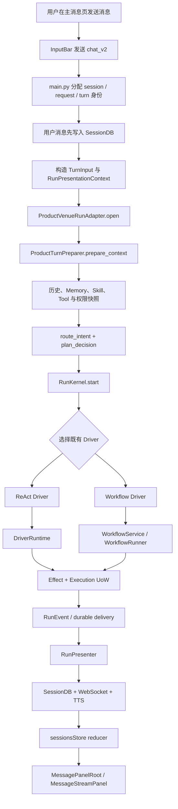
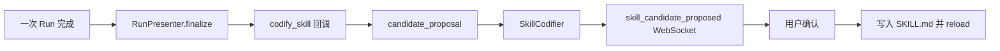
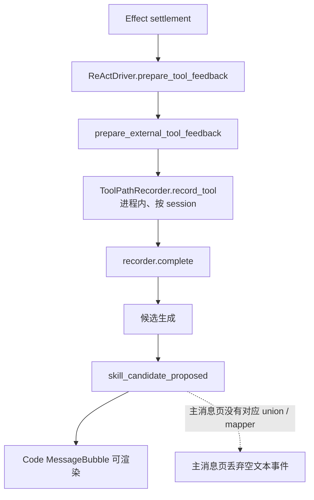
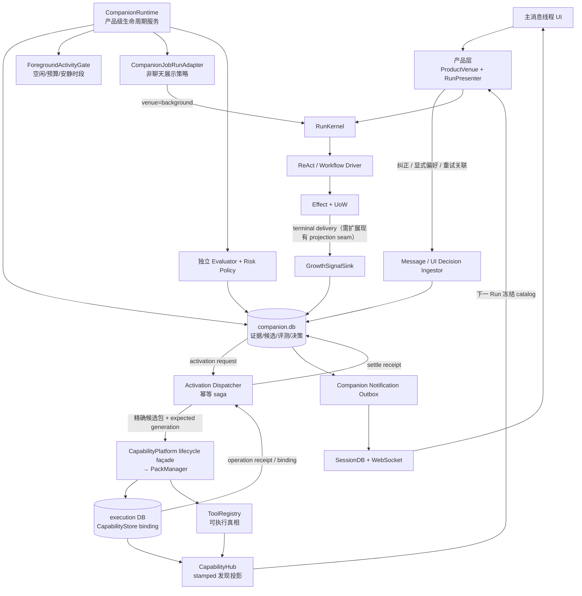
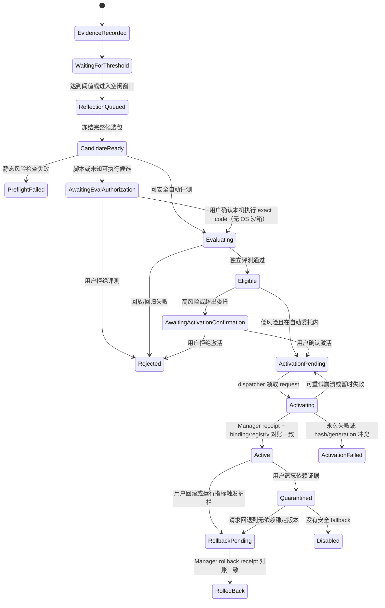
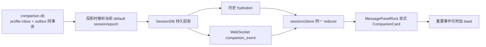

# 代码架构基线：人类锚定伴生智能体成长闭环

> 状态：独立架构复审与最终完整性审计均已 `PASS`；SP-01～SP-11 已完成；等待用户 Review  
> 日期：2026-07-24  
> 本轮提交快照：`2f5436efe7ce92638b84332c99c7a9714904dd9a`；共享工作树仍有在途改动  
> 对应验收：[acceptance.md](./acceptance.md)  
> 简化架构图：[architecture-diagram.md](./architecture-diagram.md)

## 1. 先说结论

DeskPet 现在不只有一套边界较清楚的“单次任务执行底座”：

```text
ProductTurnPreparer → RunKernel → Driver → Effect/UoW → RunPresenter
```

当前 master 还已经出现了通用 Capability 控制面：

```text
CapabilityPlatform
  ├─ CapabilityPackManager → CapabilityStore binding
  ├─ ToolRegistryCapabilityPublisher → ToolRegistry（可执行真相）
  ├─ LocalToolRuntime / MCP / SkillLoader sources
  └─ CapabilityHub（发现投影）→ PreparedToolSet / Run snapshot
```

本次需求既不应该再向执行主干增加一个 Driver，也不应该在 `companion.db` 里复制
`CapabilityStore` 的版本和 active pointer。否则同一个 Skill/Workflow 会同时有两套
“当前版本”，崩溃、切号或回滚时无法判定哪套才是真的。

真正缺少的是一个跨越多次 Run、围绕当前用户长期运行的**成长控制层**：
`CompanionRuntime`。它负责把真实使用产生的证据，经过后台反思、独立评估和风险门，
转成不可变候选包和明确的激活请求；真正的安装、激活、回滚仍委托现有
`CapabilityPackManager/CapabilityStore`。它需要执行智能任务时，仍然调用现有
`RunKernel → Driver`，但通过隔离的 `CompanionJobRunAdapter` 而不是聊天 Presenter，
也不创建第二套 Agent Loop。

同时，当前 Skill 自生成链路虽然已经能从 Harness 的 Effect 结算结果得到工具路径，
仍然不能作为长期成长底座：

1. `ToolPathRecorder` 只是进程内、按 session 聚合的简化缓冲，只保留工具名和成功标志，
   没有 durable run/effect/outcome/纠正/撤销证据链；
2. 后端发出的 `skill_candidate_proposed` 只有 Code 面板会渲染，主消息页会把它丢掉。

所以第一步不是给现有 codifier 增加更多 prompt，而是先建立正式的成长事件和持久化闭环。

## 2. 本次基线如何校准

- 当前分支：`master`
- 本轮提交快照：`2f5436efe7ce92638b84332c99c7a9714904dd9a`
- 当前 worktree：
  - `F:/projects/deskpet`：`master@2f5436ef`（dirty）
  - `F:/projects/deskpet-wt-cap-store`：`codex/capability-builder-protocol@881eb8ed`（clean）
  - `F:/projects/deskpet-wt-os-runtime`：`codex/capability-os-runtime@172bdcaf`（clean）
  - `F:/projects/deskpet-wt-ui-godot`：`codex/capability-ui-godot@9d85a9a8`（clean）
- Capability schema 集成最初由 `7d44cb8a` 合入 master；本轮调研期间 master 又依次前进到
  `72ca2b16`（builder/snapshot lease）、`41e2dc55`（Capability UI）与
  `2f5436ef`（Godot wire）。builder 分支为 patch-equivalent；UI/Godot 的前两个提交已有
  patch-equivalent 内容进入 master，但 `git cherry master codex/capability-ui-godot` 仍把
  分支 HEAD `9d85a9a8` 标为 `+`，只能说主树已包含更进一步的相关 Godot wire 改动，不能在
  Task 0 逐文件/测试对账前宣称整个分支等价并删除。OS runtime 分支也仍含未合并提交，
  主工作树继续修改 Harness/runtime/组合根。它们不是本计划可以删除或覆盖的临时树。
- 主工作树也有其他未提交修改。本文件只做只读调研记录，不把任何在途改动当成本方案已经
  完成的事实。
- 实施前必须等
  `plans/2026-07-23-universal-action-and-capability-packs/plan.md` 对应共享能力底座合并到
  master 并形成绿色基线，再重新锁定提交、schema version 和文件所有权。
- `a33471e1` 已把 `CapabilityPlatform` 类、local runtime、manager/publisher/hub 和 control
  tools 组合到一个生命周期 owner；`7d44cb8a` 已把 `CapabilityStore` 纳入 execution UoW
  所在的 `workflow.db` 初始化链，当前提交快照的 `WORKFLOW_SCHEMA_VERSION=12`、
  Capability 子 schema=`1`。`main.py::_initialize_capability_runtime()` 已在 master，
  但 OS runtime worktree 尚未合并/清理，主工作树的 Harness/runtime 接线仍脏，因此整个通用
  Capability 里程碑尚不能作为本计划的稳定执行基线。
- 生产架构事实源以 `ARCHITECTURE/index.md` 和 `ARCHITECTURE/AGENT_HARNESS.md`
  为入口；本文件记录本需求开始前的代码事实、断点和待验证假设。

## 3. 当前主消息线程的真实运行链路



代码证据：

- 前端发送：`tauri-app/src/code-panel/InputBar.tsx:169-212`
- 当前主消息页导入的 control WS 分发入口：
  `tauri-app/src/code-panel/controlWs.ts`；旧 `code-panel/ws.ts` 已在共享 UI 合并中删除，不能再
  作为 Task 12/13 文件 seam
- WebSocket 入口与任务创建：`backend/main.py:8908-9042`
- 用户消息落库、构造 `TurnInput`：`backend/main.py:5880-5951`
- 构造展示上下文并打开 Venue：`backend/main.py:5952-6009`
- 发送 `run_started`、消费事件并收尾：`backend/main.py:6010-6051`
- Product Venue 准备和启动 Kernel：`backend/deskpet/harness/adapters/venues.py:246-372`
- 历史、记忆、Skill、Tool 与权限快照：
  `backend/deskpet/agent/turn_preparer.py:176-386`
- Kernel 启动与观察：`backend/deskpet/harness/kernel.py:327-507`
- Presenter 投影与收尾：`backend/deskpet/agent/run_presenter.py:231-254,381-423`

### 3.1 text 与 code 的关系

`main.py` 已经把 text/code 都送入同一套 Product Venue 和 Harness 执行链。
两者的核心 Run 生命周期一致，差别主要位于产品参数、展示方式与 Code 工作台的并行任务管理。

因此本计划以“点击消息打开的主消息线程”为验收重点，不为 Code 模式另建成长架构。
以后 Code 模式需要接入时，应复用相同的成长事件协议。

## 4. 三个核心模块目前各自做什么

| 模块 | 当前唯一职责 | 可以继续承担 | 不应该承担 |
|---|---|---|---|
| `ProductTurnPreparer` | 把产品输入准备成一次可执行 Run 的上下文与快照 | 读取已经生效的长期偏好与 CapabilityHub stamped catalog，并形成稳定快照 | 后台反思、成长决策、周期提醒、修改 active binding |
| `RunKernel` | `start / observe / signal / cancel / recover / close`，管理一次 Run 的身份、状态和恢复 | 接受 `venue=background` 的普通 Run；通过通用 terminal projection 发可靠 delivery | 理解“用户成长、每日摘要、偏好晋升、高风险确认”等产品语义 |
| `Driver` | 推进一种执行算法；当前主要是 ReAct 与 Workflow | 继续执行前台任务或后台反思/评估 Run | 新增一个“成长 Driver”；管理跨 Run 的长期生命周期 |
| `Effect + UoW` | 执行工具副作用，并作为执行状态与终态提交权威 | 可靠提交 terminal event 与通用 delivery | 直接决定哪个 Skill 应晋升 |
| `RunPresenter` | 把规范 RunEvent 投影为产品消息、SessionDB、WebSocket 和 TTS | 展示一次 Run 的结果 | 同步运行 codifier、评估或成长模型 |
| `HarnessSupervisor` | child、recovery、late-effect、delivery lane 的恢复与重试 | 继续保证 Harness 自己的执行收敛 | 充当全产品的提醒/成长/摘要调度器 |
| `CapabilityPlatform / CapabilityPackManager` | 统一拥有 publish lock、local runtime、安装、校验、发布、更新、回滚和卸载 | 通过稳定 lifecycle façade 接受已通过成长门的精确候选包，并返回 durable operation receipt | 判断成长证据是否充分，或让 Companion 直取 runtime/registry 内部对象 |
| `CapabilityStore` | 能力版本、operation 与 scope binding 的执行权威 | 保存唯一 active binding 和 generation CAS | 保存用户反思正文、偏好或评测结论 |
| `ToolRegistry` | 唯一可执行 ToolSpec 真相 | 执行已发布 function/MCP/local-runtime tool | 直接执行 `SKILL.md` 脚本或接受 Companion 旁路工具 |
| `CapabilityHub` | 在 CatalogStamp 下合并 Store、SkillLoader、ToolRegistry 等只读事实 | 为 Preparer/UI 提供同一发现投影 | 维护第二套版本或 active 状态 |

上述边界与 `ARCHITECTURE/AGENT_HARNESS.md:63-72,91-100` 一致。

## 5. 当前持久化与所有权

| 状态 | 当前事实源 | 当前恢复能力 | 本需求判断 |
|---|---|---|---|
| 对话历史 | `SessionDB` | 可恢复 | 继续保持消息事实源 |
| Run / Workflow 执行 | execution/workflow store + UoW | 有稳定 ID、lease、checkpoint、outbox | 继续保持执行事实源 |
| Tool Effect / delivery | Harness UoW + dispatcher | 可重试、可结算 | 可复用为成长事件的可靠入口 |
| Capability 版本与激活 | execution DB 上的 `CapabilityStore`：`capability_versions`、`capability_bindings`、operation/publish/refresh/lease 表 | 已有 immutable version、binding generation CAS、manager reconcile，且 schema 已进入统一 workflow DB 初始化；最终组合根接线仍在共享工作树收敛 | **唯一版本/active binding 权威；本计划只能扩展 owner-generation 和成长治理，不能复制** |
| 可执行工具 | `ToolRegistry V2` | registry revision、ToolSpec fingerprint、publisher 基础已存在 | 继续作为唯一 executable truth |
| 能力发现 | `CapabilityHub` | 可按 run/project/user/builtin scope 与 CatalogStamp 生成投影 | 继续作为只读发现面；不存 active |
| Skill instruction | `SkillLoader` + `CapabilityHub.SkillLoaderCatalogSource` | loader 可 reload；当前 user scope key 默认 `"default"`，且 managed pack 与裸目录的去重边界未完成 | 作为 instruction 加载投影；不能直接执行脚本，也不能拥有第二个 binding |
| Capability Pack 文件与进程 | `CapabilityPlatform` 内的 Manager/Publisher/LocalToolRuntime | staging、校验、publish intent、rollback/reconcile、first-party install/control tools 和 shutdown 基础已存在；`main.py` 创建/关闭接线正在共享工作树集成，尚未锁成稳定基线 | 候选通过后必须经它暴露的 lifecycle façade；Companion 不直取 manager/runtime 或另建 materializer |
| Skill candidate | `state.db.pending_skill_candidates` | pending 行可跨重启查询，但通知投递、历史 hydration、决策 fence 与继续处理状态不可恢复 | schema 与状态机需要替换 |
| Preference | 单个 JSON 文件 | 文件可读，但无事务、证据链和版本 CAS | 只能迁移，不能继续扩建 |
| Reminder | Python 对象内的 list | 重启即丢失 | 需要替换 |
| 成长通知 | 直接 WebSocket | 重连和历史加载不可靠 | 需要 durable outbox + SessionDB 投影 |
| 后台成长任务 | 不存在统一事实源 | 不存在 | 新建 `companion.db` |

建议新增独立 `companion.db`，让下面这些 Companion 内部状态在同一 SQLite
事务域中维护：

- 成长证据与证据引用；
- 近期/长期偏好及晋升记录；
- 成长目标、不可变候选包、评估报告、风险判定和两类确认；
- activation request/receipt、lineage、遗忘 overlay 和回滚意图；
- 后台 job、lease、重试与资源预算；
- reminder occurrence；
- 成长通知 intent 与 outbox。

`companion.db` **明确不保存** `capability_versions`、active binding 或 ToolSpec；这些已经由
execution DB 的 `CapabilityStore/ToolRegistry` 拥有。`workflow.db` 继续保存执行与
Capability lifecycle 事实，`SessionDB` 继续保存消息投影。三者之间不存在共同事务边界；
不能用 SQLite `ATTACH` 假装原子提交。跨库只通过稳定 request/operation ID、transactional
outbox、可信 `CapabilityOperationReceipt` 和幂等 reconcile 达到 exactly-once effective。

本轮代码核实到的当前限制：

1. `capability_bindings` 当前唯一键为 `(scope, scope_key, pack_id)`，`CapabilityScope.user_key`
   和 `SkillLoaderCatalogSource.user_scope_key` 默认都是 `"default"`；它们还不能表达
   `profile_id + profile_generation`。
2. `CapabilityHub` 已按 `run → project → user → builtin` 选择同一 capability id 的可见版本，
   因而用户版覆盖 builtin 不需要另造 Overlay。
3. `PackManifest.entries` 当前只有 `skills/tools/mcp_servers`，没有 Personal Workflow 图条目；
   这应在既有 pack contract 上做窄扩展。
4. `install_capability_schema()` 已接入 `initialize_workflow_db()`；当前已提交
   `2f5436ef` 的 workflow schema 为 v12、Capability 子 schema 为 v1。共享未提交工作区
   虽未再改变 schema 常量，仍在修改 Manager/Platform/Store/execution UoW/Harness/main
   等相同 contracts/组合根。实施 Task 0 必须等上游合并和工作树清理后重读最终 `N`，再独占
   分配后续版本；当前 v12 只是调研快照，不能预占为执行时最终迁移号。
5. `CapabilityPlatform` 当前把 `SkillLoaderCatalogSource(skill_loader)` 作为 legacy discovery
   source，但 `ToolRegistryCapabilityPublisher` 只发布 ToolSpec；PackManifest 的
   `entries.skills` 还没有 managed root publish/reconcile，因此 Skill pack 激活闭环尚未完成。
6. 当前 `CapabilityVersionDescriptor` 没有 instruction/workflow refs，而且
   `PackManifest.descriptor()` 对“Skill + tool”包会标为 `function_tool`。正式方案需要让一个
   Store descriptor 同时带 hashed instruction/workflow refs；不能靠额外 Loader descriptor
   拼成第二个同 id capability。
7. 当前 built-in `summarize-day` 与 `recall-yesterday` 的 `SKILL.md` 都要求调用
   `memory_recall`，但 production ToolRegistry 实际只注册了 `memory_search`，不存在
   `memory_recall` handler；所以这两个 instruction 目前并没有真实可执行闭环。更不能把现有
   `Retriever.recall()` 直接标成 read-only：它会更新 salience 和 `decay_last_touch`。正式方案
   必须新增真实、owner-scoped、零 SQL 写的 readonly recall port，并为评测提供冻结 fixture
   adapter，不能只在 effect manifest 里登记一个名字。

## 6. 当前 Skill 自生成链路为何实际上没有闭环

### 6.1 代码表面上的链路



### 6.2 真实链路与断点



证据：

- `record_tool` 定义：`backend/deskpet/agent/tool_path.py:39-45`
- Harness 在 Effect 结果结算后由 ReAct Driver 恢复 loop feedback，再调用 recorder：
  `backend/deskpet/harness/drivers/react.py:301-306`、
  `backend/agent/harness_feedback.py:25-104`
- 现有测试验证的是 `ToolBatchEvent` 在外部 Effect 尚未结算时不会提前填充 recorder，
  不是“永远没有生产 writer”：
  `backend/tests/test_deskpet_skill_remount_after_compaction.py:639-680`
- recorder 实际按 session 存在进程内，`complete()` 后才形成最小 ToolPath，重启会丢失，
  也没有稳定 run/effect/evidence identity：
  `backend/deskpet/agent/tool_path.py:31-59`
- 当前候选触发和模型生成：
  `backend/deskpet/skills/candidate_proposal.py:22-54`、
  `backend/deskpet/skills/skill_codifier.py:53-169`
- 当前候选只保存最小 pending 字段，接受时直接写文件：
  `backend/deskpet/skills/skill_codifier.py:176-264,306-384`
- 名称冲突会创建 `slug-v2/v3`，而不是维护同一 `skill_id` 的 revision：
  `backend/deskpet/skills/skill_codifier.py:450-460`
- 后端发候选事件：`backend/main.py:980-1033`
- Code 面板能渲染：`tauri-app/src/code-panel/MessageBubble.tsx:99-147,672-708`
- 主消息页没有 `skill_candidate` 映射：
  `tauri-app/src/message-panel/MessagePanelRoot.tsx:499-544`
- 主消息流类型也没有该角色：
  `tauri-app/src/components/MessageStreamPanel.tsx:50-76`
- `sessionsStore` 只能在当前内存里手工保护临时候选卡片：
  `tauri-app/src/stores/sessionsStore.ts:1283-1309`

此外，当前 codification 位于 `RunPresenter` 收尾路径，并且成功或错误收尾都会触发。
这会把后台模型调用和候选逻辑耦合到展示层，不符合“主回复先完成、成长异步进行”的验收边界。

### 6.3 旧 loader 不是版本系统；新 Capability 控制面才是

- loader 按 Skill 名称扫描并覆盖，没有稳定 `skill_id + revision`：
  `backend/deskpet/skills/loader.py:283-327`
- 匹配器缓存按名称保存；同名内容更新后可能继续使用旧 embedding。
- 当前存在两条 `skill_invoke` 路径，一条偏向直接调用脚本，一条经 loader 执行。
  在允许自动晋升前，必须删除 loader 内的脚本执行/重复注册语义：
  `SKILL.md` 只作为 instruction；需要执行的代码必须声明成同一 Capability Pack 的
  function/MCP/local-runtime tool，并经 ToolRegistry/Effect/UoW。
- 当前 master 已有 `CapabilityStore`、`CapabilityPackManager`、
  `ToolRegistryCapabilityPublisher` 与 `CapabilityHub`。因此正确修复不是再给 loader
  增加 revision 表，而是让 manager 激活 pack、Store 持有唯一 binding，loader 只投影
  当前 binding 对应的 instruction root。
- managed pack 的 SkillLoader 投影必须与裸目录 source 明确去重；同一个 pack 不能在
  CapabilityHub 中同时出现一条 Store binding 和一条 `"default"` user binding。

## 7. 其他长期成长能力的当前缺口

### 7.1 偏好

`backend/deskpet/agent/preference_memory.py:57-99,116-209` 当前是整文件 JSON 读写，
记录主要是 `text / embedding / label / kind / ts / pinned`：

- 没有显式偏好与隐式信号的权威顺序；
- 没有近期层与长期层；
- 没有 evidence、source run、冲突和晋升理由；
- 没有 CAS、回滚、单条遗忘后的重算。

而且 `RunPresenter` 当前只在 Code mode 以未托管 `create_task` 写偏好，
主消息线程没有同等级的正式闭环。

### 7.2 反思

存在两个名字相近但用途不同的实现：

- `backend/deskpet/agent/reflection.py:26-66` 是一次 Run 内工具证据不足时的 Verify/Replan；
- `backend/deskpet/memory/reflection.py:64-135` 是读取近 24 小时消息后写一条每日观察。

两者都不是本需求所需的“基于任务结果、纠正、重试、撤销和独立评估的成长反思”。
新的协议应使用新类型和新名称，避免误复用。

当前每日反思 loop 在 `backend/main.py:4324-4359` 用裸 `create_task` 和固定 sleep，
没有持久 schedule、任务句柄、lease、去重和完整 shutdown。

### 7.3 Reminder

`backend/tools/reminder.py:4-15,27-68` 明确使用进程内 list，重启后消失，
并且目前主要注册在旧工具表，而不是完整的 ToolRegistry V2 生产能力。
它不能作为主动伴生行为的基础。

### 7.4 Workflow 自创建

当前 Workflow 是代码注册的静态 `WorkflowDefinition`：

- 注册入口：`backend/deskpet/workflows/bootstrap.py:27-64`
- registry 和 manifest 约束：`backend/deskpet/workflows/runner.py:86-155`
- 节点含 Python callable：`backend/deskpet/workflows/definition.py:135-169`

目前没有用户 Workflow loader、候选、评估和晋升机制，现有 Capability Pack manifest
也尚未声明 Workflow 图。通用能力计划已经把顶层执行收敛为
`agent.general → workflow_spawn → 静态 child profile`，因此 Personal Workflow 应在
现有 pack 中携带声明式图，并由唯一静态 `workflow.personal_v1` profile 解释；不能动态
注册 Python `WorkflowDefinition`，也不能再建一套 Workflow active pointer。

## 8. 与已确认验收的差距

| 验收 | 当前状态 | 主要阻塞 |
|---|---|---|
| AC-01 成长事件 | 阻塞 | 没有正式 schema；tool recorder 虽有生产 writer，但只是不可恢复的最小缓冲 |
| AC-02/03 双层偏好 | 阻塞 | 只有扁平 JSON 与相似度检索 |
| AC-04 非阻塞反思 | 阻塞 | 现有 codifier 在 Presenter 收尾；反思 loop 不可恢复 |
| AC-05 候选契约 | 阻塞 | 候选字段不足 |
| AC-06 Skill version | 部分 | CapabilityStore/Manager 已提供 immutable pack + binding 基础；旧 codifier/SkillLoader 仍未接入，owner-generation 也未完成 |
| AC-07 独立评估 | 阻塞 | 当前只有模型生成，没有独立回放门 |
| AC-08 低风险自动晋升 | 部分 | Capability lifecycle 有 operation/binding 事务；尚无成长评测门、activation saga 与 receipt 对账 |
| AC-09 高风险确认 | 部分 | 有通用 manual/auto 策略和旧候选确认 UI；成长专用双授权域与主消息页卡片未完成 |
| AC-10 Workflow/新能力 | 部分 | 通用 CapabilityBuilder/pack 方案在实施中；Personal Workflow manifest entry 与固定解释器尚无 |
| AC-11 主动行为 | 阻塞 | reminder 易失，没有统一调度 |
| AC-12 通知/摘要 | 阻塞 | 只有实时 WS 临时卡片 |
| AC-13 查看/回滚/遗忘 | 部分 | CapabilityManager 已有 rollback；缺 evidence lineage、即时 quarantine/fence 与跨库 receipt reconcile |
| AC-14 重启恢复 | 部分 | Run/Workflow 与 capability operation 有恢复基础；成长 job、activation saga、候选通知/决策和提醒不可恢复 |
| AC-15 单人边界 | 未成型 | 当前 CapabilityScope user key 默认 `"default"`，还没有 profile generation 所有权 |
| AC-16 审计解释 | 阻塞 | 没有串联 evidence→candidate→eval→decision 的审计链 |

## 9. 建议的目标边界



关键原则：

1. `CompanionRuntime` 由 `main.py` 组合根创建、恢复、启动和关闭。
2. 它拥有一个有界后台 scheduler，不散落裸 `create_task`。
3. 它需要智能推理时，通过独立的 `CompanionJobRunAdapter` 以稳定
   request/turn/job ID 发起 `venue=background` Run；不复用聊天 `RunPresenter`。
4. Kernel 只看到通用 Run 与 `DeliverySpec`，不知道什么是“成长”。
5. 前台回复路径只做一次很小的幂等事件落盘或可靠 delivery，不运行反思模型。
6. Companion 只批准并请求激活，不直接写 active binding；Manager/Store/Registry 成功后返回
   的可信 receipt 才能把候选标成已生效。
7. UI 通知先持久投影到 SessionDB，再实时发 WebSocket；历史和实时走同一 reducer。
8. `HarnessSupervisor` 继续只管理 Harness lane，不接管 Companion scheduler。

权威边界固定如下：

| 事实 | 唯一权威 | Companion 可以做什么 |
|---|---|---|
| 为什么要改变 | `companion.db` evidence/lineage | 记录、聚合、解释、遗忘 |
| 待评测的精确内容 | `companion.db` content-addressed candidate artifact | 冻结 exact bytes，不能激活 |
| 评测与成长决策 | `companion.db` report/risk/decision | 生成 activation intent |
| 已安装版本与 active 指针 | execution DB `CapabilityStore` | 只读 receipt/binding，不复制 |
| 真实可执行工具 | `ToolRegistry` | 不得绕过 |
| instruction 是否加载 | `SkillLoader` | 只驱动 managed root reconcile |
| 用户/UI 能发现什么 | `CapabilityHub` | 消费 stamped projection |

这里有两个已由 SP-01/SP-02 验证、并据此锁定正式 seam 的结构性事实。第一，当前 Kernel 的
`TerminalProjection` 一次只解析一个 target、一个 association event 和一组 deliveries，
组合根也只注入 `GoalTerminalProjection`。所以“附加成长 terminal delivery”不是注册一个
新 sink 就自动完成；SP-01 已证明必须在不改变 Goal association 的前提下，旁挂通用
`TerminalDeliveryContributor.requires_durable()/freeze_deliveries()`，同时保持既有
Goal 投影的事件顺序和恢复语义。完整 `DeliverySpec` 必须在 start 时冻结，terminal 时不再
调用 contributor 或查询 Companion 当前 binding，否则账号切换/代码升级会改变 delivery set。
terminal intent commit 与物理 sink dispatch 还是两个阶段：commit 前普通
`RunExecutionFencePort` 要求 current snapshot lease bound，并把 owner/generation、
revocation epoch、dependency/snapshot hash 冻结进 delivery rows；同一 terminal UoW 随后才
写 terminal、delivery intents 和 lease release receipt。commit 后专用
`TerminalDeliveryFencePort` 验证 frozen facts + exact release receipt，不再要求 lease active。
正常 success/failure/cancel 因此仍可投递；commit 后 forget/delete 才 tombstone/discard。
profile switch 若在 commit 前发生会 cancel 旧 Run，若在 commit 后发生则 delivery 留在原
profile inbox pending，不能改投当前账号，待原 profile active 后继续。

第二，普通 durable ReAct 目前只在首个 command boundary 后才保存 canonical messages、
request payload 和 capability snapshot。若 `execution_runs` 已创建、boundary 尚未写入就
崩溃，`recover()` 无法重建 DriverStart。因此正式方案必须新增产品无关
`RunStartSnapshot`，与 `RunCreate` 原子保存规范化输入、能力快照、provider launch policy
和 frozen terminal `DeliverySpec`；不能只给现有 DriverStart 多塞字段。真实 ReAct 一个
Run 可以产生多次模型调用，因此每次物理外调必须另以 `(run_id, invocation_id)` 独立
记账；atomic Workflow 没有直接 provider 调用时不得伪造 invocation row。
真实网络在 `AgentLoop/provider shim` 内发生，所以由注入的 `ProviderInvocationCoordinator`
在每个 iteration/provider/fallback/retry dispatch 前只在 host memory prepare，再取得短
fence lease，并用一个 execution UoW 直接 insert-or-verify `claimed`；不存在生产 durable
`prepared`。claim commit 前崩溃是 row=0/dispatch=0，commit 后才允许 transport start；
最终响应先以 immutable
`ProviderInvocationOutcome` 持久化并把 invocation 置 completed，之后才向 ReActDriver emit。
恢复遇到 completed 直接重放 outcome，claimed 无 outcome 则 fail closed。工具撤销门同样
下沉到 `ToolExecutor` 与各 Workflow adapter 的最后一个物理 effect 调用前。
共享 revocation lease 只覆盖 fence 重验、durable claim 和有界 transport-start ack；
ack 后立即释放，不等待长 provider/tool response。返回/settle/emission 前重取 lease 并比较
revocation epoch，保证 provider 永久挂起也不能阻塞 forget，而迟到结果不会继续展示或产生
后续副作用。ack 本身不增加独立事务：成功时随 outcome、失败/超时时随 unknown/failed
持久化；崩溃只留下 claimed 时直接 fail closed。durable stream delta 只能作为带
invocation/epoch 的 transient provisional
buffer；completed 后替换，unknown/reconnect 时清除，不落 SessionDB。
真实提交图不能压成“统一四事务”：`ReactFinal` 当前 emission 后没有 Driver 写；
`ToolBatch(1)` 当前是 boundary、首次 goal、turn fence、batch/attempt、1×prepared 共 5 笔，
`ToolBatch(N)` 是 `4+N` 笔，目标分别再增加 provider claim/outcome。第 5 轮的真实
UoW/Driver spike 证明继续“每事务新开 connection”会使 p95 回退 `10.887%～43.257%`；
保持 `WAL+synchronous=FULL` 与每个 crash boundary 不变、改用进程内串行长寿命
`ExecutionWriteLane` 后为 `+6.734% / -32.379% / -42.648%`。因此 writer connection
复用是 provider ledger 的实施前置，不能靠降低 durability 或另建 ProductVenue 旁路过门。
coordinated durable mode 还必须关闭 OpenAI/Anthropic/Gemini SDK 的隐藏 transport retry，
并让 Coordinator 成为 retry/fallback 唯一 owner；否则一次 invocation row 下面可能发生多次
HTTP 请求。provider 无法关闭或观测 transport retry 时，durable mode fail closed。
当前主消息链实际还经过 `backend/providers/openai_compatible.py`，其中同时存在 httpx
transport retry、应用层 transient/reasoning/tool-choice retry 与 stream→non-stream
fallback；coordinated mode 必须切到该类已有的 at-most-once 物理入口并关闭这些内层重试，
不能只修改 `backend/llm/*_adapter.py`。

### 9.1 成长事件是多源协议，不是只有 terminal

单个 terminal `RunEvent + target_id` 无法表达“用户纠正了上一轮”“这次是重试”“撤销了
先前偏好”或“一次性例外”。正式 `GrowthEvent` 至少从三类入口幂等汇合：

| 来源 | 记录内容 | 提交时机 |
|---|---|---|
| 消息入口 / 显式 UI 命令 | 明确长期偏好、纠正、一次性例外、反馈、撤销、被重试对象 | 用户消息落库后、Run 启动前写入最小 source event；显式长期纠正走有界同步提交，保证下一 Run 的 Preparer 可见 |
| Effect settlement / terminal | 工具 receipt、成功/失败、可验证 outcome、所用 pack/version/catalog snapshot | 从权威执行结果投递，至少一次传输、按 stable event id 幂等 |
| 用户决策 | 候选确认/拒绝、回滚、遗忘、提醒授权 | 命令处理事务中写入，并通过 outbox 更新通知 |

retry 事件必须保存 `previous_request_id / previous_run_id / current_request_id /
current_run_id`，不能依赖文本相似度猜测。显式偏好写入不等待空闲反思；自然语言抽取若无法
确定，只先保存 evidence，不冒充明确偏好。

偏好解析先看 scope：request-scoped 显式例外在当前 Turn 最高优先且不写入长期层；持久层
内部才按“显式长期纠正 > 已晋升长期 > 近期隐式 > 模型假设”排序。因此“本次详细、以后
简短”会在当前 Turn 使用详细，同时把简短作为后续 Turn 的长期事实。

隐式偏好晋升的首版出厂契约必须确定：typed
`CompanionGrowthConfig.preference_promotion_independent_context_threshold=3`，
合法范围 2..10，`config.toml` 同样显式写 3。只有 distinct stable `context_key` 的 live、
未衰减、无冲突 evidence 才计数；重复、tombstoned、decayed 或 conflict 行不凑数。S-2
直接使用默认值，前两次只在 recent，第三次才进入 long-term。

所有内部 Run 带 `origin=companion` 与 `purpose=reflection|evaluation|delegated_task`。
`reflection/evaluation` 默认 `capture_growth=false`；delegated task 只允许其客观 outcome
成为证据，生成过程本身仍不递归采集。除此之外，所有
`owner_key=companion:<profile>:<generation>` 的 Run——包括用户点击消息打开的前台主线程、
root/child/refresh 与后台 delegated task——都必须经过同一个 host-owned
`IrreversibleEffectPolicy`。core 工具的 effect/idempotency 唯一权威是与
`execution_build_sources.json` phase-filtered handler set 完全对齐的
`tool_effect_policy_manifest.json`；Pack/plugin/MCP 只从各自已验证 manifest adapter 产生同一
typed metadata。catalog 每项带 host-owned `authority_phase=legacy|companion|both`，CI 必须
分别构造两个 composition 并在各 phase 内证明 missing/unused=0；set mismatch 使 build 失败，
不能从工具名、permission 或模型
描述猜测。external-send/destructive/payment/credential/privacy/unknown 在 foreground 与
delegated Run 一律进入 hash-covered confirm-only；Driver 与 ToolExecutor 从同一 frozen
snapshot 双验。目标完成后
`memory_recall=read_only,idempotent` 必须成为真实 production composition 的 shipped golden；
它不是当前代码已经拥有的工具。

### 9.2 后台 Run 隔离与全局动作策略

当前聊天 `RunPresentationContext` 会写 assistant 消息、发 WebSocket、TTS/usage，并在
final/error 再调用 codifier；它不能用于后台反思或评估。产品层新增
`CompanionJobRunAdapter`，仍复用 `ProductTurnPreparer` 的可抽取准备能力、
`RunKernel` 和现有 Driver，但使用独立 presentation policy：

- 结果只写 Companion job/result store，不直接写聊天消息、不发 TTS、不调用旧 codifier；
- `reflection` 和 `evaluation` 使用最小只读 `PreparedToolSet`，高风险/未知工具直接不可见；
- `delegated_task` 是另一种 job 类型：持久 delegated grant 只允许 read/draft/reversible
  local。为了让模型可以准备外部动作，`PreparedToolSet` 增加会进入 snapshot/hash 的
  `confirm_only_names`；这些 ToolSpec 可见但 `auto_mode` 永远不能直接执行；
- confirm-only call 使用现有
  `DecisionOpen → commit_decision(authorization_commit) → execution_grants →
  GrantConsume + claim_tool_call(effect_type)` 链。decision 冻结原 call/effect/tool、
  canonical args、capability/scope hash、nonce 与 expiry；用户允许后只恢复原 durable
  boundary，不能新建发送任务或重新生成参数。Companion job 在等待时释放 lease，只保存
  execution run/decision 引用，不建立第二张 grant 消费表；
- frozen prepared snapshot 必须由 Task 3 就创建的 host-only `PreparedRunContextV1`
  引用并验 hash；它先提供通用 opaque extension，不等 Task 10 才创建类型；
  ReActDriver 以 call id/tool/schema 把 confirm-only 强制 OR 入 `authorization_indexes`，
  即使原 ToolSpec 不要求授权也必须开 decision；ToolExecutor 从同一 snapshot 二次核验；
- 主消息卡点击不直接用当前聊天 session 构造 signal，而走 owner-fenced
  `CompanionActionDecisionService`：UI 只提交 `{decision_id,allow}`，service 从原后台
  execution run 重建 immutable session/principal/auth epoch/nonce/version。A/B owner、同 id
  新 generation、伪造 run/session/nonce 一律拒绝，commit 记录显式用户点击 provenance；
- claim 前先短持 `RevocationBarrier` read token，再通过 Platform
  `CurrentExecutionScopeLeasePort` 按
  `publish_lock → CatalogGate read` 取得 frozen owner/binding/hash lease；三者共同覆盖
  effect claim 与有界 `dispatch_started` ack，随后逆序释放，不等待 response。这样
  activation/profile/forget 不能插入 scope 验证与物理 dispatch 之间；`auto_mode=ON`、
  历史授权、profile/binding 已变或 forget 已提交时，真实外部 effect 仍为 0；
- `ToolRegistry` 需要真实三段 seam：
  `begin_prepared → start → DispatchStartedAck|DispatchNotStarted|DispatchStartUnknown →
  completion`。正式 `PreparedDispatchAdapter` 带稳定 adapter id/version/fingerprint；
  ToolSpec 未声明时只可使用 function adapter，MCP/local-runtime 不得伪装普通 callable。
  function/MCP/local-runtime adapter 分别在受管 task、transport frame、受管 pipe 真正开始后
  返回有界 ack；无 ack 能力在 durable/confirm-only 模式 fail closed。旧的单 await
  `execute_prepared()` 只能做兼容 wrapper，不能让治理路径在 claim 后提前释放锁再调用；
  MCP 在 `ClientSession` 构造前包装公开 write stream，禁止读取 SDK 私有字段；local worker
  必须 suspended create、加入专属 Job、resume、pipe handoff 后才 ack。Harness 与 Workflow
  的 `PreparedToolExecutor` 都走同一 coordinator；
- forget/profile switch 若发生在 started ACK **之后**，已交给外部 transport 的
  send/delete/pay 可能仍在远端完成。既有 `execution_effects/attempts.status` 不增加新枚举，
  而在 workflow `N→N+1` 迁移中增加
  `handoff_state unresolved/not_started/started/started_may_complete/reconciled`、
  `completion_disposition normal/confirmed_not_started/inflight_effect_may_complete/
  reconciled_not_completed/reconciled_completed_suppressed` 与 ACK/cancel/reconcile receipt
  refs/hashes。允许组合固定为
  `running/unresolved/normal → running/started/normal → succeeded|failed|accepted/
  reconciled/normal`；NotStarted 固定转
  `cancelled/not_started/confirmed_not_started`，同 call 不自动重领；StartUnknown、unresolved
  crash 或 ACK 后 revoke 固定为
  `unknown/started_may_complete/inflight_effect_may_complete`；late reconcile 才能转
  `late_reconciled/reconciled/<两种 suppressed disposition>`。effect 与 attempt 行同事务同
  status。claim 后没有 durable NotStarted proof 的崩溃保守视为 may-complete；ACK 后
  revocation 单调写 `status=unknown + started_may_complete +
  inflight_effect_may_complete`。系统只能阻止新的 dispatch/chained effect，并丢弃迟到
  completion/禁止 settle 成功；有 cancel API 时 best-effort cancel/reconcile，远端确认已完成
  也只写 suppressed audit receipt，不能把原 effect 改回 succeeded 或伪称撤回。before-handoff
  有 durable NotStarted receipt 时 physical dispatch=0；
  DeskPet 管理的 local Job/session 可按持久 identity 精确终止；
- job payload 固化 `origin / purpose / capture_growth / owner / evidence IDs /
  capability snapshot`，恢复时不得扩大；
- 所有 background durable Run 同样从 execution DB 的 immutable `RunStartSnapshot`
  恢复；job-level retry 不能冒充 execution run 恢复；
- provider/result collector 把 token 与耗时实际值写回 job settle；缺 usage 时按预留上限
  结算，不能记 0；
- 用户可见结果只通过 Companion notification outbox 投影回主消息页。

这不是新增 Driver；它是 Kernel 之前和 Presenter 之后的产品适配边界。

### 9.3 用户身份与会话归属

当前 `HostContext.principal_id = local:{session_id}`，它随会话变化，不是“对应的人类”的
稳定身份。`CompanionRuntime` 必须使用稳定 `companion_profile_id`：

- 已登录时使用 `AuthAdapter.User.id`（relay 下发的稳定 account identifier）经本地
  namespacing 后作为 owner，并通过新的受信任控制消息同步给 backend；
- 未登录的纯本地模式使用用户数据域内一次生成的随机 profile id；
- 不保存密码、token 或邮箱作为 owner id；
- 登录、登出或切换账号只切换 namespace，绝不自动合并两个 profile；
- 删除 profile 时按该 owner 做证据、偏好、候选、Capability binding、job、通知的可审计级联遗忘。
- main Auth bridge 与 message-panel action 各有独立 control WS；每条连接拥有自己的
  `connection_id + control_epoch + challenge + seq`，`profile_bindings` 不保存连接槽位。一般
  `get_shared_secret` 只建 control WS 和有 TTL/进程硬上限的 `challenged` lease，不参与
  active unique、不撤旧真实 lease、不改变 IdentityReady；容量满时只逐出最旧 challenged
  row。它不授予 mutation，也不能用来签 credential。Rust
  在每次 backend child spawn 生成新的 Ed25519 keypair：private key 只留 Rust 内存，backend
  通过 one-shot bootstrap pipe 只拿 public key；renderer/invoke/WS/env/log/child 都拿不到
  private key。Rust command 使用 injected
  `WebviewWindow` 真实 label 签短期、process/connection/challenge/epoch/request-seq/
  command-kind/request-hash/nonce-bound credential：
  label=`main` 的 AuthAdapter bridge 只得 `identity_bind` 并回显完整 auth snapshot，
  label=`message-panel` 只得当前 owner 的 `companion_action`，同一 main 内 code panel
  不能拿 action scope。backend 逐次验 Ed25519 signature/process/connection/label/scope/
  challenge/expiry/nonce。首个有效 signed command 在同一 Companion transaction 将本 row
  `challenged→active`、撤同一真实 label/scope 的旧 active lease、消费
  `request_seq=last_seq+1` 并写唯一 `profile_control_commands` receipt；后续命令只接受该
  active lease。credential 与 request hash 共用 checked-in
  `control-command-canonical-v1` binary TLV：只接收 null/bool/string/safe-integer/array/object，
  object key 按 UTF-8 bytes 排序，u64 以网络序入 hash；拒绝 float、NaN/Infinity、`-0`、
  duplicate key、lone surrogate 与 invalid UTF-8。Rust/TS/Python 必须逐字节通过同一 golden
  vectors，不能依赖各语言 JSON stringify。跨 execution DB 的 action 由
  claimed receipt 按 stable decision id 幂等恢复，重复 token/seq 不生成第二 effect。
  `identity_version` 只是 main 连接 epoch 内单调 seq，message-panel 有自己的 seq。拿到 shared
  secret、旧 process token 或错误 signing key都不能伪造 mutation。旧连接、错误 window/scope、旧 challenge 和
  stale binding CAS 都拒绝，因此前端重启或丢 localStorage 不会被持久旧计数卡死；
- backend 在收到 trusted identity bind 前由 `IdentityReadyGate` 阻止 Companion chat、
  hydration 和 scheduler；不能猜“上次登录账号”；
- 每连接的 `control_epoch+seq` 只排本连接消息，`binding_epoch` 每次切换 active profile
  递增，`profile_generation` 只在 owner 删除/重建时变化；F5/双 WS/其中一条重连不能覆盖
  另一条的 challenge/seq。Run 冻结身份 epochs，不能互相代替；
- built-in Capability/Skill 只读共享；user/run/project scope 的 binding 都额外绑定 canonical
  owner key `companion:<profile_id>:<profile_generation>`。当前 `"default"` user key 只能作为
  迁移前 legacy 值，不能继续用于新用户能力。
- 切换 profile 时在同一 publish lock 下原子切换当前 owner 可见的 ToolSpecs、managed
  Skill roots、MCP runtimes、`OwnerBindingSetStamp` 与本进程 owner projection fingerprint；
  旧 Run 继续持有 retired spec/snapshot lease，
  inactive profile 不领取 job、进入新 catalog 或投影通知。
- owner-domain 的 DB PK/FK/UNIQUE 都以 `(profile_id,profile_generation)` 分区；同 profile id
  删除后重建的新 generation 不能读取旧生命周期数据。
- 新主消息 session 在 trusted identity ready 后一次绑定 exact profile/generation，之后不可
  rebind；已有正文但无 owner 的 legacy session 只归 `legacy_local_profile`。Run start 从该
  binding 冻结 `OwnerMemoryReadScopeV1(owner,generation,binding_epoch,session-set hash,
  as_of_message_id)`，模型参数和当前 UI session 都不能扩大可读范围；
- 所有无法证明账户归属的 legacy Skill/Preference/PendingCandidate/Reminder 只迁入稳定
  `legacy_local_profile`，即使升级时当前登录 Relay；Relay 不自动继承本机旧数据。

所有 evidence、preference、candidate、activation request、job、notification 都以 owner
为首要分区键；CapabilityStore binding 以相同 owner key 做数据库级约束。执行期
`principal_id` 仍保留为一次会话的权限主体，二者不能混用。

第一阶段所有主动消息投影到当前 active profile 的逻辑 inbox。投影 worker 在发送时解析
主消息会话 `default` 与 epoch；没有可用 session 时保持 pending，不能永久丢弃。事件仍保存
真实 `source_session_id / source_run_id`，避免把展示目的地误当证据来源。

Preparer 还要在 CompanionStore 冻结通用 `run_growth_snapshot`：本 Turn 采用的 preference
key/version/hash/evidence，以及 CapabilityHub 中的 `pack_id/version/manifest_hash/
binding_generation/RunCatalogContentStamp` 都成为 dependency items。PreparedToolSet 与 Hub
catalog 不能分两次读取：Platform 在同一 `publish_lock→CatalogGate` 临界区逐项重验 exact
spec/adapter/schema/build fingerprints、只组合一次完整 Run catalog，并返回同时供
RunStart、ToolSet、growth dependency 使用的 typed envelope。Kernel 提交 RunStart 后、
任何 Driver/provider/effect 前通过 after-commit handshake 幂等绑定 run id、验证 process-local
snapshot pin 并打开 ReadyGate；崩溃可重做，未 ready 绝不执行。content-changing capability
refresh 不能覆盖初始 snapshot：先在 CompanionStore 追加
`(run_id,snapshot_generation)` immutable prepared generation（带 prior ref/hash 和全量
dependency/evidence），execution refresh record 再引用它；after-commit CAS 为 bound/current
并更新 all-generation root 后才开 continuation Gate，新代 ready 后才退旧代。未知提交按 stable
refresh id 对账，不能出现两个 current generation。遗忘沿 all-generation root 反查并 revoke
每一代，不能只查初始快照。

### 9.4 建议的成长状态机



`EvalAuthorization` 与 `ActivationConfirmation` 是两道不可互换的门：前者只允许对精确
package/suite/runner-policy 在本机执行一次 code/hook 评测，并必须明示无 OS 沙箱；Job
Object 只管理进程树，任意 Python 仍可直接访问文件/网络/凭据。系统只能保证 DeskPet
brokered external effects 被 stub，不能承诺绝对无副作用。评测通过后仍可能停在
`Eligible/AwaitingActivationConfirmation`；后者另行绑定 package、report、risk 与 expected
CapabilityStore binding generation。若候选含 code/hook/local-runtime，还必须绑定 exact
package/code digest 与 `persistent_local_code_no_os_sandbox`，明示“激活后代码可持续被调用，
Job 仅管理生命周期、不提供 OS 沙箱”；只有评测授权时 activation runtime/health 启动数为 0，
且激活确认仍不替代每次 brokered external effect 的 action confirmation。任何一方的 nonce
都不能被另一方消费。通用
`PermissionGate.auto_mode` 只处理普通任务授权，不能自动消费这两种成长 token。

评测本身也不能绕过遗忘门。生产 `LocalEvaluationRunner` 不再直接接受任意
`execute(example)` callback，而只调用 `FenceAwareEvaluationCaseExecutor`。每个 evaluation
都有唯一 action-discriminated execution permit：确定性预检只可为 instruction-only/
personal_workflow-v1 签发 `safe_auto`，代码/hook/unknown 必须由已消费的用户评测授权签发
`user_authorized`；两者都绑定最终 candidate hashes、suite/runner policy、owner 与
revocation epoch，但都不授权激活或 DeskPet brokered effect。每个 case/variant/attempt 在短 shared
RevocationBarrier 内重验 candidate、execution permit、owner、case lease 与 revocation epoch，
提交 durable launch claim，并对
代码/hook child 完成有界 Job/runtime start-ACK 后立即释放；provider judge 继续复用
background Kernel 的同一 fence。长结果在锁外等待，settle 和领取下一 case 前再次重验。
forget 排他提交会 invalidates evaluation/case lease 并发 exact abort request：若 forget 先于
ACK，物理启动数必须为 0；若 ACK 在先，只清理已持久化的 Job/PID/session，迟到结果不进入
report，且不允许再领取下一 case。
case lease 过期也不能直接重跑：steal 后先进入 recovery-only，completed outcome 复用，
NotStarted+survivor=0 才可按 policy 新 attempt；started/unknown 必须精确 abort/reconcile，
清理后 case 为 inconclusive，cleanup 未收敛则 cleanup_required，期间新 launch=0。生产
launch row 在单个 Companion transaction 直接插入 `claimed`，没有 durable `prepared`：
claim commit 前崩溃时 row=0/StartPort=0，可用同一 deterministic id/ordinal 重试；commit 后
崩溃必见 claimed 并进入 recovery-only。若没有 durable NotStarted receipt，孤立 claimed
只能转 unknown、精确 cleanup 后让 case inconclusive，不能猜成未启动再跑。

`ActivationPending/Activating` 是跨数据库 saga，不是假单事务：

1. Companion 事务写入 action-discriminated mutation request，并以 partial unique
   `(profile,generation,target owner/scope/scope_key,pack_id)` 保证跨
   install/update/rollback/uninstall/disable 同时最多一个 nonterminal saga；unknown/
   cleanup_required 在 reconciler 收敛前继续占位。install/update 绑定 exact
   candidate package/manifest/archive hashes、passed report/risk/decision；rollback 绑定
   quarantine 或用户 cause、当前 binding 与已安装 target；uninstall/disable 绑定 cause 与
   当前 binding。所有 action 还绑定 scope、owner-generation、expected binding generation。
2. Dispatcher 用 request id 作为 idempotency key，调用 `CapabilityPlatform` 的窄 lifecycle
   façade：install/update 在 barrier 外 stage immutable inactive version/environment；
   rollback 用 `prepare_installed_static()` 冻结已安装目标，禁止调用会隐式 prepare/publish 的
   旧整体式 rollback。现有 `ManagedEnvironmentPreparer.prepare()` 会执行 command
   `--version` 和 candidate healthcheck，不能复用为 static stage；正式接口拆为纯
   `materialize_static()`（文件/声明/which-only，spawn/import/connect/execute=0）与只产出
   descriptor 的 `plan_executable_checks()`。任何 generic removal 若会露出 lower-precedence
   executable fallback，必须在 static normalization 阶段改写为携 exact source fence/runtime
   set 的 typed fallback rollback；builtin 使用 `remove_override`，首版未实现的 run/project
   fallback action 直接拒绝。三者共用 `prepare_runtime_set()`，按 exact target
   manifest 持久化 operation-scoped set header（set hash、expected instance count）及按
   canonical entry 排序的 command dependency probe、tool healthcheck、MCP/local-runtime 等
   每个会 spawn/connect/execute 的 instance；这些步骤不注册、不启动、不绑定。trusted
   operation id 与完整 set ref/hash 在任何 instance start 前回写 Companion request；空 set
   也有 count=0 的 durable receipt。
3. 评测/确认满足后，Dispatcher 为 set 内**每个 instance**分别取得短 shared
   `RevocationBarrier`，重验 candidate/cause/evidence/quarantine/owner/binding generation/
   revocation epoch/set hash/前序 instance outcome，并签发绑定 operation/set/instance 的
   host-only launch authorization。Platform 在该 lease 内先把对应
   `runtime_prepare_intent(...,status=prepared)` CAS 为
   `runtime_instance_id + launch_revocation_epoch + status=launch_claimed`，再完成有界 runtime
   start handoff。local runtime 用 `CREATE_SUSPENDED` 创建、assign 到 per-operation Windows
   Job Object (`KILL_ON_JOB_CLOSE`) 后才 resume 并把冻结 health envelope 交给受管 pipe；MCP
   把同一 runtime/session health operation 交给受管 transport。只有收到
   `StartedAck|NotStarted|StartUnknown` 且 adapter 保证释放后不会 late start，才释放该 lease。
   长 health response 在 barrier 外等待，不能再创建第二个进程、连接或 health request；未得
   到当前 instance terminal health/abort outcome 不领取下一 instance。forget-before-ACK 使
   对应启动数为 0；forget-after-ACK 不等待 health，根据 set 内所有已持久 intent/Job/PID/
   session identity 精确 abort，迟到 health 不能授权发布。expected count 完整且全部 instance
   health 通过后，Dispatcher 才取得最终短 shared lease，再次重验同一 set hash 与 launch
   revocation epoch。
4. 第二次短临界区内
   `CapabilityCatalogGate` 关闭该 owner/pack 的新 Hub snapshot acquisition，Manager 再完成
   `publish_intent DB commit → Registry/managed roots/runtime swap →
   binding + Manager receipt DB commit` 的可恢复 saga，返回 `CapabilityOperationReceipt`；
   Registry 与 SQLite 不宣称同事务原子。锁内只允许已就绪 pointer/catalog swap 与 DB
   commit，禁止网络、进程启动/停止、用户代码或健康检查。
5. `remove_override` 必须冻结 current user override 与 exact builtin fallback；instruction-only
   使用 canonical empty runtime set，可执行 fallback 则逐实例 start-ACK/health 全绿后，才在
   同一 fenced publish 移除 override 并 swap 到 ready fallback。receipt 同时保存移除后的 user
   `OwnerBindingSetStamp`，以及 exact fallback binding/generation/manifest、fallback owner
   stamp、process projection fingerprint 和 runtime-set ref/hash；一个 stamp 不能证明两边。
   只有 Platform 证明最终 capability absent/disabled 且无可见 executable fallback 时，
   uninstall/disable 才不准备 target runtime；短 barrier 内只撤下 catalog/binding 可见性并写
   receipt，禁止 stop/join，释放后才按 receipt 冻结的旧 runtime set 精确 retire/abort。
   Manager receipt 提交后立即释放 barrier。Companion 在 barrier 外按 request version +
   publish revocation epoch 校验 receipt 的 action/pack/version/manifest/scope/owner/binding
   generation 与 committed `OwnerBindingSetStamp` 及 owner projection fingerprint；
   install/update 才把 candidate 记为 Active，
   rollback 更新 quarantine/request 与受影响 candidate，uninstall/disable 只更新
   quarantine/request 的 binding outcome，不假设 candidate 存在，然后投递通知；
   若期间 forget/switch 已推进 epoch，则进入 quarantine/rollback，不误标 active。
6. 若在 2～5 任一点崩溃，启动 reconciler 用 operation id 查询 CapabilityStore operation、
   binding、runtime set header/全部 instance intent 与 registry stamp；已成功但未 settle 的
   request 补写 receipt，缺行/set hash 或 expected count 不符 fail closed；
   `launch_claimed/started/health_passed/unknown/cleanup_required` 先按 set 内 exact
   Job/PID/session/instance scope 清理，未知状态 fail closed。

已提交 binding 的 executable projection 也不是“磁盘有版本就直接 publish”。当前
`rehydrate_active_bindings()` 会在 publish lock 内 `prepare_installed→publish`，正式路径必须
禁用它对 growth owner 的直接执行：冷启动或 profile A→B→A 为 exact committed binding set
创建新的 `owner_runtime_activation_generation`，barrier 外 static materialize，逐 instance
短 lease start-ACK、锁外 health，全部通过后在最终短
`barrier→publish_lock→CatalogGate` 临界区一次性公开。旧 generation 的 Job/session 锁外精确
清理；quarantine-before-ready、半 set 或 cleanup 未收敛时 catalog 始终 closed。

现有 `CapabilityPlatform.initialize()` 会直接调用 `manager.recover()`。正式实现必须把恢复
分为两类：general/builtin operation 可由 Platform 自行恢复；带
`governance_domain=companion_growth` 的 operation 在 Companion profile、quarantine 与
activation request 尚未恢复前必须保持 suspended。此时已提交 Store binding 只能用于读取
descriptor 并构建 dormant projection，不得注册 ToolSpec/Skill root 或启动 MCP/local runtime；
启动还要从 pending publish intent 重建 closed `CapabilityCatalogGate`，Hub/Preparer 在
reconcile 前只能得到 typed `catalog_reconciling`；profile/generation/quarantine 对账后才可
公开 executable projection。推进 publish phase 或切
binding 必须由 Companion reconciler 在共享 barrier 下携 typed recovery authorization 完成。
否则一次重启就能绕过成长确认和遗忘门。

真实 Hub 的 snapshot 路径已经使用 publisher `publish_lock`，所以全局锁序固定为
`RevocationBarrier（若需要）→ CapabilityPlatform.publish_lock →
CapabilityCatalogGate read（snapshot）或 writer（publish）→ 单库事务`。Hub 不得先拿
gate read 再等待 publish lock；Publisher 也只按同一顺序 close/write，避免 AB-BA。
closed key 返回 typed `catalog_reconciling`，不回退旧 stamp；已发出的长期 snapshot/runtime
lease 不持 gate token。锁等待有硬 timeout，并用 snapshot 与 publish/profile-switch 两种
先后顺序的并发测试证明无死锁/半 catalog。任何时候都不能同时持有两个数据库 writer
transaction。execution boundary 的共享 lease 只持续到 durable
claim + 有界 dispatch-start ack 或确定未启动，response/settle 时再重验 epoch；activation
的 static target/runtime-set prepare 不持 barrier，set 内每个 runtime **start handoff** 各用
一个短 lease，逐实例长 health response 在外等待；全部 health 通过后，
pointer/catalog/binding + Manager receipt 使用最终短 lease；
Companion settle 在释放后按 epoch CAS；
forget/profile switch 用排他 lease 先提交 quarantine/owner state，随后即使 rollback 尚未完成，
execution fence 也会立即阻止旧版本或旧 owner。

### 9.5 建议的核心数据链

```text
GrowthEvent → EvidenceCluster → zero-tool GrowthReflector ─┐
trusted explicit user create → GrowthBuildAdmissionRouter ─┤
                                                           ↓
  StructuredGrowthProposalV1
  → candidate_builds
  → CompanionCandidateBuildCoordinator（host permit）
  → fixed workflow.capability_build child
  → host-issued durable CandidateDraftReceiptV1
  → CandidatePackArtifact
  → EvaluationReport
  → GrowthDecision
  → CapabilityActivationRequest
  → CapabilityOperationReceipt
  → CapabilityStore Binding
```

其中 proposal 只有两个受信来源：zero-tool `GrowthReflector` 只可以提出
`StructuredGrowthProposalV1` 或 abstain；主消息中的显式创建/修改 Skill、Workflow 请求必须由
`GrowthBuildAdmissionRouter` 在 Builder child admission **之前**把 stable user request/evidence
转成同一 proposal/reservation/build 链。两者都不能直接构造 package、启动 Builder，也不能写
`GrowthDecision=approved`，更不能调用通用 lifecycle tool 绕过成长门。风险分类和最低
证据门必须是确定性策略；growth-managed pack 的 install/update/rollback 还必须携带
host-only governance permit，普通 `capability_update` 或 Auto 模式不能伪造。唯一
`CompanionCandidateBuildCoordinator` 从 durable `candidate_builds` 领取 proposal，签 host-only
permit 并启动固定 `workflow.capability_build` child；只有 exact `CandidateDraftReceiptV1`
可交给 Store 冻结 candidate。通用
`CapabilityBuilderHost.finalize_child_completion()` 只要验证出的产物含 Skill/Workflow
entry，就必须由 host-owned `CapabilityBuildOutputPort` 强制 handoff 为 Companion
candidate-only；ReActDriver 只消费 typed finalize result，它不能自行选择 publish。它不能走
原来的直接 publish/refresh 分支。

评测本身也必须可恢复、可发布：

- `StaticRiskPreflight` 永远先于任何 candidate 执行；未确认脚本不启动进程，DeskPet
  brokered external effect 只做 typed stub/replay；获授权代码仍可能直接访问 OS，不能据此
  声称任意 Python 无副作用；
- 版本化 evaluation suite manifest 随应用打包，不能依赖用户机器上存在仓库 pytest；
- candidate evaluation 的 job/case/result/report 全部以 `companion.db` 为权威，使用 stable
  case id、lease 与 open-or-resume；workflow/execution DB 只保存 durable run/checkpoint，
  通过 outbox 把结果送回；
- `create_candidate()` 同事务冻结 candidate package 的 immutable hash metadata、分离的
  manifest/archive/file blobs（manifest、Skill 多文件或 Workflow graph、base/content/effect
  hash）及本 attempt 独立的 evidence/build-receipt source provenance；preflight、评测与激活读
  同一包，activation dispatcher 只能把评过的 exact bytes 交给 CapabilityPackManager，
  manager receipt 的 manifest hash 必须逐字节匹配；diff 不能当可执行载体；
- hash metadata/blob、governed attempt 与 provenance 分表：
  `candidate_packages/files/blobs` 以 content/package hashes 唯一，
  `candidate_artifacts` attempt 以 reflection job 或
  `source/target+evidence_set+package+reservation` key 唯一并引用 package。同 job 重放复用
  attempt；真正新增 evidence 即使得到相同 bytes 也创建新 attempt、复用 package，旧
  rejected/expired/invalidated attempt 不 reopen；每个 attempt 必须有自己的
  `candidate_package_sources` 与 trusted build receipt，不能借用另一 attempt 的证据；
- 所有入口共用 Task 0 从 shipped packs 量测并锁定的 `CapabilityPackageLimitsV1`，在完整
  read/DB write/extract 前流式限制文件数、单/总未压缩 bytes、manifest/archive、compression
  ratio、深度与 UTF-8 路径长度。Windows `WindowsPackagePathPolicyV1` 在 archive 预检和逐
  entry materialize 时都拒绝 drive/UNC、ADS、反斜杠、尾随点/空格、设备名（含扩展名）、
  symlink/hardlink/junction/reparse，并按 NFKC/casefold 与 Win32 ordinal-ignore-case 拒绝
  别名碰撞；每次写入前后重新验证 containment 和无 reparse parent；
- version 不能由包含自身 version 的最终 package hash 反推。先对省略 version/派生 hash 的
  canonical seed（owner、target/base、全部文件 bytes、权限与 effect topology）计算
  `candidate_content_hash`，用其生成
  `core+g.<owner_hash24>.<content_hash24>`；写入 version 后再计算最终
  `candidate_manifest_hash + candidate_package_hash + archive_hash`。content hash 只负责
  reservation/version/idempotency；评测、risk、decision、activation 与 receipt 一律绑定最终
  package/manifest/archive hashes，二者不得混用；
- evaluation 创建时一次冻结每个 case 的 packaged suite resource，或 historical source refs +
  sanitized input envelope，以及 assertions、adapter/build fingerprint；old/candidate 共用同一
  input id/hash。重启不得重读 mutable SessionDB/evidence/adapter；forget redaction 使正在启动的
  case 与 evaluation 单调转 inconclusive；
- allowed read tool 还必须冻结
  `production ToolSpec/schema/build/effect ref → EvaluationReadToolAdapterV1 + readonly fixture`
  的版本化 mapping/root hash。`memory_recall` old/candidate 共用同一
  `EvaluationMemoryFixtureStoreV1` ref/hash，Driver 与 ToolExecutor 仍验 Skill scope，但
  production SessionDB/Retriever 调用数和 fixture write count 都为 0；缺 adapter、hash 漂移或
  redaction 时 inconclusive，绝不能回退 live owner memory；
- safe-auto Skill 只允许 manifest 与 `SKILL.md` frontmatter 的 frozen `allowed-tools` 完全相等，
  并解析到同一次 catalog capture 的 exact ToolSpec/schema/build/effect refs；所有工具都须由
  host manifest 证明 read_only/idempotent，且相对 source topology 不扩张。生产 read tool 的
  输出不承诺对变化中的合法索引状态逐字节确定；确定的是 manifest-driven risk decision。
  old/candidate 的可复现性只由前述 frozen evaluation adapter/fixture 保证，不给 effect
  manifest 发明一个无法兑现的 determinism 字段。
  Personal Workflow 必须由固定 node catalog 计算闭图 effect/dataflow，无 external/
  irreversible/unknown；候选自报不能决定风险；
- old/candidate 两套 snapshot 同时冻结：update 的 old 是同 owner source pack，
  builtin_override 是 exact builtin source；genesis 的 old 是 canonical
  `capability_absent_v1`，冻结 expected-absent target、基础 agent PreparedToolSet 与无目标 entry
  的 `RunCatalogContentStamp`，比较“没有该能力”和 candidate。pairwise judge 随机交换 A/B
  标签并隐藏版本身份；
  timeout、缺例、degraded、abstain 均为 inconclusive，不能安全失败成 PASS。

### 9.6 同一个 Skill 如何“直接成长”

用户看到的是同一个 Skill；内部必须是不可变历史：

```text
pack_id = "skill.weekly-report"
versions = [1.0.0, 1.1.0, 1.2.0]
CapabilityStore binding = 1.1.0
candidate artifact = 1.2.0
```

- 生成 1.2.0 时 1.1.0 binding 继续服务；
- `companion.db` 保存候选 exact bytes、评测、成长决策与 activation saga，但不保存 active；
- `CapabilityStore` 保存 immutable installed version 与唯一 active binding；
  `CapabilityPackManager` 负责目录物化、校验、publisher、CAS 和恢复；
- 逻辑 version 不进入物理路径。同一
  `storage_key=H(pack_id,version,manifest_hash)[:32]` 同时定位
  `cv2/<key>/p` pack root 与 `cv2/<key>/e` environment root；Store 保存两根 schema/hash，
  rehydrate、rollback 与 spawn argv/workdir 均从该映射取得。旧 versions/envs 路径只读；
  pack、environment 最深文件和 spawn path 都通过 Windows `<=240` golden；
- 当前 Store 对 `(pack_id,version)` 全局唯一。不同 owner 独立成长同一 builtin pack 时，
  使用保持同 `pack_id` 的确定性 SemVer build metadata
  `+g.<owner-hash>.<content-hash>` 避免版本碰撞；UI 仍只显示同一逻辑 Skill；
- 首次成长 builtin 是第三种 `builtin_override`，不是无 base genesis，也不是同 owner
  update：old snapshot/diff 精确绑定 builtin source version/manifest/generation，而目标是当前
  profile user scope 的 expected-absent binding；Manager 在一个 Store CAS 中同时重验 source
  仍相同、target 仍不存在。后续 user override 才是普通 update。首次 override 回滚没有上一
  user version，必须先冻结 exact builtin fallback：instruction-only 使用 empty set，含
  ToolSpec/MCP/local-runtime 时全部 instance start-ACK/health 后，才在同一 fenced publish
  remove 当前 user binding 并 swap 到 ready builtin executable projection；source 漂移或
  set 未全绿则保持 user binding 并 stale，不能先删除再补 runtime；
- `SKILL.md` 只作为 instruction。包内若需要代码，必须声明成 function/MCP/local-runtime
  tool，经 ToolRegistry/Effect/UoW；删除 `SkillLoader.invoke_script()` 这条旁路；
- `memory_recall` 必须新增为真实 production ToolSpec，而不是 manifest-only 名字。模型 schema
  只有 `query/limit`；owner/session/as-of 来自 frozen `OwnerMemoryReadScopeV1`。它只调用新的
  `Retriever.recall_readonly()`/`OwnerScopedMemoryRecallQueryPort`，按 exact owner session join
  与 `message_id<=as_of` 查询，并以 SQLite authorizer/write counter 证明不会触发旧
  `Retriever.recall()` 的 salience/touch/decay 写入。若要保留 boost，另建带明确 write effect
  的能力，不能藏在 read tool 中；
- manifest 与 `SKILL.md` frontmatter 的 `allowed-tools` 必须相等。Host 在一次 catalog capture
  生成 `PreparedSkillInvocationScopeV1`，把每个名字解析为 exact stable handler/spec/schema/
  build/effect/idempotency ref 并纳入 Run stamp/snapshot。auto-disclosure、`skill_invoke`、
  `/<skill>` 与 compaction/restart 都恢复同一 scope；激活后 Driver 展示的 schema 与
  ToolExecutor 实际执行都只能取
  `base PreparedToolSet ∩ union(active PreparedSkillInvocationScope)`，未知、漂移或正文外工具
  fail closed；
- managed pack 的 instruction root 由 binding reconcile 到 SkillLoader；裸 user skill
  兼容源和 Store 源必须按 canonical pack identity 去重；
- owner publish/activation/detail 只使用 Store-only `OwnerBindingSetStamp`；Hub 为某次 Run
  合成 run/project/user/builtin precedence 与 raw host sources 后，生成跨进程稳定的
  `RunCatalogContentStamp`；`ProcessCatalogStamp` 再绑定 process id 与 Registry/Skill/MCP
  revisions，仅用于该完整 Run catalog 的本进程物化。三者禁止混用；
- Run 开始时在一次 Platform capture 中同时冻结
  `RunCatalogContentStamp`、pack/version/manifest hash、binding generation、
  PreparedToolSet snapshot；每个 durable host tool 还必须携带 artifact-derived
  `execution_build_identity`：core 来自嵌入 build/source manifest，plugin 来自安装 bundle
  digest，MCP 来自 adapter/server artifact 与 hash-covered config。缺失则
  `host_build_identity_missing`，同名同 schema 但 handler bytes 改变必须 fence；
  auto-disclosure、`skill_invoke`（只返回/挂载 instruction）
  和 compaction remount 都解析该快照，不能在途读取新 active；
- root、child 与 capability refresh 共用
  `PreparedLeaseProjection → DB adopt/clone/refresh commit → after-commit ReadyGate`：
  commit 前先 pin exact ToolSpec/resolver，确定回滚按 refcount 补偿，commit unknown 不启动
  Driver/continuation；child 有独立 pin，refresh 必须 new ready 后才释放 old；
- root/child 的 success/failure/cancel 统一由 Kernel `TerminalCommitExtensionV1` 在 terminal
  UoW 原子写 Run terminal、current intent released 与 release receipt；确定 commit 后
  `AfterTerminalCommitCleanupV1` 才撤该 member pin，最后 member 再清共享 hidden runtime。
  terminal commit outcome unknown 先查询 receipt；普通 session/WebView close 不释放。
  delivery rows 同时冻结 pre-release fence epoch/dependency hash/release receipt ref，物理
  delivery 走 post-terminal fence，不能再用“lease 已 released”拒绝正常消息；
- matcher 缓存以
  `owner-generation + pack_id + version + manifest/content hash` 失效；
- user Capability binding、managed Skill root、Loader view、ToolRegistry 可见集和 matcher key
  都带 owner generation，A 的能力不能通过 `"default"` user scope 被 B 加载；
- 回滚只让 Manager 把 binding 切回已验证 installed version，不重新生成内容；
- 遗忘沿 evidence → candidate source/attempt → report → decision → activation receipt →
  pack version lineage 传播。共享 package 只有另一 attempt 的全部 evidence live 且拥有自己的
  exact trusted build receipt 时才保留 blobs，同时被忘 attempt 永远 tombstone；否则 package
  立即 `content_state=redacted`、bytes 不可读，所有引用 lineage invalidated，待
  Run/snapshot/runtime/rollback 清理后删除 candidate blobs 与 Capability `p/e` roots，只保留
  hashes/deletion receipt。**保留 bytes 不等于该 version 仍可服务**：每个 attempt 另有
  `capability_version_supports`。若另一 support 已 independently passed+decided+activated，且
  reconciled receipt 精确匹配 current binding，forget 只撤被忘 support、不隔离 version；若
  另一 support 仅 eligible，则版本立即 quarantine/rollback，该 support 可继续评测，但必须用
  新 decision + expected quarantine generation/support-set hash 发起 release。release 先用短
  exclusive CAS `active→release_pending` 并关闭 Gate，锁外 static prepare，再逐实例短 shared
  start-ACK、长 health 锁外等待，最后短 exclusive activate+receipt+released/open；中途 support
  漂移 fail closed。无独立 source 永久不可 release。受影响版本先被 growth execution overlay
  立即 quarantine，再请求 Manager 回退；无安全 fallback 则禁用 binding。遗忘事务同时写
  durable revoke/cancel outbox，并与每次 provider launch、Skill/Workflow/effect、terminal
  commit/delivery 共用一个 execution fence/barrier，保证提交后不再产生基于已遗忘内容的行为；
- UI 仍显示一个“周报 Skill”，而不是 Overlay 或 “weekly-report-v3”。
- 迁移完成后关闭旧 Preference JSON 与旧 codifier 的写入口，禁止双事实源。

### 9.7 Workflow 的第一版实现方向

不要让模型直接生成任意 Python callable。建议先建立一个固定、受测试的
`personal_workflow@v1` 解释器和一个固定 `workflow.personal_v1` profile。现有
Capability Pack manifest 窄扩展 `entries.workflows`，pack version 保存声明式图；
active 状态仍只来自 CapabilityStore binding。解释器版本与用户 Workflow pack version
是两种不同身份：

- 节点只能来自封闭、版本化的 node/tool catalog；
- V1 图是最多 32 步的 DAG；节点只允许 `input/template/condition/tool_call/output`，
  数据绑定只用 JSON Pointer，condition 只用固定比较器，禁止任意表达式/Python/shell；
- `tool_call` 的确认只走现有 Effect/decision/token 链，graph 不定义第二套 confirm；
- 每节点后保存 current node、output hash、effect receipt 与 graph hash；恢复跳过已完成节点；
- 创建候选时验证图结构、参数 schema、权限集合和可恢复性；评测后的 exact pack 才能交给
  CapabilityPackManager；
- 生产组合根固定 `root_profile_key="agent.general"`，顶层不会经过
  `DeskPetRouteClassifier`；现有 durable Workflow 的真实入口是 root ReAct 调用
  `workflow_spawn`，再由 `ProductDelegateFactory` 构造 child Run。因此 personal Workflow
  必须复用这条链，不能写一条实际上不会运行的 classifier 分支；
- 固定 personal profile 会出现在组合时冻结的 `workflow_spawn` enum/基础描述中；不为按
  Turn 隐藏它而动态改 ToolRegistry schema hash。Preparer 只在确定命中后，从当前 owner
  的 CapabilityHub/Store binding 解析
  `personal_workflow_selection = owner + pack_id + version + manifest_hash +
  binding_generation + graph_hash + query_hash` 并增加匹配提示，放入独立 typed host-only
  `PreparedRunContext`，
  而不是用户 `RunRequest.request_payload`；
- 模型的 `workflow_spawn` 参数仍只能选择固定 `workflow.personal_v1` profile 和 objective，
  不能提交 owner/revision/graph。`ProductDelegateFactory` 从父 Run 的冻结 selection
  验证并注入 child payload；没有 selection 或 owner/hash 不符时拒绝，child/effect 为 0；
- 现有 `ProductDelegateFactory._allowed_tools()` 从
  `request.request_payload.execution_capabilities` 向可信集合 union 的兼容 widening 必须删除；
  child allowed tools 只能来自 Kernel 校验后的父 Run frozen snapshot，恶意用户 payload
  不能影响 profile resolve 或扩大 child subset；
- selection 对一个 parent run 只能创建一个 child；幂等重放返回同一 child，第二个不同
  tool call 拒绝；
- child `RunStartSnapshot` 固化 `pack_id + version + manifest_hash + binding_generation +
  graph + graph_hash`，执行中途不漂移，重启恢复也不重新读取 live binding；
- effect 类型、次数、顺序、目标或数据流涉及发送、删除、付费、凭据、隐私时，即使
  permission set 没扩大也由 AC-09 覆盖，进入高风险确认；
- 复用现有 Workflow lease/checkpoint/outbox，而不是另写调度引擎。

这样不需要把每个用户 Workflow 动态注册成新的 profile/`WorkflowDefinition`，也不会在
运行中修改冻结的 `ProfileRegistry`。SP-04 已用真实 `ProfileRegistry`、封闭 DAG 解释器、
重复 selection 和 effect-settle/checkpoint 崩溃恢复验证这条路线；正式实现仍须按 Task 10
的生产测试门执行，不能把 spike 当作业务验收。

现有 Python Workflow 的“优化”不等于修改其代码或图。每个静态 profile 通过显式
`WorkflowPackAdapter` 把允许改变的声明式 overlay 写入 pack manifest：Deep Research 可调整 mode/max questions 与
disclosure，Presentation 可调整 pages/depth/theme/image mode 与 disclosure，Durable Task
首版只允许 disclosure，`approval_required` 等执行策略仍由可信 factory 决定。未注册字段
拒绝生成候选。

### 9.8 低风险自动回滚不是一句策略

每次 low-risk auto activation 的可信 receipt 在 Companion settle 时，必须同事务创建
`companion_guard_v1`：固定 24 小时、threshold=1，绑定 exact pack/version/manifest/binding
generation、owner stamp、policy hash，并预先冻结 rollback plan。guard 只接收 host typed
critical receipt：

- package/archive integrity mismatch；
- unchanged runtime/build identity 下的 deterministic runtime contract/health failure；
- catalog schema/build fingerprint mismatch；
- effect-policy fingerprint 或实际 broker classification 违背 settled manifest。

provider/network/credential/用户取消、模型输出质量/自评与普通 tool error 都不能触发。首个
合格 incident 用稳定 source event id 幂等写入，和 `open→rollback_pending`、立即 quarantine/
CatalogGate close、唯一 mutation request 在同一个 Companion transaction。它必须先按
`exclusive RevocationBarrier → publish_lock → target CatalogGate writer/close` drain 旧 shared
effect lease，再在同锁下读取 exact binding；这样 incident 提交后没有新 snapshot/dispatch，
并发 activation 也不能在读取与提交之间换 binding。成功提交后 Gate 保持 closed 到 rollback/
disable receipt 对账；known failure 才按原 stamp reopen，commit unknown 保持 closed 并
reconcile。update 回 previous same-owner stable version，builtin_override 用 exact
remove_override，genesis 用 disable。
窗口过期单调 expired，binding 已变化单调 superseded；崩溃恢复同一 incident/request，rollback
失败时坏版本仍隔离，不能继续服务。任何后续成功改变同 target binding 的 receipt 都在
Companion settle 同事务先按 expected old binding supersede 旧 open guard；只有新 binding
也是 low-risk auto 时才插新 guard，人工 activation 不插。guard 自身 rollback receipt 则把
rollback_pending 转 rolled_back；迟到旧 incident 只能 rejected，不能回滚新 binding。

### 9.9 Reminder V2 的 handler 集与跨库幂等

当前 `backend/tools/reminder.py` 只有进程内 `list_reminders`。目标不是在旁边悄悄多注册两个
名字，而是一次 authority cutover：

```text
legacy.list_reminders.v1
  → retire（不保留 alias）

core.reminder_create.v2  reversible_local / idempotent
core.reminder_list.v2    read_only / idempotent
core.reminder_cancel.v2  reversible_local / idempotent
```

Task 0 冻结三项 exact schema/effect/source；source/effect/build manifest catalog 用
`authority_phase=legacy|companion|both`，CI 同时构造 legacy production 与 companion test
composition，分别要求 phase-filtered missing/unused=0。Task 11 只在 dormant/test companion
phase 注册 V2，Task 13 的 durable marker 前滚才切 production phase；任一时点旧/新 handler
不能同时可见。

create/cancel 的幂等不能只靠 execution DB。`reminder_mutation_receipts` 以
`(profile,generation,effect_id)` 唯一，保存 canonical args hash、operation、deterministic
reminder id、before/after schedule version 与 result hash。create 的 reminder id 从 owner +
stable effect id 派生；handler 在一个 Companion transaction 中写 mutation、reminder CAS、
occurrence/outbox 与 receipt。若 Companion commit 后、execution effect settle 前崩溃，
recovery 只按 exact effect id/hash 读取 receipt 并补 settle，不得再次修改；cancel 重放先查
receipt，因此不会因第一次已递增 version 而误报 stale。异 hash或另一个 effect 使用旧 expected
version必须 conflict。

## 10. 主消息页通知的正确接法

建议新增稳定信封，而不是复用临时 `skill_candidate`：

```ts
type CompanionEvent = {
  event_id: string
  notification_id: string
  profile_id: string
  profile_generation: number
  session_id: string
  seq: number
  kind: "growth_notice" | "daily_digest" | "reminder" | "activation"
  importance: "normal" | "important"
  title: string
  summary: string
  detail_ref: string
  detail_version: string
  available_actions: string[]
  source_run_ids: string[]
  occurred_at: string
  decision?: EvaluationAuthorizationDecision | ActivationDecision | ActionConfirmationDecision
}

type EvaluationAuthorizationDecision = {
  kind: "evaluation_authorization"
  candidate_id: string
  candidate_revision: number
  candidate_package_hash: string
  suite_hash: string
  runner_policy_hash: string
  nonce: string
  decision_version: number
  expires_at: string
}

type ActivationDecision = {
  kind: "activation"
  candidate_id: string
  pack_id: string
  candidate_version: string
  candidate_package_hash: string
  evaluation_report_hash: string
  risk_assessment_hash: string
  scope: "run" | "project" | "user"
  scope_key: string
  owner_key: string
  expected_binding_generation: number
  nonce: string
  decision_version: number
  expires_at: string
}

type ActionConfirmationDecision = {
  kind: "action_confirmation"
  decision_id: string
  run_id: string
  call_id: string
  effect_id: string
  tool_name: string
  redacted_target_summary: string
  args_hash: string
  capability_hash: string
  scope_hash: string
  expires_at: string
}
```



- `companion.db` 是通知 intent/outbox 的事实源；SessionDB 是可从 outbox 修复的展示投影；
- SessionDB 新增白名单 `projection_kind=companion_event`，固定
  `context_visibility=exclude`；FTS triggers、VectorWorker backfill、Retriever 的全部信号、
  EnhancedRetriever chunk query、Summarizer、旧 MemoryReflection 与 QASet 都必须在 SQL
  层排除，不能只在最终 prompt 过滤；
- Task 0 锁定执行时版本 `S` 后，`S→S+1` callback 对 external-content FTS 不运行无过滤
  `rebuild`；必须重建空索引后只从
  `context_visibility='conversation'` 的 messages 显式填充，否则 excluded 行会被重新索引；
- 写 SessionDB 使用 stable `notification_id → projection_event_id` 与
  `append_projection_if_epoch`，遵守 session tombstone/epoch fence，禁止重建已删除会话；
  目标暂不可用时 outbox 保持 pending，下一次 identity/session 就绪后重试；
- 同一 owner/event 在 state.db 只保留一行；default session/epoch 改变时，投影 worker 以
  单调 route version 调用 `relocate_projection_if_epoch()`，在同一事务校验 payload hash、
  旧 route 与新 session fence 后 CAS 更新该行的 session/epoch，而不是被全局唯一键困在
  已删除或旧 default session；
- projection owner 包含 `profile_generation`，partial unique/history/relocation 都按
  owner+generation；同 id 新 generation 不 hydrate 旧卡；
- notification outbox 即使已经 delivered，route 仍可能随后变化。因此
  `SessionDB.clear()/tombstone/default-route` 必须在同一 state.db 事务写
  route-change outbox；它以 profile/generation/route_version 唤醒 Companion
  `projection_reconcile` job，再领取已投影通知完成 relocation。主消息真实
  `session_delete → clear()` 也必须走该事务，不能 clear 后另补 tombstone；
- route/redaction worker 每次都要重读 CompanionStore 的当前 notification，而不能依据
  `pending/projected` 猜 SessionDB 是否仍有行。新增仅供内部投影器调用、owner-fenced 的
  `append_current_projection_if_absent()`：如果 owner/event 行因 `clear()` 已被删除，也按当前
  trusted route 补回当前事实；当前 notification 已 redacted 时只允许写固定 tombstone 和
  redaction receipt，绝不能重放旧 outbox 正文。行存在时仍走 relocation 或
  `redact_projection_if_hash()`，partial unique 保证全程最多一行；
- 后端 history response 必须恢复完整 typed envelope；历史和 live WS 调用同一个 reducer，
  envelope 必带 `profile_id + profile_generation`。reducer 持有 backend bind ack 确认的
  active owner-generation，每次 history/live 归并都先丢弃 owner fence 不匹配的延迟事件，
  再由 `event_id + seq` 负责实时/历史幂等；不能只在切号 ack 时清一次旧卡；
- 第一阶段逻辑目的地固定为 profile inbox，物理目的地是投影时的主消息会话 `default`；
  事件内保留原始 source session/run；
- 交互事件使用带 `kind` 的 discriminated union：evaluation authorization 精确绑定
  candidate package/suite/runner-policy，activation confirmation 另行绑定
  package/report/risk/scope/owner/expected binding generation；两种 nonce 互不可消费。
  `action_confirmation` 只引用 execution DB 的原 decision/run/call/effect 与 redacted target；
  UI 只发 trusted `{decision_id,allow}`，由 `CompanionActionDecisionService` owner-fence 后
  从原后台 run 重建 `DecisionSignal/RunRef/ActorContext` 并走 `commit_decision()`；
  Companion 不复制它的 nonce/grant，evaluation/activation/auto mode 也不能消费。
- SessionDB 信封只保存小摘要、`notification_id/detail_ref/detail_version` 和可用动作。
  forget 不能只让详情查询隐藏正文：Companion 同事务把受影响 notification 变成固定无敏感
  tombstone 并写 expected-old-hash projection-redaction outbox；SessionDB 通过唯一
  owner/event 的 `redact_projection_if_hash()` 原地更新并写 receipt，随后 WS 用递增
  redaction version 通知同一 reducer replace 卡片。pending 原投影重放以及
  `clear commit → crash → forget → route replay` 的 absent-row 分支都只能读取当前
  tombstone；断网/F5/history 也只能看到 tombstone，不能复活旧 summary/actions；
  startup/identity gate 在开放 Companion history hydration 前必须先 drain route/redaction
  outbox。运行中的 history 还要经过只读 `CompanionProjectionVisibilityPort`：若
  Companion 当前行已 redacted 或 hash 比 SessionDB 新，响应内立即合成 tombstone 并排队
  repair；Companion 暂不可读时 companion_event fail closed（不返回），普通聊天消息仍可
  正常返回。forget 提交后实时通道立即发送 typed retract/tombstone，durable Session 修复
  仍由 outbox 完成，不能等待跨库提交才隐藏旧卡；
  “查看详情”只能调用 owner-fenced `CompanionDetailQueryPort`：可信 control binding 提供
  profile/generation，服务端沿 redacted lineage 分页读取 evidence 摘要、candidate/base
  diff metadata、evaluation、decision、Manager receipt，并通过 Platform typed façade 查询
  current binding。Companion 使用 durable
  `companion_detail_versions(profile,generation)`，每次详情可见写/forget 在同一事务 CAS
  bump；Platform 在 `publish_lock→CatalogGate read→Store read transaction` 内返回
  `PlatformDetailSnapshot + sorted PlatformDetailTokenVector`；每个 token 含 owner/scope key、
  `exists`、单调 lifecycle version、owner catalog generation、committed `OwnerBindingSetStamp` 与
  receipt-set hash。调用者展开的每个 required run/project/user/builtin key 都有 item；缺行
  不能一律冒充 v0：`capability_owner_detail_versions` authority row 永不物理删除，并以
  `row_state=existing|deleted` 在 create/delete/recreate 时都单调 bump；deleted row 返回
  `exists=false/version>0`，只有从未出现的 key 才使用 canonical
  `exists=false/version=0/empty stamps`。existing empty row 是 `exists=true`，查询本身不补写 row。
  vector 覆盖最终结果依赖的 target 及所有 source/fallback/precedence owner rows；
  remove_override 至少同时覆盖 user empty row 与 builtin source row。owner catalog generation
  表示整个 owner/scope committed binding set 的单调代数，不是某个 pack 的 binding
  generation；每个具体 binding 另带自己的 `pack_id + binding_generation`。
  对应 publish/reconcile 同事务 bump。每页所有读取被 `Vc0/VpVector0` 与
  `Vc1/VpVector1` 包围，末尾重读完全相同的 key set；任一 vector item 变化即丢弃页面并返回
  `detail_changed`，cursor 绑定相同完整 vector；因此分页中途 builtin source 更新、absent
  run/project key 被创建或 existing key 被删除都不能漏掉。
  前端不得直读 DB/archive；遗忘或旧
  generation 只返回 redacted/unavailable，不再解析原文或 archive diff。
  同命令重复幂等，内容冲突或旧卡点击返回 `stale_decision`，不能评测或激活已过期版本；
- toast 只是提醒，不是事实源；
- 不复用 supervisor inbox，因为它表达 watchdog warning/error，并会影响宠物告警状态；
- workflow reducer 已有 `run_id + seq + terminal` 的单调归并模式，可作为实现参考：
  `tauri-app/src/stores/sessionsStore.ts:917-1187,1366-1425`。

## 11. 启停顺序与孤儿任务约束

```text
启动：
SessionDB / Workflow DB
→ CapabilityStore/Platform foundation + descriptor-only dormant projection
→ CompanionStore + profile/quarantine/authority recovery
→ governed operation + activation receipt reconcile
→ RunKernel / ProductVenue
→ 只开放 identity control plane（Gate=unready）
→ 前端 trusted bind
→ startup barrier 内公开 owner-scoped Skill root / ToolRegistry / MCP catalog
→ GrowthAuthority cutover 校验
→ drain/reconcile revoke 与 projection-route outbox
→ CompanionRuntime.recover()/start 当前 profile
→ Gate=ready，开始接受消息

关闭：
停止接受新的 Companion job
→ CompanionRuntime.pause()
→ drain 或有界 cancel
→ Capability runtime/lease 有界关闭
→ 验证 scheduler 与子任务均退出
→ RunKernel.close()
→ WorkflowService / 其他资源关闭
```

生产组合根从第一批 schema 起只有一个 `GrowthAuthorityRouter`，它从 singleton durable
`growth_authority_state` 恢复 `legacy/preparing/companion/paused`、generation、
migration marker/hash 与 drain 状态，并以只追加 journal 审计转换。新表、Evaluator、Runtime
可以先注册到测试组合根，但 Router 在正式 cutover 前只选择 legacy writer。cutover 必须在
ingress gate 内暂停/排空旧 writer。marker 前只做导入、inactive stage 和 preflight，不能切
binding/Registry/handler；journal 先冻结 cutover operation、old/new binding generation 与
`OwnerBindingSetStamp`，再提交 `roll_forward_required` marker。marker 后才执行 publish-intent saga、
handler/writer 切换并最终把单指针置 companion，最后启动 scheduler。marker 前失败可恢复
legacy；marker 后只能完整前滚 Companion 或进入 paused，不能倒回。
cutover/fault tests 全绿后删除 legacy writer，最终 binary 的迁移失败只能进入可见
`paused/error`，不能复活旧路径。

任何后续 spike 都必须按本次命令行、工作区、端口和父子树精确清理。真人 E2E 再加强一层：
每个 Launch 由稳定 helper 持有专属 Windows Job Object（`KILL_ON_JOB_CLOSE`），初始 manifest
记录 helper/root/Job/PID identity；`Status` 动态查询 Job membership、late descendants 与
listener owners，验证后原子追加 manifest。`Stop` 先 graceful，再关闭 Job，并按
repo/backend、Scenario user-data、Launch temp/config、端口和 parent/job scope 做 survivor=0
审计。ready 后懒启动 embedder/MCP/local-runtime/WebView、root replacement/reparent/crash
都必须覆盖；未知 scope fail closed，不按进程名广泛终止，并记录释放 private memory。
ScenarioId/LaunchId 只接受无点号/分隔符/冒号的窄正则；manifest 只能由二者在仓库固定
manual-runtime 根下推导。任何 resolve 越界或 reparse point 都拒绝，Stop 只删除当前
LaunchRoot 内、manifest 已冻结 identity 的临时 config。fresh 隔离 user-data 若出现 onboarding，
必须从 gitignored `LOCAL-DEV-CREDENTIALS.md` 经真 UI 登录；登录窗关闭前不截图，凭据不进入
env、命令行、日志、manifest 或报告。

## 12. 已完成的 Spike 决策门

一次性验证已完成，完整结果与进程清理见
[evidence/spikes/results.md](./evidence/spikes/results.md)。这里的“通过”只表示关键 seam
可行；多 provider、全崩溃矩阵、真实组合根和 UI 行为仍是 Task 14/15 的实施验收，不能用
spike 冒充。

| 编号 | 实际验证 | 结论 |
|---|---|---|
| SP-01 | 一次性 execution ledger + 真实 `GoalTerminalProjection`：冻结 Goal/Companion delivery、3 个独立 invocation、completed replay、unknown、provisional 清除、无 provider Workflow | 通用 start/invocation/delivery seam 可行；不需要给 Kernel 加 Companion 分支 |
| SP-02 | 50ms 固定 provider、每侧 20 样本；真实 UoW + ReActDriver 分测 Final、ToolBatch(1)、ToolBatch(3) | 当前提交图分别 `0/5/7`，增加 provider claim/outcome 后为 `2/7/9`；per-transaction connection 回退 `43.257%/21.793%/10.887%` 不通过；保持 `WAL+synchronous=FULL`、改用串行长寿命 writer connection 后相对绿色基线为 `+6.734%/-32.379%/-42.648%`，据此锁定 `ExecutionWriteLane` 前置门 |
| SP-03 | 真实 Store/Manager/Hub 安装 A/B owner 同名 instruction pack 并获取 Run lease | 复合 scope 可隔离，但显式 `owner_key`、managed instruction ref 仍缺失，必须由 Task 7 补齐 |
| SP-04 | 真实 `ProfileRegistry` + 一次性封闭 DAG 解释器；重复 selection 与 effect-settle/checkpoint 崩溃 | 固定 profile、host 选图和稳定 effect id 可行；不需要动态 Python |
| SP-05 | 调研快照的真实 SessionDB v19 建库 + 一次性 v20 Python callback；旧行/ID、唯一键、route CAS、FTS exclusion | callback 重建路线可行；实施时仍由 Task 0 动态锁定 `S→S+1` 与 migration ordinal，普通 `ALTER` 路线淘汰 |
| SP-06 | 真实 Manager 在 `candidate_ready` 注入硬崩溃，再读 Store evidence 与执行 `recover()` | candidate 保持 inactive、handle 可重建；当前通用 recovery 只会标 unknown，必须增加 typed façade/reconcile |
| SP-07 | 持久 foreground/job 原型重启后重新判 busy，并覆盖 identity/quiet/owner | ForegroundActivityGate 必须基于 durable 状态 |
| SP-08 | 隔离 background adapter 原型覆盖 reflection/evaluation/delegated | 零聊天/递归成长和 durable grant 限权契约可行 |
| SP-09 | 存储级原型覆盖 event conflict、genesis unique、permit、action unknown、forget-vs-activation、单 writer | 双授权域、撤销 barrier 与 single-authority 状态机可行 |
| SP-10 | 真实 httpx fake transport、MCP SDK 1.28.1 stdio server、local worker：handoff 前取消、handoff ACK、长 completion、post-ACK crash/timeout | 三类 adapter 都可做到 cancel-before-handoff=0、ACK 先于长响应、ACK 后歧义=unknown；MCP 用公开 write-stream wrapper，不依赖 `_write_stream` |
| SP-11 | Windows `CREATE_SUSPENDED→AssignProcessToJobObject→ResumeThread`；root 退出后的 late child；helper 正常关闭/崩溃 | 加 Job 前 effect=0；`KILL_ON_JOB_CLOSE` 两条路径都收敛全部真实解释器/late child，支持 Task 7 runtime prepare 与 Task 15 lifecycle helper |

一次性源码、运行日志、pytest 临时目录和 `__pycache__` 已删除；只保留结果文档。

## 13. 架构事实源与上游依赖

本文件是计划调研快照，不把尚未实现的目标架构写进 `ARCHITECTURE/` 当生产事实。
当前 `ARCHITECTURE/*` 与通用 Capability 计划相关的在途修改属于上游工作，不在本计划中
抢写或回滚。真正执行本计划时必须：

1. 更新对应 `ARCHITECTURE/<MODULE>.md`；
2. 更新 `ARCHITECTURE/PROJECT_STATUS.md`；
3. 更新文档顶部日期和证据链接；
4. 不再向 `STATUS/` 写新状态正文。

在此之前先满足一个硬依赖门：

1. 通用 Capability 计划的 active worktree 已合并/清理；
2. `CapabilityStore` schema 已进入统一 execution DB 初始化链；
3. PackManager/Publisher/Hub/Authorization 的生产组合根和测试全绿；
4. 记录稳定 HEAD、最终 workflow schema version、binding/operation contract；
5. 本计划随后只在该基线上做 owner-generation、workflow entry、growth governance permit
   与 Companion adapter，不并行改同一底层协议。

## 14. 架构调研阶段结论

已经足够明确的决策：

- 保留现有 Product → Kernel → Driver 执行主干；
- 新增长期产品生命周期层 `CompanionRuntime`；
- 反思/评估通过隔离的 `CompanionJobRunAdapter` 复用 Kernel，不进入聊天 Presenter；
- 成长信号由消息入口、执行结果和用户决策三类来源汇合，内部 Run 默认禁止递归采集；
- 成长事件、偏好、候选包、评估、决策、激活请求、提醒与通知使用 Companion 持久事实源；
- installed version 与 active binding 只由现有 CapabilityStore 管理，ToolRegistry 仍是唯一
  executable truth；跨库通过 activation saga + operation receipt 收敛；
- 后台智能任务仍经现有 Harness，以 `venue=background` 执行；
- 主消息页是第一阶段唯一 UI 验收入口；
- 同一 Skill 对外保持同一身份，对内使用不可变 Capability Pack；`SKILL.md` 不直接执行代码；
- 第一版 Workflow 自创建采用 pack 内声明式封闭图 + 固定解释器，不生成任意 Python；
- owner-generation 必须进入 Capability binding/Hub/Loader/Registry，不能继续使用全局
  `"default"` user scope；
- 模型提出假设，确定性策略、客观证据和独立测试决定是否能晋升。

SP-01～SP-11 已完成并回写计划；前三轮发现的单权威、schema、publish saga、撤销 barrier、
治理恢复、cutover、评测授权、Pack v2、Workflow effect id、provisional stream 等问题已
修正。第四轮补了 CatalogGate、动态 SessionDB 迁移、Scenario/Launch 与安全详情查询；第五轮
又推翻了不准确的“四事务”模型，锁定真实 Final/ToolBatch 提交图和 FULL-durable
`ExecutionWriteLane`，并补齐 confirm-only snapshot/dispatch ack/action decision service、
runtime prepare intent/Job、durable detail tokens、late descendant Job lifecycle 与共享文件
执行 wave；SP-10/11 又用真实 transport/stdio/worker/Windows Job 验证了这两条关键运行时
假设。第四次复审进一步补齐自动回滚 guard、Reminder V2 handler/跨库 mutation receipt、
外部 effect 的 status/handoff/disposition 三元组，以及 S-2 固定默认阈值。独立架构复审
已经 `PASS`，当前只做最终文档完整性审计；业务实现仍必须等 Task 0 重新锁定上游绿色基线
后才开始。
