# 人类锚定伴生智能体：简化架构图

> 日期：2026-07-24  
> 提交快照：`2f5436efe7ce92638b84332c99c7a9714904dd9a`；共享工作树仍有在途接线  
> 说明：这是计划目标图，不代表功能已经实现。

## 一句话

Companion 负责“为什么要成长、是否值得成长”，现有 Capability 平台负责“哪个版本真正
安装和生效”，Harness 只负责“把这一次任务可靠执行完”。

## 当前代码

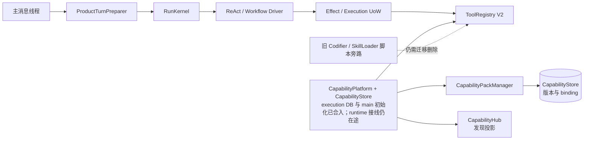

当前最重要的缺口不是再加一个 Driver，而是：

1. Capability 平台的 Store 与 main 初始化已进入 master，但 OS runtime worktree、
   UI/Godot 分支 HEAD 差异和主消息组合根脏改动尚未形成稳定绿色基线；
2. 没有长期成长的证据、评测和决策 owner；
3. Capability user scope 仍以 `"default"` 为默认，不能隔离对应人类的 generation；
4. Skill instruction、Personal Workflow 和 Capability binding 尚未形成一个闭环；
5. 旧 Codifier/Loader 仍可能绕过统一版本、评测和 ToolRegistry。

## 目标架构

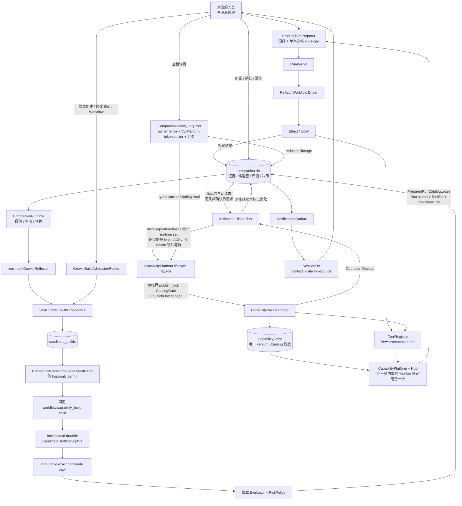

详情页的 Platform token 不是单个 user token，而是排序后的依赖 vector。authority row
永不物理删除，create/delete/recreate 都单调增加 lifecycle version；只有从未出现的 key
才是 `exists=false/version=0`。比如
`remove_override` 同时依赖“user override 已移除”和“builtin fallback 仍是原版本”，所以
两行都必须进入 vector；任一行在分页中途变化都返回 `detail_changed`。

## 四个唯一权威

| 问题 | 唯一回答者 |
|---|---|
| 为什么要改变、证据是什么、是否通过评测 | `companion.db` |
| 哪个能力版本已安装、当前 binding 是什么 | `CapabilityStore` |
| 哪些工具此刻真的可执行 | `ToolRegistry` |
| 本 Run 能发现和冻结哪些能力 | `CapabilityHub` |

## 隐式偏好什么时候变成长期偏好

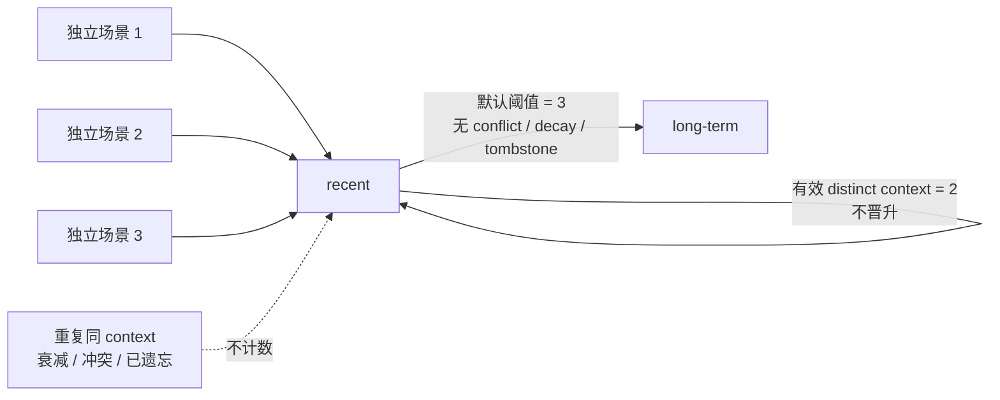

出厂配置键是
`preference_promotion_independent_context_threshold=3`（合法范围 2..10）；S-2 直接使用该
默认值，不依赖测试时临时改配置。

## 三种能力身份为什么必须分开

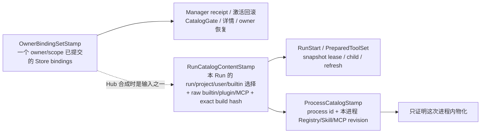

简单说：

- `OwnerBindingSetStamp` 回答“这个人的这一层 binding 已提交成什么样”；
- `RunCatalogContentStamp` 回答“这一次任务最终到底拿到了哪些能力”；
- `ProcessCatalogStamp` 回答“这份完整任务目录在当前进程里是怎么物化的”。

raw host 工具必须带真正的 `execution_build_identity`：core 来自嵌入的构建/source manifest，
plugin 来自安装包 digest，MCP 来自 adapter/server artifact 与配置 hash。只有名字和 schema
相同、但 handler 代码已变时，旧 Run 必须拒绝恢复，不能猜“应该还是同一个工具”。

## 一次冻结如何避免半旧半新

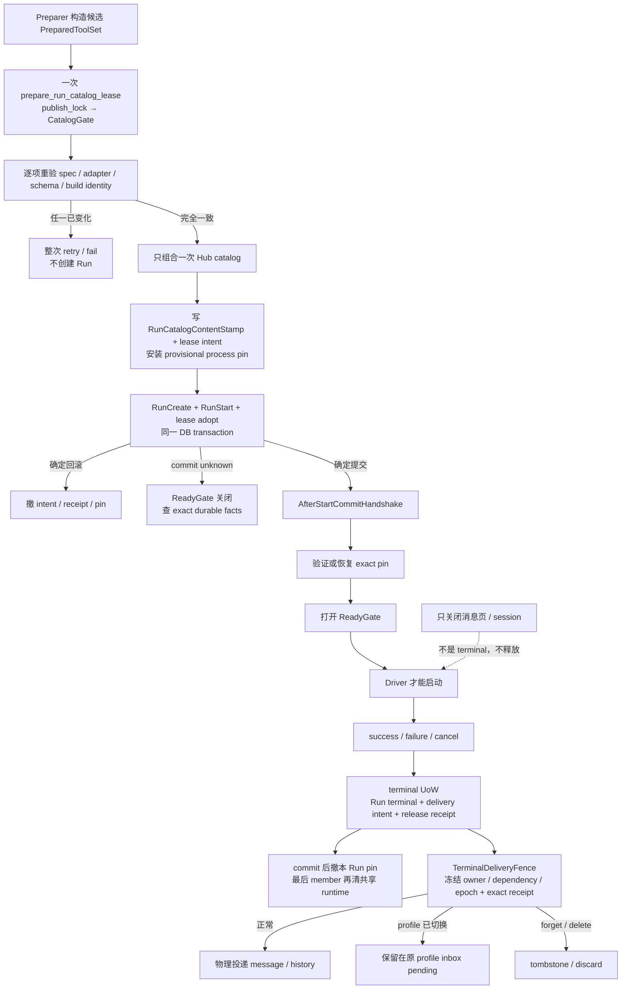

root Run、child Run 和 capability refresh 都走这一个形状。child 必须先拥有自己的 pin；
refresh 必须先在 Companion 追加 immutable `snapshot_generation`，让 execution refresh record
引用它，after-commit 绑定为 current 并打开 continuation Gate；新 snapshot ready 后才释放旧
pin。遗忘通过 all-generation root 撤销每一代，不能只查 Run 初始快照。

## 一次模型调用如何可靠落账

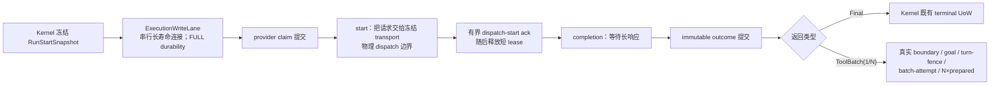

`Final` 和 `ToolBatch` 的提交图不同，不能再概括成“统一四事务”。Writer connection 复用只
减少连接开销，不合并 crash boundary，也不降低 `synchronous=FULL`。

## 一次低风险成长的流程

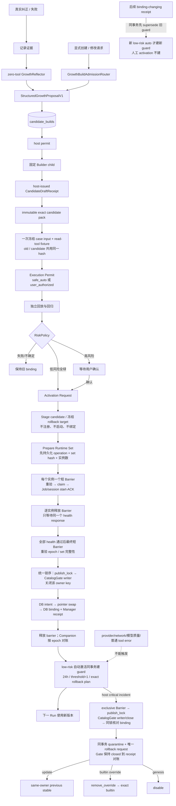

候选包在进入评测前还必须经过统一资源/路径门：流式限制文件数、大小、压缩比和路径长度；
Windows 上拒绝 drive/UNC、ADS、尾随点/空格、设备名、link/reparse 与 Unicode/大小写别名，
逐 entry 落盘前后都重验 containment。

代码/hook 评测的每个 case 也复用同一原则：

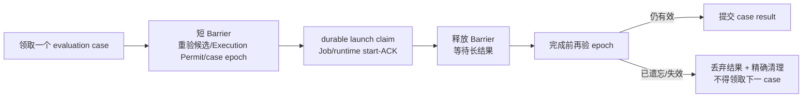

代码类候选有两次不同的确认：

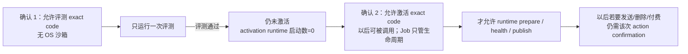

评测 launch row 直接以 `claimed` 持久化，不保留会卡死的 durable `prepared` 中间态：
claim 事务提交前崩溃就是“没有 launch、没有启动”；提交后崩溃则按唯一 claimed row 恢复。

## Skill 与 Workflow 如何保持简单

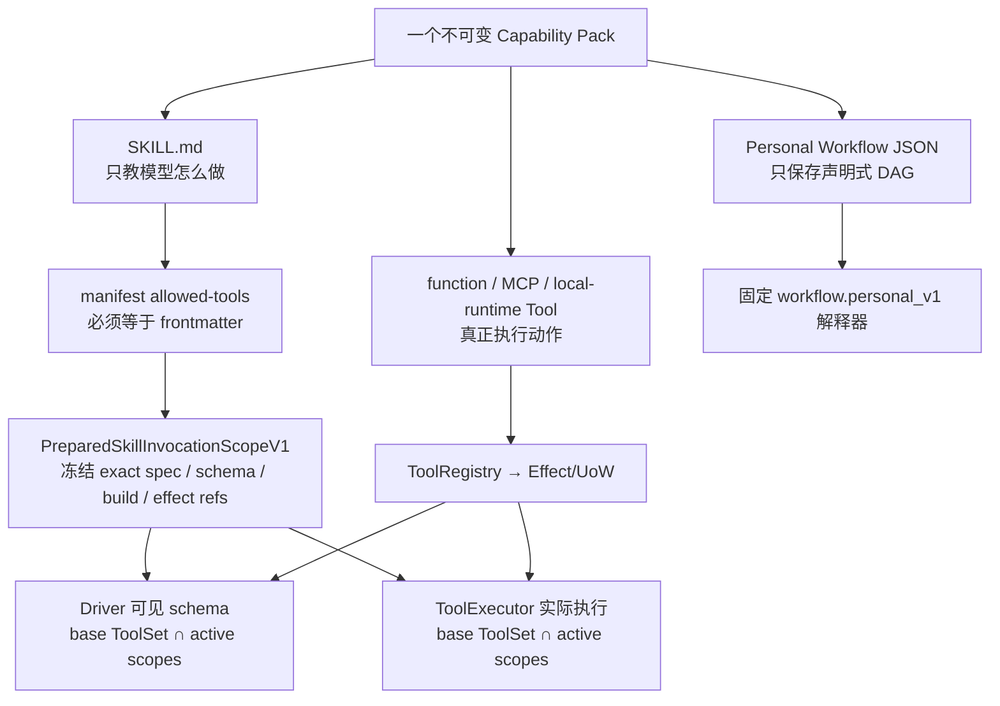

- `SKILL.md` 不再直接执行 `script.py`。
- Personal Workflow 不生成 Python，也不动态注册 Driver/Profile。
- 同一个 Skill 始终使用同一个 `pack_id`；用户看到一个 Skill，内部保存不可变版本。
- 当前 `summarize-day/recall-yesterday` 虽写了 `memory_recall`，但仓库还没有这个 handler。
  目标会新增真实 production ToolSpec：模型只传 `query/limit`，owner/session/as-of 来自 Run
  冻结范围；它走 `recall_readonly`，SQL 写入为 0，不触发旧 Retriever 的 salience/touch。
- 评测不会用 production memory：`EvaluationReadToolAdapterV1` 把同一 production spec 映射
  到 old/candidate 共用的 frozen fixture/hash，live SessionDB/Retriever 调用为 0。
- Profile 切换会切换 owner 可见的 Registry/Loader/MCP 集合；旧 Run 依靠 frozen snapshot
  和 runtime lease 完成，新 Run 只看当前 owner。
- 遗忘不等待卡住的网络调用：只在 dispatch 前后短暂检查 revocation epoch；遗忘提交后，
  迟到结果会被丢弃。
- 冷启动先读取 dormant descriptor；profile 与 quarantine 对账完成前，不注册旧 ToolSpec、
  不挂载 Skill root，也不启动 MCP/local runtime。

## Reminder V2 如何替换旧内存工具

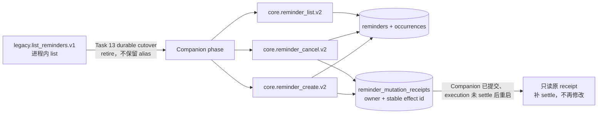

source/effect/build manifest 用 authority phase 同时验证 legacy production 与 companion test
组合；切换前 create/cancel 不可见，切换后旧 list 名不可见。create reminder id 由 owner +
stable effect id 确定，cancel 重放先查 mutation receipt，所以跨库崩溃不会重复创建、取消或
误增 schedule version。

## 任一 Companion Run 想执行外部动作时

```mermaid
flowchart LR
    FG["点击消息打开的前台主线程"] --> POL["IrreversibleEffectPolicy<br/>只信 host effect manifest"]
    BG["delegated background Run"] --> POL
    POL --> A["Host 冻结 PreparedToolSet<br/>高风险 / unknown 进入 confirm_only"]
    RE["reflection / evaluation"] -->|"高风险工具直接不可见"| ZERO["可见数 = 0"]
    A --> B["模型准备 tool call"]
    B --> C["Driver 验 snapshot<br/>强制 OR authorization index"]
    C --> C2["原 call/effect 创建 DecisionOpen"]
    C2 --> D["后台 Run 等待<br/>Companion job 释放 lease"]
    D --> E["message-panel 确认卡<br/>window-scoped action credential"]
    E -->|"拒绝 / 过期 / stale"| F["同一 call 结束<br/>真实 effect = 0"]
    E -->|"只发 decision_id + allow"| G0["ActionDecisionService<br/>owner-fence 后重建原后台 session"]
    G0 --> G["恢复原 durable boundary"]
    G --> H["execution grant<br/>一次性、精确 hash"]
    H --> I["统一短锁序<br/>RevocationBarrier → publish_lock → Gate read<br/>复验 owner / binding"]
    I --> J["claim_tool_call<br/>原子消费 grant + claim effect"]
    J --> K["begin → start → 有界 ack<br/>先持久化 handoff_state / receipt<br/>再释放短读锁"]
    K --> L["completion 等长响应<br/>返回前再验 epoch"]
    K -->|"ACK 后遗忘/撤销"| M["status=unknown<br/>started_may_complete<br/>inflight_effect_may_complete"]
    M --> R["best-effort cancel / query<br/>只写 reconciled receipt"]
    L -->|"撤销后迟到"| S["suppressed outcome hash<br/>不标成功 / 不继续"]

    X["auto_mode / 历史授权 / delegated grant"] -. "不能放行 confirm_only" .-> C2
    Y["main / code panel credential"] -. "不能提交成长卡 action" .-> E
```

关键点：确认不是“再创建一个发送任务”，而是恢复刚才暂停的同一个调用。这样重启、重复
点击或网络异常都只能落到同一个 effect receipt。只有 durable NotStarted proof 才能证明物理
dispatch 为 0；claim 后崩溃且没有该 proof 时保守按 may-complete。ACK 之后已交给外部
transport 的动作可能仍在远端完成，DeskPet 在既有 status=`unknown` 上另存
`handoff_state=started_may_complete` 与
`completion_disposition=inflight_effect_may_complete`，只阻止新的 dispatch/后续 chained
effect，丢弃迟到 completion；cancel/reconcile 只形成审计 receipt，不能假装已撤回或把原
effect 改回成功。

## Shared secret 为什么不能冒充当前窗口

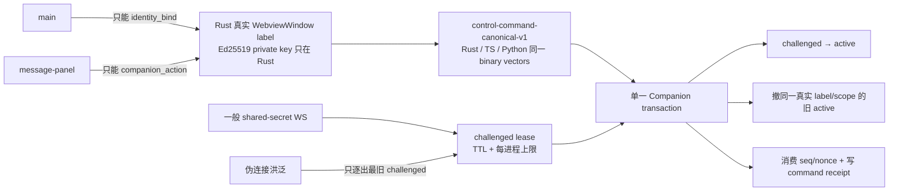

首个有效 signed command 才会 promotion；伪造 label、旧 backend key、跨 scope/连接重放都
不能占 active lease，也不能改变 IdentityReady。

## 忘记一条证据时，共享版本怎么处理

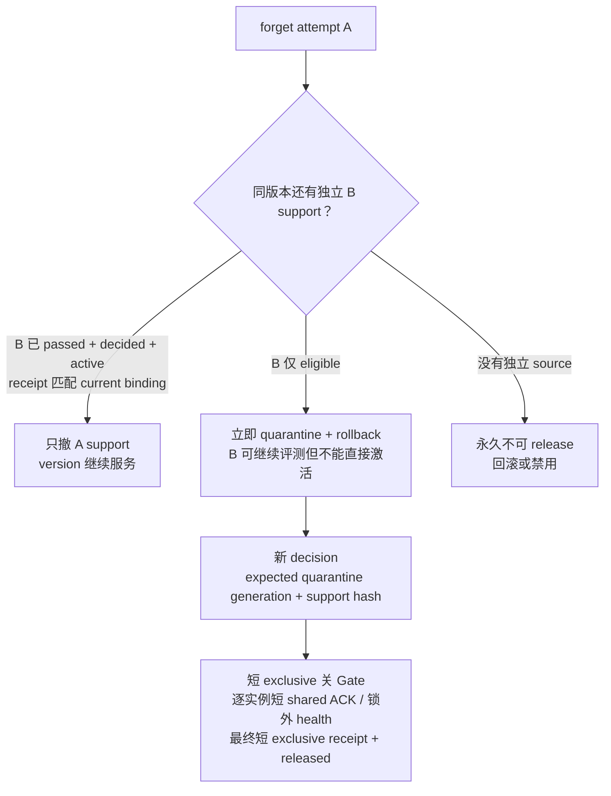

“包的 bytes 还能保留”不等于“这个版本还能服务”；只有独立、已对账的 support 才能支撑
active version。

## 真人 E2E 的启动与清理

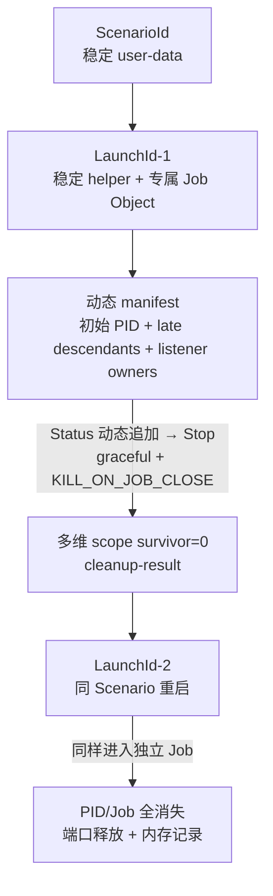

`ScenarioId` 用来验证“重启后状态仍在”，`LaunchId` 只代表一次启动。每次启动都必须有新
LaunchId；`Status` 会把 ready 后才出现的 embedder/MCP/local-runtime/WebView 等后代按
Job/PID/create-time/parent/command-line 复核后追加。`Stop` 关闭专属 Job，并按 repo、
user-data、临时配置和端口再次审计，绝不按进程名广杀。
