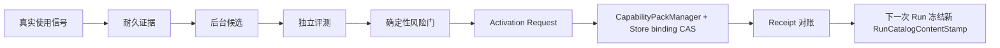
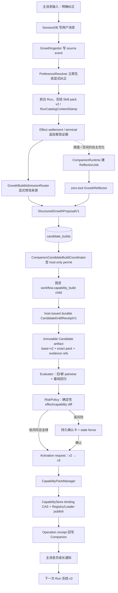

# Plan：人类锚定伴生智能体成长闭环

> 状态：独立架构复审与最终完整性审计均已 `PASS`；SP-01～SP-11 已完成；等待用户 Review  
> 日期：2026-07-24  
> 提交快照：`2f5436efe7ce92638b84332c99c7a9714904dd9a`；共享工作树仍有在途接线，执行基线须在通用 Capability 计划合并后重新锁定  
> 验收标准：[acceptance.md](./acceptance.md)  
> 架构基线：[architecture-baseline.md](./architecture-baseline.md)  
> 简化架构图：[architecture-diagram.md](./architecture-diagram.md)  
> 最佳实践：[research.md](./research.md)

## 1. 主要矛盾

决定成败的不是“模型能不能写一个 Skill”，而是：

> DeskPet 如何根据真实使用持续改变长期行为，同时保证每次改变都有可信证据、
> 独立验证、明确权限、唯一生效点、可恢复历史和一键回滚。

因此实施顺序必须是“先建事实源和运行边界，再接模型生成”：



如果先扩写当前 Codifier prompt，会继续继承按 session 的进程内证据、文件直写、
缺少 revision、主消息页不可恢复和所有候选共用一种确认策略等问题。

## 2. 已定架构决策

1. 保留 `ProductTurnPreparer → RunKernel → ReAct/Workflow Driver → Effect/UoW`
   主干，不新增成长 Driver，不把产品语义塞进 Kernel。
2. 新增产品级 `CompanionRuntime`，由 `main.py` 创建、恢复、启动和关闭；它只有一个
   有界 scheduler task。
3. `companion.db` 是成长证据、偏好、候选包、评测、成长决策、activation saga、job、
   提醒、通知和审计的权威事实源；它**不保存** installed capability version 或 active
   pointer。现有 execution DB `CapabilityStore` 是版本/binding 权威，`ToolRegistry` 是
   executable truth，`CapabilityHub` 只是 stamped 发现投影。
4. 成长信号来自消息入口/显式命令、Effect settlement/terminal、用户决策三类入口；
   内部反思与评测 Run 默认 `capture_growth=false`。
5. 后台智能任务通过 `CompanionJobRunAdapter` 复用 Kernel/Driver，但不使用聊天
   `RunPresenter`，不写聊天、不发 TTS、不调用旧 Codifier。
6. 一个 Skill/Workflow 对外保持一个逻辑 `pack_id`；内部 Capability Pack 版本不可变。
   Run 启动时冻结跨进程可复现的
   `RunCatalogContentStamp + pack/version/manifest_hash + binding_generation + exact descriptor/tool
   fingerprints`；当前进程的 Registry/Skill/MCP revision 只进入
   `ProcessCatalogStamp`，不得被当作重启后的内容身份。
   激活和回滚只经 `CapabilityPackManager` CAS `CapabilityStore` binding。
7. `SKILL.md` 只承载 instruction、`executable=false`。需要代码的 Skill 在同一 pack 中声明
   function/MCP/local-runtime tool，经 ToolRegistry/Effect/UoW 执行；删除
   `SkillLoader.invoke_script()` 旁路。第一版自建 Workflow 在 PackManifest
   `entries.workflows` 中保存声明式图，由固定 `personal_workflow@v1` 解释器执行，
   不生成 Python，不动态修改 `ProfileRegistry`。
8. 模型只能生成候选或 grader 意见；`GrowthPolicy` 根据客观证据、独立评测和
   `RiskPolicy` 决定是否创建 activation request。AC-09 高风险规则永远覆盖 AC-08。
9. 通知先写 Companion outbox，再以 epoch fence 投影到 SessionDB；历史和实时
   WebSocket 共用一个 reducer，且 `context_visibility=exclude`。
10. 测试阶段功能完成后默认开启；只保留暂停/kill-switch，不做 shadow 或分批灰度。
11. Run 级 Skill/Workflow 快照最终仍进入现有
    `DriverStart.capability_snapshot / AdmissionBoundary.capability_snapshot`；但可信输入不加进
    可由 JSON 构造的 `RunRequest`，而是由 Product/Background adapter 以独立、typed、
    host-only `PreparedRunContext` 参数传给 `KernelRunClient`，用户 `payload` 中的同名字段
    一律无效。
12. Goal 继续独占现有 association 语义。成长链只增加通用
    `TerminalDeliveryContributor`（`requires_durable + freeze_deliveries`），不把 Goal 与成长目标
    编码进一个伪“组合 target”，也不在 Kernel 内加入 Companion 分支。
13. 当前两条 `skill_invoke` 必须合并：保留 ToolRegistry V2 的
    `backend/deskpet/tools/skill_tools.py` 为唯一注册点，删除
    `SkillLoader._register_skill_invoke_tool()` 与 `invoke_script()`；调用时只解析当前 Run
    冻结 pack 的 instruction，真正代码只能作为独立 ToolSpec 调用。
14. SessionDB 从 Task 0 锁定的实际版本 `S` 升到 `S+1` 时，必须用 Python migration
    callback 事务性重建 `messages`，因为当前调研快照 v19 的 `projection_kind` 是 inline
    `CHECK`，不能用普通 `ALTER` 扩展。`S+1`、迁移序号和文件名都由 Task 0 在上游稳定后
    动态分配，不能在计划阶段硬编码 v20/012。
15. 所有新建 durable Run 在 execution DB 中把 `RunCreate + RunStartSnapshot` 原子写入；
    Snapshot 固化规范化消息、request payload、RunContext/RunSpec、能力快照、provider
    launch policy 与 terminal delivery seed。每次真实 provider 外调另有稳定
    `(run_id, invocation_id)` claim；一个 ReAct Run 可以有多次调用，atomic Workflow 若没有
    直接 provider 调用则不伪造 launch row。普通 ReAct 在首个 command boundary 前崩溃，
    也只能从这个不可变事实恢复，不能重新读取 live active pointer。
16. terminal delivery 的完整 `DeliverySpec` 必须在 Run start 时冻结；Contributor 在终态
    不再运行，Kernel 只读取 `RunStartSnapshot.frozen_terminal_deliveries`，禁止再读
    `companion.db` 或依赖新版 contributor 代码。用户可见通知
    以稳定 `profile inbox` 为逻辑目标，具体主消息 session/epoch 在投影时解析；暂时没有
    可用 session 时保留 pending，不能丢弃通知。
17. built-in Capability/Skill 全局只读；所有 user/run/project binding 额外绑定 canonical
    owner key `companion:<profile_id>:<profile_generation>`。切换 profile 时在同一 publish
    lock 下切换 ToolRegistry 可见 specs、managed Skill roots、MCP runtime 与当前
    owner runtime projection；旧 Run 依靠 durable snapshot lease 与不向 Hub 暴露的
    lease-only projection 完成。`IdentityReadyGate` 未就绪时不接收新
    Companion Turn、不 hydrate 投影、不领取后台 job。
18. 评测先过 `StaticRiskPreflight`，再运行候选。未确认的脚本候选不得启动进程；
    DeskPet brokered 外部 effect 一律使用 stub/replay；获授权代码仍可能直接访问 OS，
    不能宣称任意 Python 无副作用。随应用发布版本化 evaluation suite manifest；
    `companion.db` 是评测 job/case/result/report 权威，execution/workflow DB 只保存
    durable Run/checkpoint 并用 outbox 投递结果。
19. 新 Skill/Workflow 使用 Companion `growth_target_reservation` 保证同 owner、kind、
    stable name 同时只有一个 genesis candidate；真正创建 active capability 仍由
    CapabilityStore 的 expected-absent binding CAS 决定。现有 Python Workflow 不改代码本体，
    只由显式 `WorkflowPackAdapter` 暴露受支持的声明式可变面；未注册字段不得优化。
20. 遗忘沿 lineage 传播：pending candidate 作废，依赖该 evidence 的已激活 pack version
    先进入 Companion execution quarantine overlay，并创建 durable Manager rollback/uninstall
    request；active pointer 只能由 CapabilityStore 切换。若不存在安全 fallback 则禁用 binding。
    遗忘提交与 durable revoke/cancel/activation outbox 同事务；受影响在途 Run 在
    每次 provider launch、Skill/Workflow/effect 以及 terminal intent commit 前经过同一
    execution fence；terminal commit 已释放 snapshot lease 后，物理 delivery 改走冻结
    epoch/release receipt 的 `TerminalDeliveryFencePort`。已在飞的 provider 结果可以被收集，
    但不得再形成基于已遗忘内容的 terminal 投递、新 dispatch 或后续 chained effect；已经取得
    started ACK 并交给外部 transport 的动作只可标记
    `inflight_effect_may_complete`、best-effort cancel/reconcile，不能宣称远端必然撤回。
21. 新旧成长链通过唯一、持久化的 `GrowthAuthority` composition switch 切换：
    `legacy → preparing → companion`，完整记录 generation、migration marker/hash 与 drain
    状态；完整性故障进入 `paused`。Router/ingress gate 从 Task 1 起就在生产组合根中，
    Task 13 只执行迁移和单指针切换。半成品不接新 writer；切换完成后默认 ON，不存在双写窗口。
22. 成长评测授权与成长激活确认是独立策略域，通用 `PermissionGate.auto_mode`、历史
    TaskGrant 或普通 lifecycle tool 都不能消费。growth-managed pack 的 mutation 必须携带
    host-only governance permit，绑定 candidate/report/risk/owner/scope/expected binding
    generation。含 code/hook/local-runtime 的候选即使评测通过，仍须由用户对 exact
    package/code digest 明确确认 `persistent_local_code_no_os_sandbox` 后才允许启动 activation
    runtime/health；评测确认不能复用。通用 `capability_build/repair` 若请求可能产出
    `entries.skills/workflows`，必须在 child admission 前由 Router 建立 explicit-user
    proposal/build/reservation，再走 Companion candidate-only child；未预路由却产出这些 entry
    时 finalize 只拒绝，不能直接 publish 或事后伪造 handoff lineage；
    普通外部 pack 的显式安装仍属于通用 lifecycle，但以后若被成长系统接管，其 user binding
    立即标为 `companion_growth`。外部/不可逆动作也不接受历史或泛化 grant 绕过确认；只有绑定本次 action、target、
    canonical args hash、nonce、active binding epoch 和过期时间的一次性 confirmation
     token 才可执行。
23. 能力身份明确拆成三个互不替代的 stamp：
    - `OwnerBindingSetStamp` 只描述 canonical
      `(owner_key,scope,scope_key)` 在 CapabilityStore 已提交的完整 binding set；它不含
      raw builtin/plugin/MCP host entry，也不含某次 Run 的 run/project/user 混合选择。
      Manager receipt、CatalogGate、owner runtime rehydrate、详情 token、成长 authority
      journal、activation/rollback 只认这个 stamp。
    - `RunCatalogContentStamp` 描述一次 Run 的完整 requested `CapabilityScope`
      canonical/hash、排序后每项实际选中的 binding identity、全部 visible fallback
      envelope/hash，以及 exact pack/version/manifest、descriptor/tool/instruction/workflow/
      runtime/build hashes。Store pack 使用真实
      `binding_id/owner_key/scope/scope_key/generation`；非 Store host entry 使用由
      source/spec/content/build hash 计算的 stable binding identity。builtin/plugin/MCP
      host entry 和混合 run/project/user/builtin precedence 都必须进入它。
    - `ProcessCatalogStamp` 绑定 `process_instance_id + RunCatalogContentStamp` 与该进程的
      catalog/Registry/Skill/MCP revisions，只证明一次完整 Run catalog 的进程内物化；
      owner-only projection 只记录 `OwnerBindingSetStamp + process_projection_fingerprint`，
      不能伪造一个缺少完整 Run scope 的 `ProcessCatalogStamp`。
    新 Run 记录后两者，但恢复只以
    `RunCatalogContentStamp + snapshot_ref + exact lease entries` 为权威，并用 durable
    rehydrate receipt 映射到新进程的 `ProcessCatalogStamp`。
    `ProductVenue` 不再先制造一个无 Run 归属的普通 active lease：它先建立稳定
    pre-run lease intent，Kernel 的 `RunCreate + RunStartSnapshot` 同一 execution UoW
    transaction 才 adopt；启动对账会释放没有匹配 Run/StartSnapshot 的 prepared orphan，
    且绝不为其启动 runtime。

## 3. 典型调用链（同类改动统一照此实现）

以“用户纠正周报 Skill，系统自动生成并激活 pack v3”为例：



这条 Candidate→Evaluator→Risk→Activation saga 链只适用于 Skill/Workflow capability。
Preference 不伪装成 capability：它使用独立 evidence threshold +
`preference state_version` CAS + audited transition；Reminder occurrence 也使用自己的
lease/settle 状态机。三者共同复用 owner fence、outbox、审计和恢复原则，但不能为了“统一”
而要求 Preference/Reminder 跑不适用的 capability 评测。

## 4. 外部方案取舍

| 实践 | 本项目采用方式 | 不照搬的部分 |
|---|---|---|
| OpenClaw proposal/live 隔离、target hash、受限 reviewer | candidate 绑定 base pack/binding/hash；后台模型没有 apply 权限 | 不要求所有低风险改动都人工 apply |
| Hermes memory/Skill 分层、后台 review 共用 agent 能力 | 偏好、程序、执行事实分层；后台仍复用 Kernel/Driver | 不允许模型直接 patch live Skill |
| Transactional outbox / saga | execution → companion、companion → Capability manager/SessionDB 均至少一次投递 + receipt reconcile | 不用跨 SQLite 文件伪事务 |
| 不可变 version + active binding | 复用 CapabilityStore；新 Run 冻结具体 pack/version/catalog | 不在 Companion 再造 active alias，也不做生产流量灰度 |
| Eval-driven development | 历史样本、目标样本、确定性检查、独立 grader、人工校准 | 不接入即将退役的外部 Evals 平台 |

详细来源与适配分析见 [research.md](./research.md)。

## 5. 文件影响总览

### 5.1 新增后端模块

| 文件 | 职责 |
|---|---|
| `backend/deskpet/companion/__init__.py` | 对外只导出稳定 contracts/runtime façade |
| `backend/deskpet/companion/contracts.py` | GrowthEvent、CandidatePackArtifact、Evaluation、ActivationRequest/Receipt、Job、Notification、Decision 等不可变协议 |
| `backend/deskpet/companion/schema.py` | `companion.db` schema 初始化、版本与完整性校验 |
| `backend/deskpet/companion/store.py` | `companion.db` 唯一写入口、事务、CAS、lease、outbox、审计 |
| `backend/deskpet/companion/migrations/001_companion_v1.sql` | 新库首版 schema、索引、约束 |
| `backend/deskpet/companion/identity.py` | 本地/Relay profile identity、绑定、切换、删除 |
| `backend/deskpet/companion/signals.py` | 多源 GrowthEvent 规范化、稳定 ID、重试关联、来源过滤 |
| `backend/deskpet/companion/preferences.py` | 近期/长期偏好、权威顺序、衰减、冲突、晋升与重算 |
| `backend/deskpet/companion/runtime.py` | 单 scheduler、job lease/recovery、idle/quiet/budget gate、shutdown |
| `backend/deskpet/companion/run_adapter.py` | `CompanionJobRunAdapter` 与隔离 result/capability policy |
| `backend/deskpet/companion/growth.py` | EvidenceCluster、反思候选 schema、abstain、任务编排 |
| `backend/deskpet/companion/evaluation.py` | Skill/Workflow replay、pairwise、确定性回归、报告冻结 |
| `backend/deskpet/companion/evaluation_execution.py` | 逐 case 的 owner/candidate revocation fence、durable launch claim、Job/runtime start-ACK 与精确 abort |
| `backend/deskpet/companion/risk.py` | 确定性 effect topology、权限与数据流风险分类 |
| `backend/deskpet/companion/activation.py` | growth governance permit、activation/rollback saga、Manager receipt 校验与启动 reconcile |
| `backend/deskpet/companion/skills.py` | growth target ↔ Capability Pack adapter、managed instruction view；不拥有 active |
| `backend/deskpet/companion/workflows.py` | 现有 Workflow 的 Pack adapter、受支持可变面与 snapshot overlay |
| `backend/deskpet/companion/personal_workflow.py` | 声明式图 schema、封闭 node catalog、可信 selection ref |
| `backend/deskpet/companion/eval_suites/manifest.json` | 随发布版安装的版本化 Skill/Workflow 评测套件索引 |
| `backend/deskpet/companion/reminders.py` | reminder schedule、occurrence、授权 grant、草稿准备 |
| `backend/deskpet/companion/notifications.py` | notification/digest outbox → SessionDB/WS 投影 |
| `backend/deskpet/companion/detail_query.py` | owner-fenced、分页、脱敏的 evidence/diff/audit 详情查询；前端不直读 DB/archive |

### 5.2 主要现有文件

| 文件 | 本次改动 |
|---|---|
| `backend/config.py`、`config.toml` | 新增 `[companion.growth]` typed config；完成能力默认 ON |
| `backend/context.py` | 注册 Companion façade，不暴露内部 Store 到任意模块 |
| `backend/main.py` | profile 控制消息、多源入口、组合根、启停顺序、历史 hydration、移除旧 Codifier 生产接线 |
| `backend/deskpet/agent/turn_preparer.py` | 读取冻结 Preference + CapabilityHub snapshot；产生可信 Workflow ref |
| `backend/deskpet/agent/run_presenter.py` | 移除同步 `codify_skill` 收尾副作用 |
| `backend/deskpet/harness/drivers/react.py` | 在既有 Effect settlement 事务中给 `tool.outcome` 加最小 receipt/verified/audit ref；不从 feedback 缓冲生成权威证据 |
| `backend/agent/harness_feedback.py` | 迁移期仅保留旧 AgentLoop 观察；新 GrowthEvent 不以它为 writer |
| `backend/deskpet/harness/contracts.py`、`kernel.py`、`projector.py` | typed host-only context、`RunStartSnapshot`、通用 terminal delivery contributor |
| `backend/deskpet/workflows/store/schema.py`、`execution_uow.py` | 原子保存/读取 immutable Run start、provider launch claim 与 delivery seed |
| `backend/deskpet/execution/dispatch.py`、`provider_invocations.py` | 产品无关的 prepare/start-ack/completion 协议，以及 provider invocation 唯一协调器 |
| `backend/deskpet/harness/drivers/react.py`、`harness/context.py`、`tools/capabilities.py` | 把冻结 catalog/growth snapshot ref 从 DriverStart 贯通到 ToolExecutionContext、boundary 与恢复 |
| `backend/deskpet/harness/bootstrap.py`、`adapters/product_composition.py` | 注入 Growth delivery contributor/sink，不加入产品分支 |
| `backend/deskpet/harness/adapters/product_profiles.py`、`subagent_registry.py` | 注册固定 personal profile，并从父 Run 的可信 snapshot 构造 child payload |
| `backend/deskpet/tools/orchestration_controls.py` | 保持 `workflow_spawn` 用户参数封闭，不让模型提交 owner/version/graph |
| `backend/deskpet/workflows/definitions/v1/__init__.py`、`adapters/personal_runtime.py` | 注册固定 `personal_workflow@v1` 解释器 |
| `backend/deskpet/workflows/evaluation/runner.py` | 依赖幂等 `EvaluationStorePort` 与 typed `EvaluationCaseExecutorPort`，支持 open-or-resume/stable case IDs；生产 Companion 禁止 raw execute callback |
| `backend/deskpet/capabilities/contracts.py`、`store.py`、`hub.py` | 增加 owner-generation binding 约束与 scope 过滤；保持 Store/Hub 原有权威 |
| `backend/deskpet/capabilities/manifest.py` | 窄扩展 `entries.workflows`；候选包仍走同一校验/hash |
| `backend/deskpet/capabilities/platform.py`、`manager.py`、`publisher.py` | Platform 为 install/update/rollback 暴露 operation-scoped runtime-set static prepare/逐实例 start-ACK/锁外 health/final activate façade，为 uninstall/disable 暴露先撤可见 binding、锁外精确 retire；内部接受 host-only growth governance permit 并返回可对账 receipt，不读取成长证据 |
| `backend/deskpet/tools/registry.py`、`deskpet/mcp/manager.py`、`capabilities/local_runtime.py`、`tool_proxy.py` | ToolSpec 注册 adapter-specific dispatch；MCP transport、local worker 与 function handler 均显式拆成 prepare/start-ack/completion |
| `backend/deskpet/skills/loader.py`、`skill_matcher.py` | managed pack instruction root、owner-aware view、hash-aware matcher；删除直接脚本执行 |
| `backend/deskpet/tools/skill_tools.py` | 统一唯一 `skill_invoke`，按当前 Run snapshot 返回/挂载 instruction |
| `backend/agent/agent_loop.py` | compaction remount 改按冻结 pack ref，不再按当前名字重新读 live Skill |
| `backend/deskpet/agent/assembler/components/preference_profile.py` | 改读 `PreferenceResolver` |
| `backend/deskpet/memory/facts.py` | `preference` 抽取只写 evidence，不再直接成为偏好权威 |
| `backend/deskpet/memory/session_db.py`、`memory/migrator.py` | 通用 projection event、`companion_event`、exclude、epoch fence |
| `backend/deskpet/memory/companion_message_projection.py` | 事务性重建 messages、索引和 FTS 的 `S→S+1` callback |
| `backend/deskpet/memory/migrations/<NEXT_MEMORY_MIGRATION>_companion_projection.sql` | Task 0 动态分配的 callback marker，不直接用 SQL 改 inline CHECK |
| `backend/tools/reminder.py` | 删除进程内事实源，保留到新服务的兼容 façade 后再移除 |
| `backend/deskpet/companion/reminder_tools.py` | V2 reminder ToolSpec 的唯一 dormant 注册模块；Task 13 才在生产组合根切换 |
| `tauri-app/src/types/messages.ts` | typed `companion_event` 与 decision fence |
| `tauri-app/src/code-panel/controlWs.ts` | 当前主消息页真实 control WS live/history 分发入口；不新增 Code 专属业务 UI |
| `tauri-app/src/stores/sessionsStore.ts` | monotonic、幂等 Companion reducer |
| `tauri-app/src/message-panel/MessagePanelRoot.tsx` | 主消息页显式映射 CompanionCard |
| `tauri-app/src/components/MessageStreamPanel.tsx` | 增加 `companion_card` 展示类型 |
| `tauri-app/src/components/companion/CompanionCard.tsx`、`CompanionDetailModal.tsx` | 通知、分页详情、摘要、确认、回滚、遗忘入口 |
| `tauri-app/src/App.tsx`、`auth/companionIdentityBridge.ts` | login/restore/logout 时同步稳定 `User.id` profile binding |

### 5.3 已核实的生产代码断点

| 断点 | 当前事实 | 本计划处理 |
|---|---|---|
| Effect 证据 | `ReActDriver.signal()` 已在 `settle_effect()` 同一事务持久化 `tool.outcome`；之后 `prepare_external_tool_feedback()` 才投影到进程内 recorder | 扩充持久 event 的最小 audit metadata，Growth sink 消费 RunEvent；不新增 recorder writer |
| Capability authority | master 已有 Store/Manager/Publisher/Hub；active worktree 正在整合 schema/runtime/UI | 本计划先等上游合并，只扩展 owner、workflow entry 与 governance；绝不复制版本/binding |
| Skill invoke | `tools/skill_tools.py::_handle()` 调 `invoke_script()`；`SkillLoader._register_skill_invoke_tool()` 调 `execute()` | 删除 Loader 注册和脚本旁路；V2 handler 只消费 frozen instruction，代码能力走独立 ToolSpec |
| Run snapshot | `DriverStart` 和 admission 已有 `capability_snapshot`，但普通 durable ReAct 在首个 boundary 前没有可恢复的启动事实 | Product adapter 传 typed host-only context；execution UoW 原子保存通用 `RunStartSnapshot`，恢复不依赖首个 boundary |
| SessionDB | 调研快照当前 v19，`projection_kind` 是 inline CHECK；执行时版本可能变化 | Task 0 锁定 `S` 后用 `S→S+1` callback 重建 `messages`；不能用普通 ALTER、硬编码 v20/012，或把成长权威塞入 SessionDB |
| Codifier | 主线程 `RunPresenter → _offer_skill_candidate` 是活路径；Voice 私有 codifier 没有生产调用 | 新闭环切换后删除主线程旧路；Voice 死路径直接移除并加 absence test |
| UI | `skill_candidate_proposed` 只在 Code WS 分支有专门渲染，主消息页无可靠历史卡 | 新 typed CompanionEvent 走主消息 history/live 共用 reducer |

### 5.4 `companion.db` 可执行数据契约

所有 owner-domain 表都带 `profile_id + profile_generation`，二者共同作为每个 PK/FK/
UNIQUE 的分区前缀；下表为可读性省略重复出现的 generation，但实现 DDL 不得省略。
这保证同一个稳定 profile id 删除后以新 generation 重建时，旧证据/通知/候选不能被
新生命周期读到。仅 `profiles/profile_bindings/profile_control_leases/profile_control_commands/
growth_authority_state/growth_authority_journal` 是明确的身份或产品级控制平面例外。所有 JSON 入库前
canonicalize，所有状态列有数据库 `CHECK`，所有更新时间由 Store 的同一 clock 生成。
`companion.db` 禁止出现 installed capability version、active binding 或 ToolSpec 副本。
DDL 至少包含：

| 表 | 主键 / 唯一约束 | 必需字段与数据库约束 |
|---|---|---|
| `profiles` | `PK(profile_id,generation)`；同 identity 同时最多一条 active | `status active/deleted`、`generation >= 1`；只存 namespaced hash，不存 Relay 原始标识 |
| `profile_bindings` | `PK(device_scope)` | current profile/generation、`binding_epoch`、`status unready/ready`；只保存身份选择，不复用为 WebView 连接状态；重启后必须由新的 `main/identity_bind` trusted sync 才 ready |
| `profile_control_leases` | `PK(device_scope,connection_id)`；partial `UNIQUE(device_scope,window_label,scope) WHERE status='active'` | `requested_window_label/requested_scope` 只是未受信连接自报值；真实 `window_label main/message-panel`、`scope identity_bind/companion_action` 只能由 Rust 签名提升后写入。每条连接有独立 `control_epoch/challenge_hash/last_seq`、backend process instance、issued/expires/revoked time，`status challenged/active/revoked/expired`。一般 shared-secret WS 只能创建 `challenged` row，不参与 active unique、不撤旧 lease、不改变 IdentityReady；收到并消费有效的真实 label/scope credential 时，才在同一事务把该 row 提升为 active 并撤销同一真实 label/scope 的旧 active lease。challenged rows 有 TTL 与每进程硬上限，超限只删除最旧 challenged row，绝不碰 active row。label/scope CHECK 固定 main→identity_bind、message-panel→companion_action |
| `profile_control_commands` | `PK(device_scope,connection_id,request_seq)`；`UNIQUE(backend_process_instance_id,connection_id,credential_nonce_hash)` | privileged command kind、`canonical_schema='control-command-canonical-v1'`、canonical request hash、binding epoch、`status claimed/completed/failed/unknown`、result ref/hash；首次有效 credential 的 lease promote、旧 active revoke、`last_seq→request_seq=last_seq+1` CAS 与 command insert 在同一 Companion transaction。重复同 hash 只返回原 receipt，异 hash/跳序拒绝；跨 execution DB 的 action 由 claimed row 幂等恢复，不重复发 effect |
| `growth_events` | `PK(profile_id,event_id)`；`UNIQUE(profile_id,source_kind,source_ref)` | `event_hash`、`source_kind`、`context_key`、`root_run_id`、`retry_of`、`content_state live/tombstoned`；同 ID 异 hash 冲突 |
| `preferences` | `PK(profile_id,preference_key)` | recent/long-term value、authority、`state_version`、有效期；显式与推断来源分栏 |
| `preference_evidence` | `PK(profile_id,preference_key,event_id)` | composite FK 指向 preference 与 growth event；权重、独立 context key |
| `growth_targets` | `PK(profile_id,target_id)`；`UNIQUE(profile_id,kind,stable_name)` | `kind skill/workflow`、canonical `pack_id`、`governance_domain=companion_growth`；只映射成长身份，不存 active version |
| `growth_target_reservations` | `PK(profile_id,kind,stable_name)`；`UNIQUE(profile_id,target_id)` | deterministic target/pack id、candidate id、reservation version、`status held/released/consumed`、expiry/reason；同名同时只有一个 held |
| `candidate_packages` | `PK(profile_id,package_id)`；`UNIQUE(profile_id,candidate_content_hash)`；`UNIQUE(profile_id,candidate_package_hash)` | immutable content-addressed **hash metadata**：candidate mode、pack id/version、`candidate_content_hash`、`candidate_manifest_hash`、`candidate_package_hash`、canonical archive hash、source/target package facts、effect topology 与治理域；另有单调 `content_state live/redacted` 与 blob cleanup state，redacted 后只保留 hashes/audit，任何 reader 不得返回 bytes |
| `candidate_package_files` | `PK(profile_id,package_id,relative_path)` | canonical manifest 中的 file kind/mode、content hash/size 与 blob ref，行本身不保存正文；Skill instruction/tool/resources 或 Workflow graph 的 hash metadata 在 package freeze 事务一次写入；禁止绝对路径、`..`、symlink，包总大小受限 |
| `candidate_package_blobs` | `PK(profile_id,package_id,blob_kind,blob_id)` | manifest/archive/逐文件 bytes 与 exact hash/size；`cleanup_state live/pending/deleted/cleanup_required`，pending 起所有受管 reader 即禁止读取，最后引用清理后移除 live payload/managed roots 并保留 hash-only deletion receipt；`deleted` 只表示应用受管可达内容已删除，不承诺 SQLite WAL/freelist、备份或底层介质的 forensic secure erase |
| `candidate_package_sources` | `PK(profile_id,package_id,candidate_id)`；FK attempt/package/build | 每个 attempt 的 evidence set/hash、builder launch/child、trusted `CandidateDraftReceiptV1` ref/hash、`provenance_state live/forgotten`；同一 package 的每次独立证据 lineage 都必须有自己的 exact build receipt，不能只因 bytes 相同就继承别的 attempt 的证据 |
| `candidate_artifacts` | `PK(profile_id,candidate_id)`；`UNIQUE(profile_id,candidate_attempt_key)`；`UNIQUE(profile_id,proposal_source_kind,proposal_source_ref)` | 这是 governed candidate **attempt**，不是 bytes 唯一表；FK package id，`proposal_source_kind reflection/explicit_user_build`、nullable reflection job、stable source ref/hash、candidate mode、source/target binding fences、`evidence_set_hash`、reservation version、attempt generation、`status proposed/preflight_failed/awaiting_eval_authorization/evaluating/eligible/awaiting_activation_confirmation/activation_pending/activating/active/activation_failed/rejected/stale/invalidated/expired/quarantined/rollback_pending/rolled_back/disabled`。attempt key 覆盖 target/source fences + evidence set + package id + reservation version；同 source 重放返回同 candidate，新 evidence 可创建新 attempt 并复用同 package |
| `candidate_evidence` | `PK(profile_id,candidate_id,event_id)` | composite FK；至少一个未 tombstone 的客观 evidence 才可进入评测 |
| `reflection_decisions` | `PK(profile_id,job_id,decision_id)` | `decision candidate/abstain/insufficient/stale/noop`、reason code、输入 evidence set hash；“不处理”也可审计 |
| `candidate_builds` | `PK(profile_id,build_id)`；`UNIQUE(profile_id,source_kind,source_ref)`；`UNIQUE(profile_id,builder_launch_id)` | `source_kind reflection/explicit_user_build`、nullable reflection job、稳定 user request/evidence ref、immutable structured proposal ref/hash、evidence set/hash、candidate mode、exact source/target binding fences、host-only build permit ref/hash、fixed profile、deterministic builder launch/child run ids、expected child start hash、draft receipt refs+hashes、`status proposed/launch_pending/child_precreated/running/handoff_pending/built/failed/inconclusive/cancelled/stale`、lease/epoch/attempt/last_error；同 source 重放只恢复同一 build，任何目标/evidence/proposal 漂移以 `stale(reason=stale_fence)` 终结并 fail closed |
| `evaluation_runs` | `PK(profile_id,evaluation_id)`；`UNIQUE(profile_id,candidate_id,suite_hash,attempt_key)` | candidate-mode-discriminated `baseline_kind source_pack/capability_absent_v1`、old/candidate snapshot hash、nullable exact source pack/binding fence、nullable absent baseline ref/hash、suite/runner/provider/model、`execution_permit_ref/hash`、`status queued/running/passed/failed/inconclusive`、lease/epoch；CHECK：update=同 owner source pack，builtin_override=builtin source pack，genesis=expected-absent baseline，三者不可混用 |
| `evaluation_case_inputs` | `PK(profile_id,evaluation_id,input_id)`；`UNIQUE(profile_id,evaluation_id,case_id)` | `source_kind packaged_suite/historical_replay`；packaged suite 保存随包 resource ref/hash；historical replay 保存稳定 source event refs、canonical sanitized input envelope blob/hash、adapter id/version/build fingerprint。两类都保存 assertion ref/hash、版本化 read-tool fixture blob/root hash、`evaluation_tool_adapter_map`（production ToolSpec/schema/build/effect ref → exact evaluation adapter id/version/build fingerprint/fixture ref+hash）、`content_state live/redacted` 与 cleanup receipt；不得在重启时重读 SessionDB、live Retriever、当前 adapter 或 mutable evidence 重建 |
| `evaluation_cases` | `PK(profile_id,evaluation_id,case_id,variant)` | `variant old/candidate`，两 variant 必须引用同一 `input_id/input_hash`；old 对 update/builtin_override 是 source pack，对 genesis 是 canonical `capability_absent_v1`；manifest case/version、blind label、expected kind、`status queued/leased/cleanup_required/committed/failed/inconclusive`、lease owner/epoch/expiry、attempt/next retry；状态单调，stolen lease 不能 settle，cleanup_required 前不得增加 launch attempt。input redacted/漂移时当前 launch abort、case 单调转 inconclusive |
| `evaluation_case_launches` | `PK(profile_id,evaluation_id,case_id,variant,attempt_ordinal)`；`UNIQUE(profile_id,launch_id)` | exact candidate package/manifest/archive/suite hash、`permit_mode/ref/hash`、owner/generation、case lease epoch、revocation epoch、typed adapter/version/fingerprint、`status claimed/started/completed/failed/not_started/unknown/aborting/aborted/cleanup_required`、start outcome/ack time、Job/runtime/session identity、outcome ref/hash、cleanup receipt/survivor count；生产事务直接插入 `claimed`，不存在可持久 `prepared`；permit 必须与 evaluation row 相同，同 attempt 异 hash 冲突，invalidated candidate/evaluation/permit 不得 claim 下一次 launch |
| `evaluation_results` | `PK(profile_id,evaluation_id,case_id,variant)` | deterministic assertions、judge result、usage、result hash；重复写须同 hash |
| `evaluation_reports` | `PK(profile_id,report_id)`；`UNIQUE(profile_id,evaluation_id)` | candidate package/dataset/suite hash、verdict、reason、完整性计数；只有 `passed` 可供 activation |
| `risk_assessments` | `PK(profile_id,risk_id)`；`UNIQUE(profile_id,candidate_id,candidate_package_hash)` | static preflight、effect topology diff、`risk low/medium/high/unknown`；unknown fail closed；不得用 version seed 的 content hash 代替受评包 hash |
| `evaluation_authorizations` | `PK(profile_id,authorization_id)`；`UNIQUE(profile_id,nonce)` | candidate/package/suite/runner-policy hash、expiry、consumed_at、actor、`risk_ack=no_os_sandbox`；这是代码/hook/unknown 的用户确认事实：只允许在本机执行一次 exact code package 评测，不授权激活或 DeskPet brokered external effect，也不冒充低风险自动 permit；必须明示 Job Object 只管生命周期，不能阻止代码直接访问 OS 文件/网络/凭据 |
| `evaluation_execution_permits` | `PK(profile_id,permit_id)`；`UNIQUE(profile_id,evaluation_id)` | `mode safe_auto/user_authorized`、candidate id + final package/manifest/archive hashes、suite/runner-policy hash、owner/generation、issued revocation epoch、static preflight/risk ref+hash、nullable authorization ref、`status issued/claimed/revoked/expired`、permit hash；CHECK：safe_auto Skill 必须是 declarative instruction，manifest/frontmatter 的 frozen `allowed-tools` 已被 Task 7 解析为 exact ToolSpec refs，全部为 read_only/idempotent 且相对 source topology 不扩张；生产读结果不承诺 output-deterministic，评测可复现性由 frozen EvaluationReadToolAdapter/fixture 单独保证。safe_auto personal_workflow-v1 必须由固定 node catalog 计算出无 external/irreversible/unknown dataflow。正文引用未声明工具、allowed-tools 漂移或任何 unknown 均不能签 safe_auto。user_authorized 必须指向已消费且完全匹配的 authorization；两类都不能授权激活/真实 effect |
| `growth_decisions` | `PK(profile_id,decision_id)`；`UNIQUE(profile_id,nonce)` | candidate/report/risk、candidate mode、source binding fence、target owner/scope/expected-absent/generation fence、`decision activate/reject/rollback/stale`、actor、reason、nullable exact `activation_package_hash/activation_code_digest`、`activation_risk_ack none/persistent_local_code_no_os_sandbox`；executable code/hook/local-runtime candidate 的 activate 必须 actor=user 且两个 digest 完整匹配，明确确认“激活后代码可持续被调用，Job 仅管理生命周期、不提供 OS 沙箱”；评测授权 nonce 不能复用，也不能充当此确认 |
| `capability_activation_requests` | `PK(profile_id,activation_request_id)`；`UNIQUE(profile_id,request_fingerprint)`；partial `UNIQUE(profile_id,profile_generation,target_owner_key,target_scope,target_scope_key,pack_id) WHERE status IN ('pending','claimed','staging','staged','publishing','unknown','cleanup_required')` | nullable candidate id（install/update 必填；rollback/uninstall/disable 用 cause/target ref）、candidate mode、action `install/update/rollback/uninstall/disable`、nullable `rollback_kind same_owner_version/remove_override`、`activation_mode normal/quarantine_release`、exact target pack/version/candidate package/manifest/archive/code digest、完整 source binding fence 与 target owner/scope/scope_key/expected-absent/generation fence、decision refs/risk ack、manager idempotency key、nullable trusted `manager_operation_id/runtime_set_ref/runtime_set_hash`、nullable expected quarantine generation/support-set hash、`status pending/claimed/staging/staged/publishing/succeeded/failed/cancelled/stale/unknown/cleanup_required`、lease/epoch/attempt；action-discriminated CHECK：install/update 必须 candidate+passed report/risk/decision；若候选含 code/hook/local-runtime，decision 必须是完全匹配 exact package/code digest 的用户 `persistent_local_code_no_os_sandbox` activation confirmation，只有 evaluation authorization 时 request 不得创建；builtin_override 还必须 source=builtin 且 target=user/absent；same_owner rollback 必须 quarantine 或显式用户 decision、current binding 与已安装 target；remove_override 必须精确 current user override + fallback builtin source，并按 fallback manifest 冻结 runtime set：instruction-only 才是 canonical empty set，含 executable entries 必须完整 prepare/ACK/health；任何 removal 若会露出 lower-precedence visible fallback，都必须规范化为带 exact source fence/runtime-set 的 fallback rollback（builtin 用 remove_override，其他 precedence 使用对应 typed fallback action，首版未实现则拒绝）；uninstall/disable 只允许 Platform 证明最终 capability-absent/disabled 且无 visible executable fallback，才可无 target runtime set；quarantine_release 只允许另一独立 support 已 passed 且有新 activation decision，必须精确匹配 active quarantine generation 与 support-set hash。request fingerprint 覆盖 action/activation mode/rollback kind/candidate mode/target/source binding/cause/owner/package/code digest/risk ack/quarantine fence；operation id 与完整 runtime-set ref/hash 在 inactive/static prepare 返回后、任何 runtime instance start 前持久化。partial unique 是跨 action target reservation：unknown/cleanup 未收敛前不得释放 |
| `capability_activation_receipts` | `PK(profile_id,activation_request_id)`；`UNIQUE(manager_operation_id)` | trusted operation id、action/candidate mode、pack/version/manifest、source fence hash、runtime set hash、result hash、settled_at；action-discriminated fields：install/update/same-owner rollback 保存 target owner/scope/binding generation、result `OwnerBindingSetStamp` 与 process projection fingerprint；remove_override 必须同时保存移除后的 `target_user_owner_binding_set_stamp`，以及 exact `fallback_owner_key/scope/scope_key/binding_id/binding_generation/pack/version/manifest/fallback_owner_binding_set_stamp/fallback_process_projection_fingerprint/fallback_runtime_set_ref/hash`；uninstall/disable 保存 capability-absent/disabled proof 且 fallback fields 为空。重复 receipt 必须同 hash；Companion settle 对 remove_override 逐字段验证 user 与 fallback 两边及 ready runtime set，不能用一个 owner stamp 证明跨 precedence 结果；这里不得存某次 Run 才能定义的 `RunCatalogContentStamp/ProcessCatalogStamp` |
| `capability_activation_guards` | `PK(profile_id,guard_id)`；`UNIQUE(profile_id,activation_request_id)`；partial `UNIQUE(profile_id,profile_generation,target_owner_key,target_scope,target_scope_key,pack_id) WHERE status IN ('open','rollback_pending')` | 只为 low-risk auto activation 建立；exact candidate/pack/version/manifest、settled activation receipt、target binding generation/owner stamp、opened/expires time、`policy_id=companion_guard_v1`、policy hash、固定 window=`24h`、threshold=`1`、预先冻结的 rollback action/rollback kind/source-or-absence fence、nullable trigger incident/request/receipt、`status open/rollback_pending/rolled_back/expired/superseded`。guard 与 activation receipt 在同一 Companion settle 事务创建；任何后续成功 binding-changing receipt 必须先按 expected old binding 在同事务 supersede 旧 open guard（guard 自身 rollback receipt 则转 rolled_back），再仅为 low-risk auto 新 binding 插 guard；人工激活不创建。窗口关闭与 binding supersede 都单调，不得 reopen |
| `capability_guard_incidents` | `PK(profile_id,guard_id,incident_id)`；`UNIQUE(profile_id,source_authority,source_event_id)` | 只接受 host typed receipt，包含 exact guard/binding/pack/runtime generation、`failure_class package_integrity/runtime_contract/schema_fingerprint/effect_policy_fingerprint`、severity=`critical`、normalized failure fingerprint、source receipt ref/hash、observed_at、dedupe hash、`status accepted/rejected/triggered`。明确排除 provider/network/credential/用户取消、模型输出质量、自评或普通 tool error；同 source 重放同 hash 幂等、异 hash conflict |
| `capability_version_supports` | `PK(profile_id,pack_id,version,manifest_hash,candidate_id)` | independent evidence-set/hash、trusted build receipt、passed report、activation decision、nullable reconciled activation receipt、`support_state eligible/active/forgotten/invalidated`、support hash；相同 bytes/version 不继承另一 attempt 的 support |
| `capability_quarantines` | `PK(profile_id,pack_id,version,manifest_hash)` | reason/evidence ref、单调 `fence_generation`、current `support_set_hash`、nullable release request/receipt、`status active/rollback_pending/release_pending/released/disabled`；`release_pending` 仍按 quarantined 执行，只有 expected generation/support-set 与 fenced Manager receipt 全部匹配才可转 released。这是立即执行 overlay，不是第二个 active pointer |
| `jobs` | `PK(profile_id,job_id)`；`UNIQUE(profile_id,kind,dedupe_key)` | `status queued/leased/succeeded/failed/cancelled/expired`、owner/epoch/lease、attempt、budget reservation/actual |
| `delegated_task_grants` | `PK(profile_id,profile_generation,grant_id)` | 只保存 proactive delegated task 的 read/draft/reversible-local scope、target、expiry、revoked/version；明确禁止 external/irreversible effect。单次 action confirmation 的消费权威不在 CompanionStore，而是现有 execution `execution_grants + execution_effects/attempts`：grant 绑定 decision/call/effect/tool/args/capability/scope/expiry，授权消费与 stable effect claim 同一 UoW；`running/unknown` 与 receipt 决定恢复，claimed/unknown 无 receipt 且外部不支持幂等时 fail closed |
| `companion_run_bindings` | `PK(profile_id,run_id)` | request/root/job、current growth snapshot generation/ref/hash、all-generations root hash、start fingerprint、`status prepared/active/revoked/terminal`；用于 lineage/fence，不在 terminal 时决定 delivery target |
| `companion_detail_versions` | `PK(profile_id,profile_generation)` | 单调 `detail_version >= 1`、`detail_hash`、updated_at；所有详情可见写（evidence/preference/candidate/file/report/risk/decision/request/receipt/quarantine/lineage/notification/audit）与 forget/profile delete 必须在同一 Companion 事务 CAS `+1`，不能靠时间戳或进程内 counter |
| `companion_settings` | `PK(profile_id,key)` | typed value、version；pause/quiet/timezone/digest |
| `companion_budget_windows` | `PK(profile_id,window_kind,window_start)` | reserved/actual token、time、job count；结算不能小于 0 |
| `reminders` | `PK(profile_id,reminder_id)` | timezone-aware schedule、status、schedule_version、quiet policy |
| `reminder_occurrences` | `PK(profile_id,occurrence_id)`；`UNIQUE(profile_id,reminder_id,due_at)` | claim/lease、`status pending/leased/delivered/cancelled/expired` |
| `reminder_mutation_receipts` | `PK(profile_id,profile_generation,effect_id)`；`UNIQUE(profile_id,profile_generation,operation_kind,request_hash,effect_id)` | `operation_kind create/cancel`、canonical args/request hash、deterministic reminder id、before/after schedule version、result payload ref/hash、created_at；create reminder id=`hash("reminder_v2",profile_id,generation,effect_id)`。handler 在一个 Companion transaction 内 insert-or-verify receipt + reminder insert/CAS + occurrence/outbox；同 effect+hash 重放直接返回 receipt，异 hash conflict，cancel 重放先查 receipt而不是用已过期 expected version 再改一次 |
| `notifications` | `PK(profile_id,notification_id)` | 稳定 profile-inbox target、kind、source refs、seq、payload hash、redaction version、`status pending/projected/superseded/redacted`；forget 同事务把受影响 summary/actions 替换成固定无敏感 tombstone、bump detail token，并写 stable projection-redaction outbox |
| `outbox` | `PK(profile_id,outbox_id)`；`UNIQUE(profile_id,event_kind,event_id,sink_kind)` | claim/epoch/lease/attempt、payload hash、`status pending/claimed/delivered/dead_letter` |
| `audit_events` | `PK(profile_id,audit_id)` | actor、action、reason、before/after hash、lineage ref；不得保存遗忘正文或 secret |
| `lineage_edges` | `PK(profile_id,from_kind,from_id,to_kind,to_id,relation)` | evidence → candidate → report → decision → activation request/receipt → pack version 的可遍历边 |
| `run_growth_snapshots` | `PK(profile_id,snapshot_id)`；`UNIQUE(profile_id,run_id,snapshot_generation)`；partial `UNIQUE(profile_id,request_id) WHERE snapshot_generation=0` | immutable owner/request/run snapshot hash、`snapshot_generation>=0`、nullable prior snapshot ref/hash、`status prepared/bound/revoked/terminal`、created_at；同时覆盖 preference 与 capability dependencies。每次 content-changing capability refresh 都追加一代，不能覆盖初始快照 |
| `run_growth_dependency_items` | `PK(profile_id,snapshot_id,dependency_kind,dependency_id)` | kind=`preference/capability_pack/personal_workflow`、pack/version/manifest/binding generation/`RunCatalogContentStamp`/content/effect hash；恢复时不得重新查 live binding；`ProcessCatalogStamp` 只在 execution start/rehydrate receipt 中做本进程映射 |
| `run_growth_dependency_evidence` | `PK(profile_id,snapshot_id,dependency_kind,dependency_id,event_id)` | 可反查 evidence/preference/pack version → snapshot → in-flight run，遗忘不依赖 JSON 扫描 |
| `growth_authority_state` | singleton `PK(authority_key)` 且只允许 `authority_key='growth'` | `phase legacy/preparing/companion/paused`、generation、migration version/hash、`cutover_operation_id`、`roll_forward_required` marker、drain started/completed、prepared/switched time、last error；状态是 Router 启动恢复的唯一事实源 |
| `growth_authority_journal` | `PK(authority_key,generation,event_seq)` | from/to phase、cutover operation、marker/hash、old/new binding generation、old/new `OwnerBindingSetStamp`、子步骤 phase/hash、drain state、reason、created_at；只追加，不覆盖历史 |

`candidate_artifacts` 的三种 candidate mode CHECK 固定为：

```text
(candidate_mode='genesis'
 AND source_owner_key IS NULL
 AND source_version IS NULL
 AND source_manifest_hash IS NULL
 AND target_expected_absent=1
 AND reservation_version IS NOT NULL
 AND target_expected_binding_generation=0)
OR
(candidate_mode='update'
 AND source_owner_key=target_owner_key
 AND source_scope=target_scope
 AND source_scope_key=target_scope_key
 AND source_version IS NOT NULL
 AND source_manifest_hash IS NOT NULL
 AND source_binding_generation=target_expected_binding_generation
 AND target_expected_absent=0
 AND reservation_version IS NULL
 AND target_expected_binding_generation>=1)
OR
(candidate_mode='builtin_override'
 AND source_owner_key='builtin'
 AND source_scope='builtin'
 AND source_version IS NOT NULL
 AND source_manifest_hash IS NOT NULL
 AND source_binding_generation>=1
 AND target_owner_key LIKE 'companion:%'
 AND target_scope='user'
 AND target_expected_absent=1
 AND target_expected_binding_generation=0
 AND reservation_version IS NULL)
```

`builtin_override` 不是 genesis：它的评测 old snapshot、diff 与 version core 来自 exact
builtin source binding；也不是普通 update：最终 CAS 创建的是当前 profile 的 user target
binding。source 与 target 两个 fence 缺一不可。

Companion 内部只能执行以下状态转换：

```text
proposed → preflight_failed
        → evaluating                         静态预检确认 instruction/声明式图无代码/hook
        → awaiting_eval_authorization → evaluating  code/hook/unknown 仅在授权后
        → evaluating → eligible → activation_pending
                     ↘ awaiting_activation_confirmation → activation_pending/rejected/stale
activation_pending → activating → active/activation_failed
                               ↘ activation_pending（仅可重试错误）
active → rollback_pending/quarantined
rollback_pending → rolled_back/disabled
任意非终态 → invalidated/expired/stale
```

Low-risk 自动激活的 guard 状态机独立于 candidate 状态：

```text
activation receipt settle → guard open(expires=settled_at+24h, policy=companion_guard_v1)
open → expired                         时钟越过固定窗口，未收到合格 incident
open → superseded                      exact binding 已被另一已确认 operation 替换
open → rollback_pending                首个 host-attributed critical incident；同事务 quarantine +
                                       创建唯一 rollback/remove_override/disable request
rollback_pending → rolled_back         exact Manager receipt 对账完成
```

`open→rollback_pending` 的唯一入口是 `record_capability_guard_incident()`：它先核对 trusted
source receipt、policy hash、exact pack/version/manifest/binding generation、窗口未过期且
current binding 未变，再以稳定 incident id insert-or-verify；同一事务 CAS guard、写
quarantine/fence，并用
`request_fingerprint=hash("guard_v1",guard_id,incident_id,rollback_plan_hash)` 创建或返回同一
mutation request。update 冻结 same-owner 前一 stable version；builtin_override 冻结
`remove_override` + exact builtin fallback；genesis 冻结 `disable` + capability-absent proof。
进程崩溃只能恢复同一 guard/incident/request；`unknown/cleanup_required` request 继续占用 target
reservation，不得重复触发。provider/network/credential/用户取消、模型质量/自评或普通 tool
错误没有资格调用该 API。

Evaluation case/launch 的数据库状态图固定为：

```text
case: queued → leased → committed|failed|inconclusive
                    ↘ cleanup_required → inconclusive   仅 survivor=0 receipt 后
expired leased → leased(new epoch,recovery_only)        不自动增加 attempt

launch: claimed → not_started
                → started → completed|failed|unknown|aborting
                → unknown → aborting|cleanup_required
       started|unknown → aborting → aborted|cleanup_required
       cleanup_required → aborting → aborted
```

`completed/failed/not_started/aborted` 是 launch terminal；只有 `not_started + survivor=0`
允许同 case 按 retry policy 新 attempt。曾 `started/unknown` 的 launch 即使随后 aborted，也使
case 终结 inconclusive，不能在同 evaluation 再启动。DDL CHECK/trigger 与 Store transition
tests 必须逐边覆盖。launch row 与物理 attempt claim 在同一个 Companion transaction 直接
插入 `claimed`：commit 前崩溃时 DB 无 launch、StartPort 调用数=0，新 lease epoch 可用同一
deterministic launch id/ordinal 重试；commit 后崩溃必见 `claimed` 并进入 recovery_only。
若没有 durable NotStarted receipt，recovery 必须把孤立 `claimed` 单调提升为 `unknown`，
精确 cleanup 后把 case 终结 inconclusive，不能猜成未启动再跑。

“允许本机运行 exact code 评测”和“允许激活候选”是两个独立 fence。前者 token 只绑定
candidate package、suite/runner policy、nonce、expiry 与明确
`no_os_sandbox` 风险确认，消费后最多进入 `evaluating`；DeskPet brokered effects 必须 stub，
但任意 Python 仍可能直接访问本机 OS，不能承诺绝对无副作用。即使评测通过也不能代替
activation confirmation。后者另绑 evaluation report/risk/owner/scope/
expected binding generation 与 exact candidate package/code digest；只要候选含
code/hook/local-runtime，就必须再次确认
`persistent_local_code_no_os_sandbox`：“激活会让此代码以后可被调用，Job 仅管理生命周期，
不提供 OS 沙箱”。只有评测授权时，activation runtime prepare/health 的进程启动数必须为 0。
这份 activation confirmation 也只允许安装/启用该 exact code，不替代以后每一次由 DeskPet
broker 发起的外部/不可逆 effect action confirmation。通用 Auto 不能消费其中任何一种。

激活不是跨库单事务，而是可恢复 saga：

1. Companion 事务校验最终 candidate package/manifest/archive hashes、未 tombstone
   evidence、evaluation=`passed`、
   risk/confirmation 与 expected binding generation，写 decision、activation request、
   audit、lineage 和 outbox。
2. Dispatcher 领取 request，构造不可由 JSON/LLM 生成的
   `CapabilityMutationAuthorization(governance_domain="companion_growth", permit_ref/hash)`，
   并调用 `CapabilityPlatform` 的 typed lifecycle façade。install/update 用稳定 idempotency
   key 把 exact candidate archive 交给 inactive `stage_candidate()`；rollback 调
   `prepare_installed_static()` 冻结目标已安装版本；二者都只能生成/读取 immutable
   target/environment 与 operation id，不注册、不启动、不切 binding。trusted operation id
   必须先写回 Companion request。
3. install/update/rollback 共用同一 runtime-set 协议：Dispatcher 在 barrier 外调用零启动的
   `prepare_runtime_set()`，按最终 target manifest 冻结所有 function/MCP/local-runtime
   entry 的确定性 instance 清单、argv/env/session/health operation，得到 exact
   `PreparedRuntimeSet`；完整 set ref/hash 与 expected instance count 必须在任何 instance
   start 前写回 request。随后**每个 instance**分别取得一个短共享
   `RevocationBarrier`，重验 owner/quarantine/evidence（rollback 重验 cause/target）/
   binding generation/set hash/revocation epoch，签发 host-only
   `RuntimeLaunchAuthorization`，并调用 `start_prepared_runtime_instance()`：
   Platform 先 durable claim 该 runtime instance/Job/session scope，再等待有界
   `RuntimePrepareStartedAck|RuntimePrepareNotStarted|RuntimePrepareStartUnknown`。只有 ACK 或
   已确定未启动/已受管 unknown 后才释放该 lease；释放后只等待同一 instance 已启动 operation
   的长 health completion，不能再创建进程、连接或新的 health request。任一 instance
   失败/unknown 则不启动下一 instance，并在锁外精确 abort 整个 set；只有 expected count
   完整、每行 ACK 与 health 均为 `health_passed`，才再次取得短 lease、重验同一 epoch/set
   hash，再调用 façade `activate_prepared_set()`。空 runtime set 也有 canonical set hash 与
   `expected_count=0` receipt，不能靠缺行猜测“无需 runtime”。Manager 在同一个 publish lock 和
   `CapabilityCatalogGate` writer 内沿用现有三段可恢复发布 saga，而不是伪装成跨
   Registry/SQLite 的单事务：
   `publish_intent DB commit → Registry/managed roots/runtime swap →
   binding + Manager receipt DB commit`。每段都写 operation phase/hash；Registry 切换后、
   binding 前崩溃只能 reconcile 前滚或完整回滚，绝不能返回成功。
   runtime 的**启动 handoff** 必须在第一次短 lease 内完成，长 health response 必须在其外
   等待；最终 activation 临界区禁止网络、进程生命周期和用户代码，并有硬 deadline。
   growth-managed binding 拒绝普通 lifecycle tool 或 `policy:auto` 的 general authorization。
4. uninstall/disable 不准备或启动 target runtime：在短 barrier 内重验 request 后，通过相同
   gate/publish-intent/binding receipt saga 先撤下新 snapshot 可见性与 binding；锁内不得
   stop/join 进程。释放后按 receipt 冻结的旧 operation-scoped runtime set 精确 retire/abort；
   普通 uninstall 尊重既有 frozen lease，forget/quarantine disable 则由 execution fence
   立即禁止新动作并精确终止受影响 set。清理未完成记 `cleanup_required`，catalog 不伪报可调用。
5. Manager receipt 提交后立即释放 barrier。Companion 再校验 receipt 的
   pack/version/manifest/scope/owner/binding generation、publish revocation epoch；普通 action
   校验 committed `OwnerBindingSetStamp` 与本进程 owner projection receipt，remove_override
   则同时校验移除后的 user stamp 与 exact fallback binding/builtin stamp/process projection/
   runtime-set receipt，以 request version CAS 单事务写 receipt、candidate
   terminal state、notification outbox；若 barrier 释放后发生 forget/switch，settle
   不得标 active，而是写 `quarantined/rollback_pending` 并请求幂等 rollback。
6. 启动时必须在开放 ingress 前 reconcile
   `claimed/staging/staged/publishing/unknown` request：查询 façade/Manager operation、
   CapabilityStore binding、publish intent 与 registry stamp；成功则补 settle，明确未执行则
   重试，歧义或 hash 漂移 fail closed。

`growth_authority_state` 只允许：

```text
legacy → preparing → companion
preparing → legacy     仅限 roll_forward_required marker 尚未提交，且外部可见事实未变
preparing(marker=1) → preparing/companion/paused  只能按 journal 前滚或暂停
companion → paused     完整性/恢复失败
paused → companion     修复并通过 preflight 后
```

marker 提交后禁止回到 `legacy`；最终不含 legacy writer 的 binary 若无法恢复，只能保持
`paused` 并继续普通聊天。每次转换与 journal/outbox 在一个 CompanionStore 事务提交。

### 5.5 execution DB 的通用启动契约

这部分属于 Harness，不带 Companion 产品字段。当前提交快照 `2f5436ef` 的 workflow
schema 是 v12、Capability 子 schema 是 v1；共享脏工作区仍在修改 Manager/Platform/
Store/execution UoW/Harness/main 等同一组合根，不能把本轮数字当成实施时稳定 `N/C`。已有
`execution_provider_turn_fences / action_batches / action_calls / attempt_records /
profile_launch_tickets`，它们描述的是“provider 已返回后的 assistant/tool batch 接纳”和
“child profile 启动”，不是物理模型网络请求账本；本计划必须扩展并关联它们，不能复制或
改名冒充已有权威：

| 表 | 约束 | 关键字段 |
|---|---|---|
| `execution_run_start_snapshots` | `PK/FK(run_id)`；插入后 trigger 禁止 UPDATE/DELETE | `snapshot_schema_version`、`start_fingerprint`、canonical messages、session cursor、prepared/tool refs、sanitized request payload、RunContext/RunSpec、capability snapshot/hash、provider launch policy snapshot、canonical frozen `DeliverySpec` set/hash、created_at |
| `execution_provider_invocations` | `PK(run_id,invocation_id)`；每个物理 transport dispatch 只允许一行 | provider/model/adapter/policy snapshot、request hash、idempotency group/attempt ordinal、`status claimed/completed/failed/unknown`、claim owner/epoch/time、revocation epoch、dispatch-start ack/time、stream epoch、durable outcome ref/hash；新生产行直接从 `claimed` 开始，状态只能单调前进；旧 `prepared` 只允许 migration 识别并 fail closed，不是可领取状态 |
| `execution_provider_invocation_outcomes` | `PK/FK(run_id,invocation_id)`；插入后 immutable | canonical final response：content/reasoning/tool calls/stop reason/usage/provider metadata、payload hash；足以无网络重放 AgentLoop 结果 |
| `execution_run_fences` | `PK(run_id,fence_kind,fence_version)`；相同来源幂等 | `status active/revoked/cancelled`、reason、source ref、created_at；用于恢复时 fail closed，不包含 Companion 正文 |
| 既有 `execution_effects / execution_effect_attempts` v2 扩展 | status CHECK 继续只用既有 `prepared/running/succeeded/failed/accepted/unknown/cancelled/late_reconciled`，绝不把 disposition 冒充 status；effect/attempt 同一事务 CAS | 新增 `handoff_state unresolved/not_started/started/started_may_complete/reconciled`、`completion_disposition normal/confirmed_not_started/inflight_effect_may_complete/reconciled_not_completed/reconciled_completed_suppressed`、handoff ack/unknown receipt ref+hash+time、cancel receipt ref+hash、reconcile receipt ref+hash、late outcome hash。允许组合固定为：新 claim=`running/unresolved/normal`；StartedAck=`running/started/normal`；NotStarted 或 start 前取消=`cancelled/not_started/confirmed_not_started`；StartUnknown、unresolved crash 或 ACK 后 revoke=`unknown/started_may_complete/inflight_effect_may_complete`；正常确定终态=`succeeded|failed|accepted/reconciled/normal`；late reconcile=`late_reconciled/reconciled/reconciled_not_completed|reconciled_completed_suppressed`。attempt 行必须在同一 UoW 使用相同 status/handoff/disposition。旧 prepared 单调迁为 cancelled/not_started，旧 running/unknown 保守迁为 unknown/started_may_complete，已 terminal 行迁为 reconciled；DDL CHECK/trigger 拒绝其他笛卡尔组合 |

规则：

1. `create_with_start_snapshot()` 在同一 SQLite 事务插入 `execution_runs`、immutable start row 和
   初始 association event；幂等重试必须逐字段验证同一 start fingerprint 与 frozen
   delivery set。只有路径确实马上进行 provider 外调时，才为该次 invocation 准备 row。
2. `atomic_start` Driver 把现有 driver-specific start/checkpoint 与通用 start row 放入同一
   caller-owned 事务；`start_workflow()` 同样接收并保存通用 start，但没有直接 provider
   外调时不创建虚假的 provider row。普通 durable ReAct 必须先提交通用 start，再允许 launch。
3. **每一次** provider 外调都从稳定的
   run/continuation/iteration/provider/fallback/retry 身份派生 `invocation_id`。Coordinator
   可以先在 host memory 构造 `PreparedProviderDispatch`，但不得持久化 `prepared`。
   它先取得产品无关 execution fence 的短 lease，再打开**一个** execution UoW，直接
   insert-or-verify 完整 immutable dispatch facts 为 `claimed`，同时冻结当前 revocation
   epoch；commit 确定成功后才允许 transport start。claim commit 前崩溃必须是 row=0、
   dispatch=0，可用同一 deterministic id 重试；commit 后崩溃必见 `claimed`，无 durable
   outcome 只能转 `unknown` 并 fail closed，绝不能猜成未发送或再次领取。`completed` 复用
   既有 outcome。下一轮模型调用必须使用新的
   invocation row，不能以 `UNIQUE(run_id)` 把整个 Run 错当一次外调。
   `failed` 仅用于 adapter/transport 能证明请求**尚未离开进程**，或 provider 返回了可验证的
   确定性终态拒绝；连接中断、stream 半途失败、超时且无法证明未送达等歧义一律记
   `unknown`，不得用 `failed` 伪装成可安全重试。
   `claim_prepared()` 的唯一写事务同时冻结当前 revocation epoch；它不在 DB writer 内等待
   CompanionStore、CatalogGate 或网络，外层已取得的短 lease 只被 UoW 同步验证。真实
   transport seam 必须提供有界
   `dispatch_started` acknowledgment：含义是请求已经交给底层 transport，而不是等首字节
   response；若 SDK 无法在短超时内提供该 seam，durable mode 对该 provider fail closed。
   ack 是决定何时释放 barrier 的**运行时握手**，不是额外 fsync：成功 ack/time 随
   completed outcome 提交，超时/异常随 unknown/failed 提交；若进程在中间退出，恢复只看到
   已 durable 的 `claimed`，仍按 unknown fail closed。
4. 现有 `AdmissionBoundary.phase` 继续只拥有“用户批准后是否启动该 Run”的状态；
   `execution_provider_invocations` 只拥有物理 provider dispatch 状态，两者不能共用一个
   `claimed` 字段。现有 `execution_provider_turn_fences` 继续拥有 provider 返回后
   assistant/tool batch 的单次接纳，并增加不可变 `source_invocation_id` 引用 completed
   invocation；没有 completed outcome 时不得创建/接纳 turn fence。由于真实
   AgentLoop/ReActDriver 分层先完成 provider invocation、后接受 assistant/tool batch，
   outcome commit 与 turn-fence/batch acceptance 明确是相邻但独立的两个事务，不能伪装成
   组合 UoW。
5. recovery 优先读最新 Driver boundary；若不存在则读 immutable start 重建
   `DriverStart`。新 durable run 缺 start row 是完整性错误；历史 run 只有在已有合法
   boundary/checkpoint 时走兼容恢复，否则 fenced failed。
6. terminal 时不再调用 contributor；Kernel 直接读取 start row 的 frozen
   `DeliverySpec`，再与既有 Goal association event 推导的 delivery 合并。同一 terminal
   event 的完整集合必须在首次提交与任何重放中完全相等。这里必须分两阶段：
   - terminal UoW **创建 delivery rows 前**取得普通 `RunExecutionFencePort` lease，要求
     current snapshot lease 仍 bound，并把 owner/generation、revocation epoch、dependency/
     snapshot hash 与 `delivery_fence_epoch` 冻结进 terminal/delivery rows；同一 UoW 随后才把
     Run terminal、lease release receipt 与 delivery intents 一起提交；
   - commit 后物理 sink 不再要求 snapshot lease active，而调用专门的
     `TerminalDeliveryFencePort.authorize(frozen_delivery,release_receipt)`：它验证 exact
     terminal/release receipt 与 frozen epoch/dependency hash，并读取后续 owner
     delete/forget/quarantine/revocation。仍有效则允许，forget/delete 已推进则只
     tombstone/discard；不能因正常 terminal 已释放 lease 而拒绝所有 delivery。
   已 revoke 的 Run 只结算无正文的 cancelled/tombstone receipt。
7. `RunExecutionFencePort` 是 Kernel/执行器的产品无关注入端口。带 Companion snapshot 的
    Run 在每次 provider launch、Skill/Workflow/effect 与 terminal intent commit 前取得
    短租约；Companion 实现的 `acquire()` 必须在同一 shared barrier 内**同步读取**
    CompanionStore 的 authoritative quarantine/run revoke state，并校验 frozen dependency
    对应 owner 仍 active、durable snapshot lease 仍有效、exact frozen version 未
    quarantine/disabled/revoked，确认未撤销后才发 lease；普通 update 后 active pointer/
    binding generation 改变本身不拒绝旧 Run。只有 Task 6 confirm-only action 的独立 scope
    lease 还要比较 current binding epoch/normalized target；不能只查尚未
    异步投递的 execution 副本。遗忘命令持有排他 barrier，提交 quarantine overlay 与
    rollback/revoke/cancel outbox 后再释放，因此遗忘提交之后没有新动作可越过。
    `TerminalDeliveryFencePort` 是 commit 后专用门，不重新要求 lease bound：profile switch
    若发生在 terminal commit 前，普通 fence 使旧 Run cancelled；若发生在 terminal/outbox
    commit 后，已冻结到原 profile inbox 的 delivery 保持 pending，不能改投当前账号，也不能
    因原 profile 暂时 inactive 永久 discard，待该 profile 再 active/有 route 时继续。
    owner generation 删除或 forget/quarantine 在 commit 后推进时才 tombstone/discard。
   dispatcher 把 outbox 幂等投到 `execution_run_fences`，它只是崩溃恢复副本；启动时先
   reconcile/drain revoke outbox，再开放 ingress。Companion DB/fence 不可读时相关 Run
   fail closed；非 Companion Run 使用明确 no-op 实现。
8. `ProviderInvocationCoordinator` 位于真实网络调用前，而不在只能看到事后 emission 的
   ReActDriver 中。`AgentLoopCollaborator` 把 execution UoW/fence/run identity 注入
   `AgentLoop`；AgentLoop 及 provider shim 在每个 iteration、provider-chain slot、
   streaming/non-stream fallback 和真实 retry dispatch 前先在 host memory
   `prepare_attempt()`，再在短 fence lease 内调用单事务
   `claim_prepared()`；claim commit 确定成功后才 `start_and_ack()`，响应/异常后调用
   `complete()` 或 `mark_unknown()`。每个物理请求
    有独立 invocation row，并可用 `idempotency_group_id` 关联同一 provider 支持的幂等重试；
   只有 provider snapshot 明确支持幂等时才允许从失败的 stream 继续非 stream/fallback，
   否则 ambiguous dispatch 立即 `unknown`/fail closed。
9. provider 返回最终响应后，Coordinator 必须在一个 execution UoW 事务内先插入 immutable
    `ProviderInvocationOutcome` 并把 invocation 转为 `completed`，提交成功后 AgentLoop 才能向
   ReActDriver emit control/final；禁止先 emit/boundary 后补 complete。recovery 遇到相同
    request hash 的 `completed` invocation，直接从 outcome 重放，不再联网；`claimed` 且没有
   outcome 一律 unknown/fail closed。stream 中途失败没有 canonical final outcome，仍是
   unknown；已向 UI 发出的 delta 不是可恢复 outcome。
   durable streaming 的 delta 必须携带 `run_id/invocation_id/stream_epoch/provisional=true`；
   前端只放进内存 provisional buffer，绝不写 SessionDB。`completed` outcome commit 后，
   canonical control/final event 原子替换该 buffer；`failed/unknown/cancelled` 或重连先清空
   对应/all provisional buffer，再 hydrate durable history，因此不会残留“幽灵半截回复”。
10. coordinated durable Run 的 retry/fallback 只有一个 owner：
    `ProviderInvocationCoordinator`。OpenAI/Anthropic/Gemini SDK transport 自动 retry 全部
    禁用或显式配置为 0；AgentLoop、`tool_use_shim` 与 `LLMRegistry` 在 coordinated mode
    不再各自套隐藏 retry loop，而把 provider/fallback/retry ordinal 交回 Coordinator。
    每一次进入 adapter 的物理 HTTP dispatch 恰好对应一个 invocation row；若某 SDK 无法
    关闭或 hook 每次 transport attempt，该 provider 在 durable mode fail closed，不能谎报
    “已持久化一次调用”。
11. 外部 effect 的“已 claim”不能冒充“未发送”，也不能把
    `inflight_effect_may_complete` 塞进既有 status CHECK。`claim_tool_call()` 创建 attempt 时
    `handoff_state=unresolved/completion_disposition=normal`；物理 adapter 返回
    `DispatchNotStarted` 时，`mark_effect_dispatch_not_started()` 在同一 effect/attempt UoW
    保存 receipt 并转
    `status=cancelled/handoff_state=not_started/completion_disposition=confirmed_not_started`；
    这是该 call/effect 的 terminal，`claim_tool_call()` 重放只返回原结果而不再领取；用户确实
    重试时必须由新 call id 派生新 effect id。返回 `DispatchStartedAck` 时，
    调用方必须仍持短 execution fence，把
    `mark_effect_dispatch_started(effect_id,attempt_no,expected_effect_version,ack_ref/hash)`
    确定提交后才释放 fence；返回 `DispatchStartUnknown` 或 ack 后发生 revocation/forget 时，
    `mark_effect_inflight_may_complete()` 单调写
    `status=unknown/handoff_state=started_may_complete/
    completion_disposition=inflight_effect_may_complete`，保留原 ack 或 unknown-start receipt。
    claim 后进程退出、只有 unresolved row 而没有 durable NotStarted proof，也必须保守走同一
    may-complete 状态，绝不能重发。
    `settle_effect(succeeded|failed|accepted)` 只允许从
    `status=running/handoff_state=started/disposition=normal` 且当前 Run fence仍有效，effect
    与 attempt 在同一 UoW 转为相同 terminal status + `reconciled/normal`；success 之外也不能
    从 unresolved 或 may-complete 猜终态。revocation 后到达的 completion 只能调用
    `suppress_late_effect_completion(late_outcome_hash)`，不得写 succeeded、正文 terminal 或
    chained effect。best-effort cancel/query 的 host receipt 由
    `reconcile_effect_handoff()` 单调转为
    `status=late_reconciled/handoff_state=reconciled`，disposition 只能是
    `reconciled_not_completed|reconciled_completed_suppressed`；后者只供审计，不把原
    Run/tool call 改回成功。相同 receipt/hash 幂等、异 hash conflict，任何恢复都按 exact
    effect/attempt identity 继续，不以 status=unknown 猜成未 handoff。

### 5.6 现有 CapabilityStore 的窄扩展契约

这部分必须在通用 Capability 计划合并后的真实 schema 上追加迁移，不能与 active worktree
并行抢版本号：

| 对象 | 必需扩展 | 约束 |
|---|---|---|
| `CapabilityScope` / `capability_bindings` | 增加不可空 `owner_key`；builtin 固定 `builtin`，run/project/user 使用 `companion:<profile_id>:<generation>` | 唯一键变为 `(owner_key,scope,scope_key,pack_id)`；所有查询在 SQL 层过滤 owner |
| binding governance | `management_policy general/companion_growth`、policy generation | growth-managed binding 的 update/rollback/uninstall 必须携带 host-only typed authorization；通用 tool/Auto 无法构造 |
| PackManifest | 新增可选 `entries.workflows`，每项引用合规 graph file、interpreter id/version、graph hash | 文件进入 manifest hash；不能声明 Python callable、shell 或自定义确认器 |
| `OwnerBindingSetStamp` | canonical `(owner_key,scope,scope_key)` 下 CapabilityStore 已提交 binding rows 的排序内容哈希，含 pack/version/manifest、binding id/generation、management policy/generation 与 immutable descriptor/runtime refs | 持久化、跨进程可复算；Manager receipt、CatalogGate、owner runtime activation、activation/rollback、详情 token 与 authority journal 只认它；不含 raw host entry 或某次 Run 的跨 scope 选择 |
| `RunCatalogContentStamp` | 完整 requested `CapabilityScope` canonical/hash、混合 run/project/user/builtin precedence 下排序后的 selected binding identity、visible fallback envelope/hash，以及 pack 或 host projection 的 exact descriptor/tool/instruction/workflow/runtime/build hashes | 持久化、跨进程可复算；RunStart、PreparedToolSet、snapshot ref/lease、refresh/child/legacy recovery 与 Run growth dependency 只认它 |
| `ProcessCatalogStamp` | `process_instance_id`、对应 `RunCatalogContentStamp`、本进程 catalog/Registry/Skill/MCP revisions 与 fingerprint | 只做一份完整 Run catalog 的进程内稳定性检查；重启后必须通过 rehydrate receipt 映射到新 stamp，禁止要求旧 revision 重现；owner-only projection 不生成它 |
| Manager receipt | operation/action、pack/version/manifest、scope/scope_key/owner、binding generation、management policy/generation、`OwnerBindingSetStamp`、当前 `process_projection_fingerprint`/registry fingerprints | Companion 只有 immutable 目标与 durable owner stamp 完整匹配 receipt 才能标 active；不得塞入依赖具体 Run scope 的 catalog stamp |
| Capability descriptor / Skill projection | descriptor 增加 hashed `instruction_refs`/`workflow_refs`；同时含 instruction+tool 的包用 `kind=pack`；managed roots 由 Store binding 驱动，裸 Loader source 带 provenance | 同一 pack/version 不得同时以 Store 和 `"default"` user source 出现；Hub 一个 descriptor 同时说明“会什么”和“如何执行” |
| snapshot lease intent | durable `(snapshot_ref,run_id)` intent 保存 request/start fingerprint 与 `RunCatalogContentStamp`，状态 `prepared/bound/released/conflict`；lease entries FK 到 intent | ProductVenue 可先 prepare，但 Kernel 必须在 `RunCreate+RunStartSnapshot` 同一 DB transaction adopt；无匹配 Run 的 prepared orphan 只释放、不 rehydrate |
| runtime leases | exact lease entries 持久化 binding stamp、pack/version/manifest/binding generation、descriptor/tool/runtime fingerprints；进程内 retired spec pin 只是镜像 | profile 切换或激活新版本不破坏在途 Run；进程重启先做 hidden lease-only rehydrate，新 Run 只能见当前 owner |
| runtime projection receipt | action-discriminated：`mutation/owner_rehydrate` 保存 `OwnerBindingSetStamp + process_projection_fingerprint`；`lease_rehydrate/snapshot_pin` 保存 `RunCatalogContentStamp + ProcessCatalogStamp` | owner 与 Run 两类物化身份不可混用；lease-only receipt 绝不进入 Hub/active Loader |
| `CapabilityCatalogGate` | `CapabilityPlatform` 独占的 owner-scoped 运行时 gate；key=`(owner_key,scope,scope_key,pack_id)`；持久事实来自 Store 的 publish intent/operation phase | close 后拒绝该 owner 的新 Hub snapshot acquisition（返回 typed `catalog_reconciling`，不静默给旧 catalog）；既有 snapshot/runtime lease 继续；binding+Manager receipt 与 committed `OwnerBindingSetStamp` 对账后才 open |
| governed recovery | operation 持久化 `governance_domain/owner/permit hash`；Platform 区分 general 与 companion-growth recover | 启动时可按 committed binding 重建只读投影，但不得在 Companion 未 ready 时推进 growth-managed publish 或切 binding |

active profile 切换和 growth activation 共用 Capability publisher 的 publish lock，但职责不同：
前者切 owner 可见集合，后者切某一 owner 的 pack version。锁内由 CapabilityStore/Registry
完成带 publish intent 的 fenced saga；Registry 内存状态与 SQLite 不宣称物理原子。
`CapabilityCatalogGate` 与 GrowthAuthority ingress gate 是两件事：前者由 Platform 拥有，
保护每一次日常 publish 的 Hub snapshot；后者只保护 Task 13 的新旧成长 writer cutover。
真实 Hub 当前已经在 `snapshot_and_acquire_lease()` 内使用同一个 publisher
`publish_lock`；正式路径把它拆成一次性的
`prepare_run_catalog_lease(scope,prepared_tool_set_fingerprint,run_id,...)` capture 与
Kernel UoW 内的
`adopt_snapshot_lease_intent()`。前者仍在同一个 lock 下冻结 exact snapshot/entries 并写
`prepared` intent，后者与 `RunCreate+RunStartSnapshot` 同 transaction 绑定；因此读写路径统一为
`publish_lock → CapabilityCatalogGate read/write token → Store/Registry/Loader snapshot
或单库事务`。Hub **禁止**在 publish lock 外先拿 gate read token；否则会与 Publisher 的
`publish_lock → gate writer` 形成 AB-BA。Hub 在 publish lock 内取得短 read token后，若 key
closed 就返回 `catalog_reconciling`；若 open 才组合并冻结 snapshot/DB lease，然后先释放
gate token、再释放 publish lock。close 只等待正在构造的短 snapshot，不等待已经发出的长期
runtime lease。若 Kernel 尚未 adopt 就崩溃，startup 只释放无 Run 的 prepared intent，不启动
任何 lease runtime。Platform 在 publish lock 内取得 gate writer、先 close，再提交 publish
intent/切 Registry/提交 binding+receipt，最后发布 committed `OwnerBindingSetStamp`、记录本进程
`process_projection_fingerprint` 并 open；Hub 后续才把该 owner 投影与其他 scope/host source
组合成某次 Run 的 `RunCatalogContentStamp/ProcessCatalogStamp`；失败时
恢复旧 Registry/binding/stamp 后 open。进程在中间退出时，启动组合根必须在 Hub/Preparer
可用前扫描 recoverable publish intent，先重建 closed key，再 reconcile；禁止把
Registry-new/binding-old 或 binding-new/receipt-missing 暴露成 catalog。Companion 不直接
操作 gate、文件、Registry 或 Loader。

并发锁顺序全局固定为：

```text
RevocationBarrier lease
→ CapabilityPlatform.publish_lock（若需要）
→ CapabilityCatalogGate read（snapshot）或 writer（publish）
→ 单个数据库事务（不得同时持有两个 DB writer transaction）
```

任何路径不得以 `CatalogGate → publish_lock` 的逆序获取；锁等待有硬 timeout，超时返回 typed
`catalog_busy`/fail closed。并发测试必须让 Hub snapshot 与 activation/profile switch 以两种
先后次序和重复调度交错，在有界时间内完成且没有死锁、半 catalog 或长期 lease 被错误撤销。

- execution boundary 的共享 lease 只覆盖短临界区：
  `同步重验 authoritative quarantine/revoke → durable claim + revocation epoch →
  有界 dispatch-start acknowledgment（或确认未启动）`。ack 后立即释放，绝不等待 provider
  response 或长工具完成；ack 超时则取消未确认 dispatch 并标 unknown/fail closed。调用返回、
  effect settle、terminal intent commit 前重新取得短 lease 并比较 revocation epoch；物理
  terminal sink dispatch 使用专门的 frozen terminal delivery fence，不要求已释放 lease；
  期间
  已发生 forget/switch 的结果只保存受限审计/unknown receipt，不 emit、不投递、不启动后续
  effect。取消在飞 transport 是 best-effort，遗忘的排他提交必须有界且不被永久网络调用饿死；
- activation dispatcher 对 install/update 先在 barrier 外调用 Platform `stage_candidate()`，
  对 rollback 调 `prepare_installed_static()`；二者再共用 `prepare_runtime_set()`。这些 API
  只做 immutable inactive/static prepare，必须按 target manifest 冻结 operation-scoped
  runtime set，不得启动进程/连接、注册 ToolSpec、挂载 managed root、进入 Hub 或切 binding；
  trusted operation id 与完整 set ref/hash 必须先回写 Companion request。评测与确认齐全后，
  对 set 内每个确定性 instance 分别取得一个短共享 lease，重验
  candidate/cause/quarantine/owner/revocation epoch/set hash，并用 host-only launch
  authorization 调 `start_prepared_runtime_instance()`：该 instance 的 durable launch claim、
  精确 Job/PID/session identity 与有界 start-ACK 都在同一 lease 内完成；NotStarted 必须证明
  启动数为 0，Unknown 必须证明不会在 lease 释放后才发生新 handoff，并转入整 set 的精确
  abort/cleanup。每个 ACK 后立即释放，只在 barrier 外等待该 instance 的同一个 managed
  health operation；没有前一 instance 的 terminal health/abort outcome 不得领取下一 instance。
  health 永久挂起不能阻止 forget；forget-after-ACK 通过持久 identity 发出 set abort，迟到
  health 不能授权发布。只有 expected instance count 完整、全部 instance health 通过，才取得
  最终短共享 lease，重验同一 set/launch revocation epoch，并调用
  `activate_prepared_set()`；该方法只能做
  有界 `CapabilityCatalogGate.close → publish intent → 已就绪 runtime/catalog pointer swap →
  binding CAS + Manager receipt → committed stamp/open`，锁内禁止网络、用户代码、进程启动/
  停止或健康检查。Manager receipt 提交后立即释放 barrier。Companion receipt 在 barrier 外
  用 request version + publish 时 revocation epoch CAS settle；若期间 forget/switch 已推进
  epoch，则不标 active，进入 `quarantined/rollback_pending` 并幂等请求 Manager rollback。
  runtime-set prepare/publisher 超时、Companion DB busy 和 gate recovery 都有硬 deadline，
  不能让 forget 永久等待；uninstall/disable 在短 lease 内只撤可见 pointer/binding 并提交
  receipt，旧 runtime set 的 stop/join/清理必须在锁外按精确 identity 完成；
- `CapabilityPlatform.initialize()` 必须拆分 foundation/general recovery 与 governed recovery：
  builtin/general operation 可按现有规则恢复；growth-managed operation 保持 suspended，
  直到 trusted profile、Companion request/quarantine 和 barrier ready 后，由
  `CompanionActivationReconciler` 携 typed recovery authorization 逐项推进。Companion ready
  前最多读取 committed descriptor 并构建 **dormant projection**：不得注册可调用 ToolSpec、
  挂载 managed Skill root、启动 MCP/local runtime，尤其不能按仍指向 quarantined version 的
  binding 恢复执行面。profile/generation/quarantine/governed operation 全部对账后，才在
  startup barrier + publish lock 中公开 owner catalog。任何 phase advance、binding mutation
  或 executable projection 都必须走 governed recovery；完成前不开放 user catalog 或 ingress；
- forget/profile delete/profile switch 持排他 lease，先提交 quarantine/revoke/owner state；
  rollback 可异步，但 execution fence 会立刻阻止旧 version/owner；
- 任何代码不得在持有 execution/Companion DB writer transaction 时等待另一个库或 publish
  lock，避免跨库死锁。

## 6. 任务清单（按依赖排序）

### Task 0 — 锁定绿色基线与执行边界 〔全部 AC 的回归基线〕

- 改动文件：
  - 新建 `plans/2026-07-24-human-anchored-companion-growth/evidence/baseline.md`
  - 新建 `plans/2026-07-24-human-anchored-companion-growth/evidence/baseline-package-limits.json`
  - 新建 `plans/2026-07-24-human-anchored-companion-growth/evidence/baseline-tool-effects.json`
- 执行：
  1. 先检查 `plans/2026-07-23-universal-action-and-capability-packs/plan.md` 的实施状态。
     `codex/capability-builder-protocol`、`codex/capability-os-runtime`、
     `codex/capability-ui-godot` 等共享 worktree 未合并/清理，或 PackManager/Publisher/Hub/
     Authorization 仍非绿色时，本计划保持 blocked，不修改共享 schema/contracts。
     实施稳定后按项目策略直接在 `master` 依文件 owner/wave 前进，不为本计划创建长寿命
     feature worktree。若测试编排器确实需要 disposable worktree，必须在该 wave 结束前：
     审计 dirty/commits → 把本任务有用提交完整合入 master → 验证 worktree clean/无独有提交 →
     `git worktree remove` + `git worktree prune`；任何无法证明归属的用户改动都停止并请求用户，
     不强删、不遗留到下一 wave。
  2. 上游完成后记录稳定 HEAD、全部 dirty files/worktree、Python/Node/Rust 版本，以及
     `WORKFLOW_SCHEMA_VERSION`、Capability schema version、binding/operation/receipt contracts。
     当前提交快照 `2f5436ef` 是 workflow schema v12 / Capability schema v1；共享未提交
     工作区仍在改相同底层 contracts，因此此刻上游仍未稳定，本计划保持 blocked。只有上游合并、工作树
     清理并重新跑绿后，才把当时真实 workflow/Capability/SessionDB 版本记为 `N/C/S`，
      同时记录三个目录中已经占用的最大 migration ordinal，并分配“下一个”迁移号；禁止在
      计划阶段把当前 v12/v1/v19 或 012 预占为执行时最终版本/文件名。
      baseline 还要记录真实 production user-data capability root 的 canonical Windows 长度、
       shipped capability 中最长合法 pack 相对路径、实际 materialized environment 相对路径/
       单 component，并证明同一 content key 的
       `cv2/<32hex>/p/<pack-relative>`、`cv2/<32hex>/e/<environment-relative>`、最深 runtime
       文件，以及最终 spawn argv/workdir 的 canonical path 都在 `<=240` 安全预算内；标准
       fixture 若不满足则 Task 7/8 blocked，先调整受管 storage root，而不是提交一个默认拒绝
       正常包的门。
     同一次扫描还要把当前 shipped packs 的 `file_count/max_single_file_bytes/
     total_uncompressed_bytes/archive_bytes/max_path_depth/max_component_utf8_bytes/
     max_relative_path_utf8_bytes` 写入机器可读 baseline，并据此**直接计算**第一版
     `CapabilityPackageLimitsV1`，不得由实施者临场选值。每项使用
     `min(ceiling,max(floor,ceil(shipped_max*2)))`，固定 floor/ceiling 分别为：
     `files 128/1024`、`single file 4 MiB/32 MiB`、`total uncompressed 16 MiB/128 MiB`、
     `archive 8 MiB/64 MiB`、`path depth 12/24`、`component UTF-8 bytes 128/200`、
     `relative path UTF-8 bytes 512/1024`；manifest 固定 `<=512 KiB`，单 archive entry 的
     claimed/actual compression ratio 固定 `<=20:1`。任何 shipped maximum 已超过 ceiling，
     Task 0 立即 blocked 并要求显式产品决策，不能静默抬高 ceiling。最终常量与 baseline hash
     写入 `evidence/baseline-package-limits.json` 并记录 source scan hash；Task 8 是
     `backend/deskpet/capabilities/package_limits.py` 的唯一生产 owner，必须逐字导入这些
     常量并验证 baseline hash。Builder、Companion blob store、Evaluator 与 Capability
     materializer 共用同一生产定义。
     最后从**当前** production ToolRegistry composition 枚举每个 durable core stable handler
     id，冻结第一版 `evidence/baseline-tool-effects.json`，其顶层必须分成
     `observed_core_handlers`、`planned_handler_additions`、
     `planned_handler_retirements` 与 `planned_handler_replacements`，不能把不存在的工具
     伪称已枚举。
     当前 `summarize-day/recall-yesterday` instruction 引用了尚未注册的 `memory_recall`，因此
     planned additions 必须精确包含一项
     `core.memory_recall.v1`：owner=`Task 6`，canonical schema 固定为
     `query:string(minLength=1)`、`limit:integer(1..20,default=8)`、无额外参数，
     effect=`read_only`、`idempotent=true`、target normalizer=`owner_memory_query_v1`，以及
     预定 source paths
     `backend/deskpet/tools/memory_recall.py + backend/deskpet/memory/retriever.py +
     backend/deskpet/memory/session_db.py`。
     Task 11 的 Reminder V2 也必须在实施前冻结为以下三项 approved additions；schema 全部
     `additionalProperties=false`，模型参数之外的 profile/generation/source-message refs
     一律由 trusted Run context 注入：
     - `core.reminder_create.v2` / tool=`reminder_create`：
       `text:string(1..2000)`、`schedule` 为
       `oneOf[{kind="once",at_utc=RFC3339},{kind="weekly",weekday=1..7,
       local_time="HH:MM",timezone=IANA}]`、`prepare_draft:boolean(default=false)`；
       effect=`reversible_local`、`idempotent=true`（stable call/effect id 去重）、
       target normalizer=`profile_reminder_create_v1`；
     - `core.reminder_list.v2` / tool=`reminder_list`：
       `status:active|all(default=active)`、`limit:integer(1..50,default=20)`、
       nullable `cursor:string(maxLength=256)`；effect=`read_only`、`idempotent=true`、
       target normalizer=`profile_reminder_query_v1`；
     - `core.reminder_cancel.v2` / tool=`reminder_cancel`：
       `reminder_id:string(1..128)`、`expected_schedule_version:integer(minimum=1)`；
       effect=`reversible_local`、`idempotent=true`、
       target normalizer=`profile_reminder_cancel_v1`。
     三项 owner=`Task 11`，source paths 精确为
     `backend/deskpet/companion/reminder_tools.py +
     backend/deskpet/companion/reminders.py`，production activation owner=`Task 13`。
     当前旧 `backend/tools/reminder.py::list_reminders_tool` 在 baseline 中被赋予唯一迁移身份
     `legacy.list_reminders.v1`；Task 13 明确 retire 它，不保留 alias，并以 replacement
     `legacy.list_reminders.v1 → core.reminder_list.v2` 记录。若当前 composition 已经不存在
     这条 legacy handler，或存在另一个 create/cancel/list identity，Task 0 必须以真实扫描
     结果更新这四个集合后重新 review，不能静默重复注册。
     Task 0 只冻结这些预期事实和 schema hash，不生成尚不存在文件的 build digest。
     observed entries 逐项记录
     `effect_class/idempotency/target_normalizer_version`；不得从现有
     `permission_category` 猜 effect。任何无法分类的 observed handler 明确写 `unknown` 并在
     主线程 confirm-only，不允许靠 missing 默认掩盖。Task 0 对 observed composition 输出
     handler 数、entry 数及 missing/unused=0。source/effect/build manifest catalog 的每项还要
     带 host-owned `authority_phase=legacy|companion|both`；validator 只对给定 phase 计算
     `enabled_handler_set`，但 CI 必须同时构造 legacy production composition 与 companion
     test composition，使两个 phase 内分别 missing/unused=0，不能用 dormant 条目逃过验证。
     Task 6 新增 `memory_recall` 后，legacy phase 必须等于
     `observed ∪ {core.memory_recall.v1}`；Task 11 的 companion 测试组合根必须等于
     `(observed - {legacy.list_reminders.v1}) ∪ approved planned additions`；Task 13 生产
     cutover 后必须满足同一最终方程。source/effect/build manifests 的 phase-filtered handler
     set 必须完全相等，任何其他增删都失败。Task 6 是生产 manifest catalog 的首 owner，
     Task 7 消费/打包，Task 11 增加并验证 companion-phase Reminder 条目，Task 13 负责
     production phase 切换与最终 stale-manifest 检查。
     在 baseline evidence 中用 `git worktree list --porcelain`、各树 HEAD/branch 与
     `git status --short` 证明这些共享文件已无其他任务占用，再生成迁移分配表；plan-task
     编排器记录每个迁移 Task 的唯一文件 owner，后续 Task 不得自行改号或并行触碰同一 schema：

     | 顺序 | 独占任务 | 执行时版本变化 |
     |---|---|---|
     | 1 | Task 3 | workflow `N→N+1`；SessionDB `S→S+1`，并独占 `<NEXT_MEMORY_MIGRATION>` |
     | 2 | Task 7 | workflow `N+1→N+2`；Capability `C→C+1` |
     | 3 | Task 8 | workflow `N+2→N+3` |
     | 4 | Task 10 | workflow `N+3→N+4` |

     任一上游在实施期间再次占用版本号，整个表从新 HEAD 重新分配并更新 baseline，禁止只改
     常量不改 existing/fresh/repeat migration tests。
     同一个 baseline 还必须生成机器可读
     `plans/2026-07-24-human-anchored-companion-growth/evidence/baseline-file-claims.json`：
     枚举计划内**每一个** production file 的 Task
     claim、依赖 wave、当前 active owner 与最终 integration owner。任何共享文件只能按下表
     顺序进入下一 wave，不能让两个任务同时编辑；非 owner 只能先交 adapters/tests 或等待
     前一 owner 合并：

     | 共享文件/组 | 强制顺序 | 最终 integration owner |
     |---|---|---|
     | `backend/main.py` | 1→2→3→4→5→6→7→10→12→13 | Task 13 |
     | `backend/context.py` | 2→13 | Task 13 |
     | `backend/deskpet/agent/turn_preparer.py` | 1→4→6→10→13 | Task 13 |
     | `backend/deskpet/harness/drivers/react.py` | 3→6→10 | Task 10 |
     | `backend/deskpet/harness/tool_executor.py` | 3→6 | Task 6 |
     | `backend/deskpet/harness/contracts.py`、`kernel.py` | 3→10 | Task 10 |
     | `backend/deskpet/harness/adapters/venues.py` | 3→6→7→10 | Task 10 |
     | `backend/deskpet/harness/child_runs.py`、`backend/deskpet/harness/adapters/subagent_registry.py` | 8→10 | Task 10 |
     | `backend/agent/agent_loop.py` | 3→10→13 | Task 13 |
     | `backend/deskpet/agent/run_presenter.py` | 3→13 | Task 13 |
     | `backend/deskpet/companion/authority.py` | 1→13 | Task 13 |
     | `backend/deskpet/companion/run_adapter.py` | 6→11 | Task 11 |
     | `backend/deskpet/companion/runtime.py` | 5→8 | Task 8 |
     | `backend/deskpet/memory/session_db.py` | 3→12 | Task 12 |
     | `backend/deskpet/memory/retriever.py` | 6→12 | Task 12 |
     | `backend/deskpet/tools/memory_recall.py` | 6 | Task 6 |
     | `backend/deskpet/tools/capabilities.py` | 3→6→7→10 | Task 10 |
     | `backend/deskpet/tools/prepared_snapshot.py` | 6→7→10 | Task 10 |
     | `backend/deskpet/tools/registry.py` | 6→7 | Task 7 |
     | `backend/deskpet/tools/build_identity.py`、`execution_build_sources.json`、`execution_build_manifest.json`、`tool_effect_policy_manifest.json`、`scripts/generate_execution_build_manifest.py` | 6→7→11→13 | Task 13 |
     | `backend/deskpet/execution/contracts.py` | 3→10 | Task 10 |
     | `backend/deskpet/execution/ports.py`、`dispatch.py` | 3→6→10 | Task 10 |
     | `backend/deskpet/workflows/adapters/__init__.py`、`code_runtime.py` | 3→6 | Task 6 |
     | `backend/deskpet/workflows/store/execution_uow.py` | 3→6→8→10 | Task 10 |
     | `backend/deskpet/workflows/store/schema.py` | 3→7→8→10 | Task 10 |
     | `backend/deskpet/capabilities/platform.py` | 6→7 | Task 7 |
     | `backend/deskpet/capabilities/process_job.py` | 6→7 | Task 7 |
     | `backend/deskpet/capabilities/local_runtime.py`、`backend/deskpet/mcp/manager.py` | 6→7 | Task 7 |
     | `backend/deskpet/capabilities/manifest.py`、`backend/deskpet/capabilities/manager.py` | 7→8 | Task 8 |
     | `backend/deskpet/capabilities/source.py`、`backend/deskpet/capabilities/package_limits.py` | 8 | Task 8 |
     | `backend/deskpet/capabilities/builder.py` | 7→8→13 | Task 13 |
     | `backend/deskpet/skills/loader.py` | 7→10→13 | Task 13 |
     | `backend/deskpet/skills/skill_matcher.py`、`backend/deskpet/tools/skill_tools.py` | 7→10 | Task 10 |
     | `backend/tools/reminder.py` | 1→11→13 | Task 13 |
     | `backend/pyproject.toml`、`backend/uv.lock` | 2→6→9 | Task 9 |
     | `backend/deskpet-backend.spec` | 6→7→9 | Task 9 |
     | `tauri-app/src-tauri/Cargo.toml`、`Cargo.lock` | 2 | Task 2 |
     | `tauri-app/src-tauri/src/control_command_canonical.rs`、`tauri-app/src/auth/controlCommandCanonical.ts`、`backend/deskpet/companion/control_command_canonical.py`、`tests/fixtures/control-command-canonical-v1.json` | 2 | Task 2 |
     | `tauri-app/src/App.tsx` | 2→12 | Task 12 |
     | `tauri-app/src/message-panel/MessagePanelRoot.tsx` | 2→12 | Task 12 |
     | `tauri-app/src/code-panel/controlWs.ts` | 2→12→13 | Task 13 |
     | `tauri-app/src-tauri/src/process_manager.rs`、`webview_permissions.rs`、`lib.rs`、`capabilities/default.json` | 2 | Task 2 |

     Task 0 必须从最终 plan 再扫描补齐表外重复 claim，不能把上表当穷举。plan-task 在启动
     每个并行 wave 前计算 active claim intersection；非空即 fail closed，完成 wave 后才把
     owner 交给下一任务。共享文件的临时冲突不能靠“最后统一覆盖”解决。
  3. 做单权威静态审计：版本/binding 只在 CapabilityStore，executable 只在 ToolRegistry，
     Companion schema 不含 active pointer；列出本计划对上游共享文件的最小改动所有权。
  4. 从仓库根运行现有 Harness、Capability、Skill、Preference、SessionDB、Workflow 和前端 store
     的聚焦套件。
  5. 因尚未合并的 OS runtime 分支会修改 ReAct/UoW，按 [SP-02 结果](./evidence/spikes/results.md)
     在最终 HEAD 重新 trace Final、ToolBatch(1/N)、existing/new goal 与 retry/fallback 的真实
     writer 图，并用 disposable `ExecutionWriteLane` 复测 50ms fixture。若事务图或任一路径
     p95 门与本计划不同，Task 3 继续 blocked，先更新计划/证据；运行后按绝对命令行/PID 精确
     清理源码、DB、进程和 private memory。
  6. 对照最终 HEAD 复核 SP-10/11 涉及的
     `httpx/mcp` 锁版本、provider adapter、MCP session construction、ToolRegistry、
     local runtime/Job 与 E2E helper 文件；任一相关文件或依赖版本相对本计划快照变化时，先按
     [spike 结果](./evidence/spikes/results.md) 重建一次性 SP-10/11 并复跑，仍要求
     cancel-before-handoff=0、ACK-before-completion、post-ACK unknown、
     suspended-before-assign effect=0、helper close/crash survivor=0。结果不同则 Task 3/6/7/15
     保持 blocked；运行后删除一次性源码/临时根并按精确 identity 报告回收内存。
  7. 启动主消息页做一个普通问答和一个真实工具任务，记录当前延迟、catalog/binding、
     消息持久化和进程树。
  8. 按命令行、工作区、端口和父子树精确关闭测试进程，记录 PID 与释放 private memory。
- 门：
  - 上游未完成、schema/authority 仍在变化或聚焦套件有未知红，均不得进入 Task 1；
  - `baseline-file-claims.json` 缺文件、依赖图有环、并行 active owner 交集非空或实际 diff
    出现未声明共享文件，均不得进入该 wave；
  - 不允许把上游 worktree 的代码复制进本计划或另建第二套 store 规避依赖。
- 依赖：无。

### Task 1 — 建立 Companion contracts 与唯一事务 Store 〔AC-01、05、06、14、15、16〕

- 新建：
  - `backend/deskpet/companion/contracts.py`
  - `backend/deskpet/companion/schema.py`
  - `backend/deskpet/companion/store.py`
  - `backend/deskpet/companion/authority.py`
  - `backend/deskpet/companion/legacy_authority.py`
  - `backend/deskpet/companion/migrations/001_companion_v1.sql`
  - `backend/main.py`：只把现有 legacy growth callbacks/readers/tools 接到 Router
  - `backend/deskpet/agent/turn_preparer.py`：注入 Router preference reader port
  - `backend/tools/reminder.py`：保持同 tool 行为，经 Router 选择 legacy handler
  - `backend/tests/companion/test_store_schema.py`
  - `backend/tests/companion/test_store_transactions.py`
  - `backend/tests/companion/test_growth_authority_router.py`
  - 更新 legacy Preference/Codifier/Reminder 回归测试
- 实现：
  1. 所有 owner-domain 表以 `(profile_id,profile_generation)` 分区，二者是所有
     PK/FK/UNIQUE 的共同前缀；仅
      `profiles/profile_bindings/profile_control_leases/profile_control_commands/
      growth_authority_state/
      growth_authority_journal` 是身份或
     产品级控制平面例外。stable id、时间、schema version、reason code 为必填。
  2. 严格按 §5.4 建表；除原有实体外，必须包含
     `reflection_decisions`、`evaluation_runs/cases/case_launches/results/reports`，不能把每例结果塞进
     一个不可恢复的大 JSON。
      核心表包括 `profiles`、`profile_bindings`、`profile_control_leases`、
      `profile_control_commands`、
      `growth_events`、`preferences`、
     `preference_evidence`、`growth_targets`、`growth_target_reservations`、
      `candidate_packages`、`candidate_package_files`、`candidate_package_blobs`、
       `candidate_package_sources`、`candidate_artifacts`、
      `candidate_evidence`、`reflection_decisions`、`candidate_builds`、
      `evaluation_runs`、`evaluation_case_inputs`、`evaluation_cases`、`evaluation_case_launches`、
     `evaluation_results`、`evaluation_reports`、
     `risk_assessments`、`evaluation_authorizations`、`evaluation_execution_permits`、
      `growth_decisions`、
       `capability_activation_requests`、`capability_activation_receipts`、
       `capability_activation_guards`、`capability_guard_incidents`、
      `capability_version_supports`、`capability_quarantines`、`jobs`、
     `delegated_task_grants`、`companion_run_bindings`、`companion_settings`、
     `companion_detail_versions`、
     `companion_budget_windows`、`growth_authority_state`、`growth_authority_journal`、
      `reminders`、`reminder_occurrences`、`reminder_mutation_receipts`、
      `notifications`、`outbox`、`audit_events`、
      `lineage_edges`、`run_growth_snapshots`、`run_growth_dependency_items`、
      `run_growth_dependency_evidence`。
  3. `record_growth_event()` 以 stable `event_id` 幂等；相同 ID 不同 hash 抛 conflict。
   4. `create_candidate()` 在一个事务内先以最终 package hash
      `insert-or-verify candidate_packages + candidate_package_files + candidate_package_blobs`，
      再创建 governed
     `candidate_artifacts` attempt。相同 content/package hash 只有一份 bytes，必须逐字段/逐文件
     同 hash 才可复用；candidate attempt id/key 另由
     `target/source fences + evidence_set_hash + package_id + reservation_version` 确定，
     `reflection_job_id` 唯一保证同 job 重放返回原 candidate。同包但真正新增 evidence set
      创建新 attempt 并引用原 package，不能 reopen/改写 terminal attempt。每个 attempt
      同事务另写 `candidate_package_sources`，绑定其自己的 evidence set 与 trusted builder
      receipt；复用 bytes 不等于复用证据或遗忘状态。
     对 update 强制 source=target 且 source pack
     version/manifest hash/binding generation 完整；对 genesis 强制 source 为空、
     target `expected_absent=true`、deterministic target/pack id、
     target expected generation=0，并以 `growth_target_reservations` CAS 防同名并发创建；
     对首次成长 shipped builtin 强制 mode=`builtin_override`、source
     `owner=builtin/scope=builtin + exact version/manifest/binding generation`，target
     `owner=companion:<profile>:<generation>/scope=user/expected_absent=true/generation=0`。
     该模式保留 source old snapshot/diff，但不占 genesis stable-name reservation；source 与
     target fence 必须同时冻结。
     rejected/expired/invalidated 的 genesis 在同一事务释放 reservation 并增加 version；
     新证据可用同一 target/pack id 和新 reservation version 再建候选。创建 activation
     request 时校验 reservation 仍由该 candidate 持有；真正 expected-absent CAS 由
     CapabilityStore 执行，成功 receipt settle 后才消费 reservation。不能在 Companion
     先插入假 active capability。三类都要求
     evidence refs、diff、risk input、evaluation plan 完整；genesis 风险最低也是 medium。
  5. 用 action-discriminated `create_capability_mutation_request()` 取代“每次都必有 candidate”
     的单一路径，并在单一 `BEGIN IMMEDIATE` 中写 request/audit/lineage/outbox；它不能写
     CapabilityStore：
     - install/update 必须验证 candidate exact package/manifest/archive、passed eval、
       risk/activation decision 与 source/target fences；genesis 另验 reservation，
       builtin_override 同时验 exact builtin source 仍存在且 profile user target 仍 absent；
     - rollback 必须验证 quarantine/guard-window cause 或显式用户 rollback decision、当前
       binding generation；普通 update rollback 的 target 是同 owner/pack 的已安装 stable
       version，首次 builtin_override rollback 则使用 `rollback_kind=remove_override`，同时
       冻结待移除 user binding 与将重新露出的 builtin source fence；
     - uninstall/disable 必须验证忘记/删除/无安全 fallback 等 cause 与当前 binding；不得伪造
       target candidate。
     DB CHECK 保证五种 action 字段互斥/必填，`request_fingerprint` 使相同 action/target/source
     binding/cause 重放返回同一 request，不同内容冲突。同一事务还必须争抢
     `(profile,generation,target owner/scope/scope_key,pack_id)` partial-unique target
     reservation；已有任意 action 的 nonterminal request 时返回
     `capability_mutation_in_progress(existing_request_id)`，不得创建第二 request/Manager
     operation/runtime set。只有 receipt 已确定 settled，或明确从未外调且安全终止为
     failed/cancelled/stale，才进入 terminal 并释放 reservation；unknown/cleanup_required
     跨崩溃继续占用，由 reconciler 收敛，不能用 lease expiry 提前释放。
     `settle_capability_mutation_receipt()` 按 action 逐字段验证可信 Manager receipt：
     install/update 才更新 candidate active；rollback 更新 quarantine/request 与受影响
     candidate 为 rolled_back；uninstall/disable 更新 quarantine/request 的 binding outcome，
     不假设 candidate 存在。相同 receipt 异 hash conflict。
  6. job/outbox 使用 claim owner、epoch、lease expiry、attempt、next retry；重复 settle 幂等。
     evaluation case 的 old/candidate variant 也分别使用上述 lease 状态机；每次物理
     code/hook/provider case attempt 必须先写 `evaluation_case_launches`，并绑定同一
     `evaluation_execution_permit`；同 attempt 不得有
     第二个 launch id。report 只能在
     manifest 声明的全部 required case/variant 都 `committed` 且结果 hash 集合与 suite
     manifest 匹配时生成。过期 lease 可被新 epoch 领取，旧 owner settle 必须失败。
     但 lease steal 只授予 `recovery_only`，不等于允许新 launch：Store trigger/transaction
     guard 禁止在上一 launch 为
     `claimed/started/unknown/aborting/cleanup_required` 时插入下一 ordinal。生产状态机没有
     durable `prepared`；创建 attempt 的事务直接插入 `claimed`，事务提交后才可调用
     StartPort。
     previous=`completed` 复用 durable outcome；只有 adapter 证明 previous=`not_started` 且
     cleanup receipt survivor=0，retry policy 才可增加 attempt。previous 曾 started/unknown
     而无 completed outcome 时必须先精确 abort/reconcile，成功后把 case 标
     inconclusive，清理失败标 cleanup_required；两者在同 evaluation 内都不得再物理启动。
  7. 忘记 evidence 时写 tombstone，并沿 lineage 原子标记受影响 candidate/report/decision/
     activation/evaluation/execution permit/case lease；pending candidate invalidated，所有 active
     `evaluation_case_launches` 写 exact abort outbox，已激活 pack version 写
     `capability_quarantines` 和 rollback/uninstall request。若没有安全 fallback，则请求
     Manager 禁用 binding。Companion 不直接 CAS active。正文从 content-bearing row 清除，
     只保留 hash、reason 和无敏感内容审计。同一事务沿 lineage 找出已 pending/projected 的
     notifications，把 summary/detail/actions 替换为 canonical
     `forgotten_notification_tombstone`、递增 redaction version，scrub 任何旧 content-bearing
     outbox payload，并写 stable
     `projection_redaction:<profile>:<generation>:<notification_id>:<redaction_version>`
     outbox（含 expected old payload hash + new tombstone hash）。原 projection outbox 只能保存
     notification ref/hash并在投递时重读 current row；因此 forget 后重放不能复活旧 summary。
  8. 所有 Store 方法要求显式 `profile_id + expected generation`；缺 owner 或 generation
     stale 时 fail closed，禁止查询后在 Python 层再过滤。
     `create_run_growth_snapshot(request_id, dependencies)` 在单事务冻结 preference 与
     `pack/version/manifest/binding generation/RunCatalogContentStamp` 及逐 evidence 反向索引；
     同 request 异 hash conflict。
     `activate_run_binding()` 只接受 execution start 中相同 snapshot ref/hash/fingerprint，
     幂等绑定 run id；snapshot 已 revoke/tombstone 时拒绝。
     `authority.py` 同时建立进程内唯一的 `RevocationBarrier` 协议：普通执行边界取得短
     共享租约，forget/profile lifecycle mutation 取得排他租约；Task 3 的
     `RunExecutionFencePort` 必须复用这个实例，不能另建一把不相交的锁。
     `delete_profile_generation()` 在排他区内用单一 CompanionStore 事务 tombstone 精确
     generation、把该 generation 的全部 active `companion_run_bindings` 标为 revoked，
     并写稳定 cancel/revoke outbox 后才释放；崩溃后 outbox 可重放。
  9. 从第一批 schema 起实现稳定 `GrowthAuthorityRouter`/ingress gate contract，并在
     `main.py` 用 `LegacyGrowthAuthorityAdapter` 包住现有 Presenter Codifier/Preference/
     Reminder 写入口，不改变其外部行为。Router
     启动只读 `growth_authority_state` 恢复 phase/generation：`legacy` 仅调用旧 writer，
     `preparing` 按 marker 决定继续迁移或在 marker 前回到 legacy，`companion` 只调用新
     writer，`paused` 拒绝成长写入但不阻断普通聊天。Task 1 只以 dormant/legacy 模式接线，
     新模块在 Task 13 前不得成为生产 writer。
  10. authority 状态转换、journal、marker 与 outbox 同事务；Router 的每个 ingress 必须
      携带并校验 generation。禁止模块各自读取 flag 后直写 Store，也禁止 marker 提交后
      自动回退 legacy。
  11. Store 的每个详情可见 mutation helper 必须与目标写在同一个 `BEGIN IMMEDIATE` 中
      CAS bump `companion_detail_versions`；详情可见表清单由 schema 常量集中声明，migration/
      静态测试断言没有旁路 writer。forget/profile delete 即使只写 tombstone，也必须在同一
      事务 bump；重复同 hash 的幂等写不 bump，异 hash conflict 不提交。
- 验证：
  - 新库、重复初始化、genesis/update 并发 writer、stable-id/hash 冲突、非法状态转换、
     每个事务边界 fault injection、lease 过期恢复、同 case/attempt 双 launch 被唯一约束拒绝、
     invalidated evaluation 不能 claim launch、owner 串读为 0；
  - 同 reflection job 重放返回同 candidate；相同 package + 相同 evidence set 不重复 attempt；
    相同 package + 新 evidence set 创建新 candidate attempt 且 package/file row 数不增加；
    terminal attempt 不发生 reopen，package 同 hash异 bytes/file set 必须 conflict；
  - safe_auto/user_authorized evaluation permit 的 action-discriminated CHECK、同 evaluation
    唯一 permit、final package/suite/runner/owner/epoch 任一错配拒绝；纯 instruction 自动路径
    不需要伪造用户 authorization，code/hook 不能伪装 safe_auto；
  - 首个 genesis rejected/expired/invalidated 后，同名新证据可用递增 reservation version
    创建新 candidate；并发同名 genesis 同时 held 恰好 1；
  - install/update/rollback/uninstall/disable 五种 action request 的 DB CHECK、幂等重放/异内容冲突/
    receipt action mismatch；activation-receipt-before-forget、forget 与并发 activation request/receipt、
    forget 后重启、无 fallback 禁用；Companion schema 中 active pointer/version 表数量为 0；
  - authority 合法/非法转换、preparing 各崩溃点、marker 后禁止回退、paused 普通聊天可用、
    任意 phase 同时 writer 数不超过 1。
  - 同 target 的两 candidate update、update-vs-rollback、rollback-vs-uninstall 并发创建及
     claim/stage/crash/restart：nonterminal request 始终恰好 1，败者 Manager/runtime 调用数=0；
     unknown/cleanup 不释放 reservation，reconciler terminal 后下一 request 才可创建。
  - `reminder_mutation_receipts` 对同 owner/effect/args insert-or-verify 幂等，异 args hash
    conflict；create/cancel 的 receipt、reminder CAS、occurrence/outbox 同事务全有或全无，
    before/after schedule version 的非法组合由 DDL/Store 拒绝。
  - 每一种详情可见写、幂等重放、forget/profile delete 都验证 `Vc` 是否恰好按契约递增；
    绕过集中 mutation helper 的静态测试必须失败。
- 依赖：Task 0。

### Task 2 — 稳定“对应人类”身份与默认开启配置 〔AC-04、14、15〕

- 改动/新建：
  - `backend/deskpet/companion/identity.py`
  - `backend/deskpet/companion/identity_gate.py`
  - `backend/deskpet/companion/control_credentials.py`
  - `backend/deskpet/companion/control_command_canonical.py`
  - `backend/config.py`：`CompanionGrowthConfig`
  - `config.toml`：`[companion.growth]`
  - `backend/context.py`
  - `backend/main.py`：`companion_profile_bind` / `companion_profile_unbind`
  - `tauri-app/src/App.tsx`
  - `tauri-app/src/auth/companionIdentityBridge.ts`
  - `tauri-app/src/auth/windowControlCredential.ts`
  - `tauri-app/src/auth/controlCommandCanonical.ts`
  - `tauri-app/src/message-panel/MessagePanelRoot.tsx`
  - `tauri-app/src/code-panel/controlWs.ts`
  - `tauri-app/src-tauri/src/process_manager.rs`
  - `tauri-app/src-tauri/src/control_command_canonical.rs`
  - `tauri-app/src-tauri/src/webview_permissions.rs`
  - `tauri-app/src-tauri/src/lib.rs`
  - `tauri-app/src-tauri/capabilities/default.json`
  - `tauri-app/src-tauri/Cargo.toml`
  - `tauri-app/src-tauri/Cargo.lock`
  - `backend/pyproject.toml`
  - `backend/uv.lock`
  - `backend/tests/companion/test_profiles.py`
  - `backend/tests/companion/test_window_control_credentials.py`
  - `tauri-app/src/auth/companionIdentityBridge.test.ts`
  - `tauri-app/src/auth/windowControlCredential.test.ts`
  - `tests/fixtures/control-command-canonical-v1.json`
- 实现：
  1. Relay 使用 `AuthAdapter.User.id` 的 namespaced hash；本地模式在用户数据域一次生成 UUID。
  2. 每一条 control WebSocket 建立时由 backend 生成自己的
     `connection_id + control_epoch + challenge`。一般 shared-secret 握手提供的 label/scope
     都是不可信 requested 值，初始只能写 `profile_control_leases(status=challenged)`；
     challenged row 不进入 active unique、不撤销任何旧 lease，也不改变
     `IdentityReadyGate/profile_bindings`。收到第一个有效 Rust-signed credential 后，backend
     才在接受该 command 的同一事务，把 credential 中的真实 label/scope 写入 row、撤销同
     **真实** label/scope 的旧 active lease、promote 当前 row 为 active、消费 seq/nonce。
     `main` Auth bridge 与 `message-panel` action WS 因而是两条独立受信连接，各自维护
     challenge、seq、expiry；任一受信重连只撤销自己真实 label/scope 的旧 lease，绝不覆盖
     另一条连接。challenged row 使用短 TTL，并按 backend process 设置固定有界队列；满时只
     淘汰最旧 challenged row，让新握手仍可进入，禁止 shared-secret flood 占满 active slot
     或使 IdentityReady 抖动。启动清理过期 challenged rows，绝不把它们恢复成 active。
     `profile_bindings` 只存当前 profile/generation/binding epoch/ready；连接状态只存
     `profile_control_leases`。
     现有 `get_shared_secret` 只负责建立一般 control WS，不能再充当 mutation authority，
     也**绝不能**作为 credential HMAC key。Tauri/Rust 在每次 backend child spawn 前生成新的
     Ed25519 keypair。实现选型固定为当前 lock 已有的
     `ring = "=0.17.14"`（`ring::rand::SystemRandom` +
     `ring::signature::Ed25519KeyPair::generate_pkcs8/sign`），在 `Cargo.toml` 变成直接依赖并
     提交 `Cargo.lock`；backend verifier 直接依赖当前 uv lock 的
     `cryptography==49.0.0` `Ed25519PublicKey.verify`，同步登记 `pyproject.toml/uv.lock`，
     不留到实施时另选算法/库。private key 只留在 Rust 进程内存，backend 仅经 spawn-time one-shot
     bootstrap pipe 收到 public verification key 与 process instance id，renderer、invoke、
     WS、env、日志、manifest 和任何 child process 永远拿不到 private key。backend 重启即
     旋转 keypair，旧进程 credential 全部失效。
     Rust 新增接受 injected `WebviewWindow` 的
     `get_window_control_credential(connection_id,control_epoch,challenge,request_seq,
     command_kind,request_hash,requested_scope)`，从真实 window
     label 签发短期、nonce 唯一的 Ed25519 credential；signed payload 完整绑定
     `backend_process_instance_id + connection_id + control_epoch + window_label + scope +
     challenge_hash + request_seq + command_kind + canonical_request_hash + nonce + issued_at +
     expires_at`。`control_epoch/request_seq/request_hash` 虽由 renderer 回传给 Rust，但 Rust
     只负责把真实 label 纳入签名；backend 必须以 challenged/active lease row 和收到的
     canonical command 重新逐字段核对，不能信回传值。
     跨 Rust/TypeScript/Python 的 canonical contract 固定为
     `control-command-canonical-v1`，不用各语言默认 JSON stringify：
     - body 只允许 null/bool/string、绝对值不超过 `2^53-1` 的整数、array、string-keyed
       object；拒绝 float、NaN/Infinity、`-0`、duplicate key、lone surrogate 与非法 UTF-8；
     - 值编码是明确的 binary TLV：null/false/true 各一字节 tag；integer 为 tag +
       signed i64 big-endian；string 为 tag + u32 big-endian UTF-8 byte length + 原始 UTF-8
       bytes（**不做 Unicode normalization**）；array 为 tag + u32 count + 顺序元素；object
       为 tag + u32 count，并按 key 的原始 UTF-8 bytes 升序后写 string-key/value。任何
       length/count 溢出拒绝；
     - `request_seq/binding_epoch` 在 JS↔Tauri 边界使用无前导零的 canonical u64 decimal
       string、进入 Rust/Python 后解析为 u64，避免 JS number 精度；hash 中再编码 u64 big-endian。
       `canonical_request_hash = SHA-256("control-command-canonical-v1\0" ||
       LP(command_kind UTF-8) || u64be(request_seq) || u64be(binding_epoch) ||
       TLV(body))`。credential signed payload 另用
       `window-control-credential-v1\0` domain 与固定字段顺序/同一 LP primitive，不能把 map
       序列化顺序交给库；
     - checked-in `tests/fixtures/control-command-canonical-v1.json` 保存正常、Unicode、
       object reorder、边界整数与所有 reject vectors，以及固定 Ed25519 test seed/public key/
       payload/signature。Rust/TS/Python 三套测试读取同一 vectors，逐 byte/hash/signature
       一致；任一语言不能解析的 vector 使 build fail。
     权限拆成：
     - label=`main` 的 AuthAdapter bridge 只能取得 `identity_bind`，且 backend 还要验证当前
       Relay/local auth snapshot；它不能提交成长卡 action；
     - label=`message-panel` 只能取得 `companion_action`，用于当前 trusted owner 下的
       decision/rollback/forget 等卡片 mutation；它不能 bind/switch identity；
     - 其他 label、scope 组合一律拒绝；同一个 `main` 内的 code panel 即使能建立 control WS，
       也拿不到 `companion_action`。
     `process_manager.rs` command 必须接收 Tauri 注入的 `WebviewWindow`，不能接受 JS 传来的
     label；`webview_permissions.rs`、invoke handler 与 capability allowlist 同步收窄。backend
     的 `WindowControlCredentialVerifier` 在执行 mutation 前验证 Ed25519 signature、process/
     connection/scope/label/challenge/expiry/nonce/current control epoch，并查询该
     `profile_control_leases` challenged/active row，再要求 `request_seq=last_seq+1`、command
     kind 与服务端按上述 binary contract 重算的 request hash 相同；首次有效 command 的
     promote/revoke/seq/command claim 原子完成。拿到一般 shared secret 也无法伪造
     credential，旧
     signing key、旧连接或跨 scope 重放拒绝。Bridge 收到 challenge 后
     用 `identity_bind` credential 回显并发送完整 auth
     snapshot。`identity_version` 定义为该 control epoch 内单调 `seq`，不要求前端跨重启
     保存计数；backend 校验当前 **main/identity_bind** lease 的 challenge、seq 与
     `expected_binding_epoch` CAS，旧进程/旧连接/错误 label/scope 重放一律拒绝并 rechallenge。
     每个 accepted privileged command 在同一 Companion transaction promote（若需要）并
     CAS lease `last_seq`，再
     insert-or-verify `profile_control_commands(status=claimed)`；identity bind 在该事务同时
     CAS `profile_bindings`，Companion-local action 同时做自身 mutation。指向 execution DB 的
     action confirmation 在 claim commit 后按 stable `decision_id/request_hash` 幂等执行并
     settle command receipt；崩溃只恢复同一 claimed command，重复 token/seq 只返回原 receipt，
     不能产生第二 grant/effect。
     `companion_action` 只查询当前 **message-panel/companion_action** lease，并另外要求
     `profile_bindings` 已 ready、owner/generation/binding epoch 与服务端当前值一致；它不能
     改 identity。同 owner 的重复 full sync 幂等。三种 epoch 不得混用：
     每条连接自己的 `control_epoch + seq` 只排该连接消息；`binding_epoch` 每次 active
     profile 切换递增；`profile_generation` 只在该 owner 删除/重建时变化。epoch 错配、旧
     epoch token、重复或跳跃 request_seq 均拒绝。F5、双 WS 同时
     建连、乱序与其中一条重连都不能使另一条 stale 或复用其 seq/challenge。
  3. `IdentityReadyGate` 在 trusted bind 前阻止 Companion chat/hydration/scheduler：前端输入框
     保持“正在恢复身份”；backend 若被绕过则返回 retryable `companion_identity_not_ready`，
     不能猜上次账号。普通非 Companion 历史仍可读取。
  4. 每个 Turn/Job 在创建时冻结 profile id、profile generation、owner key 与 binding epoch；账号中途
      切换不迁移在途 Run 的 owner。已启动 Run 可完成纯计算，但下一
      provider/effect/Skill/Workflow 边界按用途区分：普通 version update 之后，旧 Run 只要求
      frozen owner 仍 active、durable snapshot lease/hidden projection 有效、exact frozen
      version 未被 quarantine/disabled/revoked，**不**要求 live active pointer 仍指向 v1；
      profile switch/delete、forget/quarantine 才 fence 旧 Run。confirm-only 外部 decision
      额外要求当前 binding epoch/target scope 与确认时完全匹配，激活 v2 后旧确认 stale，
      但这不能误伤旧 Run 的普通读/Skill/tool 继续执行。terminal 客观结果仍归原 profile，
      除非 profile generation 已 tombstone；
     inactive profile 的 scheduler、提醒与通知投影立即暂停。profile switch 取得 Task 1
     排他 `RevocationBarrier`，先关闭旧 owner ingress/job claims 并提交 active owner state，
     关闭其新 snapshot 后释放并在锁外精确清理旧 owner runtime activation generation；随后为
     新 owner 的 committed binding set 通过本 Task 定义的窄
     `OwnerExecutableProjectionPort` 请求激活；Task 2 只用 fake 验证 bind-ack 顺序，Task 7
     实现 production port，并按
     `prepare_owner_runtime_activation → 逐实例短 lease start-ACK → 锁外 health → 最终短
     publish` 创建新 generation。新 catalog 全部 ready 后才发 bind ack；A→B→A 也不得复用 A
     旧 Job/session。旧 owner 的 effect fence 从 owner state 提交起 fail closed。
  5. 两个 profile 不自动合并。每个 user-data domain 先创建稳定
     `legacy_local_profile`；所有无法证明账户归属的 legacy `skills/user`、
     `preference_memory.json`、state.db pending candidate 与进程内 Reminder 只迁入该 local
     profile，即使升级时当前正登录 Relay。Relay profile 初始为空，也不在 Relay/local
     之间自动复制；若以后支持导入，只能由用户逐项显式选择并审计。删除必须调用 Task 1
     的 `delete_profile_generation()`：复用同一排他 `RevocationBarrier`，在一事务执行
     owner-generation tombstone/级联遗忘、撤销全部 active run bindings、写稳定
     capability rollback/uninstall、cancel/revoke outbox intent 并留下无敏感内容审计，
     提交后才释放 barrier。随后 Task 9 dispatcher 通过 Manager 禁用/移除该 owner 的
     CapabilityStore bindings；在 receipt 对账前 owner 保持 quarantined。Task 3 的每个 fence
     对 missing/deleted owner 一律 fail closed，不能让旧 generation 在途动作穿过删除。
  6. typed config 的出厂目标值为 `enabled=true`、`reflection_enabled=true`、
     `low_risk_auto_activation=true`、`proactive_enabled=true`，但在 Task 13
     `GrowthAuthority` cutover 前组合根仍只绑定 legacy authority；不能让半成品抢生产入口。
     完成切换后这些值立即生效，另有独立 pause kill-switch。
  7. quiet hours、timezone、daily digest、并发/token/time/retry 预算进入 typed config。
     第一版偏好晋升键固定为
     `CompanionGrowthConfig.preference_promotion_independent_context_threshold: int = 3`，
     验证范围 `2..10`；`config.toml [companion.growth]` 出厂值也显式写
     `preference_promotion_independent_context_threshold = 3`，不能依赖缺省解析或测试期覆盖。
     “独立”按 distinct stable `context_key` 计数；同一 context 重放只算一次，已衰减失效、
     tombstoned 或与当前 winner 冲突的 evidence 不计入阈值。S-2 与 fixed-clock 自动测试直接
     使用出厂 3：第一次和第二次均只停在 recent，第三个有效独立 context 后才晋升。
     `_load_config_impl()` 必须显式从现有 `[companion]` 中 pop/build `growth`，同时保留
     `memory_cross_session_decay / capability_gate_enabled / write_scope_enforced` 的 raw 兼容；
     `_MIGRATABLE_SECTIONS` 增加 `("companion","growth")` 回灌旧用户配置。
- 验证：
  - restore/login/logout/切换账号、本地模式重启、前端重启/localStorage 丢失、双 WebView/
     双 control WS 同时建连、F5、各自乱序与只重连其中一条；断言 main 与 message-panel 的
     connection/control epoch/challenge/seq 独立，旧连接/challenge 重放、identity 未就绪直连
     backend、在途 Run 切换、inactive
     profile scheduler=0、删除后同 id 新 generation 不串读；delete 与共享 fence acquire
     并发时，提交后旧 generation 新 provider/effect/terminal delivery 为 0。
  - 只持 shared secret 的 fake client 连续伪报 main/message-panel：只能得到有界 challenged
    rows，真实 active lease、IdentityReady、binding epoch 与另一条连接的 seq 均不变；超过
    quota 只淘汰最旧 challenged，真实 Rust-signed client 随后仍能在一次事务 promote 并
    处理首条 command。重启只清理 challenged，不提升、不撤 active。
  - Rust/TS/backend 跨层测试：真实 label=`main` 只能签发/消费 `identity_bind`，
    label=`message-panel` 只能签发/消费 `companion_action`；JS 伪造 label、main/code-panel
    请求 action credential、message-panel 请求 identity、跨 window/epoch/challenge/scope/
     nonce/request_seq 重放、epoch/request hash 错配全部拒绝。只有 shared secret 而无 window credential 时所有 Companion mutation
     调用数=0；用 shared secret、错误 Ed25519 private key 或上一 backend process 的 token
     伪造签名同样为 0。private key 不出现在 renderer/invoke/WS/env/log/manifest/child-process
     environment；只读/普通 control 功能保持可用。
  - `cargo test` 覆盖 ring key generation/sign/verify golden、backend process restart key rotation、
    malformed public key/signature；Rust/TS/Python 读取同一 checked-in vectors，验证 TLV bytes、
    request hash、credential payload/signature，以及 duplicate key/float/-0/lone surrogate/
    非 canonical u64 decimal 全部拒绝。Python verifier 用同一 canonical bytes 跨语言验签。Cargo/
    uv lock diff 只包含明确的 direct dependency 归属，release build 三平台均编译。
  - owner A 的 v1 Run 冻结 lease 后普通激活 v2：v1 的普通 instruction/read/tool boundary
    继续通过，次数与无更新基线一致；同一 Run 在 v1 epoch 创建但尚未确认的 confirm-only
    external decision 在 v2 后必须 stale、真实 effect=0。profile switch/delete/forget/
    quarantine 仍使两类边界全部 fail closed。
  - fake `OwnerExecutableProjectionPort` 覆盖 A→B→A：旧 owner close/cleanup request 先于新
    owner activation，port 未返回 ready 前 bind ack=0；production generation/进程/FK 测试归
    Task 7。
- 依赖：Task 1。

### Task 3 — 建立三类 durable GrowthEvent 与通用执行契约（Companion 分支 dormant）
〔AC-01、02、03、14、16〕

- 改动/新建：
  - `backend/deskpet/companion/signals.py`
  - `backend/main.py::_run_product_harness_chat`
  - `backend/deskpet/harness/drivers/react.py` 的 `tool.outcome` settlement payload
  - `backend/deskpet/harness/contracts.py`、`kernel.py`、`projector.py`
  - `backend/deskpet/harness/adapters/venues.py`
  - `backend/deskpet/harness/runtime.py`、`tool_executor.py`
  - `backend/deskpet/workflows/store/schema.py`、`execution_uow.py`
  - `backend/deskpet/workflows/store/write_lane.py`
  - `backend/deskpet/execution/contracts.py`、`ports.py`、`dispatch.py`
  - `backend/deskpet/execution/provider_invocations.py`
  - `backend/deskpet/harness/bootstrap.py`、`adapters/product_composition.py`
  - `backend/deskpet/agent/run_presenter.py` 的 provisional stream envelope
  - `backend/agent/agent_loop.py`
  - `backend/agent/tool_use_shim.py`
  - `backend/providers/openai_compatible.py`
  - `backend/providers/dispatch_transport.py`
  - `backend/llm/registry.py`
  - `backend/llm/openai_adapter.py`
  - `backend/llm/anthropic_adapter.py`
  - `backend/llm/gemini_adapter.py`
  - `backend/deskpet/workflows/adapters/code_runtime.py`
  - `backend/deskpet/workflows/adapters/research_runtime.py`
  - `backend/deskpet/workflows/adapters/deep_research_v6_bootstrap.py`
  - `backend/deskpet/workflows/adapters/deep_research_v6_evidence_runtime.py`
  - `backend/tests/harness_simplification/test_execution_write_lane.py`
  - `backend/deskpet/workflows/adapters/deep_research_v6_semantic_runtime.py`
  - `backend/deskpet/workflows/adapters/ppt_runtime.py`
  - `backend/deskpet/memory/companion_message_projection.py`
  - `backend/deskpet/memory/migrations/<NEXT_MEMORY_MIGRATION>_companion_projection.sql`
  - `backend/deskpet/memory/migrator.py`
  - `backend/deskpet/memory/session_db.py`
  - `backend/tests/companion/test_growth_signals.py`
  - `backend/tests/companion/test_growth_delivery.py`
  - `backend/tests/companion/test_provider_dispatch_inventory.py`
  - `backend/tests/test_memory_companion_projection.py`
- 实现：
  1. Task 0 把执行时 SessionDB 版本记为 `S`，把当时 migrations 目录的下一可用序号记为
     `<NEXT_MEMORY_MIGRATION>`；本 Task 才将占位符替换为真实文件名。该 SQL 只作为 callback
     marker；`migrator.py` 增加
     `_COMPANION_PROJECTION_MIGRATION /
     _COMPANION_PROJECTION_SCHEMA_VERSION=S+1 / TARGET_SCHEMA_VERSION=S+1`、显式事务分支和
     durable marker 推导。`migrate_companion_message_projection()` 在单个
     `BEGIN IMMEDIATE` 内重建 `messages`：先保存原 `sqlite_sequence`，保留原 ID、全部列、
     `workflow_event_id` 及其
     唯一约束，增加 `projection_event_id / projection_owner_kind / projection_owner_id /
     projection_owner_generation / projection_epoch / projection_route_version /
     projection_payload_hash`；
     companion 行要求 owner kind=`companion_profile`，普通/旧 workflow 行可为空，
     把旧 workflow id 回填为通用 id，扩展 inline CHECK 为 `companion_event` 并强制
     `companion_event => context_visibility='exclude'` 的 table-level CHECK；在本次 callback
     内创建新的 companion partial unique
     `(projection_owner_kind,projection_owner_id,projection_owner_generation,
     projection_event_id)`，并按 `sqlite_master`
     清单恢复全部既有普通/partial unique indexes 与带
     `context_visibility='conversation'` 条件的 FTS triggers，保持 `messages_vec.message_id`
     映射。`messages_fts` 是 external-content FTS5，禁止执行会扫描全部 content rows 的
     无过滤 `rebuild`；callback 在同一事务按保存的 virtual-table DDL 重建空索引，再显式
     `INSERT(rowid,content) SELECT id,content ... WHERE context_visibility='conversation'`。
     恢复不小于旧值的 `sqlite_sequence`，校验 row count、ID set、
     sequence、向量映射、外键与旧 workflow hydration。同时创建 state.db 的
     `companion_ingress_outbox`、`companion_projection_routes`、
     `companion_projection_route_outbox` 与
     `companion_projection_redaction_receipts`，以及
     `companion_session_owners(session_id PRIMARY KEY REFERENCES sessions(id),
     owner_kind,profile_id,profile_generation,binding_epoch,status active/tombstoned,
     created_at,updated_at)`。一个 session 生命周期只能绑定一个 exact owner/generation；
     create 后不得 rebind，tombstone 不物理删除 owner row。新主消息 session 必须在 trusted
     identity 已 ready 后由
     `SessionDB.bind_session_owner_if_absent(session_id, trusted_owner)` 绑定；已有消息但无 owner
     的 legacy session 不能被当前 Relay 账号顺手认领，统一留给 Task 13 迁入
     `legacy_local_profile`。redaction receipt 以
     `(projection_owner_id,projection_owner_generation,projection_event_id,redaction_version)`
     唯一，保存 expected old/new payload hash、redaction outbox id 与 applied_at；相同
     redaction 重放必须同 hash。route 表以
     `(profile_id,profile_generation)` 保存 target session/epoch 与单调 route version；
     SessionDB 的 tombstone/default-route API 在同一个 state.db 事务更新 route 并写唤醒
     outbox。
     新增
     `SessionDB.append_user_message_with_growth_outbox()`，在同一个 state.db 事务写用户消息
     和 owner/request/turn/retry link/payload hash 的投递意图；写前必须重验
     `companion_session_owners` 与 trusted Run owner/generation/binding epoch 完全匹配，
     unbound、tombstoned 或异 owner 都 fail closed。SessionDB 只是消息事实源和传输 outbox，
     不成为成长权威。后续 owner-scoped memory read 只允许通过同一表过滤可读 session 集，
     不能仅凭模型参数、当前 UI session id 或全库 Retriever 猜 owner。
     同一模块新增 host-only
     `capture_owner_memory_read_scope(profile,generation,binding_epoch)`：在 read transaction 中
     冻结该 owner 的 session-set version/hash 与当前 `MAX(messages.id)`，返回
     `OwnerMemoryReadScopeV1`；Task 6 的 readonly Retriever 只能使用该 opaque scope 并在 SQL
     内 join exact owner rows、限制 `message_id<=as_of_message_id`。新 session/新消息不会漂入
     已开始 Run；clear/forget/profile delete 仍可立即使内容消失并由 execution fence 撤销旧 Run。
  2. `GrowthIngressDispatcher` 按 `message:{session_id}:{message_id}` 至少一次投到
     CompanionStore。普通消息只在同一 state.db 事务追加 outbox 并 wake 单一 Runtime
     scheduler，不能在主线程同步跨库 drain；崩溃后 Runtime 继续投递。高置信显式
     “以后/记住/不要/只保留”纠正使用 blocking priority：消息事务完成后只同步做一次
     本地 CompanionStore 提交，成功后才启动 Run，保证下一 Run 可见；失败则保留 outbox
     并明确让本 Turn 重试，不能带着旧偏好继续执行。
  3. retry 保存前后 request/run 稳定引用，禁止用文本相似度推断。
  4. 复用已存在的权威 `ReActDriver → settle_effect()` 边界：在同一事务写入的
     `tool.outcome` 中加入 `receipt_ref / evidence_verified` 与非敏感 capability audit ref；
     Growth sink 只消费持久 RunEvent，不从进程内 `ToolPathRecorder` 反推事实，也不保存
     凭据或不必要原始参数。
  5. terminal 写 status、error class、可验证 result ref；稳定 event id 保证重放不重复。
     child Workflow 不单独生成重复成长投影；root growth sink 沿 execution DB 的 durable
     parent/child link 汇总 child 使用的冻结 pack/version/catalog 与最终客观 outcome。
  6. UI 决策、回滚、遗忘、授权由命令事务直接写 `user_decision`。
  7. `origin=companion` 且 `purpose=reflection|evaluation` 的内部 Run 拒绝采集；
     delegated task 只采集最终客观 outcome。
  8. 在 Task 0 锁定的稳定 schema 中既有 provider turn/action/attempt 表旁新增产品无关
     `execution_run_start_snapshots`（每个 durable run恰好一行）、
     `execution_provider_invocations` / `execution_provider_invocation_outcomes`
     （每个真实 transport dispatch 一行）与 `execution_run_fences`；同时给
     `execution_provider_turn_fences` 增加不可变 `source_invocation_id` 外键，明确区分
     “物理模型请求”和“返回后 assistant/tool batch 接纳”。
     当前提交快照 `2f5436ef` 是 v12，但共享未提交工作区仍在修改相同初始化链和运行时
     contracts。Task 0 必须等它稳定并记录合并后的 `N`，本 Task 再把
      `WORKFLOW_SCHEMA_VERSION` 从 `N` 升到 `N+1`，并以显式
      `_migrate_vN_to_vNplus1_execution_run_snapshots()` 建立 §5.5 表、外键、索引、
      immutable/monotonic triggers 与 migration marker；fresh DB 必须沿完整既有链进入相同
      结果，禁止覆盖上游 migration、硬编码调研期 v12 或在 initialize 外临时建表。
      同一 `N→N+1` 迁移还要以 copy/verify/swap 方式把既有
      `execution_effects/execution_effect_attempts` 升为 §5.5 的 v2 行契约，保留原 status
      enum，不新增 `inflight_effect_may_complete` status。旧 `prepared` 行可证明尚未 dispatch，
      单调迁为 `cancelled/not_started/confirmed_not_started` 并生成 migration receipt；旧
      `running/unknown` 没有 durable handoff proof，必须保守迁为
      `unknown/started_may_complete/inflight_effect_may_complete`；既有 terminal 行回填
      `reconciled`。迁移逐行校验 effect/attempt 一致性，任一非法组合 fail closed，不能用默认值
      把历史 unknown 变成可重试。
      `RunStartSnapshot` 包含 canonical messages、session cursor、prepared/tool refs、
      sanitized request payload、RunContext/RunSpec、合并后的
      `RunCatalogContentStamp + exact pack/version/manifest/binding generation/descriptor/tool
      fingerprints + PreparedToolSet` snapshot、采集进程的 `ProcessCatalogStamp` 与
      `capability_lease_intent_ref/hash`、
      provider launch policy snapshot 和 frozen terminal `DeliverySpec` set，但不假设一个
      Run 只有一个 launch operation。
      `SqliteExecutionUnitOfWork.create_with_start()` 必须与 `execution_runs` 在同一事务写入，
      并执行不可由 JSON 构造的 `StartCommitExtensionV1` 集合；extension 只可使用调用方交给
      UoW 的同一 SQLite transaction、不得开第二个 DB writer/联网/spawn。Task 7 的
      capability adapter 用它把 stable pre-run lease intent 从 `prepared` CAS 为 `bound`，
      同时重验 intent 的 deterministic run id、start fingerprint、snapshot ref 与
      `RunCatalogContentStamp`；adopt 失败则整个 RunCreate/Start 回滚。
      事务已确定提交后、创建任何 Driver/provider/effect 之前，Kernel 依次执行同样
      host-only、product-neutral 的 `AfterStartCommitHandshakeV1` 集合；Task 7 的 capability
      handshake 必须验证 bound intent、snapshot-pin projection receipt 与本进程 exact pin，
      必要时完成受管 rehydrate，最后才打开 `SnapshotLeaseReadyGate`。handshake 未 ready
      则 Run 保持 started-but-fenced 并交 reconciler，Driver 启动数为 0；commit outcome
      unknown 时根本不执行 handshake，先查询 exact Run/Start/intent 再决定 ready 或补偿。
      正常成功/失败/取消也不能等重启 sweeper 才释放 capability lease。Kernel 的所有 durable
      terminal 入口统一在 terminal UoW 内执行不可由 JSON 构造的
      `TerminalCommitExtensionV1` 集合；Task 7 adapter 按 terminal record 的 current frozen
      snapshot ref 精确把该 Run 当前 bound intent CAS 为 released，并返回 durable
      `LeaseReleaseReceipt(last_active_member_for_snapshot,cleanup_ticket_ref/hash)`。extension
      只使用同一 caller-owned transaction，不动进程内 Registry/runtime。事务确定提交后，
      Kernel 才调用对应 `AfterTerminalCommitCleanupV1`：关闭该 Run ReadyGate、撤
      `(snapshot_ref,run_id)` pin/refcount；若 receipt 表示最后 member，再移除 retired
      resolver/spec 并按 exact runtime activation cleanup。terminal commit outcome unknown
      时绝不先 unpin，必须查询 terminal row + exact release receipt；确定未提交则保持 bound，
      确定提交才补 cleanup。普通 session/WebView close 不是 Run terminal，不能触发 release。
      terminal UoW 在调用 extension 前必须已由普通 `RunExecutionFencePort` 验证 current bound
      lease，并把 `delivery_fence_epoch + owner/generation + dependency/snapshot hash` 写入每个
      delivery row；extension 的 release receipt ref/hash 同样进入这些 rows。commit 后
      dispatcher 使用产品无关 `TerminalDeliveryFencePort` 与 host-only adapter 查询 release
      receipt/后续 revocation，不再要求 lease 仍 bound。普通 success/failure/cancel 都能投递；
      terminal commit 后、sink 前发生 forget/delete 时只投 tombstone/discard，profile switch
      则留在原 profile inbox pending。
      每次 ReAct 模型轮次在真实外调前以稳定 `invocation_id` 在内存 prepare、再用一笔
      transaction 直接 durable claim；已 claim 但
     无 durable outcome 时按 `launch_outcome_unknown` fail closed，绝不能盲目重发。
     atomic Workflow 仍把 start snapshot 放进现有 `start_workflow()` caller-owned 事务，
     没有 provider 外调就没有 provider row。Recovery 在没有 ReAct boundary 时由 snapshot
     重建 `DriverStart`；旧 run 有 boundary 时继续按旧路径恢复；既无 boundary 又无 start
     snapshot 的历史孤儿只可明确 fenced failed。
      `backend/deskpet/execution/contracts.py` 定义 start/provider-invocation/outcome/fence 的持久
      record、enum 与 canonical serializer；`ports.py` 扩展 UoW Protocol：
     `create_with_start_snapshot()`、
      `claim/complete/fail/mark_unknown_provider_invocation()`、
      `read_provider_invocation_outcome()`、
       `read/write_run_fence()`，以及 effect 专用
      `mark_effect_dispatch_not_started()`、`mark_effect_dispatch_started()`、
      `mark_effect_inflight_may_complete()`、`suppress_late_effect_completion()`、
      `reconcile_effect_handoff()`；并给 `start_workflow(start_snapshot=...)` 明确参数。类型不得
      倒放进 Harness contracts 使 execution store 反向依赖产品/Driver。
      本 Task 同时在 `harness/contracts.py` 定义产品无关、不可由 `RunRequest`/JSON
      反序列化的 `PreparedRunContextV1`，并让
      `KernelRunClient.start(request, host, *, prepared=...)` 成为唯一入口；保留现有必需的
      `HostContext`，由它提供 session-scoped run identity 与 actor，不能把 host 藏进模型或
      JSON 可控的 V1。V1 从一开始就含
      `persistence_required`、immutable capability/prepared-tool ref+hash、opaque
      product snapshot ref+hash、frozen terminal deliveries，以及内容寻址、namespaced 的
      `host_extensions`、host-only `start_commit_extensions` 与
      `after_start_commit_handshakes`、`terminal_commit_extensions` 与
      `after_terminal_commit_cleanup`；Kernel 只校验 canonical hash、
      调用 product-neutral transaction Protocol 并纳入 start fingerprint，不解释产品扩展。
      start/terminal extension 与 after-commit hook 在 start row 中只持久化 stable
      kind/ref/hash；实际 callback 是 host-only capability，不能 JSON 反序列化，也不能把
      进程内对象地址写入 fingerprint。capability refresh 后 terminal extension 仍按 durable
      current owner record 解析最新 bound intent，不能永远释放初始 RunStart intent。
      extension 产出的 durable receipt ref/hash 必须进入同一 start row。Task 6 直接使用该
      V1；Task 10 只填充
      `deskpet.companion.selection.v1` 扩展，不能到 Task 10 才新增基础类型或修改 Kernel API。
     第 5 轮逐行对照真实 `AgentLoop → ReActDriver` 后，废弃“统一四事务”说法并把提交图
     分开冻结：
     - `ReactFinal`：当前 Driver 在 provider emission 后为 0 笔写；目标增加
       `provider claim → 网络调用 → provider outcome` 两笔，随后 Kernel 走既有 terminal UoW；
     - `ReactToolBatch(1)`：当前依次为 `persist_react_boundary`、首次 root 的
       `create_task_goal`、`open_provider_turn_fence`、
       `accept_provider_batch_and_create_attempt`、1×`mark_provider_action_prepared`，共 5 笔；
       目标在前面增加 claim/outcome，成为 7 笔；
     - `ReactToolBatch(N)`：当前为 `4+N` 笔，目标为 `6+N` 笔；已有 root goal 或 replan
       另按真实条件减少/增加对应事务，不能写死成 Final 的图。
     50ms 固定 provider、每侧 20 样本的真实 UoW/Driver spike 证明：若仍然每个事务新开
     SQLite connection，Final/ToolBatch(1)/ToolBatch(3) p95 分别回退
     `43.257% / 21.793% / 10.887%`，不能实施。保持全部事务边界、
     `WAL + synchronous=FULL` 不变，只把 execution UoW 写入改为进程内单一、串行、
     长寿命 writer connection 后，目标相对当前绿色基线分别为
     `+6.734% / -32.379% / -42.648%`。因此先实现
     `ExecutionWriteLane`：一条受 asyncio lock 保护的 writer connection、每次仍
     `BEGIN IMMEDIATE/COMMIT`，并冻结状态机
     `idle→begun→commit_started→committed|rolled_back|poisoned`。`commit_started` 前收到
     cancel 才允许 rollback 并回报 cancelled；进入 `commit_started` 后必须 shield commit、
     在硬 deadline 内等待确定结果：已知提交则返回 typed
     `committed_after_cancel(tx_id,result_ref)`，已知失败才 rollback，deadline/connection loss
     无法证明结果时立即 poison/close lane 并返回 `write_outcome_unknown(tx_id)`。任何一类
     cancel/unknown 都禁止在 lane 内自动重放。shutdown 有界 drain/close；禁止改成
     `synchronous=NORMAL/OFF`，也禁止为了少 fsync 合并上述 crash boundary。
     lane 只能在 schema initialize/migrations 全部完成后打开，所有 execution writer
     必须统一注入它，read connection 不共用该事务。若连接在 commit 边界断开且无法证明
     rollback，返回 typed `write_outcome_unknown` 并让现有 stable id/recovery 对账，禁止
     在 lane 内盲目自动重放；fork/进程重启必须新建 connection，不继承 handle。生产组合根
     对同一规范化 workflow DB path 只能创建一个 lane，Kernel/Driver/worker 共享注入；
     禁止每个 Run/Driver 各建连接池。
     `dispatch_started` ack 不单独 fsync：成功时和 outcome 同写，超时/异常时和
     unknown/failed 同写；进程在两者之间退出时，已 durable 的 claim 足以让恢复 fail closed，
     不得盲目重发。stream delta 在 provider outcome 提交之前只能是可撤销 provisional envelope。
     frozen terminal delivery/outbox 必须并入既有 terminal UoW，不能再增加同步提交。
     Task 14 必须对完整 Kernel/ProductVenue 的 Final、ToolBatch(1/N)、已有/新 goal、
     retry/fallback 组合根分别列出实际事务 trace 并重测；任一路径超过 10% 就阻断。
  9. 首选 terminal 实现定为独立通用 seam：
     - 保留 `GoalTerminalProjection.resolve()/association_event()` 原样，Goal 仍是唯一
       association owner；
     - 新增 `TerminalDeliveryContributor.requires_durable(request, host)` 与
       `freeze_deliveries(request, host)`；Kernel 只在 start 时汇总并持久化完整
       `DeliverySpec`，不 import Companion，terminal 时不再回调 contributor；
     - `GrowthTerminalDeliveryContributor` 在 Run start 时把稳定 profile inbox target、
       owner generation、sink instance 与 policy 冻结到 start snapshot；terminal/replay 时
       禁止查询 `companion_run_bindings` 或当前 active profile；
       `DeliverySpec.target_id` 使用 opaque `companion-profile:<profile_id>:<generation>`，
       Kernel 不解析，Growth sink 按完整 target 做 owner fence；
       sink 遇到已删除 owner 时以稳定 `owner_deleted` tombstone receipt 结算该 delivery，
       不把事件改投当前账号；
      - `KernelRunClient.start(request, host, *, prepared=...)` 保留现有 `host` positional
        参数，并接收独立 typed `PreparedRunContext`，其中可设置
       `persistence_required`，供后台可恢复 Run 使用；用户 payload 不能构造它。
     - Kernel 在 `RunCreate + RunStartSnapshot` 提交后、启动 Driver/任何 provider 或 effect
       前调用产品无关 `RunExecutionFencePort.activate_after_start()`。Companion 实现按
       start 中的 opaque growth snapshot ref/hash 在 CompanionStore 幂等写
       `companion_run_bindings`；跨 DB 崩溃恢复时重做同一 activation。activation 未提交、
       snapshot 已被遗忘或两边 fingerprint 不同都 fail closed，因此不存在“Run 已行动但
       Companion 不知道它依赖什么”的窗口。
     - 在确定文件 `backend/deskpet/execution/provider_invocations.py` 新增
       `ProviderInvocationCoordinator`，公开且只公开
       `prepare_attempt(snapshot)→PreparedProviderDispatch`（仅 host memory）、
       `claim_prepared(dispatch,fence_lease)→ClaimedProviderDispatch`（一笔 UoW 直接写
       `claimed`，不产生 durable `prepared`）、
       `start_and_ack(dispatch,deadline)→DispatchStartedAck|DispatchNotStarted|
       DispatchStartUnknown`、`complete_or_unknown(dispatch)`；它拥有 invocation id、
       provider-chain slot、retry/fallback ordinal、claim/outcome 和 attempt policy。
       `backend/deskpet/execution/dispatch.py` 定义共用的
       `DispatchIdentity/DispatchStartedAck/DispatchNotStarted/DispatchStartUnknown` 与
       `PreparedDispatch` Protocol。Coordinator 由 `AgentLoopCollaborator` 注入 AgentLoop/
       provider shim，在 `_run_context_attempt/_iterate_context_attempt` 的每个真实网络
        dispatch 前完成 memory prepare + 短 fence + direct claim，覆盖 provider chain、streaming、
       stream→nonstream fallback 与 retry；ReActDriver 不冒充外调前门。
        claim commit 确定前 transport 调用数为 0；commit outcome unknown 时不得调用
        transport，先按 exact invocation id/hash 查询，只有确认 committed claimed 才继续，
        确认无 row 才可用相同 id 重试。fence lease 只持有到低层 transport返回有界
        `dispatch_started` ack，不能等待
       response；provider 卡死时 forget/profile switch 仍须在门限内提交。响应/异常返回后
       重取 fence 并比较 claim 时的 revocation epoch；已变化则抑制 outcome emission 与
       后续 effect，只保留受限审计/unknown receipt。
     - `backend/providers/dispatch_transport.py` 实现
       `DispatchAwareAsyncTransport`：只使用 httpx 公开 `AsyncBaseTransport` 边界；把 request
       交给冻结的底层 transport task 时发带 invocation/adapter identity 的 ack，之后才等待
       headers/body。它不把“收到首字节 response”冒充 start，也不依赖 httpcore 私有 trace；
       handoff 后任意 timeout/cancel/断连默认 unknown。当前
       `OpenAICompatibleProvider._client()` 必须注入该 transport，不能继续把
       `mark_current_attempt_sent()` 的同步回调冒充可等待握手。SP-10 已用真实
       `httpx.AsyncClient + fake AsyncBaseTransport` 验证 cancel-before-handoff=0、
       ack-before-long-completion 和 post-ack crash=unknown；生产 contract test 复跑相同
       状态机。
     - coordinated mode 禁用所有 SDK transport retry：OpenAI 明确
       `AsyncOpenAI(max_retries=0)`，Anthropic 保持并断言 `max_retries=0`，Gemini 使用当前
       SDK 支持的 retry-disable transport 配置；若版本不支持则该 provider 在 durable
       Run 不可用。Registry/shim 的 retry loop 在 coordinated mode 退化为单次，所有重试
       与 fallback 由 Coordinator 逐 operation 驱动。主消息真实使用的
       `providers/openai_compatible.py` 也必须在 coordinated mode 强制
       `AsyncHTTPTransport(retries=0)`、禁止其 transient/reasoning-400/tool-choice 与
       stream→non-stream 内部重试，并只走 `chat_with_tools_at_most_once()`（或等价的单次
       transport 入口）；不能只改未必经过的 `llm/*_adapter.py`。
     - execution fence 还必须下沉到最后一个物理 effect 调用前：
       `HarnessRuntime → ToolExecutor.execute_prepared`、已有 Workflow
       `code_runtime.execute_prepared` 与 personal interpreter 都使用同一 port；只在 Driver
       事件层检查不算完成。
     - 对 `backend/deskpet/workflows/adapters` 做 production call-site inventory：Deep
       Research 的 `DurableResearchCallEffectAdapter → self.llm.complete()`、v6 bootstrap
       注入的 stage ports、Code proposal LLM、PPT image provider、search gateway 与所有
       `execute_prepared` 外部边界都必须在最后物理 dispatch 前 acquire 同一 fence。
       Research 保留现有 workflow effect claim 作为节点/effect 权威，但 provider launch
       只能由 Coordinator 认领：以现有 stable effect id + provider attempt 派生
       invocation id，workflow effect row 只引用 invocation/outcome，不能形成第二份 provider
       claimed 状态。
     - stream delta 发出前加 `invocation_id/stream_epoch/provisional=true`；Presenter 只发
       transient envelope，不落 SessionDB。completed outcome commit 后才发 canonical replace；
       unknown/failed/cancel/reconnect 明确 retract/清空 provisional buffer。
     SP-02 已选择通用 execution UoW + `ExecutionWriteLane`，不再保留 ProductVenue
     第二套 provider ledger。Task 14 若完整组合根仍有路径 p95 >10%，先优化 writer
     lifecycle/连接复用；仍不达标则本功能阻断，不能靠删 durability 或换成旁路账本放行。
  10. 本 Task 新增的 Growth dispatcher/contributor/sink 只注册为
      `GrowthAuthorityRouter` 的 dormant `companion` 分支并在测试组合根激活；Task 13 前
      生产 Router 仍选择 legacy，CompanionStore 的主动 writer/terminal delivery 数为 0。
      通用 execution start/provider/fence 能力可立即服务既有 Run，但不能暗中启用成长双写。
- 验证：
  - 新 session 只能绑定 trusted current owner；同 owner 重放幂等，A→B rebind、同 profile
    delete→recreate generation、已有内容的 unowned legacy session claim 全部拒绝。owner memory
    scope 的 session-set hash/as-of 在同一 read transaction 冻结，A/B session join 不串读；
  - message commit 后每个崩溃点、outbox 重放/冲突、同 owner/event 同 hash 幂等与不同
    envelope/hash 明确 conflict、existing workflow/companion excluded row 的 FTS MATCH=0、
    success/failure/retry/correction/undo、
    delivery 重放、账号切换后同一 delivery set、首个 boundary 前崩溃恢复、
    同一 ReAct Run 两轮以上 provider invocation、provider chain/stream fallback/retry 每个
    真实 dispatch 独立 claim/complete/failed/unknown、atomic Workflow 无伪 provider row；
    response 后/complete 前崩溃明确 unknown，complete 后/emission 前恢复直接重放 outcome，
     partial stream 后崩溃/reconnect 清除 provisional 文本且 durable history 无半截行；
     架构断言 boundary 不可能先于 complete commit；
     `StartCommitExtensionV1` 成功时 extension receipt、RunCreate、RunStartSnapshot 同时可见，
     extension CAS 冲突/异常/commit crash 时三者同时不可见，且 extension 内第二 writer/
     网络/spawn 的 contract test 必须拒绝；
    fake transport 计数断言 OpenAI/Anthropic/Gemini 的物理请求数严格等于 invocation row 数，
    不存在 AgentLoop/registry/SDK 三层重复重试；
    静态 AST inventory 断言 production Workflow adapter 中每个 LLM/search/image/
    execute_prepared dispatch 都经过 approved coordinator/fence wrapper；主消息页
     `workflow_spawn → Deep Research` 覆盖 forget 在 effect begin 后/provider 前竞态，
     provider 请求数为 0；provider transport 永久挂起时 forget 有界完成、迟到结果 emit=0；
     forget 在 effect claim 后/物理 execute 前和 commit 后/outbox 投递前均不能越过 fence；
     external effect 逐点覆盖 claim 前、claim 后/start 前、NotStarted receipt、StartedAck
     durable commit 前后、StartUnknown、forget/revoke、cancel/reconcile 与 late completion：
     before-handoff physical dispatch=0；ack commit 后
     `status=unknown + handoff_state=started_may_complete +
     completion_disposition=inflight_effect_may_complete` 可跨重启恢复，重复 settle/retry/chained
     effect/正文 terminal 均为 0；cancel/query receipt 只可单调转两种 reconciled disposition，
     remote confirmed completed 也不能把原 effect 改回 succeeded。旧 schema
     prepared/running/unknown/terminal migration 的逐行回填和非法组合 CHECK 全覆盖；
     内部 Run 递归为 0；
    `ExecutionWriteLane` 连接创建/断开/commit/rollback/cancel/crash/并发 serialization 全部
    fault tests 通过；固定 provider fixture 下 Final、ToolBatch(1/N)、retry/fallback 各自
    p95 回退不超过 10%，且事务 trace 与上述真实提交图一致。
- 依赖：Task 1、2；最终实现依赖 SP-01/02/10 结论。

### Task 4 — 实现双层 PreferenceResolver（生产切换留给 Task 13）〔AC-02、03、13、15〕

- 改动/新建：
  - `backend/deskpet/companion/preferences.py`
  - `backend/deskpet/agent/turn_preparer.py::prepare_context`
  - `backend/deskpet/agent/assembler/components/preference_profile.py`
  - `backend/deskpet/memory/facts.py::FactExtractor._persist_extracted`
  - `backend/main.py`：只注册 dormant Companion preference 分支
  - `backend/deskpet/agent/preference_memory.py`：本 Task 保持 legacy 生产路径
  - `backend/tests/companion/test_preferences.py`
  - 更新 `backend/tests/test_preference_profile_component.py`
- 实现：
  1. 先按 scope、再按 authority 解析：当前 Turn 的显式例外只进入该 request snapshot，
     对本 Turn 优先级最高且不污染持久层；持久层内部才按
     `显式长期纠正 > 已晋升长期 > 近期隐式 > 模型假设`。
  2. 单次隐式信号只写 recent；跨独立场景、达到 Task 2 固定出厂
     `preference_promotion_independent_context_threshold=3` 且无冲突才晋升 long-term。
     resolver 从 typed config 读取并把 policy value/hash 冻结进 preference transition audit；
     distinct `context_key` 才计数，重复、decayed、tombstoned 或 conflict evidence 不计。
  3. decay 影响是否命中和晋升，不只影响排序；冲突保留来源与 winner reason。
  4. 新 `PreferenceResolver` 按 frozen profile/request 读取 relevant preference snapshot；
     一次性例外仅进入当前 Turn。本 Task 只在测试组合根把它注入
     `ProductTurnPreparer`；生产 Preparer 继续读取 Router 的 legacy 分支，直到 Task 13
     在 ingress gate 内原子换 resolver。
     Preparer 同时把本次采用的 preference key/version/hash 及其 evidence ids 写进
     `run_growth_dependency_items/evidence`，与 Capability pack/binding snapshot 一起形成唯一
     growth snapshot；提示正文不是依赖事实源。
  5. 用户删 evidence 后重算；若长期偏好失去足够证据则降级/撤销并通知；同时调用 Task 1
     lineage invalidation，不能只改 Preference 而让由该证据激活的 Skill/Workflow pack 继续生效。
  6. 实现并测试 `preference_memory.json` 幂等导入器，但本 Task 不在生产启动时调用。
     Task 13 在 authority gate 内执行导入、提交 marker、切 resolver 后才关闭 JSON 写入。
  7. Companion 分支中的 Facts 抽取到 `preference` 时只生成 observation/evidence；
     FactsStore 继续服务 `profile/constraint/learning`，不能成为第二个偏好 writer；
     legacy phase 的现有行为保持不变。
- 验证：
  - S-1/S-2/S-4 的 store+Preparer 测试；S-2 不注入自定义配置，直接验证出厂阈值 3：
    第 1/2 个有效独立 context 不晋升，第 3 个才晋升；同 context 重放、decayed/tombstoned/
    conflict evidence 均不凑数。另覆盖配置 1/11 被拒绝、2/10 边界；时间衰减、冲突、
    重复场景判定、立即纠正；
    同一消息“本次详细、以后简短”同时生成 request-scoped override 与 durable long-term
    evidence，本 Turn 详细且下一 Turn 简短。
  - 本 Task 完成点生产 authority audit：Router 仍为 legacy，JSON writer=1，
    Companion preference writer=0；测试组合根中反过来恰好为 1。
- 依赖：Task 1、2、3。

### Task 5 — 实现可关闭、可恢复的 CompanionRuntime 〔AC-04、11、12、14〕

- 改动/新建：
  - `backend/deskpet/companion/runtime.py`
  - `backend/deskpet/companion/clock.py`
  - `backend/main.py` lifespan 与 `_activate_product_harness`
  - `backend/tests/companion/test_runtime_scheduler.py`
  - `backend/tests/companion/test_runtime_shutdown.py`
  - `backend/tests/companion/test_dev_clock_seam.py`
- 实现：
  1. 只有一个 scheduler task；内部以 DB job lease 驱动，不为每种能力常驻一个 loop。
     本 Task 先以测试组合根验证，不在生产 `main.py` 启动；生产激活只发生在 Task 13 cutover。
  2. `ForegroundActivityGate` 以 execution DB 中未 terminal 的前台 Run 与 durable
     start/terminal/cancel event 为真相；启动时先重建计数，再订阅增量，不读前端 busy，
     也不依赖会在重启后归零的纯内存 counter。
  3. threshold、idle window、quiet hours、前台优先、token/time/concurrency/retry 预算确定性判断。
  4. 启动 `recover_expired_leases()`，过期 reminder 不补发，未完成安全 job 可重试。
  5. 把 `main.py:4324-4359` 的裸 reflection loop 纳入 runtime job 或移除，禁止新的裸
     `asyncio.create_task`。
  6. 最终生产启动分两段，避免等前端 identity 造成 backend/WebSocket 启动死锁：
     - lifespan：SessionDB/Store → Harness/Router → 只开放 trusted identity control plane，
       `IdentityReadyGate=unready`，普通 chat 返回 retryable；
     - 首个有效 bind：冻结 identity binding → CapabilityStore owner binding/
       Registry/managed Skill root/MCP publish + activation receipt reconcile →
       GrowthAuthority marker 校验 → 同步 reconcile/drain revoke outbox 到 execution fences →
       Runtime recover/start 当前 profile → 原子置 gate=ready →
       接受新消息。切号按同样顺序先暂停旧 profile，再激活新 profile。
  7. 关闭顺序：停止新 job → pause/有界 drain/cancel → 断言 scheduler/children 为 0 →
     Kernel close → Workflow close。
  8. scheduler、Reminder parser/occurrence 与 quiet-hour policy 统一注入 `ClockPort`。生产只用
     `SystemClock`；仅当 Tauri 启动进程同时设置 `DESKPET_DEV_MODE=1` 和
     `DESKPET_E2E_CLOCK_UTC=<absolute UTC>` 时才构造 `DevFrozenClock`。该值不能来自聊天
     payload、LLM tool 或普通 WS 消息。生产配置/打包测试静态断言 dev clock 选择分支与任何
     tick 控制都不可注册；非 dev 设置该 env 直接忽略并告警。
- 验证：
  - 固定时钟覆盖 threshold/idle/quiet/budget；从持久前台 Run 重建 busy；identity 未就绪、
     inactive profile、kill-switch、lease recovery、关闭超时；
  - DEV/E2E clock 覆盖中文“每周五下午”解析、Asia/Shanghai→UTC、到期 occurrence
    exactly-once；生产 mode 无法激活 seam；
    `asyncio.all_tasks()` 中无 Companion 遗留。
- 依赖：Task 4（因此已串行包含 Task 1、2、3）。

### Task 6 — 隔离 background 展示并统一所有 Companion Run 动作策略 〔AC-04、05、07、09、11、14〕

- 改动/新建：
  - `backend/deskpet/companion/run_adapter.py`
  - `backend/deskpet/companion/action_decisions.py`
  - `backend/deskpet/agent/turn_preparer.py`：`TurnPreparationPolicy`
  - `backend/deskpet/harness/adapters/venues.py`：复用 `KernelRunClient`，不复用聊天 session
  - `backend/deskpet/tools/capabilities.py`
  - `backend/deskpet/tools/prepared_snapshot.py`
  - `backend/deskpet/harness/drivers/react.py`
  - `backend/deskpet/harness/tool_executor.py`
  - `backend/deskpet/execution/ports.py`、`dispatch.py`
  - `backend/deskpet/permissions/gate.py`
  - `backend/deskpet/permissions/effect_policy.py`
  - `backend/deskpet/permissions/runtime.py`
  - `backend/deskpet/permissions/task_grants.py`
  - `backend/deskpet/workflows/store/execution_uow.py`
  - `backend/deskpet/tools/registry.py`
  - `backend/deskpet/tools/build_identity.py`
  - `backend/deskpet/tools/memory_recall.py`
  - `backend/deskpet/memory/retriever.py`
  - `backend/deskpet/tools/execution_build_sources.json`
  - `backend/deskpet/tools/execution_build_manifest.json`
  - `backend/deskpet/tools/tool_effect_policy_manifest.json`
  - `scripts/generate_execution_build_manifest.py`
  - `backend/deskpet-backend.spec`
  - `backend/deskpet/mcp/manager.py`
  - `backend/deskpet/mcp/dispatch_transport.py`
  - `backend/deskpet/capabilities/local_runtime.py`
  - `backend/deskpet/capabilities/process_job.py`
  - `backend/deskpet/capabilities/tool_proxy.py`
  - `backend/deskpet/capabilities/platform.py`
  - `backend/deskpet/workflows/adapters/__init__.py`
  - `backend/deskpet/workflows/adapters/code_runtime.py`
  - `backend/pyproject.toml`、`backend/uv.lock`
  - `backend/main.py`：注入 background run factory
  - `backend/tests/companion/test_background_adapter.py`
  - `backend/tests/companion/test_confirm_only_effects.py`
  - `backend/tests/companion/test_prepared_dispatch_adapters.py`
  - `backend/tests/companion/test_memory_recall_tool.py`
  - `backend/tests/test_execution_build_manifest.py`
- 实现：
  1. `reflection/evaluation`：只接收已引用 evidence，默认零工具；需要读取时只给专用
     read-only capability，不给发送/删除/付费/凭据/通用写文件。
  2. 新增 host-owned `IrreversibleEffectPolicy`，对**所有**
     `owner_key=companion:<profile>:<generation>` 的 Run 生效，包括用户点击消息打开的前台
     主线程、root/child/refresh 与 background delegated task，不只 background adapter。
     core handler 的唯一 effect metadata 权威是随包
     `tool_effect_policy_manifest.json`，key 为与 `execution_build_sources.json` 相同的 stable
     handler id，value 固定
     `effect_class/idempotency/target_normalizer_version`；Registry composition 必须命中后才
     能构造 durable ToolSpec，missing/unused entry 与两个 manifest handler-set 不一致都使
     test/release build fail。Pack/plugin/MCP 则只由各自已验证 manifest adapter 生成同一 typed
     metadata，不能从 permission category、工具名或模型描述猜。每个 ToolSpec 因而携带可信、
     进入 spec/build fingerprint 的
     `effect_class=read_only|draft_only|reversible_local|external_send|destructive|
     payment|credential|privacy|unknown` 与 idempotency metadata；metadata 只能由内建
     registry/已验证 Pack manifest adapter 产生，模型、Skill 正文和 request payload 不能自报。
      `prepare_run_catalog_lease()` 在同一个 publish-lock/Gate capture 内，重验 exact selected
     ToolSpec 后运行该 policy：foreground/delegated 的
     external_send/destructive/payment/credential/privacy/unknown 一律强制 OR 入最终
     hash-covered `PreparedToolSet.confirm_only_names`；reflection/evaluation 则直接从可见
     ToolSet 排除这些项。缺 metadata 按 unknown，绝不按普通 auto。capture 结果同时冻结
     policy version/hash 与逐 tool classification；恢复重算不一致 fail closed。Driver 与
      ToolExecutor 都只信这份 host snapshot，因此全局 `auto_mode=ON`、历史授权或 Skill 自称
      “安全”都不能越过。
      本 Task 同时实现 Task 0 唯一批准的 planned handler
      `core.memory_recall.v1`，不能只在 effect manifest 中登记一个不存在的名字：
      `backend/deskpet/tools/memory_recall.py` 注册真实 production ToolSpec，模型 schema 只有
      `{query,limit}`，不接受 profile/session/owner/as-of 等安全字段；这些字段由
      ToolExecutor 从 `PreparedRunContextV1` 注入不可序列化的
      `OwnerMemoryReadScopeV1(profile_id,generation,binding_epoch,as_of_message_id,scope_hash)`。
      scope 由 Task 3 的 `companion_session_owners` 和本 Run start capture 产生，
      handler 经 typed `OwnerScopedMemoryRecallQueryPort` 只读该 owner/generation 的 session，
      不得使用 UI 当前 session、模块全局 facts store 或模型参数扩大范围。
      `ProductTurnPreparer` 在 trusted identity ready 后调用一次
      `capture_owner_memory_read_scope()`，把 canonical scope 作为对应 prepared
      `run_growth_snapshot` 的 immutable dependency item 落 CompanionStore，再把 opaque ref/hash 放入
      `PreparedRunContextV1.host_extensions["deskpet.memory.read_scope.v1"]` 并纳入 RunStart
      fingerprint；恢复只按 ref/hash重开 read scope，不能按当前 profile/session 重建。
      现有 `Retriever.recall()` 会更新 salience/`decay_last_touch`，因此绝不能被这个 read-only
      ToolSpec 直接包装；在 `memory/retriever.py` 新增显式
      `recall_readonly(query,limit,owner_scope)`，使用 read-only/query-only DB 路径、按
      `message_id<=as_of_message_id` 过滤，跳过所有 boost/touch/decay 写入。若以后仍要 boost，
      必须拆成另一个有明确 reversible-write effect 的工具，不能藏在 recall 中。
      `main.py` 注入真实 Retriever/query port；handler 的 schema/build/effect identity 进入
      execution source/effect manifests。Task 6 完成时从最终 production composition 重枚举，
      必须恰好等于 Task 0 的
      `observed_core_handlers ∪ {core.memory_recall.v1}`，并证明 planned schema/effect/source
      全匹配，任何额外增删、missing/unused 或把 recall 标成 unknown 都阻断。
  3. `delegated_task` 在上述全局 policy 之外再收窄：只按 Companion 的持久
     `delegated_task_grant` 构造候选
     `PreparedToolSet`；持久 grant 只覆盖读取、草稿和可逆本地动作。为使模型能够准备一次
     外部动作但绝不自动执行，给 `PreparedToolSet` 增加向后兼容的
     `confirm_only_names: tuple[str,...]=()`，纳入 prepared snapshot 序列化、
     `schema_fingerprint` 和恢复校验。外部/不可逆 ToolSpec 可以出现在可见 schema 中，但
     必须列入 `confirm_only_names`；未知名字、同名 schema hash 漂移或旧 snapshot 伪造该字段
     均 fail closed。可见 confirm-only 集合不是整个 catalog，而是
     `durable job requested-action fingerprint ∩ current owner frozen catalog ∩
     RiskPolicy 可进入人工确认的工具`；只要求“准备草稿”的 job 不暴露 send/delete/pay，
     模型 payload 不能自行增加名字。
     `PreparedRunContext` 必须携带 host-only 的 prepared snapshot ref/hash；snapshot 以
     call id、tool name、schema hash 固化 confirm-only 分类。`ReActDriver._boundary_for_batch()`
     必须从 execution store 按 ref 取回并验 hash，把命中的 call index **强制 OR** 进
     `authorization_indexes`，同时在 boundary 固化 `confirm_only_call_ids + snapshot_hash`。
     它不能只依赖 `ToolRegistry.prepared_execution_policy()`，否则原 ToolSpec 本身
     `requires_authorization=false` 时会漏建 DecisionOpen；也不能从 request/model payload
     读取分类。恢复时缺 snapshot、call/schema 不匹配或 boundary 分类减少均 fail closed。
  4. `confirm_only` 的真实执行链固定为：
     `ReActDriver` 接到该 tool call → 用**原 stable call/effect id**创建现有 permission
     `DecisionOpen` 并持久化 waiting continuation → Task 12 把同一个 decision 投影到 profile
     inbox → 用户允许后 `commit_decision(... authorization_commit=...)` 在同一 execution DB
     事务恢复**原 boundary/原 call**并签发一份 `DecisionAuthorization` →
     `ToolExecutor` 构造 `GrantConsume` →
     `SqliteExecutionUnitOfWork.claim_tool_call(request=..., effect_type=...)` 在同一 UoW
     原子地把 grant 从 issued 变 consumed、把同一 effect claim 为 running，之后才允许真实
     dispatch。拒绝、过期或 stale 只 settle 原 call 的非执行 outcome，物理 effect 为 0；
     Companion 不复制 grant/consumption 表。
  5. 现有 `PermissionGate.auto_mode`、历史 TaskGrant 和 delegated grant 对
     `confirm_only_names` 一律返回“需要显式 decision”，`ReActDriver._auto_allow_permission()`
     也必须硬拒绝自动允许。`ToolExecutor` 在最末端再次要求匹配的
     `DecisionAuthorization`，不能只信 UI 或 Driver 标记。一次授权的不可变指纹精确定义为：
     `tool_name=action`；`args_hash=hash(canonical_json(args))`（其中 tool-specific normalizer
     必须保留 recipient/path/url/amount 等 target）；
     `capability_hash=hash(existing frozen capability hash,RunCatalogContentStamp,
     PreparedToolSet schema fingerprint,tool ref/schema hash,pack/version/manifest hash,
     binding_generation)`；
     `scope_hash=hash(existing ToolExecutionContext scope hash,owner_key,profile_generation,
     binding_epoch,permission_category,normalized_target)`；再绑定原 `call_id/effect_id`、
     Decision nonce 与 expiry。`decision_id` 对 execution grant 唯一，grant 只能消费一次。
     `PreparedAuthorizationRuntime.plan_prepared_call()` 增加 host-only
     `explicit_only + frozen_confirm_only_ref/hash`，只能由 Driver 从 Task 3
     `PreparedRunContextV1` 和已持久 boundary 派生，模型/UI payload 不能传。
     `PreparedAuthorizationCommit` 增加并把以下字段纳入 fingerprint：
     `authorization_origin=explicit_decision|policy`、`decision_id/nonce`、
     `frozen_confirm_only_ref/hash`、`provenance`、trusted
     `control_epoch/binding_epoch`。当 `explicit_only=true` 时，`confirmed=false` 必须 wait，
     既有 TaskGrant/auto policy 不得覆盖；`confirmed=true` 即使当前 policy mode 是 auto，
     也只能创建 `source=user`、`authorization_origin=explicit_decision` 的一次性 exact grant。
     `execution_uow.commit_decision()` 对 explicit 分支按 open decision、原 boundary、
     confirm-only hash、nonce 和 trusted epoch 复验，并把
     `permissions/runtime.py` 现有“auto mode 优先生成 policy:auto”与
     `execution_uow.py` 现有“source 必须等于 policy mode”规则限定在
     `authorization_origin=policy`；两类分支不可互换。因此
     `provenance=user_explicit_companion_card` 在 auto mode 下仍真实可达，审计不能把自动策略
     记成用户点击。
  6. Task 6 在 product-neutral execution ports 定义注入式 `CurrentExecutionScopeLeasePort`；
     本 Task 用 fake adapter 完成 Driver/UoW 契约测试，Task 7 再由 CapabilityPlatform 提供
     production adapter。决策恢复和 effect claim 前，在短持有 Task 1
     `RevocationBarrier` read token 后调用该 port；production lease 再按全局顺序持有
     `publish_lock → CatalogGate read`，核对 owner generation、binding epoch、
     capability/scope hash。调用方保持这三个短 lease，完成 execution UoW claim，并只持有到
     真实 executor 返回有界 `dispatch_started` ack（或确认未启动）后，按
     gate→publish_lock→barrier 逆序立即释放，绝不等待外部 response。
     profile/forget/activation 因而不能插入“scope 校验→claim→物理 dispatch”之间；任一值已变
     则将原 call 标为 stale，真实 dispatch 为 0。所有锁/ack 都有硬 timeout；进程在 claim 后
     退出按现有
     unknown/fail-closed 恢复；外部端无幂等键且 effect 为 running/unknown、无 receipt 时
     不能重发。
     为使“只持锁到 ack”真实可实现，扩展 Task 3 产品无关的三段协议：
      `ToolRegistry.begin_prepared() → PreparedDispatch.start() →
      DispatchStartedAck|DispatchNotStarted|DispatchStartUnknown →
      PreparedDispatch.completion()`。
      `begin_prepared` 只解析并冻结 registry spec/runtime lease，不能产生 effect；
      `start` 是唯一允许越过物理边界的方法，必须在硬超时内返回绑定 call/effect/adapter/
      runtime identity 的 started ack，或证明未启动；一旦可能 handoff 却拿不到 ack，只能
      `DispatchStartUnknown`，不得伪称未启动；`completion` 才等待长响应。
      对 external/irreversible effect，Task 3 的 effect handoff UoW 是协议的一部分：
      NotStarted/StartedAck/StartUnknown 必须先分别 durable settle
      `not_started/started/started_may_complete`，调用方才可释放短 fence；进程在 claim 后、
      durable ack 前退出时按 `started_may_complete` 恢复。forget/profile revoke 在 Ack 后把
      原 status 保持为既有 `unknown`，以
      `completion_disposition=inflight_effect_may_complete` 区分，不能写一个 schema 不接受的
      新 status。迟到 completion 只写 hash-only suppressed/reconcile receipt，Driver 不 emit
      tool success、不继续下一轮模型或 terminal 正文。
     精确顺序固定为
     `三把短 lease + revalidate → begin_prepared → execution grant/effect claim →
     start/ack → 逆序释放短 lease → completion → 返回前重验 epoch`；begin 或 claim 失败必须
     `abort_unstarted()` 释放冻结 runtime lease，物理 dispatch=0。
     `backend/deskpet/execution/dispatch.py` 的正式
     `PreparedDispatchAdapter.prepare(spec,prepared,context)→PreparedDispatch` 带稳定
     `adapter_id/version/fingerprint`；`ToolSpec` 和其 schema fingerprint 加入该 adapter
     identity。`ToolRegistry.register()` 未显式提供 adapter 时，只能安装内建
     `FunctionPreparedDispatchAdapter`；MCP/local-runtime 不能伪装成普通 callable。
     同时给 `ToolSpec`/host source 增加必需的 typed
     `execution_build_identity`，并让 `tool_spec_fingerprint()` 与
     `FunctionPreparedDispatchAdapter.fingerprint` 都包含它；handler 的 module/qualname、
     tool name、schema 或 dispatch kind 不能代替可执行物身份。其权威来源固定为：
      - core builtin：checked-in `execution_build_sources.json` 以 stable handler id 显式列出
        受控 repo-relative artifact set，禁止隐式 glob。唯一生成器
        `scripts/generate_execution_build_manifest.py` 复用
        `build_identity.py` 的 canonical path/排序/hash 算法，拒绝缺文件、重复 handler、
        reparse/越界路径，并生成随应用嵌入的 `execution_build_manifest.json`；dev provider
        从锁定 repo root 用**同一算法和 source allowlist**实时计算 source-tree identity，
        不允许另写简化 hash；
     - plugin：已安装 plugin bundle digest + manifest/entrypoint digest；
     - MCP：冻结的 DeskPet adapter artifact digest + server executable/package/bundle digest +
       hash-covered launch/config identity；
     - Capability Pack/local runtime：immutable archive/manifest/runtime descriptor digest。
      注册者必须经 `ExecutionBuildIdentityProvider` 注入上述 provenance；不得在恢复时从当前
     同名 callable 或版本字符串猜测。缺 identity 的 host entry 可以出现在非 durable 发现面，
     但一旦候选 PreparedToolSet 要进入 durable Run，single capture 必须返回
      `host_build_identity_missing`，Run/lease/pin 均不创建。
      `backend/deskpet-backend.spec` 在 `Analysis(...)` 前执行 generator 的
      `--check`（release build wrapper 先执行 `--write`），并把 sources/manifest JSON 作为
      datas，并同时嵌入 effect policy manifest；`backend/pyproject.toml` 同时登记
      package-data。CI/test 在临时目录 regenerate 后
      byte-for-byte diff checked manifest，并从 production ToolRegistry composition 枚举所有
      durable core stable handler ids：execution source/effect policy 任一 missing/unused、
      两个 handler set 不相等、artifact missing/extra、checked manifest stale 任一项都 fail
      build。`memory_recall` golden 必须解析为 read_only+idempotent，不能落 unknown。这样
      source 改了但清单没重生，
      或新 handler 漏登记，都不能打包。
     `ToolRegistry.execute_prepared()` 只保留为内部兼容 wrapper，受治理的
     `Harness ToolExecutor` 与 Workflow 的 `PreparedToolExecutor` Protocol 必须显式走三段。
     `workflows/adapters/code_runtime.py` 由 Task 3 的 fence 接线继续升级为同一
     prepare/claim/start-ack/release/completion coordinator，不能再直接 await 兼容 wrapper；
     AST 门禁止其他 production Workflow 绕开 coordinator。
     function adapter 在冻结 callable 并创建受管 task 后 ack；MCP adapter 在请求帧交给已冻结
     session transport 后 ack；local-runtime/subprocess adapter 在受管进程/pipe 接受调用
     envelope 后 ack。不能区分 started 与
     not-started、没有 ack seam 或 ack identity 不匹配的 adapter，在 durable/confirm-only
     模式 fail closed；claim 后 adapter 崩溃记 unknown，绝不提前释放锁后再调用旧
     `execute_prepared()`。
     MCP 的具体实现锁定为：`MCPManager._connect_once()` 在构造 `ClientSession` 前，用
     `backend/deskpet/mcp/dispatch_transport.py::AckingMcpWriteStream` 包装 SDK 返回的公开
     write stream；`McpPreparedDispatchAdapter.start()` 在独立 task/context token 中调用
     `session.call_tool()`，wrapper 只在匹配 token 的 `tools/call` frame 被底层
     `write.send()` 接受后发 ack。禁止读取 `ClientSession._write_stream` 等私有字段。
      `backend/pyproject.toml/uv.lock` 把已验证 SDK 固定为 `mcp==1.28.1`、`httpx==0.28.1`；
      升级必须先跑 adapter contract spike/tests。local runtime 增加
      `begin_execute()→PreparedLocalRuntimeDispatch`：Windows 下先 suspended create、纳入
      per-call `KILL_ON_JOB_CLOSE` Job、再 resume 并写/drain frozen envelope；任何 assign/resume/
      pipe 失败都精确清理该 identity 且无 started ack。Task 7 的 activation runtime prepare
      与 Task 9 的 code/hook evaluation 都复用
      `backend/deskpet/capabilities/process_job.py::ManagedProcessStartPort`，不另抄 Job API。
      该 port 的固定形状为：
      `prepare(spec,instance_id)→PreparedProcessStart`（只校验/冻结，不 spawn）、
      `start_and_ack(prepared,envelope,deadline)→ProcessStartedAck|ProcessNotStarted|
      ProcessStartUnknown`（Windows 内部完成 create-suspended→assign Job→resume→pipe handoff）、
      `completion(handle)` 与 `abort(handle)`；返回 NotStarted/Unknown 后不得存在尚可 late
      resume/spawn 的未受管 task。
  7. 新增 host-owned `CompanionActionDecisionService/Port` 解决后台 Run 与当前主消息
     session 不同的问题。主消息控制面只提交
     `{decision_id,allow}` 和 trusted control identity；service 先以
     `(profile_id,generation)` 校验 `companion_run_bindings` 确属该后台 run，再从 execution
     DB 读取 open decision 及原始 run 的 immutable session/principal/auth_epoch/
     nonce/version/call/effect fence，构造原 `RunRef + ActorContext + DurableDecisionSignal`
     调用 Kernel。payload 中的 run/session/owner/nonce/version 一律忽略并拒绝；当前聊天
     session 改变、应用重启都不能改变原授权主体，A/B profile 或同 id 新 generation
     不能解析旧 decision。trusted control principal 必须仍映射到同一 active profile generation
     和 current binding epoch；logout/inactive/deleted owner 即使知道 decision id 也拒绝。
  8. 直接调用 `KernelRunClient`，不构造 `ProductVenueRunSession`；使用独立 result
     collector，结果写 job/result；不写 SessionDB、不发 WS/TTS、
     不计普通 usage UI、不调用旧 Codifier。
  9. `KernelRunClient.start(request, host,
     prepared=PreparedRunContext(...))` 保留真实 `HostContext`，并由 typed prepared context
     固化 owner、job、
     route hint、`persistence_required=true` 与 prepared capability snapshot；JSON payload
     只保存 origin/purpose/capture_growth/evidence ids 等业务字段，用户同名 payload
     不能覆盖 typed context。后台 Run 同样使用 Task 3 的 `RunStartSnapshot`，不能把
     job-level retry 冒充 execution-level recovery。
  10. provider/result collector 在 job settle 前持久化实际 token、elapsed time 与 provider
     usage；拿不到 usage 时按预留上限结算，不能记 0。provider 错误、cancel、restart
     均只结算 job/预算一次。
- 验证：
  - reflection/evaluation 聊天消息增量=0、TTS=0、外部工具=0、二次 GrowthEvent=0；
    delegated task 只能调用 grant 内工具；
  - 分别从“点击消息打开的前台主线程”和 delegated background Run 运行
    send/delete/pay/credential 四类 fixture；`auto_mode=ON` 时都由同一个
    `IrreversibleEffectPolicy` 写入 confirm-only 并进入 open decision，允许前真实 effect=0；
    确认后恢复同一个 continuation/call/effect，grant 恰好消费一次；拒绝、超时、重放 nonce、
    确认前后 profile/binding 切换、claim 前 forget 均真实 dispatch=0；claim 后各崩溃点只按
    execution receipt/unknown 恢复，不产生第二次物理发送；
  - ToolSpec 的 effect metadata 缺失、candidate/model 伪造分类、single capture 前后 metadata/
    build identity 漂移都按 unknown 或整次 fail；foreground/background 的 policy hash、恢复
    confirm-only 集与原 snapshot 完全一致。reflection/evaluation 对这些工具可见数为 0。
  - 旧 PreparedToolSet snapshot 没有新字段时按空集合读取；新字段、决策和 capability hash
     round-trip 后完全一致。
  - 原 ToolSpec 不要求授权但 frozen snapshot 标为 confirm-only 时仍强制 DecisionOpen；
    snapshot ref/hash、call id、schema 任一伪造/漂移，Driver 与 ToolExecutor 两层都拒绝。
  - function/MCP/local-runtime adapter 分别覆盖 ack 前 activation/forget、ack 后切换、ack
    timeout、claim 后进程崩溃；ack 前被撤销真实 dispatch=0，ack 后只允许已冻结 session
    完成或按 epoch 抑制结果，长响应不持 barrier/publish/gate。
  - 两个 core handler 保持同 tool name/schema/policy/dispatch kind 但改变可执行 artifact
     bytes：`execution_build_identity` 与 ToolSpec/adapter fingerprint 必须改变；旧 durable
     snapshot 恢复 fail closed。相同 artifact/embedded manifest 跨两个 process identity
     完全相同；plugin bundle/MCP server artifact 或 hash-covered config 任一改变同样 fence；
     缺 build identity 的 host entry 可发现但 durable capture 返回
     `host_build_identity_missing`，Run/lease/pin 行数为 0。
  - generator `--check`、临时 regenerate-and-diff、setuptools resource 与 frozen
     PyInstaller datas 均读取同一 canonical manifest；修改受控 source 但不重生、增加/删除
     durable core handler 未同步 source/effect allowlist、任一 manifest 多余/缺失、
     handler-set 不同、artifact 缺失、reparse/越界路径全部阻断测试或 build。dev/frozen 对
      相同 artifact set 计算同一 handler digest；本 Task 的 legacy phase 必须精确等于
      `Task 0 observed ∪ {core.memory_recall.v1}` 并与 phase-filtered
      composition/source/effect manifests 完全相等。Task 11/13 再按 Task 0 已批准的 Reminder
      additions/retirement 转为 companion phase，不能把它们误算成当前已注册 handler。
     `memory_recall` 在前台 S-1 通过 trusted owner/as-of scope 可直接读；A/B profile、伪造
     owner/session/as-of args、unbound/legacy/tombstoned session 均读不到。对 production
     `recall_readonly` 安装 SQLite authorizer/trace write counter，成功、空结果、向量降级和异常
     路径的 INSERT/UPDATE/DELETE/REPLACE/DDL 都为 0，salience 与 decay_last_touch 逐字不变；
     直接调用旧 `Retriever.recall()` 的 write fixture 只用于证明本 handler 没有误接旧路径。
     send/delete/pay/credential golden 始终 confirm-only。
  - 主消息 session 与后台 run session 不同、主 session 切换、重启后点击、logout/inactive、
    A/B profile、
    同 profile id 新 generation、伪造 run/session/nonce/version；只有原 owner 的 trusted
     `{decision_id,allow}` 可恢复原 call，且 provenance 恰为显式用户点击。
  - SP-10 的真实 `httpx.AsyncClient + fake transport`、MCP SDK 1.28.1 stdio server 与
    本地 worker 已证明 cancel-before-handoff=0、ack 先于长 completion、post-ack
    timeout/crash=unknown；生产测试必须复跑 exact adapter，不得只测 fake Protocol。
- 依赖：Task 5；最终实现依赖 SP-10/11。

### Task 7 — 对接唯一 Capability 权威、owner scope 与 Personal Workflow pack
〔AC-05、06、10、14、15、16〕

- 新建/改动：
  - `backend/deskpet/companion/skills.py`
  - `backend/deskpet/companion/workflows.py`
  - `backend/deskpet/companion/personal_workflow.py`
  - `backend/deskpet/capabilities/contracts.py`
  - `backend/deskpet/capabilities/catalog_gate.py`
  - `backend/deskpet/capabilities/store.py`
  - `backend/deskpet/capabilities/hub.py`
  - `backend/deskpet/capabilities/search.py`
  - `backend/deskpet/capabilities/builder.py`
  - `backend/deskpet/capabilities/refresh.py`
  - `backend/deskpet/capabilities/refresh_contracts.py`
  - `backend/deskpet/capabilities/manifest.py`
  - `backend/deskpet/capabilities/schemas/deskpet-pack-v2.schema.json`
  - `backend/deskpet/capabilities/platform.py`
  - `backend/deskpet/mcp/manager.py`
  - `backend/deskpet/capabilities/local_runtime.py`
  - `backend/deskpet/capabilities/manager.py`
  - `backend/deskpet/capabilities/publisher.py`
  - `backend/deskpet/capabilities/runtime_prepare.py`
  - `backend/deskpet/capabilities/process_job.py`
  - `backend/deskpet/workflows/store/schema.py`
  - `backend/paths.py`
  - `backend/deskpet/skills/__init__.py`
  - `backend/deskpet/skills/builtin/**`（迁移后只留无内容兼容 locator，或删除）
  - `backend/deskpet/skills/loader.py`
  - `backend/deskpet/skills/skill_matcher.py`
  - `backend/deskpet/tools/capabilities.py`
  - `backend/deskpet/tools/prepared_snapshot.py`
  - `backend/deskpet/tools/registry.py`
  - `backend/deskpet/tools/build_identity.py`
  - `backend/deskpet/tools/execution_build_sources.json`
  - `backend/deskpet/tools/execution_build_manifest.json`
  - `scripts/generate_execution_build_manifest.py`
  - `backend/deskpet/tools/skill_tools.py`
  - `backend/deskpet/harness/adapters/venues.py`
  - `backend/deskpet/commands/__init__.py`
  - `backend/main.py` 的 `slash_command` 入口
  - `backend/deskpet-backend.spec`
  - `capability-packs/skill-*/deskpet-pack.json` 与对应 `skills/*/SKILL.md`
  - `backend/tests/companion/test_capability_owner_scope.py`
  - `backend/tests/companion/test_capability_catalog_gate.py`
  - `backend/tests/companion/test_capability_runtime_set.py`
  - `backend/tests/companion/test_skill_pack_adapter.py`
  - `backend/tests/companion/test_workflow_pack_adapter.py`
  - `backend/tests/companion/test_personal_workflow_schema.py`
  - `backend/tests/test_slash_commands.py`
- 实现：
  1. Task 3 先独占 workflow schema `N→N+1`；本 Task 必须以其已合并结果 `M=N+1`
     为基线，再独占 `M→M+1`，不得与 Task 3 并行改 `schema.py`。同一次 workflow
     migration 调用 `capabilities.store` 提供的显式
     `migrate_capability_schema_vC_to_vCplus1(db)`，把 Capability 子 schema 从执行时真实
     `C` 升到 `C+1`，原子增加 `owner_key` 和 `management_policy` 并更新
     `capability_schema_state`；fresh DB 与 existing DB 必须落到相同双版本。
      SQLite migration 通过新表复制/校验/换名重建 `capability_bindings` 及相关 indexes，
      保留原 `binding_id/generation/enabled` 和外键可达性，不能用不支持的约束 ALTER；
      builtin 映射 `owner_key=builtin`；无法证明归属的既有 run/project/user binding 只迁入
      `companion:legacy_local_profile:<generation>`。所有 Store/Hub 查询在 SQL/selection
      边界要求 owner，禁止先全量读取再用 Python 过滤。
      同一 Capability migration 新增
      `capability_owner_detail_versions(owner_key,scope,scope_key,row_state,version,
      owner_catalog_generation,committed_owner_binding_set_stamp,
      manager_receipt_set_hash)`。
      `owner_catalog_generation` 是该 owner/scope 整个 committed binding set 的单调代数，
      **不是**某个 `pack_id` 的 binding generation；详情里的每个具体 binding 仍返回自己的
      `pack_id + binding_generation`。binding publish、
      receipt settle、rollback/uninstall、reconcile 修正等任何详情可见变更，都在相同 Store
      writer transaction CAS bump `version + owner_catalog_generation` 并重算字段。该 token
      authority row **永不物理删除**：binding 最后消失时在同一 key 上 CAS
      `row_state=deleted` 并递增两个代数，之后 recreate 再 CAS `row_state=existing` 并继续
      递增；delete→recreate 因而不可能 ABA 回旧 token。profile
      owner 首次受信 bind 时即在同一 owner-registration transaction 建立
      `owner_catalog_generation=0` 的 empty **existing** token，使
      genesis/尚未激活详情也有稳定 token；query 不得为了补 token 临时写库。单个
      `PlatformDetailToken(owner_key,scope,scope_key,exists,version,owner_catalog_generation,
      committed_owner_binding_set_stamp,manager_receipt_set_hash)` 只描述一个 exact key。
      `read_detail_snapshot(required_owner_keys)` 必须为传入的**每一个** key 返回一项：Store
      没有 row 时合成 canonical
      `exists=false,version=0,owner_catalog_generation=0,
      committed_owner_binding_set_stamp=EMPTY_OWNER_BINDING_SET_STAMP,
      manager_receipt_set_hash=EMPTY_RECEIPT_SET_HASH`，不写库；这只表示该 key 从未出现。
      已有 `row_state=deleted` row 返回 `exists=false`，但保留其非零 monotonic
      version/catalog generation/stamps；已有 empty `row_state=existing` row 则
      `exists=true`。因此缺行→创建、已有→删除与删除→重建都改变 vector。
      面向 Task 12 的 Platform façade 暴露
      `read_detail_snapshot(required_owner_keys)`：调用者先把 target 与完整
      run/project/user/builtin precedence/fallback keys 展开并排序；Platform 严格按
      `publish_lock → CatalogGate read → 单一 Store read transaction` 一次读取所需 owner rows、
      当前 bindings、Manager receipts 与 fallback/source facts，并返回
      `PlatformDetailSnapshot + sorted PlatformDetailTokenVector`。vector 至少覆盖 notification/
      receipt 的 target owner row 与 source/fallback owner row；若最终可见结果依赖
      run/project/user/builtin precedence，则全部依赖行都进入排序 vector。普通 same-owner
      update 可退化为单项。每项 binding 与 committed `OwnerBindingSetStamp` 逐字段一致才返回；
      Registry/Store/receipt 不一致返回 `catalog_reconciling`，不拼 token。末尾重读使用
      `read_detail_token_vector(exact_keys)`，必须保持相同 key 数量和顺序并继续包含 absent
      token，不能只返回当时存在的 rows，也不能把单一 user token 冒充跨 owner 快照。
      本次 Capability migration 同时把当前只含进程 revision 的 `CatalogStamp` 拆为三层：
      - `OwnerBindingSetStamp`：只由 canonical `(owner_key,scope,scope_key)` 下 Store 已提交
        的全部 binding rows 排序计算，冻结 pack/version/manifest、binding id/generation、
        management policy/generation 与 immutable descriptor/runtime refs。它不包含 raw
        host entry、不跨 run/project/user scope 做 precedence 选择；Manager receipt、
        `PlatformDetailToken`、CatalogGate、owner runtime activation、growth authority
        journal 与 activation/rollback 只使用它；
      - `RunCatalogContentStamp`：由完整 requested `CapabilityScope` canonical/hash 与排序后的
        exact entry identities 计算。Hub 把各 owner/scope 的 committed bindings、其他
        run/project/user/builtin scope 与 raw host sources 合成后，pack entry 冻结实际 selected
        `binding_id/owner_key/scope/scope_key/generation`；host entry 则冻结
        `stable_host_binding_id=H(source,provider/spec/content/build identity)`，其当前
        ToolRegistry/SkillLoader synthetic binding generation 不参与 durable identity。两类都冻结
        完整 visible bindings 的 stable canonical envelope/hash、完整 descriptor envelope/hash，以及
        tool/instruction/workflow/runtime hashes；不能用 header 的单一 owner/scope 代替混合
        run/project/user/builtin precedence。entry kind 明确为
        `pack|host_tool|host_instruction`：pack 另含
        `pack_id/version/manifest_hash`；非 Store host entry 另含 provider/source/spec/schema/
        content/tool fingerprint 与 app/plugin/MCP runtime build identity。
        这里的 `host_build_identity` 必须等于 Task 6
        `ExecutionBuildIdentityProvider` 产出的 `execution_build_identity`：core 使用嵌入
        source/binary manifest hash、plugin 使用安装 bundle digest、MCP 使用 adapter/server
        artifact + hash-covered config identity；缺失时该 entry 不得进入 durable capture；
        `snapshot_ref=hash(request_scope_hash,RunCatalogContentStamp,
        ordered descriptor fingerprints)`，不得包含
        process id 或 Registry/Skill/MCP counter；
      - `ProcessCatalogStamp`：包含 `process_instance_id + RunCatalogContentStamp +
        catalog_generation/registry_revision/skill_revision/mcp_revision`。现有序列化字段
        `catalog_stamp` 仅作有版本号的 legacy decode；新 snapshot 明确写
        `run_catalog_content_stamp/process_catalog_stamp`，任何跨进程 compare 只能比较前者。
        owner-only runtime projection 不生成 `ProcessCatalogStamp`，只记录
        `OwnerBindingSetStamp + process_projection_fingerprint`，因为它没有完整 requested
        Run scope 或 raw host catalog。
      Store 具体增加：
      - `capability_version_storage(pack_id,version,manifest_hash,storage_key,
        pack_storage_schema,pack_root_hash,environment_storage_schema,
        environment_root_hash,archive_hash,created_at,
        PK(pack_id,version,manifest_hash),UNIQUE(storage_key))`；新安装固定
        `pack_storage_schema=content_key_v2_pack` 与
        `environment_storage_schema=content_key_v2_environment`，同一 full identity 只生成
        一个 `storage_key`，两根固定为 `cv2/<storage_key>/p` 与
        `cv2/<storage_key>/e`。materialize、rehydrate、rollback、runtime-set argv/workdir
        全部从这条映射同时定位 pack 与 environment，并逐次重验 full identity/manifest/
        archive 及两个 root hash，禁止再按逻辑 version 拼 `envs/<pack>/<version>/<manifest>`。
        既有 `versions/...` 与 `envs/...` 都标 `legacy_v1` 只读；不同 full identity 命中同
        32-hex key 必须 `storage_key_collision`，不得覆盖/复用任一根；
      - `capability_run_catalog_snapshots(run_catalog_content_stamp PK,request_owner_key,
        request_scope_canonical_json,request_scope_hash,catalog_generation_vector_json,
        catalog_generation_vector_hash,
        entry_set_hash,expected_entry_count,created_at)`；
      - `capability_run_catalog_snapshot_entries(run_catalog_content_stamp,ordinal,entry_kind,
        selected_binding_id,selected_owner_key,selected_scope,selected_scope_key,
        selected_binding_generation,stable_host_binding_id,visible_bindings_json,
        visible_binding_set_hash,
        descriptor_envelope_json,descriptor_fingerprint,pack_id,version,manifest_hash,
        host_provider_name,host_source,host_spec_version,host_schema_hash,host_content_hash,
        host_build_identity,tool_spec_fingerprints_json,instruction_refs_hash,
        workflow_refs_hash,runtime_descriptor_hash,
        PK(run_catalog_content_stamp,ordinal))`。
        action-discriminated CHECK 要求 pack 分支 stable host id/host fields 全空、selected
        binding generation 非空且 nullable triple FK 指向 exact immutable version；
        host_tool/host_instruction 分支 pack fields/selected binding generation 全空且 stable
        host identity/required host fields 完整。host visible-binding envelope 同样先把 synthetic
        revision 归一成 stable host ids；原进程 revision 只进入 `ProcessCatalogStamp`。
        `UNIQUE(run_catalog_content_stamp,descriptor_fingerprint)`；header count/hash 必须
        由全部三类 rows 重算一致；
      - `capability_snapshot_lease_intents(lease_intent_id PK,lease_intent_hash,
        snapshot_ref,snapshot_ref_schema,run_id,root_run_id,request_id,turn_id,
        lease_generation,owner_operation_id,lease_owner_kind,owner_record_ref,
        owner_record_hash,start_fingerprint,
        run_catalog_content_stamp,entry_set_hash,
        expected_entry_count,status,prepared_at,bound_at,released_at,last_error)`，
        `UNIQUE(run_id,owner_operation_id)`（跨全部状态），
        partial `UNIQUE(snapshot_ref,run_id) WHERE status IN ('prepared','bound')`，并且每 Run 最多一个
        `bound` current intent；status
        `prepared→bound→released|conflict`；`snapshot_ref_schema` 是
        `legacy_v1|run_catalog_v2`，`lease_owner_kind` 是
        `run_start|refresh_commit|legacy_boundary|queued_child_legacy`。新 `run_catalog_v2` bound
        intent 只允许 `run_start|refresh_commit`：前者必须有 execution Run 与 immutable
        RunStartSnapshot exact ref/hash；后者必须绑定同 Run 的 durable capability-refresh
        continuation commit ref/hash，且该 record 冻结 old/new snapshot ref、new
        `RunCatalogContentStamp`、PreparedToolSet 与 refresh nonce；
        `legacy_boundary` 必须绑定 nonterminal Run 的 exact durable boundary ref/hash；
        `queued_child_legacy` 只用于升级时已存在的 durable queued child command，绑定 command
        ref/hash，不能由新调用创建。为消除自引用，
        `lease_intent_id/hash=H("capability-lease-intent-v1",snapshot_ref,run_id,root_run_id,
        lease_generation,owner_operation_id,RunCatalogContentStamp,entry_set_hash,
        expected_entry_count)`，明确不含 status/timestamps/
        start_fingerprint/owner record；prepare 时 `owner_record_ref/hash/start_fingerprint=NULL`，
        Kernel 已用 immutable intent
        id/hash 构造完整 RunStart 后，adopt 才在同一 transaction 首次写 exact
        start_fingerprint 与 owner record ref/hash。后续重试只能写相同值；
        prepare 在同一 Store transaction 中若已有 matching nonterminal intent 就返回原行；
        同一 `(run_id,owner_operation_id)` 无论 terminal 与否，同 identity/hash 都返回原
        intent/receipt，异 hash typed conflict，绝不重新 acquire；
        只有 previous intent 已确定 `released` 才分配下一 `lease_generation`。root
        `owner_operation_id=run-start:<run_id>:<generation>`；refresh 使用 durable refresh
        commit id/ordinal；child precreate 使用 child command id。由此 v1→v2→v1 可以保留两条
        released 历史并建立新的 v1 intent，release/rehydrate 始终按 exact intent id，不只按
        `(snapshot_ref,run_id)` 猜当前行；
      - 以 surrogate `lease_entry_id PK` 重建既有 `capability_snapshot_leases`，增加不可空
        `lease_intent_id/run_catalog_content_stamp/entry_ordinal/entry_kind/selected binding identity/
        visible_binding_set_hash/descriptor_fingerprint/runtime_descriptor_hash`，pack/host nullable
        字段与上述 entry 使用同一 discriminated CHECK；FK intent 与 exact run-catalog entry，
        仅 pack 分支 FK exact capability version。一个 intent 的 lease rows 必须与 header
        count/hash 完全一致，不能再像当前 Hub 只租 Store entry 而漏掉 raw builtin/plugin/MCP。
      - `capability_snapshot_lease_release_receipts(release_receipt_id PK,
        lease_intent_id UNIQUE,run_id,snapshot_ref,release_reason,
        owner_terminal_or_transition_ref,owner_terminal_or_transition_hash,
        last_active_member_for_snapshot,cleanup_ticket_ref,cleanup_ticket_hash,
        cleanup_status pending/cleaned/cleanup_required,created_at,cleaned_at,last_error)`；
        reason=`terminal|cancel|refresh_replaced|prepared_orphan|revoked|legacy_terminal`。
        intent `bound/prepared→released` 与 receipt 必须在同一 transaction；重复释放只返回同
        hash receipt，异 owner record/hash 冲突。process-local unpin/stop 不在该事务内，
        只能依据 receipt 在确定 commit 后执行。
      production 入口收敛为
      `CapabilityPlatform.prepare_run_catalog_lease(scope, prepared_tool_set_fingerprint,
      run_id,...)`。Preparer 可以先构造候选 PreparedToolSet，但该 API 必须在同一个
      `publish_lock→Gate read→Store transaction` 临界区重新逐项核对 ToolSet 的 exact
      ToolSpec/adapter/schema/runtime fingerprints，并只组合**一次** Hub catalog；只比较
      Registry revision 不够。任一 catalog/Registry/Skill/MCP 事实已变，整次 capture 返回
      typed retry/fail，丢弃候选 ToolSet，禁止把两个时点拼在一起或再调用第二次 Hub snapshot。
      同一 API 统一执行 `PreparedLeaseProjection` 协议：冻结
      `RunCatalogContentStamp`、对应的 `ProcessCatalogStamp`、已重验 PreparedToolSet 与
      **全部已选 descriptor**，写 run-catalog snapshot、
      `prepared` intent/lease rows 和 purpose=`snapshot_pin` 的 durable projection receipt；
      在该 Store transaction 提交前，把 exact active/retired ToolSpec、snapshot-scoped
      instruction/workflow resolver 与 runtime handle 作为 pending process-local
      `(snapshot_ref,run_id,lease_intent_id)` pin/refcount 安装到同一个 catalog generation。
      这一步禁止 spawn/connect/network；pin 失败则回滚 DB，DB commit 失败则按 exact token
      反向 unpin。API 只返回不可由 payload 构造的
      单个 host-only `PreparedRunCatalogLeaseV1`；该 envelope 同时承载
      PreparedToolSet、Run/Process stamp、snapshot ref、lease intent 与
      `PreparedLeaseProjectionV1`，后续 RunStart 和 growth dependency 只能引用这同一个
      envelope。并发 v2 publish 可以改变 active view，但不得清掉已 pin 的 v1。
      Task 3 的 start extension 在
      `RunCreate+RunStartSnapshot` 同一 transaction 调
      `adopt_snapshot_lease_intent()`，重验 deterministic run id/start fingerprint/snapshot
      ref/stamp/entry hash 后 CAS 为 `bound`。确定 commit 后、Driver 前，
      `AfterStartCommitHandshakeV1.activate_snapshot_after_start(intent_id,start_hash)` 重验
      bound owner record、snapshot-pin receipt、process instance/stamp 和 exact memory pin；
      全部一致才把 receipt 标 ready 并打开 `SnapshotLeaseReadyGate`。若进程内 pin 已丢或
      exact runtime 只能从 durable rows 恢复，则先走同一 managed lease-rehydrate 协议，
      成功后才 ready；任何 Driver/provider/effect 在 gate 前调用都返回 typed
      `snapshot_lease_not_ready`。
      旧 `snapshot_and_acquire_lease()` 只留给无 durable
      Run 的兼容调用，ProductVenue/Companion/Workflow durable 入口调用数必须为 0。
      cold rehydrate 对 pack 从 immutable archive 构造；对 host_tool/host_instruction 只允许
      当前注册/可读事实的 provider/source/spec/schema/content/tool fingerprint 与
      `execution_build_identity` **全部 exact** 时建立 lease-only pin。任一 host
      identity 漂移就 fence 对应旧 Run，不能用“同名当前工具”替代；raw builtin、plugin/MCP 与
      legacy prompt-only instruction 都有 restart golden。
      `Kernel.start/create_with_start` 若在本进程返回“事务确定未提交”的 validation failure、
      cancellation 或 rollback receipt，ProductVenue 必须立即幂等
      `release_prepared_lease_intent_and_projection()`，同时 retire snapshot-pin receipt 并按
      exact refcount 撤下 pending pin/resolver；若 commit outcome unknown，则关闭 ready gate、
      保留 intent/pin，不得补跑 Driver，先按 deterministic
      run id 查询 execution Run+Start 与 intent：三者 exact 即视为 bound，已知均不存在才释放，
      仍不确定则保持 `prepared`、关闭对应 new-run ingress 并交 startup/runtime reconciler，
      绝不能猜测释放一个可能已被 Run 使用的 lease。进程不必重启也不会长期泄漏明确失败的
      prepared refs。
      migration **保留**旧 `CapabilityCatalogSnapshot.snapshot_ref` 原值并标
      `snapshot_ref_schema=legacy_v1`：旧 ref/descriptor fingerprint 含进程内
      `CatalogStamp`，绝不重算成新 ref 或改写 boundary。旧 active lease 只有在全部 immutable
      version/tool fingerprints 可证明，并能绑定 exact `RunStartSnapshot`、
      合法 durable boundary，或升级时已存在的 queued child command 之一时才导出 bound intent，
      分别记录 owner kind/ref/hash；同时从 exact entries 另算
      `RunCatalogContentStamp` 供跨进程恢复，
      hidden resolver 仍以原 legacy ref 服务。terminal lease 释放；无 Run/start/boundary/
      queued command 的 acquire-before-Run orphan 释放；任何不完整但疑似已执行的 row 标
      `conflict` 并 fence Run，绝不猜 live binding。`queued_child_legacy` 在 Supervisor 首次
      消费时，必须在同一 transaction 创建兼容 child Run/StartSnapshot、把 intent CAS 成
      `run_start` 后才启动 Driver；取消/terminal command 则释放。新代码永不产生该 owner kind。
      同 Run capability refresh 复用完全相同的
      `PreparedLeaseProjection → DB commit → after-commit ready handshake`，但还必须把
      Companion growth lineage 一起版本化，不能只改 execution current intent：
      1. `refresh.py` 先在 publish/gate 临界区由
         `prepare_refresh_lease_projection()` 冻结并 pin new exact projection，old pin 此时继续
         有效，并返回本次完整 preference/pack/workflow dependency envelope。
      2. 关闭 Platform/Execution writer 后，先以稳定
         `refresh_id=hash(run_id,expected_current_generation,new_catalog_hash)` 调
         `CompanionStore.prepare_run_growth_refresh()`；它按
         `expected_current_snapshot_generation` CAS 创建唯一 `generation=prev+1,status=prepared`
         的 immutable `run_growth_snapshots + dependency_items + dependency_evidence`，完整引用
         prior ref/hash。任何 dependency/evidence 漂移都失败；此时 current 仍是 old。
      3. 不持 Companion writer，再在既有 continuation UoW transaction 通过
         `adopt_refresh_snapshot_lease_in_tx()` 同时写 owner kind=`refresh_commit` 的 new bound
         intent/entries、持久 refresh record/新 boundary，并把 Companion generation ref/hash
         纳入 refresh fingerprint，durable release old intent。
      4. execution 事务确定提交后、恢复 Driver continuation 前，
         `activate_refresh_snapshot_after_commit(refresh_id)` 先查询并逐字段核对 execution
         refresh record，再在一个 Companion transaction 把该 generation
         `prepared→bound`、CAS `companion_run_bindings.current generation/ref/hash`，并把
         all-generations root hash append 进 immutable generation chain。只有这个 CAS receipt
         可读且 hash 匹配，才让 new projection 通过 ReadyGate，再按 exact old refcount
         close/retire old process pin。
      execution 确定回滚时把 prepared generation 单调标为
      `revoked(reason=execution_rollback)`、撤 new pending
      pin，old 保持 ready；execution 或 Companion commit unknown 时同时保留 old/new 物理 pin、
      关闭本 continuation gate，按 stable refresh id 分别查询两库，只允许一个 current，并
      幂等 roll-forward/abort，绝不能执行下一次 provider/effect 或双 current。execution
      已提交而 Companion 尚未 bound 时，new 是 durable execution current 但不可运行，启动
      reconciler 必须先补第 4 步；事务前崩溃则 old 继续。terminal UoW 冻结 current generation
      及 all-generations root，审计/forget reverse index 遍历该 Run **所有曾 bound
      generations**；即使 v1→v2→v1，遗忘 v2 evidence 仍能找到并 revoke 受其影响的 Run。
      启动恢复按 owner record + Companion generation receipt 验证 current frozen ref，而不是
      一律要求它等于初始 RunStartSnapshot。
  2. `CapabilityPlatform` 暴露不泄漏 manager/runtime/registry 的 typed lifecycle façade；
     Companion Task 9 只依赖该 façade Protocol。façade 把 lifecycle 明确拆成：
     - install/update 调 `stage_candidate()`，只写 immutable inactive version/environment；
     - `rollback_kind=same_owner_version` 调
       `prepare_installed_static(target_version, expected_binding_generation)`，只读取并冻结
       已安装 target；禁止直接调用当前会整体
       `prepare_installed()+_publish_and_bind()` 的 monolithic
       `CapabilityPackManager.rollback()`；
     - install/update/same-owner rollback 共用 `prepare_runtime_set()`，按 exact target
       manifest 构造并持久化
       `PreparedRuntimeSet`。它包含稳定 `runtime_set_ref/hash`、expected instance count 与按
       canonical entry id 排序的 command dependency probe、candidate tool healthcheck、
       MCP/local-runtime（以及其他会 spawn/connect/execute 的 preparation/runtime entry）
       清单，只冻结 argv/env/session/health operation，不启动任何进程/连接；instruction-only/
       无 runtime 的包也必须得到 count=0 的 canonical set receipt；
     - `start_prepared_runtime_instance()` 由调用方为每个 instance 分别持短
       RevocationBarrier lease 调用，消费不可由 JSON 构造、绑定 operation/set/instance/epoch
       的 `RuntimeLaunchAuthorization`，durable claim 后只等待有界 start-ACK；
     - `await_prepared_runtime_instance_health()` 在 lease 外只等待该 instance 前一步已经启动
       的同一 managed operation，绝不创建第二个进程/连接/health request；
     - expected count 完整且全部 instance health 通过后，短临界
       `activate_prepared_set()` 由调用方再次持短 lease，重验每行 outcome、set hash 与 launch
       epoch，只做已就绪 pointer/catalog swap + binding CAS + receipt。
     façade 同时支持 idempotent `query_prepared_set()/abort_prepared_set()`；
     `rollback_kind=remove_override` 与 uninstall/disable 不能混为同一空-target 分支。
     remove_override 先冻结 current profile user override + exact builtin fallback manifest。
     若 fallback 是 instruction-only，得到 canonical count=0 runtime set；若含 ToolSpec/MCP/
     local-runtime，则必须为 exact builtin source 建立/持久化 target runtime set，逐 instance
     短 lease start-ACK、锁外 health，全绿后才在最终同一
     publish lock/gate/Store transaction 精确 CAS 移除 user override、把 executable owner
     projection swap 到已 ready builtin set，并重验 builtin source fence。remove_override
     receipt 必须同时返回移除后的 user `OwnerBindingSetStamp`，以及 exact builtin fallback
     binding identity、builtin `OwnerBindingSetStamp`、fallback process projection fingerprint
     和 runtime-set ref/hash；一个 stamp 不能证明两侧。下一次 Hub capture 才把 exact builtin fallback 合入
     `RunCatalogContentStamp`。source 漂移、fallback set 未全绿或不可用则 stale/fail closed，
     旧 user projection/binding 继续服务，不能先删 override 再异步补 runtime。任何 generic
     removal 若会露出 lower-precedence fallback，必须在 static normalization 阶段改写成带
     exact fallback source/set 的 typed rollback；首版未定义的 project/run fallback action
     直接拒绝。只有 Platform 证明最终 capability absent/disabled 且无 visible executable
     fallback 时，uninstall/disable 才是无 target runtime set 的 removal；三者的
     stop/join/retire 旧 user set 一律
     在 barrier 外按 receipt exact identity 执行。
     `PreparedRuntimeInstanceHandle` 冻结 operation/set/runtime
     instance id、launch revocation epoch、start adapter identity、精确 PID/create-time/
     command-line 或 MCP session identity；任一 instance 的 start/health timeout、
     authorization stale 或 activation 重验失败时，在 barrier 外调用
     `abort_prepared_set()` 从叶到根关闭整个 set 且验证无 scoped survivor，不能留下
     non-routable orphan，也不得按进程名广杀。
     这里必须拆掉当前真实 `ManagedEnvironmentPreparer.prepare()` 的执行旁路：它现在既在
     `platform.py::_probe_command()` 调 `asyncio.create_subprocess_exec(...,"--version")`，又在
     `_run_healthcheck()` 调 `LocalToolRuntime.execute()`。改为
     `materialize_static()`（建 immutable environment、校验/复制文件、`which`/path existence、
     解析依赖声明；禁止 spawn/import/connect/execute）与
     `plan_executable_checks()`（只返回 typed descriptors）。Manager 的 install/update 路径从
     `verified → static_environment_ready` 只能调用前者；rollback 的
     `prepare_installed_static()` 也只能重算相同 static evidence。所有 command `--version`、
     Python install/import probe、candidate tool healthcheck、MCP connect/healthcheck 都由后者
     变成 runtime-set instance，canonical id 分别为
     `dependency-probe:<kind>:<name/hash>`、`tool-health:<entry-hash>:<healthcheck>`、
     `runtime:<manifest-entry-id>`；相同 tool healthcheck 可按 exact entry+healthcheck 去重，但
     row 必须保存完整 affected tool ids。一次性 probe 也用
     `ManagedProcessStartPort`/MCP adapter 的 durable claim→start-ACK→completion→abort，
     outcome 进入该 instance health row；它不是 live runtime pointer。旧
     `environment_ready` recovery evidence 不能被 growth operation 当作“已做过受治理检查”；
     无 set header/rows 时 fail closed 并保持旧 binding。
     `stage_candidate()`、`prepare_installed_static()` 与
     `materialize_static()` 的 production composition tests 必须对
     `asyncio.create_subprocess_exec`、`LocalToolRuntime.execute/begin_execute`、
     `MCPManager.connect/call_tool`、`ManagedProcessStartPort.start_and_ack` 断言调用数全部为
     0；静态 publisher/spec construction 也不得 import/运行 candidate 模块，做不到则把该
     factory 同样建模为 runtime-set executable check。
     已提交 binding 的冷启动/重新切回 profile 也必须复用同一物理启动协议，不能调用当前
     `CapabilityPackManager.rehydrate_active_bindings()` 在 publish lock 内直接
     `prepare_installed→publish`。新增
      `prepare_owner_runtime_activation(owner,expected_owner_binding_set_stamp,
      startup_or_profile_epoch)`：在 barrier 外为该 owner 的全部 committed
     binding 只做 static materialization，建立一条新的单调
     `owner_runtime_activation_generation` 和每 pack 的 purpose=`owner_rehydrate`
     runtime set；随后在 Companion/profile/quarantine ready 后，对每个 instance 走相同短
     barrier claim/start-ACK、锁外 health。全部 binding set/set rows health 通过后，最终短
     `RevocationBarrier → publish_lock → CatalogGate writer` 原子重验 owner still active、
      quarantine、`OwnerBindingSetStamp` 与 committed Store rows，才把 ToolSpec/Skill root/MCP/local
     handles 作为这一代 executable projection 公开。profile switch/冷重启遗留的旧 generation
     先关闭新 snapshot，锁外按 exact Job/PID/session 清理；A→B→A 必须创建 A 的新 generation，
     不能复用已经消失的旧 Job/session。旧 generation cleanup 未收敛或新 generation 任一
     instance unknown 时 gate 保持 closed。
     Capability schema 同时增加：
      - `capability_owner_runtime_activations`：
        `PK(owner_key,scope,scope_key,owner_runtime_activation_generation)`，字段
        `owner_activation_id UNIQUE`、owner_binding_set_stamp、
        startup_or_profile_epoch,status,created_at,updated_at,last_error)`；每 owner/scope 当前最多一条
       nonterminal，status
       `prepared→launching→health_passed→published|aborting→aborted|cleanup_required`；
      - `capability_lease_runtime_activations(lease_activation_id PK,snapshot_ref,
        run_catalog_content_stamp,process_instance_id,entry_set_hash,expected_member_count,
        expected_pack_count,status,created_at,updated_at,last_error)`；
        `UNIQUE(process_instance_id,snapshot_ref)`，status
        `prepared→launching→health_passed→hidden_published|aborting→aborted|
        cleanup_required|retired`；
      - `capability_lease_runtime_members(lease_activation_id,lease_intent_id,snapshot_ref,
        run_id,run_start_snapshot_hash,status,PK(lease_activation_id,lease_intent_id))`；
        只有 exact `bound` intent + nonterminal execution Run + matching immutable start snapshot
        能成为 member；
      - `capability_runtime_projection_receipts(projection_receipt_id PK,purpose,
        operation_id,owner_activation_id,lease_activation_id,lease_intent_id,
        owner_binding_set_stamp,run_catalog_content_stamp,
        process_instance_id,process_catalog_stamp,process_projection_fingerprint,
        runtime_set_set_hash,status,
        created_at,retired_at)`；
        status=`prepared|ready|retired|conflict`；CHECK 强制 purpose=`mutation` 只引用
        lifecycle operation，purpose=`owner_rehydrate` 只引用 owner activation，
        purpose=`lease_rehydrate` 只引用 lease activation，purpose=`snapshot_pin` 只引用
        lease intent 且 runtime-set hash 可空；purpose=`mutation|owner_rehydrate` 必须且只能写
        `owner_binding_set_stamp + process_projection_fingerprint`，purpose=`lease_rehydrate|
        snapshot_pin` 必须且只能写
        `run_catalog_content_stamp + process_catalog_stamp`。owner projection 没有完整 Run scope，
        禁止写 `ProcessCatalogStamp`；Run lease receipt 才是 durable
        `RunCatalogContentStamp → 新 ProcessCatalogStamp` 映射；
      - `capability_runtime_sets(operation_id PK,purpose,lifecycle_action,owner_activation_id,
        lease_activation_id,target_pack_id,target_version,
        owner_binding_set_stamp,run_catalog_content_stamp,target_package_hash,
        target_manifest_hash,runtime_set_hash,expected_instance_count,
       authorization_hash,launch_revocation_epoch,status,created_at,updated_at,last_error)`，
       status 单调
       `prepared→launching→started→health_passed→activated`，失败分支
       `not_started|unknown|aborting→aborted|cleanup_required`；
        `owner_activation_id` 与 `lease_activation_id` 分别是 nullable FK；action-discriminated
        CHECK 强制：purpose=`owner_rehydrate` 时仅 owner ref 非空且 lifecycle_action 为空；
        purpose=`lease_rehydrate` 时仅 lease ref 非空且 lifecycle_action 为空；
        purpose=`mutation` 时两 ref 都为空且 lifecycle_action 非空，避免 A/B 都是 generation=1
        或不同 snapshot ref 时 runtime set 串挂；同一 CHECK 还要求 mutation/owner_rehydrate
        只填 owner stamp，lease_rehydrate 只填 run-catalog stamp；
     - `capability_runtime_prepare_intents(operation_id,runtime_instance_id PK,entry_id,
       ordinal,runtime_kind,status,runtime_set_hash,authorization_hash,
       launch_revocation_epoch,adapter_fingerprint,argv_hash,env_scope_hash,workdir,
       job_identity,pid,process_create_time,session_identity,start_outcome,start_ack_at,
       health_outcome_hash,started_at,updated_at,last_error)`；`UNIQUE(operation_id,entry_id)`，
       每行状态单调
       runtime_kind 至少包含 `dependency_probe/tool_health/mcp/local_runtime`；
       `prepared→launch_claimed→started→health_passed→activated` 或
       `not_started|unknown|aborting→aborted|cleanup_required`。
      set row 的 expected count、排序 entry ids 与所有 instance row 必须重算出同一 set hash；
      缺行、重复 entry、某一行未 health_passed 都不能 publish。
      启动恢复在放行 Harness Supervisor 前执行
      `reconcile_snapshot_lease_intents()`，顺序固定为：
      1. 先释放 `bound` 但 execution Run/legacy child command 已 terminal/cancelled 的 lease；
         对新 `prepared` intent，若不存在 exact Run/RunStartSnapshot，则认定为
         acquire-lease→RunCreate 之间的 pre-run orphan，
         在 Store transaction 把 intent/rows 标 `released`，物理 runtime/spec/root/session
         启动数必须为 0。`prepared` 却已有 Run、或 `bound` intent 找不到其
         `run_start/refresh_commit/legacy_boundary/queued_child_legacy` 类型对应的 exact
         owner record，或 owner record/stamp/entry hash 不同都属于完整性冲突：fence 对应 owner，
         清理 lease，绝不 adopt/重查 live binding；
      2. 只枚举仍为 `bound` 且 authoritative owner record 非 terminal 的 lease：
         `run_start` 验 RunStartSnapshot，`refresh_commit` 验同 Run 当前 continuation/new
         boundary，`legacy_boundary` 验原 immutable boundary，`queued_child_legacy` 验尚待
         Supervisor 消费的 exact command/ticket；每类都要求其中的
         `snapshot_ref/RunCatalogContentStamp/lease_intent_ref+hash` 完全匹配、owner generation 仍合法
         且未被 forget/quarantine/revocation。已撤销、inactive profile 禁止恢复执行的 owner
         先 durable cancel/release，runtime 启动数为 0；
      3. 按 `(process_instance_id,snapshot_ref,RunCatalogContentStamp)` 合并合法 members，重新从
         immutable pack archive、exact host build/runtime facts 与 run-catalog entries 计算全部
         hashes；不读取当前 active binding 做版本替换。缺 archive/entry/fingerprint 或 host
         tool/build identity 漂移时该 Run `fenced_failed`，不能拿 v2/同名当前工具代替 v1；
         为 exact 旧 pack 建 `capability_lease_runtime_activations`，每 pack 建
         purpose=`lease_rehydrate` runtime set，按与 owner rehydrate 相同的
         static materialize→逐实例短 barrier claim/start-ACK→锁外 health 协议恢复旧
         MCP/local runtime；
      4. 全部 set healthy 后，在最终短
         `RevocationBarrier→publish_lock` 临界区再次重验 members/stamp/revocation，
         调内部 `ToolRegistry.install_lease_only_retired_specs()` 把 exact ToolSpec 放入
         fingerprint-keyed retired 区，并为每个 `(snapshot_ref,run_id)` 恢复 process-local pin；
         instruction/workflow 由 `SnapshotScopedCapabilityResolver` 仅按 snapshot_ref 提供，
         MCP/local handle 同样只挂到这些 retired specs。写
         `capability_runtime_projection_receipts`，再打开该 snapshot 的
         `SnapshotLeaseReadyGate`，旧 Run 才可恢复；
      5. lease-only projection **不得**写 active `_tools`、全局/owner managed Skill roots、
         CapabilityHub descriptors、active binding、当前 owner `OwnerBindingSetStamp` 或
         `process_projection_fingerprint`。因此
         v1 Run 可继续精确使用 v1，而崩溃后新 Run 仍只发现已经激活的 v2；
      6. 生产 terminal/cancel 不直接调用一个游离的 `release_lease()`，而由 Task 3
         `TerminalCommitExtensionV1.release_bound_snapshot_lease_in_tx()` 在同一 terminal
         UoW 按 current owner record 释放 exact intent，并返回
         `LeaseReleaseReceipt(last_active_member_for_snapshot,cleanup_ticket_ref/hash)`。
         terminal commit 确定后，`AfterTerminalCommitCleanupV1` 先关闭该 Run 的
         `SnapshotLeaseReadyGate`、移除它自己的 snapshot pin/refcount；仅最后一个 member
         再移除共享 resolver/retired routing，并在锁外按 lease activation 的 exact
         Job/PID/session 从叶到根 stop/join，写 receipt=`retired`；
         与 active v2 或另一 snapshot 共用的 spec/runtime 以 fingerprint+projection refcount
         保留。cleanup 不确定则 `cleanup_required` 并由 startup/periodic sweeper 重放，
         绝不按进程名广杀。terminal commit 前崩溃保持 bound；commit 后/cleanup 前崩溃由
         release receipt 补 cleanup；session close 但 Run 非终态时不释放。
      恢复后产生的 `ProcessCatalogStamp` 必须包含新 `process_instance_id`，并通过上述 receipt
      映射到旧 Run 的 durable `RunCatalogContentStamp`；任何代码把旧
      registry/skill/MCP revision 当作应重现数值都必须失败测试。
      `start_prepared_runtime_instance()` 必须在调用方持有该 instance 的短 shared lease 时，
     先重验 typed launch authorization，并把同 operation/set/entry 的 `prepared` intent CAS 为
     `launch_claimed`，冻结随机不可伪造 runtime instance id 与 launch revocation epoch，再
     spawn/connect；精确 argv/env 必带该 id，随后才 CAS 写 PID/create-time 或 MCP session 和
     start outcome。local runtime 必须在 spawn 前创建 per-operation
     Windows Job Object（`KILL_ON_JOB_CLOSE`），用 `CREATE_SUSPENDED` 创建 child、
     assign 成功后才 resume，并把冻结 health envelope 交给受管 pipe 后才发 ACK；禁止让未入
     Job 的用户代码先运行。MCP start ACK 必须表示同一冻结 runtime/session health operation
     已交给受管 transport，不能只表示 task 已创建。ACK timeout/cancel 后 adapter 必须返回
     NotStarted（证明物理启动数为 0）或 Unknown（handoff 只可能已在 lease 内发生，且任务不会
     在释放后才启动）；两者都不能偷偷继续后台 start。backend 崩溃关闭
     handle 即杀树；assign/resume 任一步失败都终止同一 PID/create-time 并标
     `cleanup_required`。MCP/不能纳入 Job 的 session 仍依赖先写 intent、session identity 和
     recovery abort。启动 reconciler 对 set 内所有
     `launch_claimed/started/health_passed/unknown/cleanup_required` 既按持久 identity，
     也按 exact instance-id command/env、parent/job scope 发现后代；identity 不完整时
     fail closed 且不按镜像名清理。`await_prepared_runtime_instance_health()` 只可持久化前述
     instance operation 的 immutable outcome；它不能签发 activation 权限。Task 9 在最终
     short shared lease 内重验 Companion quarantine/revocation epoch、runtime set hash、
     expected count 与全部 instance outcomes 后，才能把 set
     `started→health_passed` 并立即进入 `activate_prepared_set()`；forget-before-任一
     start-ACK 时该 instance 启动数必须为 0，forget-after-ACK 只允许按整 set 精确 abort 且
     最终 survivor=0。
     `stage_candidate()` 或 `prepare_installed_static()` 返回
     `PreparedLifecycleTarget`，但它只是 operation id、action、exact
     pack/version/package/manifest hash、owner、
     install/environment/tool fingerprints 的 typed 引用；`activate_prepared_set()` 必须重新从
     Store operation evidence 验证这些事实，不能信任内存对象或可伪造 JSON。崩溃后
     `query_prepared_set(operation_id)` 只有在 inactive install/已安装 rollback target、
     environment、set rows 和全部 fingerprints
     仍匹配时才重建 handle；`candidate_ready` 可继续激活，不能被通用 recovery 粗暴标成
     unknown，也不能在查询时顺便 publish。rollback 必须走上述同一 set 协议；不得在第二次
     barrier 内调用旧 monolithic rollback 并隐式 spawn/connect/health。Manager lifecycle
     接受不可由 JSON 反序列化的 typed
     `CapabilityMutationAuthorization`。`management_policy=companion_growth` 的
     install/update/rollback/uninstall 只接受 Task 9 activation service 签发的
     `governance_domain + permit_ref/hash + owner + expected generation`；通用
     capability tools、`policy:auto` 或模型 payload 均不能构造。Builder/repair 的 host
     admission policy 在 child 启动前发现请求可能产出 `entries.skills` 或
     `entries.workflows` 时，必须返回 `candidate_admission_required` 并交给 Task 8 Router
     建立 governed build；未预路由的 child 最终产出这些 entry 时只返回
     `governance_admission_required`，不得直接 publish 或事后补 handoff。
     该路由在本 Task 只进入 dormant Companion composition，生产切换与
     `GrowthAuthorityRouter` 同在 Task 13 原子完成，不能在 Task 8 尚未 ready 时提前阻断
     现有通用 Builder。
     新增 Platform-owned `CapabilityCatalogGate`，按
     `(owner_key,scope,scope_key,pack_id)` 关闭新 snapshot acquisition；Hub 必须先取得现有
     publisher `publish_lock`，再取得短 gate read token，才可组合 Store/Registry/Loader
     投影；关闭时返回 typed `catalog_reconciling`，不得默默回退旧 stamp，也不得以
      gate-read→publish-lock 逆序调用。Publisher 的 Registry CAS 只能发生在
      publish lock + closed gate writer 内；binding+Manager receipt 与新 committed
      `OwnerBindingSetStamp` 对账后才 open。已有 snapshot
      lease 只通过上述 lease-only projection 使用 frozen 旧版本。启动先扫描 Store pending publish intent 并恢复 closed key，
     完成 general/governed reconcile 后才允许 Hub/Preparer 获取该 owner 新 snapshot。
     同时把 `initialize()` 的恢复拆成 general 与 governed 两类：`manager.recover()` 不能在
     Companion 未 ready 时自动推进 `companion_growth` operation；只允许从已经 committed
     binding 读取 descriptor 并建立 dormant projection，不能注册 ToolSpec/Skill root 或启动
     MCP/local runtime。governed operation 由 Task 9 提供的 recovery authorizer 恢复；
      profile/generation/quarantine 对账并通过 startup barrier 后才公开 executable projection。
      同一 Platform 还实现 Task 6 的 `CurrentExecutionScopeLeasePort`：只从 trusted active
      owner binding、committed `OwnerBindingSetStamp` 与 immutable descriptor 计算 composite
     capability/scope fingerprint，不接收模型/WS payload；调用方先持同一个
     `RevocationBarrier` read token，本 port 再持有现有
     `publish_lock → CatalogGate read` 并返回带 revocation/binding epoch 的 scope lease。
     lease 必须覆盖 execution UoW claim 与有界 dispatch-start ack，避免跨库预检后又发生
     profile/activation/forget 切换。
  3. 把 shipped built-in 与 legacy user Skill 收敛为真实 Capability Pack：
     - 仓库内每个 shipped built-in Skill 建一个 first-party pack（不是把 17 个 Skill
        绑成一个大版本），stable `pack_id=skill-<canonical-name>`、alias 保留原 Skill 名，
        由 `CapabilityPlatform.initialize()` 走现有 first-party install，builtin binding；
     - 每份 shipped `SKILL.md` 只保留一份内容真相：从
       `backend/deskpet/skills/builtin/<name>` 移入对应 pack 的 `skills/<name>`；生产
       `SkillLoader` 不再扫描旧 builtin 目录。`deskpet.skills.builtin` 只可保留无内容的
       兼容 locator/migration API，不能形成第二份 instruction；
     - `deskpet-backend.spec` 把整个 `../capability-packs` 打进 frozen bundle；Platform 的
       first-party root 由 dev/frozen-aware paths API 显式注入，不能只依赖
       `Path(__file__).parents[3]` 猜仓库布局。源码与 frozen smoke 必须发现同一 17 个 Skill
       pack 和同一 manifest hash；
       该 API 固定为 `backend/paths.py::first_party_capability_pack_roots()`：dev 返回仓库
       `capability-packs`，frozen 返回 bundle resource root，并逐根做 canonical containment。
       `backend/deskpet/skills/__init__.py` 只保留兼容 locator；旧
       `backend/deskpet/skills/builtin/**` 内容在逐包 hash/equivalence migration 通过后删除，
       不允许 Loader 同时扫描新旧两份；
     - user Skill 只归 `legacy_local_profile` user binding；
     - built-in 被成长时，不复制成另一个 Skill id，而是用相同 pack id 创建当前 owner 的
       user-scope version，依靠 Hub 的 user-over-builtin precedence，UI 仍显示同一个 Skill；
     - 每个 `entries.skills` item 的 manifest `allowed_tools` 与对应 `SKILL.md` frontmatter
       `allowed-tools` 都必须是排序去重的 canonical tool names 且逐项相等；缺一侧、重复、
       unknown 或正文出现未声明 canonical tool ref 都使该 pack risk=unknown。instruction-only
       Skill 的 manifest 只声明 `entries.skills`，但仍可声明既有 read-only tool；它不因
       allowed-tools 自动获得新权限；
     - shipped 迁移逐个解析 frontmatter 并写 manifest，Task 0 effect baseline 中的 stable
       handler id 解析为 exact tool name。`summarize-day` golden 固定
       `allowed_tools=["memory_recall"]`，并证明对应 core handler 是
       read_only+idempotent；17 个 pack 任一 missing/unknown 都不能完成 migration；
     - inventory 中若存在 legacy `script.py`，必须一次性转换为同 pack 的
       local-runtime ToolEntry/兼容代理并注册 ToolSpec；无法转换则保留旧 binary 只读迁移
       提示并 fail closed，禁止继续由 Loader 直接执行；
     - `bootstrap_legacy_user_skills()` 只负责一次性导入 `%AppData%/skills/user`，带 migration
       marker/hash；shipped builtin 不在启动时动态生成 manifest。
  4. 删除 `SkillLoader._register_skill_invoke_tool()`、`invoke_script()` 以及
     `execute()` 中的 script 分支。唯一 `tools/skill_tools.py::skill_invoke` 先由
     ToolRegistry/Effect/UoW 校验当前 Run 冻结的 owner/catalog/pack ref，再只读取并返回该
     immutable pack 的 instruction；instruction 要执行动作时由模型调用该 pack 已声明且
     当前 PreparedToolSet 可见的 ToolSpec。`commands::_handle_skill` 不得再直调 Loader：
     兼容 `/<skill>` 输入改写为普通主线程 instruction-activation 请求，重新进入同一
     ProductVenue/Harness 链；未知或不在 frozen catalog 的 Skill fail closed。
     新增 `PreparedSkillInvocationScopeV1`：在同一次
     `prepare_run_catalog_lease()` 中，把每个 selected/preloadable Skill 的 canonical
     allowed-tools 逐项解析到 frozen
     `(stable_handler_id,tool_name,spec_ref,schema_hash,execution_build_identity,
     effect_policy_hash,idempotency)`，计算 scope hash并纳入
     `RunCatalogContentStamp/PreparedToolSet/start snapshot`。allowed tool 不在 base
     PreparedToolSet、effect manifest missing，或 capture 前后任一 spec 漂移时整次 fail；
     绝不按名字在 Run 启动后重新查询。
  5. 扩展 `CapabilityVersionDescriptor` 为 hashed `instruction_refs/workflow_refs`；
     PackManifest 同时有 Skill+tool/MCP 时 descriptor `kind=pack`，只有 Skill 时仍为
     `instruction`。managed pack 的 Skill root 由 Manager/Publisher binding reconcile；
     `SkillLoaderCatalogSource` 只投影 legacy/unmanaged root，并增加 provenance 过滤，同一
     `pack_id/version/manifest_hash/owner` 不能同时作为 Store entry 和裸 `"default"` user
     entry 出现在 Hub。Matcher key 使用
     `(owner_key,pack_id,version,manifest_hash,content_hash)`。
     Store 读取旧 descriptor JSON 时把缺失 refs 规范化为空 tuple，不能要求重写已有 immutable
     version row；新字段进入 descriptor fingerprint 后，新旧 fingerprint 的兼容规则必须有
     golden fixture。
  6. active owner 切换、pack publish 与 rollback 共用 publisher 的 publish lock，并用
     publish-intent saga + catalog gate 完成对外单次可见切换；Registry/managed roots/runtime
     与 SQLite binding 不宣称同事务原子，任一中间 phase 都可 reconcile。
     老 Run 的 retired ToolSpec/Skill root/runtime 至少保留到 frozen snapshot/runtime lease
     释放；新 owner/new Run 只能看自己的 catalog。
  7. Pack schema 从 v1 演进到 v2：`entries.skills` 每项固定
     `id/path/allowed_tools`，manifest 与 frontmatter 必须等值；另新增可选
     `entries.workflows`，每项只有
     `id/path/interpreter_id/interpreter_version`，graph file 必须在 manifest `files` 中并
     参与 manifest hash；禁止 Python callable、shell、任意表达式或自定义确认器。
     新增正式 `deskpet-pack-v2.schema.json`；parser 先只读取并校验整数
     `schema_version`，再分派 v1/v2 validator，未知版本 fail closed，禁止拿最新 schema
     猜测解析。loader 必须继续按原始 bytes/hash 读取既有 v1 pack（规范化为
     workflows=empty），新生成
     candidate 一律写 v2；禁止为了升级 schema 原地重写已安装 v1 pack，Godot 与历史 user
     pack 要有 v1 compatibility fixture。
  8. `WorkflowPackAdapterRegistry` 只暴露：
     - `workflow.deep_research`：`mode_default(light|standard|deep)`、
       `max_sub_questions(2..6)` 与 disclosure；不改 Python graph；
     - `workflow.presentation`：`pages_default(1..30)`、`depth_default`、内置 theme、
       `image_mode_default` 与 disclosure；不控制 `output_path`；
     - `workflow.durable_task`：首版只允许 disclosure；
       `approval_required` 等可信执行策略不进入 pack；
     - `workflow.personal_v1`：允许整个合规声明式图。
  9. `personal_workflow/v1` JSON Schema 固定：
     `schema_version/name/description/entry_node/nodes/outputs/max_steps`；V1 是
     `max_steps<=32` 的 DAG，bindings 只允许 JSON Pointer。node catalog 仅
     `input/template/condition/tool_call/output`；condition 仅
     `eq/ne/exists/in/gt/gte/lt/lte`。`tool_call` 绑定 frozen ToolSpec/schema/effect
     topology，确认仍走现有 Effect/decision/token；retry `0..2` 且仅 read-only/idempotent
     tool。每个 tool node 的
     `logical_effect_id=hash(child_run_id,selection_id,graph_hash,node_id)`，stable call id 与
     logical effect id 跨恢复不变，attempt ordinal 单独递增；恢复先查询 execution effect 的
     committed/unknown receipt，再决定复用、reconcile 或 fail closed。每节点 checkpoint
     保存 graph/output hash/effect receipt；即使崩溃在 effect settle 后、node checkpoint 前，
     也不能生成新 effect id 或重复执行。
  10. 此 Task 只建立 shared contracts、bootstrap/adapter 与测试组合根；不产生任何
      growth activation request，不让 Companion 成为 active 权威。
- 验证：
  - migration existing/fresh/repeat initialize；owner A/B、local/Relay、builtin override、
    同 id 新 generation、run/project/user scope 串读为 0；
    一个 catalog 同时让 pack A 选 run binding、pack B 选 project、pack C 选 user、pack D 选
    builtin，重启后每项 selected binding identity/visible fallback set/descriptor envelope
    与 `RunCatalogContentStamp` golden 完全一致，fence 能定位 exact entry；
    raw core builtin、plugin/MCP host tool 与 legacy host instruction 都进入 snapshot rows；
    exact build/fingerprint 可恢复，任一 build/spec/content 漂移则旧 Run fenced，绝不按同名替代；
    core handler 保持同名/同 schema 但 artifact bytes 改变、plugin bundle 改变、MCP
    adapter/server artifact 或 config 改变都必须改变 `execution_build_identity` 并 fence；
    相同 artifact 跨 process identity 稳定，缺 identity 的 durable capture 创建行数=0；
    相同 host catalog 以不同注册顺序/不同 process revision 构造时
    `stable_host_binding_id/RunCatalogContentStamp` 完全相同，而 `ProcessCatalogStamp` 不同；
     相同 owner committed Store rows 得到相同 `OwnerBindingSetStamp`；改变 raw host catalog
     或某次 Run 的 project/run precedence 只改变 `RunCatalogContentStamp`，不得 bump
     owner detail token；改变 owner binding 则必须改变 owner stamp 并关闭/重开 CatalogGate；
     detail vector 对 required run/project/user/builtin keys 恰好一 key 一 item：从未出现的 key
     使用 `exists=false/version=0/empty stamps`，删除后的 authority row 使用
     `exists=false/version>0/row_state=deleted`，existing empty row 使用 `exists=true`。
     两次 token read 之间 absent key 被创建、existing key 被删除，以及同一 key
     delete→recreate 都返回 `detail_changed`；authority row 始终存在且 version/catalog
     generation 严格递增，不能因只查询存在 rows 或重建 v0 而漏掉 ABA；
  - content-key storage golden 同时覆盖 `cv2/<key>/p` archive、`cv2/<key>/e`
    materialized environment、最深 runtime file 与最终 spawn argv/workdir；rehydrate/rollback
    从同一 `capability_version_storage` row 找到两根并逐 hash 复验，禁止回退按逻辑
    pack/version 拼 env path。legacy pack/env 两根仅只读；任一 canonical path 超限在写入/
    spawn 前失败且不留半目录；
  - Store 中 active binding 恰好一处；Companion schema active pointer 表为 0；同一个
    managed Skill 在 Hub descriptor 恰好一条；
  - instruction invoke 的子进程数为 0；legacy script 只能经 ToolRegistry/Effect/UoW，
    `skill_invoke`、`/<skill>`、auto-disclosure 三入口解析到完全相同的 frozen
    owner/pack/version/hash，direct Loader script execution 静态/动态计数为 0；
  - v1 Run 在 owner A 激活 v2 后、进程退出再启动：startup 从 exact bound lease 与
    RunStartSnapshot 重建 purpose=`lease_rehydrate` 的 hidden v1
    instruction/ToolSpec/MCP/local runtime、写新 `ProcessCatalogStamp` receipt 并恢复
    snapshot pin；旧 Run 只用 v1，新 Run/Hub/active Loader 只见 v2。最后一个 v1 member
    release 后 hidden spec/root/runtime survivor=0 才 GC；
    owner 切到 B 或 v1 Run 已 revoked/quarantined 时 v1 hidden runtime 启动数=0；
  - 在 `prepare_run_catalog_lease()` 提交后、Kernel RunCreate 前崩溃：重启识别无 Run 的
    `prepared` orphan，释放 intent/entries，runtime/spec/root/session 启动数=0、版本可 GC；
    候选 PreparedToolSet 生成后到同一 capture 临界区之间并发改变 catalog/Registry/Skill/MCP
    任一 exact fingerprint，整次 capture 必须 retry/fail，RunStart、PreparedToolSet、
    `RunCatalogContentStamp`、lease entries 不得混合两个时点；
    capture 安装 v1 pending pin 后并发 publish v2，v1 exact ToolSpec/resolver 仍可由该
    `(snapshot_ref,run_id)` 解析；只有 RunStart+intent commit 后的 handshake 才打开
    ReadyGate，handshake 前 Driver/provider/effect 启动数=0。明确 validation fail/rollback
    会在当前进程释放 prepared intent、retire receipt 且 pin survivor=0；
    root/child 的 success/failure/cancel terminal commit 前后与 after-terminal cleanup 前后
    注入崩溃：只允许“Run 非终态+intent bound”或“Run 终态+intent released+同 hash release
    receipt”；后者重启补 unpin/cleanup，最后 member 才退 hidden runtime。只关闭
    session/WebView 而 Run 未终态时 intent/pin 保持；
    RunStart transaction commit 前/后注入崩溃，只有 start+intent=`bound` 同时可见的组合允许
    rehydrate；stamp/hash/row count 任一不符均 fence 而不读取当前 binding；
    同一 nonterminal prepare/commit-unknown 重试的 intent seed/generation/id/hash、
    RunStart canonical bytes 与 start fingerprint golden 完全相同；adopt 后写
    start_fingerprint 不改变 intent identity，也不存在 start→intent→start 自引用；已确认
    release 后的受控重试必须分配下一 generation 并保留旧 terminal 行；
    Kernel 明确 validation fail、cancel、rollback 时 prepared intent 在当前进程立即释放；
    commit outcome unknown 分别覆盖“查询 exact bound”“查询确定无 Run 后释放”“仍不确定保持
    blocked 待 reconcile”，不得错误释放或泄漏；
    同一 Run capability refresh 对四段
    `Platform prepare/pin → Companion generation prepared → execution refresh commit →
    Companion generation bound/current + all-generation root → ReadyGate` 的每个跨库边界
    前后与 commit-unknown 注入崩溃：第一段失败只保留 old；Companion prepared 而 execution
    无 row 时幂等 abort prepared；execution 已提交而 Companion 未 bound 时 continuation/
    provider/effect=0，重启按 stable refresh id 补 bind；Companion bind receipt 完成后才能
    open gate、精确释放 old ref。任何状态都不能有两个 current；
    refresh 必须先 pin new、完整冻结新 generation dependencies/evidence，再 commit
    execution；rollback 撤 new/abort prepared 留 old，任一 unknown 同时保留必要物理 pin但
    continuation dispatch=0，解析后仅获胜 snapshot 可用；
    同一 Run `v1→v2→v1` refresh 使用三个 exact intent 与三个 immutable growth snapshot
    generations；第二个 v1 不与已 released 的第一个 v1 唯一键冲突，terminal 冻结 latest
    generation + all-generation root。遗忘 v2 evidence 可从 generation 1 reverse index 找到并
    revoke 此 Run，即使 current 已回 v1；任一崩溃/重启只恢复 latest bound generation，
    但审计仍列出三代；
    已 released 的 root/child/refresh `owner_operation_id` 重放只返回原 terminal
    intent/receipt，lease rows与 runtime start 增量=0；只有新 operation id 才能递增 generation；
  - 同一 Run catalog 跨两次 process 启动得到相同 `RunCatalogContentStamp`、不同
    `ProcessCatalogStamp(process_instance_id, revisions...)`，所有跨进程 equality/Run 恢复测试
    只依赖前者；旧 `CatalogStamp` revision 被误作 durable identity 的静态/动态命中数为 0；
    升级前 old `CatalogStamp` 参与计算的 `legacy_v1 snapshot_ref` 与 boundary-only
    nonterminal Run 保持原 ref/bytes，migration 以 exact boundary owner/hash + 新算
    RunCatalogContentStamp 建 lease-only projection；恢复后 PreparedToolCall 仍引用原 legacy ref。
    queued legacy child 要么原子升级为 child RunStart owner 后执行，要么取消释放，绝不按
    pre-run orphan 误删；
  - Workflow allow-list、未知节点/环/越权参数/不安全 retry 拒绝、逐节点恢复；effect settle
    后/checkpoint 前崩溃只复用同一 logical effect receipt，物理 effect 次数仍为 1；
  - v1 原始 archive/manifest bytes 不变、Godot v1 golden、v2 workflow golden、未知 schema
    拒绝，并验证 v1/v2 分派不互相改写 hash；
  - Hub snapshot 与 publish/profile-switch 各以先读后写、先写后读和高频交错运行，统一
    `publish_lock→gate` 顺序在硬 timeout 内完成；反向锁序静态检查命中数为 0，死锁/半
    catalog=0，已发长期 snapshot lease 不被 close 等待；
  - CapabilityPlatform production `CurrentExecutionScopeLeasePort` 对 active owner/binding 返回与
     frozen PreparedToolSet 完全相同的 composite capability/scope hash；profile/binding/
     catalog 任一变化都让旧 confirm-only decision stale；并发 activation 不得插入 scope
     verify 与 dispatch-start 之间，锁/ack 超时后 forget 仍有界取得 writer。
  - install/update/rollback runtime set 在 static prepare 后/set ref 回写前、每个 instance
    launch claim 前后、start handoff 前后、ACK 前后、health 前后、instance 间与最终
    set/epoch 重验前，以及 timeout/cancel/backend crash 每个点注入故障；forget 先取得排他
    lease 时后续物理启动数为 0，任一 start 先 ACK 时 forget 不等待 health 且按 set 内全部
    持久 identity abort。至少使用含两个 MCP/local entry 的 rollback target 验证第一个 ACK 后
    第二个不再启动；空 set receipt、expected count、set hash、缺行/重复 entry/all-health CAS
    均有测试。Job Object 或 reconciler 最终使 exact process/session survivor=0，并记录逐 PID
    identity 与释放 private memory。未知 instance scope 只报 `cleanup_required`，不得误杀
    同名进程；start timeout 返回后不允许 late handoff。uninstall/disable 的 barrier 内
    stop/join 次数必须为 0。
  - 对真实 `ManagedEnvironmentPreparer` composition 断言 static stage 的
    `create_subprocess/runtime.execute|begin_execute/MCP connect|call_tool/process
    start_and_ack` 调用数均为 0；command `--version` 与 candidate healthcheck 各自出现在
    runtime-set rows，并逐项覆盖 ACK 前 forget、ACK 后 abort、timeout、crash/recovery。
  - cold start 与 profile A→B→A 每次建立新的 owner runtime activation generation；旧
    Job/session survivor=0，新 set 全部 healthy 前 catalog ingress=0。A/B 各自
     generation=1 仍由全局 owner_activation_id FK 隔离，交叉 runtime-set ref 插入/rehydrate
     拒绝；owner/lease/mutation 三种 runtime-set purpose 的 FK/CHECK 交叉插入全部拒绝。
- 依赖：Task 0、1、2、3、6；Candidate 开发必须等本 Task 完成；最终实现依赖
  SP-03/04/11。

### Task 8 — 统一 Proposal/Builder 只生成完整 Candidate 〔AC-04、05、10、16〕

- 新建/改动：
  - `backend/deskpet/companion/growth.py`
  - `backend/deskpet/companion/build_admission.py`
  - `backend/deskpet/companion/candidate_builder.py`
  - `backend/deskpet/companion/runtime.py`
  - `backend/deskpet/capabilities/builder.py`
  - `backend/deskpet/capabilities/package_limits.py`
  - `backend/deskpet/capabilities/source.py`
  - `backend/deskpet/capabilities/manifest.py`
  - `backend/deskpet/capabilities/manager.py`
  - `backend/deskpet/harness/child_runs.py`
  - `backend/deskpet/harness/adapters/subagent_registry.py`
  - `backend/deskpet/workflows/store/schema.py`
  - `backend/deskpet/workflows/store/execution_uow.py`
  - `backend/tests/companion/test_growth_reflector.py`
  - `backend/tests/companion/test_candidate_builder.py`
  - `backend/tests/capabilities/test_package_limits.py`
  - 对应 `backend/tests/capabilities/test_manager*.py` / source resolver tests
- 实现：
  1. `EvidenceClusterer` 按 profile/capability/independent-context 聚合，不按相似文本次数硬凑。
     独立 context 定义为不同 `root_run_id + normalized intent + time window`；由显式
     previous/current refs 关联的 retry 折叠为同一 context，模型生成的重复表述不增加计数。
  2. `GrowthReflector` 输出严格 schema：target kind/stable identity/pack id、candidate mode；
     update 输出同 owner source/target binding，genesis 输出 source 为空 +
     target expected-absent，builtin_override 输出 exact builtin source binding +
     当前 profile user target expected-absent；以及 evidence ids、
     hypothesis、结构化 diff、expected improvement、risk hints、evaluation plan、
     abstain reason。由于现有 CapabilityStore 对 `(pack_id,version)` 全局唯一，而不同 owner
     可能独立优化同一 builtin pack，候选 version 必须确定性生成：
     genesis 以 `1.0.0` 为 core，update 与 builtin_override 都以 exact source base
     next-patch 为 core。先构造**不含最终 version 与其派生
     hash** 的 canonical candidate seed：固定 schema id、owner key、target/pack stable
     identity、base binding 或 expected-absent、排序后的全部文件 bytes/mode、Tool/Workflow
     schema、权限与 effect topology；计算 `candidate_content_hash`。再生成
     `+g.<owner_namespace_hash24>.<candidate_content_hash24>` build metadata（两段各取
     SHA-256 前 24 hex，即 96 bit；这是路径友好的标识，不宣称绝对无碰撞）。最后把该 version
     写入 manifest，生成 canonical archive，分别计算 `candidate_manifest_hash` 与
     `candidate_package_hash`。因此不存在
     `version ← package hash ← manifest(version)` 的自引用；重试得到同一 version。即使
     截断碰撞、hash 实现故障或理论碰撞让同一 `(pack_id,version)` 对应不同 exact
     manifest/package，
     Store 也必须返回 typed `version_hash_collision` 并 fail closed，不能复用、覆盖或自动换
     一个不确定版本；同一 pack/version 仍只允许一个 manifest hash。UI 不把该内部 version
     当成另一个 Skill 名称。
     逻辑 version 不再直接成为物理目录名。Task 7 的
      `CapabilityVersionStorage` 使用单个
      `storage_key=sha256("capability-storage-v2",pack_id,version,manifest_hash)[:32]`，
      同一 key 下物理根固定为 `cv2/<storage_key>/p/`（immutable pack）与
      `cv2/<storage_key>/e/`（materialized environment）；DB 保存 full identity/hash→key、
      pack root hash 与 environment root hash 映射，rehydrate/spawn 只从该映射取两根。key 已被
      不同 full identity 占用时 typed `storage_key_collision`，绝不覆盖。旧
      `versions/...` 与 `envs/<pack>/<version>/<manifest>` 目录只读兼容。
      `CapabilityPathBudget` 固定逻辑 version `<=64`、NTFS 单 component `<=240`，并在 Task 0
      实测 production user-data root 与 shipped 最长 pack/environment relative path 后，以
      `cv2/<32hex>/p/<pack-relative>`、`cv2/<32hex>/e/<environment-relative>`、最深 runtime
      file 和最终 spawn argv/workdir 做 canonical Windows path golden；默认安全预算
      `<=240`，超限则在写文件或 spawn 前返回 `capability_path_too_long`。标准 shipped fixture
     必须通过，否则 Task 7 blocked 并先进一步缩短受管 storage root，不能降低该 fixture。
  3. 显式“创建/修改 Skill 或 Workflow”不能先走 general Builder、完成后才临时补成长
     lineage。新增 host-owned `GrowthBuildAdmissionRouter`，在任何
     `capability_build/repair` child admission **之前**查看 trusted root user request 与 typed
     requested entry kinds：只要明确请求或可能产出 `entries.skills/workflows`，就在一个
     Companion transaction 创建
     `source_kind=explicit_user_build` 的 `StructuredGrowthProposalV1`、稳定 user message/
     request evidence、target reservation、exact source/target fences 与
     `candidate_builds(status=proposed)`。genesis 名称/pack id/reservation 在这里冻结；模型只可
     提交受 schema 验证的 proposal fields，不能决定 authority、owner 或 fence。随后它与
     reflection 使用同一个 Coordinator/ReservedBuilderLaunchPort。
     通用 build tool schema 必须声明 expected entry kinds；若自称 tool-only 的 general child
     最终出现 Skill/Workflow entry，`finalize_child_completion()` 只返回 typed
     `governance_admission_required`、publish/refresh/handoff 均为 0，不能凭产物倒推可信
     proposal。原 root request 仍可见时，由 Router 以相同 stable source ref 幂等建立 governed
     build 后重跑；不可证明来源时只报告 blocker。tool-only build 与显式外部 pack install 才
     保持 general lifecycle。
  4. `GrowthReflector` 的 background Run 保持零工具；它只能返回
     `StructuredGrowthProposalV1`，不能自己调用 Builder。CompanionStore 在同一事务把
     proposal 的 canonical bytes/hash、reflection job、evidence set、candidate mode 与 exact
     source/target binding fences 写入 `reflection_decisions + candidate_builds(status=proposed)`；
     row 的 source kind/ref 为 reflection/job。显式 user build 不伪造 reflection decision。
     唯一 `CompanionCandidateBuildCoordinator` 由 `CompanionRuntime` scheduler claim 该 row，
     从 Store 当前事实签发不可由模型/JSON 构造的
     `GrowthCandidateBuildPermitV1(proposal/evidence/owner/source/target refs+hashes,
     lease_epoch)`；任一 fence stale 则在启动 child 前终结 stale。
     Coordinator 通过新的 host-only `ReservedBuilderLaunchPort` 调
     `CapabilityBuilderHost.admit_growth_candidate(permit,task_workspace)`，再由
     `harness/child_runs.py` 以固定 `workflow.capability_build` profile 创建 durable child；
     不伪造 `PreparedToolCall`，也不让 reflector 获得 `capability_build` tool。
     `subagent_registry.py` 的现有 model/tool 路径与本 host 路径必须复用同一个
     precreate/start/finalize core。两库不伪装成原子：Companion transaction 先分配
     deterministic builder launch id/child run id/expected start hash 并 CAS
     `status=launch_pending`，关闭 writer 后
     `ReservedBuilderLaunchPort.precreate_exact()` 在 execution DB 幂等创建 child
     Run/StartSnapshot。Coordinator 查询 exact child/start hash：row 有/child 无则补
     precreate；child 有/row 未 ack 则核 hash 后在新 Companion transaction CAS
     `status=child_precreated`；异 hash fail closed。只有 ack 后才
     `start_precreated()` 同一 child 并标 running。该 child 的 frozen ToolSet 只有 reserved
     candidate-builder staging/read/validate 能力，`capture_growth=false`，Manager/
     lifecycle/refresh/notify/effect tools 数为 0。
  5. 在当前真实 owner
     `backend/deskpet/capabilities/builder.py::CapabilityBuilderHost.finalize_child_completion()`
     增加 host-only `CapabilityBuildOutputPort` 与
     `publish_policy=general_install|candidate_only`。它在 `validate_draft()` 得到 exact
     evidence/manifest 后、调用现有 `tool_service.install()` 前，按 admission 时已冻结的
     `publish_policy` 和已验证 manifest 复核 output；`candidate_only` 调
     `output_port.handoff_candidate(evidence,launch,context)` 并返回 typed candidate receipt，
     `general_install` 才保留现有 Manager install。`ReActDriver._apply_child_inbox()` 仍只调用
     `finalize_child_completion()` 并消费 typed result，不自行选择 publish/handoff。
     candidate-only builder 只写隔离 staging，拿不到 lifecycle tools、
     Manager 或 growth authorization，绝不 publish/refresh 当前 Run。instruction-only
     小改也走相同 PackManifest validator，不允许手写另一套包格式。普通 Builder/repair 若未
     经第 3 步 admission 却产出 Skill/Workflow，只能触发 guard 拒绝；不能在 finalize 时
     强制“补 handoff”。Companion authority 尚未 ready 时返回可见 blocker，不降级为通用
     Auto publish。
     Task 8 只在测试组合根注入 candidate output；生产 `main.py` 仍注入
     `general_install`。Task 13 在 authority marker 后把同一个 BuilderHost output router
     切到 Companion；因此 dormant 阶段不改变现有普通 build，且没有“稍后再找 adapter 文件”。
      Task 8 先独占 workflow schema `N+2→N+3`，新增 immutable
      `execution_candidate_draft_receipts(receipt_id PK,builder_launch_id UNIQUE,child_run_id,
      child_start_hash,proposal_ref/hash,evidence_set_hash,target_fence_hash,validated_draft_hash,
      manifest_hash,archive_hash,file_set_hash,effect_topology_hash,receipt_hash,created_at)` 及
      UPDATE/DELETE 禁止 trigger。candidate-only
      `CapabilityBuildOutputPort.handoff_candidate()` 不做未定义 crypto 签名；它通过
      `CapabilityBuilderHost.finalize_child_completion()` 在接受 child terminal/finalize marker
      的同一 execution UoW 写入不可由模型/JSON 构造的 **host-issued durable**
      `CandidateDraftReceiptV1` row，只向 Companion 返回 stable receipt id/hash。
      `CandidateDraftReceiptQueryPort.read_exact()` 从 execution DB 逐字段复核 builder
      launch/child/start/proposal/evidence/target 与 validate_draft 得到的 exact
      manifest/archive/files/effect topology hashes。output port 调
      `create_candidate_from_builder_receipt()` 时先按 id/hash经该 typed query port读取 receipt，
      再次读取 current reflection/evidence/
     owner/binding facts；完全匹配才在**同一 Companion transaction**把 package/attempt 与
     `candidate_builds(status=built,draft_receipt_ref/hash)` 一起提交。跨库调用不持任一 writer；
     builder completion 已提交但 handoff 未落 Companion 时保持 `handoff_pending`，重启用同
      receipt 幂等补交，不能重跑 child 或重建 bytes；receipt 缺行/异 hash/child terminal
      不一致 fail closed，不允许从返回 JSON 自造 receipt。
  6. `create_candidate_from_builder_receipt()` 在同一 CompanionStore 事务先冻结或逐 hash 复用完整
      content-addressed `candidate_packages/files/blobs`：
     canonical manifest/archive、base pack facts、`SKILL.md`、声明的 ToolEntry/
     resources/assets 或 Workflow graph、逐文件 blob/hash、content/graph/effect topology
     hash。所有入口共用 Task 0 固定的 `CapabilityPackageLimitsV1`：在读取完整 bytes、写
     SQLite blob 或解压/materialize **之前**，先验证 manifest/central-directory 声明，再以
     streaming counter 校验实际 file count、单文件/总未压缩/manifest/archive bytes、压缩比、
     path depth/component/relative-path UTF-8 bytes；声明与实际任一超限或不一致返回 typed
     `capability_package_limit_exceeded` 并删除本次 staging，DB package/blob/managed root
     增量为 0。路径验证器与 materializer 共用唯一
     `WindowsPackagePathPolicyV1`，并在 archive index 预检与逐 entry 落盘前各执行一次：
     拒绝 absolute、drive/UNC、`..`、空 component、正反斜杠混用，以及任一 component
     含 `:`（ADS）、反斜杠、尾随点/空格或 Windows 保留设备名
     `CON/PRN/AUX/NUL/COM1..9/LPT1..9`（大小写不敏感，带任意扩展名也拒绝）；
     symlink、hardlink、junction/其他 reparse entry 一律拒绝。duplicate key 固定为逐 component
     `NFKC + Unicode casefold`，并在 Windows 上额外按
     `CompareStringOrdinal(ignoreCase=TRUE)` 等价类检查；任一规则碰撞即拒绝，golden vectors
     随代码签入。每个目标在写入前都重新验证 canonical relative containment、逐级
     `FILE_ATTRIBUTE_REPARSE_POINT=0`，创建后再以 handle/final path 验证仍位于 staging root
     且 `BY_HANDLE_FILE_INFORMATION.nNumberOfLinks=1`、不是 reparse；不能只信 central
     directory 或第一次 `resolve()`。
     该 policy 不能只保护 Companion blob freeze。生产消费点固定为：
     `candidate_builder/create_candidate_from_builder_receipt` 在 DB write 前流式校验；
     `CapabilitySourceResolver.stage()` 在 copy/extract 前校验 archive index 并逐 entry 使用同一
     materializer；`CapabilityPackManager` 在 `os.replace(staging,install)` 前重新
     `validate_materialized_tree()`，且只接受带 policy version/baseline hash/archive/file-set
     hash 的 `ValidatedCapabilityPackageRefV1`。first-party、local、remote 与
     companion-growth source 不能选择不同 validator。Task 9 Evaluator 只消费同一
     `package_limits.py` API，在创建 evaluation/读取 candidate bytes 前重验同一 receipt/hash；
     activation dispatcher 传递的也只能是该 exact validated ref，Manager 拒绝 raw archive/path。
     这样 candidate store、Evaluator 与最终 Capability materializer 使用一个实现、一个限额
     baseline 和一个 Windows collision key。
     `candidate_content_hash` 只作为 version seed、reservation 与相同输入重放的
     idempotency key；静态预检、评测授权、逐 case launch、risk、activation decision、
     Manager idempotency key 与 receipt 必须逐级绑定最终
     `candidate_package_hash + candidate_manifest_hash + archive_hash`，不得用 content hash
     代替或混用。随后同事务创建引用 package 的 governed candidate attempt：
      同 proposal source kind/ref/input 重放返回同 candidate id；新增 evidence set 即使生成 bytes 完全
      相同，也创建新的 attempt/evidence lineage并复用 package，不受 package unique 阻塞，
      也绝不把 rejected/expired/invalidated terminal attempt 改回 proposed。staging 只是在
      事务前的暂存区，提交后删除；diff 只用于解释，绝不是稍后重建可执行内容的来源。
      每次 attempt 还必须写独立 `candidate_package_sources`，绑定它自己的完整 live evidence
      set 与 exact `CandidateDraftReceiptV1`；如果只是命中相同 package hash 却没有本次
      trusted build receipt，就不能成为遗忘时保留共享 bytes 的独立来源。
  7. evidence 缺失、只有模型自评、base binding 已变化时直接 abstain/stale，不创建可激活候选；
     abstain、insufficient、stale、noop 都写 `reflection_decisions`，不能静默消失。
  8. 每个 proposal source 最多一个 mutation candidate；失败/超时可重试但 candidate id 稳定。
  9. 模型 callable 只拿 candidate-only builder 能力，拿不到
     activate/reject/notify/普通 lifecycle tools；即使输出“已安装”也只是无效文本。
- 验证：
  - schema/manifest fuzz、空证据、单次隐式行为、retry 不计独立证据、base binding stale、
    genesis 同名/版本竞争、candidate expiry、重复 job、模型声称“已应用”均不能改变
    CapabilityStore/Registry，且每种 noop 有 audit；
  - profile A/B 对同一 builtin pack 生成不同内容时完整 owner/content hash 进入 version；相同 seed 重放的
    content/version/manifest/package/archive hash 完全一致；同内容不同 owner、同 owner
    不同 bytes/effect topology 必须产生不同 seed/version；注入 hasher stub 令两个不同 seed
    返回同 digest 时，第二个必须 typed `version_hash_collision`，原 version/archive bytes
    不变且 activation request=0；
    Windows production/deep user-data root、最长 shipped 相对路径与超限一字符 golden：逻辑
     version `<=64`，物理路径只含同一 `cv2/<32hex>/p|e` content root，pack archive、
     materialized environment 最深文件、runtime argv/workdir 的标准 fixture canonical path
     全部 `<=240`；超限在落盘/spawn 前返回 `capability_path_too_long`，不产生半目录。注入相同
     storage-key prefix 的不同 full identity 必须 `storage_key_collision` 且原目录 bytes 不变；
  - golden test 强制 content hash 不能写入 evaluation/activation 的 package-hash 字段，
    任一层把二者混用、最终 manifest/version 被改写或 package/archive hash 不一致均
    fail closed；
   - `CapabilityPackageLimitsV1` 与 Task 0 machine baseline hash 一致；对 files/single/total/
     manifest/archive/compression-ratio/depth/component/relative-path 每一项测试
     `limit-1/limit/limit+1`，并用伪造 central directory、小文件洪泛、声明小而 streaming 实际
     超限、zip bomb、case-fold duplicate 验证在完整读取/SQLite blob write/extract 前 fail，
     staging 清理且 DB/root 增量=0；
   - `WindowsPackagePathPolicyV1` 覆盖 drive/UNC、正反斜杠、ADS、尾随点/空格、每个保留设备名
     （含大小写和扩展名变体）、symlink/hardlink/junction/reparse、NFKC/casefold 与 Win32
     ordinal-ignore-case collision；并在 archive 预检后、逐 entry 写入前分别注入父目录
     reparse/containment 竞态。任一 fixture 都必须在目标正文写入前 fail closed，staging、
     DB、managed root 增量为 0，外部目录内容不变；
   - 对 first-party/local/remote/companion-growth 四种 source 分别证明 SourceResolver 与
     Manager 都消费同一 `ValidatedCapabilityPackageRefV1`；直接把 raw path/archive、伪造
     receipt、错误 policy/baseline/file-set hash 交给 Evaluator/Manager 均拒绝。candidate
     freeze 后篡改 staging、Manager `os.replace` 前插入 reparse/hardlink 或换 archive 时最终
     binding/installed root 增量=0；
  - 相同 package + 相同 proposal source 重放只产生一个 candidate；相同 package + 新 evidence
     set 产生新 attempt/source provenance、package/files/blobs 仍各一份，两个 attempt 分别绑定
     自己的 trusted build receipt，旧 terminal attempt 状态不变；
  - candidate-only builder 的 Manager/lifecycle/refresh 调用数为 0；
    reflector ToolSet 中 `capability_build` 为 0；scheduler 从 durable proposal 发起唯一
    fixed builder child，reserved child 的 lifecycle/effect/notify 工具为 0；
    proposal commit 后、build claim、launch_pending commit、execution child precreate、
    Companion child_precreated ack、
    child terminal、validate_draft、handoff receipt 与 Companion candidate commit 前后逐点
    崩溃，覆盖 row有/child无、child有/row未ack 与异 hash；重启只恢复同一
    build/child/receipt；Manager publish=0，重复 candidate/package=0；
    proposal/evidence/source/target 任一漂移时 build 单调转
    `stale(reason=stale_fence)`，child 启动数或 candidate 创建数为 0；非法状态 transition
    由 DDL/store guard 拒绝；
  - S-7 真链：主消息显式“创建每日三件事 Skill”在 child admission 前创建
    `explicit_user_build` proposal/evidence/reservation/build，再走相同 ReservedBuilderLaunchPort；
    在 Companion proposal commit、execution child precreate 与 Companion ack 前后逐点崩溃，
    只恢复同一 build/child。一个声明 tool-only 的 general child 产出 Skill/Workflow 时，
    finalize 返回 `governance_admission_required`，Manager publish/handoff=0；随后用原 request
    stable ref 重进 governed admission 仍只产生一个 reservation。
  - CandidateDraftReceipt 原子性：child terminal/finalize marker 与 immutable receipt row 在
    同一 execution UoW，commit 前崩溃两者全无，commit 后崩溃两者全有；缺 receipt、receipt
    hash/launch/child/start/proposal/evidence/target/file-set 任一冲突均不能创建 candidate。
    execution receipt 已提交但 Companion handoff 未提交时，重启只用同一 receipt 补交，
    child 执行数与 receipt row 数均不增加；UPDATE/DELETE trigger 生效。
  - genesis/多文件 update 在 create 各崩溃点要么 exact pack 全存在要么不存在；篡改单个
    blob/manifest/archive 后 preflight/eval/activation 全部 fail closed。
- 依赖：Task 3、5、6、7。

### Task 9 — 独立 Evaluator、RiskPolicy 与 Capability activation saga
〔AC-05、07、08、09、13、16〕

- 新建/改动：
  - `backend/deskpet/companion/evaluation.py`
  - `backend/deskpet/companion/evaluation_execution.py`
  - `backend/deskpet/companion/evaluation_read_tools.py`
  - `backend/deskpet/companion/risk.py`
  - `backend/deskpet/companion/activation.py`
  - `backend/deskpet/companion/activation_guard.py`
  - `backend/deskpet/companion/eval_suites/manifest.json`
  - `backend/deskpet/companion/eval_suites/skill_v1.json`
  - `backend/deskpet/companion/eval_suites/workflow_v1.json`
  - `backend/pyproject.toml`
  - `backend/deskpet-backend.spec`
  - `backend/deskpet/workflows/evaluation/runner.py`
  - `backend/tests/companion/test_evaluation.py`
  - `backend/tests/companion/test_evaluation_read_tools.py`
  - `backend/tests/companion/test_risk_policy.py`
  - `backend/tests/companion/test_activation_saga.py`
  - `backend/tests/companion/test_activation_guard.py`
  - `backend/tests/companion/test_growth_governance.py`
- 实现：
  1. 先执行 `StaticRiskPreflight`，不加载、不 import、不运行 candidate code。未知/代码/
     hook 候选先进入 `awaiting_eval_authorization`；用户未确认“在本机运行此 exact code
     package 评测（无 OS 沙箱）”前，
     真实子进程启动次数必须为 0。Workflow 外部 effect 在评测中只使用 typed
     stub/receipt replay，DeskPet brokered 发送/删除/付费/凭据调用次数为 0；但授权后的任意
     Python 可能绕过 ToolRegistry 直接访问文件/网络/凭据，Job Object 只保证进程树收敛而非
     权限隔离，UI/审计/报告必须诚实标记 `direct_os_effects_unverifiable`，不得声称“无副作用
     沙箱”。preflight、Evaluator 与
     ActivationDispatcher 全部按 candidate id 读取 Task 8 同一 immutable pack 并逐文件/
     归档验 hash，禁止从 diff、active 目录或临时生成物重建。
     Skill 的 low-risk 不能靠自然语言自报“无 effect”：preflight 从 exact
     manifest/frontmatter 读取 canonical `allowed-tools`，经 Task 7 的
     `PreparedSkillInvocationScopeV1` 解析为 frozen ToolSpec refs/schema/build/effect-policy
     hashes；正文出现已知 canonical tool identifier 却未在 allowed-tools 声明，或引用
     unknown name/alias，risk=`unknown`。只有所有 allowed tools 都由 host manifest 证明为
     read_only/idempotent，且 update/builtin_override 相对 source topology
     不扩张时，Skill 才是 safe-auto；真实 `summarize-day` 的
     `memory_recall=read_only,idempotent` golden 必须通过。任何 external/irreversible/
     credential/privacy、effect metadata 漂移或 executable ToolEntry/code/hook 都不是
     low-risk；前者即使后来人工激活，运行时每次真实 action 仍由 Task 6 confirm-only。
     这里“确定性”只指 host 根据 immutable manifests 得出同一 risk/policy decision，**不**
     要求 production read tool 对会变化的合法索引状态给出逐字节相同输出；effect manifest
     因此不新增虚假的 determinism 字段。old/candidate 的可复现输出只由第 3/5 项 frozen
     EvaluationReadToolAdapter + 同一 fixture/hash 保证。
     Personal Workflow 的 topology 只能由固定 node catalog + 完整 DAG edge/dataflow 计算，
     不信 graph 自带 risk 字段；unknown node/dataflow 或 external/irreversible 均不能
     safe-auto。符合上述条件的 instruction/`personal_workflow/v1` 可由
     `proposed → evaluating` 自动进入评测；该事务同时创建 mode=`safe_auto` 的
     `EvaluationExecutionPermit`，绑定最终 candidate package/manifest/archive hashes、
     suite/runner-policy、owner/generation、preflight/risk hash 与当前 revocation epoch。
     code/hook/unknown 在消费完全匹配的 `evaluation_authorizations` 后创建
     mode=`user_authorized` 的 permit。数据库 transition guard 拒绝把 code/hook/unknown
     候选签成 safe_auto，亦拒绝任何 evaluating run 没有唯一 durable permit。permit 只允许
     执行本机代码评测，不是 activation 或 DeskPet brokered effect authorization；任何
     code/hook candidate 即使报告 passed 仍属于高风险，必须另走 activation confirmation。
  2. 随应用打包 `eval_suites/manifest.json` 与版本化 suite case；在 setuptools
     package-data 与 `deskpet-backend.spec` datas 同时登记，运行时用
     `importlib.resources` 读取。生产评测只依赖该 manifest 和 candidate-specific replay
     cases，不假设用户机器安装仓库 pytest。每个 packaged case 的 resource path/hash 与
     assertions hash 进入 suite manifest；release check 对 missing/extra/stale resource fail。
  3. 把 `LocalEvaluationRunner` 的具体 store 依赖收敛为 `EvaluationStorePort`，并把生产
     Companion 路径当前可直接调用任意 `execute(example)` 的 callback 改成 typed
     `EvaluationCaseExecutorPort.execute_case(lease, frozen_case)`；原 raw callback 只可留在
     非生产单测 helper，AST/组合根门禁止 Companion Evaluator 注入它。新增
     `CompanionEvaluationStoreAdapter.open_or_resume_experiment()` 先冻结 exact case input，
     再开放 case lease。packaged case 写 resource ref/hash；historical replay 从 stable growth
     event/evidence refs 一次生成 canonical sanitized input envelope blob/hash，并冻结
     adapter id/version/**execution build fingerprint** 与 assertions ref/hash。冻结后不再读取
     mutable SessionDB、当前 adapter 或 live evidence重建；old/candidate variants 必须引用
     同一个 input id/hash，`evaluation_runs.dataset_hash` 是排序后的 input root hash。
     对 allowed read tool 还要在同一 input-freeze 事务创建版本化
     `EvaluationReadToolAdapterV1` mapping：key 是 exact production
     ToolSpec/schema/build/effect ref，value 是 evaluation adapter id/version/build fingerprint
     与 content-addressed readonly fixture ref/hash。`memory_recall` 的 fixture 是只含本 case
     sanitized records 的 `EvaluationMemoryFixtureStoreV1`，old/candidate 共享同一 fixture
     ref/hash；adapter 只实现生产 `{query,limit}` schema，结果 canonical 化，但绝不调用
     SessionDB、production Retriever、embedder side-effect path 或当前 owner memory。
     该 mapping/root hash 进入 case input、execution permit、launch claim 与 prepared snapshot；
     只有 `origin=evaluation` 且 permit/input/adapter hashes 全匹配时，ToolExecutor 才可把 exact
     production ref 路由到该 adapter，普通 Run 不能请求 override。缺 adapter、adapter build
     漂移、fixture redacted/异 hash或 production spec/effect ref变化，都使 case/evaluation
     inconclusive，不回退 live read。
     Session clear 不改变已冻结 input；明确 forget 对应 source 时，同一 Companion transaction
     把 input `content_state=redacted`、blob pending、permit/case lease invalidated，并写 active
     launch abort，任何 reader 从提交起拿不到正文。当前 case 清理后单调 inconclusive，不能
     用重新读取的消息补跑。
     adapter 随后以 stable evaluation/case
     IDs、old/candidate variant 各自的 lease/epoch/expiry/attempt、重复结果同 hash幂等而
     异 hash conflict。过期 lease 可 steal，旧 epoch 不能 settle，但新 owner 初始只能进入
     `recovery_only`：先查询上一 launch 与 ManagedProcessStartPort/Job/session。已有 matching
     completed outcome 就复用并 settle；adapter 可证明 NotStarted 且 cleanup receipt
     survivor=0 时，才按 retry policy 创建下一 attempt；claimed/started/unknown/
     cleanup_required 则禁止新 launch，先按 exact identity reconcile/abort。孤立 claimed
     只有 matching durable NotStarted receipt 才能转为 not_started；否则单调转 unknown。
     曾 started/unknown
     且没有 completed outcome 的 case 在 survivor=0 后终结为 inconclusive，不在同 evaluation
     自动重跑；清理失败保持 cleanup_required，scheduler 只运行 cleanup。report 只有 manifest
     全部 required case/variant committed 且结果 hash 集匹配时生成。`companion.db` 独占
     job/case/result/report 权威；execution DB 只保存 durable Run/checkpoint。
     `backend/deskpet/companion/evaluation_execution.py::FenceAwareEvaluationCaseExecutor`
     是唯一生产 adapter。每个 case/variant/attempt 都取得短 shared RevocationBarrier lease，
     同步重验 candidate 仍为 evaluating、exact package/manifest/archive/suite、
     action-discriminated evaluation execution permit 的 mode/ref/hash、owner/generation、
     case lease epoch 与 revocation epoch；safe_auto 重新验证由 frozen manifests 决定的
     policy/preflight/risk，user_authorized 重新验证已消费 authorization，二者都必须与
     evaluation row 完全相同。随后先在单个 Companion 事务提交
     `evaluation_case_launches` claim：row 以 deterministic launch id/ordinal 直接插入
     `status=claimed`，不持久化中间 `prepared`；关闭事务后才调用 Task 6 已定义、Task 7 同样复用的
     `capabilities/process_job.py::ManagedProcessStartPort`。代码/hook child 必须在相同短
     lease 内完成
     durable Job/runtime identity + 有界 start-ACK，随后立即释放；NotStarted 启动数为 0，
     Unknown 不得在释放后 late start。provider judge 继续走 background Kernel/
     ProviderInvocationCoordinator 的相同 fence，声明式纯函数 case 也写 typed in-process
     launch receipt，不能绕过状态机。长 completion 在 lease 外等待；settle 前再取得短 lease
     比较 candidate/case/revocation epoch。invalidated/tombstoned/input-redacted 时固定走
     `launch aborting→aborted`，case 与 evaluation 单调转
     `inconclusive(reason=revoked|input_redacted)`，不发明 cancelled/stale 状态也不进入 passed
     report；runner 在领取**每一个下一 case**前都重新走该门。
     forget 排他事务同时 invalidates evaluation execution permit/case leases，并向 outbox 写所有 active
     launch_id/runtime identity 的 abort 请求；已 ACK 子进程按精确 Job/PID/session 清理并验证
     survivor=0，不按镜像名广杀。
     典型 crash-after-ACK/before-settle 恢复必须是
     `lease expiry → recovery_only → exact old child query/abort → survivor=0 →
     case inconclusive`，期间 launch row/物理 child 数不增加；不能把 lease steal 当成“再跑一次”。
  4. 同一 evaluation 按 candidate mode 冻结 old/candidate 两套 snapshot、上述 exact input
     root/dataset/suite hash、
     runner version、provider/model、每例结果和最终 reason：
     - update 的 old 是 exact same-owner source pack；
     - builtin_override 的 old 是 exact builtin source pack；
     - genesis 没有 source pack，old 必须是 canonical
       `capability_absent_v1`：冻结 target owner/scope/scope_key/pack 的 expected-absent fence、
       基础 agent catalog/PreparedToolSet、无该 entry 的 `RunCatalogContentStamp` 与 snapshot
       hash。runner 对同一触发样本比较“基础 agent without capability”和 candidate；若目标
       binding 已出现、基础 catalog/ToolSet/fence 漂移则整次 stale，不临时找另一个 old。
     `evaluation_runs/cases` 的 action-discriminated CHECK 保证三种 baseline 不可互换。
     pairwise judge 随机交换 A/B 标签并隐藏版本身份；生成候选的模型不能独占 grader，至少
     有确定性规则或独立 judge。
  5. Skill：触发失败样本 old/new pairwise + 随包结构断言 + candidate-specific replay；
     evaluation child 只能使用 candidate/source 各自
     `PreparedSkillInvocationScopeV1.allowed tool refs ∩ evaluation base PreparedToolSet`，
     并把 scope/ref/hash冻结进 case launch；不得给 candidate 主线程完整 ToolSet。Driver 与
     ToolExecutor 使用 Task 10 同一双层 scope enforcement；safe_auto read-only tool 只能经
     上述 versioned adapter 读取受控 frozen fixture。测试对 production
     `OwnerScopedMemoryRecallQueryPort/Retriever/SessionDB` 安装 spy，old/candidate 全程 live
     调用数=0；fixture adapter 的 SQL/write counter 与 salience/touch mutation 都为 0。
     external/irreversible 只做 typed stub，代码遵守第 1 项授权门。
  6. Workflow：manifest/catalog validator + interpreter dry-run/replay + effect stub +
     checkpoint/recovery/契约回归；现有静态 Workflow 只评测 Task 7 adapter allow-list。
  7. timeout/unknown/abstain/degraded/缺样本/目标无改善/任一 required baseline 回归均
     inconclusive 或 fail，CapabilityStore binding 不变；禁止 safe-fail PASS 激活。
  8. `CapabilityRiskPolicy` 检查 code/hook、工具与 permission diff、effect 类型、次数、
     顺序、目标和数据流；未知 effect fail closed，AC-09 永远覆盖 AC-08。
  9. 对需要授权的候选，`authorize_evaluation()` 消费独立 eval nonce，只能把
     package/suite/runner policy
     完全匹配的候选推到 `evaluating`，并在同一事务创建
     mode=`user_authorized` 的 `EvaluationExecutionPermit`；低风险自动路径则只可由第 1 项
      manifest-driven deterministic policy decision 创建 mode=`safe_auto` permit。两种 permit 都不携带 expected
     binding generation，也不能被 activation 接受。required cases 全部 committed 且报告
     passed 时，生成报告的同一 Companion transaction 还必须从该 candidate 自己的
     `candidate_package_sources` 复制 evidence-set/build-receipt provenance，写入 exact
     `capability_version_supports(support_state=eligible)`；相同 bytes 不得借用另一 attempt
     support。低风险全绿由 GrowthPolicy 自动写
     activation request，但只要 candidate 含 code/hook/local-runtime，就不属于此自动路径；
     它即使评测 passed 也必须停在 `awaiting_activation_confirmation`，此时
     ActivationDispatcher/ManagedProcessStartPort/health process 调用数均为 0。medium
     genesis 只有在用户先前授权精确 target/pack/schema/effect topology 时才可自动，否则
     等待 activation confirmation。外部/不可逆 effect 永远需要本次 action confirmation。
  10. activation confirmation 绑定 candidate pack/evaluation report/risk、owner/scope/
      expected binding generation、nonce、decision version；executable candidate 还必须绑定
      exact package/code digest 与
      `activation_risk_ack=persistent_local_code_no_os_sandbox`，UI 明示“激活会让此代码以后
      可被调用，Job 仅管理进程生命周期，不能阻止它直接访问本机文件/网络/凭据”。该确认
      不允许复用 evaluation authorization，也不替代后续每次 brokered external/irreversible
      effect 的 action confirmation。重复命令幂等、冲突命令拒绝、旧卡 stale。
      `PermissionGate.auto_mode`、TaskGrant、通用 lifecycle decision 都不能代替。
  11. `create_capability_mutation_request()` 按 §5.4 写 action-discriminated intent。
       同一事务必须先取得跨 action target reservation；若已有 nonterminal request，当前
       request 不创建，返回其 stable id，且 Dispatcher/Manager/runtime 调用数为 0。
       Dispatcher 领取唯一 request 后，用稳定 manager
       idempotency key 和 host-only `CapabilityMutationAuthorization` 调用 Task 7 中
       `CapabilityPlatform` 暴露的 lifecycle façade；只有 façade 内部可以调用
       `CapabilityPackManager`。install/update 的归档必须与 evaluated
       package/archive/manifest/code digest 完全一致；executable request 缺少第 10 项 exact
       activation decision/risk ack 时，façade 在 static stage 前即拒绝且 runtime start/health=0。
       通过后才在 barrier 外 `stage_candidate()`；
       same-owner rollback 则调用
       `prepare_installed_static(target_version,expected_binding_generation)`，不得调用现有
       monolithic rollback。这三类 target 再统一调用 `prepare_runtime_set()`；
       remove_override rollback 冻结 current user binding + exact builtin fallback，并按
       fallback manifest 调 `prepare_runtime_set()`：instruction-only 得 canonical empty set，
       executable fallback 得完整 target set；uninstall/disable 才只冻结 current binding/
       absence facts且不创建 target set。这些 static API 均不得注册/启动/绑定。
       返回的 trusted manager operation id、runtime set ref/hash（仅真正无 target 或
       instruction-only target 使用 canonical empty-set hash）与
       expected instance count 必须先写回同一 request，crash 重放只接受同一
       action/target/id/set hash；没有完整 refs 不得启动任何 runtime。
       确认门满足后按 §5.6 对 set 内按 canonical ordinal 排列的每个 instance：取得一个短
       shared RevocationBarrier，重验 evidence/candidate（rollback 则重验 cause/target）/
       quarantine/owner/binding generation/revocation epoch/set hash/前序 instance terminal
       outcome，生成绑定该 instance 的 `RuntimeLaunchAuthorization`，再调用
       `start_prepared_runtime_instance()` 提交 Task 7 runtime launch
       claim/instance id/Job/session identity，并只等待有界 start-ACK；ACK 后立即释放。
       `await_prepared_runtime_instance_health()` 在 lease 外只等待该已启动 instance
       operation 的 response，不能追加新的进程/连接/health dispatch。任一
       NotStarted/Unknown/health fail 或重验失败，停止领取下一 instance，并在锁外
       `abort_prepared_set()`。空 set 必须有 count=0/set hash 的 durable receipt。
       全部 instance health 通过后取得最终短 shared lease，再次重验原 launch epoch、set
       完整性和全部成长事实，调用 `activate_prepared_set()` 完成有界
       all-health CAS + pointer/binding/Manager receipt 提交并立即释放 lease。
      Companion receipt 在 barrier 外按 request version + publish revocation epoch CAS settle；
       普通 install/update 或“当前 binding 已经是 exact same version”的幂等 activation，都
       必须取得本 request 独立的 trusted Manager operation receipt；settle 在同一 Companion
       transaction 把对应 eligible support 填入 decision/receipt 并 CAS 为 `active`。没有
       passed report + 新 decision + exact Manager receipt 的 support 永远不能充当 forget 后
       保留 active version 的依据。
       每个成功改变 exact target binding 的 install/update/remove_override/rollback/disable
       receipt，在同一 Companion settle transaction 中还必须处理 guard：先按 request 的
       expected old binding generation/manifest，把该 target 的匹配 `open` guard 单调转
       `superseded`；若本 receipt 正是该 guard 的 rollback request，则改为
       `rollback_pending→rolled_back`。非 guard rollback 的新 operation 在旧 guard 已
       rollback_pending/Gate closed 时本来就必须被 target reservation 与 Platform gate 拒绝。
       只有新 receipt 对应 low-risk auto activation 时，才在 supersede 旧 guard 后为新
       binding 插入唯一 `open` guard；人工 activation/普通 rollback/disable 不插新 guard。
       因此 v1 open→v2 auto 不撞 partial unique，v1 open→v2 manual 会立即清掉旧护栏占位，
       迟到的 v1 incident 只能 rejected(reason=guard_superseded)，不能回滚 v2。
       remove_override 必须逐字段验证 receipt 的 user-after-removal stamp、exact fallback
       binding/generation/manifest、fallback owner stamp、process projection fingerprint 与
       runtime-set hash 全部对应当前 Manager/Store facts，任一侧不符都 stale/reconcile，不能
       只验 user empty set 就标 rolled_back。stale 时进入 quarantine/rollback，而不是 active。
       跨库调用时不得持有任一 DB writer
       transaction。若任一次 barrier 重验失败、start 未确认或 health timeout，先释放 barrier，
       再用相同 operation/runtime-set identity 调 `abort_prepared_set()` 精确清理全部已
       claim/ACK instance；清理失败写 durable
       `cleanup_required` 并由启动/周期 reconciler 在任何 catalog 暴露前继续处理。
  12. Manager 在一个 publish lock 内执行现有三段 saga：
       `publish_intent DB commit → Registry/managed Skill/MCP/runtime swap →
       binding + Manager receipt DB commit`。Registry 与 SQLite 之间不存在物理单事务；
       Task 7 的 `CapabilityCatalogGate` 在 publish intent 前关闭对应 owner/pack 的新
       Hub snapshot acquisition，binding+Manager receipt 与 committed
       `OwnerBindingSetStamp` 一致后才
       打开；已有 lease 继续。第一次接管既有 general user
       binding 时，最后一个 binding CAS 还要校验 expected management policy/generation，并把它切成
       `companion_growth`；禁止先切版本后另一次事务补 policy。Dispatcher 只有在 receipt 的
       pack/version/manifest/owner/scope/binding generation/management policy generation/
       registry stamp 全匹配后才能 settle
       `active/rolled_back`；HTTP 成功、目录存在或模型文本都不是激活证据。
  13. 启动和周期 reconciler 先处理 `claimed/staging/staged/publishing/unknown`：按 operation id/
       idempotency key 查询 operation、binding、publish intent 与 Registry stamp；已成功则补
       receipt，明确未执行则安全重试，ambiguous/hash drift 则 fail closed。当前 owner
       reconcile 完成前 `CapabilityCatalogGate` 保持 closed，Hub 返回
       `catalog_reconciling`。被 forget/stale 拦下的 staged inactive version 或 installed
       rollback target 不得被后来自动发布；non-routable runtime set 先按 set header 与全部
       persisted instance identity
       `abort_prepared_set()` 并验证进程/session 已消失，archive 再标 orphaned，且仅在无
       runtime/snapshot/audit 引用时延迟 GC。
       `staged` 恢复必须调用 Task 7 的 `query_prepared_set()` 重新验证 action、target、
       磁盘/Store fingerprints、expected count、set hash 与全部 instance rows，
       不能依赖崩溃前的 Python handle；验证失败进入 quarantined/unknown 并保持旧 binding。
       启动顺序固定为 execution Store/Platform foundation + descriptor-only dormant projection
       → CompanionStore/authority/profile/quarantine ready → 先收敛旧 runtime activation
       generations → 为当前 owner 的 committed binding set 创建新的
       `owner_runtime_activation_generation`，逐实例短 lease ACK/锁外 health → 在最终短
       startup barrier 下恢复 governed operations 与一次性公开 owner catalog executable projection
       → receipt 对账 → `IdentityReadyGate`/主消息 ingress；通用 `Platform.initialize()` 或
       Supervisor 不得抢先恢复 growth publish。
  14. 首版自动回滚策略固定为 checked-in `companion_guard_v1`：只给 low-risk auto activation
       创建 guard，窗口从可信 activation receipt settle 起恰好 24 小时，threshold=1，完整
       policy 内容进入 hash；不得从配置、模型输出或候选包改变。settle activation receipt 与
       创建 exact pack/version/manifest/binding-generation/owner-stamp guard、冻结 rollback
       plan 必须在同一个 Companion transaction，避免“已激活但无护栏”窗口。`ActivationGuardMonitor`
       只接受 CapabilityPlatform/Manager/Registry/ToolExecutor 产生的 typed host receipt，且
       `failure_class` 只能是 package/archive integrity mismatch、active runtime 在 unchanged
       runtime/build identity 下返回 deterministic contract/health failure、catalog schema/build
       fingerprint mismatch 或 effect-policy fingerprint/实际 broker classification 违背 settled
       manifest。provider/network/credential/用户取消、模型输出质量/自评、普通参数校验/tool
       error 都必须记为 rejected incident，不计阈值，也不能创建 rollback。
       `record_capability_guard_incident()` 以
       `(source_authority,source_event_id)` 和 normalized failure fingerprint 幂等。签名/类型/
       failure-class 的 preliminary rejection 不取得 CatalogGate；一旦 receipt 可能合格，
       固定顺序必须是
       `exclusive RevocationBarrier → CapabilityPlatform.publish_lock →
       target CatalogGate writer/close → 同锁读取 exact CapabilityStore binding/owner stamp →
       Companion transaction`。exclusive barrier 先耗尽已有 shared effect/start-ACK lease，
       publish lock 阻止并发 activation/binding swap，closed Gate 阻止新 snapshot。事务内再核对
       guard open、未过期、policy hash 与 exact current binding；若 binding 已变，incident
       记 rejected(reason=binding_superseded)、guard 单调 superseded、request=0，并在同锁验证
       新 projection 后 reopen Gate。首个合格 critical incident 在一个事务中
       insert-or-verify incident、CAS
       guard=`rollback_pending`、bump quarantine/revoke epoch，并用
       `hash("guard_v1",guard_id,incident_id,rollback_plan_hash)` 创建唯一
       Capability mutation request。update 走 same-owner previous stable rollback；
       builtin_override 走 `remove_override` + exact builtin fallback；genesis 没有旧版本时走
       `disable`，并要求 Platform 证明最终 capability absent/disabled 且无 visible fallback。
       Companion commit 确定成功后释放 locks，但 Gate 保持 closed，直到 rollback/disable
       Manager receipt 与 binding/projection 对账完成；commit 确定失败才可在原 binding stamp
       仍匹配时 reopen，commit outcome unknown 必须保持 closed 并由 stable incident id
       reconcile，不能猜成失败。模型不能调用 incident API、不能单独触发回滚，Companion
       不能直接改 binding。
       普通 user update 的 same-owner rollback 必须与 install/update 一样走
       `prepare_installed_static → operation/set ref 回写 → 逐 instance 短 lease start-ACK →
       锁外逐 instance health → 最终短 lease activate_prepared_set`；目标旧版本含多个
       MCP/local runtime 时逐行记账且必须全部 health_passed。首次 builtin_override 没有上一
       user stable version，回滚必须创建 `rollback_kind=remove_override`：先为 exact builtin
       fallback 做 static prepare；fallback 含 executable entries 时逐 instance
       start-ACK/health，全绿后才在最终短 lease 内同时 CAS 当前 user binding 与原 builtin
       source fence、swap 到已 ready builtin executable projection；instruction-only 才使用
       empty set。随后删除/禁用 user binding，让 Hub 回落到 exact builtin source，并在 receipt
       返回 fallback pack/version/manifest/binding generation、fallback owner
       `OwnerBindingSetStamp`/process projection/runtime-set hash，以及移除后的 user
       `OwnerBindingSetStamp`；下一次 Run capture 再生成包含该 fallback 的
       `RunCatalogContentStamp`；
       source 已漂移或 fallback set 未 ready 则 request 保持 stale/failed，但 quarantine gate
       继续 closed，不再服务已判定严重失败的版本，也不猜当前
       builtin。uninstall/disable 才不启动 target runtime，只在短 lease 内撤可见
       pointer/binding，锁外按 receipt 的旧 set identity精确
       retire/abort，绝不在 lease 内 stop/join。成功 Manager receipt settle 时同事务把 guard
       `rollback_pending→rolled_back`；启动/周期 reconciler 对 open guard 做 absolute-clock
       expiry，对 rollback_pending 只恢复同一 incident/request/operation。任何 crash/replay、
       重复 source receipt 或 scheduler tick 都不得创建第二 request/notification。
  15. `forget_and_revoke()` 在共享 `RevocationBarrier` 排他区内先 tombstone evidence，再沿
      `candidate_package_sources` 判断每个共享 package 的 provenance，不能按 package hash
      粗暴删除或保留：
      - 只要存在另一 attempt，其**全部** evidence 仍 live、自己的 trusted
        `CandidateDraftReceiptV1` 精确绑定同 package/manifest/archive/files hashes，且 build/
        source provenance 未 forgotten，就可保留共享 blobs；但依赖已忘 evidence 的 A
        attempt/report/decision/activation lineage 仍全部 invalidated，A 的详情只返回 tombstone，
        不得借 B 的 bytes 复活 A；
      - 若不存在这种完整独立 lineage，则同一事务把 package `content_state` 单调改为
        `redacted`、blob cleanup state 改为 `pending`（从此所有 query/eval/activation reader
        都拒绝 bytes），并 invalidates **全部**引用该 package 的 attempts/evaluations/reports/
        decisions/active lineages。系统先 quarantine/revoke，在所有 Run/snapshot/runtime、
        rollback/uninstall 与 Capability storage 引用清理完成后，scrubber 才移除
        manifest/archive/file 的 live payload，并请求 Platform 删除同 storage key 的受管
        `p/e` roots；保留 package/file hashes、lineage 和 hash-only deletion receipt。cleanup
        未完成保持不可读 `pending/cleanup_required`。这里的“删除完成”只保证所有 DeskPet
        受管 reader 不可达且 active managed refs/roots 已移除，不承诺 SQLite WAL/freelist、
        备份、SSD/文件系统底层的 forensic secure erase；若未来需要该保证，必须另立
        per-package encryption key + crypto-shred/WAL/checkpoint/backup 契约，不在本计划冒充。
      bytes 是否保留与 exact capability version 是否还能服务是两个判断。事务还必须按
      `capability_version_supports` 重算排序后的 live support set/hash：
      - 若另一 B support 已有自己的全部 live evidence、exact build receipt、passed report、
        新 activation decision 与已 reconcile 的 activation receipt，且 receipt 精确证明当前
        binding 就是同一 pack/version/manifest，则移除 A support 后可保留此 active version，
        **不写 version quarantine/rollback**；但所有 growth snapshot generation 指向 A
        evidence 的 Run 仍立即 revoke。审计保存 old/new support-set hash 与 retain receipt；
      - 若 B 只有独立 live source，或仍是 proposed/evaluating/eligible、尚无 active support
        receipt，则 B 可继续对同一 bytes 评测，但该 version 立即写
        `capability_quarantines(status=active,fence_generation=G,support_set_hash=H)` 并对当前
        binding rollback/disable。B 后来 passed 后必须产生**新的** activation decision/request，
        `activation_mode=quarantine_release` 精确绑定 G/H；不能复用 A decision，也不能忽略
        quarantine。release 协议严格保持短租约：
        1. 先取一个**短排他** barrier，重验 G/H/B support 后 CAS
           `active→release_pending` 并关闭该 owner/pack CatalogGate，立即释放；该状态仍阻止
           execution；
        2. barrier 外对 exact installed version static stage/prepare runtime set；每个 instance
           各自只在**短 shared** lease 内重验 G/H/support/epoch、claim + 有界 start-ACK，随后
           释放并在锁外等该 instance health；任一 drift/forget 使迟到 health 只能 abort；
        3. 全绿后取最终**短排他** barrier，重新验证 G/H/B support、set completeness 与
           revocation epoch，在 closed Gate 中完成 fenced Manager activation/receipt，再在
           同一短临界区按 receipt CAS `release_pending→released` 并开放 catalog，立即释放。
        长 static prepare/ACK 之外的 health 永不持排他 lease。两库不宣称物理原子，但 barrier +
        closed Gate 使外部观察原子。任一崩溃保持 release_pending/gate closed，由 stable
        request/operation receipt roll-forward；support 漂移、B fail/forget 或 receipt mismatch
        都 abort set 并保持/恢复 active quarantine；
      - 若无完整独立 source，package 已 redacted，quarantine 不存在 release transition；
        所有 B attempt 也 invalidated，后续任何同 package activation 永远拒绝，只有基于新
        live evidence **重新生成非 redacted package/source** 才是新 lineage。
      事务随后只 invalidates 受忘 source 影响的 candidate/evaluation/execution permit/case
      lease，按上述 support branch 写/不写 version quarantine 与 rollback request，并把受影响
      Run 的稳定 revoke/cancel、active `evaluation_case_launches` exact identity、activation
      request 已冻结的 `manager_operation_id/runtime_set_ref/runtime_set_hash` abort request 与
      audit 一起提交到 Companion outbox。排他事务不跨库读取/写入 CapabilityStore，也不直接
      杀进程；提交后 dispatcher 通过 Platform typed query 把 stable operation/set ref 解析为
      set header 与全部 instance 的持久 Job/PID/session identity 并幂等关闭。若 set ref 尚未
      回写或 Platform 暂不可读，operation id 级 abort 保持 pending，startup gate 在 cleanup
      完成前不得公开该 owner catalog；barrier 已保证不会再取得新的 start claim/ACK。
      同一 barrier 的短租约由 Task 3 `RunExecutionFencePort` 在 provider launch、
      instruction/tool、workflow node、effect、terminal intent commit 前获取；commit 后
       delivery 用 exact terminal/release receipt 的 `TerminalDeliveryFencePort`。forget
       排他提交不等待在飞 provider/tool；dispatch-start ack 后共享 lease 已释放，返回时重验
       revocation epoch。forget 提交后**新的** dispatch 与后续 chained effect 必须为 0，迟到
       completion 不得 emit/投递或 settle 为成功；但已取得 started ACK、已经交给外部
       transport 的 send/delete/pay 可能仍由远端完成，必须审计为
       `inflight_effect_may_complete`，有 provider cancel API 时只做 best-effort cancel/reconcile，
       不能宣称已撤回。只有 revoke 在 `start()` 前被 fence 观察到或 adapter 返回 durable
       `DispatchNotStarted`，才保证 physical dispatch=0；若 start 已进入但尚未返回 ACK 就
       timeout/crash，则按 StartUnknown/may-complete，不能把“还没看见 ACK”当未发送。DeskPet 管理的 local
       process/session 则按持久 identity 精确终止。与并发
       activation/receipt settle 由 barrier 和 expected binding generation 保证唯一结果。
       删除 preference/evidence 时还要通过 dependency 反向索引 revoke 受影响 active Run，
       不能只请求 capability rollback。package source/redaction、所有 invalidation/quarantine/
       cleanup outbox 与 detail token bump 必须在同一个 Companion transaction；跨库物理清理
       只靠 stable storage/operation refs 在提交后执行。
- 验证：
  - 随包 suite 在无源码/无 pytest 环境运行；case/report 崩溃后 open-or-resume；
    variant lease expiry/stolen、旧 epoch settle 拒绝、同 ID 异 hash conflict；
    PyInstaller frozen smoke 可读取 manifest；
  - packaged/historical `evaluation_case_inputs` 在 evaluation create 事务一次冻结，old/candidate
     共用 input id/hash；创建后修改/删除 SessionDB 消息、切 adapter/build、重启都仍只读取
     frozen row。resource/hash/assertion/input/adapter fingerprint 任一漂移 fail closed；明确
     forget source 时 input 从 commit 起不可读，active launch aborted、case/evaluation
     `inconclusive(reason=input_redacted)`、下一 launch=0，清理后 content blob 删除且 hash-only
     receipt 保留；
  - `summarize-day→memory_recall` old/candidate 引用完全相同的
    `EvaluationMemoryFixtureStoreV1` ref/hash 与 adapter mapping；production
    OwnerScopedMemoryRecallQueryPort/Retriever/SessionDB 调用数=0，fixture adapter write
    count=0。production spec/schema/build/effect、adapter fingerprint、fixture/input hash 任一
    漂移时 launch=0、evaluation=inconclusive；普通主线程伪造 evaluation override 被拒绝；
  - 未确认代码进程=0；确认后的 benign code fixture 只断言 DeskPet brokered external
    effect=0、Job cleanup=0 survivor，并验证 UI/permit/audit 明示 `no_os_sandbox` 与直接 OS
    副作用不可证明，绝不写“任意 Python 真实外部 effect=0”；盲测标签交换；代码/hook evaluation 在
     start-ACK 前 forget 时启动数=0、ACK 后 forget 时精确 Job/runtime abort 且
     survivor=0、两个 case 间 forget 时下一 case launch/claim=0；迟到结果不进入 report；
  - case start-ACK 后 worker crash、旧 child 仍存活、lease expiry/steal：新 worker 只获得
    recovery_only，先查/终止 exact Job/PID/session；cleanup terminal 前新 launch/child=0。
    completed outcome 复用不重发，NotStarted 才可按 policy 新 attempt，started/unknown 清理后
    case=inconclusive，cleanup 失败时 case=cleanup_required 且 report 不生成；
    launch-claim transaction commit 前崩溃时 launch row=0、StartPort=0，新 epoch 复用同一
    deterministic id/ordinal；commit 后立即崩溃时唯一 row=`claimed` 并由 recovery_only
    对账；无 durable NotStarted receipt 时转 unknown、cleanup 后 case=inconclusive 且不重跑。
    DDL/生产写入中 durable `prepared` 出现次数=0；
  - 低风险自动 request+receipt、高风险阻断、同权限但 effect 重排、genesis medium、
    eval/activation nonce 交叉拒绝、只批准评测时 activation request/runtime start/health
    process 均为 0、stale click、eval timeout；
    executable candidate 的 activation confirmation 对 package/code digest 或
    `persistent_local_code_no_os_sandbox` 任一缺失/漂移都拒绝且 start=0；确认后才允许 exact
     runtime-set health process，覆盖每个 start-ACK 前后崩溃并最终 survivor=0；activation
     确认不能直接授权一次后续 brokered external effect；
  - low-risk receipt settle 与 `companion_guard_v1` row 同事务：固定 24h/threshold=1/policy
    hash、exact binding 与 rollback plan 均匹配；在 guard insert 前后崩溃只能恢复一行。
    package integrity、runtime contract、schema/build fingerprint、effect-policy fingerprint
    四类 trusted critical receipt 各触发一次 quarantine + 唯一 mutation request；重复 receipt、
    tick、进程重启和 incident insert/guard CAS/request insert 各 fault point 后仍只有一个
    incident/request。provider timeout/network/credential/user cancel、模型低质量、自评和普通
    tool error 全部 rejected 且 request=0；23:59:59 可触发，24:00:00 后只 expired。
    binding 已被新 operation 替换时 superseded/request=0。update→same-owner rollback、
    builtin_override→remove_override、genesis→disable 三种 frozen plan 均覆盖 request
    unknown/reconcile/cleanup，失败时 CatalogGate 保持 closed，成功 receipt 后 guard 恰好
    `rolled_back`。另把 accepted incident 与 effect shared lease/start-ACK、并发新 activation/
    binding swap、Companion commit 前/commit 后/commit outcome unknown 逐点交错：exclusive
    barrier 必须先 drain，publish lock 下 binding 不漂移；成功 quarantine commit 后新
    snapshot/dispatch=0，known rollback 才按原 stamp reopen，unknown 始终 closed 并只恢复同一
    incident/request。覆盖 v1-open→v2-low-risk-auto：同事务 supersede G1 后插唯一 G2；
    v1-open→v2-manual：只 supersede G1、不插 guard；两者之后迟到的 v1 incident 都
    rejected/request=0。旧 guard rollback_pending 时无关新 binding operation 必须被
    reservation/Gate 拒绝；
  - genesis evaluation 的 `capability_absent_v1` golden：target expected-absent、基础
    PreparedToolSet、无目标 entry 的 `RunCatalogContentStamp` 跨重放一致；old/candidate
    pairwise 对同一触发样本可完成。baseline capture、case old/candidate、report commit 各点
    崩溃只恢复同一 hashes；中途创建目标 binding 或改变基础 catalog/ToolSet 必须 stale，
    不得拿当前 active pack 冒充 old。update/builtin_override/genesis 三种 CHECK 交叉插入全拒绝；
  - Companion request、Manager staging/publish、Store binding、Registry swap、receipt settle、
    notification 每个 fault point；重启 reconcile 后恰好一个 binding/receipt/通知；
    publish-intent commit、Registry swap、binding/Manager receipt 三阶段逐点崩溃；任何
    `Registry=new/binding=old` 中间态在 catalog gate 外不可见且绝不伪报 succeeded；
  - Manager 收到的多文件包与 evaluated pack 逐字节相同，manifest/blob/archive 篡改拒绝；
  - general lifecycle tool、通用 Auto、旧 TaskGrant 对 growth-managed pack 的 mutation=0；
    typed permit 只消费一次，owner/generation/scope/manifest/management policy 任一不符均拒绝；
    general binding 接管与版本切换是同一 CAS/receipt，崩溃后不存在“新版本但仍可被 generic
    lifecycle 修改”的窗口；
  - install/update/rollback 的 runtime-set static prepare、每个 instance launch claim/start
    handoff/ACK/health completion、最终 epoch/set 重验各边界与
    forget/profile delete/profile switch 交错；目标 rollback 版本至少含两个 MCP/local
    runtime，并覆盖第一个已 ACK、第二个未 claim 的崩溃点，提交后下一 instance
    claim/start=0；forget-before-ACK 对应 instance 物理启动数=0，after-ACK 不等待 health、
    按 set 内全部持久 identity abort 且 survivor=0；
  - instruction-only empty runtime set 的 count=0/hash receipt 可重放；缺行、重复 entry、
    expected count/hash 漂移、任一 instance 未 health_passed 都不能 publish；
  - 首次 builtin_override 激活后显式回滚/guard-window/forget 都生成
    `rollback_kind=remove_override`，精确 CAS 移除 user binding 并回落到原 builtin
    source；instruction-only 覆盖 empty set，另用至少两个 MCP/local-runtime entries 的 builtin
    覆盖 static prepare、第一/第二 instance ACK/health、最终 swap 前后的逐点崩溃与恢复；builtin
    executable set 未全绿时旧 user binding/projection 仍服务，Hub 不得暴露半 ready fallback。
    receipt 同时证明 user-after-removal stamp 与 exact builtin binding/stamp/process
    projection/runtime-set，两边任一在 commit/replay 间漂移都不能标 rolled_back；candidate、
    quarantine 与通知一致。builtin source 或 user
    generation 漂移时 stale，不能误删其他 profile override；后续 user override 更新才走
    same-owner version rollback；
  - generic user uninstall/disable 若会露出 builtin fallback，必须被 normalization 改写为
    remove_override 并走上述 fallback set；若是未实现的 project/run precedence fallback 则
    拒绝。只有查明 removal 后 capability absent/disabled、无 visible executable fallback
    时才允许真正无 target set 的 uninstall/disable；
  - 两个 attempt A/B 复用同一 package：forget A 时，若 B 有全部 live independent evidence +
     自己的 exact trusted build receipt，blobs 保留、B 继续可评测而 A 的 detail/eval/activation
     全为 tombstone/invalidated；若 B 缺独立 receipt 或也依赖已忘 evidence，则两边全部
     invalidated，package 立即对所有受管 reader 不可读，待 Run/snapshot/runtime/rollback
     cleanup 后移除 live candidate payload 与 Capability `p/e` roots、hash-only receipt 保留；
     此断言不包含底层介质 forensic secure erase。对 package
     redaction commit、runtime cleanup、root delete、receipt settle 前后逐点崩溃重放；
  - 相同 A/B package/version 的 version-support 两分支：
    B 已 independently passed+decided+activated 且 receipt 精确匹配 current binding 时，forget A
    只移除 A support、revoke A-lineage Runs，version quarantine/rollback 数为 0，B-lineage 新
    Run 可继续；B 仅 proposed/evaluating/eligible 时，forget A 立即 quarantine+rollback，
    B 可继续评测但 activation 被挡。B passed 后用新 decision 与 expected G/H 走
    quarantine_release；短排他 CAS/close 后释放，逐 instance 短 shared ACK、锁外 health，
    最终短排他 activate+receipt+released。每个边界崩溃/重启都保持 Gate closed 或一次开放，
    排他 lease 持有期间的长 health 次数=0；中途 forget/support drift 使迟到 health abort、
    release stale，绝不忽略 quarantine。无独立 source 时 release request 创建数=0；
  - uninstall/disable 的 barrier 内 stop/join 调用数=0；binding/catalog 先不可见，锁外 exact
    old-set retire/abort 可恢复，cleanup_required 时不伪报可调用；
  - activation-receipt-before-forget 以及 provider 调用前/claimed 后/在飞/返回后/terminal 前
     各竞态；provider/health 永久挂起时 forget 在有界超时内提交，迟到结果 emit=0；forget
     已提交但 rollback 未完成即重启时旧 ToolSpec/Skill root/MCP/local runtime 启动与调用数均为 0；
     forget 提交后新 provider/effect dispatch、chained effect 与正文 terminal delivery 为 0。
     对 forget 前已 ACK 的外部 effect，验证完整三元组为
     `status=unknown + handoff_state=started_may_complete +
     completion_disposition=inflight_effect_may_complete`，不 settle 成功/不重发；有 cancel
     API 只要求 best-effort receipt，不伪造远端撤回。
- 依赖：Task 7、8；实现前必须通过 SP-06、SP-09。

### Task 10 — 冻结 Capability/Skill instruction 与 Personal Workflow 运行链
〔AC-06、07、08、09、10、13、14〕

- Skill 改动：
  - `backend/deskpet/agent/turn_preparer.py`
  - `backend/deskpet/harness/contracts.py`
  - `backend/deskpet/harness/adapters/venues.py`
  - `backend/deskpet/harness/kernel.py`
  - `backend/deskpet/harness/child_runs.py`
  - `backend/deskpet/harness/drivers/react.py`
  - `backend/deskpet/harness/context.py`
  - `backend/deskpet/tools/capabilities.py`
  - `backend/deskpet/tools/prepared_snapshot.py`
  - `backend/deskpet/workflows/store/schema.py`
  - `backend/deskpet/workflows/store/execution_uow.py`
  - `backend/deskpet/execution/contracts.py`
  - `backend/deskpet/execution/ports.py`
  - `backend/deskpet/agent/assembler/components/skill.py`
  - `backend/agent/agent_loop.py`
  - `backend/deskpet/skills/loader.py`
  - `backend/deskpet/skills/skill_matcher.py`
  - `backend/deskpet/tools/skill_tools.py`
- Workflow 改动：
  - `backend/deskpet/workflows/definitions/personal_workflow.py`
  - `backend/deskpet/workflows/definitions/v1/__init__.py`
  - `backend/deskpet/workflows/adapters/personal_runtime.py`
  - `backend/deskpet/harness/adapters/product_profiles.py`
  - `backend/deskpet/harness/adapters/subagent_registry.py`
  - `backend/deskpet/tools/orchestration_controls.py`
  - `backend/main.py`
- 实现：
  1. Preparer 以 frozen owner-generation 解析偏好并构造候选 PreparedToolSet，但不能把
     它与另一次 Hub 读取自行拼接。`ProductVenueRunAdapter` 必须调用 Task 7 唯一的
     host-only
     `CapabilityPlatform.prepare_run_catalog_lease(scope,
     prepared_tool_set_fingerprint,run_id,...)`；该 API 在同一
     `publish_lock→CatalogGate` 临界区逐项重验候选 ToolSet 的 exact
     spec/adapter/schema/runtime fingerprint、组合一次 Hub catalog、生成
     `RunCatalogContentStamp/ProcessCatalogStamp`、写 durable intent 并安装 provisional
     process pin。返回的单个 `PreparedRunCatalogLeaseV1` 是 RunStart、PreparedToolSet 和
     growth dependency 的唯一共同来源；禁止再读第二次 Hub snapshot，任何两阶段事实漂移
     都整次 retry/fail。
     本 Turn 实际挂载/选择的 Skill/Workflow
     `pack_id/version/manifest_hash/binding_generation/RunCatalogContentStamp` 与 Task 4
     preference dependencies 一起冻结到
     `run_growth_snapshots/dependency_items/evidence`。同 request 重试只返回首次 snapshot，
     不重新查 live binding。
     对 auto-disclosure 与 `/<skill>` route，Task 7 的
     `PreparedSkillInvocationScopeV1` 在这里即作为 active scope 写入 start envelope；多个明确
     预载 Skill 只取其 frozen allowed-tool refs 的 union，再与 base PreparedToolSet 做交集，
     不能新增 base 中不存在的 tool。
     adapter 把该 envelope 内的 lease intent 作为 `StartCommitExtensionV1`、把
     projection activation 作为 `AfterStartCommitHandshakeV1` 传入 Kernel；不得再先调用
     `snapshot_and_acquire_lease()` 后另启 Run。只有
     RunCreate/RunStartSnapshot/intent=`bound` 同 transaction 提交，且 after-commit
     handshake 已打开 `SnapshotLeaseReadyGate` 后，Run 才进入 Driver。
  2. 复用 Task 3 已经建立且可编译的 `PreparedRunContextV1` 与
     `KernelRunClient.start(request, host, *, prepared=...)`，不在本 Task 新增基础类型或改调用
     形状。`ProductVenueRunAdapter` 只填充 namespaced、内容寻址的
     `deskpet.companion.selection.v1` host extension；其中保存 owner、instruction refs 和
     personal Workflow selection。用户 JSON payload 中的
     snapshot/owner/version/graph/persistence/delivery/host_extensions 同名字段一律无效，
     `RunRequest` 继续只承载不可信产品请求。
  3. Kernel 已在 Task 3 把 prepared snapshot 纳入独立 start fingerprint，并与 `RunCreate`
     原子写入 `RunStartSnapshot`；本 Task 验证并贯通该 extension 到现有
     `AdmissionBoundary.capability_snapshot / DriverStart.capability_snapshot`；结构固定为
     `{run_catalog_content_stamp,process_catalog_stamp,catalog_snapshot_ref,
     capability_lease_intent_ref,prepared_tool_set_ref,capability_hash,
     product_snapshot_ref,host_extensions["deskpet.companion.selection.v1"]}`，extension 内才是
     `companion_snapshot_ref/owner_key/selected_instruction_refs/
     skill_invocation_scopes/active_skill_scope_ids/personal_workflow_selection`。
     adapter 不得覆盖 Kernel 生成的 catalog/tool fields；start fingerprint 与
     `HostContext.capability_hash` 分开但相互校验。
     `ProductDelegateFactory._allowed_tools()` 必须删除从
     `request.request_payload.execution_capabilities` 向可信集合做 union 的兼容 widening；
     parent/child allowed tools 只能来自 Kernel 已校验并冻结的 capability snapshot，模型
     payload 中同名字段既不能影响 profile resolve，也不能扩大 child subset。
  4. `ReActDriver._map()`、所有 `ReactCommandBoundary` 序列化/反序列化、
     `HostContextFactory.create_tool_context()` 与 `ToolExecutionContext` 贯通同一
     `capability_snapshot_ref`；首个 boundary 前恢复从 start snapshot 重建，后续 boundary
     与 start hash 不符即 fail closed。boundary 另冻结
     `active_skill_scope_ids + effective_skill_tool_refs_hash`；一旦存在 active skill scope，
     effective tools 固定为
     `base PreparedToolSet ∩ union(active scopes.allowed tool refs)`，并继续叠加 Task 6
     confirm-only policy。Driver 给模型的 schema 就使用该交集，模型仍提交范围外 tool call
     时先拒绝；`ToolExecutor` 在 grant/effect claim 前从同一 boundary/scope hash 二次验证，
     缺 scope、spec/schema/build/effect hash 漂移均物理 dispatch=0。low-risk scope 禁止
     `skill_invoke/workflow_spawn/capability lifecycle/decision` 等会扩大 scope 的 control
     tool；它们出现在 allowed-tools 时 risk=unknown。
  5. assembler、auto-disclosure、`skill_invoke` 与 compaction remount 都调用
     `SkillPackSnapshotResolver.resolve_instruction()`，按 frozen pack ref 从 Manager 的
     immutable version root 读取并逐文件验 hash；不按当前 name/live binding 重新选版本。
     resources/assets 也只能从该根解析。每次解析同时返回 Task 7 已冻结的
     `PreparedSkillInvocationScopeV1` ref/hash；正文/frontmatter/manifest 或 current
     ToolSpec 不能在此重新解释。
  6. ToolRegistry V2 `skill_tools.py` 是唯一 `skill_invoke` 注册点，只返回/挂载 frozen
     instruction；删除 Loader 重复注册与 `invoke_script()`。包内代码作为独立 ToolSpec 已
     在 PreparedToolSet 中，后续调用仍经过 prepare/grant/Effect/UoW。owner generation、
     manifest 或 runtime lease 不符一律拒绝。动态 `skill_invoke` 只能选择本 Run catalog
     已冻结的 Skill；其 instruction outcome 与
     `SkillScopeActivation(scope_id,scope_hash)` 在同一 execution continuation UoW 提交，
     Driver 只有看到 receipt 才把 scope 加入 `active_skill_scope_ids`，之后立即按第 4 项
     收窄 tools。commit unknown 时 continuation gate closed 并查询同一 activation receipt，
     不能先注入正文后漏 scope；Run 内 scope 只追加、不移除，直到 terminal。这样
     auto-disclosure、`skill_invoke`、`/<skill>` 三入口最终都得到相同 scope。
  7. Matcher key 使用
     `(owner_key,pack_id,version,manifest_hash,content_hash)`；binding 切换只影响新 Run，
     profile 切换或同 ID 删除重建不会复用另一 owner/generation 的 embedding/cache。
  8. 保持生产固定根 `agent.general` 与现有“模型调用 `workflow_spawn` 创建 durable child”
     架构，不启用当前未接线的顶层 `DeskPetRouteClassifier`。注册唯一静态
     `workflow.personal_v1` model-spawnable profile；Preparer 的
     `PersonalWorkflowRouteAuthority` 只在确定匹配时，从当前 owner 的 CapabilityHub/
     Store binding 解析 PackManifest workflow entry，把
     `owner_key/pack_id/version/manifest_hash/binding_generation/graph/query hash` 的
     `personal_workflow_selection` 写入 host-only
     capability snapshot，并只在这个 Turn 增加匹配提示。由于现有
     `workflow_spawn` ToolRegistry schema/profile catalog 在组合时冻结，该固定 profile 会
     始终出现在 enum/基础描述中；不为隐藏它动态改 schema hash。无 selection 时即使模型
     调用该 profile，也必须在 Factory fail closed，child/effect 数为 0。
  9. `workflow_spawn` schema 仍只接受
     `profile_key/objective/input_refs/workspace_ref/catalog_generation`，拒绝
     owner/version/graph。`ProductDelegateFactory._workflow_spawn()` 仅当 profile 是
     `workflow.personal_v1` 且父 Run snapshot 有有效 selection 时，把冻结 graph/ref
     注入 host-only child context；无 selection、owner/version/hash/query 不符或模型伪造字段
     均 fail closed。
     Task 7 的 Pack/owner migration 合并后，本 Task 按 Task 0 分配表独占执行
     workflow schema `N+3→N+4`：
     给现有 `ProfileLaunchTicket` 增加 nullable immutable
     `personal_selection_id/personal_selection_fingerprint`，并建立仅对
     `profile_key='workflow.personal_v1'` 生效的 partial unique
     `(parent_run_id,personal_selection_id)`；保留 `spawn_call_id` 作为真实 provider call
     身份。selection 因而只能创建一个 child；同 `spawn_call_id + request fingerprint`
     replay 返回原 child，另一个 tool call 复用同 selection 返回
     `selection_already_consumed`。不能在 CompanionStore 另造 child-launch 锁。
  10. child 的 `RunStartSnapshot` 固化 owner key、完整 graph、pack/version/manifest、
       binding generation、`RunCatalogContentStamp`、exact lease entries、effect topology、
       selection id 和 hash；恢复只读 start
       snapshot，不重新查询 live binding。解释器按本 Task 的
       `hash(child_run_id,selection_id,graph_hash,node_id)` 重建 stable logical effect/call id；
       effect 已 settle 但 node checkpoint 未提交时，恢复先复用同一 execution effect receipt，
       attempt 只增加 ordinal，绝不再物理执行。
       现有 Workflow 的 Task 7 overlay 由 `ProductDelegateFactory` 从父 Run frozen snapshot
       解析并注入 child start；Preparer 只补充 host-only selection/提示，绝不修改静态
       ToolRegistry schema/profile catalog。
       `subagent_registry.py` 不再把 `capability_snapshot_lease` 放进可序列化
       `child_request`；`ChildRunCoordinator` 从父 Run 的 trusted start snapshot 构造不可由
       payload 生成的 `PreparedChildStartV1`。在父 lease/pin 仍有效时，Coordinator 先调用
       `prepare_child_lease_projection(source_snapshot_ref,source_run_id,child_run_id,...)`，
       为 child 建立独立的 pending process-local
       `(snapshot_ref,child_run_id,lease_intent_id)` pin/refcount 与 snapshot-pin receipt；
       不能只复制 DB rows。UoW 新增
       `commit_child_command_and_precreate_child()`：在一个 caller-owned execution transaction
       同时写 `ChildCommandIntent`、child `execution_runs`、child `RunStartSnapshot`，并由
       Task 3 start extension 调
       `clone_bound_snapshot_lease_in_tx(source_snapshot_ref,source_run_id,
       child_run_id,exact_run_catalog_content_stamp)` 建立 child 自己的 bound intent/lease rows。
       child deterministic run id、start fingerprint、stamp/entry hashes 任一不符全部回滚。
       事务确定提交后，Supervisor 在 `start_precreated(child_run_id)` 之前必须调用
       `activate_child_snapshot_after_commit()`：重验 child bound intent/receipt/独立 pin，
       pin 丢失时先 managed rehydrate，ReadyGate 打开后才启动 child Driver；不能根据 queued
       payload 重建 trusted snapshot。确定回滚立即撤 child pending pin；commit unknown 时父
       pin 与 child pending pin 都保留、child Driver=0，查询四个 durable facts 后只 settle
       一次。这样崩溃前事务未提交则 child durable facts 全无且补偿后 pin survivor=0；提交后
       即使父 Run 先 terminal 并释放自己的 lease，child 独立 refcount 仍有效，child terminal
       时由同一个 `TerminalCommitExtensionV1` 在 child terminal UoW 释放自己的 current
       intent，after-terminal hook 再 unpin；父/child 任一 session close 都不能代替 terminal。
       Team/普通 child
       入口若不能提供 trusted prepared snapshot，则只能显式无 capability lease，禁止沿
       payload 继承。
  11. pack version 被 forget/quarantine 后，Hub 对新 Run 不再暴露；在途 Run 不只在
       instruction/tool/workflow node/effect，还在每次 provider launch 与 terminal
       commit/delivery 读取 Task 3 的同一 execution fence 后安全终止。
- 验证：
  - Task 10 workflow migration 的 existing/fresh/repeat initialize、旧 launch ticket 空字段兼容、
    personal selection partial unique 与 identity-immutable trigger；
  - pack v1/v2 并发 activation、首 boundary 前退出/恢复、provider launch claim、
    旧 Run 不漂移、profile A/B Loader/Registry/MCP/cache 隔离、Manager reconcile 后 matcher
    不用旧 embedding；instruction invoke 子进程=0；v1 executable ToolSpec 在途时激活 v2
    仍执行 frozen v1 handler/runtime，rollback 后新旧 Run 各自稳定；
    PreparedToolSet 候选完成后、single capture 前分别并发改变 Registry/Skill/MCP/catalog
    exact facts，整次 capture retry/fail，RunStart 中 ToolSet/catalog/lease stamp 永远来自同一
    envelope；只比较 revision 或二次 Hub snapshot 的生产调用数=0；
    恶意 payload 注入 `execution_capabilities/owner/version/graph` 后可信 capability hash、
     profile resolve 与 child tool subset 完全不变；
  - `ProductVenue → Preparer frozen selection → root agent.general →
    workflow_spawn → ProductDelegateFactory → child Kernel/WorkflowDriver →
    workflow.personal_v1` 真实链；无 selection/伪造 ref、selection 单次消费、child start
    fingerprint、旧 graph/pack 重启恢复、effect 不重复；删除 profile 后同 id 新 generation
     后重放旧 generation selection 时 child/provider/effect 均为 0；effect settle 后/
     checkpoint 前进程退出恢复仍只执行一次。
  - shipped Skill migration 的 manifest/frontmatter allowed-tools 等值、stable handler/spec/
    schema/build/effect refs golden；`summarize-day` 三入口
    auto-disclosure/`skill_invoke`/`/<skill>` 都只暴露 frozen `memory_recall` 且 S-1 可完成。
    在 instruction 中加入未声明 tool、把 memory_recall spec/effect hash 在 capture 后漂移、
    或伪造 scope id/hash，Driver 与 ToolExecutor 均拒绝，其他主线程 tool 物理调用数=0。
    compaction remount、首 boundary 前崩溃、skill scope activation commit 前/后崩溃与进程
    重启后，active scope/effective ToolSet/hash 完全相同；动态 invoke commit unknown 时
    instruction 与 scope 不会出现一边有一边无。
  - parent v1 创建 child 的 commit 前/后分别崩溃：前者 child Run/Start/lease/command 全为
    0 且 pending child pin/receipt survivor=0，后者四者同时可见且 Supervisor 仅在 child
    independent pin ReadyGate 打开后从 precreated start 恢复；handshake 前 child
    Driver/provider/effect=0，父先 terminal/release 后
    child 仍只用 frozen v1。随后激活 v2 并重启，lease-only projection 同时恢复 child v1，
    新 Run 只见 v2；child terminal 后 v1 hidden runtime/spec survivor=0。
    恶意 child payload 中的 snapshot/lease/owner/stamp 字段对 clone/adopt 结果影响为 0。
- 测试：
  - 新增 `backend/tests/companion/test_skill_runtime_snapshot.py`
  - 新增 `backend/tests/companion/test_personal_workflow.py`
  - 更新 `backend/tests/test_deskpet_skills_loader.py`
  - 更新 `backend/tests/test_p4s20_skill_loader_v2.py`
  - 更新 `backend/tests/test_deskpet_skill_auto_disclosure.py`
  - 更新 `backend/tests/test_deskpet_skill_remount_after_compaction.py`
  - 更新 `backend/tests/test_run_deskpet_skill.py`
  - 更新 `backend/tests/harness_simplification/test_prepared_tool_snapshot.py`
  - 更新 `backend/tests/harness_simplification/test_product_workflow_profiles.py`
  - 更新 `backend/tests/harness_simplification/test_product_venue_chain.py`
  - 更新 `backend/tests/harness_simplification/test_model_workflow_spawn.py`
- 依赖：Task 4、7、9；实现前必须通过 SP-03、SP-04。

### Task 11 — 实现持久 Reminder、草稿与已授权可逆任务（生产切换留给 Task 13）
〔AC-09、11、12、14、15〕

- 改动/新建：
  - `backend/deskpet/companion/reminders.py`
  - `backend/deskpet/companion/run_adapter.py`
  - `backend/deskpet/companion/reminder_tools.py`
  - `backend/tools/reminder.py` 兼容迁移后删除内存 owner
  - `backend/deskpet/tools/build_identity.py`
  - `backend/deskpet/tools/execution_build_sources.json`
  - `backend/deskpet/tools/execution_build_manifest.json`
  - `backend/deskpet/tools/tool_effect_policy_manifest.json`
  - `scripts/generate_execution_build_manifest.py`
  - `backend/tests/companion/test_reminders.py`
  - `backend/tests/companion/test_reminder_external_confirmation.py`
- 实现：
  1. 在唯一模块
     `backend/deskpet/companion/reminder_tools.py::register_companion_reminder_tools()`
     实现并注册 Task 0 已冻结的 exact stable handlers
     `core.reminder_create.v2/reminder_create`、
     `core.reminder_list.v2/reminder_list`、
     `core.reminder_cancel.v2/reminder_cancel`；schema、effect、idempotency 与 target normalizer
     必须逐字匹配 `baseline-tool-effects.json`，不得在本 Task 临场改名或增参。create 保存
     timezone-aware schedule、quiet-hour policy、draft request 和 owner；profile/generation/
     source-message refs 只从 trusted Run context 注入，不能由模型参数指定。该函数接收明确的 Registry、
     `ReminderServicePort` 与 authority selector，不读取全局 singleton。本 Task 只把它注册到测试组合根和
     Router 的 dormant Companion 分支；生产 ToolRegistry 仍使用 legacy handler，新增
     create/cancel 不得提前暴露。Task 13 在 `backend/main.py` 的 V2 registry 组合点调用该
     函数并移除 lines 430～434 所属 legacy `backend/tools/reminder.py` 注册；不修改
     `deskpet/tools/registry.py` 来偷偷注册产品工具，也不保留“二选一文件”。
     同一 Task 把三项写入 source/effect/build manifest catalog，标
     `authority_phase=companion`，把 `legacy.list_reminders.v1` 保持为
     `authority_phase=legacy`；generator/CI 必须分别构造 legacy production 与 companion test
     composition，两个 phase 都要求 phase-filtered missing/unused=0。Task 13 只在 durable
     authority cutover 中切 active phase，不能靠同时暴露四个名字过渡。
  2. create/cancel 的跨库幂等点固定为 Task 1 的 `reminder_mutation_receipts`，不是内存对象
     或 execution status 猜测。ToolExecutor 必须把 stable `effect_id` 与 canonical args hash
     作为不可由模型覆盖的 host context 交给 handler。create 的
     `reminder_id=hash("reminder_v2",profile_id,generation,effect_id)`；handler 在一个
     Companion transaction 中先 insert-or-verify mutation receipt，再 insert reminder/
     occurrence/outbox，保存 before=0/after=1。cancel 也先按 exact effect id/hash 查询
     receipt：已有同 hash 直接返回原 result；没有才以
     `expected_schedule_version` CAS reminder，并在同事务写 before/after version、取消
     occurrences/outbox 与 result receipt。这样 Companion commit 后、execution
     `settle_effect()` 前崩溃时，recovery 只调用
     `get_reminder_mutation_receipt(effect_id,args_hash)` 并补 settle，绝不再次 create/cancel；
     相同 effect 异 hash、不同 effect 使用过期 expected version都明确 conflict。
  3. occurrence id=`hash(reminder_id,due_at)`；claim/settle/outbox 幂等，重启不重复。
  4. 过期 occurrence 按策略标 `expired`，恢复后不补发骚扰。
  5. 需要草稿时创建 `delegated_task`，只带 read/local reversible grant；结果先存 job，
     不自动对外发送。
  6. 任何 external/irreversible effect 即使历史上执行过也必须使用 Task 6 的
     `PreparedToolSet.confirm_only_names → DecisionOpen → PreparedAuthorizationCommit →
     execution_grants → GrantConsume + claim_tool_call(effect_type=...)` 唯一路径；历史、
     泛化或持久 grant 只能允许“准备动作”，不能授权真实 effect。现有
     `DecisionOpen/DecisionAuthorization` 已拥有 call/effect/tool/args/capability/scope/
     nonce/expiry 字段，现有 `execution_grants.decision_id` 唯一，因此本 Task 不新增
     Companion grant 消费表或第二种 token schema。
     Driver 打开 decision 后，adapter 将 Companion job 以
     `waiting_decision(execution_run_id,decision_id)` 持久化并释放 job lease；Task 12 只投影
     这个 execution decision。用户允许时必须恢复原 durable Run 的原 boundary/call/effect，
     不能创建“发送 job”或重新让模型生成参数。terminal delivery 再幂等 settle 原 Companion
     job。重放只能取得同一 receipt；外部端无幂等能力时，running/unknown 且无 receipt
     必须 fail closed。
  7. 频率预算、quiet hours、暂停配置在调度前和投递前各检查一次。
- 验证：
  - 每周提醒、DST/timezone、重启、重复 tick、取消竞态、quiet hours、草稿非空、
    external send=0；`auto_mode=ON` 仍 waiting；确认前任务释放 lease，重启后仍引用同一
    execution decision；授权+effect claim 后/真实 dispatch 前、dispatch 后/receipt 前、
    receipt 后/settle 前崩溃，分别验证安全执行、unknown 不重发和同一 receipt 重放；
     断言 execution decision/grant/effect 各恰好一行、Companion grant 消费表为 0。
  - create/cancel 分别在 Companion mutation commit 后、execution effect settle 前硬崩溃；
    重启按同一 effect id/hash 只读回原 receipt 并补 settle，reminder/occurrence/outbox/receipt
    各恰好一行。create reminder id 跨重启不变；cancel 的 before/after version 只递增一次，
    同 effect 异 hash与不同 effect+旧 expected version 均 conflict，真实 mutation 次数不增加。
  - 本 Task 完成点生产 authority audit：legacy reminder owner=1、Companion scheduler/
     tool writer=0；测试组合根 Companion writer 恰好 1；legacy phase handler set 为
     `observed ∪ {core.memory_recall.v1}`，companion test phase 为
     `(observed - {legacy.list_reminders.v1}) ∪ approved planned additions`，两个 phase 的
     source/effect/build handler set 完全相等。
- 依赖：Task 5、6、9、10。

### Task 12 — Durable 通知、摘要与主消息页 UI 〔AC-09、12、13、14、16〕

- 改动/新建：
  - `backend/deskpet/companion/notifications.py`
  - `backend/deskpet/companion/detail_query.py`
  - `backend/deskpet/memory/session_db.py`
  - `backend/deskpet/memory/vector_worker.py`
  - `backend/deskpet/memory/retriever.py`
  - `backend/deskpet/memory/enhanced_retriever.py`
  - `backend/deskpet/memory/chunker.py`
  - `backend/deskpet/memory/summarizer.py`
  - `backend/deskpet/memory/reflection.py`
  - `backend/deskpet/memory/eval/qaset.py`
  - `backend/main.py::_attach_companion_history_events`、WS handlers 与生产
    `session_delete → SessionDB.clear()` 路径
  - `tauri-app/src/types/messages.ts`
  - `tauri-app/src/code-panel/controlWs.ts`
  - `tauri-app/src/stores/sessionsStore.ts`
  - `tauri-app/src/message-panel/MessagePanelRoot.tsx`
  - `tauri-app/src/components/MessageStreamPanel.tsx`
  - `tauri-app/src/components/companion/CompanionCard.tsx`
  - `tauri-app/src/components/companion/CompanionDetailModal.tsx`
  - `tauri-app/src/App.tsx`：接入主消息页唯一组合根
  - `backend/tests/companion/test_detail_query.py`
  - 对应 pytest/vitest/component tests
- 实现：
  1. 复用 Task 3 已通过 migration/fault tests 的 `S+1` schema（不假设具体数字；包括
     companion owner+generation CHECK 与
     `(projection_owner_kind,projection_owner_id,projection_owner_generation,
     projection_event_id)` partial unique），
     不再增加第二次 messages
     迁移；`SessionDB.append_projection_if_epoch()` 成为通用 API；旧
     `append_message_if_epoch(... workflow_event_id=...)` 兼容委托并同时填两种 id。
     新增 `SessionDB.relocate_projection_if_epoch()`：在一个 state.db
     `BEGIN IMMEDIATE` 内按 owner/generation/event 找唯一行，先验证 payload hash 一致、existing
     session/epoch/route version 符合 expected，再验证新 session 当前 epoch 未 tombstone，
     以单调 route version CAS 更新该行的 `session_id/projection_epoch`；同一 notification
     永远不复制成第二行。
     同一 S+1 schema 已由 Task 3 建立
     `companion_projection_redaction_receipts`；新增
     `SessionDB.redact_projection_if_hash(owner,generation,event_id,
     expected_payload_hash,tombstone_payload_hash,redaction_id,redaction_version)`：在一个
     state.db `BEGIN IMMEDIATE` 中定位唯一 excluded row，只有 current hash=expected old
     hash 才把原 envelope/summary/actions 原子替换为固定无敏感 tombstone、保留 message id/
      session/owner/event key，并写 redaction receipt；已是同 tombstone/hash 时返回原 receipt，
      其他 hash 返回 typed conflict。普通 append 的“同 event 异 hash=conflict”保持不变，
      只有这个 owner-fenced API 能进行 authorized redaction transition。
      再新增内部专用
      `SessionDB.append_current_projection_if_absent(current_projection, trusted_route)`：
      `current_projection` 必须是投影 worker 刚从 CompanionStore 领取并以 outbox/notification
      version+hash 校验过的 typed 当前行，不接受 WS/模型 JSON；它在同一事务重验 owner/
      generation/event、当前 route epoch 与 partial unique 后，仅在 owner/event 行**不存在**时
      插入当前事实。这里“不存在”包括 notification 曾经 `projected`、但
      `SessionDB.clear()` 已删除物理 message 的情况，不得仅按 Companion 的
      `pending/projected` 状态猜“从未投影”。若当前 Companion 行已 redacted，该 API 只能插入
      固定 tombstone 并写同一 redaction receipt，绝不能从旧 outbox 复制正文；若行已存在则
      返回 typed `already_exists`，由 relocation 或 redaction CAS 处理。
     `set_companion_default_route()` 与 `tombstone_session()` 同事务更新
     `companion_projection_routes` 并写 route-change outbox；route dispatcher 以
     `(profile,generation,route_version)` 至少一次投递稳定 `projection_reconcile` job 到
     CompanionStore。该 job 会重新领取已 `projected` 且仍在保留期内的 profile-inbox
     notifications，因此原 notification outbox 已 delivered 也能触发 relocation；跨 DB
     崩溃由 state.db route outbox 重放。
     真实主消息删除走 `main.py session_delete → SessionDB.clear()`；`clear()` 必须在其现有
     删除 messages/title + 递增 delivery epoch 的**同一个 state.db 事务**中同步更新受影响
     Companion route 并写 route-change outbox，不能 clear 后再调用 tombstone 留崩溃缝。
  2. `companion_event` 强制 `context_visibility=exclude`、skip embed。`S+1` FTS insert/update
     triggers 只索引 `conversation`；VectorWorker backfill、Retriever 的 vec/recency/salience/
     metadata、Summarizer、旧 MemoryReflection 和 QASet 都在 SQL 层只读取
     `context_visibility='conversation'`。迁移/启动 integrity repair 删除 excluded row 的
     embedding、`messages_vec` 与 `messages_chunks` 残留；不能只依赖最后组装 prompt 时过滤。
     `Chunker` 在源消息 excluded 时不生成 chunk；`EnhancedRetriever._collect_chunk_hits()`
     的向量查询必须 join `messages` 并限定 conversation，防止 repair/append 并发或人工残留
     chunk 被召回。
  3. notification/outbox 以 `profile_id + notification_id` 的逻辑 inbox 为 target，保存真实
     source session/run，但不冻结某个易失 default session。投影 worker 每次 claim 后解析
     当前 active owner+generation 的默认主消息 session/epoch：暂时没有目标时保持 pending；旧 session
     tombstone/epoch 变化时重新路由到同一 profile 的当前主消息页，不复活旧会话，也不丢
     通知。旧行仍占 owner/event unique key 时，投影 worker 使用上述 relocation CAS 移到
     新 session；default session 即使仍存活但已不再是当前目标，也以更高 route version
     relocate。Companion outbox 在 SessionDB 更新后、settle 前崩溃可幂等重放；并发 worker
     只有一个 route version 获胜。profile generation 已删除则写 `owner_deleted` audit 并 supersede，
     绝不改投当前其他账号。
      projection-redaction/route worker 同样先解析 trusted owner/generation，并总是重读
      CompanionStore 的当前 notification 行：若 SessionDB 行存在，按当前事实调用 relocation
      或 expected-hash redaction CAS；若行不存在，不论 Companion 状态曾是
      `pending/projected/redacted`，都调用上述
      `append_current_projection_if_absent()`。当前行已 redacted 时只能 append tombstone，
      绝不发送旧 envelope。SessionDB commit 成功后才发同 event id、递增 redaction version 的 typed
      `companion_projection_retracted` live event，随后 settle Companion outbox；任一点崩溃都
      由 redaction receipt/outbox 重放到唯一 tombstone。
      启动/重新绑定 identity 时，在 `IdentityReadyGate` 允许 Companion history hydration 前，
      必须先为当前 owner-generation drain 所有 pending redaction 与 route outbox 到 SessionDB；
      drain 失败则 Companion history 保持 retryable closed，普通 conversation history 仍可返回。
      运行中的 forget 命令在 Companion tombstone transaction 提交后立即把同一 typed
      retract envelope 送给当前 reducer 清空正文/actions；SessionDB durable repair 仍只由上述
      outbox/receipt 完成，live 成功不能代替 settle。
  4. `notification_id`、Companion outbox id、SessionDB `projection_event_id` 三者稳定映射；
     Task 12 只消费 Task 3 已建立的 partial unique：重复投影在 envelope/hash 相同才 hydrate
     已有行；同 owner/event 却内容不同必须报 conflict 并保留 outbox，不得静默吞掉。
     history response 只返回当前 active owner+generation 的 Companion 投影；普通聊天和 Workflow 行
     不受 owner 过滤。`_attach_companion_history_events` 在把任何 SessionDB
     `companion_event` 正文放进响应前，必须通过 owner-fenced batch
     `CompanionProjectionVisibilityPort` 读取当前 notification
     status/payload_hash/redaction_version：当前已 redacted 或 Session hash 旧时，只合成固定
     tombstone并唤醒 repair；当前 notification 不存在/owner stale 时剔除该 companion row。
     CompanionStore/visibility port 不可读时，Companion events fail closed 不返回，不能为了
     history 可用而泄漏旧正文；普通 conversation rows 照常返回。因此 forget commit 后即使
     SessionDB redaction 尚未提交、dispatcher 被暂停或进程刚重启，F5/history 的旧正文仍为 0。
     history 与 live WS 返回同一 envelope，且每个 `CompanionEvent`
     必须携带 `profile_id + profile_generation`（route version 若携带也必须单调）；
     `sessionsStore` 的同一 reducer 持有 backend 已确认的 active owner-generation，在每次
     history/live 归并时先比较 owner fence，任何不匹配的延迟 envelope 直接丢弃，再以
     event id + seq 单调归并。
     reducer 对 `companion_projection_retracted` 只在 owner/event 与 redaction version 匹配时
     replace 现有卡片为 tombstone，并清空 actions/detail cache；没有旧卡时插入 tombstone。
     该 transition 不走普通“同 event 异 payload”分支。断网漏掉 live retract 时，F5/history
     必须从已更新 SessionDB 行得到相同 tombstone。
     同一 store 另建纯内存 `provisionalStreams[(run_id,invocation_id,stream_epoch)]`：
     只接收 Task 3 的 provisional delta；canonical completed event 原子 replace 并删除，
     retract/unknown/cancel 只删除，WebSocket disconnect/reconnect 在 hydrate durable history
     前清空全部 provisional。该 buffer 永不序列化到 localStorage/SessionDB，也不进入普通
     Message 去重集合。
      identity bind/switch ack 后，前端先从 `sessionsStore` 清除上一 owner 的 Companion
      envelope，再按新 owner 重新 hydrate 当前主消息 session；普通聊天消息不清除。
      本 Task 修改 Retriever/FTS/vector 的 excluded-row 过滤时，必须保留 Task 6
      `recall_readonly(owner_scope)` 的 exact owner session join、as-of 上界与零写契约；不能让
      EnhancedRetriever wrapper 回退到无 owner 的 `recall()` 或重新触发 salience/touch。
      回归测试同时断言 companion_event/excluded rows 召回数=0、A/B 串读=0、SQL write count=0。
  5. 增加只读 `CompanionDetailQueryPort` 和主控制 WS 命令
     `companion_detail_get`，这是 AC-13/16 查看证据、diff 与审计链的**唯一**详情入口；
     前端不得读取 `companion.db`、CapabilityStore 或本地 archive。请求只接受
     `{notification_id,section,cursor,page_size,expected_detail_version}`，其中
     `page_size<=20`、单个 diff chunk `<=8 KiB`、单响应 `<=64 KiB`；profile id/generation
     必须取 trusted control connection 的当前 identity binding，忽略并拒绝 payload 中任何
     owner 字段。
     Query service 先用 `(profile_id,profile_generation,notification_id)` 解析 notification，
     再沿 CompanionStore 的 redacted lineage 读取 evidence 摘要、candidate/base archive
     hash 与结构化 diff metadata、evaluation report、decision、activation/rollback request
     和 Manager receipt；最终 binding 只通过 Platform typed read façade 获取。跨库读取返回各自
     `as_of_version/hash`：`Vc` 必须来自 Task 1
     `companion_detail_versions(profile,generation)`，`Vp` 必须来自 Task 7
      `PlatformDetailSnapshot + sorted PlatformDetailTokenVector`；每个 token 含
      `(owner_key,scope,scope_key,exists,version,owner_catalog_generation,
      committed_owner_binding_set_stamp,manager_receipt_set_hash)`，不能用 max(updated_at)、
      单一 user owner token 或进程内 counter 冒充。remove_override 至少同时覆盖 user
      target-absent row 与 builtin fallback source row；run/project precedence 参与最终结果时
      同样全部进入 vector。required key set 在首次读取前按 target + 完整 precedence/fallback
      展开；即使 run/project/user/builtin 某 key 当前不存在，也不能从 vector 省略：从未出现
      才返回 canonical `exists=false/version=0/empty stamps`；历史存在后删除则从不物理删除的
      authority row 返回 `exists=false/version>0/row_state=deleted`。
     service 先读 `Vc0`，再经 Platform 锁序一次读取 snapshot 与完整 `VpVector0`；
     **所有**本页 Companion 数据和 Platform snapshot 解引用都位于这两个初始 token 与末尾
      `Vc1/VpVector1` 的包围区间，末尾按相同 exact owner-key set（包括 absent keys）重读；
      任一不等即丢弃已组装页并
     返回 `detail_changed`。相等时
     `detail_version=hash(owner_generation,notification_payload_hash,Vc1,VpVector1)`；后续页必须
     带相同 `expected_detail_version`，不能拼接两个时点。
  6. SessionDB/WS 的小 envelope 只放
     `{notification_id,kind,summary,detail_ref,detail_version,available_actions}`，不塞大 diff、
     原始 evidence 或 secret。详情响应按稳定 section/cursor 分页，内容引用只能再次经同一
     owner-fenced query 解引用；cursor 是 backend 签发的 opaque token，绑定
      owner-generation/notification/section/detail_version/last-sort-key，篡改、过期或 control
     epoch 改变返回 `cursor_invalid` 并从首屏重取。统一 redactor 去除凭据、路径 secret 与
     被遗忘正文。
     `forget_and_revoke()` 提交后，query 必须先读 lineage tombstone/quarantine overlay：
     被遗忘 evidence/preference/candidate content 返回 `redacted|forgotten|unavailable`，
     不再解析 archive；旧 generation、stale notification/detail_ref 或跨 owner 请求都返回
     typed unavailable，不得回退到当前账号或暴露审计正文。审计仍只显示无敏感内容的
      action/hash/time/receipt ref。主消息历史卡本身也必须已经由 projection-redaction
      transition 替换为无敏感 tombstone；仅把详情接口隐藏、不更新 SessionDB summary 不算
      完成遗忘。
  7. 卡片展示“改了什么、为什么、评测、查看详情、撤销”；详情 modal 使用上述分页协议，
     普通更新按 digest bucket 每日一次。
  8. 纯声明式 safe_auto 不伪造用户卡；代码/hook 的按钮必须写
     “允许在本机运行这份 exact code 进行评测（无 OS 沙箱，代码可直接访问本机文件/网络/
     凭据）”，并与“允许激活”显示为两种不同卡片/按钮、发送各自完整 fence；
     eval authorization 的成功卡明确写“仅已授权本机评测，尚未激活”。executable candidate
     的 activation 卡还必须显示 exact package/code digest 摘要和
     “激活会让此代码以后可被调用；Job 仅管理生命周期，不提供 OS 沙箱，代码可直接访问
     本机文件/网络/凭据”，提交独立
     `persistent_local_code_no_os_sandbox` ack；这张卡不声称已经允许以后任何外部发送/
     删除/付费动作。确认/拒绝/回滚/遗忘旧卡 stale 后改成
     只读“已失效”，两类 nonce 不能交叉消费。
  9. Task 6/11 的 confirm-only 外部 call 使用第三种 `action_confirmation` 卡片。投影只引用
     execution `decision_id/run_id/call_id/effect_id`、redacted target summary、hash/expiry，
     不在 CompanionStore 复制 nonce/grant 状态；点击允许/拒绝走现有 main control
     的 Task 6 `CompanionActionDecisionService`，UI 只发送 trusted connection 上的
     `{decision_id,allow}`，不发送或信任 run/session/owner/nonce/version。service owner-fence
     后从 execution DB 重建原后台 Run 的 `RunRef/ActorContext/DurableDecisionSignal`，最终仍由
     execution UoW `commit_decision()` 验证和恢复原 continuation。卡片从 execution decision
     的 open/resolved/expired 状态 hydrate；
     activation/evaluation nonce、`auto_mode` 或重复按钮不能解析它。
- 验证：
  - 真实 Companion outbox → SessionDB → history/live → reducer 跨层测试；
     重连/乱序/重复、F5、重启、真实 `session_delete → clear()`、epoch/default route
     change、两个并发投影 worker、
    relocation UPDATE 前后与 outbox settle 前崩溃；
    先把通知成功 settle，再换 default route/删除 session/重启，仍由 route-change outbox
     唤醒并最终 relocation；断言同 owner/generation/event 始终一行且最终位于当前 session；
  - projected/pending notification 分别与 forget 交错：Companion tombstone 后、SessionDB
    update 前后、WS retract 前后、outbox settle 前后、断网/F5/重启均注入崩溃；history/live
    最终只显示同一 event id 的无敏感 tombstone，原 summary/actions/detail cache 出现次数=0，
    相同 redaction 重放返回同 receipt/hash，错误 expected hash fail closed，原 projection
    outbox 迟到也不能复活正文；
    单独覆盖 `clear()` 已在 state.db 删除成功并写 route outbox、进程随即崩溃、随后
    Companion forget 提交、最后 route/redaction outbox 重放：即使 notification 状态原为
    `projected` 且 SessionDB 查无行，也必须通过 absent 分支只生成一条当前 route 的
    tombstone，旧 summary/body/actions 的 history/live/FTS 出现次数均为 0；
    单独覆盖 Companion forget commit 后、SessionDB redaction commit 前崩溃，重启时故意暂停
    dispatcher 并立即请求 history/F5：identity gate 未 drain 时 Companion history 不开放；
    绕到运行中 history overlay 时也只能得到 tombstone，旧 body/actions 出现次数=0，
    CompanionStore 不可读时 companion_event 返回数=0 而普通聊天仍正常；
    profile 删除后同 id 新 generation 看不到/不占用旧卡；FTS/vector/backfill/retriever/summarizer/
    enhanced-retriever/chunker/memory-reflection/QASet 全链排除；人工插入 excluded chunk 后
    `EnhancedRetriever` 召回仍为 0；A→B 切号卡片立即清除/重 hydrate、按钮 CAS；
    bind ack 后故意延迟送达 A/旧 generation 的 history/live envelope，reducer 接纳数为 0；
    partial stream 后断网/F5/reconnect 不显示幽灵半截文本，completed replace 恰好一次；
  - 从 notification 点击详情可分页追到
    `evidence→candidate/base diff→evaluation→decision→operation receipt→current binding`；
    owner/generation 伪造、跨账号 detail_ref、错误 expected version、超大 page、游标篡改、
     中途 binding 改变均 fail closed 或返回 `detail_changed`；遗忘提交后的旧卡不返回原文/
     archive diff，响应和日志不含 secret；
  - evidence/preference/candidate/file/report/decision/request/receipt/lineage/notification/
    audit 每一种可见写、两库交错写、binding/catalog reconcile、forget 与翻页 race 都导致
    `Vc` 或 `VpVector` 改变并返回 `detail_changed`；特别覆盖 remove_override 详情分页中途
    builtin source 升级/移除而 user empty token 不变，仍必须由 builtin vector item 检出；
    初始 absent 的 run/project key 在页间被创建，以及初始 existing 的 key 被删除，都必须由
    `exists` token 变化检出；vector item 数量不能随“只返回存在 rows”而漂移。重复同 hash 写
    不产生假变化，旧 cursor不能跨 token 继续。
  - action confirmation 重启/hydrate 后仍指向同一 execution decision；重复允许、旧 nonce、
    activation/evaluation nonce 和 auto mode 均不能生成第二 grant/effect，允许后原卡按
    execution 状态变只读。
- 依赖：Task 1、2、3、9、11；实现前必须通过 SP-05。

### Task 13 — 迁移并删除旧 Codifier/Preference/Reminder 生产旁路 〔AC-01、06、10、14、16〕

- 改动/删除：
  - `backend/pipeline/voice_pipeline.py` 的 `_maybe_codify_voice`、`_codify_worker`、
    `_codify_tasks` 与仅为 codify 保存的 `app_config`
  - `backend/main.py::_offer_skill_candidate`、`_confirm_skill_candidate` 与旧 service 注册
  - `backend/deskpet/agent/run_presenter.py` 的 `codify_skill`
  - `backend/deskpet/agent/turn_preparer.py` 的 legacy preference 选择分支
  - `backend/deskpet/capabilities/builder.py` 的 dormant/production output policy 选择
  - `backend/deskpet/skills/loader.py` 的 legacy default user-source 生产挂载
  - `backend/deskpet/skills/candidate_proposal.py`
  - `backend/deskpet/skills/skill_codifier.py`（完成 pending 数据迁移后删除或仅留 migration reader）
  - `backend/deskpet/agent/tool_path.py`
  - `backend/agent/agent_loop.py` 的 `tool_path_recorder` 参数
  - `backend/context.py` 的旧 recorder/candidate service 名
  - `backend/agent/harness_feedback.py` 的 recorder 投影
  - `backend/tools/reminder.py` 进程内 list
  - `backend/deskpet/tools/build_identity.py`
  - `backend/deskpet/tools/execution_build_sources.json`
  - `backend/deskpet/tools/execution_build_manifest.json`
  - `backend/deskpet/tools/tool_effect_policy_manifest.json`
  - `scripts/generate_execution_build_manifest.py`
  - `tauri-app/src/code-panel/controlWs.ts` 旧临时候选分支
  - `backend/deskpet/companion/authority.py`：扩展 Task 1 的 `GrowthAuthorityRouter`
  - 相关旧测试改为 migration/absence tests
- 实现：
  1. Task 1 已把唯一 `GrowthAuthorityRouter`/ingress gate 以 dormant/legacy 模式放入
     生产组合根；新 Companion 模块在本 Task 前可注册但不能被 Router 选为 writer。
     本 Task 只负责驱动 durable authority state 和切换 pointer，不能临时再造第二个 Router，
     也不能让各模块自行检查多个 flag。
  2. cutover 获取全局 ingress gate：暂停新 Companion Turn/旧 codifier/reminder tick，
     有界 drain 当前 writer；此时 router pointer 仍是 legacy，但新旧 writer 都没有并发执行。
  3. 用 migration marker 一次性导入 state.db 的旧 pending candidate，标
     `legacy_needs_evidence`，绝不直接 auto-activate；旧表保留为只读升级残迹，不再写入。
     旧 Preference/PendingCandidate/Reminder/Skill 的 migration marker/hash 必须记录
     `source_owner_policy=legacy_local_only`，全部写入 Task 2 的稳定
     `legacy_local_profile`；当前 active Relay 身份不得改变归属。
     marker **提交前**只允许导入与 inactive stage：legacy Skill 可转换并验证 immutable
     pack/environment，但不得切 Capability binding、Registry/managed root/MCP/runtime，
     不得切 Preparer/reminder/Builder handler。`growth_authority_journal` 先写稳定
     `cutover_operation_id`、旧/新 binding generation、旧/新
     `OwnerBindingSetStamp`、各子步骤状态与
     hash；preflight 全绿后，在 ingress 仍关闭、phase 仍为 `preparing` 时提交
     `roll_forward_required` durable marker。这个 marker 是不可逆点：它提交后禁止回 legacy，
     但尚不开放 companion。
     marker 提交后才按 journal 执行 Capability publish-intent saga、owner binding/
     managed roots/Registry/MCP reconcile、receipt/outbox settle，并切 Task 4 Preparer
     resolver、manifest `authority_phase=companion` 投影、Task 11 V2 reminder handlers、
     停止 legacy reminder/codifier writer。Reminder 切换必须精确 retire
     `legacy.list_reminders.v1`，启用
     `core.reminder_create.v2/core.reminder_list.v2/core.reminder_cancel.v2`，不保留旧名 alias；
     切换后生产 phase-filtered handler set 必须等于
     `(Task 0 observed - {legacy.list_reminders.v1}) ∪ approved planned additions`，且
     source/effect/build manifests 三者与 Registry 完全相等。
     任一中间点崩溃，冷启动在 gate 内按 journal 完整前滚；若无法证明完成则进入 `paused`，
     不能猜测 legacy。只有全部外部事实与 journal hash 一致，才把唯一
     phase/pointer/generation 从 `preparing` 切为 `companion`，解绑旧 callbacks、启动
     Runtime/scheduler 并开放 ingress。因此 marker 前没有 externally-visible Capability
     切换，marker 后没有合法回退双写窗口。
     同一次前滚还要启用 Task 7/8 的 Builder admission policy：可能产出
     `entries.skills/workflows` 的 build/repair 在 child 前先生成 explicit-user Companion
     proposal/build/reservation，再只生成 governed candidate；误路由的产物 finalize fail closed；
     tool-only build/repair 与显式外部 pack install 继续使用通用 lifecycle。切换前不得
     因 dormant adapter 尚未 ready 而改变通用 Builder 行为。
  4. 旧用户 Skill bootstrap 后只由 CapabilityPackManager/Publisher 管理 immutable version
     和 managed Loader root；Companion 不写 active 目录。
  5. cutover/fault tests 全绿后进入收缩阶段：删除 Presenter 同步 LLM、副作用回调和旧
     `skill_candidate_confirm` 裸 id 命令；最终 binary 不再包含可恢复写入的 legacy
     authority。最终 binary 升级时若迁移/恢复失败，router 进入可见 `paused/error` 并保留普通聊天，
     不临时复活旧 codifier。
  6. 删除 Voice 私有 Codifier 死路径并把原测试改成 absence test；Voice 后续和 text 共用
     RunEvent/GrowthEvent，不拥有单独 candidate writer。
  7. 新 evidence→reflection→candidate、旧数据导入与新决策命令全部接通后，再切掉
     主线程 Presenter codify、CandidateProposal/SkillCodifier 与 ToolPathRecorder；
     不存在新旧双写窗口。
  8. 全仓 authority audit：Capability active 只由 Store/Manager 写，Preference、Reminder、
     Candidate/Activation 各只有一个 writer；production source 中旧 writer registration 为 0，
     `GrowthAuthorityRouter.current` 恰好一个；
     进程重启时先从 `growth_authority_state` 恢复再开放 ingress，`preparing/paused` 不得猜测。
     `main.py` 的稳定启动顺序必须与 Task 9 一致：先 Platform foundation，不开放 user catalog；
     再恢复 Companion authority/identity/quarantine 与 governed capability operation；最后才
     ack identity、启动 Runtime/scheduler 和开放主消息 ingress。
  9. `SkillsCodifyConfig` 迁移为兼容提示，不能重新开启旧路径；cutover 完成后的新能力配置
     使用 Task 2 的默认 ON 值立即运行，不做 shadow/灰度。
- 验证：
  - 兼容阶段 inactive stage、roll-forward marker、publish-intent、Registry swap、
     binding/receipt、handler switch、pointer 与 scheduler 每个崩溃点；pre-marker 断言 active
     binding/Registry/handlers 完全未变并可恢复 legacy，post-marker 只前滚 companion 或
     paused；
    Reminder handler switch 的每个 crash point 还要断言旧/新 handler set 从不同时可见：
    marker 前只有 legacy list（加已批准的 memory_recall），marker 后只允许完整三项 V2；
    create/cancel 不提前暴露、旧 alias 不残留、phase-filtered manifest missing/unused 均为 0；
    authority journal 的 cutover operation、old/new binding generation/
    `OwnerBindingSetStamp`、
    generation 与 drain marker 一致，Router 冷启动先恢复状态再接收 ingress；
    收缩后 migration failure 进入 paused/error 而非旧 writer；生产 writer 同时数永远=1；
    静态 grep/AST authority test、升级时已登录 Relay A 仍只导入 legacy local、随后切
    local/Relay B 串读为 0、无数据冷启、旧 session/Skill 行为回归。
- 依赖：Task 3、4、8、9、10、11、12。

### Task 14 — 故障、性能、隐私与权限门 〔AC-07、09、14、15、16〕

- 新建/更新：
  - `backend/tests/companion/fault_matrix.json`
  - `backend/tests/companion/test_fault_matrix.py`
  - `backend/tests/companion/test_performance.py`
  - `backend/tests/companion/test_privacy.py`
  - `scripts/acceptance/companion_growth_smoke.py`
- 覆盖：
  1. RunCreate/start snapshot/多轮 provider invocation claim、candidate/eval case/report/
     activation request、Manager inactive stage、publish-intent commit、Registry/managed
     root/runtime swap、Store binding/Manager receipt commit、Companion receipt/outbox/
      SessionDB/cutover 每个崩溃点；中间态不得伪报成功。publish intent 后
      `CapabilityCatalogGate` 必须阻止新 snapshot，existing lease 继续；binding/receipt/
      committed `OwnerBindingSetStamp` 与本进程 owner projection receipt 对账后才开放，
      pending intent
      冷启动先重建 closed gate。
  2. 重复 delivery、terminal 时账号切换、通知无 session 后重投、重复 scheduler tick、
     lease stolen、identity 未就绪、profile loader 切换、stale nonce。
  3. 前台 p50/p95 与 DB 写放大：按 SP-02 分别记录完整 Final、ToolBatch(1/N)、
     existing/new goal、retry/fallback 的事务 trace，并对绿色基线比较；任一路径超过 10%
     必须优化 `ExecutionWriteLane` lifecycle/连接复用后重测，仍超门则阻断，不切旁路 ledger。
  4. notification/log/audit 的 secret redaction；evidence 只存引用和必要摘要。
   5. reflection/evaluation snapshot 不含外部/危险工具；用户点击消息打开的前台主线程和
      delegated background Run 都由同一个 `IrreversibleEffectPolicy` 从可信 effect manifest
      重算，external-send/destructive/payment/credential/privacy/unknown 只能位于
      hash-covered `confirm_only_names`。Driver 与 ToolExecutor 双重拒绝降级，确认前高风险
      真实调用次数为 0；`memory_recall` 的 shipped golden 必须保持真实 production
      read-only/idempotent、owner/as-of fenced、SQL write count=0。evaluation old/candidate 只读
      同一 frozen adapter/fixture，live Retriever/SessionDB 调用=0。
  6. 旧 Run 有 boundary 时继续恢复；新 Run 首 boundary 前恢复；旧不可恢复孤儿明确
     fenced failed。Workflow/Skill snapshot 重启兼容。
  7. forget 与 in-flight provider/effect/evaluation case/runtime-set prepare/activation/receipt/
     terminal intent/physical delivery 并发；遗忘提交后被
     quarantine 的 pack version 不再产生新 provider/effect dispatch、chained effect 或正文
     terminal delivery；
     provider/tool、non-routable runtime healthcheck、publisher 或 Companion receipt DB
     永久挂起/繁忙时 forget 仍在硬门限内提交，迟到 result emit=0；Manager receipt 后、
     Companion settle 前 forget 会得到 quarantine/rollback_pending，不会误标 active；
     外部 effect 在 start 前被 forget fence 拒绝或返回 durable NotStarted 时 physical
     dispatch=0；start 已进入但 ACK 尚未返回就超时/崩溃时保守按 may-complete。若 ACK 先于
     forget，则不要求
     无法保证的“远端效果=0”，而要求 durable `inflight_effect_may_complete`、best-effort
     cancel receipt（若 provider 支持）、迟到 completion 不 emit/不 settle success/不重发，
     后续 chained effect=0；
     install/update/rollback 的 runtime-set static prepare 后/set ref 回写前、每个 instance
     launch claim/start-ACK/health 前后以及 instance 之间分别注入
     forget/profile delete/switch：提交后下一 instance claim/start=0，forget-before-ACK 对应
     instance 启动数=0，after-ACK 不等待且按 set 内 persisted runtime identities 清理，相关
     PID/session survivor=0，timeout 返回后没有 late handoff。set header expected count/hash、
     空 set receipt、缺行/重复 entry/all-health CAS 均须验证；uninstall/disable 在 barrier
     内 stop/join=0，锁外清理可恢复。
     evaluation 对每个 case/variant 做同样的 before-ACK/after-ACK 竞态，并在 case 间
     forget；提交后下一 case claim/launch=0、当前 Job/session 最终 survivor=0、迟到结果不进
     report。另覆盖 start-ACK 后 worker crash→lease expiry/steal 且旧 child 尚存活：
     recovery_only 清理完成前 launch/child 增量=0；completed 复用，NotStarted 才可 retry，
     started/unknown 终结 inconclusive，cleanup_required 阻断 report。
  8. 发布版 evaluation manifest 在无源码测试目录环境可加载并完成一组 old/candidate case。
  9. 按 Task 0 的迁移分配表逐级验证 workflow `N→N+1→N+2→N+3→N+4` 与 Capability
     `C→C+1`，以及 SessionDB `S→S+1`：覆盖每一个中间版本、fresh DB、逐级升级、
     跨版本升级和重复 initialize；确认上游 migration/Capability tables 不被覆盖，
     Task 3 的 §5.5 四张表、Task 7 owner/policy 重建、Task 8 immutable
     CandidateDraftReceipt migration 和 Task 10 launch-ticket 约束完全一致。
  10. profile A→B bind ack 或同 profile id 删除后重建 generation ack 之后，延迟送达
      A/旧 generation 的 history/live envelope，reducer 接纳数必须为 0。
  11. profile switch/delete 与 provider/effect/terminal 并发；switch/delete 在 terminal
       commit 前发生时旧 Run fenced/cancelled；terminal/outbox 已提交后才 switch 时，原
       profile inbox delivery 保持 pending、切回后恰好一次，绝不改投当前账号或永久丢弃。
       delete/forget 在 terminal commit 后、sink 前发生时只能 tombstone/discard。删除事务
       提交后旧 generation 的新
       provider launch、effect 与正文 terminal delivery 均为 0，Capability binding
       rollback/uninstall 与 revoke outbox 均可重放。
  12. 单权威/治理静态门：Companion DDL 不含 active capability pointer；直接
       `SkillLoader.invoke_script` 调用为 0；growth-managed pack 的 generic lifecycle/
       Auto mutation 为 0；Builder/repair 的 Skill/Workflow direct publish 为 0；
       owner-less user binding 为 0。
  13. durable stream partial delta → response 前崩溃/断网/重连：provisional buffer 被清空，
      SessionDB/history 无半截正文；completed outcome 只替换一次。
  14. forget/quarantine 已提交、Manager rollback 未完成时退出重启：foundation 阶段只建立
      dormant descriptor，旧 version 的 ToolSpec/Skill root/MCP/local runtime 启动/调用均为 0。
  15. 已提交 growth binding 的冷启动与 profile A→B→A：不得调用旧
      `rehydrate_active_bindings()` 直接 publish；每次建立新
      owner runtime activation generation，覆盖第一 instance ACK 后崩溃、health 挂起、
      quarantine-before-ready 与 binding set 漂移。最终要么全部新 instance healthy 后一次性
      open catalog，要么 gate closed；旧 generation survivor=0，半 set 可调用次数=0。
  16. 一次性 execution grant 与 stable effect claim 的每个边界：授权消费后/dispatch 前、
      dispatch 后/receipt 前、receipt 后/settle 前；无外部幂等能力的 running/unknown 无
      receipt 一律不重发；`auto_mode=ON`、重复/过期 decision、stale owner/binding 均不能
      dispatch，原 continuation/call/effect 不改变，CompanionStore 中 action-token 消费状态表
      数量为 0。
  17. detail query 的 owner/generation、cursor、page/byte limit、跨库 as-of version 与
      redaction fault matrix；查询期间 evidence/receipt/binding 改变必须返回
      `detail_changed`，forget 或 profile generation 更新后旧 ref 不返回原文/diff。
  18. durable capability lease cold-start matrix：v1 Run/child 冻结并 bound lease→激活
      v2→进程退出→重启，只按 exact `RunCatalogContentStamp`/entries 建 hidden lease-only v1
      projection 与新的 `ProcessCatalogStamp` receipt；旧 Run/child 用 v1，新 Run 只见 v2，
      最后 member release 后 v1 Job/PID/session/spec/root survivor=0。
      `prepare_run_catalog_lease`→RunCreate 前崩溃必须 release orphan 且 runtime 启动数=0；
      明确 validation fail/cancel/rollback 当前进程立即释放，commit-unknown 先查询 exact
      Run/Start/intent 再 bound 或 release。stamp/entry/start hash 冲突、revoked/quarantined/
      inactive owner 均启动数=0；相同 durable stamp 跨 boot 相同、process stamp 必须不同。
  19. durable child atomicity：child command、precreated child Run、RunStartSnapshot 与 cloned
      bound lease 在同一 transaction 前/后各崩溃；只允许四者全无或全有。父 Run 先 terminal
      释放不影响 child lease，Supervisor 不读 child payload 重构 owner/stamp；child 在
      v1→v2→重启后仍经 hidden projection 使用 v1，child terminal 才清理。
  20. root/child/refresh 统一的 `PreparedLeaseProjection → DB commit →
      AfterStartCommitHandshake` fault matrix：capture 后并发 publish 仍能解析 exact old pin；
      prepare/adopt/clone/refresh 的 definite rollback 都移除本次 pending pin/receipt，
      commit-unknown 保留必要 refcount 且 Driver/continuation dispatch=0；root/child 只有各自
      ReadyGate 打开才启动 Driver，refresh 必须 new ready 后才 retire old。另在
      PreparedToolSet 与 single capture 之间分别改变 catalog/Registry/Skill/MCP exact
      fingerprint，断言只能整次 retry/fail，绝无混合 snapshot。
  21. 正常 terminal lease release matrix：root/child 的 success/failure/cancel 在同一
      terminal UoW 写 Run terminal + current intent released + 唯一 release receipt；
      commit 前、commit 后/after-cleanup 前、cleanup 中各崩溃都能唯一恢复。普通 session/
      WebView close 不释放；refresh 后 terminal 只释放 current new intent；每个 member 都撤
      自己 pin，只有最后 member 才清理共享 hidden resolver/spec/Job/session，最终 survivor=0。
      对三种 terminal outcome 分别验证 delivery row 冻结
      `delivery_fence_epoch/dependency/snapshot/release-receipt hash`，after-commit dispatcher
      在 lease 已 released 时仍可正常投递。terminal commit 后、sink 前的 forget/delete
      只能 tombstone/discard；仅 profile switch 则原 owner inbox pending，恢复 active 后投递
      恰好一次。
- 门：
  - deterministic smoke 输出 `DECISION: SHIP` 才能进入真实 provider 与 UI 测试。
- 依赖：Task 1～13。

### Task 15 — 真实 provider 价值 smoke 与主消息页真人 E2E 〔AC-01～16〕

- 新建：
  - `scripts/e2e/launch_companion_growth.ps1`
  - `scripts/e2e/companion_growth_job_host.ps1`：hidden lifecycle helper、Job Object 与
    authenticated per-Launch control pipe
  - `testcase/2026-07-24-human-anchored-companion-growth/manual-test.md`
  - `plans/2026-07-24-human-anchored-companion-growth/evidence/manual-results.md`
- 唯一启动契约：
  1. launcher 是唯一的 lifecycle 入口，接口固定为：
     `launch_companion_growth.ps1 -Action Start|Status|Stop
     -ScenarioId <stable-scenario-id> -LaunchId <unique-launch-id>
     [-BackendPort 18100] [-VitePort 15173] [-ClockUtc <absolute-UTC>]`。
     `ScenarioId` 表示一条需要跨重启保留状态的测试场景；`LaunchId` 表示一次进程生命周期，
     每次 Start 必须全局唯一，不能与 execution `run_id` 混名。两种 ID 都必须匹配
     `^[A-Za-z0-9][A-Za-z0-9_-]{0,63}$`；`.`、`..`、路径分隔符、驱动器/ADS 冒号、空白和
     percent-encoded separator 一律拒绝。launcher 不接受任意 `ManifestPath`：只能从两个
     ID 推导 canonical `<LaunchRoot>\process-manifest.json`。端口若已被非该 manifest 的存活进程占用就
     fail closed，不主动杀未知进程。
  2. 它只启动一棵 Tauri dev 树：从 `tauri-app` 调一次 `pnpm exec tauri dev`
     （保留 `beforeDevCommand`，让 Tauri 自管唯一 Vite），绝不手动启动 backend 或第二个
     Vite。只为 devUrl 生成本次临时 Tauri config。
  3. 目录所有权分两层：
     `evidence/manual-runtime/<ScenarioId>/user-data` 由稳定 Scenario 持有，专供需要跨重启
     验证的同一场景复用；每次 Start 的
     `evidence/manual-runtime/<ScenarioId>/launches/<LaunchId>/` 独占日志、临时 config、
     `process-manifest.json`、status/cleanup 记录。fresh case 必须新建 ScenarioId，禁止复用
     上一 case 的 user-data；同一 Scenario 的第二次启动也必须换新 LaunchId。
     所有根都先用 Windows `GetFullPath/Resolve-Path` canonicalize，并以 separator-aware
     containment 证明位于仓库内固定
     `plans\2026-07-24-human-anchored-companion-growth\evidence\manual-runtime\`；任一路径
     component 是 reparse point/junction/symlink，或 resolve 后越界，均 fail closed。
  4. 启动前显式注入
     `DESKPET_BACKEND_DIR=<repo>\backend`、
     `DESKPET_PYTHON=<repo>\backend\.venv\Scripts\python.exe`、
     `DESKPET_BACKEND_PORT=18100`、`DESKPET_VITE_PORT=15173`、
     `DESKPET_USER_DATA_DIR=<ScenarioRoot>\user-data`、
     `DESKPET_DEV_MODE=1`、`DESKPET_E2E_CLOCK_UTC=<ClockUtc>`；日志写
     `<LaunchRoot>\logs\tauri.log`。启动证据必须出现 source backend path，看到 bundled exe
     即失败。
  5. `Start` 在启动前拒绝已存在的 LaunchId、残留 active manifest 或未知端口 owner；先原子写
     `starting` manifest。它必须启动一个稳定 lifecycle helper，由 helper 创建专属 Windows
     Job Object（`KILL_ON_JOB_CLOSE`、禁止 silent breakaway），持有 handle/control pipe，
     用 suspended-create/assign/resume（或经已在 Job 内的受控 launcher 继承）把唯一 Tauri
     dev 根和后代纳入 Job；未入 Job 前不能执行 `pnpm/tauri`。Start 命令本身可在 ready
     后退出，但 helper 留存。
     manifest 至少冻结 helper/root PID/create time、Job identity、每个当时后代的
     PID/create time/parent/完整 command line/private bytes、端口、repo/source backend/
     user-data/temp-config/log 路径和启动时钟。helper 或父进程崩溃时 Job handle 关闭，
     该 Launch 成员自动终止。
     `Status` 只能以这份 manifest 选择 Launch scope，但**不是只读旧 PID 列表**：每次都查询
     Job membership、从仍有效的 helper/root identity 递归发现 late descendants，并核对
     listener owners；逐项通过 PID/create-time/command/path/parent-or-job identity 后，原子
     追加到 manifest 的 `observed_processes/late_descendants/listener_owners`。未知或越界
     owner 标 `scope_unknown` 并 fail closed，不得按名字猜测。
  6. `Stop` 必须指定或精确推导上述 manifest；先执行一次上述动态 Status 取证。PID 已复用或
     scope 不符时 fail closed 并报告，绝不误杀。先通过 helper control pipe 请求 graceful
     shutdown，再从叶到根关闭已验证 identity；超时后关闭 Job handle，让
     `KILL_ON_JOB_CLOSE` 只终止该 Job 成员，必要时仅对同一 PID/create-time identity 升级终止。
     root 已退出/reparent 时仍以 Job membership 和 manifest 路径 scope 找到 late child；
     不得按镜像名广杀。最后不仅断言 manifest PID 消失，还要按
     `Job membership + repo/source backend + Scenario user-data + Launch temp/config/log marker +
     端口 owner + 已记录 parent chain` 做 survivor=0 审计；未知 scope 保留证据并阻断，不误杀。
     写 `cleanup-result.json`（逐 PID、late descendant/listener、结果和释放 private memory
     总量），删除该 Launch 的临时 config，但保留日志/manifest/cleanup 证据。
     删除前再次 canonicalize，要求 temp config 的完整路径既记录于可信 manifest，又严格位于
     当前 `<LaunchRoot>`，并复核 file identity/reparse 状态；Stop 永不删除 Scenario
     `user-data`，也不删除调用方提供的任意外部路径。
  7. `manual-test.md` 为每个 case 固定
     `evidence/manual-runtime/<ScenarioId>/cases/<case>/shots/<LaunchId>-<step>.png`、
     `<LaunchRoot>/logs/tauri.log`、
     `evidence/manual-runtime/<ScenarioId>/cases/<case>/db-evidence/<LaunchId>.json` 与对应
     manifest/cleanup-result 路径。
- 顺序：
  1. 用上述 launcher 启动隔离 source stack。每个 fresh Scenario 若出现 onboarding，
     只从仓库根 gitignored `LOCAL-DEV-CREDENTIALS.md` 读取 DEV 账号（文件缺失则明确阻断真
     provider case，不猜凭据），通过真实 UI 输入并等待 relay 下发 key/keychain 与
     IdentityReady；禁止把凭据复制进 `.env`、`secrets/`、命令行、manifest、日志或报告。
     登录窗完全关闭、密码字段不可见之后才允许第一张截图，manual-results 不记录账号/密码。
     随后在桌宠点击“消息”打开主消息线程；每个动作
     按手测纪律先声明坐标/动作/期望，再截图、真点击/粘贴中文、截图并记录日志游标。
  2. 先用真实 provider 对已存在的 built-in `summarize-day` 跑一个最小 S-1：
     builtin pack v1 → 当前 owner 的同 `pack_id` v2 builtin_override
     candidate/eval/Manager receipt/user binding smoke，确认 builtin source fence + user
     target-absent fence 都被 receipt 证明、结果非空有价值且 UI 仍显示同一个 Skill，再跑
     昂贵回归。
  3. 按 acceptance S-1～S-5、S-8 在“点击消息打开的主消息线程”真人点击/输入；
     S-6/S-7 自动化。不得把不存在的 daily-plan/weekly-report Skill 当 fixture。
  4. 每例都执行：截图 → 宣告坐标/动作/期望 → 真输入/点击 → 截图 → backend log +
     隔离 DB 只读证据判定；不能用 WS 直注、pytest 或协议脚本代替 UI 动作。
  5. S-1 验证当前 builtin 基线确为“三条要点 + 单列待跟进”，成长后下一次每日总结恰好
     两项、每项含一个下一步且无单独待跟进段；S-8 随后从成长卡片执行首次
     builtin_override 回滚，验证 user binding 被精确移除、Hub 回落到 S-1 冻结的 exact
     builtin source、candidate/receipt/通知为 rolled_back，且另一 profile 不受影响；S-2
     验证三次独立证据和 preference
     state_version transition；S-3 先经主消息输入进展/待办/风险各一条并保存 source refs，
     再验证重启后一次提醒+有引用草稿；S-4 验证一次性例外；S-5 验证外部发送为 0。
     S-3 使用同一隔离 user-data：首次以 DEV/E2E clock 固定在周四创建，精确关闭进程树后
     以周五下午到期时间重启，再以稍后时间二次重启验证 occurrence/通知仍恰好一次；全程
     通过真实 UI、真实 scheduler/outbox，不从聊天 payload 改时间。S-5 确认 activation
     nonce 不能触发发送；若继续到实际 tool call，必须出现独立 action decision，点击前
     physical send=0。
  6. 额外做 F5/history、断网/恢复、activation dispatch/receipt 前后退出重启、
     rollback/forget 与 profile A→B。
  7. 每次需要换 ClockUtc/重启时，先对当前 LaunchId 执行
     `-Action Status` 和 `-Action Stop` 并保存 manifest/cleanup；再以同一 ScenarioId（因此
     同一隔离 user-data）、新 LaunchId 启动。最后一次同样 Stop；不能留下
     Tauri/Vite/Cargo/backend/embedder/WebView 子树。除明确的跨重启 case 外，每个 case
     使用新的 ScenarioId。
  8. lifecycle 自动用例必须在 `ready` 后懒启动 embedder/MCP/local runtime/WebView child，
     覆盖 Tauri root replacement、child reparent、root crash 与 helper crash；无论 late child
     是否来得及写入初始 manifest，Stop/Job close 后上述多维 scope survivor 都为 0，并记录
     实际释放 private memory。
- 进程纪律：
  - 只启动一套 Tauri（不手动重复启动 backend/Vite）；
  - 用绝对路径、唯一端口/用户数据目录、helper/Job identity 和动态 manifest 记录所有进程；
  - 完成后关闭专属 Job 并做多维 scope survivor=0 审计，记录释放 private memory。
- 依赖：Task 14；lifecycle helper 的实现必须保持 SP-11 已验证的
  suspended-assign-resume/Job-close 契约。

### Task 16 — 架构事实源、测试用例与交付收尾 〔AC-16、DoD〕

- 改动：
  - 新建 `ARCHITECTURE/COMPANION_GROWTH.md`
  - 更新 `ARCHITECTURE/index.md`
  - 更新 `ARCHITECTURE/ARCHITECTURE.md`
  - 更新 `ARCHITECTURE/AGENT_HARNESS.md`（只记录通用 projection seam，不写 Companion 业务）
  - 更新 `ARCHITECTURE/PROJECT_STATUS.md`
  - 更新 `testcase/index.md`
  - 完成 `manual-results.md`、spike 结果与 cleanup 记录
- 完成标准：
  1. 文档写当前已验证生产事实，不写未来式。
  2. 顶部日期、提交锚点、模块完成度、里程碑和测试证据链接同步。
  3. 不向 `STATUS/` 写新状态正文。
  4. `git diff --check`、staged scope 审计、无 spike 文件/孤儿进程/临时数据库残留。
  5. 保存最终 `git worktree list --porcelain`、每个曾用 worktree 的独有 commit/dirty 审计与
     merge/remove/prune receipt；除仓库主 checkout 和用户明确批准保留的树外为 0。所有本计划
     useful code 均可从 master HEAD 追溯，disposable worktree 无独有提交、目录已不存在。
- 依赖：Task 15。

## 7. Spike 决策门

SP-01～SP-11 已完成，结果、真实缺口与精确进程清理记录见
[evidence/spikes/results.md](./evidence/spikes/results.md)。一次性源码、日志、临时数据库和
`__pycache__` 已删除。Spike 只证明关键 seam 可行；完整组合根、fault matrix 与真人 UI
仍必须在 Task 14/15 验收。

| 决策 | 首选 | 切换条件 |
|---|---|---|
| durable start/terminal | `RunCreate + RunStartSnapshot` 合入既有 start 事务；每次真实 provider invocation 独立 claim/outcome；Final 与 ToolBatch(1/N) 使用各自真实提交图；Goal projection 不变；terminal delivery 在 start 冻结。SP-02 证明当前 per-transaction connection 叠加两笔写会回退 `10.887%～43.257%`，目标必须使用仍保持 `WAL+synchronous=FULL` 的串行长寿命 `ExecutionWriteLane`，重跑为 `+6.734% / -32.379% / -42.648%` | Task 14 若完整 Kernel/ProductVenue 的任一 Final/ToolBatch/retry/fallback 路径 p95 >10%，先优化 writer lifecycle/复用；仍不达标则阻断本功能，不建立第二套 provider ledger、不降低 durability |
| Skill live 读取 | CapabilityStore immutable pack/binding + Hub stamp + typed host-only context → RunStart/DriverStart；Loader 只投影 instruction | assembler/invoke/remount 任一路无法解析同一 owner/catalog snapshot 时不得自动激活 |
| personal Workflow | PackManifest 声明式图 + 单一静态解释器/profile | 不能冻结 pack/图或恢复会重复 effect 时，Workflow 自动激活暂不达 DoD，不退回任意 Python |
| 通知历史 | Task 0 锁定 `S` 后由 Python callback 重建为 `S+1`，再使用 SessionDB typed excluded projection | 无法通过 row/ID/FTS/epoch/context 门时不得以普通 assistant 消息替代 |
| 运行时评测/激活 | 随包 suite + Companion open-or-resume + Manager operation receipt saga | 无源码环境不能运行、未确认代码被执行、exact pack 漂移或 receipt 无法对账时不得激活 |
| Capability 权威 | Store=版本/binding、Registry=执行、Hub=投影、Companion=证据/候选/决策 | 任一双 pointer、owner-less binding 或 generic Auto 绕过成长 permit 都阻断实施 |
| authority cutover | Task 1 起存在唯一 Router；durable `legacy/preparing/companion/paused` 状态在 ingress gate 内单指针切换 | marker 前可恢复 legacy；marker 后若异常进入 paused，绝不回退造成双写 |
| dispatch-start seam | `execution/dispatch.py` 的正式 adapter；provider 用公开 httpx transport handoff，MCP 包装 SDK 公开 write stream，local worker suspended→Job→resume→pipe；SP-10 证明 ack split，SP-11 证明 Job 生命周期 | adapter 无可验证 handoff、使用 SDK 私有字段、assign/resume 不确定或 post-ack 状态被写成 not-started 时 fail closed |

## 8. 测试分层与命令族

具体命令在实现时按实际新增文件补全到 evidence；所有 backend 相对路径测试从仓库根、
使用项目虚拟环境运行。

1. Store/Policy 单元：
   `backend\.venv\Scripts\python.exe -m pytest backend/tests/companion -q`
2. Capability/Harness/Workflow 契约：
   `backend\.venv\Scripts\python.exe -m pytest backend/tests/harness_simplification
   backend/tests/capabilities
   backend/tests/test_workflow_bootstrap.py
   backend/tests/test_workflow_runtime_adapters.py
   backend/tests/test_workflow_recovery.py
   backend/tests/test_workflow_effects.py
   backend/tests/test_workflow_evaluation_models.py
   backend/tests/test_workflow_evaluation_runner.py
   backend/tests/test_workflow_replay.py -q`
3. Skill/Memory 回归：
   `backend\.venv\Scripts\python.exe -m pytest backend/tests/test_deskpet_skills_loader.py
   backend/tests/test_p4s20_skill_loader_v2.py
   backend/tests/test_deskpet_skill_auto_disclosure.py
   backend/tests/test_deskpet_skill_remount_after_compaction.py
   backend/tests/test_run_deskpet_skill.py
   backend/tests/test_preference_memory.py
   backend/tests/test_preference_profile_component.py
   backend/tests/test_memory_v19_projection_visibility.py
   backend/tests/test_memory_companion_projection.py -q`
4. 前端：
   `pnpm --dir tauri-app test -- --run` 与 `pnpm --dir tauri-app exec tsc --noEmit`
5. Tauri Rust：
   `cargo fmt --manifest-path tauri-app/src-tauri/Cargo.toml -- --check`、
   `cargo check --manifest-path tauri-app/src-tauri/Cargo.toml` 与
   `cargo test --manifest-path tauri-app/src-tauri/Cargo.toml`
6. 跨层 deterministic smoke：
   `backend\.venv\Scripts\python.exe scripts/acceptance/companion_growth_smoke.py`
7. 真实 provider smoke。
8. 主消息页真人 E2E。

## 9. AC → Task 追溯

| AC | 覆盖 Task |
|---|---|
| AC-01 | 1、3、13、14、15 |
| AC-02 | 3、4、15 |
| AC-03 | 3、4、8、15 |
| AC-04 | 5、6、8、14 |
| AC-05 | 1、7、8、9 |
| AC-06 | 1、7、9、10、13 |
| AC-07 | 7、9、10、14 |
| AC-08 | 7、8、9、10、15 |
| AC-09 | 6、9、10、11、12、15 |
| AC-10 | 1、7、8、9、10、13 |
| AC-11 | 5、6、11、15 |
| AC-12 | 11、12、15 |
| AC-13 | 4、7、9、10、12、15 |
| AC-14 | 1、2、3、5、6、7、8、9、10、11、12、14、15 |
| AC-15 | 1、2、3、4、5、7、10、11、12、13、14、15 |
| AC-16 | 1、3、7、8、9、12、13、16 |

## 10. 关键风险与回退

| 风险 | 预防 | 回退 |
|---|---|---|
| 主线程被 durable 写放大拖慢 | SP-02 真实 Final/ToolBatch(1/N) + FULL-durable `ExecutionWriteLane` + Task 14 完整组合根 p95 门 | 优化 writer lifecycle/连接复用；仍 >10% 则阻断，不删事务/不降 durability |
| 首个 ReAct boundary 前崩溃 | 原子 `RunStartSnapshot` + 每个 provider invocation 独立 claim | 无 snapshot 的历史孤儿明确 fenced failed；claimed/unknown invocation 绝不盲目重发 |
| background Run 污染聊天/递归学习 | 独立 adapter、`capture_growth=false`、零聊天 presenter | pause reflection kill-switch；不关闭证据采集 |
| 双 active 权威或 Manager/Companion 分叉 | Store 是唯一 binding 权威；activation request + operation receipt reconcile | 保持旧 binding；request 保持 `unknown`，candidate 保持 `activating`，对账确定失败后才单调转 `activation_failed`；禁止 Companion 猜成功 |
| 旧候选覆盖新 binding | base manifest + expected binding generation + nonce CAS | 标 stale，不自动重基；基于新证据重新生成 |
| 用户 Workflow 扩大副作用 | 封闭 node catalog + effect/dataflow 风险检查 | high-risk confirmation；未知节点拒绝 |
| 通知进入 LLM 上下文形成自反馈 | `companion_event` + exclude + FTS/embedding 断言 | 停止投影并从 outbox 修复，不能降级成普通 assistant |
| 账号切换串数据 | owner 是 Companion 主键前缀和 Capability binding 列；publish lock 切 Registry/Loader/MCP；Run 冻结 owner | 暂停 inactive profile；不自动合并；旧 Run 只靠 retired lease |
| 运行时评测跨库丢失/误执行代码 | Companion 独占报告/launch ledger、open-or-resume、static preflight、exact archive、逐 case 短 start-ACK fence + Job identity | 标 inconclusive，不创建 request；未确认或 post-forget 新代码进程保持 0，已 ACK 进程精确终止 |
| 遗忘后旧 pack version 继续服务或候选 runtime 晚启动 | lineage quarantine overlay + shared barrier + execution fence + runtime launch claim/start-ACK + Manager rollback saga | 无安全 fallback 时禁用 binding；forget-before-ACK 启动数 0，after-ACK 精确 abort，在飞结果抑制投递并通知 |
| 通用 Auto/能力工具绕过成长门 | growth-managed binding + host-only mutation authorization + 双 nonce 域 | 拒绝 mutation 并审计，不把 Auto 暂时全局关闭 |
| 新旧成长链双写 | 持久 authority state/journal + 唯一 `GrowthAuthorityRouter` + ingress gate cutover | marker 前恢复 legacy；marker 后只恢复 companion 或进入 paused |
| 应用关闭遗留任务/进程 | Runtime 单 owner、有界 drain、精确 PID 清理 | cancel 本 Runtime 子树并验证 PID/async task 为 0 |

## 11. 完成定义

- AC-01～AC-16 全部有自动化证据；S-1～S-5、S-8 有主消息页真人 E2E 证据，
  S-6/S-7/S-9 有确定性自动化证据。
- 低风险能力在测试环境默认开启，高风险仍有确认门；不存在完成后默认 OFF 的隐藏路径。
- 模型没有直接 activate/apply/notify/普通 effect 权限；通用 Auto 也不能消费成长授权。
- durable Run 在首个 boundary 前也可恢复或明确 fail closed；同一 Run 的每次 provider
  invocation 分别 claim，claimed/unknown 未被盲目重发。
- Skill/Workflow 在途 Run 不漂移；forget/revocation 例外会在 provider、instruction/tool/Workflow、
  effect 与 terminal 边界安全终止。
- 激活/回滚/通知/提醒在重放和重启后 exactly-once effective；无默认 session 时通知不丢失。
- 两个 profile 的 DB、Capability binding/Registry/managed Loader/MCP、Matcher、通知与
  scheduler 串读/串行为均为 0。
- Companion schema 不含 active capability pointer；每个已生效成长都能追溯到唯一
  Manager operation receipt 和 CapabilityStore binding。
- 生产运行时始终只有一个 GrowthAuthority writer；切换前新系统不抢入口，切换后默认 ON。
- 普通聊天、现有 Skill、Workflow、Memory、权限/Effect 和消息历史无新增回归。
- 架构事实源、PROJECT_STATUS、testcase、测试输出、截图和进程清理记录同次交付完成。
