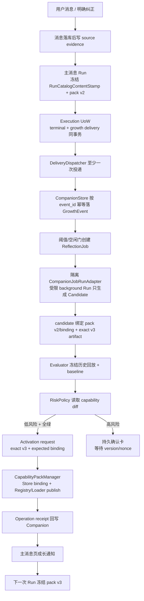

# 最佳实践调研：人类锚定伴生智能体成长闭环

> 日期：2026-07-24  
> 状态：第一阶段调研已完成，结论已进入 `plan.md`

## 1. 主要矛盾

决定成败的不是“能不能让模型写出一个 Skill”，而是：

> 如何让 DeskPet 根据真实使用持续改变长期行为，同时保证每次改变都有客观证据、
> 独立验证、明确权限、原子生效、可解释历史和一键回滚。

如果只解决“生成内容”，很容易得到一个会不断覆写 prompt 的系统，却得不到一个可靠的
伴生智能体。调研因此优先关注 proposal/live 隔离、durable job、版本/指针、outbox、
独立评估、用户控制与高风险确认。

## 2. Hermes 与 OpenClaw：可以借什么，不能照搬什么

### 2.1 Hermes

Hermes 把短小、总是需要的事实放进 memory，把较长的程序性经验放进按需加载的 Skill；
复杂任务、恢复路径、用户纠正和非平凡流程都可能触发 Skill 创建/修改。后台 review
也可以更新 memory/Skill，并可通过 `write_approval` 把写入先暂存，跨重启后再审核。
其 Gateway、Cron 与普通对话最终都创建同一种 `AIAgent`，入口差异留在外围。

来源：

- [Hermes Skills System](https://hermes-agent.nousresearch.com/docs/user-guide/features/skills)
- [Hermes Persistent Memory](https://hermes-agent.nousresearch.com/docs/user-guide/features/memory)
- [Hermes Architecture](https://hermes-agent.nousresearch.com/docs/developer-guide/architecture)

本项目适配分析：

| Hermes 做法 | 前提 | DeskPet 条件 | 结论 |
|---|---|---|---|
| memory 保存事实、Skill 保存程序 | 有清楚的内容分层 | DeskPet 已有 facts、Preference、Skill，但 owner 分散 | **改造后采用**：事实、偏好、程序、执行状态分开 |
| 后台 review 不延迟前台回复 | Gateway 长期驻留 | DeskPet 后端也长期驻留，但现有 reflection 是裸 task | **采用原则**：由可关闭的 `CompanionRuntime` 托管 |
| Skill 可由 agent 直接 patch/edit/delete | 文件是 live source，默认允许自由写 | 用户已明确要求低风险自动生效，但 DeskPet 还要求独立评估和回滚 | **不照搬**：模型只能产候选，不能直接裁决或覆写 live |
| write approval 暂存跨重启 | pending 文件有独立目录 | DeskPet 已有 pending 表但字段不足 | **采用并加强**：候选耐久化、风险门、eval 与 activation receipt |
| Cron 创建 fresh Agent | Job 与 Agent 入口统一 | DeskPet 已有 ProductVenue/Kernel | **采用边界**：后台任务仍走现有 Harness |

Hermes 的优点是产品闭环简单；弱点是 active Skill 可以直接被模型改写，默认自由写也没有
DeskPet 所需的 immutable Capability Pack、客观回放门和 operation receipt。因此 Hermes
更适合作为“触发与产品体验”参考，不适合作为激活事务参考。

### 2.2 OpenClaw

OpenClaw 当前的 Skill Workshop 使用 proposal-first：

- 生成内容先写 `PROPOSAL.md`，不会修改 active `SKILL.md`；
- apply 是唯一 live write；
- update 绑定当前 target hash，目标变化后 proposal 进入 stale；
- apply 前重新安全扫描，并在写 live 前保存 rollback metadata；
- chat、CLI 与 Gateway 调同一个 service；
- running session 保留启动时 Skill snapshot；
-后台 self-learning 是隔离、限权、单 mutation budget 的 review，只能创建/修改 pending
  proposal，不能 apply、reject、quarantine、发消息或调用普通工具；
- 它在 foreground 成功、达到复杂度、安静窗口和全局 idle 后运行，并明确允许 abstain。

来源：

- [OpenClaw Skill Workshop](https://docs.openclaw.ai/tools/skill-workshop)
- [OpenClaw Self-learning](https://docs.openclaw.ai/tools/self-learning)
- [OpenClaw Skills](https://docs.openclaw.ai/tools/skills)

本项目适配分析：

| OpenClaw 做法 | 前提 | DeskPet 条件 | 结论 |
|---|---|---|---|
| proposal 与 live 完全分离 | 有统一 Workshop service | 当前 Codifier 直接写 `SKILL.md` | **直接采用原则**，Companion 冻结 candidate artifact，CapabilityManager 才能改 live binding |
| target hash 防止陈旧 proposal 覆盖新内容 | live Skill 有可计算 hash | DeskPet 已有 Pack manifest/binding generation | **直接采用**：candidate 绑定 base pack/manifest/binding |
| 后台 reviewer 权限极窄 | reviewer 有专用工具面 | DeskPet Context OS 能冻结 PreparedToolSet | **改造后采用**：background profile 不暴露普通 Effect |
| running session 固定 Skill snapshot | session/run 有稳定 snapshot | DeskPet 已有 CapabilityHub/PreparedToolSet 基础 | **采用并加强**：在一次 publish-lock/Gate capture 中同时重验 ToolSet 并冻结 `RunCatalogContentStamp` 与具体 pack/host artifact identity |
| 所有 learned procedure 都人工 apply | 产品选择保守自治 | 用户明确选择“低风险评估通过自动生效” | **不照搬**：保留 proposal 隔离，但由非模型 GrowthPolicy 生成 Manager activation request |
| process-local idle review | Gateway 必须持续在线 | DeskPet 要求重启恢复 | **不照搬**：schedule/job/lease 必须落 `companion.db` |
| 文件式 rollback metadata | 文件目录是事实源 | DeskPet 已有 CapabilityStore/Manager | **加强**：Store binding CAS + Manager receipt；Companion 不复制 pointer |

OpenClaw 给出的最关键启发是：**生成候选和改变 live 行为必须是两个权限不同的动作**。
DeskPet 与它的方向差异只在第二步：低风险候选可以由确定性策略在独立评估全绿后自动提交
activation request，但只有 CapabilityPackManager receipt 对账后才算生效；后台模型本身
永远拿不到 apply 权限。

## 3. 可靠事件与跨数据库投影

[AWS Transactional Outbox](https://docs.aws.amazon.com/prescriptive-guidance/latest/cloud-design-patterns/transactional-outbox.html)
指出，数据库更新和事件发送的“双写”会在任一边失败时造成不一致；应把业务更新与 outbox
写入同一事务，随后至少一次投递，并让消费者按消息 ID 幂等。

本项目适配：

- `Execution UoW` 已经能把 durable Run 终态与 `DeliverySpec` 同事务提交；
- delivery 目标必须在 Run start 时冻结；若终态重放时再查询当前账号/session，幂等
  delivery set 会漂移；
- `companion.db` 与 execution DB 是两个事实域，不能假装一个 Python 调用可以跨库原子；
- 正确方式是“Run UoW 写 durable delivery → dispatcher 至少一次投递 →
  CompanionStore 按 `event_id` 幂等 upsert”；
- Companion 的 candidate/evaluation/activation-intent/notification 在 `companion.db`
  内使用自己的 transaction + outbox；Manager 在 execution DB 写 capability operation 和
  binding，双方用稳定 idempotency key + receipt reconcile，绝不跨库伪事务。
- notification outbox 指向稳定 profile inbox；具体主消息 session/epoch 在投影时解析，
  没有目标时保留 pending。

SQLite 官方文档说明一个连接的事务只能有一个并发 writer；`ATTACH` 多库事务只有在特定
journal 条件下才具备崩溃原子性，WAL 下不保证多文件 crash-atomic：

- [SQLite Transactions](https://www.sqlite.org/lang_transaction.html)
- [SQLite ATTACH DATABASE](https://www.sqlite.org/lang_attach.html)
- [SQLite Atomic Commit](https://www.sqlite.org/atomiccommit.html)

DeskPet 的 `state.db`、`workflow.db` 已采用各自生命周期和 WAL 语义，因此**不采用**
`ATTACH` 把三库绑成一个事务；用 transactional outbox 与幂等 sink 保持清楚边界。

## 4. Durable execution 与人机确认

LangGraph 的官方文档把 durable execution、persistence 与 human-in-the-loop 分开：
持久 checkpoint 让任务在失败后恢复；interrupt 前的副作用必须幂等，或拆到独立节点，
避免恢复时重复执行。

- [LangGraph Persistence](https://docs.langchain.com/oss/python/langgraph/persistence)
- [LangGraph Interrupts](https://docs.langchain.com/oss/python/langgraph/interrupts)

本项目适配：

- DeskPet 已经有自己的原生 Workflow/UoW，不引入 LangGraph；
- 采用的是语义：后台 job 有稳定 ID/lease/checkpoint；确认是持久状态而不是内存 waiter；
- 高风险 candidate 在确认前不得执行真实副作用；
- `StaticRiskPreflight` 必须早于 candidate 执行；脚本候选未确认前连评测子进程也不能启动，
  外部 effect 在评测中只使用 stub/replay；
- eval confirmation 与 activation confirmation 是两个 nonce 域；activation 还绑定
  owner/scope/manifest/expected binding generation。通用 Auto 不能代替它们；
- reminder occurrence 和 notification delivery 都必须有稳定幂等键。

## 5. 不可变 Capability Pack 与唯一 active binding

AWS Step Functions 把 version 定义为不可变状态机快照，并用 alias 指向要启动的版本；
一次 execution 在启动时关联具体 version/alias，后续 alias 改变不会让在途 execution
偷偷换实现。

- [Step Functions versions and aliases](https://docs.aws.amazon.com/step-functions/latest/dg/concepts-cd-aliasing-versioning.html)
- [Associate executions with a version or alias](https://docs.aws.amazon.com/step-functions/latest/dg/execution-alias-version-associate.html)

本项目适配：

- 不采用 AWS 的流量灰度；仓库明确处于测试阶段，能力完成后默认开启；
- 直接复用现有 `pack_id + immutable version + CapabilityStore binding`，不在 Companion
  新建 active pointer；
- 新 Run 在准备阶段用一次原子 capture 冻结 `RunCatalogContentStamp`、
  pack/version/manifest hash、binding generation、artifact-derived host build identity 与
  PreparedToolSet；Personal Workflow 还冻结 graph hash。Store owner publish/rollback/detail
  另用只含该 owner committed rows 的 `OwnerBindingSetStamp`，不能与 Run stamp 混用；
- 新 binding 只对未来 Run 生效，在途 Run 保留旧 snapshot/runtime lease；
- 用户遗忘是显式 revocation 例外：受影响 version 先进入 Companion quarantine overlay，
  再由 Manager rollback/uninstall；在途 Run 到下一 execution fence
  boundary 安全终止，不能拿“snapshot 不漂移”继续使用已遗忘内容；
- 回滚是 CapabilityStore binding CAS，不修改旧 pack version；
- 用户界面显示一个 Skill/Workflow，而不是多个 `-v2/-v3` 副本。

## 6. 评估必须独立于候选生成

[OpenAI Evaluation Best Practices](https://developers.openai.com/api/docs/guides/evaluation-best-practices)
强调 eval-driven development、任务特定数据、生产/历史样本、自动评分与人类校准，并明确
反对“感觉好像能用”的 vibe-based eval。它还建议把开放式判断尽量收敛为 pairwise、
classification 或按明确准则打分。

本项目适配：

- 不接入正在退役的 OpenAI Evals 平台；只采用方法，落在 DeskPet 本地 evaluator；
- 每个 candidate 自动生成的 `evaluation_plan` 不是通过证明；
- evaluator 使用冻结的历史回放集、acceptance golden、确定性结构检查和独立 grader；
- 通用回归 suite 必须带版本 manifest 随应用发布，运行时不能依赖源码 checkout 中的 pytest；
- evaluation job/case/result/report 以一个权威库 open-or-resume；执行 DB 只保存 durable
  checkpoint 并以 outbox 回传，避免跨库完成空窗；
- 生成 candidate 的模型输出不得作为唯一 grader；
- 低风险自动 activation request 要求：
  1. 触发问题样本改善；
  2. 全部必需基线不回归；
  3. 风险分类确定；
  4. 结果非 timeout/unknown；
  5. base manifest 与 binding generation 仍匹配；
- 对 Skill 优先做 old/new pairwise，再用确定性断言检查结构、工具集合和危险动作；
- eval 报告必须保存 dataset hash、runner version、model/provider、每例结果和最终理由。

## 7. 风险门与用户控制

[OpenAI 的 Agent 构建实践](https://openai.com/business/guides-and-resources/a-practical-guide-to-building-ai-agents/)
建议按读写性、可逆性、权限和财务影响给工具分级，高风险、不可逆或敏感动作交给人类监督。

本项目适配：

- 模型可提供语义风险提示，但最终 `RiskPolicy` 同时使用确定性 capability diff 与
  effect topology diff；
- 以下变化至少是高风险：新增脚本/可执行文件、扩大 allowed tools/permission category、
  外部发送、删除、付费、凭据、隐私披露、安全策略修改；即使权限集合没变，只要这些
  effect 的类型、次数、顺序、目标或数据流变化也仍是高风险；
- 高风险即使 eval 全绿也只进入 `awaiting_confirmation`；
- “用户曾允许某次发送”不能自动解释成“以后所有发送都允许”；
- 已授权的可逆本地动作也必须受 write scope、receipt、预算和现有 PermissionGate 约束。

[OpenAI Memory FAQ](https://help.openai.com/en/articles/8590148-personalization-in-chatgpt)
把“查看来源、纠正、删除、关闭、临时不参与记忆”作为用户控制面。

本项目适配：

- 每个偏好和成长通知都能追溯来源；
- 用户可纠正、删除单条 evidence、回滚 pack version、暂停后台反思/自动激活/主动提醒；
- 显式长期偏好权威高于隐式推断；
- 一次性要求默认只影响当前 Run，不进入长期层；
- 删除 evidence 后沿 lineage 重算 preference/candidate，并 quarantine/请求回退依赖该证据的
  active pack version；不能继续引用或执行已遗忘内容。

## 8. 调研后的方案取舍

### 采用

1. OpenClaw 的 proposal/live 隔离、base-hash stale、受限后台 reviewer。
2. Hermes 的“事实记忆与程序 Skill 分层”以及前台/后台共用同一 agent 入口。
3. Outbox + idempotent consumer，解决 execution DB → companion DB → SessionDB 的双写。
4. 不可变 Capability Pack + CapabilityStore 唯一 binding + Run 启动时冻结版本。
5. task-specific replay、old/new pairwise、确定性风险策略和人类校准。
6. 用户可查看来源、纠正、遗忘、暂停和回滚。

### 改造后采用

1. 后台 review：从 process-local timer 改为 durable job/lease。
2. Skill 文件：`SKILL.md` 只作为 managed instruction；代码成为同 pack 的 ToolSpec，
   禁止 Loader 直接执行。
3. Workflow 创建：PackManifest 携带封闭节点 catalog 的声明式图，固定 profile 解释。
4. 低风险自治：不是让模型 apply，而是 GrowthPolicy 写 activation request，
   CapabilityPackManager/Store/Registry 完成激活并返回 receipt。

### 明确不采用

1. 再创建一个 Agent Loop、成长 Driver 或把调度塞进 `RunKernel`。
2. 模型直接覆写 active Skill/Workflow。
3. 任意 Python Workflow 或自动生成可执行脚本。
4. 依赖前端 busy 状态做后台调度真相。
5. 用跨 SQLite 文件事务假装解决双写。
6. 只发实时 WebSocket、只弹 toast 或用 in-memory waiter 作为持久交互。
7. 测试阶段的 shadow/灰度发布；完成并通过门禁的低风险能力默认开启。

## 9. 可推广的“解剖麻雀”模式

以“用户纠正周报 Skill，后台产生 pack v3 并自动激活”为典型链：

这一模式可推广到：

- 近期偏好晋升长期偏好；
- 已有 Workflow pack version；
- 新 Skill/Workflow；
- reminder 到期 occurrence；
- 普通成长摘要。

变化的只是 candidate/evaluator 的内容，可靠事件、状态机、风险门、activation saga、
Manager receipt、outbox 与 UI reducer 不应复制多套。
