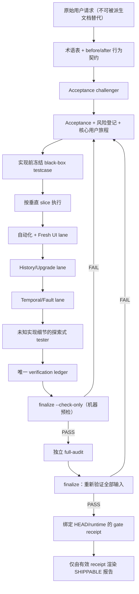

# Handoff：plan-test / plan-task 完成质量复盘与改造建议

> 日期：2026-07-27
> 状态：READY FOR SLICE PLANNING（复盘结论已完成；不是可直接编码的技术规格）
> DeskPet 工作目录：`F:\projects\deskpet`
> plan-test skill 仓库：`C:\Users\Administrator\.codex\skill-repos\plan-test-skill`
> 本文范围：复盘与改造 handoff；本轮**没有修改** plan-test skill，也没有修改 DeskPet 业务代码。
> 时间审计：[TIMING-AUDIT.md](./TIMING-AUDIT.md)
> 下一位代理直接交接：[OPTIMIZATION-HANDOFF.md](./OPTIMIZATION-HANDOFF.md)

## 0. 执行结论

用户的判断成立：本轮不能因为自动化数量很多、required 场景写成 `6/6 PASS`，就认为
plan-test 的完成质量可靠。

这次不是单一原因，而是三层问题叠加：

1. **验收事实源本身有错误或盲区**
   “没有 Code/普通模式，当前只有一个主消息入口”被扩张成“数据层永远只有一个
   Session”，导致原本正确的“新话题创建 UUID Session”行为被主动改掉，测试也跟着改成
   验证错误行为。
2. **当前 skill 已有不少严格规则，但只是 Markdown 规则**
   没有 schema、validator、exit code 和 gate receipt。代理仍然可以在详细 testcase 写着
   `PARTIAL / BLOCKED / NOT RUN` 时，手工写出 `100% COMPLETE / SHIP`。
3. **真人 E2E 测了业务终点，没有测完整用户旅程和中间状态**
   测试看到了“最终回答正确、最终回到空闲”，却没有断言 Session ID 是否改变、执行中
   是否显示忙碌、工具轨迹是否默认可见、历史消息和 Run 投影是否同步恢复，也没有跨越
   300 秒 TTL 的时间边界。

计划体量进一步放大了问题：

- `plan.md`：4,676 行 / 413,768 bytes；
- 17 个 Task；
- 16 条高度复合的 MUST AC；
- 9 个场景；
- 手工 testcase：440 行。

如此大的交付被压成一次“100%”终审，容易让后半程变成对汇总文本的确认，而不是重新从
原始用户目标检查真实产品。

### 独立审计结果

- 两位独立审计者均确认：错误 oracle、冻结 testcase 与最终结论冲突、终点式 E2E 和
  Markdown-only gate 都有仓库证据。
- 两位审计者也共同要求：本文只能作为 **slice 规划 handoff**，不能把下面的方向性设计
  当成可直接开工的 schema/CLI 技术规格。下一位执行者必须先把 Slice 1A 单独写成小计划。

## 1. 已证实的时间线

| 时间 / 提交 | 事实 | 对流程的含义 |
|---|---|---|
| 2026-07-24 `0970682e` | `feat(harness): unify universal task execution` 将 `/new` 从创建 UUID Session 改成同一 Session 新 root；既有 `test_resolve_new_strips_prefix_and_creates_uuid_sid` 也被改成验证 same-session | 不是“缺少测试”，而是测试 oracle 被反转 |
| 2026-07-25 Task 10 | 真人步骤确实点击了“新话题”，但只判定回答 `27` 和最终“空闲” | 点击了按钮不等于验证了按钮语义 |
| 2026-07-27 05:47 `a4becac8` | 宣布 Companion Task 0～16 完成 | 此时交付报告写 `100% COMPLETE / SHIP` |
| 2026-07-27 11:59 `991aeaca` | 第一次修复新话题和只读历史，但仍导向 owner inbox | Session 语义仍未被精确定义 |
| 2026-07-27 13:05 `806a14f6` | 第二次修复才恢复真正的 UUID Session 和切换事件 | 第一次修复后也缺少 Session-ID 级回归 |
| 2026-07-27 15:37 `891762a7` | 补默认工具轨迹、durable Run Inspector 和 provider unknown 审计 | 原交付缺少用户可见过程与故障归因 |
| 2026-07-27 16:46 `14fcdca5` | 修复 422.8 秒 provider 回合导致 scope 过期、历史 Run 投影未恢复、raw 状态误导 | 原测试没有 temporal/history/read-model 接缝覆盖 |

需要特别避免一种错误归因：**SHIP 之后出现 fix commit，只能证明缺陷逃逸，不能单独证明
缺陷由 Companion 提交首次引入。** 已能确认的是：

| 问题 | `introduced_by` / 已确认来源 | `should_have_been_caught_by` | `post_ship_new_requirement` |
|---|---|---|---|
| 新话题退化为 same-session | 上游 `0970682e` 主动反转行为和测试；Companion 计划继承了错误 oracle | Companion S-2 及 Session-ID 级核心旅程 | 否 |
| 只读历史到新话题的 owner/session 错误 | 与上述 Session 语义及后续第一次不完整修复相关 | 历史 Session → 草稿 → 新 Session 状态序列 | 否 |
| 工具默认隐藏、重开仍隐藏 | 旧 localStorage/升级态原因已确认；“点击按钮也无可见效果”的唯一直接原因尚未确认 | history/upgrade lane、真实工具事件与按钮交互断言 | 否 |
| 执行中仍显示空闲、历史有消息但无 Run、raw 状态误导 | 可能是既有或跨模块 read-model 问题；后续修复证明它们逃逸，不能证明均由 Companion 首次制造 | UI/Harness 中间状态、历史恢复和投影一致性回归 | 否 |
| provider unknown 审计不足、长回合 scope TTL | 既有或跨 Provider/Context OS 接缝问题 | fault/temporal lane、exact error 与 T-1/T+1 测试 | 否 |
| 左侧 Harness Inspector | 不适用；这是用户在故障后提出的增强观察面 | 原计划至少应有可审计日志，不要求当时已有完整 Inspector | **是** |
| 创作任务应自主开始还是澄清 | 原 acceptance 未定义 autonomy policy | acceptance 行为契约与安全边界审查 | **部分是后续明确化** |

关键证据：

- 通用行动验收将产品定义为“一个当前主 Session”：
  [acceptance.md](../2026-07-23-universal-action-and-capability-packs/acceptance.md) 第 14～15、
  48、77 行。
- Task 10 的真人 E2E 仅记录“点击新话题 → 算术回答 → 最终空闲”：
  [task10-runtime-verification-results.md](../2026-07-24-human-anchored-companion-growth/evidence/task10-runtime-verification-results.md)
  第 122～130 行。
- 冻结 testcase 目前仍写 `PARTIAL / BLOCKED`，S-2～S-5/S-8 为 `NOT RUN`：
  [manual-test.md](../../testcase/2026-07-24-human-anchored-companion-growth/manual-test.md)
  第 3～16 行。
- 最终交付却写 `6/6 PASS`、无 PENDING、`100% COMPLETE / SHIP`：
  [task16-delivery-audit.md](../2026-07-24-human-anchored-companion-growth/evidence/task16-delivery-audit.md)
  第 47、106、109 行。
- 后续故障和修复事实：
  [PROJECT_STATUS.md](../../ARCHITECTURE/PROJECT_STATUS.md) 第 5～59 行。

## 2. 用户发现的问题，分别属于哪一类

| 用户观察 | 判断 | 为什么原流程没挡住 |
|---|---|---|
| “新话题”没有立即创建新 Session | **错误验收 oracle + 回归** | acceptance 把“单入口”误写成“单 Session”；旧 UUID 测试被改成 same-session |
| 选择历史会话后提示只读，无法正常新建话题 | **状态旅程漏测** | 没测“历史 Session → 携带草稿新建话题 → 新 owner-bound Session”完整序列 |
| “任务1”含义不清 | **UX 语义漏审** | 测试检查内部 Run/Task 投影存在，没有检查用户是否能理解标签 |
| 工具调用默认看不到，按钮也不符合预期 | **持久状态 / 升级态漏测；直接根因仅部分确认** | 旧 localStorage 可解释默认隐藏和重开；按钮无可见效果还可能是该 Run 没有工具事件或消息投影异常，现有证据不能唯一确定 |
| Agent 执行时仍显示空闲 | **中间状态漏测** | 只断言最终回到空闲，没有断言 `思考中 → 工具执行中 → 完成` |
| 对创建生存游戏的请求继续反问做文档、代码还是故事 | **产品策略未定义**，不能仅凭现有证据判定为代码 bug | acceptance 没定义“可逆任务何时自主假设、何时必须澄清” |
| `provider_dispatch_unknown_after_handoff` | **可观测性不足** | 旧 schema 没保存 exact exception；只能推断可能是 10 秒 ConnectTimeout |
| 422.8 秒后 `tool_capability_scope_expired` | **时间边界漏测** | 快速 fake provider 和短 E2E 从未跨越 300 秒 scope TTL |
| 历史消息存在，但 Harness 显示没有 Run | **多 read-model 恢复漏测** | 只恢复 messages，未同时验证 Run projections 和 context usage |
| raw `running/prepared` 看起来仍在执行 | **事实投影契约漏测** | 没区分 raw ledger 与 continuation/effect observed terminal |
| 左侧 Harness 分层观察此前不存在 | **这是后续新增的可观测性需求，不应伪装成原业务功能漏实现** | 但 Harness 大改没有最小审计面，确实让前述故障更难发现和解释 |

## 3. 为什么“测试很多”仍然会漏

### 3.1 唯一事实源如果写错，100% 只会更稳定地做错

plan-test 把 acceptance 当唯一事实源，这个方向本身没有错；问题是 acceptance 目前只有
用户确认，没有独立的 **acceptance challenger**，也没有“现有行为 before / 目标行为
after”对照。

本轮最典型的歧义是：

| 概念 | 用户真正需要的语义 |
|---|---|
| 主消息窗口 / 入口 | 一个 |
| 当前选中的 Session | 同时一个 |
| 可保存的话题 Session | 多个 |
| 一个 Session 中的 Run | 可以多个 |
| 点击“新话题” | 立即创建新 Session |
| Code/普通模式 | 不存在，不参与 Driver/Profile 决策 |

计划没有让用户对这张表逐行确认，而是把“一个主 Session”直接变成数据库和测试约束。

### 3.2 自动化绿色只能证明代码与当前测试一致

`0970682e` 中，原来验证 UUID Session 的测试被直接改成验证 same-session。之后再跑多少
遍，这组测试都会绿色，但它证明的是错误产品语义。

当前流程缺少：

- 既有测试被删除/放宽/反转时的 mutation audit；
- 行为变更必须绑定用户确认的 `behavior_change_id`；
- 无明确行为变更授权时，旧 black-box oracle 不得被修改。

### 3.3 真人 E2E 只看了终点

Task 10 点击过“新话题”，但没有记录点击前后 Session ID。最终只检查：

```text
用户输入 → provider HTTP 200 → 回答 27 → 最终空闲
```

真正需要检查的是：

```text
点击新话题
→ Session ID 改变
→ 新 Session 空态正确
→ 首条 user bubble 只落新 Session
→ 创建并选中新 Run
→ 状态变成思考中
→ 工具 call/result 可见
→ final 回到同一新 Session
→ 状态恢复空闲
→ 旧 Session 零 mutation
```

### 3.4 fresh user-data 隔离了噪声，也隔离了真实用户问题

隔离 user-data 对可重复测试是正确的，但不能只有这一条 lane。用户真实问题发生在：

- 旧 Session；
- 旧 schema；
- 旧 localStorage；
- 已有失败 Run；
- history 切换；
- HMR / 重启后的 store 与 WebSocket。

最终验收至少需要 fresh 与 history/upgrade 两条独立 lane。

### 3.5 快速测试没有覆盖“时间本身”

Provider 正常耗时通常远小于 300 秒，因此常规 E2E 永远不会自然发现：

```text
provider 仍在合法思考
→ orphan TTL 到期
→ scope 被清理
→ provider 返回工具调用
→ 激活失败
```

所有 TTL、lease、nonce、connect/read timeout 都应进入同一时间预算表，并至少测
`T-1`、`T+1`、取消和 finally 清理。

### 3.6 最终审计是自述，不是门

当前 skill 已经明确写了：

- required 场景有 `PARTIAL/NOT RUN` 必须 BLOCKED；
- testcase、RESULTS、Gate 报告状态必须一致；
- full-audit 必须检查完整证据链。

这些规则在 2026-07-18 已进入当前 skill，早于本轮 Task 16。但 skill 仓库只有 Markdown
规则和 prompts，没有 validator。主代理最终只需要读取子代理最后一行
`VERDICT: PASS/FAIL`。

本轮已经出现规则明令禁止的状态：

```text
manual-test.md = PARTIAL / BLOCKED / NOT RUN
manual-results.md = 6/6 PASS
task16-delivery-audit.md = 100% COMPLETE / SHIP
```

而且不只是状态文字没有同步，S-2 的冻结输入、结果和证据路径也对不上：

- 冻结的第四话题是“采用每日摘要、负责人小陈、周一前完成通知详情页”：
  [manual-test.md](../../testcase/2026-07-24-human-anchored-companion-growth/manual-test.md)
  第 215～217 行；
- PASS 结果却记录“版本周四发布、负责人小周、小李明早完成回归测试”：
  [manual-results.md](../2026-07-24-human-anchored-companion-growth/evidence/manual-results.md)
  第 24 行；
- 冻结 testcase 要求证据位于 `manual-runtime/s2/cases/S-2/shots/cg-s2-main-l01-*`，
  最终结果引用的却是 `manual-runtime/s2/screenshots/s2-concise-complete-final.jpg`。

最终证据还存在循环依赖：`manual-results.md` 把 `task16-delivery-audit.md` 当作自动化明细，
后者又把 `manual-results.md` 当作真人 E2E PASS 依据。两个相互引用的结论不能构成独立
证据。validator 必须建立 evidence dependency graph，并拒绝环。

这不是再补一句“必须认真检查”能解决的，需要机器 gate 对冻结输入、实际执行、证据路径、
状态和依赖关系逐项对账。

### 3.7 同一执行链既写实现又写测试，容易过拟合

执行代理知道内部字段、fixture 和预期实现，很容易写出“最容易通过当前实现”的 testcase。
最终需要一个不知道实现细节的 black-box tester，只拿原始用户目标和可操作应用，以普通
用户方式探索。

### 3.8 超大 plan 让后半程检查失真

4,676 行计划和 16 条复合 AC 不适合作为一个 release unit。长任务、并行 worktree、反复
修复和上下文压缩都会提高漏掉状态回写、回归旅程和最终一致性检查的概率。

这项是**放大因素**，不是已证明的单一直接原因；直接原因仍是错误 oracle 和没有机器门禁。

## 4. plan-test 应改成什么样



核心原则：

1. 不再继续堆更多“请务必认真”的提示词。
2. Markdown 是给人读的视图，不再是状态 authority。
3. qualitative auditor 负责发现未知问题；deterministic validator 负责阻止已知违规。
4. “100%”只能表示某个明确 scope 的 required gates 全绿，不表示未来绝无缺陷。

## 5. P0：先阻止错误的 SHIP

### P0-1：一个结构化账本、一个 gate 程序

不要为 acceptance、testcase、results、evidence、auditor 再各建一份可独立修改的状态文件，
否则会重新制造“多个事实源不一致”。最小代码面只新增一个 schema 和一个程序：

```text
skills/plan-test/schemas/plan-test-run.schema.json
skills/plan-test/scripts/plan_test_gate.py
```

每次执行使用固定 run 目录，状态 authority 只有一个：

```text
<plan-folder>/verification/<run-id>/
  plan-test-run.json       # 唯一状态账本
  artifacts/               # 截图、日志、命令回执等原始证据
  auditor-input.json       # 独立审计的冻结输入
  auditor-output.json      # 独立审计原始输出
  gate-receipt.json        # finalize 成功后才存在
  report.md                # 从 ledger + receipt 生成的人读视图
```

`plan-test-run.json` 是唯一可写状态账本，内部包含：

```text
source_request + behavior_contract
git/runtime attestation
acceptance rows
testcase lock/hash
scenario results
evidence refs/hashes
auditor result
closure delta
```

账本不能在任务结束后由代理凭印象手写。所有 required AC/scenario 必须由 `init` 从冻结输入
自动创建为 `NOT_RUN`；命令只记录事实，状态由 validator 计算，不能由调用者直接把
`NOT_RUN` 改成 `PASS`。建议的最小 CLI 是：

```text
init             # 冻结输入，创建 required rows，记录 baseline HEAD/dirty
record-run       # 记录自动化/UI 场景的命令、身份、结果和时间
attach-evidence  # 绑定证据路径、hash、scenario/action
audit            # 冻结 auditor 输入和原始输出
finalize         # 重新计算全部状态；--check-only 仅预检，正式执行才生成 receipt
render           # 重新验证 ledger/receipt 后生成 report.md
invalidate       # HEAD/runtime/输入变化后使旧 audit/receipt 失效
```

并行执行不能让多个代理直接覆盖同一 JSON。Slice 1A/1B 必须规定单写者文件锁、原子
replace 和 revision/CAS；冲突返回稳定错误，不能静默丢掉另一个 `record-run`。ledger 中
只接受原始 fact/event，所有 status/projection 在检查时完全重算。

唯一状态机：

```text
DRAFT → ACCEPTED → IMPLEMENTED → TESTED → VALIDATED → SHIPPABLE
```

`finalize --check-only`、正式 `finalize` 和 `render` 必须使用同一 validation engine，
但 completion 条件分阶段：

- `finalize --check-only`：检查除 auditor/receipt 外的输入与测试完整性，成功只输出
  `READY_FOR_AUDIT`；
- 正式 `finalize`：额外要求 auditor PASS，重新验证全部 hash/HEAD/runtime 后生成 receipt；
- `render`：额外要求有效 receipt，并再次执行完整验证。

共同硬门以稳定 diagnostic code 非零拒绝：

- 任一 required AC/scenario 为 `PENDING/PARTIAL/NOT_RUN/BLOCKED/FAIL`；
- positive-value 没有非空业务结果和人工 quality review；
- 任一 UI 场景没有真实 UI action evidence；
- `expected_run_created=true` 却没有 root Run，或 `expected_run_created=false` 却没有“未创建
  Run”的负向证据；
- evidence 文件不存在或 hash 不符；
- input、testcase、Session、Run、截图、日志无法绑定；
- testcase/RESULTS/Gate 状态不一致；
- evidence dependency graph 存在循环引用；
- tested HEAD/runtime 与当前 HEAD/runtime 不一致。

正式 `finalize/render` 还必须拒绝 auditor 不是 PASS；`render` 还必须拒绝 receipt 缺失或
stale。这样预检不会因为“审计尚未执行”而永远无法进入审计阶段。

至少固定这些 diagnostic code，防止 dogfood 只得到泛化的“manifest 缺失”：

```text
REQUIRED_SCENARIO_NOT_RUN
STATUS_CONFLICT
DELIVERY_VERDICT_CONTRADICTS_LEDGER
EVIDENCE_HASH_MISMATCH
EVIDENCE_DEPENDENCY_CYCLE
TESTED_RUNTIME_MISMATCH
RECEIPT_STALE
BEHAVIOR_APPROVAL_REQUIRED
FROZEN_ORACLE_CHANGED
AUDITOR_INPUT_STALE
RISK_CLOSURE_MISSING
RELEASE_UNIT_TOO_LARGE
```

唯一允许生成 `gate-receipt.json` 的命令是：

```powershell
python skills/plan-test/scripts/plan_test_gate.py finalize --run-dir <run-dir>
```

canonical integration 必须固定下来：

1. `plan-task` 最终步骤只接受上述命令的 exit code 和结构化 stdout，不接受代理手写结论；
2. `finalize` 在 auditor 结束后重新读取并校验所有文件和 hash；
3. `render` 重新运行同一 validator、重算全部输入 hash 和 receipt digest，失效时不得渲染
   `SHIPPABLE`；
4. skill 自测/CI 用同一 canonical command 重跑，不另写一套判断；
5. 没有有效 receipt 的手写 `SHIP/100% COMPLETE` 一律视为
   `DELIVERY_VERDICT_CONTRADICTS_LEDGER`。

证据还要分级：截图、原始日志、命令回执和数据库记录是 primary evidence；auditor、
delivery report 和汇总 Markdown 是 derived report。derived report 只能帮助审计，不能
单独满足 AC/testcase。

### P0-2：冻结结构化行为契约和用户批准

这一层的硬保证不是“再请一个模型看一遍”，而是要求 ledger 冻结：

```text
原始用户消息 / event ID / hash
术语与实体关系
before / after 行为表
明确保留、删除和改变的旧行为
acceptance revision
用户批准事件及 hash
```

若需求出现 Session、Run、Task、话题、窗口、Profile、Driver 等易混实体，必须生成并让
用户确认实体关系和状态转换。不能用“用户已经说认可”代替具体行为确认。

`acceptance challenger` 可以在 P1 帮忙发现遗漏，但它是 qualitative reviewer，不能替代
上述结构化批准和 deterministic gate。

### P0-3：实现前冻结 black-box oracle，审计测试修改

修改：

- `phase-2-iterate-plan.md`
- `phase-3-execute.md`
- `prompts/plan-challenger.md`

规则：

- 实现前在唯一 ledger 中冻结外部 black-box testcase 的逐文件 hash 和 behavior contract；
- frozen black-box oracle 任何 byte 变化默认 FAIL，不能由“看起来只是重写文案”自动放行；
- 唯一例外是结构化批准 artifact，必须绑定 exact old/new、原始用户 message/event ID/hash、
  acceptance revision、批准 scope 和 expiry；
- 实现后新增测试可以单独记录；删除、反转、放宽 frozen oracle 必须走上述批准；
- 失败后不能把 expected result 改成当前实现结果；
- repo 内部 unit/integration test 的 mutation report 只能作为审计信号，不能替代冻结的
  black-box oracle，也不能单独证明行为变更获得授权。

这条应当直接挡住把“新话题创建 UUID”测试改成“同一 Session 新 root”。

### P0-4：修正 full-audit 时序

当前 full-audit 在 phase 4，而实际结果回写和状态一致性修正在 phase 5。应改为：

1. phase 4：执行冻结 testcase，只写唯一 ledger 的 `scenario_results`；
2. phase 5：校验证据、回写最终状态、冻结所有 artifact hash；
3. phase 5 最后：运行独立 full-audit；
4. final DoD：只运行机器 validator，生成 receipt；
5. full-audit 后代码、配置、testcase 或结果有任何变化，旧 auditor PASS 和 receipt 自动失效。

这一项必须与 ledger/finalize 在同一个基础 slice 落地。否则即使先写了 validator，审计后
仍可修改输入而继续沿用旧 PASS。

需要同步修改：

- `phase-4-stage-gate.md`
- `phase-5-testcase.md`
- `phase-final-dod.md`
- `skills/plan-task/SKILL.md`
- `skills/plan-test/SKILL.md`

### P0-5：证据绑定 tested commit 和真实运行物

通用 skill 不能猜每个项目如何证明“运行的是当前源码”。因此先定义 project adapter
协议；项目没有 adapter、adapter 返回 UNKNOWN、或 identity 无法闭环时，真实 E2E 状态
只能是 `BLOCKED`，不能降级成口头确认。

```text
project attest command
→ components[]
→ source root
→ process command + relevant env
→ loaded artifact/source digest
→ health/build identity
```

唯一 ledger 的 `runtime_attestation` 至少记录 adapter 输出以及：

- HEAD；
- dirty diff hash；
- acceptance/testcase hash；
- 实际 backend/frontend/executable build hash；
- worktree、backend source path、provider、feature flags；
- user-data 类型：fresh / history-upgrade；
- 测试开始结束时间；
- 每条证据的 tested commit。

测试后新增 production commit、切换旧 frozen exe、换 worktree 或修改 dirty code，都必须
让旧 receipt 失效。

`gate-receipt.json` 不是一个可手写的 PASS 标志，至少要绑定：

- ledger、acceptance、testcase、全部 evidence 的 hash；
- auditor input/output hash；
- HEAD、dirty patch hash；
- project policy hash；
- runtime attestation hash；
- validator/schema version；
- required lanes、required edges/sequences/sample budget；
- evidence/test 的起止时间，以及对稳定字段计算的 digest；
- `finalized_at` 可作为非身份元数据；输入不变时重复 finalize 复用首次值。

`finalize` 和 `render` 都必须重算 digest；任一输入变化都返回 `RECEIPT_STALE`。
source dirty digest 必须明确排除当前 verification run-dir 生成物，否则写 receipt/report
会让 receipt 自己立即 stale；排除规则本身也要进入 digest。

## 6. P1：提高发现“奇怪问题”的概率

### P1-1：用 acceptance challenger 发现语义遗漏

新增 qualitative reviewer：

```text
skills/plan-test/prompts/acceptance-challenger.md
```

它必须拿到原始用户消息、当前行为证据、术语表、before/after 表和保留/删除清单，专门挑战
“把单入口误解成单 Session”这类语义跳跃。但它只产出风险和建议；是否允许行为改变，仍由
P0-2 的批准 artifact 和 validator 决定。

### P1-2：项目级核心旅程策略

通用 skill 无法知道 DeskPet 的“新话题”必须创建 Session。项目侧应新增：

```text
F:\projects\deskpet\.plan-test\policy.json
F:\projects\deskpet\testcase\core-user-journeys\manifest.json
```

policy 将高风险文件路径映射到必须回归的旅程。例如：

| 改动路径 | 强制旅程 |
|---|---|
| `message-panel/**`、`InputBar.tsx`、`sessionsStore.ts` | 新话题、历史切换、工具可见、状态迁移 |
| `session/task_scope.py`、`main.py` chat ingress | Session/Run identity、只读历史、新话题 |
| `harness/**`、`execution_uow.py` | failure/replan、恢复、投影一致性 |
| `providers/**`、Context OS scope | timeout、handoff、TTL、取消 |

项目 HARD 规则必须输出结构化结果，不能只由通用 auditor 阅读 `AGENTS.md` 后口头确认。

这项依赖基础 ledger/gate，属于后续 Slice 3，不要与 P0 基础设施一起实现。
`policy.json`、risk/time-budget manifest、原始 stability measurements 和
escaped-defect 记录都只是 ledger 绑定 hash 的冻结输入/证据，不能成为第二个交付状态
authority。

### P1-3：由风险策略计算每个场景需要的 lane

不是所有 UI 场景固定跑四条 lane。change-impact 先生成结构化 risk manifest：

```text
risk_id
changed_components
required_lanes
required_edges
required_sequences
required_sample_budget
mapped_testcases
disposition
```

高风险交付通常会需要：

1. **Fresh lane**：干净 user-data；
2. **History/Upgrade lane**：旧 Session、旧 schema、旧 localStorage、已有失败 Run；
3. **Temporal/Fault lane**：timeout、断连、TTL、取消、重启；
4. **Exploratory lane**：tester 不知道实现关键词，只拿原始用户目标自由操作。

validator 根据 risk manifest 计算 required 集合并检查 closure；低风险按钮可以只有必要
lane，但不能由执行代理在结果出来后手工降级风险。

### P1-4：从终态断言升级为状态序列断言

每个真人步骤必须有结构化 assertion，而不是只放代表截图：

```text
action_before_evidence
action + coordinates
expected_session_transition
expected_run_transition
expected_intermediate_ui
expected_provider/tool/effect transition
expected_terminal
negative assertions
evidence paths + hashes
```

一个步骤没有可观察预期，就不能计为已测试。

### P1-5：跨层“边”覆盖，而不只是 AC/模块覆盖

对 Agent/Harness 类功能，强制建立：

```text
UI action
→ Session identity
→ Run identity
→ Driver/Profile
→ Provider
→ Tool/Effect
→ Canonical projection
→ visible UI
```

任何本次修改过的边至少有一个 live contract/integration test。

### P1-6：统一时间预算和长耗时测试

架构基线新增 `time-budget.json`：

| 资源 | owner | timeout/TTL | 合法最长子操作 | pin/renew 策略 | T-1/T+1 测试 |
|---|---|---:|---:|---|---|
| Provider connect | Provider adapter | 10s | 10s | exact error audit | 必须 |
| Context OS scope | Run/Provider turn | 300s orphan TTL | Provider 可超过 300s | 整个 turn pin | 必须 |
| activation nonce | exact scope/revision/capability | scope lifetime | 模型思考可很长 | one-shot + scope bound | 必须 |

用 fake monotonic clock 做 299/301/425 秒测试，不用真实 sleep。

### P1-7：非确定性场景不能只跑一次

高风险 LLM/provider/异步场景配置最小独立样本数和成功率。三次 retry 不能冒充三个独立
样本；最后一次成功不能覆盖前两次无解释失败。

原始独立样本是不可变 measurement artifacts，其 hash 绑定进 ledger；最终稳定性结论只写入
`plan-test-run.json` 的 `stability` section，由 validator 计算：

```text
PASS / FLAKY / BLOCKED / FAIL
```

`FLAKY` 不得生成 SHIPPABLE receipt。

### P1-8：限制单个 release unit 大小

建议默认阈值：

- MUST AC > 8；
- Task > 10；
- plan > 2,000 行；
- 跨越 > 3 个高风险子系统；
- 同时修改 UI、Session、Harness、Provider、权限中的 3 类以上；

命中任一项时，deterministic validator 必须返回 `RELEASE_UNIT_TOO_LARGE`，要求拆为
program plan + 多个垂直 slice。challenger 可以建议怎样拆，但不能承担硬门。每个 slice
独立验收，最后再跑跨 slice 集成旅程。阈值可配置，不应成为新的“为了卡数字而压缩文字”门。

### P1-9：缺陷逃逸自动回灌

新增 `escaped-defects.json`。每个 SHIP 后修复必须记录：

- 缺陷；
- 漏测原因；
- 原本应归属的 AC/risk class；
- 永久回归 testcase；
- 是否需要修改通用 skill 或项目 policy；
- 修复后新 gate receipt。

任何 fix commit 没有永久回归，不得重新标 SHIPPABLE。

## 7. DeskPet 最小永久回归矩阵

| ID | 场景 | 必须断言 |
|---|---|---|
| R-01 | 可写 Session 空白点击“新话题” | Session ID 立即改变；旧 Session 可查看；新 Session 空消息、无 Run |
| R-02 | 从只读历史 Session 携带草稿新建话题 | 新 owner-bound UUID；user bubble/Run/final 全落新 Session；旧历史零 mutation |
| R-03 | 连续创建四个话题，并在每个话题逐一发送首条消息 | 四个不同 Session ID 和四个对应 root Run；不是 retry/continuation/清空同一投影 |
| R-04 | 真实 `workspace_prepare` 或 `memory_search` | 工具 call/result 默认可见；隐藏按钮有效；重开页面仍默认显示 |
| R-05 | 工具型 Run 状态迁移 | 可观察 `思考中 → 工具执行 → 完成/空闲`，始终关联所选 Run |
| R-06 | 切换旧历史 Session | messages、Run projections、context usage 同步恢复；不能“有消息但无 Run” |
| R-07 | raw `running/prepared`、observed 已 succeeded 的 fixture | 同时显示 raw/observed；不得持续 spinner 或声称当前仍执行 |
| R-08 | ConnectTimeout、read-drop、after-handoff unknown | exact type/reason/layer 入账；一次 POST；无内部盲重试；UI 可解释 |
| R-09 | provider 延迟 305/425 秒后调用工具 | scope 始终 pinned；activate 可继续；finally unpin；无伪过期 |
| R-10 | 首个工具失败后重规划 | 模型收到真实失败；Plan v1→v2；Inspector 同时显示失败吸收和最终结果 |
| R-11 | clean user-data 与旧版本迁移 fixture | 同一核心旅程分别跑 fresh 和 history/upgrade lane |
| R-12 | 可逆但不完全具体的创作任务 | 按产品 autonomy policy 采用安全默认并开始执行；只有缺失选择会改变不可逆/高风险结果时才澄清 |
| R-13 | 历史 testcase/RESULTS 状态矛盾 fixture | validator 必须拒绝 SHIP |
| R-14 | audit 后新增 production commit | 旧 receipt 自动失效并要求 impact-based 复测 |

R-12 需要先由产品明确 autonomy policy，不能把“永不提问”硬编码成测试答案。建议规则：

- 可逆、低风险、workspace 明确：声明合理假设后开始；
- 缺失信息会改变不可逆、高风险或用户成本：才暂停澄清；
- 缺能力：可以先搜索现有能力；在当前授权范围内可以创建 candidate/proposal；
- 可执行代码的激活、权限扩张和外部副作用仍必须经过现有 capability evaluation、
  activation confirmation 和 action confirmation，不能用 autonomy policy 绕过 AC-07～AC-09。

因此 R-12 是 Slice 3C 的显式 blocked dependency：没有 P0-2 的产品批准 artifact 前，只能
记录为“待定义”，不能冻结成 PASS oracle。

## 8. plan-test skill 自身必须有测试

当前 skill 仓库几乎只有 Markdown，没有自己的 validator 测试。改造后至少新增以下 fixture：

1. `delivery=SHIP`、`manual-test=PARTIAL` → FAIL；
2. required scenario=`NOT_RUN` → FAIL；
3. evidence 文件缺失/hash 不符 → FAIL；
4. exact input 与结果账本不一致 → FAIL；
5. 多阶段场景缺 Session/Run ID → FAIL；
6. full-audit 后结果变更 → receipt stale；
7. audit 后新增 production commit → receipt stale；
8. 运行旧 binary / 错 worktree → FAIL；
9. 既有测试 oracle 被放宽但无 `behavior_change_id` → FAIL；
10. 计划超过复杂度预算且未拆 slice → FAIL；
11. fresh lane PASS、history lane 未执行 → FAIL；
12. 高风险非确定性场景 1/3 成功 → FLAKY，不得 SHIP；
13. 全部结构化证据合法 → 幂等生成同一 content digest，并复用现有有效 receipt 元数据。

还要用两份真实计划 dogfood：

- 本次 Companion 计划：通过一次性的 legacy importer 或由原文件 hash 派生的 normalized
  fixture 导入；必须依次暴露
  `REQUIRED_SCENARIO_NOT_RUN`、`STATUS_CONFLICT`、
  `DELIVERY_VERDICT_CONTRADICTS_LEDGER`，不能只返回 `MANIFEST_MISSING`；
- 一份规模小、证据完整的既有计划：应 PASS，防 validator 只会阻断。

不要为了让历史 Companion 计划变绿而回写历史结论；应保留它作为 escaped-defect fixture。

## 9. 推荐实施顺序

以下是 program 级切片边界，不是直接编码清单。每个切片还需要单独的 acceptance、数据
结构、错误码、测试 fixture 和回滚/迁移说明。

### Slice 1A：schema、run-dir 与 fixture 契约

- 定义唯一 schema 和固定 run-dir；
- 定义 required AC/scenario、evidence reference、diagnostic 的最小字段；
- 定义 primary/derived evidence、fact/projection、schema version 与并发 revision 契约；
- 建立一份最小 PASS fixture、一份状态矛盾 FAIL fixture；
- 明确 legacy importer/normalized fixture 边界。

验收：schema 能表达真实 Companion 冲突，但这一 slice 不宣称已经有可信 SHIP gate。

### Slice 1B：ledger CLI 与 deterministic validator

- 实现 `init/record-run/attach-evidence/audit`；
- required rows 自动初始化，状态只由 validator 计算；
- 实现文件锁、CAS revision 和原子 replace 的并行写入；
- 实现稳定 diagnostic code、证据 hash/依赖环检查；
- 覆盖 `NOT_RUN`、状态冲突、路径/hash 错误和循环证据。

验收：同一输入幂等得到相同诊断，不能靠手改 status 变绿。

### Slice 1C：renderer、receipt 与 stale 机制

- 实现 `finalize/render/invalidate`；
- receipt 绑定全部输入与版本；
- renderer 复验 digest；
- audit 后任一 artifact/HEAD 变化均得到 `RECEIPT_STALE`。

验收：手写 `SHIP` 无效；合法 fixture 幂等生成同一 receipt。

### Slice 1D：skill/plan-task 集成、canonical command 与历史 dogfood

- `plan-task` 最终状态只取 canonical command；
- CI/self-test 运行同一 finalize 路径；
- 导入 Companion 历史证据并得到三个具体冲突码；
- 用一份完整小计划证明 PASS 路径，不让 gate 变成“只会拒绝”。

### Slice 2A：行为契约与批准 artifact

- 原始消息/event hash；
- 术语与实体关系；
- before/after、保留/删除/改变；
- 精确 scope/expiry 的用户批准。

验收：不能再把“一个入口”无批准扩张成“一个持久 Session”。

### Slice 2B：testcase lock 与 mutation validator

- 冻结 black-box oracle；
- exact old/new approval；
- internal test mutation report；
- same-session 反转 UUID testcase 的真实 FAIL fixture。

### Slice 3A：runtime adapter protocol

- 项目 attestation command；
- process/env/source/build identity；
- UNKNOWN/BLOCKED 语义；
- DeskPet 当前源码与 frozen binary 的正反 fixture。

### Slice 3B：DeskPet policy 与 change-impact

- `.plan-test/policy.json`；
- 核心用户旅程；
- 结构化 risk manifest；
- required edges/sequences/sample budget 计算。

### Slice 3C：lane execution 与 closure delta

- fresh/history-upgrade/temporal-fault/exploratory 执行；
- risk-based required lane closure；
- audit 后 change-impact 与最小必要复测；
- R-01～R-14 的永久回灌。

完成 1A～3C 后，再单独规划 exploratory tester、稳定性预算和 escaped-defect 自动回灌的
体验优化；不要把它们重新打包成一个超大实施计划。

## 10. 下一位执行者的边界与入口

下一位执行者不要直接“实现全文”。先为 **Slice 1A** 写一份小型技术 plan；第一阶段只修改：

```text
C:\Users\Administrator\.codex\skill-repos\plan-test-skill
```

不要先改 DeskPet 业务代码，也不要把 P0～P1 再塞进一个超大 plan。依次完成 1A～1D，
到 1D 才用本次历史矛盾 dogfood，证明机器 gate 真能拒绝错误 SHIP。

随后再在 DeskPet 增加：

```text
F:\projects\deskpet\.plan-test\policy.json
F:\projects\deskpet\testcase\core-user-journeys\manifest.json
```

每个 slice 必须：

1. 有独立 acceptance；
2. 有实现前冻结的 black-box testcase；
3. 有 skill 自身自动化测试；
4. 有一份 pass fixture 和一份 fail fixture；
5. 保存独立 auditor 原始输入、输出和结构化 verdict；
6. 提交前证明当前 HEAD 与被测 artifact 一致。

## 11. 交付措辞也需要修改

以后不再写没有作用域的：

```text
100% COMPLETE，DECISION: SHIP
```

改为：

```text
REQUIRED GATES: PASS
TESTED HEAD: <sha>
TESTED SCOPE: <AC / slice>
FRESH LANE: PASS | NOT_REQUIRED(<risk/policy ref>)
HISTORY/UPGRADE LANE: PASS | NOT_REQUIRED(<risk/policy ref>)
TEMPORAL/FAULT LANE: PASS | NOT_REQUIRED(<risk/policy ref>)
EXPLORATORY LANE: PASS | NOT_REQUIRED(<risk/policy ref>)
KNOWN GAPS: 0 / 明确列表
GATE RECEIPT: <hash>
```

如果用户后续发现生产缺陷，对应 receipt 自动标为 stale；修复、永久回归和受影响 lane
复测完成后才生成新 receipt。

## 12. 最终判断

plan-test 当前方向并非完全错误：它已经知道需要 acceptance、真人 E2E、状态一致性和
full-audit。真正的问题是：

> 它把“流程要求”写成了给代理看的文章，却没有做成代理无法绕过的执行协议。

修改优先级不应是再增加更多测试数量或更多警告文字，而应依次是：

1. 机器 gate 和唯一 ledger；
2. 正确的用户行为 oracle；
3. fresh/history/temporal/black-box 四类真实旅程；
4. 小 slice 交付与缺陷逃逸回灌。

完成这四项后，plan-test 才能从“很认真地写完成报告”升级为“能够证明为什么可以交付”。
