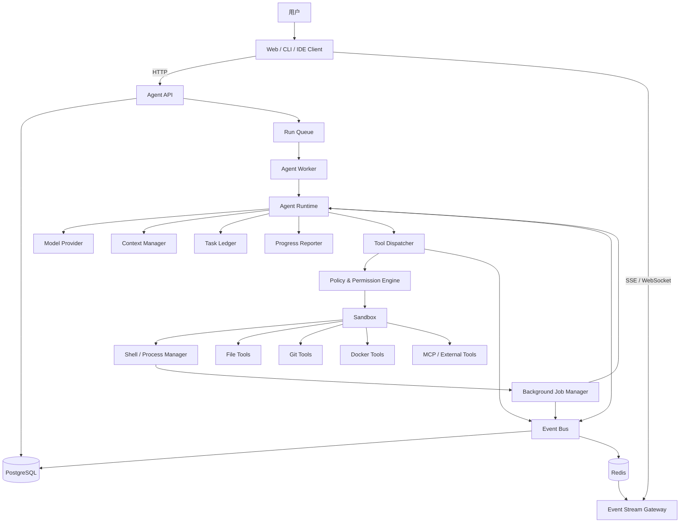
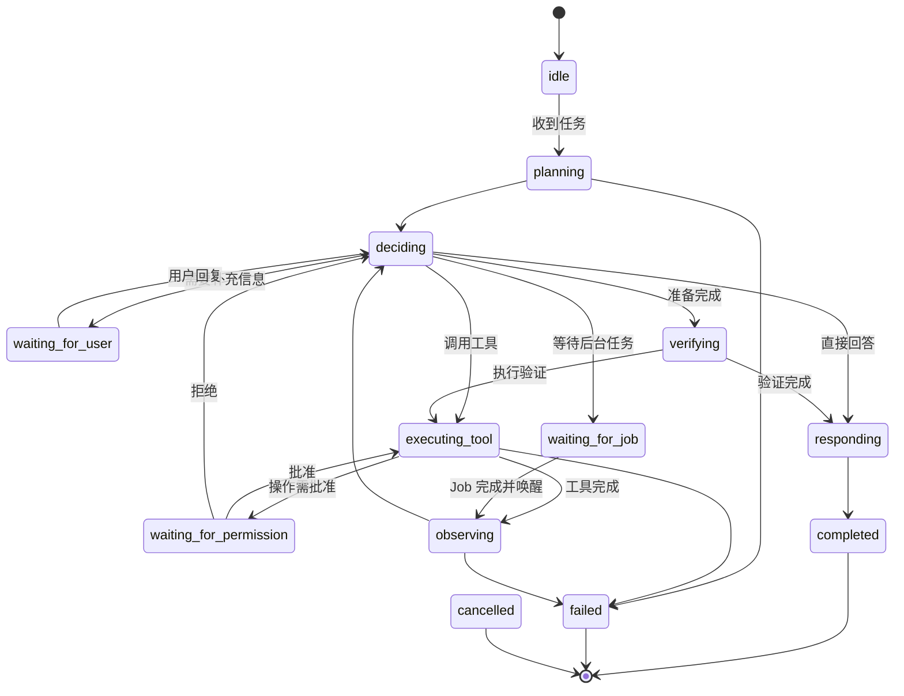
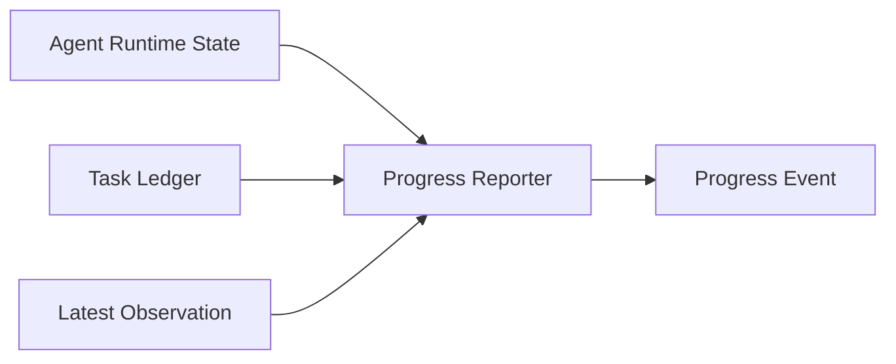
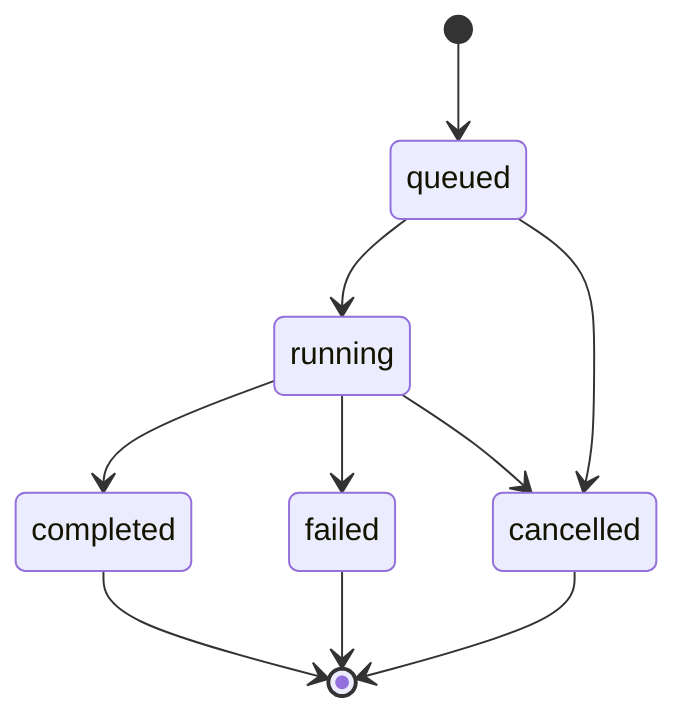
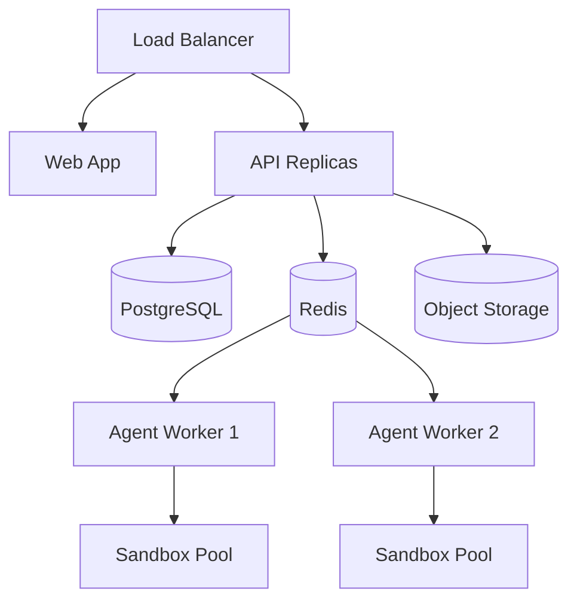

# 可观察型 Coding Agent：完整架构设计与实施计划

> 文档目标：设计并实现一个类似 Claude Code / Codex CLI 的 Coding Agent。系统能够调用 Shell、文件、Git、Docker 等工具，支持长时间后台任务、断线恢复、权限控制，并通过事件流向用户展示清晰、可信、可追踪的执行进度，而不是直接暴露模型的原始内部推理。

---

## 目录

1. [项目背景](#1-项目背景)
2. [目标与非目标](#2-目标与非目标)
3. [核心设计结论](#3-核心设计结论)
4. [设计原则](#4-设计原则)
5. [总体架构](#5-总体架构)
6. [领域模型与核心概念](#6-领域模型与核心概念)
7. [统一事件协议](#7-统一事件协议)
8. [Agent Runtime 状态机](#8-agent-runtime-状态机)
9. [模型交互协议](#9-模型交互协议)
10. [用户可见进度系统](#10-用户可见进度系统)
11. [Tool 系统](#11-tool-系统)
12. [Shell 与 Process Manager](#12-shell-与-process-manager)
13. [Background Job Manager](#13-background-job-manager)
14. [Context Manager](#14-context-manager)
15. [Task Ledger](#15-task-ledger)
16. [权限、策略与沙箱](#16-权限策略与沙箱)
17. [数据持久化设计](#17-数据持久化设计)
18. [API 与流式通信](#18-api-与流式通信)
19. [前端执行时间线](#19-前端执行时间线)
20. [Model Provider 抽象](#20-model-provider-抽象)
21. [Worker、队列与长任务](#21-worker队列与长任务)
22. [可观测性](#22-可观测性)
23. [可靠性与恢复机制](#23-可靠性与恢复机制)
24. [测试策略](#24-测试策略)
25. [部署架构](#25-部署架构)
26. [推荐技术栈](#26-推荐技术栈)
27. [Monorepo 目录结构](#27-monorepo-目录结构)
28. [关键代码骨架](#28-关键代码骨架)
29. [分阶段实施计划](#29-分阶段实施计划)
30. [里程碑与验收标准](#30-里程碑与验收标准)
31. [风险与应对](#31-风险与应对)
32. [后续演进方向](#32-后续演进方向)
33. [最终落地检查清单](#33-最终落地检查清单)

---

## 1. 项目背景

传统聊天机器人通常遵循以下模式：

```text
用户输入
  ↓
模型生成一段文本
  ↓
结束
```

Coding Agent 则不同。它需要持续执行一系列动作：

```text
理解目标
  ↓
读取代码与配置
  ↓
形成行动计划
  ↓
调用工具
  ↓
观察结果
  ↓
调整计划
  ↓
继续执行
  ↓
验证结果
  ↓
完成任务
```

一个真正可用的 Coding Agent，不能只做到“模型会调用工具”，还必须解决以下工程问题：

- 长时间 Shell 命令如何在后台运行；
- 工具执行完毕后如何自动唤醒 Agent；
- 页面刷新或网络断开后如何继续查看任务；
- 如何向用户展示真实、清晰的执行进度；
- 如何避免将模型原始内部推理直接展示给用户；
- 如何限制危险命令和外部副作用；
- 如何在上下文越来越长时保持任务连续性；
- 如何记录完整事件，便于重放、审计和调试；
- 如何让模型供应商、工具、前端和运行时解耦。

因此，本项目的本质不是“做一个聊天页面”，而是构建一个：

> **事件驱动、状态持久化、支持工具调用和长任务恢复的 Agent Runtime。**

---

## 2. 目标与非目标

### 2.1 项目目标

系统应当支持：

1. 用户通过 Web、CLI 或 IDE 提交开发任务；
2. Agent 读取项目文件、执行命令、修改代码、运行测试；
3. Agent 可以启动并监控长时间后台任务；
4. 前端实时显示计划、动作、工具输出、结果和进度；
5. 任务状态存储在服务端，客户端断线不影响任务执行；
6. 用户可以暂停、继续、取消或批准敏感操作；
7. 运行过程可重放、可审计、可调试；
8. 模型、工具、沙箱、存储和 UI 可以独立替换；
9. 支持逐步演进为多 Workspace、多 Agent 和多租户平台。

### 2.2 第一阶段非目标

第一版不建议优先实现：

- 多 Agent 群体协作；
- 自动部署到生产环境；
- 全功能浏览器自动化；
- 复杂知识图谱；
- 自主长期记忆系统；
- 大规模插件市场；
- 完全无人监督的高风险外部操作；
- 直接显示模型原始 Chain-of-Thought；
- 一开始就适配十种模型和几十种工具。

第一版最重要的是打通：

```text
用户请求
  → Agent Loop
  → Tool Call
  → Tool Result
  → Event Store
  → SSE
  → 前端时间线
```

---

## 3. 核心设计结论

### 3.1 不把 `<think>` 当作产品协议

产品不应依赖模型返回：

```xml
<think>
内部推理内容
</think>
```

原因包括：

- 不同模型的推理输出机制不同；
- 部分模型不会暴露原始推理；
- 原始推理通常冗长、碎片化、可能包含无关尝试；
- 直接展示不利于稳定性、安全性和用户体验；
- 一旦绑定特定格式，很难切换模型供应商。

正确方式是把用户可见内容定义成正式事件：

```text
计划：接下来做什么
动作：正在调用什么工具
观察：工具返回了什么关键结果
进度：当前任务进行到哪里
警告：遇到了什么问题
结果：最终完成了什么
```

### 3.2 Agent 是状态机，不是无限循环脚本

不推荐仅使用：

```ts
while (true) {
  const response = await llm(messages);
}
```

应该显式建模：

```text
IDLE
  ↓
PLANNING
  ↓
EXECUTING
  ↓
OBSERVING
  ↓
DECIDING
  ├─ 再调用工具
  ├─ 等待后台任务
  ├─ 请求用户批准
  ├─ 向用户提问
  └─ 完成
```

### 3.3 事件是系统的事实来源

不要只存聊天消息。系统的核心事实应当是事件：

```text
run_started
plan_updated
progress
permission_requested
tool_started
tool_output
tool_completed
background_job_started
background_job_completed
warning
final
error
```

前端 UI、运行恢复、审计、统计和调试都从事件流构建。

### 3.4 模型做决策，系统决定是否执行

模型产生的是“请求”：

```text
LLM
  ↓
Tool Request
  ↓
Policy Engine
  ↓
Permission Engine
  ↓
Sandbox
  ↓
Tool Executor
```

模型不能绕过权限系统直接执行命令。

---

## 4. 设计原则

### 4.1 内部推理与用户展示分离

```text
Internal Reasoning ≠ User-visible Progress
```

用户真正需要的是：

- 现在正在做什么；
- 为什么做这个动作；
- 发现了什么；
- 下一步是什么；
- 是否需要用户介入；
- 最终结果是否经过验证。

### 4.2 Event-first

所有关键状态变化都先变成事件，再由 UI 渲染。

### 4.3 Server-side Run

Agent Run 运行在服务端或 Worker 中，不依赖浏览器请求持续存活。

### 4.4 Tool-first Abstraction

模型只能通过注册工具访问 Shell、文件、Git、Docker、网络等能力。

### 4.5 Least Privilege

默认最小权限。读取、写入、网络、进程、破坏性操作和外部副作用应分级控制。

### 4.6 Recoverable by Default

任务应当能够：

- 断线重连；
- 从最近检查点恢复；
- 继续等待后台任务；
- 避免重复执行已经成功的副作用操作。

### 4.7 Structured over Free-form

模型决策、工具参数、工具结果、任务计划和事件都优先使用结构化 Schema。

### 4.8 Observable over Magical

用户应当看到事实和状态变化，而不是只看到“模型似乎在思考”。

---

## 5. 总体架构

### 5.1 高层架构



### 5.2 逻辑分层

```text
┌─────────────────────────────────────────────┐
│ Client Layer                                │
│ Chat / Timeline / Terminal / Approval UI    │
└──────────────────────┬──────────────────────┘
                       │
┌──────────────────────▼──────────────────────┐
│ API Layer                                   │
│ Session / Run / Event Stream / Permission   │
└──────────────────────┬──────────────────────┘
                       │
┌──────────────────────▼──────────────────────┐
│ Agent Runtime                               │
│ Loop / State / Context / Ledger / Progress  │
└──────────────────────┬──────────────────────┘
                       │
┌──────────────────────▼──────────────────────┐
│ Tool Runtime                                │
│ Dispatcher / Sandbox / Process / Jobs       │
└──────────────────────┬──────────────────────┘
                       │
┌──────────────────────▼──────────────────────┐
│ Infrastructure                              │
│ PostgreSQL / Redis / Queue / Object Storage │
└─────────────────────────────────────────────┘
```

---

## 6. 领域模型与核心概念

### 6.1 Session

表示一段用户与 Agent 的持续会话。

```ts
interface Session {
  id: string;
  userId: string;
  workspaceId: string;
  title?: string;
  createdAt: string;
  updatedAt: string;
}
```

### 6.2 Run

一次独立任务执行。

```ts
type RunStatus =
  | "queued"
  | "running"
  | "waiting"
  | "paused"
  | "completed"
  | "failed"
  | "cancelled";

interface AgentRun {
  id: string;
  sessionId: string;
  workspaceId: string;
  status: RunStatus;
  objective: string;
  currentState: AgentState;
  lastSequence: number;
  createdAt: string;
  startedAt?: string;
  finishedAt?: string;
}
```

### 6.3 Workspace

Agent 运行时对应的工作目录和执行环境。

```ts
interface Workspace {
  id: string;
  ownerId: string;
  rootPath: string;
  sandboxType: "local" | "docker" | "gvisor" | "firecracker";
  status: "ready" | "busy" | "stopped" | "failed";
}
```

### 6.4 Tool Call

一次工具调用请求。

```ts
interface ToolCall {
  id: string;
  runId: string;
  toolName: string;
  arguments: unknown;
  riskLevel: "low" | "medium" | "high" | "critical";
  status:
    | "requested"
    | "awaiting_approval"
    | "running"
    | "completed"
    | "failed"
    | "cancelled";
}
```

### 6.5 Background Job

可脱离当前模型轮次持续运行的任务。

```ts
interface BackgroundJob {
  id: string;
  runId: string;
  toolCallId?: string;
  type: "process" | "browser" | "external_task";
  status:
    | "queued"
    | "running"
    | "completed"
    | "failed"
    | "cancelled";
  wakeRunOnCompletion: boolean;
  startedAt?: string;
  finishedAt?: string;
  result?: unknown;
}
```

### 6.6 Artifact

Agent 生成或修改的可交付物，例如：

- 源代码文件；
- Patch；
- 测试报告；
- 日志文件；
- 构建产物；
- Markdown 报告；
- 截图。

---

## 7. 统一事件协议

### 7.1 基础事件

```ts
interface BaseAgentEvent<TType extends string, TData> {
  id: string;
  runId: string;
  sessionId: string;
  sequence: number;
  type: TType;
  visibility: "user" | "internal";
  createdAt: string;
  data: TData;
}
```

`sequence` 必须在同一个 Run 内单调递增，用于：

- 前端排序；
- 断线续传；
- 幂等处理；
- 事件重放；
- 定位恢复点。

### 7.2 推荐的第一版事件类型

```ts
type AgentEvent =
  | RunStartedEvent
  | PlanUpdatedEvent
  | ProgressEvent
  | ToolStartedEvent
  | ToolOutputEvent
  | ToolCompletedEvent
  | BackgroundJobEvent
  | PermissionRequestedEvent
  | PermissionResolvedEvent
  | WarningEvent
  | FinalEvent
  | ErrorEvent;
```

### 7.3 ProgressEvent

```ts
type ProgressStatus =
  | "thinking"
  | "working"
  | "waiting"
  | "verifying"
  | "completed";

interface ProgressEvent
  extends BaseAgentEvent<
    "progress",
    {
      title?: string;
      message: string;
      status: ProgressStatus;
      stepId?: string;
    }
  > {}
```

示例：

```json
{
  "id": "evt_1008",
  "runId": "run_123",
  "sessionId": "sess_456",
  "sequence": 8,
  "type": "progress",
  "visibility": "user",
  "createdAt": "2026-08-25T11:20:00Z",
  "data": {
    "title": "重新构建 PHP 镜像",
    "message": "基础镜像已经下载完成，目前正在安装 PHP 依赖。",
    "status": "working",
    "stepId": "step_2"
  }
}
```

### 7.4 ToolStartedEvent

```ts
interface ToolStartedEvent
  extends BaseAgentEvent<
    "tool_started",
    {
      toolCallId: string;
      toolName: string;
      displayName: string;
      argumentsSummary?: string;
      background: boolean;
    }
  > {}
```

### 7.5 ToolOutputEvent

用于流式 Shell 输出。

```ts
interface ToolOutputEvent
  extends BaseAgentEvent<
    "tool_output",
    {
      toolCallId: string;
      stream: "stdout" | "stderr";
      chunk: string;
      offset: number;
    }
  > {}
```

生产环境应限制单事件大小，并将完整日志写入对象存储或日志文件。

### 7.6 ToolCompletedEvent

```ts
interface ToolCompletedEvent
  extends BaseAgentEvent<
    "tool_completed",
    {
      toolCallId: string;
      toolName: string;
      status: "success" | "error" | "cancelled";
      durationMs: number;
      resultSummary?: string;
      artifactIds?: string[];
      errorCode?: string;
    }
  > {}
```

### 7.7 PermissionRequestedEvent

```ts
interface PermissionRequestedEvent
  extends BaseAgentEvent<
    "permission_requested",
    {
      requestId: string;
      toolCallId: string;
      riskLevel: "medium" | "high" | "critical";
      title: string;
      reason: string;
      proposedAction: string;
      expiresAt?: string;
    }
  > {}
```

### 7.8 FinalEvent

```ts
interface FinalEvent
  extends BaseAgentEvent<
    "final",
    {
      message: string;
      summary?: string;
      changedFiles?: string[];
      verification?: {
        passed: boolean;
        commands?: string[];
        notes?: string[];
      };
    }
  > {}
```

### 7.9 内部事件与用户事件

同一个系统可以保留两类事件：

```text
visibility = internal
```

用于：

- 调试；
- Token 使用情况；
- 模型请求元数据；
- 原始工具结果索引；
- 调度和重试信息。

```text
visibility = user
```

用于：

- UI 时间线；
- 用户进度；
- 工具卡片；
- 审批；
- 最终结果。

前端普通用户只订阅 `user` 事件。

---

## 8. Agent Runtime 状态机

### 8.1 状态定义

```ts
type AgentState =
  | "idle"
  | "planning"
  | "deciding"
  | "executing_tool"
  | "observing"
  | "waiting_for_job"
  | "waiting_for_permission"
  | "waiting_for_user"
  | "verifying"
  | "responding"
  | "completed"
  | "failed"
  | "cancelled";
```

### 8.2 状态流转



### 8.3 Runtime 的职责

Agent Runtime 负责：

- 维护当前状态；
- 构建模型上下文；
- 调用模型并解析结构化决策；
- 将 Tool Request 发送给 Tool Dispatcher；
- 接收工具结果并形成 Observation；
- 管理等待、暂停、恢复和取消；
- 更新 Task Ledger；
- 产生用户可见事件；
- 写入检查点；
- 判断任务是否完成。

Runtime 不直接负责：

- 具体 Shell 执行逻辑；
- Docker 容器底层实现；
- 前端渲染；
- 模型供应商特定协议；
- 数据库 SQL 细节。

---

## 9. 模型交互协议

### 9.1 模型不应只输出自然语言

推荐让模型生成结构化 `AgentDecision`。

```ts
type AgentAction =
  | "call_tool"
  | "wait"
  | "ask_user"
  | "request_permission"
  | "finish";

interface AgentDecision {
  action: AgentAction;

  progress?: {
    message: string;
    status: "thinking" | "working" | "waiting" | "verifying";
  };

  toolCall?: {
    toolName: string;
    arguments: unknown;
    background?: boolean;
  };

  wait?: {
    reason: string;
    jobIds?: string[];
  };

  userQuestion?: {
    message: string;
    required: boolean;
  };

  final?: {
    message: string;
    verificationSummary?: string;
  };
}
```

### 9.2 决策示例

```json
{
  "action": "call_tool",
  "progress": {
    "message": "我先检查 Compose 服务状态和最近的构建错误。",
    "status": "working"
  },
  "toolCall": {
    "toolName": "shell",
    "arguments": {
      "command": "docker compose ps && docker compose logs --tail=200"
    },
    "background": false
  }
}
```

### 9.3 Prompt 输入建议

模型上下文应包含：

```text
System Policies
+ Tool Definitions
+ User Objective
+ Current Task Ledger
+ Workspace Summary
+ Recent Relevant Events
+ Selected File Context
+ Pending Background Jobs
+ Permission Constraints
```

不应无限追加：

- 所有历史日志；
- 所有工具完整输出；
- 所有文件全文；
- 已经失效的中间尝试；
- 重复的进度消息。

### 9.4 决策校验

模型输出后必须进行：

1. Schema 校验；
2. Tool 是否存在校验；
3. 参数类型校验；
4. 路径范围校验；
5. 风险评估；
6. 权限校验；
7. 预算和超时校验；
8. 幂等性检查。

---

## 10. 用户可见进度系统

### 10.1 目标

让用户感受到 Agent 正在持续、透明地工作，但不暴露原始内部推理。

用户可见进度应回答：

```text
当前目标是什么？
现在正在做什么？
发现了什么关键事实？
接下来准备做什么？
是否被阻塞？
是否需要我批准？
```

### 10.2 第一版：主模型直接输出 Progress

模型在每次决策中附带：

```json
{
  "progress": {
    "message": "构建失败来自 apt 下载网络中断，我将切换镜像源后重新构建。",
    "status": "working"
  }
}
```

优点：

- 实现简单；
- 不增加额外模型调用；
- 主模型拥有最完整上下文。

缺点：

- 进度表达可能不稳定；
- 有时过于频繁或过于冗长；
- 需要在系统层做节流与去重。

### 10.3 第二版：独立 Progress Reporter



输入只包含：

- 用户目标；
- 当前计划步骤；
- 上一步动作；
- 最新观察；
- 当前动作；
- 下一步意图；
- 是否等待或阻塞。

输出限制为 1～3 句话：

```text
上一次构建失败是因为 apt 下载连接中断。我已经切换镜像源并重新开始构建，目前正在安装 PHP 依赖。
```

### 10.4 进度事件生成规则

建议只在以下时机生成进度：

- Run 开始；
- 计划发生变化；
- 即将执行耗时操作；
- 工具结果改变了任务判断；
- 转入后台等待；
- 遇到可恢复错误；
- 需要用户批准；
- 开始验证；
- 任务结束。

避免每一个 Token、每一个日志行都生成自然语言进度。

### 10.5 去重与节流

```ts
interface ProgressThrottlePolicy {
  minIntervalMs: number;
  semanticDeduplication: boolean;
  suppressRepeatedWaiting: boolean;
  maxVisibleMessagesPerMinute: number;
}
```

推荐初始值：

```text
普通进度最短间隔：3～5 秒
等待状态重复提示：30～60 秒
相同语义进度：直接合并或更新现有卡片
```

---

## 11. Tool 系统

### 11.1 统一 Tool Interface

```ts
interface ToolContext {
  runId: string;
  sessionId: string;
  workspaceId: string;
  workspaceRoot: string;
  signal: AbortSignal;
  emit: (event: AgentEvent) => Promise<void>;
}

interface Tool<TArgs, TResult> {
  name: string;
  description: string;
  schema: unknown;
  risk: ToolRiskDefinition;

  execute(args: TArgs, ctx: ToolContext): Promise<TResult>;
}
```

### 11.2 Tool Registry

```ts
class ToolRegistry {
  private tools = new Map<string, Tool<unknown, unknown>>();

  register(tool: Tool<unknown, unknown>): void {
    if (this.tools.has(tool.name)) {
      throw new Error(`Duplicate tool: ${tool.name}`);
    }
    this.tools.set(tool.name, tool);
  }

  get(name: string): Tool<unknown, unknown> {
    const tool = this.tools.get(name);
    if (!tool) throw new Error(`Unknown tool: ${name}`);
    return tool;
  }

  list(): Tool<unknown, unknown>[] {
    return [...this.tools.values()];
  }
}
```

### 11.3 MVP 工具集合

第一版建议只实现：

```text
read_file
write_file
apply_patch
list_files
search_text
shell
process_read
process_write
process_kill
git_status
git_diff
```

第二阶段再增加：

```text
git_commit
docker_compose
http_request
browser
mcp
spawn_agent
```

### 11.4 File Tool 设计建议

不要让模型总是通过 Shell 读写文件。应提供结构化文件工具：

```ts
interface ReadFileArgs {
  path: string;
  startLine?: number;
  endLine?: number;
}

interface ReadFileResult {
  path: string;
  content: string;
  totalLines: number;
  truncated: boolean;
}
```

编辑优先使用 Patch：

```ts
interface ApplyPatchArgs {
  patch: string;
}
```

优点：

- 更容易审计；
- 更容易展示 Diff；
- 更容易回滚；
- 可避免重写整个文件；
- 对权限引擎更友好。

### 11.5 Tool Result 标准化

```ts
interface ToolExecutionResult<T = unknown> {
  status: "success" | "error" | "cancelled";
  data?: T;
  summary: string;
  rawArtifactId?: string;
  retryable?: boolean;
  error?: {
    code: string;
    message: string;
  };
}
```

---

## 12. Shell 与 Process Manager

### 12.1 为什么不能只使用 `exec()`

简单的：

```ts
await exec(command);
```

无法很好支持：

- 运行十几分钟的构建；
- 持续读取 stdout/stderr；
- 向交互进程写入 stdin；
- 后台执行；
- 多次查看进度；
- 超时和取消；
- 浏览器断线后继续运行；
- 任务完成后唤醒 Agent。

### 12.2 Process Manager 接口

```ts
interface StartProcessOptions {
  command: string;
  cwd: string;
  env?: Record<string, string>;
  timeoutMs?: number;
  background?: boolean;
  interactive?: boolean;
}

interface ProcessHandle {
  processId: string;
  status: "running" | "completed" | "failed";
}

interface ProcessManager {
  start(options: StartProcessOptions): Promise<ProcessHandle>;
  read(processId: string, afterOffset?: number): Promise<ProcessReadResult>;
  write(processId: string, input: string): Promise<void>;
  kill(processId: string, signal?: string): Promise<void>;
  inspect(processId: string): Promise<ProcessSnapshot>;
}
```

### 12.3 输出存储

Shell 输出建议采用三级存储：

```text
实时小块输出 → Event Stream
完整输出 → 日志文件或对象存储
关键摘要 → Tool Result / Context
```

不要把几万行日志全部放入模型上下文。

### 12.4 Process Snapshot

```ts
interface ProcessSnapshot {
  processId: string;
  status: "running" | "completed" | "failed" | "cancelled";
  exitCode?: number;
  startedAt: string;
  finishedAt?: string;
  stdoutBytes: number;
  stderrBytes: number;
  lastOutputAt?: string;
}
```

### 12.5 Shell Observation

原始输出应转换成结构化 Observation：

```ts
interface ShellObservation {
  command: string;
  exitCode?: number;
  status: "running" | "success" | "error";
  stdoutTail: string;
  stderrTail: string;
  detectedSignals: string[];
  truncated: boolean;
  logArtifactId?: string;
}
```

示例：

```json
{
  "command": "docker compose build php",
  "status": "error",
  "exitCode": 1,
  "stdoutTail": "Step 4/16 ...",
  "stderrTail": "Temporary failure resolving mirrors...",
  "detectedSignals": [
    "apt_download_failed",
    "network_resolution_error"
  ],
  "truncated": true,
  "logArtifactId": "art_981"
}
```

---

## 13. Background Job Manager

### 13.1 目标

后台任务管理器负责：

- 启动长期任务；
- 持久化 Job 状态；
- 监控进程完成；
- 发送进度事件；
- 完成后自动唤醒 Agent；
- 支持取消、超时和失败重试；
- 防止 Runtime 通过 `sleep + poll` 阻塞资源。

### 13.2 Job 生命周期



### 13.3 唤醒机制

```text
Job 完成
  ↓
Job Manager 产生 background_job_completed
  ↓
更新数据库
  ↓
向 Queue 发布 run_wakeup
  ↓
Agent Worker 重新加载 Run
  ↓
Context Manager 注入 Job Result
  ↓
Agent 继续决策
```

### 13.4 避免轮询模型

不推荐：

```text
模型：等 10 秒
模型：检查日志
模型：再等 10 秒
模型：再检查日志
```

推荐：

```text
模型启动后台任务
  ↓
Runtime 进入 waiting_for_job
  ↓
Job Manager 独立监控
  ↓
完成后唤醒 Run
```

---

## 14. Context Manager

### 14.1 问题

Coding Agent 很容易产生：

- 几十次 Tool Call；
- 数万行 Shell 日志；
- 多个大文件；
- 多轮修复尝试；
- 长时间等待状态。

如果每一轮都把全部历史重新发送给模型，会导致：

- Token 成本快速增长；
- 请求延迟增加；
- 关键信息被淹没；
- 模型注意力下降；
- 上下文超限。

### 14.2 四层上下文

```text
L1：System & Policy
    系统规则、工具能力、权限限制

L2：Task State
    用户目标、计划、已完成步骤、阻塞项

L3：Working Context
    最近若干次关键动作和观察

L4：Retrieved Context
    本轮真正相关的文件片段、日志片段、Git Diff
```

### 14.3 Context Bundle

```ts
interface AgentContextBundle {
  system: string;
  objective: string;
  taskLedger: TaskLedger;
  recentEvents: AgentEvent[];
  observations: Observation[];
  selectedFiles: FileContext[];
  pendingJobs: BackgroundJob[];
  permissions: PermissionContext;
  tokenBudget: {
    maximum: number;
    reservedForOutput: number;
  };
}
```

### 14.4 上下文压缩策略

#### Shell 日志

```text
原始 20,000 行日志
  ↓
提取最后 200 行
  ↓
错误模式识别
  ↓
生成结构化摘要
  ↓
完整日志存 Artifact
```

#### 文件内容

优先：

- 读取相关函数；
- 读取相关行范围；
- 使用搜索结果定位；
- 避免重复读取未变化文件。

#### 历史事件

只保留：

- 最近关键步骤；
- 最近失败；
- 当前计划；
- 尚未解决的问题；
- 用户明确要求。

### 14.5 Context Cache

可缓存：

- 文件 Hash；
- 最近读取内容；
- Git 状态；
- 项目技术栈摘要；
- 测试命令；
- Workspace 依赖信息。

文件发生变化后应使相关缓存失效。

---

## 15. Task Ledger

### 15.1 目的

Task Ledger 是 Agent 的显式工作记忆，用于避免长任务中“忘记目标”或重复工作。

### 15.2 数据结构

```ts
type TaskStepStatus =
  | "pending"
  | "running"
  | "completed"
  | "blocked"
  | "skipped";

interface TaskStep {
  id: string;
  title: string;
  description?: string;
  status: TaskStepStatus;
  evidence?: string[];
  dependsOn?: string[];
}

interface TaskLedger {
  objective: string;
  status: "active" | "blocked" | "completed";
  plan: TaskStep[];
  findings: Array<{
    id: string;
    statement: string;
    evidence?: string[];
  }>;
  decisions: Array<{
    id: string;
    decision: string;
    reason: string;
  }>;
  pendingQuestions: string[];
  verificationRequirements: string[];
}
```

### 15.3 示例

```json
{
  "objective": "修复 Docker Compose 构建并验证服务可启动",
  "status": "active",
  "plan": [
    {
      "id": "step_1",
      "title": "检查构建失败原因",
      "status": "completed",
      "evidence": ["apt 下载连接中断"]
    },
    {
      "id": "step_2",
      "title": "切换软件源并重新构建",
      "status": "running"
    },
    {
      "id": "step_3",
      "title": "启动 Compose 服务",
      "status": "pending",
      "dependsOn": ["step_2"]
    },
    {
      "id": "step_4",
      "title": "执行 Smoke Test",
      "status": "pending",
      "dependsOn": ["step_3"]
    }
  ],
  "findings": [],
  "decisions": [],
  "pendingQuestions": [],
  "verificationRequirements": [
    "docker compose ps 全部服务健康",
    "核心 HTTP 接口返回成功"
  ]
}
```

### 15.4 更新原则

Task Ledger 不需要每个 Tool Call 都更新，但以下情况必须更新：

- 计划新增、删除或重排；
- 某一步开始或结束；
- 发现关键事实；
- 形成不可逆决策；
- 出现阻塞；
- 验证条件发生变化。

---

## 16. 权限、策略与沙箱

### 16.1 风险分类

建议按能力而不是按工具名称分类：

| 能力 | 示例 | 默认策略 |
|---|---|---|
| 读取 | 读项目文件、查看 Git 状态 | 自动允许 |
| 普通写入 | 修改 Workspace 内文件 | 可配置自动允许 |
| 进程执行 | npm test、docker build | 规则允许或提示 |
| 网络访问 | curl、下载依赖 | 域名/协议限制 |
| 破坏性操作 | 删除目录、重置仓库 | 必须审批 |
| 凭据访问 | SSH Key、云密钥 | 默认拒绝 |
| 外部副作用 | 发邮件、提交 PR、部署 | 必须审批 |
| 权限提升 | sudo、宿主机挂载 | 默认拒绝 |

### 16.2 Policy Engine

```ts
type PolicyDecision =
  | { action: "allow" }
  | { action: "ask_user"; reason: string }
  | { action: "deny"; reason: string };

interface PolicyEngine {
  evaluate(input: {
    userId: string;
    workspaceId: string;
    toolName: string;
    arguments: unknown;
    context: PolicyContext;
  }): Promise<PolicyDecision>;
}
```

### 16.3 路径安全

所有路径必须：

1. 标准化；
2. 解析符号链接；
3. 验证是否在 Workspace Root 内；
4. 禁止 `../` 逃逸；
5. 禁止访问敏感宿主机路径；
6. 对隐藏凭据目录设置单独规则。

### 16.4 Shell 命令分析

第一版至少检测：

```text
rm -rf
sudo
chmod/chown 大范围修改
git reset --hard
git clean -fd
curl | sh
wget | bash
直接覆盖磁盘或设备
读取 ~/.ssh、云凭据、浏览器数据
```

注意：仅依赖正则不够。生产环境应结合：

- 命令 AST；
- Shell 解析器；
- 运行时沙箱；
- 文件系统白名单；
- 网络出口限制。

### 16.5 沙箱等级

#### 本地开发版

```text
独立工作目录
+ 非 root 用户
+ 命令白名单
+ 路径限制
```

#### 团队内部版

```text
Docker 容器
+ 只挂载 Workspace
+ CPU/内存/PID 限制
+ 网络策略
+ 临时凭据
```

#### 多租户生产版

```text
gVisor / Firecracker
+ 每 Run 或每 Workspace 隔离
+ 只读基础镜像
+ 临时文件系统
+ 严格网络出口
+ 短期身份凭据
```

---

## 17. 数据持久化设计

### 17.1 核心表

推荐至少包含：

```text
users
workspaces
sessions
runs
agent_events
tool_calls
tool_results
background_jobs
artifacts
permission_requests
task_ledgers
run_checkpoints
```

### 17.2 Agent Events 表

```sql
CREATE TABLE agent_events (
    id UUID PRIMARY KEY,
    run_id UUID NOT NULL,
    session_id UUID NOT NULL,
    sequence BIGINT NOT NULL,
    type VARCHAR(64) NOT NULL,
    visibility VARCHAR(16) NOT NULL,
    payload JSONB NOT NULL,
    created_at TIMESTAMPTZ NOT NULL DEFAULT NOW(),
    UNIQUE (run_id, sequence)
);

CREATE INDEX idx_agent_events_run_sequence
    ON agent_events (run_id, sequence);
```

### 17.3 Runs 表

```sql
CREATE TABLE runs (
    id UUID PRIMARY KEY,
    session_id UUID NOT NULL,
    workspace_id UUID NOT NULL,
    objective TEXT NOT NULL,
    status VARCHAR(32) NOT NULL,
    current_state VARCHAR(64) NOT NULL,
    last_sequence BIGINT NOT NULL DEFAULT 0,
    lease_owner VARCHAR(128),
    lease_expires_at TIMESTAMPTZ,
    created_at TIMESTAMPTZ NOT NULL DEFAULT NOW(),
    started_at TIMESTAMPTZ,
    finished_at TIMESTAMPTZ,
    updated_at TIMESTAMPTZ NOT NULL DEFAULT NOW()
);
```

### 17.4 Background Jobs 表

```sql
CREATE TABLE background_jobs (
    id UUID PRIMARY KEY,
    run_id UUID NOT NULL,
    tool_call_id UUID,
    type VARCHAR(32) NOT NULL,
    status VARCHAR(32) NOT NULL,
    external_handle TEXT,
    wake_run_on_completion BOOLEAN NOT NULL DEFAULT TRUE,
    result JSONB,
    error JSONB,
    started_at TIMESTAMPTZ,
    finished_at TIMESTAMPTZ,
    created_at TIMESTAMPTZ NOT NULL DEFAULT NOW()
);
```

### 17.5 Artifact 存储

小型文本元数据放 PostgreSQL；大文件放对象存储：

```text
PostgreSQL：
- Artifact ID
- 类型
- 文件名
- MIME
- Hash
- 大小
- 对象存储地址
- Run 关联关系

Object Storage：
- 完整 Shell 日志
- 构建产物
- Patch
- 截图
- 报告
```

### 17.6 检查点

Checkpoint 应保存：

```ts
interface RunCheckpoint {
  runId: string;
  state: AgentState;
  taskLedger: TaskLedger;
  pendingJobs: string[];
  pendingPermissionRequestIds: string[];
  contextSummary: string;
  lastProcessedSequence: number;
  modelConversationState?: unknown;
  createdAt: string;
}
```

---

## 18. API 与流式通信

### 18.1 创建 Run

```http
POST /api/v1/sessions/{sessionId}/runs
Content-Type: application/json
```

请求：

```json
{
  "workspaceId": "ws_123",
  "message": "修复 Docker 构建失败并启动全部服务",
  "options": {
    "approvalMode": "ask_on_risky",
    "maxDurationSeconds": 3600
  }
}
```

响应：

```json
{
  "runId": "run_123",
  "status": "queued",
  "eventStreamUrl": "/api/v1/runs/run_123/events"
}
```

### 18.2 SSE 事件流

```http
GET /api/v1/runs/{runId}/events?after=120
Accept: text/event-stream
```

示例：

```text
event: progress
id: 121
data: {"type":"progress","sequence":121,"data":{"message":"正在重新构建镜像。","status":"working"}}

event: tool_started
id: 122
data: {"type":"tool_started","sequence":122,"data":{"toolName":"shell"}}

event: tool_output
id: 123
data: {"type":"tool_output","sequence":123,"data":{"stream":"stdout","chunk":"Step 4/16\n"}}
```

### 18.3 断线续传

客户端保存最后收到的 `sequence`：

```ts
const stream = new EventSource(
  `/api/v1/runs/${runId}/events?after=${lastSequence}`
);
```

服务端先从数据库补发历史事件，再订阅实时事件。

### 18.4 审批接口

```http
POST /api/v1/permission-requests/{requestId}/resolve
```

```json
{
  "decision": "approve",
  "scope": "once"
}
```

可选 Scope：

```text
once
for_this_run
for_this_workspace
always_for_rule
```

### 18.5 取消与暂停

```http
POST /api/v1/runs/{runId}/pause
POST /api/v1/runs/{runId}/resume
POST /api/v1/runs/{runId}/cancel
```

取消时应：

1. 标记 Run 为 cancelling；
2. 触发 AbortSignal；
3. 停止前台工具；
4. 根据策略终止后台 Job；
5. 写入 cancelled 事件；
6. 保存最终检查点。

### 18.6 SSE 还是 WebSocket

第一版优先 SSE，因为主要流向是：

```text
Server → Client
```

WebSocket 更适合：

- 交互式 Terminal stdin；
- 浏览器远程控制；
- 高频双向协作；
- 多用户实时协同。

推荐策略：

```text
普通事件：SSE
交互式终端：单独 WebSocket
```

---

## 19. 前端执行时间线

### 19.1 UI 不应只有聊天气泡

推荐界面由以下部分组成：

```text
Conversation
+ Execution Timeline
+ Tool Cards
+ Plan / Task List
+ Approval Panel
+ Artifact Panel
+ Optional Terminal
```

### 19.2 时间线示例

```text
用户：修复 Docker 构建失败并启动服务

● 正在检查 Compose 状态

┌ Shell ──────────────────────────────┐
│ docker compose ps                   │
│ 完成 · 1.2s                         │
└─────────────────────────────────────┘

发现 PHP 镜像未成功构建，正在检查构建日志。

┌ Shell ──────────────────────────────┐
│ docker compose build php            │
│ 后台运行中                          │
│ Step 4/16 ...                       │
└─────────────────────────────────────┘

构建已经转入后台。我先检查数据库和缓存服务状态。

……

✓ 构建完成
✓ 所有服务已启动
✓ Smoke Test 通过
```

### 19.3 Tool Card 状态

```ts
type ToolCardStatus =
  | "pending"
  | "awaiting_approval"
  | "running"
  | "success"
  | "error"
  | "cancelled";
```

Tool Card 建议显示：

- 工具名称；
- 命令或操作摘要；
- 当前状态；
- 持续时间；
- 可折叠输出；
- 完整日志链接；
- 产生的 Artifact；
- 错误摘要；
- 重试动作。

### 19.4 合并事件

为避免时间线过碎，前端可合并：

- 同一 Tool Call 的多个 `tool_output`；
- 连续相同等待状态；
- 同一计划步骤的多次进度更新；
- 高频 Token/日志事件。

### 19.5 前端状态来源

不要让前端自己猜测 Agent 状态。前端应根据：

```text
Run Snapshot + Ordered Events
```

构建 View Model。

---

## 20. Model Provider 抽象

### 20.1 接口

```ts
interface ModelRequest {
  system: string;
  messages: ModelMessage[];
  tools: ModelToolDefinition[];
  responseSchema?: unknown;
  metadata?: Record<string, string>;
}

type ModelStreamEvent =
  | { type: "text_delta"; text: string }
  | { type: "tool_call_delta"; id: string; delta: string }
  | { type: "tool_call_completed"; call: ModelToolCall }
  | { type: "usage"; inputTokens: number; outputTokens: number }
  | { type: "completed"; stopReason: string }
  | { type: "error"; error: Error };

interface ModelProvider {
  stream(request: ModelRequest): AsyncIterable<ModelStreamEvent>;
}
```

### 20.2 Provider 实现

```text
AnthropicProvider
OpenAIProvider
GeminiProvider
LocalModelProvider
```

Agent Runtime 只理解统一 `ModelStreamEvent`，不直接依赖供应商 SDK。

### 20.3 能力矩阵

不同 Provider 可能支持不同能力：

```ts
interface ModelCapabilities {
  toolCalling: boolean;
  structuredOutput: boolean;
  streaming: boolean;
  reasoningSummary: boolean;
  promptCaching: boolean;
  maxContextTokens: number;
}
```

Runtime 根据能力选择兼容策略，不应假设所有模型都返回同样格式。

### 20.4 Model Routing

后期可按任务路由：

```text
主决策模型：高能力模型
进度摘要：低成本模型
日志归纳：低成本模型
代码审查：专用模型
简单格式转换：小模型
```

MVP 不需要立即实现复杂路由，但接口应预留。

---

## 21. Worker、队列与长任务

### 21.1 为什么需要 Worker

如果 Agent 直接运行在 API 请求中：

- HTTP 超时会终止任务；
- 服务重启难以恢复；
- 难以限制并发；
- 无法公平调度；
- 难以执行数十分钟任务。

推荐：

```text
API 创建 Run
  ↓
Run Queue
  ↓
Agent Worker 获取 Run
  ↓
获取 Lease
  ↓
执行或恢复 Runtime
```

### 21.2 Run Lease

防止两个 Worker 同时执行一个 Run：

```ts
interface RunLease {
  runId: string;
  ownerId: string;
  expiresAt: string;
}
```

Worker 定期续租。崩溃后 Lease 过期，其他 Worker 可以恢复。

### 21.3 队列任务类型

```text
run_start
run_resume
run_wakeup
run_cancel
job_monitor
context_compaction
artifact_processing
```

### 21.4 幂等性

每个副作用操作应有幂等键：

```text
runId + toolCallId
```

恢复时先检查 Tool Call 是否已经完成，防止重复：

- 重复写文件；
- 重复提交 Git；
- 重复发送请求；
- 重复部署；
- 重复创建外部资源。

---

## 22. 可观测性

### 22.1 三类可观测数据

#### Logs

结构化日志至少包含：

```text
run_id
session_id
workspace_id
tool_call_id
job_id
model_provider
model_request_id
state
latency_ms
error_code
```

#### Metrics

建议记录：

```text
Run 成功率
平均 Run 时长
每 Run Tool Call 数
Tool 成功率
权限请求率
后台 Job 失败率
模型延迟
模型 Token 消耗
Context 压缩次数
恢复次数
取消率
用户等待时间
```

#### Traces

一个 Run 作为 Root Span：

```text
Agent Run
├── Model Call
├── Context Build
├── Tool Call
│   ├── Policy Check
│   ├── Sandbox Execute
│   └── Output Process
├── Progress Report
└── Checkpoint Save
```

### 22.2 Debug Replay

开发环境应支持：

1. 加载某个 Run；
2. 按 Sequence 重放事件；
3. 查看每次模型输入摘要；
4. 查看模型结构化决策；
5. 查看 Tool 原始结果和处理后 Observation；
6. 查看 Task Ledger 变化；
7. 从特定检查点分叉重跑。

### 22.3 成本追踪

按 Run 记录：

```ts
interface RunUsage {
  modelCalls: number;
  inputTokens: number;
  outputTokens: number;
  cachedTokens?: number;
  estimatedCost?: number;
  toolRuntimeMs: number;
  sandboxRuntimeMs: number;
}
```

---

## 23. 可靠性与恢复机制

### 23.1 失败分类

```text
模型错误
- 超时
- 限流
- 结构化输出失败
- 上下文过长

工具错误
- 命令失败
- 文件不存在
- 权限不足
- 网络失败

基础设施错误
- Worker 崩溃
- Redis 短暂不可用
- 数据库连接失败
- Sandbox 被回收

任务错误
- 用户目标不明确
- 依赖缺失
- 测试无法通过
- 外部服务不可用
```

### 23.2 重试策略

仅对可重试错误自动重试：

```ts
interface RetryPolicy {
  maxAttempts: number;
  initialDelayMs: number;
  maxDelayMs: number;
  backoffMultiplier: number;
  retryableErrorCodes: string[];
}
```

避免对确定性错误重复重试，例如：

- 语法错误；
- 参数缺失；
- 文件不存在且没有补救动作；
- 用户拒绝权限；
- 明确的测试断言失败。

### 23.3 检查点时机

建议在以下时机保存：

- 每次 Tool Completed；
- 进入等待状态前；
- Permission Requested 后；
- Task Ledger 重要变化后；
- 长任务每隔固定时间；
- Run 结束前。

### 23.4 恢复流程

```text
Worker 获得 Run Lease
  ↓
读取最新 Checkpoint
  ↓
读取 Checkpoint 后的新事件
  ↓
恢复 Task Ledger
  ↓
恢复 Pending Jobs
  ↓
确认 Tool Call 是否已完成
  ↓
从安全状态继续
```

### 23.5 超时预算

建议区分：

```text
Model Call Timeout
Tool Call Timeout
Background Job Timeout
Run Total Timeout
Idle Timeout
Permission Wait Timeout
```

---

## 24. 测试策略

### 24.1 单元测试

重点测试：

- 事件 Sequence 分配；
- 状态机合法流转；
- Tool Schema 校验；
- 路径安全；
- Policy Decision；
- Context 压缩；
- Task Ledger 更新；
- SSE 重连续传；
- 重试策略；
- 幂等键。

### 24.2 Tool 集成测试

在临时 Workspace 中测试：

```text
读取文件
写入文件
应用 Patch
执行成功命令
执行失败命令
启动后台进程
读取进程输出
取消进程
超时处理
```

### 24.3 Runtime 场景测试

使用 Fake Model Provider 返回固定决策：

```text
场景 1：一次 Tool Call 后完成
场景 2：Tool 失败后修复
场景 3：后台任务完成后自动继续
场景 4：请求权限并批准
场景 5：请求权限并拒绝
场景 6：Worker 崩溃后恢复
场景 7：上下文压缩后继续任务
场景 8：用户取消 Run
```

### 24.4 E2E 测试

完整链路：

```text
创建 Session
  ↓
创建 Run
  ↓
接收 SSE
  ↓
看到 Progress
  ↓
看到 Tool Card
  ↓
批准操作
  ↓
后台任务继续
  ↓
收到 Final
```

### 24.5 Agent Benchmark

为常见开发任务建立固定测试集：

- 修复简单单元测试；
- 修改 API 字段；
- 修复 Dockerfile；
- 增加配置项；
- 定位依赖冲突；
- 更新 README；
- 运行并解释失败测试；
- 小型跨文件重构。

评估指标：

```text
任务完成率
首次成功率
平均 Tool Call 数
平均 Token
平均耗时
重复操作率
危险操作拦截率
验证覆盖率
用户介入次数
```

---

## 25. 部署架构

### 25.1 开发环境

```text
Docker Compose
├── web
├── api
├── worker
├── postgres
├── redis
└── minio
```

Workspace 可以先挂载本地目录。

### 25.2 单团队生产环境



### 25.3 多租户环境

需要进一步增加：

- 每租户资源配额；
- Workspace 隔离；
- 独立或逻辑隔离的对象存储路径；
- 网络出口策略；
- 凭据代理；
- Secret 短期注入；
- 审计日志；
- 数据保留策略；
- 并发和成本预算。

### 25.4 Workspace 生命周期

```text
创建
  ↓
准备代码和依赖缓存
  ↓
进入 ready
  ↓
Run 获取 Workspace Lease
  ↓
执行
  ↓
保存 Artifact / Patch
  ↓
释放或休眠
  ↓
超过 TTL 后销毁
```

---

## 26. 推荐技术栈

### 26.1 推荐组合

```text
Frontend
- React / Next.js
- TypeScript
- SSE
- 可选 xterm.js

Backend
- Node.js
- TypeScript
- Fastify / NestJS / Hono 任选其一
- Zod

Agent Runtime
- TypeScript
- 独立 package

Database
- PostgreSQL

Queue / Realtime
- Redis
- BullMQ

Object Storage
- S3 / MinIO

Sandbox
- MVP：本地进程或 Docker
- 后续：gVisor / Firecracker

Observability
- OpenTelemetry
- Prometheus
- Grafana
- Loki 或兼容日志系统
```

### 26.2 为什么推荐 TypeScript

- 前后端共享事件 Schema；
- Tool 参数和结果类型共享；
- Model Provider 易于抽象；
- 适合事件驱动和流式编程；
- Node 生态中 Shell、SSE、队列和 Web 集成方便；
- Monorepo 维护成本较低。

### 26.3 可替代方案

如果团队更熟悉 Python：

```text
FastAPI
Pydantic
Celery / Dramatiq
PostgreSQL
Redis
```

核心架构不变，只替换实现语言。

---

## 27. Monorepo 目录结构

```text
repo/
├── apps/
│   ├── web/
│   │   ├── src/app/
│   │   ├── src/components/
│   │   ├── src/features/agent-timeline/
│   │   └── src/lib/api/
│   │
│   ├── api/
│   │   ├── src/routes/
│   │   ├── src/services/
│   │   ├── src/sse/
│   │   └── src/main.ts
│   │
│   └── worker/
│       ├── src/jobs/
│       ├── src/runtime-runner.ts
│       └── src/main.ts
│
├── packages/
│   ├── agent-protocol/
│   │   ├── src/events.ts
│   │   ├── src/decisions.ts
│   │   ├── src/tools.ts
│   │   └── src/index.ts
│   │
│   ├── agent-runtime/
│   │   ├── src/agent-loop.ts
│   │   ├── src/state-machine.ts
│   │   ├── src/context-manager.ts
│   │   ├── src/task-ledger.ts
│   │   └── src/progress-reporter.ts
│   │
│   ├── model-provider/
│   │   ├── src/provider.ts
│   │   ├── src/anthropic.ts
│   │   ├── src/openai.ts
│   │   └── src/fake.ts
│   │
│   ├── tool-runtime/
│   │   ├── src/registry.ts
│   │   ├── src/dispatcher.ts
│   │   ├── src/policy.ts
│   │   └── src/output-processor.ts
│   │
│   ├── tools/
│   │   ├── src/shell/
│   │   ├── src/files/
│   │   ├── src/git/
│   │   └── src/docker/
│   │
│   ├── process-manager/
│   │   ├── src/process-manager.ts
│   │   └── src/process-store.ts
│   │
│   ├── sandbox/
│   │   ├── src/sandbox.ts
│   │   ├── src/local.ts
│   │   └── src/docker.ts
│   │
│   ├── persistence/
│   │   ├── src/run-repository.ts
│   │   ├── src/event-repository.ts
│   │   ├── src/job-repository.ts
│   │   └── src/artifact-repository.ts
│   │
│   └── observability/
│       ├── src/tracing.ts
│       ├── src/metrics.ts
│       └── src/logger.ts
│
├── infra/
│   ├── docker-compose.yml
│   ├── migrations/
│   └── deployment/
│
├── tests/
│   ├── scenarios/
│   ├── fixtures/
│   └── benchmarks/
│
├── package.json
├── pnpm-workspace.yaml
└── turbo.json
```

---

## 28. 关键代码骨架

### 28.1 Event Bus

```ts
export interface EventBus {
  publish(event: AgentEvent): Promise<void>;

  subscribe(
    runId: string,
    handler: (event: AgentEvent) => Promise<void>
  ): Promise<() => Promise<void>>;
}
```

持久化优先顺序：

```text
先写数据库
  ↓
再发布 Redis Pub/Sub
  ↓
SSE Gateway 推送
```

这样即使实时推送失败，客户端重连后仍能从数据库补齐。

### 28.2 Event Appender

```ts
class EventAppender {
  constructor(
    private readonly runRepository: RunRepository,
    private readonly eventRepository: EventRepository,
    private readonly realtimePublisher: RealtimePublisher
  ) {}

  async append<T extends AgentEvent>(
    runId: string,
    factory: (sequence: number) => T
  ): Promise<T> {
    return this.runRepository.withRunLock(runId, async (run) => {
      const sequence = run.lastSequence + 1;
      const event = factory(sequence);

      await this.eventRepository.insert(event);
      await this.runRepository.updateLastSequence(runId, sequence);
      await this.realtimePublisher.publish(event);

      return event;
    });
  }
}
```

### 28.3 Tool Dispatcher

```ts
class ToolDispatcher {
  constructor(
    private readonly registry: ToolRegistry,
    private readonly policy: PolicyEngine,
    private readonly eventAppender: EventAppender
  ) {}

  async execute(
    request: ToolExecutionRequest,
    ctx: ToolContext
  ): Promise<ToolExecutionResult> {
    const tool = this.registry.get(request.toolName);

    const policyDecision = await this.policy.evaluate({
      userId: request.userId,
      workspaceId: ctx.workspaceId,
      toolName: request.toolName,
      arguments: request.arguments,
      context: request.policyContext
    });

    if (policyDecision.action === "deny") {
      return {
        status: "error",
        summary: policyDecision.reason,
        error: {
          code: "POLICY_DENIED",
          message: policyDecision.reason
        }
      };
    }

    if (policyDecision.action === "ask_user") {
      throw new PermissionRequiredError(policyDecision.reason);
    }

    return tool.execute(request.arguments, ctx);
  }
}
```

### 28.4 Agent Loop

```ts
export async function runAgent(
  runId: string,
  deps: AgentDependencies
): Promise<void> {
  const run = await deps.runRepository.acquire(runId);

  try {
    while (!isTerminal(run.currentState)) {
      await deps.cancellation.throwIfCancelled(runId);

      const context = await deps.contextManager.build(runId);

      const decision = await deps.modelDecisionService.decide(context);

      if (decision.progress) {
        await deps.events.progress(runId, decision.progress);
      }

      switch (decision.action) {
        case "call_tool": {
          await deps.state.transition(runId, "executing_tool");

          const outcome = await deps.toolCoordinator.start(
            runId,
            decision.toolCall!
          );

          if (outcome.kind === "background") {
            await deps.state.transition(runId, "waiting_for_job");
            await deps.checkpoints.save(runId);
            return;
          }

          await deps.observations.add(runId, outcome.result);
          await deps.state.transition(runId, "observing");
          break;
        }

        case "wait": {
          await deps.state.transition(runId, "waiting_for_job");
          await deps.checkpoints.save(runId);
          return;
        }

        case "request_permission": {
          await deps.permissions.create(runId, decision);
          await deps.state.transition(runId, "waiting_for_permission");
          await deps.checkpoints.save(runId);
          return;
        }

        case "ask_user": {
          await deps.events.userQuestion(runId, decision.userQuestion!);
          await deps.state.transition(runId, "waiting_for_user");
          await deps.checkpoints.save(runId);
          return;
        }

        case "finish": {
          await deps.state.transition(runId, "verifying");

          const verification = await deps.verifier.verify(runId);

          await deps.events.final(runId, {
            message: decision.final!.message,
            verification
          });

          await deps.state.transition(runId, "completed");
          await deps.checkpoints.save(runId);
          return;
        }
      }
    }
  } catch (error) {
    await deps.failures.handle(runId, error);
    throw error;
  } finally {
    await deps.runRepository.release(runId);
  }
}
```

### 28.5 SSE Gateway

```ts
app.get("/api/v1/runs/:runId/events", async (req, reply) => {
  const runId = req.params.runId;
  const after = Number(req.query.after ?? 0);

  reply.raw.setHeader("Content-Type", "text/event-stream");
  reply.raw.setHeader("Cache-Control", "no-cache");
  reply.raw.setHeader("Connection", "keep-alive");

  const historical = await eventRepository.listAfter(runId, after);

  for (const event of historical) {
    writeSse(reply.raw, event);
  }

  const unsubscribe = await eventBus.subscribe(runId, async (event) => {
    writeSse(reply.raw, event);
  });

  req.raw.on("close", async () => {
    await unsubscribe();
  });
});
```

### 28.6 React 事件消费

```ts
export function useRunEvents(runId: string) {
  const [events, setEvents] = useState<AgentEvent[]>([]);
  const lastSequenceRef = useRef(0);

  useEffect(() => {
    const source = new EventSource(
      `/api/v1/runs/${runId}/events?after=${lastSequenceRef.current}`
    );

    source.onmessage = (message) => {
      const event = JSON.parse(message.data) as AgentEvent;

      if (event.sequence <= lastSequenceRef.current) return;

      lastSequenceRef.current = event.sequence;
      setEvents((current) => [...current, event]);
    };

    source.onerror = () => {
      source.close();
    };

    return () => source.close();
  }, [runId]);

  return events;
}
```

生产版建议使用自动重连、指数退避和事件去重。

---

## 29. 分阶段实施计划

## Phase 0：架构基线与协议冻结

预计：2～4 天。

交付：

- Monorepo；
- `agent-protocol`；
- Run、Event、Tool、Decision Schema；
- PostgreSQL Migration；
- 基础 API；
- Fake Model Provider；
- ADR 文档。

关键决定：

- Event-first；
- SSE 优先；
- Server-side Run；
- 不展示 Raw Chain-of-Thought；
- 工具全部经过 Dispatcher 和 Policy；
- Run 内 Sequence 单调递增。

## Phase 1：最小 Agent Loop

预计：1～2 周。

范围：

```text
用户输入
→ LLM 决策
→ Shell Tool
→ Tool Result
→ LLM
→ Final
```

实现：

- Session / Run API；
- 单 Worker；
- Agent 状态机；
- Model Provider；
- Shell Tool；
- Read File；
- Write File / Apply Patch；
- Event Store；
- SSE；
- 简单 React Timeline；
- Run Cancel。

暂不实现：

- 后台 Job；
- Redis Queue；
- 高级 Sandbox；
- 多 Agent；
- 自动上下文压缩。

## Phase 2：Claude Code 式可观察执行

预计：1～2 周。

实现：

- ProgressEvent；
- PlanUpdatedEvent；
- Tool Card；
- 流式 Shell 输出；
- Task Ledger；
- Progress 去重和节流；
- 关键 Observation 摘要；
- Git Diff 展示；
- 最终验证摘要。

完成后，用户体验应达到：

- 能看到 Agent 正在做什么；
- 能看到命令是否仍在运行；
- 能看到失败原因和下一步动作；
- 不会出现长时间“无反馈”。

## Phase 3：长任务与后台进程

预计：2～3 周。

实现：

- Process Manager；
- Background Job Manager；
- Redis；
- BullMQ；
- Run Worker；
- Job 完成自动唤醒；
- Run Lease；
- Checkpoint；
- 断线重连；
- Worker 崩溃恢复；
- Pause / Resume。

完成后，系统应支持：

- 10～60 分钟构建；
- 后台测试；
- 后台服务器；
- 页面刷新后继续查看；
- Worker 重启后恢复。

## Phase 4：安全与团队可用

预计：2～4 周。

实现：

- Policy Engine；
- Permission UI；
- Docker Sandbox；
- 路径隔离；
- 网络策略；
- Secret 管理；
- 审计日志；
- 多 Workspace；
- 并发和资源配额；
- OpenTelemetry。

## Phase 5：生产级 Coding Agent

预计：持续迭代。

实现：

- Context 自动压缩；
- Artifact Store；
- Prompt Cache；
- 模型路由；
- Git 分支和 Checkpoint；
- MCP；
- Browser；
- Sub-agent；
- Benchmark；
- 成本预算；
- 多租户隔离；
- gVisor / Firecracker。

---

## 30. 里程碑与验收标准

### Milestone 1：闭环可运行

验收：

- 用户可创建 Run；
- 模型可调用 Shell；
- Shell 结果能返回模型；
- 模型可以继续执行或完成；
- 所有动作都写入 Event Store；
- 前端通过 SSE 实时看到事件；
- 刷新页面后历史事件不丢失。

### Milestone 2：可观察

验收：

- 每个耗时动作前都有进度提示；
- Tool Call 有独立卡片；
- Shell 输出可实时展开；
- 失败时显示关键错误而非只显示 Exit Code；
- 计划步骤状态可见；
- 最终回答包含验证结果；
- UI 不显示 Raw Chain-of-Thought。

### Milestone 3：支持长任务

验收：

- Docker Build 可以后台运行 30 分钟；
- 浏览器断开不影响任务；
- 任务完成后 Agent 自动继续；
- Worker 重启后 Run 可恢复；
- 用户可以取消后台任务；
- 完整日志可以下载或查看。

### Milestone 4：安全可控

验收：

- Workspace 外路径访问被阻止；
- 高风险命令会请求批准；
- 用户拒绝后 Tool 不执行；
- 读取敏感凭据默认拒绝；
- 每次审批和操作都有审计记录；
- Run 有 CPU、内存和时间限制。

### Milestone 5：团队生产可用

验收：

- 支持多个用户和 Workspace；
- Worker 可水平扩展；
- Run 有配额与并发限制；
- 有完整 Metrics、Logs、Traces；
- 有基准任务集和回归测试；
- 成本与成功率可以按模型、用户和任务统计。

---

## 31. 风险与应对

### 31.1 模型频繁重复操作

应对：

- Task Ledger；
- Tool Call 幂等键；
- 最近动作摘要；
- 重复命令检测；
- 相同失败次数上限；
- Loop Budget。

### 31.2 Shell 输出过大

应对：

- 分块；
- Event 大小限制；
- 完整日志写 Artifact；
- 仅将 Tail 和错误摘要送模型；
- 日志压缩和关键模式识别。

### 31.3 用户看到“假进度”

应对：

- Progress 必须基于真实 Runtime State；
- 禁止无依据的预计时间；
- 区分“正在执行”“正在等待”“计划执行”；
- 工具状态由系统事件决定，不由模型猜测；
- 进度文案不能声称尚未发生的结果。

### 31.4 工具调用危险

应对：

- Policy Engine；
- 沙箱；
- 路径白名单；
- 网络出口限制；
- 审批；
- 最小权限凭据；
- 外部副作用幂等。

### 31.5 Agent Run 卡死

应对：

- 状态超时；
- 心跳；
- Run Lease；
- Job Watchdog；
- 无输出检测；
- 最大步骤数；
- 用户可取消；
- 自动生成诊断事件。

### 31.6 上下文膨胀

应对：

- Context Budget；
- 自动摘要；
- 文件片段检索；
- 日志结构化；
- Task Ledger；
- Prompt Cache；
- 只保留相关 Observation。

### 31.7 Worker 重复执行副作用

应对：

- Run Lease；
- Tool Call 状态机；
- 幂等键；
- 数据库事务；
- 执行前检查；
- 外部操作使用请求 ID。

---

## 32. 后续演进方向

### 32.1 Git-aware Agent

增加：

- 自动创建任务分支；
- 每个阶段生成 Checkpoint Commit；
- 修改前后 Diff；
- 自动回滚；
- 用户批准后提交；
- PR 创建作为高风险外部副作用。

### 32.2 Sub-agent

不建议第一版就实现，但后续可将其建模为工具：

```ts
spawn_agent({
  task: "审查当前 Diff 是否存在安全问题",
  contextScope: "git_diff",
  maxSteps: 8
})
```

Child Agent 本质上是另一个 Run：

```text
Parent Run
  ↓ spawn_agent
Child Run
  ↓ final
Parent Run 收到 Child Result
```

### 32.3 MCP 与插件

MCP Tool 也应适配统一 Tool Interface：

```text
MCP Server
  ↓
MCP Adapter
  ↓
Tool Registry
  ↓
Policy Engine
  ↓
Agent Runtime
```

不能因为是 MCP 就绕过权限和审计。

### 32.4 Browser Agent

浏览器操作应作为独立 Job：

- 页面加载可能很慢；
- 需要截图和 DOM Artifact；
- 需要网络权限；
- 可能产生外部副作用；
- 需要用户审批登录、提交和支付类动作。

### 32.5 Memory

长期记忆不要直接把所有历史塞给模型。可分为：

```text
Workspace Memory
- 构建命令
- 测试命令
- 目录结构
- 项目约定

User Preference
- 输出风格
- 审批偏好
- 常用工具

Run Memory
- 当前任务事实
- 决策
- 未解决问题
```

记忆写入应有明确来源、时间和可删除机制。

### 32.6 Evaluation-driven Development

Agent 的改进应依赖固定基准，而不是主观感觉。

每次修改 Prompt、模型或 Context 策略后运行：

```text
任务成功率
平均成本
平均时间
危险操作率
重复调用率
验证通过率
用户干预率
```

---

## 33. 最终落地检查清单

### 架构

- [ ] Agent Run 在服务端执行，不依赖浏览器请求存活
- [ ] Runtime 使用显式状态机
- [ ] 所有关键状态变化写入统一事件流
- [ ] Event 在单 Run 内有递增 Sequence
- [ ] 模型、工具、存储和 UI 已解耦

### 模型

- [ ] 模型输出使用结构化 Decision
- [ ] Model Provider 有统一接口
- [ ] 不把 `<think>` 或 Raw Chain-of-Thought 作为产品协议
- [ ] 用户进度由正式 Progress Event 提供
- [ ] 模型输出经过 Schema 校验

### 工具

- [ ] Tool 全部注册到 Tool Registry
- [ ] Tool Call 必须经过 Policy Engine
- [ ] File Tool 限制在 Workspace 内
- [ ] Shell 支持超时、取消和流式输出
- [ ] 长命令由 Process Manager 管理
- [ ] 完整日志不会直接塞入模型上下文

### 长任务

- [ ] Background Job 状态持久化
- [ ] Job 完成可以唤醒 Run
- [ ] Worker 使用 Lease 防止重复执行
- [ ] Run 有 Checkpoint
- [ ] Worker 重启后可以恢复
- [ ] 客户端断线后可从 Sequence 续传

### 安全

- [ ] 读、写、网络、进程、破坏性操作分级
- [ ] 高风险动作需要用户批准
- [ ] 敏感凭据默认不可访问
- [ ] Sandbox 有资源限制
- [ ] 外部副作用具备幂等性
- [ ] 审批和执行结果均有审计事件

### UI

- [ ] UI 同时展示 Conversation 和 Execution Timeline
- [ ] Tool Call 使用卡片展示
- [ ] Shell 输出可折叠
- [ ] 计划步骤状态可见
- [ ] 等待、运行、失败和完成状态明确区分
- [ ] 最终结果包含验证证据

### 可观测性

- [ ] Run、Tool、Job、Model Call 均有 Trace
- [ ] 记录 Token、成本、耗时和成功率
- [ ] 支持事件重放
- [ ] 支持查看原始 Tool Artifact
- [ ] 有固定 Benchmark 和回归测试

---

# 推荐的第一条实际开发路径

不要从复杂 UI 或多 Agent 开始。第一条开发路径应严格按照以下顺序：

```text
1. 定义 Run、Event、Tool、Decision Schema
2. 建立 PostgreSQL Event Store
3. 实现 Fake Model Provider
4. 实现最小 Agent State Machine
5. 实现 Shell / Read File / Apply Patch
6. 打通 Tool Call → Tool Result → Agent Continue
7. 实现 SSE Event Stream
8. 实现 React Execution Timeline
9. 增加 Progress Event
10. 增加 Process Manager 与后台 Job
11. 增加 Checkpoint、Worker、Queue 和 Resume
12. 最后补充 Policy、Sandbox、Observability 和多租户
```

第一个可演示版本只需要支持以下完整闭环：

```text
POST /runs
  ↓
Agent 产生 progress
  ↓
Agent 调用 shell
  ↓
前端实时显示 tool_started / tool_output
  ↓
工具完成
  ↓
Agent 读取结果继续决策
  ↓
Agent 产生 final
  ↓
刷新页面后仍可重放全部事件
```

只要这个闭环稳定，后续的文件工具、Git、Docker、后台进程、权限审批、MCP 和 Sub-agent 都可以在不推翻架构的情况下逐步叠加。

---

# 最终结论

Claude Code 一类产品给人的“持续思考感”，核心并不是把 `<think>` 原样输出，而是由以下能力共同构成：

```text
结构化 Agent Decision
+ 可恢复的 Agent Runtime
+ 统一 Tool Runtime
+ Process Manager
+ Background Job Manager
+ Task Ledger
+ Context Manager
+ 持久化 Event Store
+ SSE 实时事件流
+ 用户可见 Progress Summary
+ 安全权限与沙箱
```

因此，整个项目最应该优先投入的不是“如何获得模型隐藏思考”，而是：

1. 如何可靠地知道 Agent 当前处于什么状态；
2. 如何把动作、观察、计划和等待变成正式事件；
3. 如何让长任务脱离当前请求继续运行；
4. 如何在任务完成、失败或需要批准时自动唤醒执行流；
5. 如何让用户随时看懂 Agent 做了什么、为什么这么做、结果是否经过验证。

这套架构一旦搭好，系统就具备了从简单 Tool Calling Demo 演进为生产级 Coding Agent 的基础。
