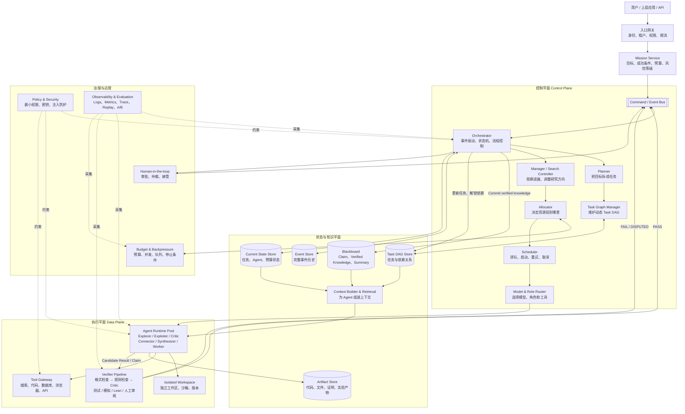
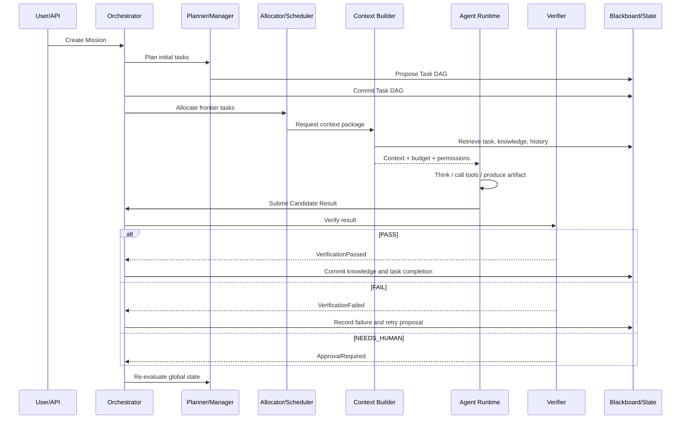
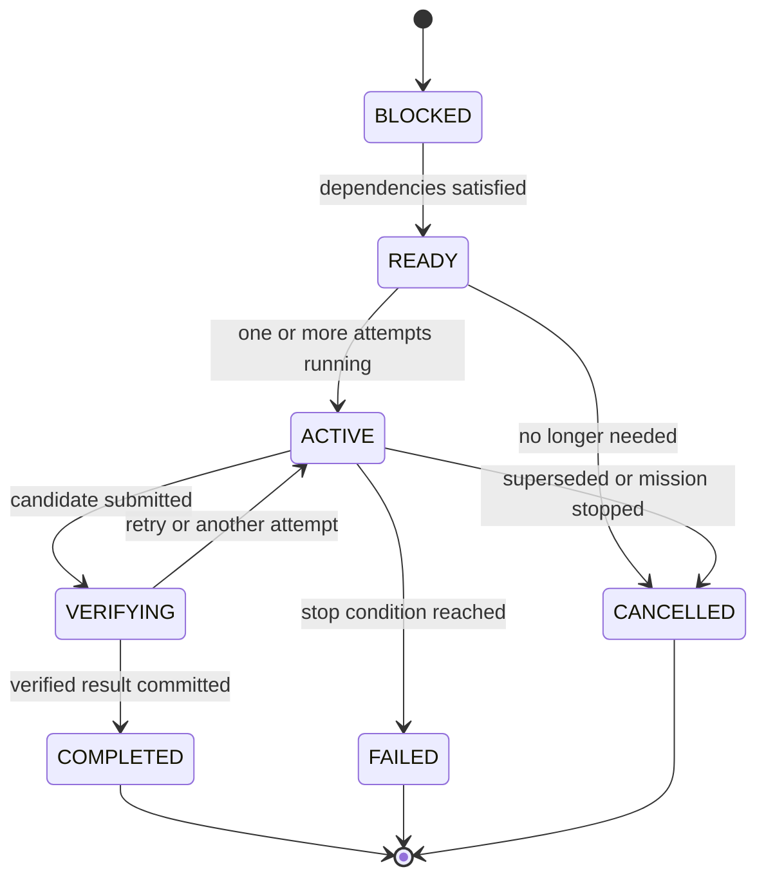

# Agent 编排层完整设计方案

> 目标：设计一套能够规划任务、并行调用多个 Agent、共享知识、验证结果、控制预算、处理失败并在崩溃后恢复的 Agent 编排层。
>
> 核心定位：它不是“让几个 Agent 互相聊天”的框架，而是一套 **Agent 操作系统**。

---

## 目录

1. [先理解它到底是什么](#1-先理解它到底是什么)
2. [设计目标与基本原则](#2-设计目标与基本原则)
3. [完整架构图](#3-完整架构图)
4. [核心运行闭环](#4-核心运行闭环)
5. [Mission：定义整个任务](#5-mission定义整个任务)
6. [Task DAG：任务与依赖关系](#6-task-dag任务与依赖关系)
7. [Planner、Manager 与 Search Controller](#7-plannermanager-与-search-controller)
8. [Frontier、Allocator 与 Scheduler](#8-frontierallocator-与-scheduler)
9. [Role 与 Model Router](#9-role-与-model-router)
10. [Context Builder 与 Retrieval](#10-context-builder-与-retrieval)
11. [Blackboard 与知识压缩](#11-blackboard-与知识压缩)
12. [Agent Runtime 与生命周期](#12-agent-runtime-与生命周期)
13. [Agent 输出协议](#13-agent-输出协议)
14. [Verifier 验证体系](#14-verifier-验证体系)
15. [Proposal 与 Commit](#15-proposal-与-commit)
16. [State、Event 与 Durable Execution](#16-stateevent-与-durable-execution)
17. [并发、冲突与幂等](#17-并发冲突与幂等)
18. [Budget、Cost 与 Backpressure](#18-budgetcost-与-backpressure)
19. [停止、停滞、死锁与目标漂移](#19-停止停滞死锁与目标漂移)
20. [Workspace 与 Artifact](#20-workspace-与-artifact)
21. [工具、安全与权限](#21-工具安全与权限)
22. [Human-in-the-loop](#22-human-in-the-loop)
23. [Observability、Tracing 与 Evaluation](#23-observabilitytracing-与-evaluation)
24. [一次任务从开始到结束](#24-一次任务从开始到结束)
25. [状态机设计](#25-状态机设计)
26. [核心数据契约](#26-核心数据契约)
27. [代码模块划分](#27-代码模块划分)
28. [分阶段落地路线](#28-分阶段落地路线)
29. [第一版推荐配置](#29-第一版推荐配置)
30. [验收清单](#30-验收清单)
31. [最终心智模型](#31-最终心智模型)

---

# 1. 先理解它到底是什么

一个普通 Agent 应用常常是：

```text
用户输入
   ↓
LLM
   ↓
调用工具
   ↓
返回答案
```

一个真正的 Agent 编排层则需要回答更多问题：

```text
这个目标应该拆成哪些任务？
哪些任务可以并行？
应该给哪个任务多少 Agent？
Agent 应该看到哪些上下文？
Agent 的结果能不能相信？
多个 Agent 结果冲突怎么办？
预算快用完时怎么办？
系统崩溃后怎么继续？
哪些操作必须让人审批？
怎么知道系统为什么成功或失败？
```

所以它更像：

```text
任务管理系统
+
搜索与资源调度系统
+
Agent 运行时
+
共享知识系统
+
验证系统
+
安全与治理系统
+
可观测与评估系统
```

一句话概括：

> **把大量可能犯错、可能超时、可能失败的 Agent，组织成一个有状态、有验证、有预算、可恢复、可观察的可靠系统。**

---

# 2. 设计目标与基本原则

## 2.1 设计目标

这套编排层应该支持：

- 动态拆解和修改任务；
- 多个 Agent 并行探索；
- 不同 Agent 采用不同角色、模型和策略；
- 跨分支共享经过筛选的知识；
- 对候选结果进行独立验证；
- 控制 Token、时间、并发和工具费用；
- 处理超时、崩溃、重复事件和并发冲突；
- 对高风险操作进行人工审批；
- 完整追踪每个结论是如何产生的；
- 通过评估数据持续改进编排策略。

## 2.2 四条铁律

### 原则一：Agent 可以并行思考，但不能随便修改系统状态

```text
Agent 可以提出：
“我建议新增任务 C。”

但不能直接执行：
“我已经把 Task DAG 改好了。”
```

### 原则二：Agent 只提交 Proposal，系统负责 Commit

```text
Agent Proposal
      ↓
检查、去重、验证、权限判断
      ↓
Orchestrator Commit
      ↓
正式状态
```

### 原则三：未经验证的结论只能叫 Claim，不能叫事实

```text
Agent 提出的结论       → PROPOSED
有一些证据支持         → SUPPORTED
通过外部验证           → VERIFIED
被证明错误             → REJECTED
存在冲突               → DISPUTED
```

### 原则四：重要状态必须持久化

系统不能依赖一个永远不崩溃的 Python 进程。任务、事件、预算、结果和验证状态都必须保存到可靠存储中。

---

# 3. 完整架构图



## 3.1 通俗类比

| 模块 | 通俗理解 |
|---|---|
| Mission | 公司这次到底要完成什么目标 |
| Planner | 制定研究或执行计划的人 |
| Task DAG | 任务地图，以及谁依赖谁 |
| Manager | 研究组组长，负责持续推进 |
| Allocator | 决定人力和预算投到哪里 |
| Scheduler | 排班、排队和启动任务 |
| Agent | 实际干活的人 |
| Context Builder | 给员工准备工作资料 |
| Blackboard | 团队共享知识库 |
| Synthesizer | 汇总多人发现的组长 |
| Verifier | 质量检查和验收部门 |
| Orchestrator | 整个公司的操作系统 |
| Event Store | 完整操作历史 |
| Observability | 仪表盘、监控和复盘系统 |

---

# 4. 核心运行闭环

系统不断执行：

```text
观察当前状态
      ↓
规划或调整任务
      ↓
选择值得处理的 Frontier
      ↓
分配角色、模型、Agent 和预算
      ↓
执行任务
      ↓
提交候选结果
      ↓
验证结果
      ↓
Commit 正式状态与知识
      ↓
重新观察
```

可以浓缩成：

```text
Observe → Plan → Allocate → Execute → Verify → Commit → Repeat
```

这是一个 **Control Loop**，而不是完全固定的 Workflow。

```text
固定 Workflow：
A → B → C → 结束

研究型 Control Loop：
做一步 → 看结果 → 再决定下一步
```

---

# 5. Mission：定义整个任务

Mission 是一次完整运行的“任务章程”。它不能只是一个模糊 Prompt。

至少要说明：

```text
目标是什么？
怎样算成功？
最多花多少资源？
允许使用哪些工具？
风险等级是什么？
什么时候停止？
```

示例：

```yaml
mission:
  id: "mission-001"
  goal: "证明 Theorem X，或者找到可验证反例"

  success_criteria:
    - "完整证明通过 Lean"
    - "或者反例可以被程序复现"

  budget:
    max_agents: 100
    max_concurrency: 20
    max_tokens: 10000000
    max_runtime_seconds: 28800

  risk_level: "research"

  allowed_tools:
    - "paper_search"
    - "python_sandbox"
    - "lean"

  stop_conditions:
    - "verification_passed"
    - "budget_exhausted"
    - "five_rounds_without_progress"
```

Mission 也是所有子任务的根目标。任何新任务都必须能说明它和 Mission 的关系。

---

# 6. Task DAG：任务与依赖关系

## 6.1 为什么使用 DAG

一个复杂目标要拆成多个任务：

```text
                 主问题 X
                /       \
          Approach A   Approach B
            /    \          |
        Lemma A1 A2      Lemma B1
```

多个任务还可能共享同一个前置结果：

```text
         Lemma C
        /       \
    Task A     Task B
```

因此不能只用树，而应该使用 **有向无环图 DAG**。

## 6.2 动态 Task DAG

科研或开放任务无法在一开始就画出完整路线。Task DAG 应该允许运行时生长：

```text
开始：
Problem

第一轮后：
Problem
├── A
├── B
└── C

第二轮后：
Problem
├── A
│   ├── A1
│   └── A2
├── B
└── C
    └── C1
```

## 6.3 Task Contract

每个 Task 都必须是一份可检查的契约：

```yaml
task:
  id: "task-A2"
  mission_id: "mission-001"

  goal: "证明 Lemma A2"
  root_goal: "证明 Theorem X"
  rationale: "完成后可解锁 Approach A"

  dependencies:
    - "task-C1"

  success_criteria:
    - "提交 Lean 可检查证明"

  status: "READY"
  priority: 8.5
  estimated_cost_tokens: 500000

  allowed_tools:
    - "lean"
    - "python_sandbox"
    - "paper_search"

  verification_policy:
    - "format_check"
    - "critic_review"
    - "lean_check"

  budget:
    max_attempts: 6
    max_tokens: 500000
    max_runtime_seconds: 3600

  version: 12
```

不好的任务：

```text
“研究一下方法 A。”
```

好的任务：

```text
“证明或否定 Lemma A；成功条件为 Lean 通过，或提供可执行反例；最多 3 次尝试。”
```

---

# 7. Planner、Manager 与 Search Controller

## 7.1 Planner：画地图

Planner 负责：

```text
把根目标拆成子任务；
提出可能的解决路线；
定义任务之间的依赖；
发现需要补充的前置任务。
```

它主要创建和修改 Task DAG，不负责直接执行每个任务。

## 7.2 Manager：带队走地图

Manager 观察当前进展：

```text
A 有突破；
B 卡住；
C 已经重复失败；
D 出现一个关键新结论。
```

然后提出调整：

```text
减少 B 的 Agent；
深挖 A；
给 D 增加 Critic；
把 C 拆得更小。
```

## 7.3 Search Controller：决定搜索策略

Search Controller 处理：

```text
哪些分支继续展开？
哪些分支暂时剪枝？
如何平衡探索和利用？
哪个方向应该做 Best-of-N？
哪个方向应该做 Tree Search？
是否需要保留少量低分但未探索路线？
```

小系统中，Manager 和 Search Controller 可以合并。大系统中可以分层：

```text
Global Manager
├── Group Manager A
├── Group Manager B
└── Group Manager C
```

底层 Manager 看细节，全局 Manager 只看压缩摘要。

---

# 8. Frontier、Allocator 与 Scheduler

## 8.1 Frontier

Frontier 是当前满足依赖、尚未完成、值得继续处理的任务集合。

```text
             X
           /   \
          A     B
        /  \     \
       C✓  D?     E?
```

当前 Frontier 可能是 D 和 E。

## 8.2 Allocator：分蛋糕

Allocator 决定：

```text
处理哪些任务；
每个任务给多少 Agent；
使用哪些角色；
使用什么模型；
分配多少 Token、时间和工具预算。
```

一个通俗的优先级公式：

```text
Priority =
    重要性
  + 解锁价值
  + 当前有希望程度
  + 未探索程度
  + 等待时间
  - 预计成本
  - 结果重复度
  - 风险
  - 下游积压惩罚
```

示例：

```text
Task D：
  Exploiter × 6
  Critic × 2
  Verifier × 1
  Token Budget = 1.5M

Task E：
  Explorer × 2
  Failure Analyst × 1
  Token Budget = 300k
```

## 8.3 Scheduler：安排谁何时运行

Allocator 说“D 应该分到 9 个 Agent”，Scheduler 才负责：

```text
哪些现在启动；
哪些进入等待队列；
在哪个 Worker 或 GPU 上运行；
谁超时；
谁需要重试；
任务被别人完成后取消哪些冗余 Attempt。
```

```text
Allocator = 给多少
Scheduler = 什么时候、在哪里执行
```

---

# 9. Role 与 Model Router

## 9.1 为什么不能复制相同 Agent

如果 20 个 Agent 拿到完全相同的 Prompt、上下文和策略，它们很可能产生高度相似的答案。

真正有效的多 Agent 系统要制造 **搜索多样性**。

## 9.2 推荐角色

| 角色 | 主要职责 |
|---|---|
| Explorer | 寻找全新路线和不同假设 |
| Exploiter | 把当前最好路线继续做深 |
| Critic | 找错误、反例和隐藏假设 |
| Simplifier | 从特殊情况、简化版本入手 |
| Connector | 连接不同分支里的知识 |
| Failure Analyst | 分析重复失败的共同原因 |
| Synthesizer | 合并多个 Agent 的有效部分 |
| Verifier | 负责独立检查与验收 |

Role 不是职位名称装饰，而是一种 **搜索偏置**。

## 9.3 Model Routing

不同任务不必都使用最强模型：

```text
简单分类、格式转换     → 小模型
批量去重、摘要         → 快速长上下文模型
任务拆解、路线判断     → 强推理模型
代码、形式化证明       → 代码或领域专用模型
最终关键候选           → 最强模型
确定性验证             → 程序、测试、Lean
```

可以采用升级策略：

```text
便宜模型先尝试
      ↓
失败或低置信
      ↓
换更强模型
      ↓
仍失败
      ↓
拆任务、换策略或人工介入
```

---

# 10. Context Builder 与 Retrieval

Agent 的表现不仅取决于模型，还取决于系统给了它什么上下文。

每次创建 Agent，Context Builder 应组装：

```text
1. Mission 根目标
2. 当前 Task Contract
3. 父任务和直接依赖
4. 当前分支摘要
5. 相关 Verified Knowledge
6. 相关失败历史
7. 有争议的 Claim（必须标记）
8. Verifier 最近反馈
9. 可用工具与权限
10. Token、时间和调用预算
11. 结构化输出要求
```

## 10.1 检索不能只看向量相似度

推荐综合：

```text
语义相关性
+
Task DAG 距离
+
知识可信等级
+
知识新旧
+
分支相关性
+
历史复用价值
-
重复内容
-
已被取代内容
```

## 10.2 默认可见性策略

- Worker 默认只把 Verified Knowledge 当成事实；
- Explorer 可以看到低可信度的新想法，但必须明确标记；
- Critic 应看到候选结论、失败记录和反对证据；
- Verifier 应尽量独立，不应只看到原作者的自我解释；
- 密钥、隐藏权限和不必要的敏感数据不得进入模型上下文。

---

# 11. Blackboard 与知识压缩

Blackboard 不是简单的聊天记录数据库。推荐分四层：

```text
Raw Logs
保存全部原始过程

Candidate Claims
Agent 提出的候选结论

Verified Knowledge
经过验证、其他 Agent 可以依赖的知识

Summaries
组内和全局压缩摘要
```

## 11.1 知识对象示例

```yaml
knowledge:
  id: "K-1027"
  mission_id: "mission-001"
  type: "lemma"

  claim: "在条件 α 下，Lemma X 成立"
  status: "VERIFIED"

  proposed_by: "agent-71"
  source_task: "task-A3"
  source_attempt: "attempt-17"

  evidence:
    - "artifact-proof-28"

  verifier:
    type: "lean"
    result: "PASS"

  dependencies:
    - "K-981"
    - "K-1002"

  useful_for:
    - "task-B7"
    - "task-C4"

  supersedes: null
  created_at: "2026-09-10T10:00:00Z"
```

## 11.2 Provenance：知识血缘

每条正式知识都应该知道：

```text
谁提出的？
来自哪个 Task 和 Attempt？
基于哪些已有知识？
由谁修改过？
经过什么验证？
被哪些任务使用？
是否已被新结论取代？
```

## 11.3 Synthesizer 的作用

Synthesizer 不是只选“冠军答案”，而是：

```text
提取 A 的主路线；
使用 B 的关键 Lemma；
避开 C 找出的漏洞；
引入 D 的参考资料；
合并 E 的局部证明。
```

知识压缩循环：

```text
大量 Agent 探索
       ↓
海量原始消息
       ↓
候选发现
       ↓
结构化知识
       ↓
组内摘要
       ↓
全局摘要
       ↓
下一轮 Agent 使用
```

---

# 12. Agent Runtime 与生命周期

Agent 最好是临时、可替换的运行单元，而不是长期保存所有状态的“超级员工”。

## 12.1 Task 与 Attempt

```text
Task = 研究目标
Attempt = 针对这个目标的一次具体尝试
```

同一个 Task 可以有多个 Attempt：

```text
Task D
├── Attempt 1：Explorer
├── Attempt 2：Exploiter
├── Attempt 3：Critic
└── Attempt 4：更强模型
```

## 12.2 生命周期

```text
创建 Attempt
      ↓
领取任务
      ↓
组装上下文
      ↓
启动 Agent
      ↓
思考、调用工具、观察
      ↓
提交候选结果
      ↓
验证
      ↓
完成 / 重试 / 分裂 / 终止
```

## 12.3 Agent 可以产生的结果

Agent 的产出不只包括最终答案，还可以是：

```text
候选结论；
失败原因；
反例；
新的子任务；
新的搜索路线；
资源申请；
冲突报告；
代码、证明或实验 Artifact。
```

---

# 13. Agent 输出协议

不要让 Agent 只返回一大段自然语言。应定义统一的 Result Envelope：

```yaml
result:
  result_id: "result-9001"
  mission_id: "mission-001"
  task_id: "task-A2"
  attempt_id: "attempt-17"

  outcome: "candidate"
  # candidate / blocked / failure / proposed_subtasks / no_progress

  summary: "找到了条件 α 下的局部证明，但无法去掉 α"

  claims:
    - content: "Lemma A2 在条件 α 下成立"
      confidence: 0.72
      status: "PROPOSED"

  evidence:
    - "artifact-proof-31"
    - "tool-run-882"

  proposed_tasks:
    - goal: "证明条件 α 可以被移除"
      reason: "这是完成父任务的剩余阻塞点"
      estimated_cost_tokens: 200000

  used_knowledge:
    - "K-1027"
    - "K-1091"

  risks:
    - "步骤 7 尚未形式化验证"

  requested_followup:
    - "critic_review"
    - "lean_check"

  cost:
    input_tokens: 12000
    output_tokens: 18000
    tool_calls: 7
    runtime_seconds: 523
```

Agent 只能提交候选结果，不能直接把 Task 改成 COMPLETED。

---

# 14. Verifier 验证体系

## 14.1 分层验证

```text
第一层：Schema / 格式检查
        ↓
第二层：确定性规则检查
        ↓
第三层：独立 Critic
        ↓
第四层：测试、模拟或实验
        ↓
第五层：形式化验证
        ↓
第六层：必要时人工审核
```

## 14.2 不同领域的验证器

| 任务类型 | 推荐验证器 |
|---|---|
| 代码 | 编译、单元测试、集成测试、安全扫描 |
| 数学 | Lean、Coq、Isabelle、符号计算 |
| SQL | 测试数据库、约束检查、结果断言 |
| 网页 | 浏览器行为检查、截图或 DOM 断言 |
| 科学实验 | 模拟、统计检验、重复实验 |
| 企业流程 | 规则引擎、审批流、审计检查 |
| 文档 | Schema、引用、事实核查、人工审核 |

## 14.3 Claim 状态

```text
PROPOSED
   ↓
UNDER_REVIEW
   ↓
SUPPORTED
   ↓
VERIFIED
```

也可能变成：

```text
REJECTED
DISPUTED
SUPERSEDED
```

只有 VERIFIED 才能成为正式知识。

## 14.4 冲突处理

当两个 Agent 得出相反结论时：

```text
保留双方 Claim
      ↓
标记 DISPUTED
      ↓
创建 Conflict Task
      ↓
派 Critic / Arbiter
      ↓
执行外部验证
      ↓
Commit 结论
```

不能简单多数投票，因为多个相同模型可能共同犯错。

---

# 15. Proposal 与 Commit

这是整个系统最重要的状态保护机制。

```text
Agent 负责 Proposal
系统负责 Commit
```

Agent 可以提出：

```text
新增 Task；
提高优先级；
申请更多预算；
把某个 Claim 标记为候选；
建议停止某条路线。
```

但真正修改正式状态的只能是 Commit Service：

```text
Agent Proposal
      ↓
Schema 检查
      ↓
权限检查
      ↓
去重和版本检查
      ↓
必要的 Verifier
      ↓
Orchestrator Commit
      ↓
正式 State / Task DAG / Blackboard
```

因此：

- Agent 不直接修改 Task DAG；
- Agent 不直接扣减或增加全局预算；
- Agent 不直接把 Claim 写成事实；
- Agent 不直接无限创建新 Agent；
- Agent 不直接执行高风险真实世界操作。

> （2026-10-07 补注，偏离 #52，独立裁决 `推后第3批-偏差裁决.md` 第 4 件）桌面版只开放申请"工具调用次数"一种资源。执行者在工具次数用完、被拒绝时，从拒绝话里得知可在 blocked 结果里附申请；不改执行者模板与工具说明。申请交规划器判：选原样重试即批准，Harness 只核上限与额度。执行者的单回合循环上限比工具上限多留一轮余量，使拒绝话能到达执行者（同审阅员做法；R3-3 补裁并入 #52）。

这可以概括为：

> **分布式思考，集中式提交。**

---

# 16. State、Event 与 Durable Execution

## 16.1 State

State 表示系统现在是什么情况：

```text
Task A = COMPLETED
Task B = RUNNING
Task C = BLOCKED
Agent 17 = ACTIVE
Budget Remaining = 41%
```

## 16.2 Event

Event 表示刚刚发生了什么：

```text
MissionCreated
TaskCommitted
AttemptStarted
HeartbeatReceived
ResultSubmitted
VerificationPassed
VerificationFailed
TaskCompleted
BudgetReserved
BudgetReleased
```

可以理解为：

```text
State = 当前照片
Event = 完整录像中的一帧事件
```

## 16.3 推荐保存方式

```text
Event Store
保存完整历史

+

Current State Store
保存当前可快速查询状态
```

## 16.4 Durable Execution

系统崩溃后恢复：

```text
读取 Mission、Task 和 Attempt 状态
      ↓
COMPLETED 不重跑
      ↓
PENDING 重新入队
      ↓
RUNNING 但 Lease 过期 → 新建 Attempt
      ↓
SUBMITTED 但未验证 → 重新进入验证队列
      ↓
恢复预算、Task DAG 和 Blackboard
      ↓
继续执行
```

恢复的是可靠工作步骤，不一定是模型生成到一半的某个 Token。

---

# 17. 并发、冲突与幂等

## 17.1 原子领取

同一个 Attempt 不能被两个 Agent 同时领取：

```text
只有当 Attempt.status == PENDING 时
才允许改成 CLAIMED
```

使用 Compare-and-Swap 或数据库原子更新。

## 17.2 Task 可以有多个 Attempt

多 Agent 同时探索同一个 Task 是允许的：

```text
Task D
├── Attempt 1：方法 A
├── Attempt 2：方法 B
└── Attempt 3：找反例
```

但一个 Attempt 只能有一个执行者。

## 17.3 版本号

Task DAG 和关键对象需要版本号：

```text
Graph Version 42
      ↓ 修改成功
Graph Version 43
```

基于旧版本提交的 Proposal 必须重新检查或合并，避免 Lost Update。

## 17.4 Idempotency 幂等性

每个动作有唯一 ID：

```text
event_id
attempt_id
allocation_id
result_id
commit_id
```

同一事件重复到达，不会重复创建 Agent、重复扣费或重复触发下游任务。

## 17.5 Single Writer

关键正式状态由唯一逻辑写入服务管理：

```text
Mission 状态
Task 状态
正式 Knowledge
全局 Budget
Task DAG 主版本
```

Agent 只能提交 Proposal。

## 17.6 Lease 与 Heartbeat

```text
Attempt 17
由 Agent 31 执行
Lease 有效 60 秒
```

Agent 周期性发送 Heartbeat。心跳停止后：

```text
Lease 过期
      ↓
Attempt 标记 LOST
      ↓
任务重新调度
```

---

# 18. Budget、Cost 与 Backpressure

## 18.1 Budget 不只是钱

预算可以包括：

```text
Token
Agent 数量
并发数量
GPU 时间
总运行时间
工具调用次数
搜索次数
真实费用
```

> （2026-10-07 补注，偏离 #51，独立裁决 `推后第3批-偏差裁决.md` 第 3 件）桌面版预算维度：Token、尝试次数、执行者数、并发、总运行时间、工具调用次数、搜索次数。GPU 时间不做：桌面编排不用本机 GPU，没有可数的事实来源。出现本机 GPU 推理时另立项。

## 18.2 分层预算

```text
Global Budget
├── Mission A Budget
│   ├── Task A1
│   └── Task A2
└── Mission B Budget
```

子任务预算来自父任务，不得凭空放大：

```text
Task A：10M tokens

A1：4M
A2：3M
A3：2M
预留：1M
```

## 18.3 Reserve 与 Settle

Attempt 启动前：

```text
Reserve 最大预算
      ↓
启动 Agent
      ↓
记录实际 Cost
      ↓
Settle 结算
      ↓
释放未使用预算
```

避免并发 Agent 同时超支。

## 18.4 Cost 归因

每次 Attempt 都记录：

```text
模型
输入 Token
输出 Token
工具调用
运行时间
GPU 时间
结果状态
是否产生可复用知识
是否进入最终成功路径
```

## 18.5 Backpressure

当下游处理不过来时，上游必须减速。

```text
Worker 每分钟提交 1000 个结果
Verifier 每分钟只能处理 50 个
```

系统应：

```text
降低 Worker 并发；
提高 Verifier 资源；
暂停低优先级任务；
禁止新任务继续分裂；
合并重复候选；
缩小每个 Attempt 预算。
```

需要设置：

```text
最大运行 Agent 数
最大等待任务数
最大待验证结果数
单 Task 最大 Attempt 数
最大 Task DAG 深度
单 Agent 最大子任务 Proposal 数
```

> （2026-10-07 补注，偏离 #53，独立裁决 `推后第3批-偏差裁决.md` 第 6 件）桌面版积压应对的口径：①"提高 Verifier 资源"= 待审结果维升起时审阅并发升到上限，默认上限 = max(审阅数, min(2 × 审阅数, 模型调用名额))，桌面默认配置下不增加，回落后恢复；②"禁止新任务继续分裂"= 积压期间已有计划的任务不开新规划轮，首次规划不受影响，最长 600 秒，期间算合法等待——Harness 事先不知道哪一轮会拆，不做语义区分；③"合并重复候选"不做（判断重复是语义判断）。

## 18.6 进展而不是忙碌

系统不能只看调用次数，应看：

```text
是否出现新思路；
是否产生可验证 Lemma；
是否减少不确定性；
是否解锁关键任务；
是否找到明确失败原因；
结果重复率是否下降。
```

---

# 19. 停止、停滞、死锁与目标漂移

## 19.1 停止条件

```text
Verifier PASS；
预算耗尽；
连续多轮无新知识；
结果重复率过高；
新增 Agent 边际价值很低；
所有高价值 Frontier 已处理；
人工决定停止。
```

## 19.2 停滞检测

例如连续 5 轮：

```text
没有新节点；
没有新 Knowledge；
Verifier 分数无提升；
结果相似度超过 90%。
```

可采取：

```text
换模型；
换角色；
重新组装上下文；
派 Failure Analyst；
拆小任务；
暂停或终止分支。
```

## 19.3 Deadlock

```text
Task A 等待 B
Task B 等待 C
Task C 等待 A
```

每次添加依赖边时必须做环检测。

## 19.4 Starvation

长期低优先级任务可能永远得不到资源。可使用优先级老化：

```text
等待越久，优先级逐渐增加
```

## 19.5 Goal Drift

每个 Task 都必须说明：

```text
它和根目标有什么关系？
它会解锁什么？
为什么值得继续？
```

无法解释的任务应降级、暂停或删除。

---

# 20. Workspace 与 Artifact

## 20.1 独立 Workspace

多个 Agent 不应直接共享同一个可写目录：

```text
Attempt 1 → Workspace A
Attempt 2 → Workspace B
Attempt 3 → Workspace C
```

这可以避免文件覆盖和环境污染。

## 20.2 Artifact

Agent 产生的非文本结果都作为 Artifact 管理：

```text
代码
补丁
证明文件
数据集
实验结果
日志
图表
模型输出
数据库变更计划
```

示例：

```yaml
artifact:
  id: "artifact-31"
  mission_id: "mission-001"
  task_id: "task-A2"
  attempt_id: "attempt-17"

  type: "lean_proof"
  workspace: "workspace-A"
  version: 4
  content_hash: "sha256:..."

  produced_by: "agent-71"
  verification_status: "PASS"
  storage_uri: "object://artifacts/artifact-31"
```

## 20.3 合并过程

```text
多个独立 Artifact
      ↓
测试和验证
      ↓
选择或 Synthesizer 合并
      ↓
生成新的 Candidate Artifact
      ↓
再次验证
      ↓
Commit 为正式版本
```

---

# 21. 工具、安全与权限

## 21.1 Tool Gateway

Agent 不直接访问真实系统。所有工具调用通过统一网关：

```text
Agent Tool Request
      ↓
身份和权限检查
      ↓
参数 Schema 检查
      ↓
风险与政策检查
      ↓
速率和预算检查
      ↓
执行工具
      ↓
记录结果与审计日志
```

## 21.2 最小权限

```text
只读研究 Agent → 只读权限
代码 Agent       → 沙箱文件系统
数据库分析 Agent → 只读副本
生产部署 Agent   → 需要审批的短期权限
财务 Agent       → 不能直接支付
```

## 21.3 Prompt Injection 防护

外部网页、邮件、文档和其他 Agent 消息都可能是不可信内容。

需要：

```text
明确区分“指令”和“数据”；
外部内容不能改变系统权限；
密钥不进入模型上下文；
使用短期 Capability Token；
对 Blackboard 写入做验证和来源标记；
高风险工具调用使用独立政策检查；
对可疑指令进行隔离和审计。
```

---

# 22. Human-in-the-loop

人工不需要参与所有步骤，而应出现在高风险、高不确定或长期停滞的位置。

推荐风险等级：

```text
L0：只读研究，自动执行
L1：沙箱内可逆操作，自动执行
L2：生产环境修改，需要一次审批
L3：付款、删除、敏感数据，需要双重审批
```

适合人工介入的情况：

```text
不可逆操作；
高成本资源申请；
多个 Verifier 冲突；
长时间无进展；
需要提升权限；
生产环境变更；
法律、财务或安全高风险决策；
模型无法可靠判断成功条件。
```

人工动作也要作为 Event 保存：

```text
ApprovalRequested
ApprovalGranted
ApprovalRejected
HumanOverride
HumanCommentAdded
```

---

# 23. Observability、Tracing 与 Evaluation

## 23.1 Logs、Metrics 与 Trace

```text
Logs   = 一件件发生了什么
Metrics = 整体健康和效果如何
Trace  = 某个任务从头到尾经历了什么
```

每个对象应包含：

```text
trace_id
mission_id
task_id
attempt_id
agent_id
model_version
prompt_version
retrieval_version
allocator_version
verifier_version
```

## 23.2 监控指标

| 类别 | 指标 |
|---|---|
| 系统健康 | 并发数、队列长度、超时率、工具错误率 |
| 成本 | Token、时间、工具费用、每成功任务成本 |
| 搜索质量 | 新思路数、分支剪枝率、结果重复率 |
| 知识质量 | Claim 验证率、污染率、复用率 |
| 验证质量 | PASS 率、误报率、积压量 |
| 最终效果 | Mission 成功率、完成时间、稳定性 |

## 23.3 Lineage 与贡献归因

最终答案通常由多个 Agent 共同完成：

```text
Final Proof
   ├── Formula F ← Explorer
   ├── Lemma X   ← Worker
   ├── Bug Fix   ← Critic
   └── Assembly  ← Synthesizer
```

需要记录哪些知识位于最终成功路径上。

## 23.4 Evaluation 方法

```text
Offline Evaluation
固定任务集重复测试

A/B Test
比较两种 Allocator 或 Prompt

Ablation
移除 Critic、Blackboard、动态调度等组件，观察变化

Replay
用历史 Event 和 Trace 重放失败过程
```

不要只看“Agent 数量”和“消息数量”，要看是否真的提高：

```text
成功率；
验证通过率；
知识复用；
成本效率；
任务完成速度；
系统稳定性。
```

---

# 24. 一次任务从开始到结束

## 第 1 步：创建 Mission

定义：

```text
目标
成功条件
预算
权限
风险等级
停止条件
```

## 第 2 步：Planner 生成初始 Task DAG

```text
主问题
├── Approach A
├── Approach B
└── Approach C
```

## 第 3 步：Graph Manager 检查并 Commit

检查：

```text
是否重复；
是否形成环；
是否有明确成功条件；
是否和根目标相关；
预算是否合法。
```

## 第 4 步：Manager 找到 Frontier

选出当前可执行、有价值的节点。

## 第 5 步：Allocator 分配资源

决定：

```text
任务
角色
模型
Agent 数量
Token 预算
时间预算
工具权限
```

## 第 6 步：Scheduler 创建 Attempt

```text
Reserve Budget
      ↓
创建 Attempt
      ↓
分配 Lease
      ↓
进入运行队列
```

## 第 7 步：Context Builder 组装上下文

读取：

```text
Task DAG
Blackboard
失败记录
Verifier 反馈
工具能力
权限和预算
```

## 第 8 步：Agent 在隔离 Workspace 中执行

```text
思考
 ↓
调用工具
 ↓
观察结果
 ↓
继续推理
 ↓
发送 Heartbeat
```

## 第 9 步：提交 Candidate Result

Agent 只能提交：

```text
Claim
Evidence
Artifact
Failure Report
Proposed Subtasks
Resource Request
```

## 第 10 步：Verifier 检查

结果：

```text
PASS
FAIL
DISPUTED
NEEDS_HUMAN
```

## 第 11 步：Orchestrator Commit

PASS：

```text
Claim → Verified Knowledge
Task → COMPLETED
解锁下游任务
结算预算
记录 Event
```

FAIL：

```text
记录失败原因
创建修复任务
换策略或模型
降低优先级
或终止分支
```

## 第 12 步：Synthesizer 压缩知识

```text
总结本轮发现
      ↓
更新全局知识状态
      ↓
Manager 重新判断方向
      ↓
进入下一轮
```

运行时序图：



---

# 25. 状态机设计

## 25.1 Task 状态机



## 25.2 Attempt 状态机

```text
PENDING
   ↓ claim
CLAIMED
   ↓ start
RUNNING
   ↓ submit
SUBMITTED
   ↓
VERIFYING
  /        \
PASS       FAIL
 │          │
 ▼          ▼
COMPLETED  RETRY_WAIT
              │
              └──→ PENDING（新 Attempt）
```

其他状态：

```text
LOST
TIMED_OUT
CANCELLED
SUPERSEDED
```

## 25.3 Claim 状态机

```text
PROPOSED
   ↓
UNDER_REVIEW
   ├──→ VERIFIED
   ├──→ REJECTED
   ├──→ DISPUTED
   └──→ SUPPORTED

VERIFIED
   └──→ SUPERSEDED（出现更准确的新版本）
```

---

# 26. 核心数据契约

真正开始开发前，优先固定六个契约。

## 26.1 Mission Schema

```yaml
mission:
  id: string
  goal: string
  success_criteria: [string]
  stop_conditions: [string]
  allowed_tools: [string]
  risk_level: string
  budget: object
  tenant_id: string
  status: string
  created_at: datetime
  version: integer
```

## 26.2 Task Contract

```yaml
task:
  id: string
  mission_id: string
  parent_task_ids: [string]
  dependency_ids: [string]
  goal: string
  rationale: string
  success_criteria: [string]
  verification_policy: [string]
  allowed_tools: [string]
  budget: object
  priority: number
  status: string
  version: integer
```

## 26.3 Attempt Schema

```yaml
attempt:
  id: string
  task_id: string
  role: string
  model: string
  prompt_version: string
  context_version: string
  budget_reserved: object
  lease_owner: string
  lease_expires_at: datetime
  status: string
  retry_of: string | null
```

## 26.4 Result Envelope

```yaml
result:
  id: string
  task_id: string
  attempt_id: string
  outcome: string
  summary: string
  claims: [object]
  evidence: [string]
  artifacts: [string]
  proposed_tasks: [object]
  used_knowledge: [string]
  risks: [string]
  cost: object
```

## 26.5 Claim / Knowledge Schema

```yaml
claim:
  id: string
  content: string
  type: string
  status: string
  source_task: string
  source_attempt: string
  evidence: [string]
  dependencies: [string]
  verifier_results: [object]
  confidence_metadata: object
  supersedes: string | null
```

## 26.6 Event Schema

```yaml
event:
  id: string
  type: string
  trace_id: string
  mission_id: string
  task_id: string | null
  attempt_id: string | null
  actor_type: string
  actor_id: string
  payload: object
  idempotency_key: string
  created_at: datetime
  schema_version: integer
```

---

# 27. 代码模块划分

第一版建议保持“模块化单体”，不要一开始就拆成大量微服务。

```text
agent_orchestrator/
├── api/
│   ├── missions
│   ├── tasks
│   └── approvals
│
├── orchestrator/
│   ├── event_handler
│   ├── state_machine
│   └── commit_service
│
├── planning/
│   ├── planner
│   ├── manager
│   └── search_controller
│
├── graph/
│   ├── task_graph
│   ├── dependency_checker
│   └── deduplicator
│
├── scheduling/
│   ├── allocator
│   ├── scheduler
│   ├── leases
│   └── backpressure
│
├── runtime/
│   ├── agent_worker
│   ├── model_router
│   ├── role_templates
│   └── tool_gateway
│
├── context/
│   ├── context_builder
│   ├── retrieval
│   └── compression
│
├── memory/
│   ├── blackboard
│   ├── claims
│   ├── verified_knowledge
│   └── summaries
│
├── verification/
│   ├── verifier_router
│   ├── critics
│   ├── deterministic_checks
│   └── human_review
│
├── artifacts/
│   ├── workspace
│   ├── artifact_store
│   └── versioning
│
├── governance/
│   ├── budgets
│   ├── permissions
│   ├── policies
│   └── secrets
│
└── observability/
    ├── logs
    ├── metrics
    ├── traces
    ├── replay
    └── evaluation
```

## 27.1 最小基础设施

第一版通常只需要：

```text
一个 API / Control Service
一个关系数据库
一个任务队列
一个对象存储
若干 Agent Worker
一个或多个 Verifier Worker
一个监控系统
```

可以把逻辑模块放在同一个服务中，等边界稳定后再拆服务。

---

# 28. 分阶段落地路线

## 第一阶段：可靠单 Manager 系统

实现：

```text
Mission
Task DAG
Task / Attempt 状态机
Event Store
Scheduler
Agent Runtime
Verifier
预算和重试
Lease / Heartbeat
```

目标：

> 崩溃后能恢复；任务不会重复执行；未经验证的结果不能完成任务。

不要一开始做：

```text
MCTS
数百 Agent
学习型 Allocator
复杂信誉系统
```

## 第二阶段：Blackboard 与动态搜索

增加：

```text
Candidate Claim
Verified Knowledge
Context Retrieval
Synthesizer
动态 Task DAG
Explorer / Critic / Exploiter
简单优先级 Allocator
任务去重
```

目标：

> 系统能够积累知识、跨分支复用，并动态调整研究方向。

## 第三阶段：规模化与安全

增加：

```text
Backpressure
多模型路由
Workspace 隔离
Tool Gateway
细粒度权限
Human-in-the-loop
多 Mission 配额
完整 Trace
多层 Verifier
```

目标：

> 在较高并发下仍然安全、可控、可追踪。

## 第四阶段：从历史中学习

增加：

```text
学习型优先级模型
学习型 Model Router
角色和 Prompt 信誉
贡献归因
Replay
A/B Test
自动参数推荐
群体稳定性控制
```

更安全的上线方式：

```text
收集 Trace
      ↓
离线训练或规则改进
      ↓
生成新策略版本
      ↓
Offline Evaluation
      ↓
A/B Test
      ↓
审批后上线
```

不要让在线 Agent 直接自我修改核心安全和调度规则。

---

# 29. 第一版推荐配置

## 29.1 逻辑组件

```text
1 个 Orchestrator
1 个 Planner / Manager
1 个简单 Allocator
1 个 Scheduler
1 个 Context Builder
1 个 Blackboard
1 个 Synthesizer
2 个 Verifier Worker
10～20 个 Agent Worker
```

## 29.2 角色比例起点

```text
Explorer：20%
Exploiter：40%
Critic：20%
Synthesizer：10%
Verifier：10%
```

运行阶段动态调整：

```text
早期：Explorer 增加
中期：Exploiter 和 Connector 增加
接近完成：Critic、Synthesizer、Verifier 增加
下游积压：Worker 减少，Verifier 增加
```

## 29.3 第一版优先级规则

先不要使用复杂 MCTS。可以从简单规则开始：

```text
priority =
  0.30 × mission_importance
+ 0.20 × unlock_value
+ 0.15 × progress_signal
+ 0.15 × uncertainty
+ 0.10 × waiting_age
- 0.05 × estimated_cost
- 0.05 × duplication_score
```

这只是起点。参数应通过 Evaluation 调整。

---

# 30. 验收清单

## 30.1 可靠性

- [ ] 系统重启后可以恢复 Mission、Task 和 Attempt；
- [ ] RUNNING 但 Lease 过期的 Attempt 可以重新调度；
- [ ] 同一个事件重复发送不会重复执行副作用；
- [ ] 同一个 Attempt 不会被两个 Agent 同时领取；
- [ ] 完成的 Task 不会在恢复后重新执行；
- [ ] Task DAG 不允许形成循环依赖。

## 30.2 知识质量

- [ ] Claim 与 Verified Knowledge 分开存储；
- [ ] 每条正式知识有来源、证据和 Verifier 信息；
- [ ] 被取代的知识可以标记 SUPERSEDED；
- [ ] 冲突结论可以同时保存并进入仲裁；
- [ ] Agent 默认不会把未验证 Claim 当成事实。

## 30.3 资源控制

- [ ] Mission、Task 和 Attempt 都有预算；
- [ ] 子任务预算来自父任务；
- [ ] Attempt 启动前先 Reserve 预算；
- [ ] 有并发和队列上限；
- [ ] Verifier 积压时会触发 Backpressure；
- [ ] 连续无进展时会降级或停止。

## 30.4 安全

- [ ] 工具调用统一经过 Tool Gateway；
- [ ] Agent 只拥有完成任务所需的最小权限；
- [ ] 密钥不进入模型上下文；
- [ ] 外部内容被标记为不可信数据；
- [ ] 高风险操作必须人工审批；
- [ ] 所有真实世界副作用都有审计日志和幂等键。

## 30.5 可观测性

- [ ] 每个 Mission、Task、Attempt 和 Result 有 Trace ID；
- [ ] 能查看每个任务的完整事件链；
- [ ] 能统计成本、成功率、重复率和验证通过率；
- [ ] 能找出最终结果依赖的知识和 Agent；
- [ ] 能通过 Replay 复现关键失败；
- [ ] Prompt、模型、Retrieval 和 Allocator 都有版本号。

---

# 31. 最终心智模型

```text
Mission
= 要完成什么

Task DAG
= 有哪些问题，谁依赖谁

Planner
= 如何拆问题

Manager / Search Controller
= 下一步往哪里探索

Allocator
= 算力投到哪里

Scheduler
= 谁现在运行

Model & Role Router
= 用什么模型、什么策略来做

Context Builder
= Agent 应该看到什么

Agent Runtime
= 实际思考和执行

Blackboard
= 团队已经知道什么

Synthesizer
= 如何把大量发现压缩成关键知识

Verifier
= 到底对不对

Proposal / Commit
= Agent 提建议，系统正式落地

Event Store / State Store
= 一路发生了什么、现在运行到哪里

Budget / Backpressure
= 不让系统无限膨胀

Security / HITL
= 不让错误转化为真实损失

Observability / Evaluation
= 知道系统为什么成功、为什么失败
```

整套方案最核心的设计思想是：

> **Agent 负责探索不确定性，软件负责守住确定性。**

换一种说法：

```text
需要理解、创造、比较和推理的事情
→ 交给模型和 Agent

必须可靠、一致、可重复和可审计的事情
→ 交给确定性程序
```

实际开发时，最先固定的不是模型或 Prompt，而是以下六个基础：

```text
1. Mission Schema
2. Task Contract
3. Result Envelope
4. Event Schema
5. Claim / Knowledge Schema
6. Task 与 Attempt 状态机
```

只要这些基础契约正确，后续更换模型、搜索算法、Agent 角色、任务队列甚至底层框架，都不会推翻整个系统。
