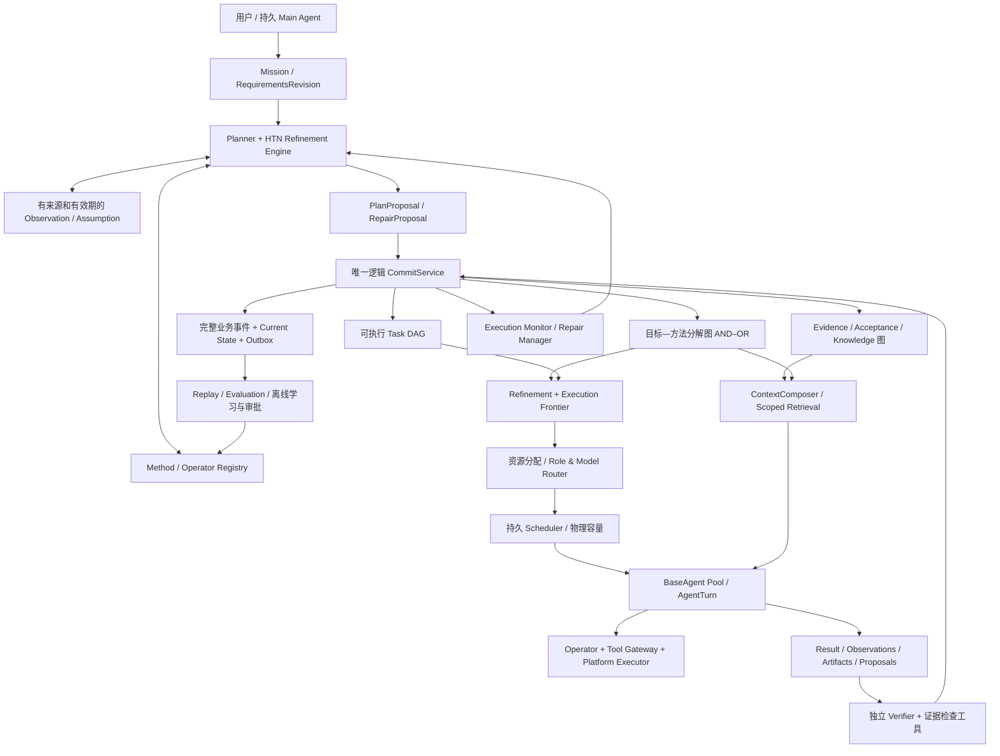

# SimpleHarness 完整目标架构与差距弥合计划

**版本：FULL-TARGET-2.0 · 2026-09-16（Asia/Tokyo）**  
**代码基线：`DennyWanye/simple-harness-sdk@61a85eb7e8c003fa894497090f5de893419ebbd1`，源码版本 0.11.1。**  
**文档性质：原始需求、后续讨论与当前源码的定向比对，以及完整目标设计。不是已实现的补丁，不是已通过的系统验收报告。**

---

## 0. 本次交付的含义

本计划回答三个问题：原来想做什么、当前究竟实现了什么、完整目标应怎样闭合。它不是下一份 MVP 清单。所有目标模块、跨模块合同、失败与恢复语义、实现落点、依赖次序和完成门槛都在本版确定；施工可以分批提交，但不得把尚未实现的必需能力从最终定义中移除。

“完整”指有明确边界的完整系统规格，不意味着任意自然语言目标都必然可解、所有模型输出都正确、或已经数学证明系统没有缺陷。开放环境中的证据不足、不可行、预算耗尽和需要人类决定，是正式结果，而不是通过降低验收标准掩盖。

本次不安排全量 TypeScript 重写，不以 CI／安装器／发布流水线为主要工作项。不撤回已完成的 BaseAgent、执行账本、隔离、预算或验证。不把用户已明确暂缓的长期用户记忆擅自恢复为当前实施前置。

### 0.1 已确认的范围收缩

原《Agent 编排层完整设计方案》明确要求动态 Task DAG、路线搜索、资源分配、知识复用、独立验证和历史学习；它没有给出完整的 HTN 方法语言、变量绑定和操作语义。后来讨论补充了 MethodContract、ADaPT、AND–OR 和局部计划修复。

但后来的 `agent-orchestrator-incremental-build-plan.zh-CN.md` §1.1 明确将 MethodContract、AND–OR、ADaPT、MCTS 排除为必需前置；§7.3 又不为原文补入 AND–OR 语义。这个决定有阶段施工理由，却没有持续维护一个包含这些扩展的最终需求基线。因此，阶段清单完成被过度等同于完整设想接近完成。

**本次纠正：保留已经完成的阶段成果，同时将用户当前明确要求的通用动态 HTN 等内容纳入不可静默删除的目标要求。**MCTS 不是通用 HTN 的定义条件；但多路线搜索、方法替换、搜索预算与安全模拟接口必须有完整设计。

### 0.2 证据标记

- **D1**：原始 31 章《Agent 编排层完整设计方案》。
- **D2**：此前《personal-agent-task-orchestration-framework-v1.zh-CN.md》，含单主 Agent、分解树／DAG／调用树分离、独立 Verifier、长期承诺、完整业务投影重建。
- **D3**：已讨论并由本次要求明确纳入的 HTN、MethodContract、AND–OR、ADaPT、动态 Context 和 BaseAgent 逻辑生命周期。
- **D4**：已交付的增量计划和阶段验收，仅证明该范围，不替代 D1–D3。
- **Sxx**：本次读取的固定提交源码，见 `sources.json`。
- **Rxx**：外部一手研究／官方技术资料，见 §21。
- **设计决定**：本计划提出的具体实现选择，不伪称为原文已有内容或当前代码已有接口。

---

## 1. 当前状态：不是空框架，也不是完整 HTN 系统

### 1.1 本次核查边界

| 仓库 | 当前取得的事实 | 限制 |
|---|---|---|
| simple-harness-sdk | main `61a85eb7…`；版本 0.11.1；读取规划、图变更、候选选择、分配、知识、验证、Replay、BaseAgent 和 Context 关键源码 | 定向审计，不声称逐行读完所有模块；未执行仓库测试或真实模型 |
| simple_harness | 当前 GitHub 连接返回 404 | 不将未知写成未实现；不能虚构最新 UI、Host 装配和本地文件路径 |
| simple-harness-service-sdk | main `47f372ad…` | 未把它当作默认 Mission 调用路径；实际安装／装配仍需从 Host 确认 |

SDK 的 HANDOFF 明确写了 `46 SOURCE PASS / 0 OPEN / 2 user-deferred packaging criteria`，同时明确“不声明更大的 complete-design 完成”。这些是仓库记录，不是本轮复跑。

### 1.2 必须保留的真实能力

1. BaseAgent 是稳定逻辑身份，支持连续输入、持久结果查询和本轮等待；不是每次回复就销毁。
2. 初始 TaskGraphProposal、依赖检查、预算约束和动态 TaskGraphChange 已有实现。
3. Worker 的阻塞、失败、子任务建议可以触发 Manager；不能说当前完全没有动态编排。
4. FIRST／COMPARE 候选、有限综合、片段复用和相关回执已存在。
5. 现有 Agent Context 已保留完整协议组、限制窗口并提供历史回读；不能再声称没有短期记忆。
6. 当前代码领域已增加 `scoped-observation-v2` 分级；任意模型 Claim 不再仅凭引用直接晋级，旧规则保留给冻结历史。
7. 当前 Blackboard 检索已增加完整 ID／证据精确命中和无关材料过滤，仍有词面相关性局限，但不能重复报告旧版缺陷。
8. 当前 Domain 注册已有 code、doc、AppWorld、AgentDojo、ARE；Verifier 使用 `handler_for()`，不再简单把所有非代码类型都当文档。
9. Commit、预算、执行回执、现有 UNKNOWN、审批、隔离和恢复机制应继续复用。

这些事实来自 S01–S20，不据此声称它们在所有部署中均已接线或全部验收。

### 1.3 当前与完整目标的十二类差距

| 类别 | 当前实现 | 与目标的差距 | 判定 |
|---|---|---|---|
| 通用 HTN | LLM 提出 Task DAG；TaskNode 有目标／依赖／验收／预算 | 缺少一等 MethodDefinition、OperatorDefinition、变量绑定、适用前提、分解实例、组合满足语义 | 核心语义缺失于已审计主链 |
| AND–OR 与因果计划 | 普通依赖 DAG＋候选选择 | 方法替代与必须子目标混在任务概念中；没有完整 support/causal/occurrence 模型 | 核心语义缺失于已审计主链 |
| 在线修复 | 8 类图变更、替代任务和管理触发 | 缺少基于方法前提、要求版本、因果支持的最小影响修复与分解回退 | 部分已有 |
| 全面资源分配 | 启发式 Frontier 评分、候选数、并发／背压 | 非任意角色／模型组合分配；进展与不确定度尚未校准；未形成价值信息驱动的策略 | 部分已有 |
| 知识与综合 | Claim、验证、来源、冲突、受限综合／片段 | 跨领域条件知识、一般真值维护、非局部组合、语义摘要仍有限 | 部分已有 |
| 动态 Context | 有界 Journal 组装、历史索引、Blackboard 词面＋精确查询 | 缺 HTN 方法／假设／修复上下文与统一条件保留；没有“所有模型通用最佳窗口”证据 | 部分已有 |
| 多层管理和消息 | BaseAgent、delegate 示例、Manager service | 单用户 Main、每 Mission 逻辑 MainWork、group scope、统一事件输入和接管合同未在本轮证明完整 | 核心有基础，产品接线待核 |
| 通用工具／验证 | code/doc＋三个评测域，显式 handlers | 同 Mission 混合领域、通用 Operator 注册、数学／SQL／浏览器／科学参考适配未整体闭合 | 部分已有 |
| 长期承诺 | Mission 执行与恢复、等待原语 | 周期承诺、持久定时器、离线补做、跨年要求修订和交付语义未在主链确认 | 目标组件待建设／核实 |
| 完整业务事件重建 | `Replay.formal()` 重建选定字段 | 明确排除预算、intent、lease、分配分数、背压；多个图变更事件不投影 | 范围明确但不完整 |
| 跨平台与外部后果 | 已有执行器、安全网关、操作账本 | Host 实际 Windows/Linux 语义、所有执行后果与多年恢复需能力矩阵验证 | 部分已有／平台未核 |
| 从历史学习 | `rules-v1`、有限权重／路由建议、离线晋级 | 非训练模型；没有完整方法学习、经过校准的优先级／路由与稳定性模型 | 部分已有 |

不将这张表折算成“完成 80%”。模块存在、生产路径接通、语义正确和有质量收益是四种不同证据。

---

## 2. 恢复完整设想前，先处理原文与后续讨论的冲突

| 冲突／容易误解的表述 | 本版确定的解释 |
|---|---|
| 原文临时 Agent vs 后来稳定 BaseAgent | 逻辑 Agent 身份稳定；物理执行进程／激活有限可替换。Task 与 Attempt 不依赖 Agent 永久在线 |
| 动态任务树 vs Task DAG | 分解归属与执行依赖分别建模；UI 可以显示树，但底层必须保留共享依赖和替代方法 |
| 只由独立 Verifier 验收 vs 多层测试 | 独立 Verifier 是语义审阅负责人；Schema、权限、测试、Lean 等是硬约束或证据工具，不用统一函数替代所有内容审阅 |
| Event Log＋State vs 全量 Event Sourcing | D1 只要求两者；D2 另要求完整业务投影重建。本版明确扩展业务事件覆盖，但不谎称旧事件能重建未记录的历史 |
| “无限子 Agent” vs 有限资源 | 身份与层次可扩展；每次准入受递归、累计预算、并发、授权和待处理队列上限约束 |
| 256K 固定最佳 Context | 256K 可配置工作上限；实际输入受模型能力、输出预留与 tokenizer 约束，工作最优值须按任务评测 |
| 超长历史进入向量库 | 原文先写 Journal；向量只是可重建索引，不能成为唯一原始记录或任务事实来源 |
| Workflow 与 Agent 平级 | 不采用。Workflow 只能作为受控 Operator／工具的执行策略，不取得另一套 Mission 写入权 |
| Lease 过期就重试 | 先撤销旧提交权并核对外部 handoff；UNKNOWN 不因 lease 失效自动重发 |
| 已完成节点永久有效 | 完成事实不可改写；当前 Acceptance 的适用性可以因输入／要求／证据变化被撤销，并安排新工作 |
| 用户长期记忆 | 用户已明确暂缓；保留可选、隔离的 MemoryPort。不将这项暂缓误称为遗漏，也不把方法库偷偷当用户记忆 |
| 任意权限的 Verifier | 读取能力和验证工具可以独立配置，但最小权限；不得修改被审产物并批准自己的修改 |

本表是显式架构裁决。不同于静默替换原文，后续改动必须记录新的 ADR 与受影响需求。

---

## 3. 完整目标架构：一个权威，四种图，两个规划语义模式



### 3.1 唯一正式写入者

保留 `CommitService`。Planner、HTN solver、Manager、Worker、Verifier、学习器都是提案或证据生产者。新模块不得直接绕过它修改正式计划、Budget 或 Verified Knowledge。

外部求解器不是任务 Runtime；它输出 plan candidate／decomposition witness，不能发真实邮件、写生产数据库或启动无限子 Agent。

### 3.2 四种图不能混为一个 children 列表

| 图 | 节点与边 | 用途 |
|---|---|---|
| 分解与方法图 | Goal → MethodInstance → 子 Goal；方法之间 OR，方法内必需成果 AND | 说明采用什么方法、为什么存在子任务、何时可以换路线 |
| 执行依赖 DAG | 可执行 Task；DATA、CONTROL、资源互斥／排序约束 | 决定可以运行什么、消费哪份输入、哪些能并行 |
| 证据支持图 | Observation、Assumption、Artifact、Review、Acceptance、Knowledge | 判定结论适用范围、数据变化影响、冲突与失效传播 |
| 执行／通信调用图 | Main、MainWork、BaseAgent、Attempt、Turn、消息 | 责任、监督、因果追踪；不是数据读取权限或预算父子关系 |

经典 HTN 中两个相同任务出现位置仍可能是不同 occurrence。跨方法共享成果是本计划的受控扩展，不是看到目标文本相同就合并执行。

### 3.3 两种规划语义，使用同一提交与执行链

**Formal 模式**：显式状态、类型、谓词、操作效果和方法模型覆盖了所声称的性质。返回带分解见证的计划，用独立验证器核验。正确性结论只针对该模型、输入快照和支持的语言片段。

**Evidence-guided 模式**：目标、前提或效果包含开放语义。LLM 可以提出方法和假设；确定性系统检查结构、授权与已知约束；独立 Verifier／外部工具验证结果。未知条件不能被伪装成 true；未建模性质不标记 formal proven。

两者不是两套数据存储。`assurance_mode` 及 `coverage` 跟随方法、计划和验收记录，最终报告逐项说明依据。

---

## 4. 领域模型：保留 Task 名称，补足缺少的语义对象

### 4.1 对象职责

| 对象 | 定义 | 不代表什么 |
|---|---|---|
| Mission | 一次用户目标的章程、预算、权限、交付与停止政策 | 不等于一次 Provider 请求或永恒承诺 |
| RequirementsRevision | 原始要求、硬约束、成功公式及其不可变版本 | 不由模型私自改写 |
| GoalNode | 需要被满足的逻辑目标，可复合或原子 | 复合 Goal 不直接派给 Worker 运行 |
| MethodDefinition | 参数化分解方法、适用前提、子目标、顺序与组合义务 | 不是角色 Prompt，也不是自由执行代码 |
| MethodInstance | 某个 Goal 在一组绑定与观察版本下采用的方法 | 不等于 MethodDefinition 的全局有效性证明 |
| OperatorDefinition | 一项可执行能力的 I/O、前置、效果预测、读写范围和核对协议 | 存在不等于配置、可达、健康或已授权 |
| Task | 物化的可执行工作或显式整合／审阅工作 | 不直接替代复合目标或方法选择 |
| LogicalObligation | 不因换方法／Task ID 而清零的责任与尝试累计身份 | 不自动允许重复现实动作 |
| Attempt / AgentTurn | 一次工作尝试／一次 Agent 输入处理 | 一次模型调用；或整个 Agent 的生命 |
| Acceptance | 对具体要求、输入、产物和证据绑定的接受回执 | 永不失效的真理 |
| Commitment / Cycle | 跨期承诺／一次有限履约周期 | 无限延长一个 Mission 或无限保留单窗口 |

### 4.2 当前 API 兼容方式

现有 `Task`、`Attempt`、`DispatchIntent`、`MissionControlV1` 保持可读。新逻辑对象进入编排库的版本化旁表，并通过 `GoalTaskBinding` 连接现有执行 Task。旧 Mission 继续 `legacy_dag` 解释，新 Mission 显式绑定 `hierarchical-v2`；不通过某条缺省字段猜测模式。

不引入 TaskProgram 替换 Mission。`GoalNode` 是 Mission 内规划领域对象，不是另一层用户任务服务。

### 4.3 不可变身份与上下文绑定

所有 Proposal 的 authority fields 由系统填写或核验：mission_id、principal、scope、manager_epoch、budget_account、可用工具快照。模型只能提出局部 key 和业务内容。

计划选择、模型请求和验收都绑定精确版本。类型使用已有 Python 严格边界配合 `NewType`／判别联合；不能把 `Any`、`.get()` 或 `cast()` 当成真实性验证。

---

## 5. 真正的通用动态 HTN：确定的方案

### 5.1 通用性的定义

换一个任务领域时，可以注册新的目标类型、方法和 Operator，而不修改“如果是 code 做三步，如果是 research 做两步”的调度主循环。没有现成方法时可以生成候选；候选进入相同解析、适用性、组合义务、权限和验证链。

“通用”不等于不需要领域知识，也不等于可以调用不存在的工具。SHOP 的 domain-independent 指通用规划算法使用领域方法／操作模型；本方案沿用这个边界。[R1]

### 5.2 MethodContractV2

建议采用 JSON 可序列化的、版本化的数据 AST；先用 Python dataclass 和受测 codec 实现。模型不得提供 Python `eval`、SQL 片段或任意回调作为谓词。

```yaml
method_id: history-search/local-hybrid
version: 1
assurance_mode: evidence_guided
parameters:
  agent_scope: AgentScopeRef
  corpus: CorpusVersionRef
achieves:
  goal_type: searchable_session_history
  arguments: {agent_scope: "$agent_scope", corpus: "$corpus"}
applicability:
  all:
    - capability_available: {operator: session_history_read, scope: "$agent_scope"}
    - observation: {predicate: embedding_service_usable, value: true, freshness_seconds: 300}
invariants:
  - no_cross_agent_disclosure
subgoals:
  - key: index
    goal_type: build_or_refresh_index
    arguments: {corpus: "$corpus"}
  - key: search
    goal_type: implement_hybrid_retrieval
  - key: verify
    goal_type: verify_retrieval_and_isolation
ordering: [[index, search], [search, verify]]
data_links:
  - {from: index.index_artifact, to: search.index_input}
composition:
  requirements: [retrievable_originals, authorized_scope_only, query_relevance]
  evidence_required: [index_version_receipt, retrieval_report, isolation_report]
  final_review: independent_verifier
expected_effects:
  - predicate: searchable_session_history
    evidence_obligation: verify
```

以上是目标合同示例，不是当前源码已支持的配置。完整 Schema 还必须规定参数作用域、量词范围、否定、类型、标识符、额外字段、数值上限和最大 AST 节点数。

`expected_effects` 是计划预测，不允许写入 ObservedWorld。产生“已完成”的观察必须来自真实操作回执或有效 Review。

### 5.3 适用性使用有依据的四态评估

对每个条件返回 `TRUE / FALSE / UNKNOWN / DISPUTED`，同时保存支持／反驳证据、来源版本、观察时间和有效期。

- TRUE：在声明的范围与有效期内可用，交接前仍需复查。
- FALSE：该方法当前不可用；保留拒绝理由并尝试其他方法。
- UNKNOWN：安排只读取证、受控实验或明确询问；不能假设不存在，也不能默认为成立。
- DISPUTED：进入冲突处理；重要执行不得靠投票消除矛盾。

可机械求值的谓词与开放内容评估分开。一个 Verifier 判断为“证据支持”也要携带 assurance 范围，不能自动成为形式化世界公理。

### 5.4 方法选择与按需细化

每次规划使用冻结输入，执行如下逻辑：

```text
取 Goal + 当前要求 + 获准观察 + 能力表
  → 检索适用 Method（精确类型优先，语义候选辅助）
  → 检查适用性与模型覆盖范围
  → 比较受预算约束的替代方法
  → 缺方法时产生 LLM MethodProposal
  → 结构/类型/来源/授权/组合义务检查
  → 形成候选 MethodInstance
  → 必要时独立计划审阅或形式化验证
  → Commit 选定实例和可执行 frontier
```

叶子条件不是“深度达到三层”，而是：当前目标存在可执行 Operator 或可由一个有界 BaseAgent Attempt 完成、并有可检查交付物；不存在未解决的必需前提。

对于低风险、范围清楚的工作，可先有界尝试；失败反馈显示复杂度过高时再递归展开。这借鉴 ADaPT，但不采用“必须先真实执行危险动作才允许规划”的策略。[R2]

### 5.5 规划内核与外部求解器

确定采用 **内部持久 Planning IR + 可插拔受控 HtnSolverPort**。

- Formal 有限模型：实现 HDDL 导出／导入适配，优先以 PANDA 系列的部分序规划与分解见证验证作参考实现和交叉核验。[R5]
- Evidence-guided：在同一 IR 上进行有预算的 best-first refinement；LLM 为候选方法、排序和缺失知识提供建议，不取得提交权。
- 全序的轻量参考算法可以作为小规模交叉测试；不能把只支持全序的实现包装成任意部分序 HTN。
- 所有求解器输出都重新进行类型、方法实例、前置、排序、数据绑定与目标覆盖检查。
- 外部求解超时返回 `SEARCH_LIMIT_REACHED`，不能声称 `UNSOLVABLE`；只有限定模型的完整穷尽才允许后者。
- 静态规划数据转换不支持的 HDDL 特性必须显式拒绝。PANDA 到 SHOP2 的转换并非任意部分序都无损，不应作为隐藏兼容捷径。[S24]

不把某个 solver 的“支持”理解为现实系统副作用、安全、时间和所有自然语言结论都被形式化证明。

**禁止用万能 LLM Operator 偷换形式保证。**把任意 Goal 交给模型，再把该 Operator 的效果直接写成 `goal_satisfied=true`，只能证明这个自设模型允许声称成功，不能证明目标真实成立。开放式 Agent Operator 的确定效果最多是“产生了绑定输入的候选产物／观察”；内容是否满足目标仍须通过独立验收。Formal 计划只有在被声称性质的前置、效果、观察与求解器语义均有覆盖时，才可以报告该性质在模型内成立；其他部分明确降为 evidence-guided。

经典 HTN 的任务可约化性与状态目标满足也不是同一个概念。本方案额外的 Goal／Composition 层必须声明其成功公式，并单独核验“这个合法分解为什么足以满足用户要求”；不能仅凭所有 primitive action 可执行就跳过根目标验收。

### 5.6 递归和结束条件

MethodDefinition 可以递归；每次实例化必须给出可检查的进展量、问题规模减少、或有界展开策略。检测重复实例键、无状态变化的递归、预算消耗和展开深度。方法递归限制、DAG 环检查、Agent 调用深度是三个不同控制。

限制是版本化部署／Mission 政策，不把 32 个 Task、深度 6、3 个候选当作算法语义。放宽限额也不能绕过预算或物理容量。

### 5.7 方法学习是完整目标的一部分

成功轨迹可产生参数化 MethodCandidate；失败证据可产生方法前提修订或反例。不能仅把一段成功 Prompt 存进向量库就称为学习方法。

候选须经过参数抽象、条件归纳、未见实例测试、反例测试、权限检查、成本比较和人工／授权发布。自动生成的新候选可在批准范围内试验；不能直接修改已冻结 Mission 的方法版本。研究已有 LLM-HTN 的方法学习方向，但其域内结果不是本项目的现成保证。[R4]

---

## 6. AND–OR、共享子目标和组合验收

### 6.1 明确 AND 和 OR

```text
Goal G（满足其中一条被授权且有效的方法即可）
  ├─ Method A（必须满足 A1、A2、A3 以及组合义务）
  └─ Method B（必须满足 B1、B2 以及组合义务）
```

AND 不等于串行；OR 不等于无条件同时执行所有方法。可并行探索受资源与副作用约束的候选；不可对同一现实动作重复执行多个方案试试看。

### 6.2 共享子目标的合并条件

只在完整目标合同、参数、输入版本、授权范围、时效、领域语义及副作用政策一致时复用。文本相似度只生成候选，不能决定合并。

优先复用不可变 Acceptance／Artifact，不让多个父方法同时拥有同一个可写工作。取消一个方法只释放它的使用关系；另一个方法仍需要的共享工作不能被级联取消。

副作用型目标默认不共享执行，除非明确绑定同一授权操作身份和业务语义。两个“发邮件”的 Task 不因文字相同而去重；同一操作重试也不因新 Task ID 变成新动作。

### 6.3 分解完成不等于父目标成立

每个 MethodInstance 有 `CompositionObligation`，记录子成果如何覆盖原始要求、接口如何衔接、残余假设和最终验证方式。

接受父 Goal 的条件：选定方法仍适用、所有必需子目标有当前有效 Acceptance、数据输入未变、组合义务通过、硬约束满足。

Mission 完成由根 RequirementsRevision 的成功公式和 FinalAcceptance 决定，不由“最后一个拓扑叶子”决定，也不要求所有已经放弃的替代路线都完成。

---

## 7. 动态计划修复：真正消费 Worker 的反馈

### 7.1 FeedbackContract

扩展现有 Result Envelope，保持旧版本解析。反馈须将观察、诊断和建议分开：

```text
observations：实际看到什么，证据和版本
hypotheses：如何解释，置信与待确认条件
diagnosis：缺前提／局部实现错／方法失效／权限不足／资源不足／需求变化
proposed_refinements：建议怎样细分或换方法
affected_bindings：涉及哪些合同、输入和能力
```

Worker 不能自行声称某条世界事实已确立；不能把“没找到”解释成“不存在”。

### 7.2 决策表

| 反馈 | 正式处理 |
|---|---|
| 可修复实现缺陷 | 保留 Goal／Method；新 Attempt，累计同一 obligation 的失败和成本 |
| 缺资料 | 先使用已有授权资料；不足时创建取证 Goal，而非立即重复实现 |
| 任务太大 | 在当前 Goal 下选择更细方法，保留已有有效部分 |
| 方法前提被反证 | 标记实例不可适用，选择替代方法；保留历史，不宣称整个根目标不可能 |
| 权限不足 | 等授权、调整范围或报告不可执行；禁止拆任务绕过权限 |
| 真实操作 UNKNOWN | 核对原 operation_id，不派另一个 Agent 重做同一操作 |
| 用户改要求 | 提交 RequirementsRevision，计算受影响支持关系，修复相关子图 |
| 下游拥堵 | 调度降速，不把拥堵归因为内容失败 |
| 无可行方法／搜索耗尽 | 区分模型内不可解、尚未找到、缺工具、预算不足，交付证据与未决义务 |

### 7.3 最小影响域

影响域从变化的 `requirement/observation/artifact/acceptance/capability` 反向索引计算，经 DATA 和条件支持边传播；CONTROL 纯顺序边不自动传播内容失效。必要时沿分解图找到最近可替换的方法实例，避免整个 Mission 重规划。

重新求值依赖于该条件的所有消费者，不只看某个 source Task 的 `COMPLETED` 字符串。

### 7.4 原子 PlanPatch 提交

拟新增 `commit_refinement()`、`commit_plan_repair()`，内部使用现有 `Store.transaction()`、BudgetLedger 与 dispatch intent 基础。流程如下：

```text
按 command_id 查已有回执
→ 校验当前主体、manager epoch、Mission 要求版本
→ 校验 read-set：相关 Goal/Method/Observation/Acceptance/资源版本
→ 检查参数绑定、分解、因果支持、环、预算和权限
→ 对在途工作应用继续／失效／取消／替代策略
→ 写 Goal/Method/TaskBinding/依赖/预算转移
→ 同步写业务事件、Current State 与待派发意图
→ 保存稳定 CommitReceipt
```

不在写事务中运行 LLM、embedding、形式求解器或外部工具。涉及源产物先持久化 immutable artifact，再引用；删除器不能回收被待提交命令保护的对象。

全局图版本用于观察与粗并发控制；语义适用性由相关 read-set 决定。无关分支的状态更新不会自动让全部提案失效。

### 7.5 在途结果和不可逆副作用

旧 Worker／Verifier 回来：先保存结果和实际费用；依据原绑定决定是否可应用。过期结果不抹掉，也不批准新输入。

新旧工作会写同一真实资源时，必须先 fence 旧执行或等待核对，再开放替代工作。计划回退不等于现实回滚；补偿是有单独授权和 operation_id 的新工作。

---

## 8. 资源、预算与搜索多样性

### 8.1 Allocator 的完整输出

从当前 `AllocationPlan(task,candidate)` 扩展到 `AllocationBundle`：

```text
目标／方法／可执行 Task
角色组合与人数
模型／profile 候选及固定选择
本轮预算和最终验证保护额度
物理资源域
预计价值、成本、风险与依据
探索／利用分类与停止阈值
```

探索可以在方法空间，执行可在单叶 Task 空间，二者分别记成本。不同角色应有不同输入、工具和输出义务，不能只更换称谓。

### 8.2 Value Model 不伪造概率

当前启发式作为可解释 fallback 保留。新 value estimate 由已验证进展、减少的未决义务、解锁价值、真实成本、失败类型、多样性和可重用贡献组成，附样本范围和不确定度。

不再把 `0.5**tries` 当真实不确定性；调用次数增加不一定减少知识不确定性。未校准分数只用于排序，不当成功概率展示。

### 8.3 搜索策略完整覆盖

提供 direct execution、方法候选 best-first、受限 beam、Best-of-N、候选综合和安全 rollout 策略接口，均记录策略版本、预算和停止理由。

MCTS／UPOM 风格只对有可信模拟器或无副作用状态模型的任务启用，rollout 不触达真实系统。其他场景使用真实证据驱动的局部探索，不假装拥有准确 world simulator。[R3]

### 8.4 预算图与任务图分离

执行依赖是 DAG，资金／额度归属必须是单父授权树。共享成果只有一个实际支出主体，可另行分摊归因，但不能在多个父任务重复记消费或重复退款。

根 token／费用守恒：`已结算消费 + 在途 reservation + 尚未转出的保护 hold + 可用余额 = 已批准额度`。子账户是这些份额的嵌套分配，不能再次作为全局额外占用加一遍。

修复、替代 Task、更换角色、换 Agent 都沿用 LogicalObligation 的累计次数和成本；未知收费保留 reservation。模型费用增长使用现有逐请求 admission，而不是修改历史预算绕过失败。

并发是瞬时容量，Token／工具次数是累计量，deadline 是时间约束，不能使用同一求和公式处理。最终 Critic／整合的必要额度在派发前保护；额度不够时请求缩小计划或明确拒绝，而非先启动一个不可能完成验收的分支。

### 8.5 物理调度与背压

同一真实模型部署的多个 profile 共享物理容量。等待槽位、等待模型返回、等待授权、UNKNOWN、不可观察分别记录；队列排队不自动判 LOST。

Verifier 积压时限制新 Worker 和新分裂，保留收尾、核对与安全操作资源。fairness、aging、作用域配额和抢占只修改合法未来派发，不抹掉已经发生的工作。

---

## 9. 知识、证据和上下文：不是只加一个向量数据库

### 9.1 可信知识表示

保留 Claim 与 Knowledge 区分，扩展：`applicability_conditions`、`assumption_refs`、`valid_time`、`source_versions`、`input_artifact_hashes`、`verification_scope`、`counterevidence_refs`。

`VERIFIED` 必须有范围：程序验证某断言、文档归因、实验统计支持、独立语义审阅，不把这几种证据强度混为同一种现实事实证明。

保留当前 code-v2 后继的 scoped observations；语义 Claim 可以由独立 Verifier 和外部证据逐项接受，不能永远只能停在 SUPPORTED，也不能退回任意 pytest 路径即通过的规则。

### 9.2 Truth Maintenance

增加 `AcceptanceSupport` 反向索引。源撤回、条件失效或事实被反证时，在事务中发布适用性变化；阻止后续使用，重审受影响结果。已结束 Mission 的历史完成记录保持不变，但其 assurance view 标记失效并产生获准的修复通知／新 Mission。

冲突不是简单 key 字符串相反：先核对主体、时间、条件是否真的相同。不同条件下的结论可以同时有效。

### 9.3 综合与部分成果复用

在已有片段验证基础上，支持任意已声明产物类型的片段 manifest：来源 byte range／symbol／table row／proof object、输入版本、前提、验收范围、许可和写入范围。

多个局部成果组合出新产物时必须验证接口一致、假设相容和根要求覆盖。失败任务里可复用片段单独获得 Acceptance，不把失败整个任务晋级。

### 9.4 两层记忆，三类检索

- BaseAgent SessionMemory：自己合法经历的原文与短期工作记录。
- Mission Blackboard：团队的候选、条件知识、证据、失败、摘要。
- 方法库：经过审核的规划知识，不是用户人格／偏好记忆。

检索组合精确标识符、词面／FTS 和语义向量候选；再做权限、时效、条件、图距离、来源强度和重复校验。当前精确引用和无关过滤必须保留。

索引只保存派生表示和源引用。缺索引意味着检索覆盖下降，不意味着没有历史；必须可以精确回读并重建。

### 9.5 ContextComposer 完整输入

每个新 Provider 请求包含适用的角色规则、原始硬约束、当前 Task、Goal／Method 绑定、必需依赖、未决假设、真实执行状态、最近闭合交互、本次检索、有效 Review 反馈及工具能力。

Planner 看候选方法与受影响子图；Worker 看所需子目标和输入；Verifier 看要求、产物、反证与独立工具，不默认继承 Worker 的所有解释。

工作预算由 profile 冻结，实际满足：`input + output_reserve + safety <= model_total_window`。近期保留按实际 token 和完整工具组，不固定若干轮。窗口大并不自动最优，配置应有任务级评测依据。[R6]

### 9.6 摘要不能只截断，也不能代替事实

保留当前结构性 summary 作为回读指针；新增：

1. 从正式状态生成的确定性工作摘要：当前要求、有效成果、未决动作、下一步义务。
2. 独立生成、带来源与条件的语义摘要：失败原因、方法选择、关键事实和反例。

先对摘要检查引用覆盖和限制条件，再使用；不能无限对摘要再摘要而失去原文。过度压缩失败可以回读／重建，不得自动升级 Claim。[R6]

### 9.7 请求冻结

记录 `ContextSelectionManifest`：输入源 hash、摘要版本、query、索引代次、计数器／模板版本、预算、选材理由与最终请求指纹。已冻结请求在重启后复用；索引更新只影响新请求。重新授权不通过时拒绝未来披露，不悄悄改写原 invocation 内容。

---

## 10. 多 Agent 责任体系与消息

### 10.1 一个用户 Main，不等于一个永不终止的协程

用户 Main 作为稳定身份接收对话并管理多个 Mission；每个 Mission 有一个逻辑 MainWork 责任记录。Planner／Manager 运行时可以是有限 BaseAgent turn，退出后责任和计划仍然存在。

复杂 Mission 可分配 GroupManagerScope。所有 group 仍通过同一个 CommitService；作用域外只能提协作请求，不能直接改别的分支。

### 10.2 所有角色共用 BaseAgent

Worker、Explorer、Exploiter、Critic、Simplifier、Connector、Failure Analyst、Synthesizer、Verifier 使用版本化 RoleBinding：指令、输入输出合同、能力上限、可见性和生命周期策略。

没有为每个角色复制 Runtime。Task Critic 与 Mission Judge 的预算和目标绑定独立，复用统一执行机制；沿用关键契约加固计划的目的，而不是只改类名。

### 10.3 类型化消息

AgentInbox／Outbox 消息至少包括：`TaskAssigned`、`QuestionRaised`、`InstructionUpdated`、`ArtifactSubmitted`、`ReviewReturned`、`PlanRepairRequested`、`ObservationArrived`、`WakeTriggered`、`CancelRequested`。

每条消息保存 sender、recipient、scope、correlation、causation、input revision、expiry、dedupe key。收到、消费、形成结果、结果交付分别确认。

普通子 Agent 结果不能伪装成用户指令。相同用户／同父 Agent 也不自动获得对方全部记忆权限。

### 10.4 监督、接管与交接

同一个 logical MainWork 一次只有一个有效 manager epoch；旧实例只能留下历史，不能继续提交。取消树、责任树、数据权限和任务依赖分别计算。

子 Agent 的提问结束一次 turn 后，可以等待新的输入再工作；UNKNOWN／授权等待通常恢复原 turn。控制信号优先于普通队列，但不能中断已经发生的外部后果。

---

## 11. 通用领域与执行能力

### 11.1 Domain 与 Operator 分开

Domain 定义任务语言、证据标准和可接受检查；Operator 定义具体能力如何执行。Task 绑定自己的领域与环境要求，Mission 可以包含多个领域并约束数据流。

现有 Mission 单一 domain 是 legacy 合同；新增 mixed-domain 不是把旧 field 改成自由数组，而是一个显式 CompositeDomainBinding + TaskDomainBinding。跨域产物必须经过类型／单位／身份／版本适配。

### 11.2 必需的参考能力覆盖

| 领域 | 完整目标的检查与交付 |
|---|---|
| 代码 | 编译／测试／静态规则／独立 Review，检查与产物 hash 绑定 |
| 文档 | 正确来源版本、引文、归因／推论分离、覆盖与局限 |
| 数学／形式模型 | Lean 为首个证明内核适配；Coq／Isabelle 走同一证据协议，不把文本证明当 machine checked |
| SQL／结构化数据 | 只读副本／临时库、参数化操作、约束与结果断言、写入预览和审批 |
| 浏览器／网页 | 隔离会话、DOM／状态证据、只读观察与真实提交分离 |
| 应用／企业流程 | 受控 API／MCP、业务幂等、状态回读和审批；复用已有 AppWorld 等环境入口 |
| 科学／数据实验 | 固定数据和环境、随机种子／统计方法、重复实验、结果适用范围 |

每个能力既要接口，也要可运行的参考实现、失败场景和证据回读；不以空 registry 或 `NotImplemented` 算完成。产品可按部署开放子集，但未经实现的能力必须在能力表中明确 unavailable。

### 11.3 能力发现

分别记录 registered、configured、reachable、healthy、authorized。Planner 查询的是当前范围下的能力视图，不是 README 工具列表。注册新的工具或方法不能扩大已授权网络、文件、密钥、并发或支出。

### 11.4 平台边界

保持 Python 主内核。ProcessSupervisor、SandboxExecutor、ArtifactFileSystem、SecretStore、LocalTransport 由 Host 适配；Windows／Linux／macOS 逐平台探测和验证。

跨平台不是简单复制数据库或改路径。迁移在途执行须重新取得执行权并核对旧 handoff；不满足隔离等级时拒绝执行，不能自动改用无隔离 shell。

Workflow 作为工具层执行器受同一 gateway、预算、receipt 和 operation_id 约束，不获得第二套 Agent 编排状态。

---

## 12. 长期承诺、定时器与要求更新

这是 D2 的显式要求，不应因为原 D1 以一次 Mission 为中心而消失。

- `Commitment` 保存长期责任与用户授权，`Cycle` 代表有限履约周期，映射一个或多个 Mission。
- 定时／事件等待保存 wake 条件与 correlation；进程内 timer 只做唤醒优化。
- 持久到期队列采用原子领取、去重、deadline、时区／当地时间规则和 DST 政策。
- 停机补做支持 RUN_ONCE_NOW、SKIP_MISSED、ASK_USER、CATCH_UP_BOUNDED；不得恢复后自动补发数百个已过时外部动作。
- RequirementsChanged 创建新不可变版本，当前采纳的计划更新；过时产物与审批保留历史但不能批准新任务。
- 用户长期记忆仍然不是前置。明确承诺是业务状态，可以在没有人格记忆向量库的情况下可靠发现。
- 完成、通知已发送、用户已读取是不同事实；通知重发不重跑任务。

---

## 13. 完整业务 Event Sourcing 与恢复

### 13.1 当前 Replay 的边界必须改变，但不能伪造过去

当前 `FORMAL_FIELDS` 只覆盖部分状态，明确不包括预算、intent、lease、分配和背压，图变更等事件也不用于投影。现有 Replay 继续作为 legacy 检查工具。

新增业务事件覆盖目录，对每类权威表声明：事件可重建／独立原始账本／可重建派生索引／短期缓存。不是每个 token、每次心跳、每份原文都永久写进业务事件。

### 13.2 新事件必须能够重建什么

Requirements、Goal、MethodInstance、任务物化与依赖、当前计划选择、Acceptance 适用性、预算授权／转移／结算、待派发意图、协调者 epoch、重要等待／唤醒、操作授权和交付状态。

原始 Provider／Effect 回执继续由 execution ledger 管理；业务事件记录精确引用和归属，不复制另一套执行事实。全部恢复所需资产包括业务事件、原始执行账本、CAS、策略／方法版本和密钥恢复能力。

### 13.3 旧历史过渡

对于事件不足的老库，在已核对的 checkpoint 建立带 hash 的 `LegacyBaselineImported` 锚：声明以前哪些内容不可重建，从锚以后严格记录。禁止用当前状态静默填补旧事件缺口再报告 100% replay。

旧 intent、模型请求、Canonical JSON、hash 和幂等身份不改。新字段使用新 codec／binding，不向旧冻结结构偷偷补默认值。

### 13.4 恢复顺序

```text
暂停新副作用
→ 校验 schema／checkpoint／原始账本／CAS
→ 重建正式业务投影和待办
→ 核对未结束外部操作与未结算用量
→ 重新取得控制 epoch／lease
→ 按最新要求和权限重判 future handoff
→ 开放合法调度
```

Replay 不调用模型、不执行工具、不读变化中的网页。备份回到过去，不代表现实世界也回到过去。[R7]

### 13.5 保留、删除和长期维护

原始内容按隐私政策保留、加密或删除；事件保留不敏感引用与删除事实。恢复旧备份后，先应用删除／撤权政策再恢复业务访问。方法／工具升级须兼容解码冻结执行或明确阻塞；不能让无限历史永远使用无限热内存。

---

## 14. 代码级实施落点

**[现有] 为本次已读取路径；[新增] 为目标路径。表中函数是拟新增时会明确标出。**

| 文件／模块 | 修改方式 |
|---|---|
| [现有] `graph/task_graph.py` | 保留 legacy TaskGraphProposal；不得用 `dependencies` 偷编码 OR。新增编译后的 executable graph 接口；限额迁为版本化政策，仍有安全上限 |
| [现有] `graph/changes.py` | 保留8个旧操作；新 RepairProposal 经过语义检查生成现有安全 Task 变更，不让通用操作绕过 HTN 绑定 |
| [现有] `planning/planner.py` | 新增版本识别与 typed PlanProposal 解析；旧 `<task_graph_proposal>` 路径保持。LLM 生成委派仍由实际 orchestration 入口调度 |
| [新增] `planning/htn/contracts.py` | GoalSpec、MethodDefinition、MethodInstance、OperatorRef、Binding、ReadSet、CompositionObligation |
| [新增] `planning/htn/predicates.py` | 安全 AST 解释、四态求值、证据与有效期，不接受 eval |
| [新增] `planning/htn/registry.py` | 方法版本、任务类型精确匹配、候选／批准／撤回、权限与缓存 |
| [新增] `planning/htn/refiner.py` | 参数绑定、递归展开、候选前沿、有限搜索与终止原因 |
| [新增] `planning/htn/compiler.py` | 分解实例→Task DAG、数据链接、资源排序、成分覆盖与稳定物化身份 |
| [新增] `planning/htn/solver_port.py`、`hddl_adapter.py` | 外部 solver 隔离、支持片段声明、分解见证与独立验证 |
| [新增] `planning/htn/repair.py`、`impact.py` | Feedback→受影响 read-set→最近方法修复→可验证 patch |
| [现有] `orchestrator/event_handler.py` | 把 HTN 分派接到 Planner／Manager、Result、Review、Source 变化和控制事件；不要把全部算法继续堆在此文件 |
| [现有] `orchestrator/commit_service.py` | 引入显式 planning binding；调用拟新增 RefinementCommitsMixin；旧 Mission 的执行与完成语义不改 |
| [新增] `orchestrator/refinement_commits.py` | `commit_refinement`、`commit_plan_repair`、`commit_goal_acceptance` 原子实现 |
| [现有] `planning/manager.py` | 现有冲突／综合模板保留给旧模式；新模式使用 Method 的显式 composition，而非全局最后叶子约定 |
| [现有] `planning/candidate_selection.py`、`fragments.py` | 复用候选／片段回执；增加方法实例与使用范围，泛化由新版本驱动，不强改旧1..3限制 |
| [现有] `scheduling/allocator.py` | 加入 refinement frontier 和 AllocationBundle；区分真实评分与启发式 fallback；授权／预算仍是硬门 |
| [新增] `planning/world_model.py`、`memory/acceptance_support.py` | Observation、Assumption、当前适用性、反向依赖和失效传播 |
| [现有] `memory/claims.py` | 保留新 scoped observations；增加领域证据适用范围和语义 Review 接受，避免重复修已解决缺陷 |
| [现有] `context/retrieval.py`、`compression.py` | 保留精确命中／排除 stale；加入 Method／Assumption 视图、混合检索和受测语义摘要 |
| [现有] `agents/context/composer.py` | 复用完整协议组和预算；将 HTN 关键状态作为可追溯必需层，不回到无限消息追加 |
| [现有] `verification/verifier_router.py`、`domain_handlers.py` | 复用显式 handler；按 Goal／composition／Task 绑定创建独立审阅；插件检查不替代内容验收 |
| [现有] `governance/domains.py` | 新 CompositeDomainBinding；保留当前五个域与历史版本；注册更多实际适配 |
| [新增] `runtime/operator_registry.py` | 受控执行能力合同、状态探测、读写／副作用政策和 proof obligations |
| [新增] `coordination/scopes.py`、`coordination/messages.py` | MainWork／GroupManager 作用域、manager epoch、类型化事件和可恢复交接 |
| [新增] `commitments/service.py`、`timers.py` | 长期承诺、cycle、持久到期队列、catch-up |
| [现有] `storage/schema.py` | 追加下一合法 migration；旧DDL checksum不变；新表和索引由同一 Store/UoW 管理 |
| [现有] `observability/replay.py` | 保留 legacy FORMAL_FIELDS；新增完整业务 projection coverage 与 migration anchor |
| [现有] `governance/learning.py` | rules-v1保持；新增方法学习与经过校准的离线模型产物、候选晋级、反例集 |
| [现有] `api/facade.py` + [新增] planning facade | 保留公开 Mission 接口，新增只读 Goal/Method/why/coverage 与提案提交接口 |
| [Host待定位] 实际 projection／API／Store／Mission页面 | 对接既定公开 Schema。不能在无法读取 Host 时写出假位置；参考旧 `missionsStore.ts` 只能作为导航线索 |

完整机器可读变更表在 `code-changes.json`；它描述工程任务，不是可直接 apply 的 patch。

---

## 15. 数据库与事务合同

### 15.1 新增或复用的逻辑表

`mission_planning_bindings`、`requirements_revisions`、`goal_nodes`、`method_definitions`、`method_instances`、`refinement_children`、`ordering_constraints`、`causal_supports`、`goal_task_bindings`、`logical_obligations`、`world_observations`、`assumptions`、`acceptance_supports`、`planning_decisions`、`commitments`、`cycles`、`timers`、`agent_messages`。

新增表前必须检查当前已有等价表；复用具有相同语义的表，不能为了照抄命名创建第二份权威。所有 immutable 定义有 canonical hash，所有可变采纳关系有 revision。

### 15.2 必需约束

- 所有 Goal／MethodInstance／TaskBinding 带 mission_id；跨 Mission 共享仅引用经过额外授权的 Artifact，不共享可写记录。
- `method_definition(id,version)` 不可变；instantiation key 唯一，重复命令得到同一实体。
- `method_instance + slot_key` 唯一，防止重放创建重复子目标。
- `task_id + planning_binding_version` 指向精确目标及输入，不能一项 Task 被两个相互冲突的方法解释。
- `obligation_id` 在替代／拆分策略下显式延续或分配，不通过换 ID 逃避累计限制。
- acceptance 和 source support 建反向索引，影响分析不能扫描向量库判断。
- 消息／timer 的业务 dedupe key 与合法 scope 有唯一约束。
- CommitReceipt 保存 intent hash、read-set、提交版本和输出身份，命令相同但内容不同返回冲突。

### 15.3 read-set 示例

```json
{
  "requirements_revision": "req-5",
  "goal_revisions": {"g-main": 3, "g-shared": 2},
  "method_instances": {"mi-a": 4},
  "observation_versions": {"obs-api-capability": "sha256:..."},
  "acceptance_revisions": {"acc-source": 1},
  "manager_epoch": 7,
  "budget_grant_revision": 9
}
```

示例 ID 是占位演示，不是当前库中的记录。权限和动态外部能力还需在实际 handoff 再检查。read-set 不承诺外部世界在事务后不再变化。

---

## 16. 公开接口和 UI：必须显示完整规划语义

公开 Schema 保持 Host／UI 单一事实源，不泄露内部 lease token、凭证或全部模型 Context。SDK 内部 Method 类型与公开消息类型分开。

新增接口目标：

```text
planning.snapshot(mission_id)
planning.methods(goal_id)
planning.explain(goal_id | task_id | decision_id)
planning.propose_change(command)
planning.coverage(mission_id)
planning.observations(scope)
commitments.create/update/pause/resume(...)
```

这不是要求 UI 直接 Commit。所有写意图仍由认证 Host 调用正式入口。

UI 同时提供：目标分解视图、方法替代与状态、执行依赖图、证据／假设／验收覆盖、预算和暂停原因、变更差异／回退理由。不能只把 task DAG 用树组件画出来就称为 HTN。

状态变化通过 backend snapshot＋event cursor；坏消息与业务 UNKNOWN 分开；保留上一次有效画面但明确 stale。客户端不再实施一套自己的预算、完成和方法选择规则。

Host 无法访问使本轮无法给出其现有文件的准确修改行。交付团队必须在 H0 记录真实路径、版本、加载模式和功能映射；这属于实施的源映射任务，不是尚未决定的架构。

---

## 17. 七个完整工作包：施工顺序不是缩小最终范围

所有包都属于本版最终要求；不能完成 W1 后把 W2–W7改称“可选优化”。每个包从数据合同、后端、实际调用到观察／验收形成完整切片；基础测试在该包内完成，不等最后再写。

| 包 | 完整可用功能 | 依赖 | 核心完成门槛 |
|---|---|---|---|
| W1 | 同一引擎接收不同领域方法，生成可验证分解并执行选定叶子；无方法可提出受控新方法 | 当前 Core；新增合同／表／事件一并做 | 非硬编码 code/research 分支；全序／部分序、AND／OR、前提和组合语义通过 |
| W2 | Worker 证据触发局部方法修复，共享成果保留，旧结果不污染新计划 | W1 | 反证→换方法→不重做无关分支→组合验收；重复消息／崩溃正确 |
| W3 | 条件知识、支持失效和任务所需动态 Context 真正闭环 | W1–W2 | 来源撤回影响正确；超窗仍保留关键限制；语义摘要／检索有独立质量测试 |
| W4 | 一个 Main 管理多个 Mission，MainWork／GroupManager 有作用域、消息与接管 | W1–W3 | 多轮补充指令、并行子 Agent、跨组交接、旧manager隔离及可解释 UI |
| W5 | 同 Mission 混合领域工具与验证，平台执行、权限和真实后果受控 | W1–W4 | 代码＋资料＋SQL／浏览器／形式检查等参考适配；不支持能力明确拒绝；新产物重新验证 |
| W6 | 长期承诺、周期、停机补做、完整业务重建与多资产恢复 | W1–W5 | 模拟长期时间变化；删派生状态重建；外部已发生动作不因恢复重复；Host完整接线 |
| W7 | 方法／Router／Allocator 的离线学习和有证据的策略选择，最终完整验收 | W1–W6 | 有实际训练／归纳产物，held-out评测与审批；数据不足不伪造收益；完整覆盖矩阵闭合 |

代码级迁移在整个过程中遵守：旧模式冻结、新模式显式、先对照再接管、同一 Mission 仅一个执行权威。不得为方便实现而把已关闭 Task 改回 ACTIVE，也不得重写旧模型请求。

W1 不是“先搭个 HTN 类名，以后再完善”。它必须已经定义并执行本文的完整 Method／Operator／绑定／前提／分解／组合合同；后续包扩展协作、长寿命和学习，不改变 W1 的基本语义。

---

## 18. 验收：证明是真正实现，而不只是新增目录

### 18.1 四层证据

1. **合同与性质检查**：Schema、类型、序列化、纯状态机、预算守恒、读写影响、重复事件。
2. **规划形式检查**：独立 solver／validator 对可建模片段核验方法分解与执行序列，不能只检查 DAG 无环。
3. **端到端真实运行**：真实 BaseAgent、工具、产物、独立 Verifier、崩溃恢复和 UI。
4. **外部质量和成本**：同模型／同预算强单 Agent、静态 DAG、当前动态 DAG、完整 HTN 的成组对照。

### 18.2 通用 HTN 的决定性场景

- 注册一个未写入控制代码的新领域，只通过 schema／method／operator 完成任务。
- 一个 Goal 有两条方法；方法 A 的前提被观察否定，切到 B，而不把根目标失败。
- 一个 Method 有多个 AND 子目标，其中两项可并行；联合接口错误必须阻止父目标通过。
- 两种方法引用同一纯子成果，取消一条路线后另一条仍能使用；副作用同名任务不被误合并。
- 递归方法随问题规模减少展开；无进展循环被明确停止。
- UNKNOWN 前提产生取证任务，不能误当 FALSE 或 TRUE。
- 部分序中一个操作会破坏另一个所需条件，计划必须加入顺序／互斥或拒绝。
- 新计划已 Commit、派发前杀进程，恢复物化同一 Task，不能多扣预算。
- 旧 Review 返回 PASS，但输入／要求已变，不能解除新计划依赖。
- 明确发现缺陷但无法在预算内修复，结果为可解释未完成，不降低标准凑 PASS。

### 18.3 国际可比评测

**HTN 本身**：使用 IPC HTN 的 HDDL 域和问题，区分全序与部分序、支持片段、规划时间和有效分解覆盖；对输出保存分解见证，使用独立验证器。使用历史公开竞争基准不等于取得当年的参赛名次。[R5][R8]

**LLM 分解与动态执行**：采用 ADaPT 论文的任务范式和未见组合任务，报告是否真正动态增加分解、错误计划率、缺前提处理、重复工作和总成本，不预设一定超过基线。[R2]

**真实助手能力**：复用当前已有 AppWorld／AgentDojo／ARE 接入进行实际规则复核后评测；有 profile 或 adapter 文件不等于完整官方成绩。内部 Verifier 是被测系统一部分，不能读取官方答案或隐藏评分状态。

**可靠性**：真实进程级故障、原始账本恢复、UNKNOWN、金额和预算竞争、恶意资料／跨 Agent 消息、撤权、旧 schema。自定义故障集与官方 benchmark 成绩分开报告。

### 18.4 完成定义

- 每项 `requirements.json` 有真实实现落点、正负测试和证据链接；尚无证据必须保留 NOT_RUN／UNVERIFIED。
- 架构层的 required 能力不能由空接口、固定示例或注释交付。
- 正式规划、实际执行和证据模型的约束一致；反例不能靠修改测试定义消失。
- 未使用的功能可以按部署关闭，但完整目标实现清单中仍要交付代码和受测参考能力。
- “系统安全”“任务能力”“编排增益”分开评价。没有增益的策略可以不作为默认；不能据此从完整设计删除它的正式协议。

---

## 19. 防止再次丢失设计的机制

每次工作单必须引用需求 ID、现状证据、目标合同、验收 ID。任何范围变更都必须说明：是取消、替代、延期还是调整解释，并保留原需求记录。

原 31 章并不全部等价于独立模块；覆盖矩阵逐章列出合同与测试。后续讨论中的新增要求单独标 D3，不回填成原文原句。

阶段通过不能修改整体现状。`46 SOURCE PASS` 等历史结论仍然有效于其当时范围，但不作为本目标剩余项为零的证明。

不允许以以下方式关闭任务：

```text
有 Method 类型但从不被 Planner 使用；
有 Operator registry 但真实执行绕过它；
有条件字段但始终置 true；
有向量模型但默认请求从不检索；
有 Verifier 名字但依据只是 Worker 自述；
有 Replay 命令但靠当前表补出缺失历史；
有 learned router 名字但只输出固定权重；
有图动画但没有可追溯方法选择和组合验收。
```

---

## 20. 建议的下一项正式实施任务

**启动 W1：完整 HTN 领域合同＋分解／方法选择＋现有 Task 执行桥接。**先冻结本版全量要求和接受标准，同时保留已运行系统作为对照。

W1 的起点不是继续扩充某个 Prompt，而是 `GoalSpec / MethodDefinition / MethodInstance / OperatorDefinition / Observation / CompositionObligation / ReadSet` 及其受测 codec；紧接着做真正使用这些合同的 refiner、compiler、Commit 和 BaseAgent 执行链。不存在一个“只定义接口就算完成”的中间交付宣称。

现有关键契约加固可以并入这些受影响边界；已经解决的 Claim 分级、精确检索、领域 handler 不重复重做。外部评测与差异回归同时运行，用于发现问题，但不能替代本版必需功能建设。

本版没有把“通用 HTN”排到遥远未来，也没有用更多 Candidate 或更大 Context 冒充它。目标是：**计划知道采用了哪种方法、何种前提支持它、子成果怎样组成目标，以及现实反馈改变以后哪些部分必须修复。**

---

## 21. 一手研究与技术依据

这些资料用于说明方法来源，不将某篇论文的实验提升外推为本项目效果。目标设计的具体组合是本报告的架构建议。

| ID | 资料 | 采用的部分／边界 |
|---|---|---|
| R1 | University of Maryland — SHOP project description | 参数化方法、前提、primitive operators、候选分解；domain-independent 不等于无需领域模型 |
| R2 | ADaPT, Findings of NAACL 2024 | 执行能力和反馈驱动按需递归分解；不照搬执行者自报成功作为最终验收 |
| R3 | Deliberative Acting, Online Planning and Learning with Hierarchical Operational Models；ICAPS RAE/UPOM | 规划与执行反馈闭环；模拟规划与真实操作分离 |
| R4 | ChatHTN, PMLR 288 (2025)；Online Learning of HTN Methods for integrated LLM-HTN Planning (2025) | LLM 候选＋符号检查，参数化方法学习；性质仅在论文模型条件下成立 |
| R5 | PANDA Planning Framework | HDDL、部分序规划、分解见证验证、计划修复 |
| R6 | Anthropic — Effective context engineering for AI agents | 按需取材、结构化笔记、压缩与子 Agent 隔离；不存在统一最优窗口 |
| R7 | Microsoft — Event Sourcing Pattern | 事件是源记录、投影可重建、版本演进与迁移成本 |
| R8 | International Planning Competition 2023 HTN track | 正式 HTN 基准；规划正确性与助手业务能力分别评估 |
| R9 | Anthropic — Demystifying evals for AI agents (2026) | 独立评分、状态结果而非自报成功、重复试验和能力／回归分离 |
| R10 | scikit-learn — Probability calibration | 校准和训练数据分离、校准曲线和误差；参考模型是工程选择，不是概率正确性的保证 |
| R11 | SQLite — FTS5 | 词面检索的可部署参考；与现有 embedding 适配器融合，不把 FTS 当语义模型 |

完整 URL、源码固定 commit、blob 与读取范围见 `sources.json`。本报告未调用收费 Provider、未执行项目代码、未修改远端仓库。

## 22. 一个贯穿全部模块的目标场景

**场景：**用户要求“比较两份项目方案，用测试环境中的数据验证关键假设，形成带依据的报告；获批后发送给指定联系人。”这不是一个固定 code 或 doc 单领域任务。

### 22.1 原始约束与方法

Requirements r1 固定：只读资料、测试数据库、不得发送原始敏感数据、报告必须说明未验证项、发送需要审批。

根 Goal G 有两种合法方法：

```text
G：完成评估与交付
  ├─ MA：文档取证 + 测试数据库实测 + 综合审阅 + 审批发送
  └─ MB：文档取证 + 可复现实验模拟 + 综合审阅 + 审批发送
```

两种方法共享“提取资料中可核对主张”的只读子成果 C。是否可以用模拟替代实测，由用户原始要求和域政策决定；不允许 Planner 自行降低要求。

### 22.2 UNKNOWN 前提先取证

MA 需要 `test_database_accessible=true`。当前不知道，于是创建取证任务 O1，而不是假定可访问就派发查询 Worker。O1 产生连接诊断回执：目标环境并无该测试数据库。

这条观察只说明该地址／该授权范围／该时间的情况。它否定 MA 的当前实例，不证明所有实测方法都不可能。Planner 可以查另一个获准环境，或在 r1 允许模拟时选择 MB。

### 22.3 局部切换，不重做共享工作

Commit 记录 MA 失效、MB 选中，保留 C 的当前 Acceptance。取消 MA 的未派发工作；已发送的查询先核对，没有外部影响再释放 reservation。

MB 下的实验构建与资料分析可以在不存在资源冲突时并行。原计划和新计划都保留，UI 显示变更依据，而不是整张树突然替换。

### 22.4 组合结果再验收

实验 Worker 返回数据集和报告，文档 Worker 返回来源主张。Synthesizer 生成新报告，必须保留“模拟并非真实生产实测”的限定。独立 Verifier 对照 r1 检查覆盖、单位、样本、来源和隐私。

若两个孩子都完成但数据口径不一致，父 Goal 不通过；追加修复或调整方法，而不是因所有 Task 为 COMPLETED 就成功。

### 22.5 原始来源变化

用户替换其中一份文档为新版本。Requirement 没变，但来源版本变化；支持图发现某个结论及报告依赖旧版。旧 Acceptance 变为当前不适用，未发送动作的旧批准不可用于新报告。

仍成立的实验结果保留，只重做相关解读与报告。新报告通过后重新获取绑定其 hash 的审批。

### 22.6 发送回执丢失与恢复

实际发送已完成，主进程崩溃且未收到回执。重启先核对原 operation_id；确认成功后记录发送事实与交付事件，不重新运行 Worker、不重新发邮件。

无法核对时保留 UNKNOWN，报告需要人工确认。这个结果可以通过恢复安全测试，但不能伪称用户交付已经完成。

### 22.7 完整结束证据

FinalAcceptance 绑定 r1、新来源版本、当前实验／报告 hash、独立 Review、发送授权和最终回执。主 Agent 报告给用户，交付消息重复时去重。整个流程可追踪到方法为什么切换、哪些成果复用、何处需要人工判断以及全部费用。

---

## 23. 实现算法的具体接口与状态要求

以下是**代码结构规格**，不是已写好的可运行补丁。函数名以新模块为建议；集成到现有类型时不得用占位返回值伪装完成。

### 23.1 Planner / Compiler / Commit 三者分离

```python
# planning/htn/refiner.py（拟新增）
def propose_next_refinement(
    goal: GoalSpecV2,
    snapshot: PlanningSnapshotV2,
    candidates: tuple[MethodDefinitionV2, ...],
    limits: PlanningLimitsV2,
) -> RefinementProposalV2:
    """纯规划：不改账本、不调用生产工具、不创建正式 Task。"""

# planning/htn/compiler.py（拟新增）
def compile_selected_plan(
    selected: SelectedMethodGraphV2,
    bindings: InputBindingsV2,
    accepted: AcceptanceSnapshotV2,
) -> ExecutablePlanDeltaV2:
    """生成 task specs/data edges/control edges/资源约束/组合任务与输入版本。"""

# orchestrator/refinement_commits.py（拟新增）
def commit_plan_repair(
    command: CommitPlanRepairV2,
    principal: AuthenticatedPrincipal,
) -> PlanCommitReceiptV2:
    """在现有事务内核验身份、read-set、预算并原子应用 delta。"""
```

真实模型请求必须由现有 dispatch intent 与 BaseAgent 路径发出。不要在 `propose_next_refinement()` 的同步纯逻辑中临时自行调用模型 API。LLM 候选采集与纯规划分开，便于重放和按预算核对。

### 23.2 Method 实例状态与 Task 终态不同

MethodDefinition：`CANDIDATE / APPROVED / RETIRED`，版本不可变。APPROVED 的具体含义必须带适用领域和验证范围。

MethodInstance：`PROPOSED / SELECTED / PAUSED / REJECTED / INVALIDATED / SATISFIED`，转换记录正式事件。PAUSED 可恢复；INVALIDATED 不在原版本上复活，新观察产生新实例或明确新修订。

Goal 的完成事实用不可变 GoalAcceptance 表示；当前满足投影可以是 `UNSATISFIED / IN_PROGRESS / SATISFIED / NEEDS_REVIEW / INCONCLUSIVE`。证据失效可以使当前投影进入 NEEDS_REVIEW，但不把历史 Task.COMPLETED 改写成 ACTIVE。

`SearchExhausted` 必须带范围：方法集合版本、搜索策略、深度／时间／预算界限。没有找到不等于世界上不存在方法。

### 23.3 编译器需要完成的工作

1. 给每个方法实例内的子目标分配稳定 slot，而不是按一次自然语言列表顺序作为唯一身份。
2. 绑定全部参数，拒绝悬空变量和越域资源引用。
3. 产生显式 DATA 输入及所需 Acceptance，CONTROL 只表达顺序。
4. 检查读写集合；两个步骤会破坏对方前提时加合法排序／互斥或拒绝计划。
5. 对共享只读成果检查相同合同、范围、时效和输入；禁止自动合并不同副作用 occurrence。
6. 只物化当前选定方案的获准 Frontier；未来分解不等于立即启动全部 Worker。
7. 生成组合／整合工作及根覆盖义务；不依赖“last leaf”推测最终产物。
8. 返回预算需求和 protected tail 请求，等待 Commit 结合真实 ledger 决定准入。
9. 同一 command+snapshot 重放得到相同物化内容；外部变化通过新 command／revision 表达。

### 23.4 动态修复算法的最小闭环

```text
反馈解码并保存证据
→ 找到被否定的前提／输入／要求
→ reverse-support index 找所有受影响消费者
→ 先排除未变化的 CONTROL-only 下游
→ 沿方法归属找到最近可修复 ancestor
→ 生成：局部返工／方法替换／取证／授权请求之一
→ 计算 retained / invalidated / cancelled / newly_materialized 集合
→ Verifier 检查组合范围与关键语义
→ Commit CAS read-set + 调度控制 epoch
→ outbox 驱动新工作，旧结果按旧绑定保留
```

当一个变化同时影响多个共享父方法，不能只修最近一个父节点而漏掉其他消费者。最近祖先只是规划修复范围的候选，最终影响仍由支持索引给出。

### 23.5 算法结果应可解释、可反驳

保存 PlanningDecisionSummary：可用候选、被拒原因、使用证据、预计收益／成本、未建模限制和获批修改。这不是要求保存模型隐藏思维链。

解释必须与实际 Commit 对应；若模型描述“保留 A”，而 delta 实际取消 A，检查应失败。

---

## 24. 学习与策略的完整实现方案

### 24.1 数据合同

`DecisionRecord` 保存：任务族、模型／Prompt／工具／检索版本、合法动作集合、所选方法／角色／模型、决策特征、行为策略版本、随机选择概率（若有）、预算、真实成本、外部结果、Review 与后续修复、未观测或截尾原因。

不得把 API 正常返回当业务成功；不得把 `used_by` 数量当因果贡献。失败但产生有效片段的轨迹分别记录最终失败和可复用贡献。

### 24.2 第一套必须交付的可训练参考策略

不是只有接口：本版固定一套可执行的参考训练链，以便实施时不再悬空选型：使用 scikit-learn 的 LogisticRegression 作为候选成功率基线，用独立校准折或严格交叉验证的 CalibratedClassifierCV 做概率校准；费用／耗时以对数尺度的正则线性回归建立点估计，另报告保留集分位误差用于容量预测。训练保存完整特征处理、类别词表、模型／校准器、训练数据清单与版本。模型预测不能替代硬预算预留或准入上界。这个选择是本计划的可解释参考实现，不宣称优于所有其他学习器；改模型必须产生新策略版本和对照证据。[R10]

成功／失败或候选模型样本不足以支持校准时，训练报告 `INSUFFICIENT_EVIDENCE`，运行使用显式标记的规则策略；不得拟合后拿训练集得分冒充有效校准。上线概率的含义必须来自明确任务族、环境与标签，不是 LLM 自报 confidence。

Router 从已授权候选模型中选择，Allocator 从合法 AllocationBundle 中选择。先满足安全、预算、deadline、验证容量和最小服务公平，再优化期望结果与费用，不允许学习器直接输出超额资源。

若采用 bandit，必须记录 propensity，并只在已授权且满足质量／风险门槛的动作集中探索。历史确定性策略没有覆盖的动作，不能直接声称反事实估计可靠。

### 24.3 数据划分与校准

按任务族、Mission 和时间划分训练／验证／保留集，避免同一任务改写出现在两侧。模型／领域更新后报告适用范围变化。文本主观 Review 与形式测试结果分别建标签来源，不混为同一个强真值。

评测至少覆盖校准、成功率、每成功任务总成本、尾延迟、误报完成、故障类型、探索多样性和不公平饥饿。数据不足时返回 `INSUFFICIENT_EVIDENCE`；训练管线实现完成不等于学习后的质量提升已证明。

### 24.4 方法学习与工具层 Skill 区分

Method 学习的是“何时采用什么分解”，Skill／Workflow 学习的是“某项获准工具工作怎样执行”。方法引用已批准的 Operator；不能把一段模型写出的脚本自动作为系统级 Operator 发布。

MethodCandidate 从成功和失败轨迹归纳参数、前提与反例，在新实例测试后批准版本。首次开放式计划可以使用临时实例，但不得把它无审查地广播为所有 Mission 都能依赖的正式方法。

### 24.5 晋级与回滚

候选策略 → 离线评测 → 影子决策（不重复真实动作）→ 受控 A/B → 独立审批 → 新 Mission 或显式政策修订启用。旧 Mission 默认使用原冻结版本；紧急安全撤权通过控制事件阻止未来动作，不静默替换历史 Prompt。

---

## 25. 完整验收和当前测试的关系

“现在开始测试”与“把 HTN 留到以后”没有必然关系。本计划要求：保持当前强单 Agent、静态／动态 DAG 的基线；W1 开始就加入 HTN 形式和负控测试；W2–W7继续增加对应完整能力的测试。

官方外部评测只能证明其任务与规则下的表现。IPC HTN 主要证明可建模规划能力；AppWorld 主要证明应用状态目标；AgentDojo主要证明指定攻击集；ARE 自定义脚手架必须按接受的协议报告。没有任何单项分数证明全部架构完整。

最终交付三份结论：

- **实现覆盖**：哪些要求有真实代码、主链调用、正负测试与部署证据。
- **系统正确性**：事务、权限、预算、版本、恢复和副作用保证在哪些环境测试成立。
- **效果证据**：与强基线相比，成功率／成本／稳定性是否改善；没有改善不得编造收益。

跨平台安装、长期监控和产品可用性另有证据。不能把阶段数量、模块数量、图深度或测试数量当作完整度百分比。

## 26. 固定源码与研究索引

以下链接便于复核。未读取的代码不作为不存在的证据；工具层搜索无结果也不用于证明缺失。

| ID | 文件／资料 | 范围 |
|---|---|---|
| S01 | [src/agent_orchestrator/planning/planner.py](https://github.com/DennyWanye/simple-harness-sdk/blob/61a85eb7e8c003fa894497090f5de893419ebbd1/src/agent_orchestrator/planning/planner.py) | whole returned file |
| S02 | [src/agent_orchestrator/graph/task_graph.py](https://github.com/DennyWanye/simple-harness-sdk/blob/61a85eb7e8c003fa894497090f5de893419ebbd1/src/agent_orchestrator/graph/task_graph.py) | returned source including TaskNode/validate_graph |
| S03 | [src/agent_orchestrator/graph/changes.py](https://github.com/DennyWanye/simple-harness-sdk/blob/61a85eb7e8c003fa894497090f5de893419ebbd1/src/agent_orchestrator/graph/changes.py) | 1-260 |
| S04 | [src/agent_orchestrator/planning/manager.py](https://github.com/DennyWanye/simple-harness-sdk/blob/61a85eb7e8c003fa894497090f5de893419ebbd1/src/agent_orchestrator/planning/manager.py) | whole returned file |
| S05 | [src/agent_orchestrator/planning/candidate_selection.py](https://github.com/DennyWanye/simple-harness-sdk/blob/61a85eb7e8c003fa894497090f5de893419ebbd1/src/agent_orchestrator/planning/candidate_selection.py) | whole returned file |
| S06 | [src/agent_orchestrator/scheduling/allocator.py](https://github.com/DennyWanye/simple-harness-sdk/blob/61a85eb7e8c003fa894497090f5de893419ebbd1/src/agent_orchestrator/scheduling/allocator.py) | whole returned file |
| S07 | [src/agent_orchestrator/context/retrieval.py](https://github.com/DennyWanye/simple-harness-sdk/blob/61a85eb7e8c003fa894497090f5de893419ebbd1/src/agent_orchestrator/context/retrieval.py) | 1-250 |
| S08 | [src/agent_orchestrator/context/compression.py](https://github.com/DennyWanye/simple-harness-sdk/blob/61a85eb7e8c003fa894497090f5de893419ebbd1/src/agent_orchestrator/context/compression.py) | whole returned file |
| S09 | [src/agent_orchestrator/memory/claims.py](https://github.com/DennyWanye/simple-harness-sdk/blob/61a85eb7e8c003fa894497090f5de893419ebbd1/src/agent_orchestrator/memory/claims.py) | 1-240 |
| S10 | [src/agent_orchestrator/governance/domains.py](https://github.com/DennyWanye/simple-harness-sdk/blob/61a85eb7e8c003fa894497090f5de893419ebbd1/src/agent_orchestrator/governance/domains.py) | 220-480 |
| S11 | [src/agent_orchestrator/governance/learning.py](https://github.com/DennyWanye/simple-harness-sdk/blob/61a85eb7e8c003fa894497090f5de893419ebbd1/src/agent_orchestrator/governance/learning.py) | 1-230 |
| S12 | [src/agent_orchestrator/observability/replay.py](https://github.com/DennyWanye/simple-harness-sdk/blob/61a85eb7e8c003fa894497090f5de893419ebbd1/src/agent_orchestrator/observability/replay.py) | 1-190 |
| S13 | [src/agent_orchestrator/orchestrator/commit_service.py](https://github.com/DennyWanye/simple-harness-sdk/blob/61a85eb7e8c003fa894497090f5de893419ebbd1/src/agent_orchestrator/orchestrator/commit_service.py) | 1-180 |
| S14 | [src/agent_orchestrator/verification/verifier_router.py](https://github.com/DennyWanye/simple-harness-sdk/blob/61a85eb7e8c003fa894497090f5de893419ebbd1/src/agent_orchestrator/verification/verifier_router.py) | 1-230 |
| S15 | [src/simple_harness/agents/base.py](https://github.com/DennyWanye/simple-harness-sdk/blob/61a85eb7e8c003fa894497090f5de893419ebbd1/src/simple_harness/agents/base.py) | 1-220 |
| S16 | [src/simple_harness/agents/context/composer.py](https://github.com/DennyWanye/simple-harness-sdk/blob/61a85eb7e8c003fa894497090f5de893419ebbd1/src/simple_harness/agents/context/composer.py) | whole returned file |
| S17 | [src/agent_orchestrator/orchestrator/event_handler.py](https://github.com/DennyWanye/simple-harness-sdk/blob/61a85eb7e8c003fa894497090f5de893419ebbd1/src/agent_orchestrator/orchestrator/event_handler.py) | full tool response plus targeted management excerpts; not exhaustive line audit |
| S18 | [src/agent_orchestrator/storage/schema.py](https://github.com/DennyWanye/simple-harness-sdk/blob/61a85eb7e8c003fa894497090f5de893419ebbd1/src/agent_orchestrator/storage/schema.py) | 1-100 |
| S19 | [examples/base_agent_delegation.py](https://github.com/DennyWanye/simple-harness-sdk/blob/61a85eb7e8c003fa894497090f5de893419ebbd1/examples/base_agent_delegation.py) | whole returned file |
| S20 | [src/simple_harness/agents/memory](https://github.com/DennyWanye/simple-harness-sdk/tree/61a85eb7e8c003fa894497090f5de893419ebbd1/src/simple_harness/agents/memory) | directory tree |
| S21 | [src/simple_harness/version.py](https://github.com/DennyWanye/simple-harness-sdk/blob/61a85eb7e8c003fa894497090f5de893419ebbd1/src/simple_harness/version.py) | whole returned file |
| S22 | [plans/2026-09-12-phase3/HANDOFF.md](https://github.com/DennyWanye/simple-harness-sdk/blob/61a85eb7e8c003fa894497090f5de893419ebbd1/plans/2026-09-12-phase3/HANDOFF.md) | 1-180 |
| S23 | [DennyWanye/simple-harness-sdk](https://api.github.com/repos/DennyWanye/simple-harness-sdk/git/ref/heads/main) | ref observed at audit; all code claims pinned to this commit |
| S24 | [README.md](https://github.com/panda-planner-dev/pandaPIparser/blob/master/README.md) | HDDL, validation, incomplete arbitrary partial-order conversion to SHOP2; no planner executed |
| R1 | [SHOP description](https://www.cs.umd.edu/projects/shop/description.html) | Research grounding, not SimpleHarness performance evidence |
| R2 | [ADaPT: As-Needed Decomposition and Planning with Language Models](https://aclanthology.org/2024.findings-naacl.264/) | Research grounding, not SimpleHarness performance evidence |
| R3 | [Deliberative Acting, Online Planning and Learning with Hierarchical Operational Models](https://arxiv.org/abs/2010.01909) | Research grounding, not SimpleHarness performance evidence |
| R4 | [ChatHTN and method learning](https://proceedings.mlr.press/v288/munoz-avila25a.html) | Research grounding, not SimpleHarness performance evidence |
| R4b | [Online Learning of HTN Methods for integrated LLM-HTN Planning](https://arxiv.org/abs/2511.12901) | Research grounding, not SimpleHarness performance evidence |
| R5 | [PANDA Planning Framework](https://panda-planner-dev.github.io/) | Research grounding, not SimpleHarness performance evidence |
| R6 | [Effective context engineering for AI agents](https://www.anthropic.com/engineering/effective-context-engineering-for-ai-agents) | Research grounding, not SimpleHarness performance evidence |
| R7 | [Event Sourcing Pattern](https://learn.microsoft.com/en-us/azure/architecture/patterns/event-sourcing) | Research grounding, not SimpleHarness performance evidence |
| R8 | [International Planning Competition 2023 HTN Tracks](https://ipc2023-htn.github.io/) | Research grounding, not SimpleHarness performance evidence |
| R9 | [Demystifying evals for AI agents](https://www.anthropic.com/engineering/demystifying-evals-for-ai-agents) | Research grounding, not SimpleHarness performance evidence |

D1 为本次附件 `Agent 编排层完整设计方案`（2362行）；D2 为此前个人助手任务框架；D3 为本对话明确扩展；D4 为增量计划。源码返回使用固定 commit；外部研究仅作方法依据。


补充一手资料：[R10 概率校准](https://scikit-learn.org/stable/modules/calibration.html)；[R11 SQLite FTS5](https://www.sqlite.org/fts5.html)。参考训练实现的具体库版本必须在实施时锁定并通过序列化／部署兼容测试。
